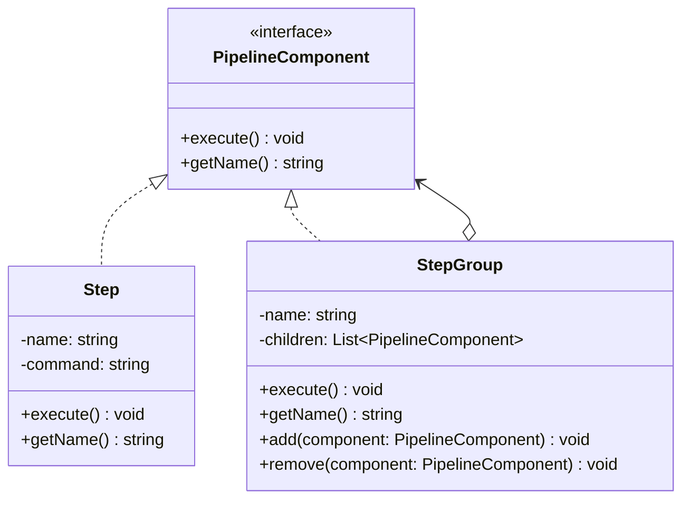

---
# Required
sidebar_position: 4
title: "Composite Pattern — Treating Parts and Wholes Uniformly"
description: >-
  Learn the Composite pattern to build tree structures where individual
  objects and groups share the same interface. Essential for hierarchies.

# SEO
keywords:
  - composite pattern
  - composite design pattern
  - tree structure pattern
  - part whole hierarchy
  - when to use composite

difficulty: intermediate
category: structural
related_solid: [OCP, SRP]

# Social sharing
og_title: "Composite Pattern: Treating Parts and Wholes Uniformly"
og_description: "Build tree structures with a unified interface for leaves and branches."
og_image: "/img/social-card.svg"

# Content management
date_published: 2026-01-25
date_modified: 2026-01-25
author: shivam
reading_time: 13
content_type: explanation
---

# Composite Pattern

<PatternMeta>
  <Difficulty level="intermediate" />
  <TimeToRead minutes={13} />
  <Prerequisites patterns={["Decorator"]} />
</PatternMeta>

The pipeline system that kept growing special cases taught me why Composite exists.

At NVIDIA, our CI/CD pipelines had steps. Simple enough at first—each pipeline was a list of steps, executed in order. Then teams wanted parallel steps. And conditional steps. And steps that contained other steps (for reusable "stage" templates). Each new feature added special-case logic:

```python
def execute_pipeline(pipeline):
    for item in pipeline.items:
        if isinstance(item, Step):
            item.execute()
        elif isinstance(item, ParallelGroup):
            execute_parallel(item.steps)
        elif isinstance(item, ConditionalGroup):
            if evaluate_condition(item.condition):
                for step in item.steps:
                    execute_step(step)  # But wait, what if step is a group?
        elif isinstance(item, StageTemplate):
            # Recursively handle template contents...
```

Every new container type required updating every place that processed pipelines. The code was fragile—add a new type, and you'd miss some code path. The tests had to check every combination.

**Composite eliminates these special cases.** Everything is a "pipeline component"—whether it's a single step or a group of steps. You call `execute()` on any component, and it does the right thing. No type checking. No special cases. Just a uniform interface.

---

## What Is the Composite Pattern?

> **Definition:** Composite lets you treat individual objects and compositions of objects uniformly by giving them a shared interface.

Both leaves (single items) and composites (groups of items) implement the same interface. Clients call the same methods regardless of whether they're dealing with one item or a tree of items.

**The key insight: Composite makes recursive structures feel flat.** You don't need to know if you're handling a leaf or a branch. You just call the interface method, and the structure handles itself.

---

## Structure



### Key Components

| Component | Role |
|-----------|------|
| **Component** (`PipelineComponent`) | Common interface for both leaves and composites |
| **Leaf** (`Step`) | Individual item with no children |
| **Composite** (`StepGroup`) | Contains children, delegates operations to them |

### SOLID Principles Connection

- **Open/Closed:** Add new component types without changing client code
- **Single Responsibility:** Tree management is in the composite, not in clients

---

## When to Use Composite

✅ **Use it when:**

- You have a tree or hierarchy structure
- Clients should treat individual objects and groups uniformly
- You want recursive operations (render, execute, sum) over the structure
- You're finding yourself writing type checks like `if isinstance(x, Container)`

❌ **Don't use it when:**

- The structure is flat (no nesting)
- Leaves and composites genuinely need different interfaces
- The uniformity would hide important distinctions

**Rule of thumb:** If you're building something that has a "contains" relationship and both containers and items need the same operations, Composite fits.

---

## Implementation

<CodeTabs>
  <TabItem value="python" label="Python">
    ```python
    from abc import ABC, abstractmethod
    from typing import List


    class PipelineComponent(ABC):
        """Common interface for steps and groups."""
        
        @abstractmethod
        def execute(self) -> None:
            """Execute this component."""
            pass
        
        @abstractmethod
        def get_name(self) -> str:
            """Return component name."""
            pass
        
        def get_estimated_duration(self) -> int:
            """Return estimated duration in seconds."""
            return 0


    class Step(PipelineComponent):
        """Leaf: a single pipeline step."""
        
        def __init__(self, name: str, command: str, duration: int = 60) -> None:
            self.name = name
            self.command = command
            self.duration = duration
        
        def execute(self) -> None:
            print(f"Executing step: {self.name}")
            print(f"  Running: {self.command}")
        
        def get_name(self) -> str:
            return self.name
        
        def get_estimated_duration(self) -> int:
            return self.duration


    class StepGroup(PipelineComponent):
        """Composite: a group of pipeline components."""
        
        def __init__(self, name: str) -> None:
            self.name = name
            self.children: List[PipelineComponent] = []
        
        def add(self, component: PipelineComponent) -> None:
            self.children.append(component)
        
        def remove(self, component: PipelineComponent) -> None:
            self.children.remove(component)
        
        def execute(self) -> None:
            print(f"Executing group: {self.name}")
            for child in self.children:
                child.execute()
            print(f"Finished group: {self.name}")
        
        def get_name(self) -> str:
            return self.name
        
        def get_estimated_duration(self) -> int:
            return sum(child.get_estimated_duration() for child in self.children)


    class ParallelGroup(StepGroup):
        """Composite variant: executes children in parallel."""
        
        def execute(self) -> None:
            print(f"Executing in parallel: {self.name}")
            # In reality, this would use threading/async
            for child in self.children:
                print(f"  [parallel] ", end="")
                child.execute()
        
        def get_estimated_duration(self) -> int:
            # Parallel execution: duration is the max, not the sum
            if not self.children:
                return 0
            return max(child.get_estimated_duration() for child in self.children)


    # Usage: build a pipeline
    pipeline = StepGroup("main-pipeline")

    # Add simple steps
    pipeline.add(Step("checkout", "git checkout main", duration=10))
    pipeline.add(Step("install", "npm install", duration=120))

    # Add a parallel group for tests
    test_group = ParallelGroup("tests")
    test_group.add(Step("unit-tests", "npm run test:unit", duration=60))
    test_group.add(Step("integration-tests", "npm run test:integration", duration=180))
    test_group.add(Step("lint", "npm run lint", duration=30))
    pipeline.add(test_group)

    # Add a nested group for deployment
    deploy_group = StepGroup("deploy")
    deploy_group.add(Step("build", "npm run build", duration=90))
    deploy_group.add(Step("push", "docker push", duration=60))
    deploy_group.add(Step("deploy", "kubectl apply", duration=30))
    pipeline.add(deploy_group)

    # Execute the entire pipeline—no type checking needed
    pipeline.execute()

    # Get total estimated duration
    print(f"\nEstimated duration: {pipeline.get_estimated_duration()} seconds")
    ```
  </TabItem>
  <TabItem value="typescript" label="TypeScript">
    ```typescript
    interface PipelineComponent {
      execute(): void;
      getName(): string;
      getEstimatedDuration(): number;
    }

    class Step implements PipelineComponent {
      constructor(
        private name: string,
        private command: string,
        private duration: number = 60
      ) {}

      execute(): void {
        console.log(`Executing step: ${this.name}`);
        console.log(`  Running: ${this.command}`);
      }

      getName(): string {
        return this.name;
      }

      getEstimatedDuration(): number {
        return this.duration;
      }
    }

    class StepGroup implements PipelineComponent {
      protected children: PipelineComponent[] = [];

      constructor(protected name: string) {}

      add(component: PipelineComponent): void {
        this.children.push(component);
      }

      remove(component: PipelineComponent): void {
        const index = this.children.indexOf(component);
        if (index > -1) {
          this.children.splice(index, 1);
        }
      }

      execute(): void {
        console.log(`Executing group: ${this.name}`);
        this.children.forEach((child) => child.execute());
        console.log(`Finished group: ${this.name}`);
      }

      getName(): string {
        return this.name;
      }

      getEstimatedDuration(): number {
        return this.children.reduce(
          (sum, child) => sum + child.getEstimatedDuration(),
          0
        );
      }
    }

    class ParallelGroup extends StepGroup {
      execute(): void {
        console.log(`Executing in parallel: ${this.name}`);
        this.children.forEach((child) => {
          console.log("  [parallel] ");
          child.execute();
        });
      }

      getEstimatedDuration(): number {
        if (this.children.length === 0) return 0;
        return Math.max(...this.children.map((c) => c.getEstimatedDuration()));
      }
    }
    ```
  </TabItem>
  <TabItem value="go" label="Go">
    ```go
    package pipeline

    import "fmt"

    // PipelineComponent is the component interface
    type PipelineComponent interface {
        Execute()
        GetName() string
        GetEstimatedDuration() int
    }

    // Step is a leaf component
    type Step struct {
        name     string
        command  string
        duration int
    }

    func NewStep(name, command string, duration int) *Step {
        return &Step{name: name, command: command, duration: duration}
    }

    func (s *Step) Execute() {
        fmt.Printf("Executing step: %s\n", s.name)
        fmt.Printf("  Running: %s\n", s.command)
    }

    func (s *Step) GetName() string           { return s.name }
    func (s *Step) GetEstimatedDuration() int { return s.duration }

    // StepGroup is a composite component
    type StepGroup struct {
        name     string
        children []PipelineComponent
    }

    func NewStepGroup(name string) *StepGroup {
        return &StepGroup{name: name, children: []PipelineComponent{}}
    }

    func (g *StepGroup) Add(component PipelineComponent) {
        g.children = append(g.children, component)
    }

    func (g *StepGroup) Execute() {
        fmt.Printf("Executing group: %s\n", g.name)
        for _, child := range g.children {
            child.Execute()
        }
        fmt.Printf("Finished group: %s\n", g.name)
    }

    func (g *StepGroup) GetName() string { return g.name }

    func (g *StepGroup) GetEstimatedDuration() int {
        total := 0
        for _, child := range g.children {
            total += child.GetEstimatedDuration()
        }
        return total
    }

    // ParallelGroup executes children in parallel
    type ParallelGroup struct {
        StepGroup
    }

    func NewParallelGroup(name string) *ParallelGroup {
        return &ParallelGroup{StepGroup{name: name, children: []PipelineComponent{}}}
    }

    func (p *ParallelGroup) Execute() {
        fmt.Printf("Executing in parallel: %s\n", p.name)
        for _, child := range p.children {
            fmt.Print("  [parallel] ")
            child.Execute()
        }
    }

    func (p *ParallelGroup) GetEstimatedDuration() int {
        max := 0
        for _, child := range p.children {
            if d := child.GetEstimatedDuration(); d > max {
                max = d
            }
        }
        return max
    }
    ```
  </TabItem>
  <TabItem value="java" label="Java">
    ```java
    import java.util.*;

    interface PipelineComponent {
        void execute();
        String getName();
        int getEstimatedDuration();
    }

    class Step implements PipelineComponent {
        private final String name;
        private final String command;
        private final int duration;

        Step(String name, String command, int duration) {
            this.name = name;
            this.command = command;
            this.duration = duration;
        }

        @Override
        public void execute() {
            System.out.printf("Executing step: %s%n", name);
            System.out.printf("  Running: %s%n", command);
        }

        @Override
        public String getName() { return name; }

        @Override
        public int getEstimatedDuration() { return duration; }
    }

    class StepGroup implements PipelineComponent {
        protected final String name;
        protected final List<PipelineComponent> children = new ArrayList<>();

        StepGroup(String name) { this.name = name; }

        void add(PipelineComponent component) {
            children.add(component);
        }

        @Override
        public void execute() {
            System.out.printf("Executing group: %s%n", name);
            children.forEach(PipelineComponent::execute);
            System.out.printf("Finished group: %s%n", name);
        }

        @Override
        public String getName() { return name; }

        @Override
        public int getEstimatedDuration() {
            return children.stream()
                .mapToInt(PipelineComponent::getEstimatedDuration)
                .sum();
        }
    }

    class ParallelGroup extends StepGroup {
        ParallelGroup(String name) { super(name); }

        @Override
        public void execute() {
            System.out.printf("Executing in parallel: %s%n", name);
            children.forEach(child -> {
                System.out.print("  [parallel] ");
                child.execute();
            });
        }

        @Override
        public int getEstimatedDuration() {
            return children.stream()
                .mapToInt(PipelineComponent::getEstimatedDuration)
                .max()
                .orElse(0);
        }
    }
    ```
  </TabItem>
  <TabItem value="csharp" label="C#">
    ```csharp
    public interface IPipelineComponent
    {
        void Execute();
        string GetName();
        int GetEstimatedDuration();
    }

    public class Step : IPipelineComponent
    {
        private readonly string _name;
        private readonly string _command;
        private readonly int _duration;

        public Step(string name, string command, int duration = 60)
        {
            _name = name;
            _command = command;
            _duration = duration;
        }

        public void Execute()
        {
            Console.WriteLine($"Executing step: {_name}");
            Console.WriteLine($"  Running: {_command}");
        }

        public string GetName() => _name;
        public int GetEstimatedDuration() => _duration;
    }

    public class StepGroup : IPipelineComponent
    {
        protected readonly string Name;
        protected readonly List<IPipelineComponent> Children = new();

        public StepGroup(string name) { Name = name; }

        public void Add(IPipelineComponent component) => Children.Add(component);

        public virtual void Execute()
        {
            Console.WriteLine($"Executing group: {Name}");
            Children.ForEach(c => c.Execute());
            Console.WriteLine($"Finished group: {Name}");
        }

        public string GetName() => Name;

        public virtual int GetEstimatedDuration() =>
            Children.Sum(c => c.GetEstimatedDuration());
    }

    public class ParallelGroup : StepGroup
    {
        public ParallelGroup(string name) : base(name) { }

        public override void Execute()
        {
            Console.WriteLine($"Executing in parallel: {Name}");
            Children.ForEach(c =>
            {
                Console.Write("  [parallel] ");
                c.Execute();
            });
        }

        public override int GetEstimatedDuration() =>
            Children.Count == 0 ? 0 : Children.Max(c => c.GetEstimatedDuration());
    }
    ```
  </TabItem>
</CodeTabs>

---

## Real-World Example: UI Component Trees

Every UI framework uses Composite. A button is a component. A panel containing buttons is also a component. A window containing panels is also a component. They all render the same way:

```python
class UIComponent(ABC):
    @abstractmethod
    def render(self) -> str:
        pass

class Button(UIComponent):
    def __init__(self, label: str):
        self.label = label
    
    def render(self) -> str:
        return f"<button>{self.label}</button>"

class Panel(UIComponent):
    def __init__(self):
        self.children: list[UIComponent] = []
    
    def add(self, component: UIComponent) -> None:
        self.children.append(component)
    
    def render(self) -> str:
        inner = "".join(child.render() for child in self.children)
        return f"<div class='panel'>{inner}</div>"

# Usage
sidebar = Panel()
sidebar.add(Button("Home"))
sidebar.add(Button("Settings"))

main_content = Panel()
main_content.add(sidebar)
main_content.add(Button("Submit"))

# Render the entire tree with one call
html = main_content.render()
```

---

## Performance Considerations

| Aspect | Impact | Notes |
|--------|--------|-------|
| Memory | Medium | Tree nodes can be numerous |
| Runtime | Medium | Recursive traversal cost |
| Complexity | Medium | Requires careful tree management |

**Watch for:** Deep trees with many levels can cause stack overflow with recursive implementations. Consider iterative traversal for very deep structures.

---

## Testing This Pattern

Test leaves and composites separately, then test composition:

```python
def test_step_executes():
    step = Step("build", "make build", 60)
    step.execute()  # Should not raise
    assert step.get_estimated_duration() == 60


def test_group_aggregates_duration():
    group = StepGroup("test")
    group.add(Step("a", "cmd", 30))
    group.add(Step("b", "cmd", 60))
    
    assert group.get_estimated_duration() == 90


def test_parallel_group_uses_max_duration():
    group = ParallelGroup("parallel")
    group.add(Step("fast", "cmd", 10))
    group.add(Step("slow", "cmd", 100))
    
    assert group.get_estimated_duration() == 100


def test_nested_structure():
    root = StepGroup("root")
    child = StepGroup("child")
    child.add(Step("leaf", "cmd", 50))
    root.add(child)
    
    assert root.get_estimated_duration() == 50
```

---

## Common Mistakes

### 1. Type checking defeats the purpose

```python
# Wrong: special-casing types
def process(component: PipelineComponent):
    if isinstance(component, Step):
        component.execute()
    elif isinstance(component, StepGroup):
        for child in component.children:
            process(child)
```

The whole point is to avoid this. Just call `component.execute()`.

### 2. Forgetting to handle cycles

```python
group_a = StepGroup("a")
group_b = StepGroup("b")
group_a.add(group_b)
group_b.add(group_a)  # Cycle! execute() will infinite loop
```

Either prevent cycles at insertion time, or track visited nodes during traversal.

### 3. Putting too much logic in the composite

```python
class StepGroup:
    def execute(self):
        # 200 lines of orchestration logic...
```

The composite should delegate to children and coordinate, not contain significant business logic.

---

## Related Patterns

| Pattern | Relationship |
|---------|--------------|
| **Decorator** | Also wraps components but adds behavior |
| **Iterator** | Often used to traverse composites |
| **Visitor** | Adds operations to composite structures without modifying them |
| **Command** | Commands are often organized in composite structures |

---

## Key Takeaways

- **Composite lets you treat leaves and branches uniformly.** No type checking, no special cases.

- **Use it for tree structures with recursive operations.** Pipelines, UI trees, file systems, org charts.

- **Both leaves and composites implement the same interface.** That's the pattern's power.

- **Watch for cycles and deep recursion.** They're the main pitfalls.

---

## Navigation

- **Previous:** [Bridge Pattern](/docs/design-patterns/structural/bridge)
- **Next:** [Decorator Pattern](/docs/design-patterns/structural/decorator)
