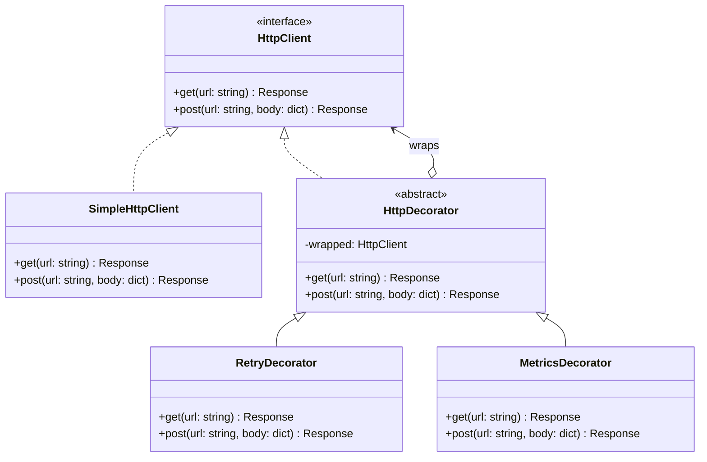

---
# Required
sidebar_position: 5
title: "Decorator Pattern — Adding Behavior Without Inheritance"
description: >-
  Learn the Decorator pattern to add responsibilities dynamically while keeping
  the same interface. Perfect for cross-cutting concerns.

# SEO
keywords:
  - decorator pattern
  - decorator design pattern
  - add behavior dynamically
  - wrapper pattern
  - when to use decorator

difficulty: intermediate
category: structural
related_solid: [OCP, SRP]

# Social sharing
og_title: "Decorator Pattern: Adding Behavior Dynamically"
og_description: "Extend behavior without modifying the original class."
og_image: "/img/social-card.svg"

# Content management
date_published: 2026-01-25
date_modified: 2026-01-25
author: shivam
reading_time: 14
content_type: explanation
---

# Decorator Pattern

<PatternMeta>
  <Difficulty level="intermediate" />
  <TimeToRead minutes={14} />
  <Prerequisites patterns={["Adapter"]} />
</PatternMeta>

The HTTP client that needed everything taught me why Decorator exists.

At NVIDIA, our CI/CD platform made calls to dozens of internal services. Each call needed the same things: retry logic for transient failures, timeout handling, metrics collection, request/response logging, and authentication header injection. The naive approach was inheritance:

```python
class HttpClient:
    def get(self, url): ...

class HttpClientWithRetry(HttpClient):
    def get(self, url):
        # Retry logic + super().get(url)

class HttpClientWithRetryAndMetrics(HttpClientWithRetry):
    def get(self, url):
        # Metrics + super().get(url)

class HttpClientWithRetryAndMetricsAndLogging(HttpClientWithRetryAndMetrics):
    # You see where this is going...
```

By the time we needed all five features, the inheritance chain was five classes deep. Worse, some services needed logging but not metrics. Others needed metrics but not retries. Every combination required a new class. We had twelve variants and counting.

**Decorator solves this by composing behaviors instead of inheriting them.** Each concern becomes a wrapper you can add or remove independently:

```python
client = LoggingDecorator(
    MetricsDecorator(
        RetryDecorator(
            TimeoutDecorator(
                AuthDecorator(HttpClient())
            )
        )
    )
)
```

Now adding or removing a concern is just adding or removing a wrapper. No new classes for each combination.

---

## What Is the Decorator Pattern?

> **Definition:** Decorator attaches additional responsibilities to an object dynamically. It provides a flexible alternative to subclassing for extending functionality.

A decorator wraps an object and implements the same interface. It delegates to the wrapped object but can add behavior before or after the delegation.

**The key insight: Decorators are stackable and composable.** Each decorator does one thing. You build complex behavior by combining simple decorators.

---

## Structure



### Key Components

| Component | Role |
|-----------|------|
| **Component Interface** (`HttpClient`) | The contract that both the concrete component and decorators implement |
| **Concrete Component** (`SimpleHttpClient`) | The core object being decorated |
| **Decorator Base** (`HttpDecorator`) | Holds a reference to a wrapped component |
| **Concrete Decorators** (`RetryDecorator`, `MetricsDecorator`) | Add specific behavior before/after delegating |

### SOLID Principles Connection

- **Open/Closed:** Add new behavior without modifying existing classes
- **Single Responsibility:** Each decorator has exactly one concern

---

## When to Use Decorator

✅ **Use it when:**

- You need to add responsibilities dynamically
- Extension by subclassing creates too many combinations
- You want to enable/disable features at runtime
- You have cross-cutting concerns (logging, metrics, caching, auth)

❌ **Don't use it when:**

- The behavior is simple and won't change
- Decorator chains become deep and confusing
- You need to modify the core component's behavior, not extend it
- The number of combinations is small and fixed

**Rule of thumb:** If you're creating classes named `XWithYAndZ`, you need Decorator instead.

---

## Implementation

<CodeTabs>
  <TabItem value="python" label="Python">
    ```python
    from abc import ABC, abstractmethod
    from dataclasses import dataclass
    from time import perf_counter, sleep
    from typing import Optional
    import logging


    @dataclass
    class Response:
        status: int
        body: str


    class HttpClient(ABC):
        """Component interface."""
        
        @abstractmethod
        def get(self, url: str) -> Response:
            pass
        
        @abstractmethod
        def post(self, url: str, body: dict) -> Response:
            pass


    class SimpleHttpClient(HttpClient):
        """Concrete component."""
        
        def get(self, url: str) -> Response:
            # Real implementation would use requests/httpx
            print(f"GET {url}")
            return Response(status=200, body='{"data": "value"}')
        
        def post(self, url: str, body: dict) -> Response:
            print(f"POST {url}")
            return Response(status=201, body='{"created": true}')


    class HttpDecorator(HttpClient):
        """Base decorator that delegates to wrapped client."""
        
        def __init__(self, wrapped: HttpClient) -> None:
            self._wrapped = wrapped
        
        def get(self, url: str) -> Response:
            return self._wrapped.get(url)
        
        def post(self, url: str, body: dict) -> Response:
            return self._wrapped.post(url, body)


    class RetryDecorator(HttpDecorator):
        """Adds retry logic with exponential backoff."""
        
        def __init__(self, wrapped: HttpClient, max_retries: int = 3) -> None:
            super().__init__(wrapped)
            self._max_retries = max_retries
        
        def get(self, url: str) -> Response:
            return self._with_retry(lambda: super(RetryDecorator, self).get(url))
        
        def post(self, url: str, body: dict) -> Response:
            return self._with_retry(lambda: super(RetryDecorator, self).post(url, body))
        
        def _with_retry(self, operation) -> Response:
            last_error: Optional[Exception] = None
            for attempt in range(self._max_retries):
                try:
                    return operation()
                except Exception as e:
                    last_error = e
                    wait_time = 2 ** attempt
                    print(f"Retry {attempt + 1}/{self._max_retries} after {wait_time}s")
                    sleep(wait_time)
            raise last_error


    class MetricsDecorator(HttpDecorator):
        """Collects timing and count metrics."""
        
        def __init__(self, wrapped: HttpClient, metrics_client) -> None:
            super().__init__(wrapped)
            self._metrics = metrics_client
        
        def get(self, url: str) -> Response:
            return self._with_metrics("GET", url, lambda: super(MetricsDecorator, self).get(url))
        
        def post(self, url: str, body: dict) -> Response:
            return self._with_metrics("POST", url, lambda: super(MetricsDecorator, self).post(url, body))
        
        def _with_metrics(self, method: str, url: str, operation) -> Response:
            start = perf_counter()
            try:
                response = operation()
                self._metrics.increment(f"http.{method.lower()}.success")
                return response
            except Exception:
                self._metrics.increment(f"http.{method.lower()}.failure")
                raise
            finally:
                duration = perf_counter() - start
                self._metrics.timing(f"http.{method.lower()}.duration", duration)


    class LoggingDecorator(HttpDecorator):
        """Logs requests and responses."""
        
        def __init__(self, wrapped: HttpClient, logger: logging.Logger) -> None:
            super().__init__(wrapped)
            self._logger = logger
        
        def get(self, url: str) -> Response:
            self._logger.info(f"GET {url}")
            response = super().get(url)
            self._logger.info(f"Response: {response.status}")
            return response
        
        def post(self, url: str, body: dict) -> Response:
            self._logger.info(f"POST {url}")
            response = super().post(url, body)
            self._logger.info(f"Response: {response.status}")
            return response


    # Usage: compose decorators
    logger = logging.getLogger("http")

    class FakeMetrics:
        def increment(self, name): print(f"Metric: {name}")
        def timing(self, name, value): print(f"Timing: {name}={value:.3f}s")

    client = LoggingDecorator(
        MetricsDecorator(
            RetryDecorator(
                SimpleHttpClient(),
                max_retries=3
            ),
            metrics_client=FakeMetrics()
        ),
        logger=logger
    )

    # Use like any HttpClient
    response = client.get("https://api.example.com/data")
    ```
  </TabItem>
  <TabItem value="typescript" label="TypeScript">
    ```typescript
    interface Response {
      status: number;
      body: string;
    }

    interface HttpClient {
      get(url: string): Promise<Response>;
      post(url: string, body: object): Promise<Response>;
    }

    class SimpleHttpClient implements HttpClient {
      async get(url: string): Promise<Response> {
        console.log(`GET ${url}`);
        return { status: 200, body: '{"data": "value"}' };
      }

      async post(url: string, body: object): Promise<Response> {
        console.log(`POST ${url}`);
        return { status: 201, body: '{"created": true}' };
      }
    }

    abstract class HttpDecorator implements HttpClient {
      constructor(protected wrapped: HttpClient) {}

      async get(url: string): Promise<Response> {
        return this.wrapped.get(url);
      }

      async post(url: string, body: object): Promise<Response> {
        return this.wrapped.post(url, body);
      }
    }

    class RetryDecorator extends HttpDecorator {
      constructor(wrapped: HttpClient, private maxRetries = 3) {
        super(wrapped);
      }

      async get(url: string): Promise<Response> {
        return this.withRetry(() => super.get(url));
      }

      async post(url: string, body: object): Promise<Response> {
        return this.withRetry(() => super.post(url, body));
      }

      private async withRetry(operation: () => Promise<Response>): Promise<Response> {
        let lastError: Error | null = null;
        for (let attempt = 0; attempt < this.maxRetries; attempt++) {
          try {
            return await operation();
          } catch (e) {
            lastError = e as Error;
            const waitTime = 2 ** attempt * 1000;
            console.log(`Retry ${attempt + 1}/${this.maxRetries} after ${waitTime}ms`);
            await new Promise((r) => setTimeout(r, waitTime));
          }
        }
        throw lastError;
      }
    }

    class MetricsDecorator extends HttpDecorator {
      constructor(wrapped: HttpClient, private metrics: MetricsClient) {
        super(wrapped);
      }

      async get(url: string): Promise<Response> {
        const start = Date.now();
        try {
          const response = await super.get(url);
          this.metrics.increment("http.get.success");
          return response;
        } catch (e) {
          this.metrics.increment("http.get.failure");
          throw e;
        } finally {
          this.metrics.timing("http.get.duration", Date.now() - start);
        }
      }
    }

    class LoggingDecorator extends HttpDecorator {
      async get(url: string): Promise<Response> {
        console.log(`[LOG] GET ${url}`);
        const response = await super.get(url);
        console.log(`[LOG] Response: ${response.status}`);
        return response;
      }
    }

    // Usage
    const client = new LoggingDecorator(
      new MetricsDecorator(
        new RetryDecorator(new SimpleHttpClient(), 3),
        metricsClient
      )
    );
    ```
  </TabItem>
  <TabItem value="go" label="Go">
    ```go
    package http

    import (
        "fmt"
        "time"
    )

    type Response struct {
        Status int
        Body   string
    }

    // HttpClient is the component interface
    type HttpClient interface {
        Get(url string) (*Response, error)
        Post(url string, body map[string]interface{}) (*Response, error)
    }

    // SimpleHttpClient is the concrete component
    type SimpleHttpClient struct{}

    func (c *SimpleHttpClient) Get(url string) (*Response, error) {
        fmt.Printf("GET %s\n", url)
        return &Response{Status: 200, Body: `{"data": "value"}`}, nil
    }

    func (c *SimpleHttpClient) Post(url string, body map[string]interface{}) (*Response, error) {
        fmt.Printf("POST %s\n", url)
        return &Response{Status: 201, Body: `{"created": true}`}, nil
    }

    // RetryDecorator adds retry logic
    type RetryDecorator struct {
        wrapped    HttpClient
        maxRetries int
    }

    func NewRetryDecorator(wrapped HttpClient, maxRetries int) *RetryDecorator {
        return &RetryDecorator{wrapped: wrapped, maxRetries: maxRetries}
    }

    func (d *RetryDecorator) Get(url string) (*Response, error) {
        return d.withRetry(func() (*Response, error) {
            return d.wrapped.Get(url)
        })
    }

    func (d *RetryDecorator) Post(url string, body map[string]interface{}) (*Response, error) {
        return d.withRetry(func() (*Response, error) {
            return d.wrapped.Post(url, body)
        })
    }

    func (d *RetryDecorator) withRetry(operation func() (*Response, error)) (*Response, error) {
        var lastErr error
        for attempt := 0; attempt < d.maxRetries; attempt++ {
            resp, err := operation()
            if err == nil {
                return resp, nil
            }
            lastErr = err
            waitTime := time.Duration(1<<attempt) * time.Second
            fmt.Printf("Retry %d/%d after %v\n", attempt+1, d.maxRetries, waitTime)
            time.Sleep(waitTime)
        }
        return nil, lastErr
    }

    // LoggingDecorator adds logging
    type LoggingDecorator struct {
        wrapped HttpClient
    }

    func NewLoggingDecorator(wrapped HttpClient) *LoggingDecorator {
        return &LoggingDecorator{wrapped: wrapped}
    }

    func (d *LoggingDecorator) Get(url string) (*Response, error) {
        fmt.Printf("[LOG] GET %s\n", url)
        resp, err := d.wrapped.Get(url)
        if err == nil {
            fmt.Printf("[LOG] Response: %d\n", resp.Status)
        }
        return resp, err
    }

    func (d *LoggingDecorator) Post(url string, body map[string]interface{}) (*Response, error) {
        fmt.Printf("[LOG] POST %s\n", url)
        resp, err := d.wrapped.Post(url, body)
        if err == nil {
            fmt.Printf("[LOG] Response: %d\n", resp.Status)
        }
        return resp, err
    }
    ```
  </TabItem>
  <TabItem value="java" label="Java">
    ```java
    interface HttpClient {
        Response get(String url);
        Response post(String url, Map<String, Object> body);
    }

    record Response(int status, String body) {}

    class SimpleHttpClient implements HttpClient {
        @Override
        public Response get(String url) {
            System.out.printf("GET %s%n", url);
            return new Response(200, "{\"data\": \"value\"}");
        }

        @Override
        public Response post(String url, Map<String, Object> body) {
            System.out.printf("POST %s%n", url);
            return new Response(201, "{\"created\": true}");
        }
    }

    abstract class HttpDecorator implements HttpClient {
        protected final HttpClient wrapped;
        
        protected HttpDecorator(HttpClient wrapped) {
            this.wrapped = wrapped;
        }

        @Override
        public Response get(String url) {
            return wrapped.get(url);
        }

        @Override
        public Response post(String url, Map<String, Object> body) {
            return wrapped.post(url, body);
        }
    }

    class RetryDecorator extends HttpDecorator {
        private final int maxRetries;

        RetryDecorator(HttpClient wrapped, int maxRetries) {
            super(wrapped);
            this.maxRetries = maxRetries;
        }

        @Override
        public Response get(String url) {
            return withRetry(() -> super.get(url));
        }

        private Response withRetry(java.util.function.Supplier<Response> operation) {
            Exception lastError = null;
            for (int attempt = 0; attempt < maxRetries; attempt++) {
                try {
                    return operation.get();
                } catch (Exception e) {
                    lastError = e;
                    long waitTime = (long) Math.pow(2, attempt) * 1000;
                    System.out.printf("Retry %d/%d after %dms%n", attempt + 1, maxRetries, waitTime);
                    try { Thread.sleep(waitTime); } catch (InterruptedException ie) {}
                }
            }
            throw new RuntimeException(lastError);
        }
    }

    class LoggingDecorator extends HttpDecorator {
        LoggingDecorator(HttpClient wrapped) { super(wrapped); }

        @Override
        public Response get(String url) {
            System.out.printf("[LOG] GET %s%n", url);
            Response response = super.get(url);
            System.out.printf("[LOG] Response: %d%n", response.status());
            return response;
        }
    }
    ```
  </TabItem>
  <TabItem value="csharp" label="C#">
    ```csharp
    public interface IHttpClient
    {
        Task<Response> GetAsync(string url);
        Task<Response> PostAsync(string url, object body);
    }

    public record Response(int Status, string Body);

    public class SimpleHttpClient : IHttpClient
    {
        public Task<Response> GetAsync(string url)
        {
            Console.WriteLine($"GET {url}");
            return Task.FromResult(new Response(200, "{\"data\": \"value\"}"));
        }

        public Task<Response> PostAsync(string url, object body)
        {
            Console.WriteLine($"POST {url}");
            return Task.FromResult(new Response(201, "{\"created\": true}"));
        }
    }

    public abstract class HttpDecorator : IHttpClient
    {
        protected readonly IHttpClient Wrapped;

        protected HttpDecorator(IHttpClient wrapped) { Wrapped = wrapped; }

        public virtual Task<Response> GetAsync(string url) => Wrapped.GetAsync(url);
        public virtual Task<Response> PostAsync(string url, object body) => Wrapped.PostAsync(url, body);
    }

    public class RetryDecorator : HttpDecorator
    {
        private readonly int _maxRetries;

        public RetryDecorator(IHttpClient wrapped, int maxRetries = 3) : base(wrapped)
        {
            _maxRetries = maxRetries;
        }

        public override Task<Response> GetAsync(string url) =>
            WithRetryAsync(() => base.GetAsync(url));

        private async Task<Response> WithRetryAsync(Func<Task<Response>> operation)
        {
            Exception lastError = null;
            for (int attempt = 0; attempt < _maxRetries; attempt++)
            {
                try { return await operation(); }
                catch (Exception e)
                {
                    lastError = e;
                    var waitTime = (int)Math.Pow(2, attempt) * 1000;
                    Console.WriteLine($"Retry {attempt + 1}/{_maxRetries} after {waitTime}ms");
                    await Task.Delay(waitTime);
                }
            }
            throw lastError!;
        }
    }

    public class LoggingDecorator : HttpDecorator
    {
        public LoggingDecorator(IHttpClient wrapped) : base(wrapped) { }

        public override async Task<Response> GetAsync(string url)
        {
            Console.WriteLine($"[LOG] GET {url}");
            var response = await base.GetAsync(url);
            Console.WriteLine($"[LOG] Response: {response.Status}");
            return response;
        }
    }
    ```
  </TabItem>
</CodeTabs>

---

## Real-World Example: Observability Wrappers

On our observability platform, every exporter (Prometheus, Elasticsearch, custom backends) needed the same cross-cutting concerns. Decorators made this composable:

```python
# Base exporter
class MetricsExporter(ABC):
    @abstractmethod
    def export(self, metrics: list[Metric]) -> ExportResult:
        pass

# Wrap with observability features
exporter = CircuitBreakerDecorator(
    BatchingDecorator(
        RetryDecorator(
            MetricsDecorator(
                PrometheusExporter(endpoint="http://prometheus:9090"),
                metrics_client=internal_metrics
            ),
            max_retries=3
        ),
        batch_size=1000,
        flush_interval=10
    ),
    failure_threshold=5,
    recovery_timeout=30
)
```

Each decorator is tested independently. Each can be added or removed based on the exporter's needs. New cross-cutting concerns become new decorators, not modifications to existing code.

---

## Performance Considerations

| Aspect | Impact | Notes |
|--------|--------|-------|
| Memory | Medium | One wrapper object per decorator |
| Runtime | Low to Medium | One method call per decorator in chain |
| Complexity | Medium | Deep chains can be hard to debug |

**Watch for:** Long decorator chains can make stack traces confusing. Keep chains to 3-4 decorators when possible.

---

## Testing This Pattern

Test each decorator in isolation, then test composition:

```python
def test_retry_decorator_retries_on_failure():
    class FailingClient(HttpClient):
        def __init__(self):
            self.attempts = 0
        def get(self, url):
            self.attempts += 1
            if self.attempts < 3:
                raise ConnectionError("Simulated failure")
            return Response(200, "success")
    
    inner = FailingClient()
    client = RetryDecorator(inner, max_retries=3)
    
    response = client.get("http://example.com")
    
    assert response.status == 200
    assert inner.attempts == 3


def test_decorators_compose():
    logged = []
    class LogCapture(HttpDecorator):
        def get(self, url):
            logged.append(url)
            return super().get(url)
    
    client = LogCapture(MetricsDecorator(SimpleHttpClient(), metrics))
    client.get("http://example.com")
    
    assert len(logged) == 1
```

---

## Common Mistakes

### 1. Decorator chain that swallows errors

```python
class BadLoggingDecorator(HttpDecorator):
    def get(self, url):
        try:
            return super().get(url)
        except Exception as e:
            self.logger.error(e)
            # Bug: error is logged but not re-raised
            return Response(500, "error")  # Silently fails
```

Decorators should observe, not swallow. Re-raise exceptions after logging.

### 2. Order-dependent decorators without documentation

```python
# Does retry happen before or after metrics? Before or after logging?
client = MetricsDecorator(RetryDecorator(LoggingDecorator(base)))
```

If order matters (it usually does), document it. Consider builder helpers:

```python
client = HttpClientBuilder(base)\
    .with_logging()\
    .with_retry(max_retries=3)\
    .with_metrics()\
    .build()
```

### 3. Mixing responsibilities in one decorator

```python
class DoEverythingDecorator(HttpDecorator):
    def get(self, url):
        self.logger.info(f"GET {url}")
        self.metrics.increment("requests")
        for attempt in range(3):
            try:
                return super().get(url)
            except: ...
        # This is three decorators in one
```

One decorator, one responsibility. Split them up.

---

## Decorator vs. Related Patterns

| Pattern | Difference |
|---------|------------|
| **Adapter** | Changes interface; Decorator keeps same interface |
| **Proxy** | Controls access; Decorator adds behavior |
| **Composite** | Treats groups uniformly; Decorator wraps single objects |

---

## Key Takeaways

- **Decorator adds behavior without modifying existing code.** Each decorator is a single concern.

- **Decorators are composable.** Build complex behavior from simple, testable pieces.

- **Keep chains short.** More than 3-4 decorators becomes hard to debug.

- **Order matters.** Document and test the expected order.

---

## Navigation

- **Previous:** [Composite Pattern](/docs/design-patterns/structural/composite)
- **Next:** [Facade Pattern](/docs/design-patterns/structural/facade)
