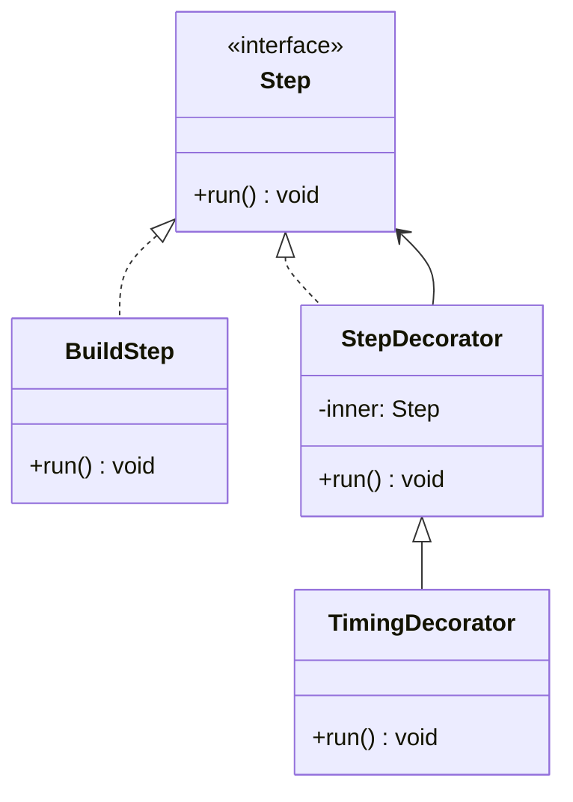

---
# Required
sidebar_position: 5
title: "Decorator Pattern — Add Behavior Without Inheritance"
description: >-
  Learn the Decorator pattern to add responsibilities dynamically while keeping
  the same interface. Includes multi-language examples and trade-offs.

# SEO
keywords:
  - decorator pattern
  - decorator design pattern
  - add behavior dynamically
  - wrapper pattern
  - when to use decorator

difficulty: intermediate
category: structural
related_solid: [OCP, SRP]

# Social sharing
og_title: "Decorator Pattern: Add Behavior Dynamically"
og_description: "Extend behavior without modifying the original class."
og_image: "/img/social-card.svg"

# Content management
date_published: 2026-01-25
date_modified: 2026-01-25
author: shivam
reading_time: 12
content_type: explanation
---

# Decorator Pattern

<PatternMeta>
  <Difficulty level="intermediate" />
  <TimeToRead minutes={12} />
  <Prerequisites patterns={["Adapter"]} />
</PatternMeta>

> **Definition:** The Decorator pattern wraps an object to add behavior dynamically while keeping the same interface.

---

## The Problem: Feature Combinations Without Class Explosion

In a CI/CD pipeline, we wanted to add retries, timing metrics, and audit logs around multiple steps. The naive approach was to subclass every step variant, but the combinations exploded.

**Decorator lets you layer behavior without rewriting the core logic.**

---

## What Is the Decorator Pattern?

Decorator wraps a component with another object that implements the same interface. Each decorator adds behavior before or after delegating to the wrapped component.

### Structure



### Key Components

- **Component Interface:** The common contract.
- **Concrete Component:** The core behavior.
- **Decorator Base:** Stores the wrapped component.
- **Concrete Decorators:** Add behavior.

### SOLID Principles Connection

- **OCP:** Add behavior without modifying existing code.
- **SRP:** Each decorator focuses on one responsibility.

---

## When to Use Decorator

- You need to add cross-cutting features dynamically.
- Subclassing creates too many combinations.
- You want to enable or disable features at runtime.

## When NOT to Use Decorator

- The behavior is simple and does not change.
- The stacking order would confuse maintainers.
- You need to modify core behavior rather than extend it.

---

## Implementation

<CodeTabs>
  <TabItem value="python" label="Python">
    ```python
    from time import perf_counter


    class Step:
        def run(self) -> None:
            raise NotImplementedError


    class BuildStep(Step):
        def run(self) -> None:
            print("build")


    class StepDecorator(Step):
        def __init__(self, inner: Step) -> None:
            self.inner = inner

        def run(self) -> None:
            self.inner.run()


    class TimingDecorator(StepDecorator):
        def run(self) -> None:
            start = perf_counter()
            super().run()
            print(f"took {perf_counter() - start:.2f}s")
    ```
  </TabItem>
  <TabItem value="typescript" label="TypeScript">
    ```typescript
    interface Step {
      run(): void;
    }

    class BuildStep implements Step {
      run(): void {
        console.log("build");
      }
    }

    class StepDecorator implements Step {
      constructor(protected inner: Step) {}
      run(): void {
        this.inner.run();
      }
    }

    class TimingDecorator extends StepDecorator {
      run(): void {
        const start = Date.now();
        super.run();
        console.log(`took ${Date.now() - start}ms`);
      }
    }
    ```
  </TabItem>
  <TabItem value="go" label="Go">
    ```go
    package pipeline

    import "time"

    type Step interface {
        Run()
    }

    type BuildStep struct{}

    func (b BuildStep) Run() {
        println("build")
    }

    type StepDecorator struct {
        Inner Step
    }

    func (d StepDecorator) Run() {
        d.Inner.Run()
    }

    type TimingDecorator struct {
        StepDecorator
    }

    func (t TimingDecorator) Run() {
        start := time.Now()
        t.Inner.Run()
        println("took", time.Since(start).String())
    }
    ```
  </TabItem>
  <TabItem value="java" label="Java">
    ```java
    interface Step { void run(); }

    class BuildStep implements Step {
        public void run() { System.out.println("build"); }
    }

    class StepDecorator implements Step {
        protected final Step inner;
        StepDecorator(Step inner) { this.inner = inner; }
        public void run() { inner.run(); }
    }

    class TimingDecorator extends StepDecorator {
        TimingDecorator(Step inner) { super(inner); }
        public void run() {
            long start = System.currentTimeMillis();
            super.run();
            System.out.println("took " + (System.currentTimeMillis() - start) + "ms");
        }
    }
    ```
  </TabItem>
  <TabItem value="csharp" label="C#">
    ```csharp
    public interface IStep { void Run(); }

    public class BuildStep : IStep
    {
        public void Run() => Console.WriteLine("build");
    }

    public class StepDecorator : IStep
    {
        protected readonly IStep Inner;
        public StepDecorator(IStep inner) { Inner = inner; }
        public virtual void Run() => Inner.Run();
    }

    public class TimingDecorator : StepDecorator
    {
        public TimingDecorator(IStep inner) : base(inner) {}
        public override void Run()
        {
            var start = DateTime.UtcNow;
            base.Run();
            Console.WriteLine($"took {(DateTime.UtcNow - start).TotalMilliseconds}ms");
        }
    }
    ```
  </TabItem>
</CodeTabs>

---

## Real-World Example: Observability Wrappers

In observability pipelines, each exporter needs logging, retries, and metrics. We used decorators to wrap exporters without changing their core implementations, enabling consistent cross-cutting behavior.

---

## Performance Considerations

| Aspect | Impact | Notes |
|--------|--------|-------|
| Memory | Medium | Extra wrapper objects |
| Runtime | Low to Medium | Indirection per call |
| Complexity | Medium | Order of decorators matters |

---

## Testing This Pattern

Test each decorator in isolation and verify ordering when stacked.

```python
def test_timing_decorator() -> None:
    step = TimingDecorator(BuildStep())
    step.run()
```

---

## Common Mistakes

- Building a decorator chain that hides errors.
- Mixing unrelated responsibilities in one decorator.
- Forgetting that decorator order changes behavior.

---

## Related Patterns

| Pattern | Relationship |
|---------|--------------|
| Adapter | Changes interface; Decorator keeps it |
| Facade | Simplifies subsystem rather than wrapping |
| Proxy | Controls access rather than adds behavior |

---

## Pattern Combinations

- **With Composite:** Decorate whole subtrees of components.
- **With Factory Method:** Create decorated variants cleanly.

---

## Try It Yourself

Wrap an API client with decorators for caching, retries, and logging, then experiment with ordering.

---

## Frequently Asked Questions

### Is Decorator the same as middleware?
They are similar in spirit. Middleware is often a specialized decorator chain.

### How many decorators is too many?
If you cannot explain the stack in one minute, it is too many.

### Can decorators change behavior?
Yes, but do it intentionally and document it.

### How do I test code using Decorator?
Test each decorator separately, then test a composed chain for ordering.

---

## Key Takeaways

- **Decorator adds behavior without changing the core interface.**
- **It avoids subclass explosion for feature combinations.**
- **Order matters, so keep the chain deliberate.**

---

## Downloads

- Decorator Cheat Sheet (Coming soon)
- Complete Code Examples (Coming soon)
- Practice Exercises (Coming soon)

---

## Navigation

- **Previous:** [Composite Pattern](/docs/design-patterns/structural/composite)
- **Next:** [Facade Pattern](/docs/design-patterns/structural/facade)
