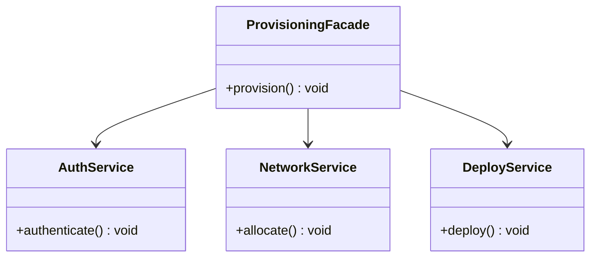

---
# Required
sidebar_position: 6
title: "Facade Pattern — Simplify Complex Subsystems"
description: >-
  Learn the Facade pattern to provide a simple interface over a complex
  subsystem. Includes multi-language examples and real-world guidance.

# SEO
keywords:
  - facade pattern
  - facade design pattern
  - simplify subsystem
  - interface simplification
  - when to use facade

difficulty: beginner
category: structural
related_solid: [SRP, DIP]

# Social sharing
og_title: "Facade Pattern: Simplify Complex Subsystems"
og_description: "Provide a clean interface over a complex subsystem."
og_image: "/img/social-card.svg"

# Content management
date_published: 2026-01-25
date_modified: 2026-01-25
author: shivam
reading_time: 11
content_type: explanation
---

# Facade Pattern

<PatternMeta>
  <Difficulty level="beginner" />
  <TimeToRead minutes={11} />
  <Prerequisites patterns={["Adapter"]} />
</PatternMeta>

> **Definition:** The Facade pattern provides a simplified interface to a complex subsystem.

---

## The Problem: Subsystems With Too Many Steps

When we rolled out a new cluster provisioning flow, the onboarding API had to call authentication, secrets, networking, and deployment services in a specific sequence. Every caller reimplemented the same flow and got it wrong in different ways.

**Facade gave us one safe, stable path.**

---

## What Is the Facade Pattern?

Facade is a high-level API that wraps a set of classes. It hides the complexity and exposes a single entry point.

### Structure



### Key Components

- **Facade:** The simplified API.
- **Subsystem Classes:** The underlying complexity.
- **Client:** Uses the facade instead of the subsystem directly.

### SOLID Principles Connection

- **SRP:** The facade encapsulates orchestration logic.
- **DIP:** Clients depend on the facade, not on every subsystem.

---

## When to Use Facade

- You need to simplify a complex workflow.
- Multiple clients call the same sequence of operations.
- You want to isolate callers from subsystem churn.

## When NOT to Use Facade

- The subsystem is simple and already clean.
- Callers need full control of the internal steps.
- The facade becomes a "god object" with too many methods.

---

## Implementation

<CodeTabs>
  <TabItem value="python" label="Python">
    ```python
    class AuthService:
        def authenticate(self) -> None:
            print("auth")


    class NetworkService:
        def allocate(self) -> None:
            print("network")


    class DeployService:
        def deploy(self) -> None:
            print("deploy")


    class ProvisioningFacade:
        def __init__(self) -> None:
            self.auth = AuthService()
            self.network = NetworkService()
            self.deploy = DeployService()

        def provision(self) -> None:
            self.auth.authenticate()
            self.network.allocate()
            self.deploy.deploy()
    ```
  </TabItem>
  <TabItem value="typescript" label="TypeScript">
    ```typescript
    class AuthService { authenticate(): void { console.log("auth"); } }
    class NetworkService { allocate(): void { console.log("network"); } }
    class DeployService { deploy(): void { console.log("deploy"); } }

    class ProvisioningFacade {
      private auth = new AuthService();
      private network = new NetworkService();
      private deploy = new DeployService();

      provision(): void {
        this.auth.authenticate();
        this.network.allocate();
        this.deploy.deploy();
      }
    }
    ```
  </TabItem>
  <TabItem value="go" label="Go">
    ```go
    package provision

    type AuthService struct{}
    func (a AuthService) Authenticate() { println("auth") }

    type NetworkService struct{}
    func (n NetworkService) Allocate() { println("network") }

    type DeployService struct{}
    func (d DeployService) Deploy() { println("deploy") }

    type Facade struct {
        auth    AuthService
        network NetworkService
        deploy  DeployService
    }

    func (f Facade) Provision() {
        f.auth.Authenticate()
        f.network.Allocate()
        f.deploy.Deploy()
    }
    ```
  </TabItem>
  <TabItem value="java" label="Java">
    ```java
    class AuthService { void authenticate() { System.out.println("auth"); } }
    class NetworkService { void allocate() { System.out.println("network"); } }
    class DeployService { void deploy() { System.out.println("deploy"); } }

    class ProvisioningFacade {
        private final AuthService auth = new AuthService();
        private final NetworkService network = new NetworkService();
        private final DeployService deploy = new DeployService();
        public void provision() {
            auth.authenticate();
            network.allocate();
            deploy.deploy();
        }
    }
    ```
  </TabItem>
  <TabItem value="csharp" label="C#">
    ```csharp
    public class AuthService { public void Authenticate() => Console.WriteLine("auth"); }
    public class NetworkService { public void Allocate() => Console.WriteLine("network"); }
    public class DeployService { public void Deploy() => Console.WriteLine("deploy"); }

    public class ProvisioningFacade
    {
        private readonly AuthService _auth = new AuthService();
        private readonly NetworkService _network = new NetworkService();
        private readonly DeployService _deploy = new DeployService();

        public void Provision()
        {
            _auth.Authenticate();
            _network.Allocate();
            _deploy.Deploy();
        }
    }
    ```
  </TabItem>
</CodeTabs>

---

## Real-World Example: One-Click Environments

In platform engineering, teams want a single "provision environment" button. The facade wraps complex orchestration into one safe call, reducing errors and duplicated logic across teams.

---

## Performance Considerations

| Aspect | Impact | Notes |
|--------|--------|-------|
| Memory | Low | Facade holds subsystem references |
| Runtime | Low | Minimal overhead |
| Complexity | Low | Complexity is centralized |

---

## Testing This Pattern

Test that the facade calls subsystems in the right order.

```python
def test_facade_provisions() -> None:
    facade = ProvisioningFacade()
    facade.provision()
```

---

## Common Mistakes

- Turning the facade into a grab bag of unrelated operations.
- Hiding important errors from the caller.
- Creating multiple facades that diverge over time.

---

## Related Patterns

| Pattern | Relationship |
|---------|--------------|
| Adapter | Translates interfaces; Facade simplifies workflows |
| Proxy | Controls access rather than simplifying |
| Mediator | Coordinates interactions between objects |

---

## Pattern Combinations

- **With Builder:** Build complex requests, then pass through facade.
- **With Strategy:** Choose different subsystem sequences.

---

## Try It Yourself

Wrap a data ingestion pipeline (validation, transformation, storage) into a single `ingest()` call.

---

## Frequently Asked Questions

### Does Facade hide too much?
It can if the facade becomes the only path. Keep advanced APIs available.

### Is Facade the same as a service?
A facade is focused on simplifying a subsystem, not necessarily a domain service.

### What if the subsystem changes?
That is the benefit. Update the facade and keep callers stable.

### How do I test code using Facade?
Mock the subsystems and verify sequencing and error propagation.

---

## Key Takeaways

- **Facade simplifies complex subsystems into a single interface.**
- **It reduces duplicated orchestration logic.**
- **Keep facades focused and intentional.**

---

## Downloads

- Facade Cheat Sheet (Coming soon)
- Complete Code Examples (Coming soon)
- Practice Exercises (Coming soon)

---

## Navigation

- **Previous:** [Decorator Pattern](/docs/design-patterns/structural/decorator)
- **Next:** [Flyweight Pattern](/docs/design-patterns/structural/flyweight)
