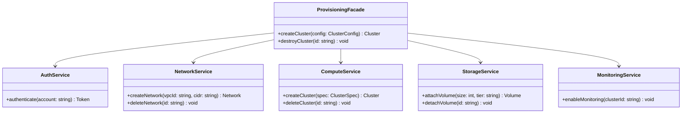

---
# Required
sidebar_position: 6
title: "Facade Pattern — Simplifying Complex Subsystems"
description: >-
  Learn the Facade pattern to provide a simple interface over a complex
  subsystem. Perfect for APIs, SDKs, and onboarding flows.

# SEO
keywords:
  - facade pattern
  - facade design pattern
  - simplify subsystem
  - interface simplification
  - when to use facade

difficulty: beginner
category: structural
related_solid: [SRP, DIP]

# Social sharing
og_title: "Facade Pattern: Simplifying Complex Subsystems"
og_description: "Provide a clean, simple interface over complex systems."
og_image: "/img/social-card.svg"

# Content management
date_published: 2026-01-25
date_modified: 2026-01-25
author: shivam
reading_time: 12
content_type: explanation
---

# Facade Pattern

<PatternMeta>
  <Difficulty level="beginner" />
  <TimeToRead minutes={12} />
  <Prerequisites patterns={["Adapter"]} />
</PatternMeta>

The cluster provisioning API that nobody could use taught me why Facade exists.

At NVIDIA, we had a powerful infrastructure platform. You could provision GPU clusters, configure networking, set up monitoring, attach storage, and inject secrets—all through APIs. The problem was that doing anything useful required calling six different services in the right order:

```python
# What teams had to write to provision a cluster
auth_token = auth_service.authenticate(service_account)
network_id = network_service.create_network(vpc_id, cidr_range)
storage_id = storage_service.attach_volume(size_gb, tier)
secrets_ref = secrets_service.create_namespace(team_name)
cluster = compute_service.create_cluster(gpu_count, network_id, storage_id)
monitoring_service.enable_monitoring(cluster.id, dashboard_template)
secrets_service.inject_secrets(cluster.id, secrets_ref, secret_keys)
```

Every team implemented this flow themselves. Every team got it slightly wrong. Some forgot to enable monitoring. Others attached storage after secrets injection (which failed). One team's implementation worked but leaked network resources on failure.

We spent more time debugging provisioning issues than any actual infrastructure problem.

**Facade gave teams one call instead of seven:**

```python
cluster = provisioning_facade.create_cluster(
    team="ml-platform",
    gpu_count=8,
    size_gb=1000,
    secrets=["api-key", "model-token"]
)
```

One call. One place for the complexity. One place to fix bugs. Teams went from spending hours on provisioning to spending seconds.

---

## What Is the Facade Pattern?

> **Definition:** Facade provides a simplified interface to a complex subsystem, making the subsystem easier to use.

A facade wraps multiple classes or services behind a single, clean API. It doesn't hide the subsystem—advanced users can still access the underlying components—but it provides a "happy path" for common use cases.

**The key insight: Facade is about reducing cognitive load.** You're not adding functionality; you're hiding complexity that most users don't need to see.

---

## Structure



### Key Components

| Component | Role |
|-----------|------|
| **Facade** (`ProvisioningFacade`) | The simplified API that clients use |
| **Subsystem Classes** (`AuthService`, `NetworkService`, etc.) | The underlying complexity |
| **Client** | Uses the facade instead of the subsystem directly |

### SOLID Principles Connection

- **Single Responsibility:** The facade's job is orchestration, not business logic
- **Dependency Inversion:** Clients depend on the facade, not on every subsystem class

---

## When to Use Facade

✅ **Use it when:**

- You have a complex subsystem with many moving parts
- Multiple clients need to perform the same sequence of operations
- You want to layer your system (facade as the API layer)
- You need to isolate clients from subsystem changes

❌ **Don't use it when:**

- The subsystem is already simple
- Clients need fine-grained control that the facade would hide
- The facade becomes a "god object" with too many responsibilities
- You're hiding complexity that clients actually need to understand

**Rule of thumb:** If clients keep writing the same boilerplate to use your subsystem, that boilerplate belongs in a facade.

---

## Implementation

<CodeTabs>
  <TabItem value="python" label="Python">
    ```python
    from dataclasses import dataclass
    from typing import List, Optional


    @dataclass
    class Cluster:
        id: str
        gpu_count: int
        network_id: str
        storage_id: str


    @dataclass
    class ClusterConfig:
        team: str
        gpu_count: int
        storage_gb: int
        secrets: List[str]


    # Subsystem classes
    class AuthService:
        def authenticate(self, service_account: str) -> str:
            print(f"Authenticating {service_account}")
            return "auth-token-123"


    class NetworkService:
        def create_network(self, vpc_id: str, cidr: str) -> str:
            print(f"Creating network in {vpc_id}")
            return "network-456"
        
        def delete_network(self, network_id: str) -> None:
            print(f"Deleting network {network_id}")


    class ComputeService:
        def create_cluster(self, gpu_count: int, network_id: str, storage_id: str) -> Cluster:
            print(f"Creating cluster with {gpu_count} GPUs")
            return Cluster(
                id="cluster-789",
                gpu_count=gpu_count,
                network_id=network_id,
                storage_id=storage_id
            )
        
        def delete_cluster(self, cluster_id: str) -> None:
            print(f"Deleting cluster {cluster_id}")


    class StorageService:
        def attach_volume(self, size_gb: int, tier: str = "ssd") -> str:
            print(f"Attaching {size_gb}GB {tier} volume")
            return "volume-abc"
        
        def detach_volume(self, volume_id: str) -> None:
            print(f"Detaching volume {volume_id}")


    class SecretsService:
        def create_namespace(self, team: str) -> str:
            print(f"Creating secrets namespace for {team}")
            return f"secrets/{team}"
        
        def inject_secrets(self, cluster_id: str, namespace: str, keys: List[str]) -> None:
            print(f"Injecting {len(keys)} secrets into {cluster_id}")


    class MonitoringService:
        def enable_monitoring(self, cluster_id: str) -> None:
            print(f"Enabling monitoring for {cluster_id}")


    # Facade
    class ProvisioningFacade:
        """Simplified interface for cluster provisioning."""
        
        def __init__(
            self,
            auth: AuthService,
            network: NetworkService,
            compute: ComputeService,
            storage: StorageService,
            secrets: SecretsService,
            monitoring: MonitoringService,
        ) -> None:
            self._auth = auth
            self._network = network
            self._compute = compute
            self._storage = storage
            self._secrets = secrets
            self._monitoring = monitoring
        
        def create_cluster(self, config: ClusterConfig) -> Cluster:
            """Create a fully-configured cluster in one call.
            
            Handles: authentication, networking, storage, secrets, 
            compute provisioning, and monitoring setup.
            """
            # Authenticate
            self._auth.authenticate(f"{config.team}-service-account")
            
            # Set up infrastructure
            network_id = self._network.create_network("default-vpc", "10.0.0.0/16")
            storage_id = self._storage.attach_volume(config.storage_gb)
            secrets_ns = self._secrets.create_namespace(config.team)
            
            # Create cluster
            cluster = self._compute.create_cluster(
                config.gpu_count,
                network_id,
                storage_id
            )
            
            # Configure cluster
            self._secrets.inject_secrets(cluster.id, secrets_ns, config.secrets)
            self._monitoring.enable_monitoring(cluster.id)
            
            return cluster
        
        def destroy_cluster(self, cluster: Cluster) -> None:
            """Destroy a cluster and clean up all resources."""
            self._compute.delete_cluster(cluster.id)
            self._storage.detach_volume(cluster.storage_id)
            self._network.delete_network(cluster.network_id)


    # Usage: one call instead of seven
    facade = ProvisioningFacade(
        AuthService(),
        NetworkService(),
        ComputeService(),
        StorageService(),
        SecretsService(),
        MonitoringService()
    )

    cluster = facade.create_cluster(ClusterConfig(
        team="ml-platform",
        gpu_count=8,
        storage_gb=1000,
        secrets=["api-key", "model-token"]
    ))

    print(f"\nCluster {cluster.id} created successfully!")
    ```
  </TabItem>
  <TabItem value="typescript" label="TypeScript">
    ```typescript
    interface Cluster {
      id: string;
      gpuCount: number;
      networkId: string;
      storageId: string;
    }

    interface ClusterConfig {
      team: string;
      gpuCount: number;
      storageGb: number;
      secrets: string[];
    }

    // Subsystem classes
    class AuthService {
      authenticate(serviceAccount: string): string {
        console.log(`Authenticating ${serviceAccount}`);
        return "auth-token-123";
      }
    }

    class NetworkService {
      createNetwork(vpcId: string, cidr: string): string {
        console.log(`Creating network in ${vpcId}`);
        return "network-456";
      }

      deleteNetwork(networkId: string): void {
        console.log(`Deleting network ${networkId}`);
      }
    }

    class ComputeService {
      createCluster(gpuCount: number, networkId: string, storageId: string): Cluster {
        console.log(`Creating cluster with ${gpuCount} GPUs`);
        return {
          id: "cluster-789",
          gpuCount,
          networkId,
          storageId,
        };
      }

      deleteCluster(clusterId: string): void {
        console.log(`Deleting cluster ${clusterId}`);
      }
    }

    class StorageService {
      attachVolume(sizeGb: number, tier = "ssd"): string {
        console.log(`Attaching ${sizeGb}GB ${tier} volume`);
        return "volume-abc";
      }
    }

    class SecretsService {
      createNamespace(team: string): string {
        console.log(`Creating secrets namespace for ${team}`);
        return `secrets/${team}`;
      }

      injectSecrets(clusterId: string, namespace: string, keys: string[]): void {
        console.log(`Injecting ${keys.length} secrets into ${clusterId}`);
      }
    }

    class MonitoringService {
      enableMonitoring(clusterId: string): void {
        console.log(`Enabling monitoring for ${clusterId}`);
      }
    }

    // Facade
    class ProvisioningFacade {
      constructor(
        private auth: AuthService,
        private network: NetworkService,
        private compute: ComputeService,
        private storage: StorageService,
        private secrets: SecretsService,
        private monitoring: MonitoringService
      ) {}

      createCluster(config: ClusterConfig): Cluster {
        this.auth.authenticate(`${config.team}-service-account`);

        const networkId = this.network.createNetwork("default-vpc", "10.0.0.0/16");
        const storageId = this.storage.attachVolume(config.storageGb);
        const secretsNs = this.secrets.createNamespace(config.team);

        const cluster = this.compute.createCluster(
          config.gpuCount,
          networkId,
          storageId
        );

        this.secrets.injectSecrets(cluster.id, secretsNs, config.secrets);
        this.monitoring.enableMonitoring(cluster.id);

        return cluster;
      }

      destroyCluster(cluster: Cluster): void {
        this.compute.deleteCluster(cluster.id);
        this.storage.detachVolume(cluster.storageId);
        this.network.deleteNetwork(cluster.networkId);
      }
    }
    ```
  </TabItem>
  <TabItem value="go" label="Go">
    ```go
    package provisioning

    import "fmt"

    type Cluster struct {
        ID        string
        GPUCount  int
        NetworkID string
        StorageID string
    }

    type ClusterConfig struct {
        Team      string
        GPUCount  int
        StorageGB int
        Secrets   []string
    }

    // Subsystem services
    type AuthService struct{}
    func (a *AuthService) Authenticate(account string) string {
        fmt.Printf("Authenticating %s\n", account)
        return "auth-token-123"
    }

    type NetworkService struct{}
    func (n *NetworkService) CreateNetwork(vpcID, cidr string) string {
        fmt.Printf("Creating network in %s\n", vpcID)
        return "network-456"
    }
    func (n *NetworkService) DeleteNetwork(id string) {
        fmt.Printf("Deleting network %s\n", id)
    }

    type ComputeService struct{}
    func (c *ComputeService) CreateCluster(gpuCount int, networkID, storageID string) *Cluster {
        fmt.Printf("Creating cluster with %d GPUs\n", gpuCount)
        return &Cluster{
            ID:        "cluster-789",
            GPUCount:  gpuCount,
            NetworkID: networkID,
            StorageID: storageID,
        }
    }

    type StorageService struct{}
    func (s *StorageService) AttachVolume(sizeGB int) string {
        fmt.Printf("Attaching %dGB volume\n", sizeGB)
        return "volume-abc"
    }

    type SecretsService struct{}
    func (s *SecretsService) CreateNamespace(team string) string {
        fmt.Printf("Creating secrets namespace for %s\n", team)
        return fmt.Sprintf("secrets/%s", team)
    }
    func (s *SecretsService) InjectSecrets(clusterID, namespace string, keys []string) {
        fmt.Printf("Injecting %d secrets into %s\n", len(keys), clusterID)
    }

    type MonitoringService struct{}
    func (m *MonitoringService) EnableMonitoring(clusterID string) {
        fmt.Printf("Enabling monitoring for %s\n", clusterID)
    }

    // Facade
    type ProvisioningFacade struct {
        auth       *AuthService
        network    *NetworkService
        compute    *ComputeService
        storage    *StorageService
        secrets    *SecretsService
        monitoring *MonitoringService
    }

    func NewProvisioningFacade() *ProvisioningFacade {
        return &ProvisioningFacade{
            auth:       &AuthService{},
            network:    &NetworkService{},
            compute:    &ComputeService{},
            storage:    &StorageService{},
            secrets:    &SecretsService{},
            monitoring: &MonitoringService{},
        }
    }

    func (f *ProvisioningFacade) CreateCluster(config ClusterConfig) *Cluster {
        f.auth.Authenticate(config.Team + "-service-account")
        
        networkID := f.network.CreateNetwork("default-vpc", "10.0.0.0/16")
        storageID := f.storage.AttachVolume(config.StorageGB)
        secretsNS := f.secrets.CreateNamespace(config.Team)
        
        cluster := f.compute.CreateCluster(config.GPUCount, networkID, storageID)
        
        f.secrets.InjectSecrets(cluster.ID, secretsNS, config.Secrets)
        f.monitoring.EnableMonitoring(cluster.ID)
        
        return cluster
    }
    ```
  </TabItem>
  <TabItem value="java" label="Java">
    ```java
    record Cluster(String id, int gpuCount, String networkId, String storageId) {}
    record ClusterConfig(String team, int gpuCount, int storageGb, List<String> secrets) {}

    // Subsystem classes
    class AuthService {
        String authenticate(String account) {
            System.out.printf("Authenticating %s%n", account);
            return "auth-token-123";
        }
    }

    class NetworkService {
        String createNetwork(String vpcId, String cidr) {
            System.out.printf("Creating network in %s%n", vpcId);
            return "network-456";
        }
    }

    class ComputeService {
        Cluster createCluster(int gpuCount, String networkId, String storageId) {
            System.out.printf("Creating cluster with %d GPUs%n", gpuCount);
            return new Cluster("cluster-789", gpuCount, networkId, storageId);
        }
    }

    class StorageService {
        String attachVolume(int sizeGb) {
            System.out.printf("Attaching %dGB volume%n", sizeGb);
            return "volume-abc";
        }
    }

    class SecretsService {
        String createNamespace(String team) {
            return "secrets/" + team;
        }
        void injectSecrets(String clusterId, String namespace, List<String> keys) {
            System.out.printf("Injecting %d secrets%n", keys.size());
        }
    }

    class MonitoringService {
        void enableMonitoring(String clusterId) {
            System.out.printf("Enabling monitoring for %s%n", clusterId);
        }
    }

    // Facade
    class ProvisioningFacade {
        private final AuthService auth;
        private final NetworkService network;
        private final ComputeService compute;
        private final StorageService storage;
        private final SecretsService secrets;
        private final MonitoringService monitoring;

        ProvisioningFacade(AuthService auth, NetworkService network, 
                          ComputeService compute, StorageService storage,
                          SecretsService secrets, MonitoringService monitoring) {
            this.auth = auth;
            this.network = network;
            this.compute = compute;
            this.storage = storage;
            this.secrets = secrets;
            this.monitoring = monitoring;
        }

        Cluster createCluster(ClusterConfig config) {
            auth.authenticate(config.team() + "-service-account");
            
            String networkId = network.createNetwork("default-vpc", "10.0.0.0/16");
            String storageId = storage.attachVolume(config.storageGb());
            String secretsNs = secrets.createNamespace(config.team());
            
            Cluster cluster = compute.createCluster(
                config.gpuCount(), networkId, storageId);
            
            secrets.injectSecrets(cluster.id(), secretsNs, config.secrets());
            monitoring.enableMonitoring(cluster.id());
            
            return cluster;
        }
    }
    ```
  </TabItem>
  <TabItem value="csharp" label="C#">
    ```csharp
    public record Cluster(string Id, int GpuCount, string NetworkId, string StorageId);
    public record ClusterConfig(string Team, int GpuCount, int StorageGb, List<string> Secrets);

    // Subsystem classes
    public class AuthService
    {
        public string Authenticate(string account)
        {
            Console.WriteLine($"Authenticating {account}");
            return "auth-token-123";
        }
    }

    public class NetworkService
    {
        public string CreateNetwork(string vpcId, string cidr)
        {
            Console.WriteLine($"Creating network in {vpcId}");
            return "network-456";
        }
    }

    public class ComputeService
    {
        public Cluster CreateCluster(int gpuCount, string networkId, string storageId)
        {
            Console.WriteLine($"Creating cluster with {gpuCount} GPUs");
            return new Cluster("cluster-789", gpuCount, networkId, storageId);
        }
    }

    public class StorageService
    {
        public string AttachVolume(int sizeGb)
        {
            Console.WriteLine($"Attaching {sizeGb}GB volume");
            return "volume-abc";
        }
    }

    public class SecretsService
    {
        public string CreateNamespace(string team) => $"secrets/{team}";
        public void InjectSecrets(string clusterId, string ns, List<string> keys)
        {
            Console.WriteLine($"Injecting {keys.Count} secrets");
        }
    }

    public class MonitoringService
    {
        public void EnableMonitoring(string clusterId)
        {
            Console.WriteLine($"Enabling monitoring for {clusterId}");
        }
    }

    // Facade
    public class ProvisioningFacade
    {
        private readonly AuthService _auth;
        private readonly NetworkService _network;
        private readonly ComputeService _compute;
        private readonly StorageService _storage;
        private readonly SecretsService _secrets;
        private readonly MonitoringService _monitoring;

        public ProvisioningFacade(
            AuthService auth, NetworkService network, ComputeService compute,
            StorageService storage, SecretsService secrets, MonitoringService monitoring)
        {
            _auth = auth; _network = network; _compute = compute;
            _storage = storage; _secrets = secrets; _monitoring = monitoring;
        }

        public Cluster CreateCluster(ClusterConfig config)
        {
            _auth.Authenticate($"{config.Team}-service-account");
            
            var networkId = _network.CreateNetwork("default-vpc", "10.0.0.0/16");
            var storageId = _storage.AttachVolume(config.StorageGb);
            var secretsNs = _secrets.CreateNamespace(config.Team);
            
            var cluster = _compute.CreateCluster(config.GpuCount, networkId, storageId);
            
            _secrets.InjectSecrets(cluster.Id, secretsNs, config.Secrets);
            _monitoring.EnableMonitoring(cluster.Id);
            
            return cluster;
        }
    }
    ```
  </TabItem>
</CodeTabs>

---

## Real-World Example: SDK Design

Every good SDK is essentially a facade. Compare using the raw API vs. an SDK:

```python
# Without facade: raw AWS SDK calls
import boto3

ec2 = boto3.client('ec2')
s3 = boto3.client('s3')
iam = boto3.client('iam')

# Create role, policy, instance profile, security group, key pair,
# launch template, then finally the instance...
# 50+ lines of orchestration

# With facade: our platform SDK
from platform_sdk import InfraClient

infra = InfraClient()
instance = infra.create_gpu_instance(
    gpu_type="a100",
    count=8,
    storage_gb=1000
)
# 3 lines, same result
```

---

## Performance Considerations

| Aspect | Impact | Notes |
|--------|--------|-------|
| Memory | Low | Facade just holds references to subsystems |
| Runtime | Low | Minimal overhead from delegation |
| Complexity | Reduces | Centralizes complexity in one place |

Facade is almost pure win—it adds almost no overhead while significantly reducing client complexity.

---

## Testing This Pattern

Test that the facade calls subsystems correctly:

```python
def test_facade_orchestrates_services():
    auth = Mock(AuthService)
    network = Mock(NetworkService)
    network.create_network.return_value = "net-123"
    compute = Mock(ComputeService)
    compute.create_cluster.return_value = Cluster("c-1", 8, "net-123", "vol-1")
    # ... other mocks
    
    facade = ProvisioningFacade(auth, network, compute, storage, secrets, monitoring)
    cluster = facade.create_cluster(ClusterConfig("team", 8, 1000, ["key"]))
    
    auth.authenticate.assert_called_once()
    network.create_network.assert_called_once()
    compute.create_cluster.assert_called_once()
    monitoring.enable_monitoring.assert_called_with("c-1")
```

---

## Common Mistakes

### 1. Facade becomes a god object

```python
class EverythingFacade:
    def create_cluster(self): ...
    def deploy_application(self): ...
    def send_notification(self): ...
    def generate_report(self): ...
    # 47 more unrelated methods
```

One facade per subsystem or workflow. Don't create a dumping ground.

### 2. Facade hides errors inappropriately

```python
def create_cluster(self, config):
    try:
        # ... all the steps
    except Exception:
        return None  # Swallows all errors!
```

Facades should simplify, not hide failures. Propagate errors appropriately.

### 3. Facade duplicates business logic

```python
def create_cluster(self, config):
    if config.gpu_count > 16:
        raise ValueError("Too many GPUs")  # This validation belongs elsewhere
```

Facades orchestrate; they don't define business rules. Put validation in the subsystem.

---

## Related Patterns

| Pattern | Relationship |
|---------|--------------|
| **Adapter** | Translates interfaces; Facade simplifies |
| **Proxy** | Controls access to one object; Facade simplifies many |
| **Mediator** | Coordinates interactions between objects |

---

## Key Takeaways

- **Facade simplifies complex subsystems.** One call instead of many.

- **It doesn't hide the subsystem.** Advanced users can still access underlying components.

- **Keep facades focused.** One facade per workflow or subsystem, not one facade for everything.

- **Facades orchestrate; they don't contain business logic.**

---

## Navigation

- **Previous:** [Decorator Pattern](/docs/design-patterns/structural/decorator)
- **Next:** [Flyweight Pattern](/docs/design-patterns/structural/flyweight)
