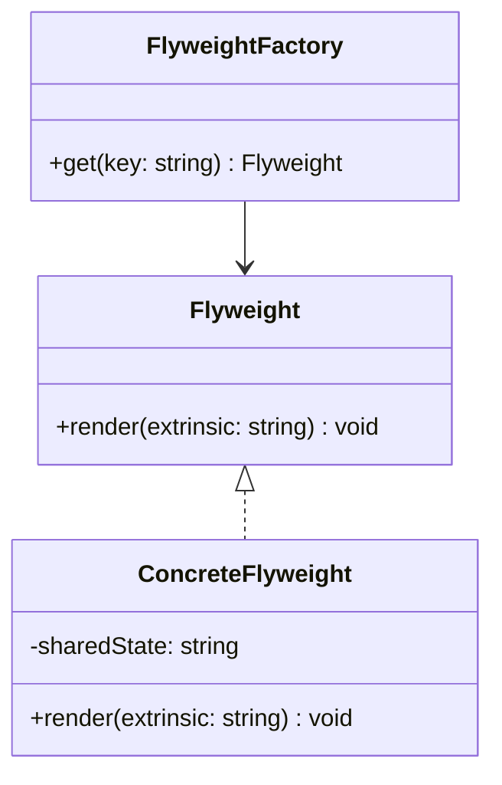

---
# Required
sidebar_position: 7
title: "Flyweight Pattern — Share to Save Memory"
description: >-
  Learn the Flyweight pattern to reduce memory usage by sharing common object
  state. Includes multi-language examples and trade-offs.

# SEO
keywords:
  - flyweight pattern
  - flyweight design pattern
  - memory optimization
  - intrinsic extrinsic state
  - when to use flyweight

difficulty: advanced
category: structural
related_solid: [SRP, OCP]

# Social sharing
og_title: "Flyweight Pattern: Share to Save Memory"
og_description: "Share common state across many objects to reduce memory."
og_image: "/img/social-card.svg"

# Content management
date_published: 2026-01-25
date_modified: 2026-01-25
author: shivam
reading_time: 13
content_type: explanation
---

# Flyweight Pattern

<PatternMeta>
  <Difficulty level="advanced" />
  <TimeToRead minutes={13} />
  <Prerequisites patterns={["Composite"]} />
</PatternMeta>

> **Definition:** The Flyweight pattern reduces memory usage by sharing common (intrinsic) state across many objects while keeping unique (extrinsic) state outside.

---

## The Problem: Too Many Similar Objects

In telemetry pipelines, we often create thousands of tag objects with the same keys and values. Each one uses memory, and at scale that becomes a real cost.

**Flyweight reduces duplication by sharing immutable state.**

---

## What Is the Flyweight Pattern?

Flyweight separates object state into:

- **Intrinsic state:** shared and immutable
- **Extrinsic state:** unique per use and supplied by the client

### Structure



### Key Components

- **Flyweight:** The shared object interface.
- **Concrete Flyweight:** Holds intrinsic state.
- **Factory:** Manages and returns shared instances.

### SOLID Principles Connection

- **SRP:** Separates shared state from unique context.
- **OCP:** Add new flyweights without changing client code.

---

## When to Use Flyweight

- You have a large number of similar objects.
- Memory pressure is measurable.
- Shared state is immutable and safe to reuse.

## When NOT to Use Flyweight

- The objects are few or small.
- Shared state is mutable.
- The complexity of a flyweight factory adds more cost than it saves.

---

## Implementation

<CodeTabs>
  <TabItem value="python" label="Python">
    ```python
    class TagFlyweight:
        def __init__(self, key: str, value: str) -> None:
            self.key = key
            self.value = value

        def render(self, target: str) -> str:
            return f"{self.key}={self.value} -> {target}"


    class TagFactory:
        def __init__(self) -> None:
            self._cache: dict[str, TagFlyweight] = {}

        def get(self, key: str, value: str) -> TagFlyweight:
            cache_key = f"{key}:{value}"
            if cache_key not in self._cache:
                self._cache[cache_key] = TagFlyweight(key, value)
            return self._cache[cache_key]
    ```
  </TabItem>
  <TabItem value="typescript" label="TypeScript">
    ```typescript
    class TagFlyweight {
      constructor(private key: string, private value: string) {}
      render(target: string): string {
        return `${this.key}=${this.value} -> ${target}`;
      }
    }

    class TagFactory {
      private cache = new Map<string, TagFlyweight>();
      get(key: string, value: string): TagFlyweight {
        const cacheKey = `${key}:${value}`;
        if (!this.cache.has(cacheKey)) {
          this.cache.set(cacheKey, new TagFlyweight(key, value));
        }
        return this.cache.get(cacheKey)!;
      }
    }
    ```
  </TabItem>
  <TabItem value="go" label="Go">
    ```go
    package tags

    type Flyweight struct {
        Key   string
        Value string
    }

    func (f Flyweight) Render(target string) string {
        return f.Key + "=" + f.Value + " -> " + target
    }

    type Factory struct {
        cache map[string]Flyweight
    }

    func NewFactory() *Factory {
        return &Factory{cache: map[string]Flyweight{}}
    }

    func (f *Factory) Get(key, value string) Flyweight {
        cacheKey := key + ":" + value
        if cached, ok := f.cache[cacheKey]; ok {
            return cached
        }
        flyweight := Flyweight{Key: key, Value: value}
        f.cache[cacheKey] = flyweight
        return flyweight
    }
    ```
  </TabItem>
  <TabItem value="java" label="Java">
    ```java
    class TagFlyweight {
        private final String key;
        private final String value;
        TagFlyweight(String key, String value) { this.key = key; this.value = value; }
        String render(String target) { return key + "=" + value + " -> " + target; }
    }

    class TagFactory {
        private final java.util.Map<String, TagFlyweight> cache = new java.util.HashMap<>();
        TagFlyweight get(String key, String value) {
            String cacheKey = key + ":" + value;
            return cache.computeIfAbsent(cacheKey, k -> new TagFlyweight(key, value));
        }
    }
    ```
  </TabItem>
  <TabItem value="csharp" label="C#">
    ```csharp
    public class TagFlyweight
    {
        private readonly string _key;
        private readonly string _value;
        public TagFlyweight(string key, string value) { _key = key; _value = value; }
        public string Render(string target) => $"{_key}={_value} -> {target}";
    }

    public class TagFactory
    {
        private readonly Dictionary<string, TagFlyweight> _cache = new();
        public TagFlyweight Get(string key, string value)
        {
            var cacheKey = $"{key}:{value}";
            if (!_cache.ContainsKey(cacheKey))
                _cache[cacheKey] = new TagFlyweight(key, value);
            return _cache[cacheKey];
        }
    }
    ```
  </TabItem>
</CodeTabs>

---

## Real-World Example: Metric Labels

In metrics systems, the same label keys and values repeat across millions of data points. Flyweight lets you store the label pair once and reuse it across events.

---

## Performance Considerations

| Aspect | Impact | Notes |
|--------|--------|-------|
| Memory | High benefit | Large reductions at scale |
| Runtime | Medium | Cache lookup per access |
| Complexity | Medium | Must manage shared state safely |

---

## Testing This Pattern

Test that the factory returns shared instances for the same key.

```python
def test_factory_shares_instances() -> None:
    factory = TagFactory()
    a = factory.get("env", "prod")
    b = factory.get("env", "prod")
    assert a is b
```

---

## Common Mistakes

- Treating mutable state as intrinsic.
- Sharing objects that should be unique.
- Using flyweights when memory pressure is not real.

---

## Related Patterns

| Pattern | Relationship |
|---------|--------------|
| Composite | Flyweights can be used in large trees |
| Object Pool | Manages reusable instances, not shared state |
| Proxy | Controls access rather than sharing |

---

## Pattern Combinations

- **With Factory Method:** Create flyweights through a factory interface.
- **With Cache:** Use eviction policies for large flyweight sets.

---

## Try It Yourself

Model text rendering where each character shares font and style data via flyweights.

---

## Frequently Asked Questions

### Is Flyweight a caching pattern?
It uses caching for shared objects, but the goal is memory reduction.

### What if intrinsic state changes?
It should not. Intrinsic state must be immutable.

### Does Flyweight improve performance?
It can improve memory at the cost of lookup overhead.

### How do I test code using Flyweight?
Verify shared instances for identical keys and unique instances for different ones.

---

## Key Takeaways

- **Flyweight shares intrinsic state to save memory.**
- **It is powerful at scale and unnecessary at small scale.**
- **Keep shared state immutable and well-managed.**

---

## Downloads

- Flyweight Cheat Sheet (Coming soon)
- Complete Code Examples (Coming soon)
- Practice Exercises (Coming soon)

---

## Navigation

- **Previous:** [Facade Pattern](/docs/design-patterns/structural/facade)
- **Next:** [Proxy Pattern](/docs/design-patterns/structural/proxy)
