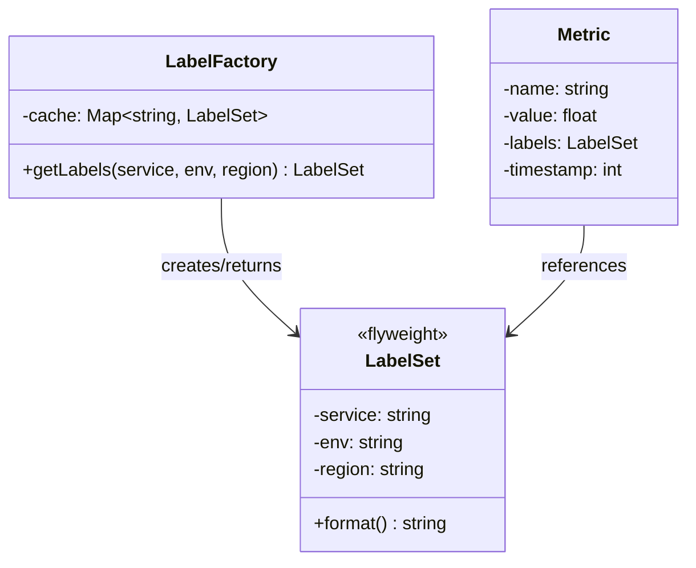

---
# Required
sidebar_position: 7
title: "Flyweight Pattern — Sharing State to Save Memory"
description: >-
  Learn the Flyweight pattern to reduce memory by sharing common state across
  many objects. Essential when you have millions of similar objects.

# SEO
keywords:
  - flyweight pattern
  - flyweight design pattern
  - memory optimization
  - intrinsic extrinsic state
  - when to use flyweight

difficulty: advanced
category: structural
related_solid: [SRP, OCP]

# Social sharing
og_title: "Flyweight Pattern: Sharing State to Save Memory"
og_description: "Share common state across many objects to dramatically reduce memory."
og_image: "/img/social-card.svg"

# Content management
date_published: 2026-01-25
date_modified: 2026-01-25
author: shivam
reading_time: 12
content_type: explanation
---

# Flyweight Pattern

<PatternMeta>
  <Difficulty level="advanced" />
  <TimeToRead minutes={12} />
  <Prerequisites patterns={["Factory Method", "Composite"]} />
</PatternMeta>

The metrics pipeline that ran out of memory taught me when Flyweight actually matters.

At NVIDIA, our observability system collected metrics from thousands of services. Each metric had labels: `service="auth"`, `env="prod"`, `region="us-west"`. A single service might emit 10,000 metrics per minute, each with the same five labels.

The naive implementation created a new label set for every metric:

```python
class Metric:
    def __init__(self, name: str, value: float, labels: dict):
        self.name = name
        self.value = value
        self.labels = labels  # New dict every time

# 10,000 metrics × 5 labels × 1000 services = massive memory usage
```

The labels were identical for every metric from the same service. We were storing `{"service": "auth", "env": "prod"}` millions of times. Memory usage climbed to 8GB and the process kept getting OOM-killed.

**Flyweight reduced memory by 90%.** Instead of creating new label dictionaries for each metric, we shared them:

```python
label_cache = {}

def get_labels(service: str, env: str, region: str) -> dict:
    key = (service, env, region)
    if key not in label_cache:
        label_cache[key] = {"service": service, "env": env, "region": region}
    return label_cache[key]

# Now 10,000 metrics share one label dict
```

Same functionality, 90% less memory.

---

## What Is the Flyweight Pattern?

> **Definition:** Flyweight reduces memory by sharing common state (intrinsic state) across many objects while keeping unique state (extrinsic state) external.

The pattern splits object state into two categories:
- **Intrinsic state:** Shared, immutable, stored in the flyweight
- **Extrinsic state:** Unique, varies by context, passed in by the client

**The key insight: If many objects share the same data, store it once and reference it many times.** This only works when the shared state is immutable.

---

## Structure



### Key Components

| Component | Role |
|-----------|------|
| **Flyweight** (`LabelSet`) | Shared object containing intrinsic state |
| **Flyweight Factory** (`LabelFactory`) | Creates and caches flyweights |
| **Client** (`Metric`) | Uses flyweights, supplies extrinsic state |

### SOLID Principles Connection

- **Single Responsibility:** Factory manages lifecycle; flyweight manages shared state
- **Open/Closed:** Add new flyweight types without changing existing code

---

## When to Use Flyweight

✅ **Use it when:**

- You have a very large number of similar objects (thousands+)
- Memory usage is a measured problem, not a theoretical concern
- Objects contain significant shared, immutable state
- The shared state can be factored out cleanly

❌ **Don't use it when:**

- You have few objects (hundreds or less)
- Memory isn't actually constrained
- The "shared" state is actually mutable
- The complexity isn't worth the memory savings

**Rule of thumb:** Profile first. Don't optimize memory until you've measured that it's a problem. Flyweight adds complexity that's only justified by real memory pressure.

---

## Implementation

<CodeTabs>
  <TabItem value="python" label="Python">
    ```python
    from dataclasses import dataclass
    from typing import Dict, Tuple
    import sys


    @dataclass(frozen=True)  # Immutable!
    class LabelSet:
        """Flyweight: shared, immutable label configuration."""
        service: str
        env: str
        region: str
        
        def format(self) -> str:
            return f"service={self.service},env={self.env},region={self.region}"


    class LabelFactory:
        """Factory that creates and caches LabelSet flyweights."""
        
        def __init__(self) -> None:
            self._cache: Dict[Tuple[str, str, str], LabelSet] = {}
        
        def get_labels(self, service: str, env: str, region: str) -> LabelSet:
            """Return a shared LabelSet, creating it if necessary."""
            key = (service, env, region)
            if key not in self._cache:
                self._cache[key] = LabelSet(service, env, region)
            return self._cache[key]
        
        def cache_size(self) -> int:
            return len(self._cache)


    @dataclass
    class Metric:
        """Uses flyweight labels plus unique per-metric data."""
        name: str
        value: float
        labels: LabelSet  # Shared flyweight
        timestamp: int     # Extrinsic state (unique per metric)


    # Demonstrate memory savings
    factory = LabelFactory()

    # Create 100,000 metrics from 100 services
    metrics = []
    for service_num in range(100):
        service_name = f"service-{service_num}"
        labels = factory.get_labels(service_name, "prod", "us-west")
        
        for i in range(1000):
            metrics.append(Metric(
                name="request_count",
                value=float(i),
                labels=labels,  # Same reference for all 1000 metrics
                timestamp=1700000000 + i
            ))

    print(f"Total metrics: {len(metrics):,}")
    print(f"Unique label sets: {factory.cache_size()}")

    # Memory comparison
    # Without flyweight: 100,000 dict objects for labels
    # With flyweight: 100 LabelSet objects

    # Check that labels are actually shared
    assert metrics[0].labels is metrics[999].labels  # Same service
    assert metrics[0].labels is not metrics[1000].labels  # Different service
    ```
  </TabItem>
  <TabItem value="typescript" label="TypeScript">
    ```typescript
    // Flyweight: immutable, shared
    class LabelSet {
      constructor(
        readonly service: string,
        readonly env: string,
        readonly region: string
      ) {
        // Freeze to ensure immutability
        Object.freeze(this);
      }

      format(): string {
        return `service=${this.service},env=${this.env},region=${this.region}`;
      }
    }

    class LabelFactory {
      private cache = new Map<string, LabelSet>();

      getLabels(service: string, env: string, region: string): LabelSet {
        const key = `${service}:${env}:${region}`;
        
        if (!this.cache.has(key)) {
          this.cache.set(key, new LabelSet(service, env, region));
        }
        
        return this.cache.get(key)!;
      }

      get cacheSize(): number {
        return this.cache.size;
      }
    }

    interface Metric {
      name: string;
      value: number;
      labels: LabelSet;  // Flyweight reference
      timestamp: number; // Extrinsic state
    }

    // Usage
    const factory = new LabelFactory();
    const metrics: Metric[] = [];

    for (let serviceNum = 0; serviceNum < 100; serviceNum++) {
      const serviceName = `service-${serviceNum}`;
      const labels = factory.getLabels(serviceName, "prod", "us-west");

      for (let i = 0; i < 1000; i++) {
        metrics.push({
          name: "request_count",
          value: i,
          labels, // Shared reference
          timestamp: 1700000000 + i,
        });
      }
    }

    console.log(`Total metrics: ${metrics.length.toLocaleString()}`);
    console.log(`Unique label sets: ${factory.cacheSize}`);
    ```
  </TabItem>
  <TabItem value="go" label="Go">
    ```go
    package metrics

    import (
        "fmt"
        "sync"
    )

    // LabelSet is the flyweight - immutable, shared
    type LabelSet struct {
        Service string
        Env     string
        Region  string
    }

    func (l *LabelSet) Format() string {
        return fmt.Sprintf("service=%s,env=%s,region=%s", l.Service, l.Env, l.Region)
    }

    // LabelFactory manages flyweight creation and caching
    type LabelFactory struct {
        cache map[string]*LabelSet
        mu    sync.RWMutex
    }

    func NewLabelFactory() *LabelFactory {
        return &LabelFactory{
            cache: make(map[string]*LabelSet),
        }
    }

    func (f *LabelFactory) GetLabels(service, env, region string) *LabelSet {
        key := fmt.Sprintf("%s:%s:%s", service, env, region)

        // Fast path: read lock
        f.mu.RLock()
        if labels, ok := f.cache[key]; ok {
            f.mu.RUnlock()
            return labels
        }
        f.mu.RUnlock()

        // Slow path: write lock
        f.mu.Lock()
        defer f.mu.Unlock()

        // Double-check after acquiring write lock
        if labels, ok := f.cache[key]; ok {
            return labels
        }

        labels := &LabelSet{Service: service, Env: env, Region: region}
        f.cache[key] = labels
        return labels
    }

    func (f *LabelFactory) CacheSize() int {
        f.mu.RLock()
        defer f.mu.RUnlock()
        return len(f.cache)
    }

    // Metric uses flyweight labels
    type Metric struct {
        Name      string
        Value     float64
        Labels    *LabelSet // Flyweight reference (shared)
        Timestamp int64     // Extrinsic state (unique)
    }
    ```
  </TabItem>
  <TabItem value="java" label="Java">
    ```java
    import java.util.*;
    import java.util.concurrent.ConcurrentHashMap;

    // Flyweight - immutable, shared
    record LabelSet(String service, String env, String region) {
        String format() {
            return String.format("service=%s,env=%s,region=%s", service, env, region);
        }
    }

    class LabelFactory {
        private final Map<String, LabelSet> cache = new ConcurrentHashMap<>();

        LabelSet getLabels(String service, String env, String region) {
            String key = service + ":" + env + ":" + region;
            return cache.computeIfAbsent(key, k -> new LabelSet(service, env, region));
        }

        int cacheSize() {
            return cache.size();
        }
    }

    record Metric(
        String name,
        double value,
        LabelSet labels,    // Flyweight reference
        long timestamp      // Extrinsic state
    ) {}

    // Usage
    class Demo {
        public static void main(String[] args) {
            LabelFactory factory = new LabelFactory();
            List<Metric> metrics = new ArrayList<>();

            for (int serviceNum = 0; serviceNum < 100; serviceNum++) {
                String serviceName = "service-" + serviceNum;
                LabelSet labels = factory.getLabels(serviceName, "prod", "us-west");

                for (int i = 0; i < 1000; i++) {
                    metrics.add(new Metric(
                        "request_count",
                        i,
                        labels,  // Shared reference
                        1700000000L + i
                    ));
                }
            }

            System.out.printf("Total metrics: %,d%n", metrics.size());
            System.out.printf("Unique label sets: %d%n", factory.cacheSize());
        }
    }
    ```
  </TabItem>
  <TabItem value="csharp" label="C#">
    ```csharp
    using System.Collections.Concurrent;

    // Flyweight - immutable, shared
    public sealed record LabelSet(string Service, string Env, string Region)
    {
        public string Format() => $"service={Service},env={Env},region={Region}";
    }

    public class LabelFactory
    {
        private readonly ConcurrentDictionary<string, LabelSet> _cache = new();

        public LabelSet GetLabels(string service, string env, string region)
        {
            var key = $"{service}:{env}:{region}";
            return _cache.GetOrAdd(key, _ => new LabelSet(service, env, region));
        }

        public int CacheSize => _cache.Count;
    }

    public record Metric(
        string Name,
        double Value,
        LabelSet Labels,    // Flyweight reference
        long Timestamp      // Extrinsic state
    );

    // Usage
    class Program
    {
        static void Main()
        {
            var factory = new LabelFactory();
            var metrics = new List<Metric>();

            for (int serviceNum = 0; serviceNum < 100; serviceNum++)
            {
                var serviceName = $"service-{serviceNum}";
                var labels = factory.GetLabels(serviceName, "prod", "us-west");

                for (int i = 0; i < 1000; i++)
                {
                    metrics.Add(new Metric(
                        "request_count",
                        i,
                        labels,  // Shared reference
                        1700000000 + i
                    ));
                }
            }

            Console.WriteLine($"Total metrics: {metrics.Count:N0}");
            Console.WriteLine($"Unique label sets: {factory.CacheSize}");
        }
    }
    ```
  </TabItem>
</CodeTabs>

---

## Real-World Example: Text Rendering

Classic Flyweight example: a text editor where each character has font, size, and color. Instead of storing these with every character:

```python
# Without flyweight: 1 million chars × (font + size + color) = huge memory

# With flyweight
class CharacterFormat:  # Flyweight
    def __init__(self, font: str, size: int, color: str):
        self.font = font
        self.size = size
        self.color = color

class Character:  # Uses flyweight
    def __init__(self, char: str, format: CharacterFormat, x: int, y: int):
        self.char = char           # Extrinsic: unique per character
        self.format = format       # Intrinsic: shared across many characters
        self.x = x                 # Extrinsic: position is unique
        self.y = y
```

Most characters in a document share the same format. Share the format, store position separately.

---

## Performance Considerations

| Aspect | Impact | Notes |
|--------|--------|-------|
| Memory | High benefit | Can reduce by 90%+ when pattern applies |
| Runtime | Medium overhead | Cache lookup on every access |
| Complexity | High | Must carefully separate intrinsic/extrinsic state |

**Critical:** Flyweight only helps when you have many objects sharing the same intrinsic state. If every object has unique state, there's nothing to share.

---

## Testing This Pattern

Test that the factory returns shared instances:

```python
def test_factory_returns_same_instance_for_same_keys():
    factory = LabelFactory()
    
    labels1 = factory.get_labels("auth", "prod", "us-west")
    labels2 = factory.get_labels("auth", "prod", "us-west")
    
    assert labels1 is labels2  # Same object


def test_factory_returns_different_instances_for_different_keys():
    factory = LabelFactory()
    
    labels1 = factory.get_labels("auth", "prod", "us-west")
    labels2 = factory.get_labels("api", "prod", "us-west")
    
    assert labels1 is not labels2  # Different objects


def test_flyweight_is_immutable():
    factory = LabelFactory()
    labels = factory.get_labels("auth", "prod", "us-west")
    
    # Should not be able to modify
    with pytest.raises(AttributeError):
        labels.service = "hacked"
```

---

## Common Mistakes

### 1. Mutable flyweights

```python
class BadLabelSet:
    def __init__(self, service, env):
        self.service = service
        self.env = env
    
    def update_env(self, new_env):  # DANGER
        self.env = new_env  # Affects all users!
```

Flyweights must be immutable. If one user changes it, all users see the change.

### 2. Using Flyweight when you don't need it

```python
# 50 objects? Don't bother with Flyweight
items = [Item(shared_data) for _ in range(50)]
```

Flyweight adds complexity. Only use it when you have thousands of objects and measurable memory pressure.

### 3. Sharing extrinsic state accidentally

```python
class Metric:
    def __init__(self, labels: LabelSet, timestamp: int):
        self.labels = labels
        self.timestamp = timestamp
        self.cache = {}  # Bug: this should be per-metric, but gets shared
```

Double-check that only truly intrinsic state is in the flyweight.

---

## Related Patterns

| Pattern | Relationship |
|---------|--------------|
| **Factory Method** | Flyweight Factory is a specialized factory |
| **Composite** | Flyweights can be leaves in composite structures |
| **Singleton** | Both involve shared instances, but for different reasons |

---

## Key Takeaways

- **Flyweight shares intrinsic state to save memory.** Many objects reference one shared object.

- **Intrinsic state must be immutable.** Mutable shared state is a bug factory.

- **Profile before using.** Don't add complexity until you've measured memory pressure.

- **Separate intrinsic from extrinsic carefully.** Only truly shared, unchanging data belongs in the flyweight.

---

## Navigation

- **Previous:** [Facade Pattern](/docs/design-patterns/structural/facade)
- **Next:** [Proxy Pattern](/docs/design-patterns/structural/proxy)
