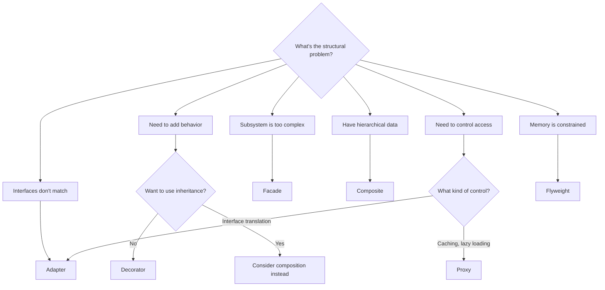

---
# Required
sidebar_position: 1
title: "Structural Design Patterns — Overview"
description: >-
  Structural patterns help you compose objects and classes into larger
  structures. Learn when to use Adapter, Facade, Decorator, and more.

# SEO
keywords:
  - structural design patterns
  - adapter pattern
  - decorator pattern
  - facade pattern
  - proxy pattern
  - composite pattern
  - bridge pattern

# Social sharing
og_title: "Structural Patterns: Composing Objects Into Larger Structures"
og_description: "A practical guide to patterns that organize and connect objects."
og_image: "/img/social-card.svg"

# Content management
date_published: 2026-01-25
date_modified: 2026-01-25
author: shivam
reading_time: 10
content_type: explanation
---

# Structural Patterns Overview

The integration that almost broke our deadline taught me why structural patterns exist.

In 2020, we needed to connect our CI/CD platform at NVIDIA to a legacy authentication system. The legacy system returned user data as semicolon-separated strings. Our modern platform expected JSON. The legacy system used callbacks. We used async/await. The legacy system identified users by employee ID. We used email addresses.

We had two weeks to ship the integration. Rewriting either system was impossible.

Structural patterns saved the project. An **Adapter** translated the legacy auth responses into our expected format. A **Facade** hid the complex multi-step authentication flow behind a single `authenticate()` call. A **Decorator** added logging and metrics without touching either codebase.

**Structural patterns help you compose systems without rewriting them.** They're the glue that connects incompatible pieces and the wrappers that add capabilities without invasive changes.

---

## When You Need a Structural Pattern

You're looking at a structural problem when:

- **You need to connect incompatible interfaces.** System A speaks XML, System B expects JSON. You can't change either one.

- **You want to add behavior without modifying existing code.** Every HTTP request needs logging, retries, and metrics, but you don't want to modify the HTTP client.

- **You need to simplify a complex subsystem.** The AWS SDK has 47 methods, but your application only needs 3, and the initialization sequence is confusing.

- **You're managing hierarchical structures.** A deployment pipeline contains stages, which contain steps, which might contain sub-steps. You want to treat them uniformly.

If none of these apply, you probably don't need a structural pattern. Direct composition is fine.

---

## The Seven Structural Patterns

Here's the landscape, from most to least commonly used:

| Pattern | What It Does | Frequency |
|---------|--------------|-----------|
| **Adapter** | Makes incompatible interfaces work together | Very High |
| **Decorator** | Adds behavior dynamically via wrapping | High |
| **Facade** | Simplifies access to a complex subsystem | High |
| **Proxy** | Controls access to an object | Medium |
| **Composite** | Treats single objects and groups uniformly | Medium |
| **Bridge** | Separates abstraction from implementation | Low |
| **Flyweight** | Shares state to reduce memory | Low |

---

## Quick Comparison

| If Your Problem Is... | Consider... | Trade-off |
|----------------------|-------------|-----------|
| "I need to connect incompatible interfaces" | Adapter | One-way translation, extra layer |
| "I want to add behavior without inheritance" | Decorator | Can be hard to debug when stacked |
| "I want to hide a complex subsystem" | Facade | Risk of becoming a god object |
| "I need caching, lazy loading, or access control" | Proxy | Hidden latency if misused |
| "I have tree structures with uniform operations" | Composite | Complexity in tree management |
| "I have two dimensions of variation" | Bridge | High abstraction cost |
| "I have millions of similar small objects" | Flyweight | Must manage shared vs. unique state |

---

## Decision Flowchart



---

## Pattern Deep Dives

Each pattern page covers:
- A real problem that motivates the pattern
- Clear structure with UML diagrams
- Working implementations in five languages
- When to use it—and when not to
- Testing strategies
- Common mistakes to avoid

### The Patterns

- **[Adapter →](/docs/design-patterns/structural/adapter)**  
  Converts one interface into another. The most common structural pattern—you'll use it whenever you integrate with third-party code.

- **[Bridge →](/docs/design-patterns/structural/bridge)**  
  Separates abstraction from implementation when you have two independent dimensions of variation. Less common but powerful when it fits.

- **[Composite →](/docs/design-patterns/structural/composite)**  
  Lets you treat individual objects and groups uniformly. Essential for tree structures like pipelines, file systems, and UI hierarchies.

- **[Decorator →](/docs/design-patterns/structural/decorator)**  
  Adds responsibilities dynamically through wrapping. Perfect for cross-cutting concerns like logging, caching, and retry logic.

- **[Facade →](/docs/design-patterns/structural/facade)**  
  Provides a simple interface to a complex subsystem. Great for APIs, SDKs, and onboarding flows.

- **[Flyweight →](/docs/design-patterns/structural/flyweight)**  
  Reduces memory by sharing common state. Useful when you have millions of similar objects.

- **[Proxy →](/docs/design-patterns/structural/proxy)**  
  Controls access to an object. Useful for caching, lazy loading, rate limiting, and access control.

---

## Real-World Example: Building an Integration Layer

When we integrated our observability system with multiple data stores, structural patterns were everywhere:

```python
# Adapter: normalize different storage APIs
class ElasticsearchAdapter(StorageInterface):
    def __init__(self, es_client):
        self.es = es_client
    
    def query(self, query: Query) -> Results:
        # Translate our Query format to Elasticsearch DSL
        es_query = self._translate(query)
        return self._normalize(self.es.search(es_query))

# Facade: simplify the complex ingestion pipeline
class IngestionFacade:
    def ingest(self, data: dict) -> None:
        # Hides: validation, transformation, routing, batching, retries
        self.validator.validate(data)
        transformed = self.transformer.transform(data)
        self.router.route(transformed)

# Decorator: add observability to any storage
class MetricsDecorator(StorageInterface):
    def __init__(self, storage: StorageInterface, metrics: MetricsClient):
        self.storage = storage
        self.metrics = metrics
    
    def query(self, query: Query) -> Results:
        start = time.time()
        try:
            result = self.storage.query(query)
            self.metrics.record("query_success", 1)
            return result
        except Exception as e:
            self.metrics.record("query_failure", 1)
            raise
        finally:
            self.metrics.record("query_duration", time.time() - start)

# Proxy: add caching
class CachingProxy(StorageInterface):
    def __init__(self, storage: StorageInterface, cache: Cache):
        self.storage = storage
        self.cache = cache
    
    def query(self, query: Query) -> Results:
        cache_key = self._hash(query)
        if cached := self.cache.get(cache_key):
            return cached
        result = self.storage.query(query)
        self.cache.set(cache_key, result, ttl=60)
        return result
```

Four patterns, composable, each solving one problem. That's structural patterns at their best.

---

## Common Mistakes with Structural Patterns

### Decorator chains that are impossible to debug

```python
# Good luck figuring out what went wrong
client = RetryDecorator(
    LoggingDecorator(
        MetricsDecorator(
            TimeoutDecorator(
                CachingDecorator(
                    RealClient()
                )
            )
        )
    )
)
```

Keep decorator chains short. If you need more than 3-4 decorators, consider a different design.

### Facade that becomes a god object

```python
class EverythingFacade:
    def create_user(self): ...
    def send_email(self): ...
    def deploy_service(self): ...
    def query_database(self): ...
    # 47 more methods
```

A facade should simplify one subsystem, not become a container for everything. Create multiple focused facades instead.

### Adapter that does too much

```python
class LegacyAdapter:
    def translate(self, data):
        # 500 lines of business logic
        # This is not an adapter anymore
```

An adapter translates interfaces. If it's doing significant business logic, it's not an adapter—it's a service pretending to be an adapter.

---

## Navigation

- **Previous:** [Singleton Pattern](/docs/design-patterns/creational/singleton)
- **Next:** [Adapter Pattern](/docs/design-patterns/structural/adapter)
