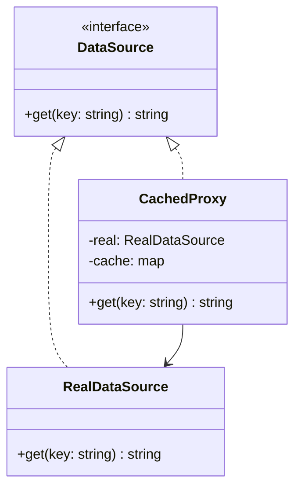

---
# Required
sidebar_position: 8
title: "Proxy Pattern — Control Access to Objects"
description: >-
  Learn the Proxy pattern to control access to objects, add caching, or defer
  expensive initialization. Includes multi-language examples.

# SEO
keywords:
  - proxy pattern
  - proxy design pattern
  - lazy loading
  - caching proxy
  - access control

difficulty: intermediate
category: structural
related_solid: [DIP, SRP]

# Social sharing
og_title: "Proxy Pattern: Control Access to Objects"
og_description: "Use a proxy to add access control, caching, or lazy loading."
og_image: "/img/social-card.svg"

# Content management
date_published: 2026-01-25
date_modified: 2026-01-25
author: shivam
reading_time: 12
content_type: explanation
---

# Proxy Pattern

<PatternMeta>
  <Difficulty level="intermediate" />
  <TimeToRead minutes={12} />
  <Prerequisites patterns={["Facade"]} />
</PatternMeta>

> **Definition:** The Proxy pattern provides a substitute object that controls access to a real object.

---

## The Problem: Expensive or Sensitive Access

We once had an API client that called an internal system with strict rate limits. Every service used the client directly, which caused bursts that triggered throttling.

**A proxy let us add caching and throttling without changing callers.**

---

## What Is the Proxy Pattern?

Proxy wraps a real object and exposes the same interface. It can perform access control, caching, lazy loading, or logging.

### Structure



### Key Components

- **Subject Interface:** The contract for both proxy and real object.
- **Real Subject:** The actual implementation.
- **Proxy:** Adds control logic while forwarding calls.

### SOLID Principles Connection

- **DIP:** Clients depend on the interface, not the real object.
- **SRP:** Access control and caching live in the proxy.

---

## When to Use Proxy

- You need lazy initialization of heavy objects.
- You want to add caching, throttling, or access control.
- You want to track usage without changing the real object.

## When NOT to Use Proxy

- The added indirection hides important latency.
- The proxy becomes a second implementation of core logic.
- The real object is cheap and safe to access directly.

---

## Implementation

<CodeTabs>
  <TabItem value="python" label="Python">
    ```python
    class DataSource:
        def get(self, key: str) -> str:
            raise NotImplementedError


    class RealDataSource(DataSource):
        def get(self, key: str) -> str:
            return f"value:{key}"


    class CachedProxy(DataSource):
        def __init__(self, real: RealDataSource) -> None:
            self.real = real
            self.cache: dict[str, str] = {}

        def get(self, key: str) -> str:
            if key not in self.cache:
                self.cache[key] = self.real.get(key)
            return self.cache[key]
    ```
  </TabItem>
  <TabItem value="typescript" label="TypeScript">
    ```typescript
    interface DataSource {
      get(key: string): string;
    }

    class RealDataSource implements DataSource {
      get(key: string): string {
        return `value:${key}`;
      }
    }

    class CachedProxy implements DataSource {
      private cache = new Map<string, string>();
      constructor(private real: RealDataSource) {}
      get(key: string): string {
        if (!this.cache.has(key)) {
          this.cache.set(key, this.real.get(key));
        }
        return this.cache.get(key)!;
      }
    }
    ```
  </TabItem>
  <TabItem value="go" label="Go">
    ```go
    package data

    type DataSource interface {
        Get(key string) string
    }

    type RealDataSource struct{}

    func (r RealDataSource) Get(key string) string {
        return "value:" + key
    }

    type CachedProxy struct {
        Real  RealDataSource
        Cache map[string]string
    }

    func NewCachedProxy(real RealDataSource) CachedProxy {
        return CachedProxy{Real: real, Cache: map[string]string{}}
    }

    func (p CachedProxy) Get(key string) string {
        if value, ok := p.Cache[key]; ok {
            return value
        }
        value := p.Real.Get(key)
        p.Cache[key] = value
        return value
    }
    ```
  </TabItem>
  <TabItem value="java" label="Java">
    ```java
    interface DataSource { String get(String key); }

    class RealDataSource implements DataSource {
        public String get(String key) { return "value:" + key; }
    }

    class CachedProxy implements DataSource {
        private final RealDataSource real;
        private final java.util.Map<String, String> cache = new java.util.HashMap<>();
        CachedProxy(RealDataSource real) { this.real = real; }
        public String get(String key) {
            if (!cache.containsKey(key)) {
                cache.put(key, real.get(key));
            }
            return cache.get(key);
        }
    }
    ```
  </TabItem>
  <TabItem value="csharp" label="C#">
    ```csharp
    public interface IDataSource
    {
        string Get(string key);
    }

    public class RealDataSource : IDataSource
    {
        public string Get(string key) => $"value:{key}";
    }

    public class CachedProxy : IDataSource
    {
        private readonly RealDataSource _real;
        private readonly Dictionary<string, string> _cache = new();
        public CachedProxy(RealDataSource real) { _real = real; }
        public string Get(string key)
        {
            if (!_cache.ContainsKey(key))
                _cache[key] = _real.Get(key);
            return _cache[key];
        }
    }
    ```
  </TabItem>
</CodeTabs>

---

## Real-World Example: Rate-Limited Clients

We used a proxy in front of an internal API client to enforce request budgets. The proxy cached common responses and throttled burst traffic. Callers were unaware, but the system stayed within limits.

---

## Performance Considerations

| Aspect | Impact | Notes |
|--------|--------|-------|
| Memory | Medium | Cache storage or proxy state |
| Runtime | Low to Medium | Proxy logic on every call |
| Complexity | Medium | Hidden behavior must be documented |

---

## Testing This Pattern

Test that the proxy forwards correctly and applies control logic.

```python
def test_proxy_caches_value() -> None:
    proxy = CachedProxy(RealDataSource())
    assert proxy.get("a") == "value:a"
    assert proxy.get("a") == "value:a"
```

---

## Common Mistakes

- Hiding latency or failures behind the proxy.
- Letting the proxy duplicate business logic.
- Forgetting to invalidate cached data.

---

## Related Patterns

| Pattern | Relationship |
|---------|--------------|
| Decorator | Adds behavior; Proxy controls access |
| Facade | Simplifies a subsystem |
| Adapter | Changes interface rather than access |

---

## Pattern Combinations

- **With Singleton:** Share one proxy instance.
- **With Strategy:** Swap proxy strategies at runtime.

---

## Try It Yourself

Implement a proxy for a file system reader that lazily loads files on demand.

---

## Frequently Asked Questions

### Is Proxy the same as Decorator?
They look similar. Proxy focuses on access control; Decorator focuses on behavior extension.

### Does Proxy always cache?
No. Caching is one proxy type.

### Can Proxy be remote?
Yes. Remote proxies represent objects in other processes.

### How do I test code using Proxy?
Verify that proxy and real object return identical results with added constraints.

---

## Key Takeaways

- **Proxy controls access without changing the public interface.**
- **Use it for caching, throttling, or lazy initialization.**
- **Document proxy behavior so callers are not surprised.**

---

## Downloads

- Proxy Cheat Sheet (Coming soon)
- Complete Code Examples (Coming soon)
- Practice Exercises (Coming soon)

---

## Navigation

- **Previous:** [Flyweight Pattern](/docs/design-patterns/structural/flyweight)
- **Next:** Behavioral Patterns Overview (coming soon)
