---
# Required
sidebar_position: 8
title: "Proxy Pattern — Controlling Access to Objects"
description: >-
  Learn the Proxy pattern to control access to objects, add caching, lazy
  loading, or rate limiting. Useful for expensive or sensitive resources.

# SEO
keywords:
  - proxy pattern
  - proxy design pattern
  - lazy loading
  - caching proxy
  - access control pattern

difficulty: intermediate
category: structural
related_solid: [DIP, SRP]

# Social sharing
og_title: "Proxy Pattern: Controlling Access to Objects"
og_description: "Control access to objects with caching, lazy loading, or rate limiting."
og_image: "/img/social-card.svg"

# Content management
date_published: 2026-01-25
date_modified: 2026-01-25
author: shivam
reading_time: 13
content_type: explanation
---

# Proxy Pattern

<PatternMeta>
  <Difficulty level="intermediate" />
  <TimeToRead minutes={13} />
  <Prerequisites patterns={["Facade", "Decorator"]} />
</PatternMeta>

The API client that kept getting rate-limited taught me why Proxy exists.

At NVIDIA, our CI/CD platform integrated with an internal secrets management service. Every build needed secrets—API keys, certificates, database credentials. The secrets service was reliable but had strict rate limits: 100 requests per minute per client.

The naive implementation called the secrets service every time a build needed a secret:

```python
def get_database_url(self) -> str:
    return self.secrets_client.get("database_url")  # Network call every time
```

A busy build that checked secrets multiple times would burn through the rate limit instantly. We'd hit 429 errors, builds would fail, and developers would complain.

**Proxy solved this by adding caching without changing any calling code:**

```python
class CachingSecretsProxy(SecretsClient):
    def __init__(self, real_client: SecretsClient, ttl: int = 60):
        self.real_client = real_client
        self.cache = {}
        self.ttl = ttl
    
    def get(self, key: str) -> str:
        if key in self.cache and not self._expired(key):
            return self.cache[key]
        
        value = self.real_client.get(key)
        self.cache[key] = {"value": value, "time": now()}
        return value
```

The calling code didn't change at all. We swapped the real client for the proxy, and rate limit errors disappeared.

---

## What Is the Proxy Pattern?

> **Definition:** Proxy provides a surrogate or placeholder for another object to control access to it.

A proxy implements the same interface as the real object. Clients use the proxy as if it were the real object, but the proxy can add behavior: caching, access control, lazy initialization, logging, rate limiting.

**The key insight: Proxy controls access without changing the interface.** Unlike Decorator (which adds functionality), Proxy controls *how* and *whether* the underlying object is accessed.

---

## Structure


### Key Components

| Component | Role |
|-----------|------|
| **Subject Interface** (`SecretsClient`) | Common interface for both proxy and real object |
| **Real Subject** (`RealSecretsClient`) | The actual implementation being proxied |
| **Proxy** (`CachingProxy`) | Controls access, adds behavior before/after delegation |

### SOLID Principles Connection

- **Dependency Inversion:** Clients depend on the interface, not on real object or proxy
- **Single Responsibility:** Access control logic is separated from business logic

---

## Types of Proxies

Understanding proxy types helps you choose the right one for your problem:

```mermaid
flowchart TB
    subgraph "Proxy Types"
        direction TB
        CP["🗄️ Caching Proxy"]
        VP["💤 Virtual Proxy"]
        PP["🔐 Protection Proxy"]
        RP["🌐 Remote Proxy"]
        LP["📝 Logging Proxy"]
    end
    
    CP --> CP_DESC["Stores results to avoid\nrepeated expensive operations"]
    VP --> VP_DESC["Defers object creation\nuntil actually needed"]
    PP --> PP_DESC["Controls access based\non permissions"]
    RP --> RP_DESC["Represents object in\ndifferent address space"]
    LP --> LP_DESC["Records requests for\ndebugging or auditing"]
```



| Type | Use Case | Example |
|------|----------|---------|
| **Caching Proxy** | Expensive operations that return same results | API responses, database queries |
| **Virtual Proxy** | Heavy objects that may not be needed | Image loading, lazy initialization |
| **Protection Proxy** | Access control | Permission checks, rate limiting |
| **Remote Proxy** | Distributed systems | RPC clients, service meshes |
| **Logging Proxy** | Observability | Audit logs, debugging, metrics |

### How a Caching Proxy Works


---

## When to Use Proxy

✅ **Use it when:**

- You need to add caching without changing client code
- You want lazy initialization of expensive objects
- You need access control or permission checking
- You want to add logging or metrics transparently
- You need to represent remote objects locally

❌ **Don't use it when:**

- The indirection would hide important latency from users
- You're adding functionality, not controlling access (use Decorator)
- The real object is cheap to access anyway
- The proxy would duplicate business logic

**Rule of thumb:** If you're controlling *access*, use Proxy. If you're adding *behavior*, use Decorator.

---

## Implementation

<CodeTabs>
  <TabItem value="python" label="Python">
    ```python
    from abc import ABC, abstractmethod
    from dataclasses import dataclass
    from time import time
    from typing import Dict, Optional


    class SecretsClient(ABC):
        """Interface for secrets management."""
        
        @abstractmethod
        def get(self, key: str) -> str:
            pass
        
        @abstractmethod
        def set(self, key: str, value: str) -> None:
            pass


    class VaultClient(SecretsClient):
        """Real implementation that talks to Vault."""
        
        def __init__(self, endpoint: str):
            self.endpoint = endpoint
            print(f"Connecting to Vault at {endpoint}")
        
        def get(self, key: str) -> str:
            print(f"Fetching {key} from Vault...")
            # Simulates network call
            return f"secret-value-for-{key}"
        
        def set(self, key: str, value: str) -> None:
            print(f"Setting {key} in Vault...")


    @dataclass
    class CacheEntry:
        value: str
        timestamp: float


    class CachingProxy(SecretsClient):
        """Proxy that caches secrets to reduce API calls."""
        
        def __init__(self, real_client: SecretsClient, ttl_seconds: int = 300):
            self._real_client = real_client
            self._cache: Dict[str, CacheEntry] = {}
            self._ttl = ttl_seconds
        
        def get(self, key: str) -> str:
            entry = self._cache.get(key)
            
            if entry and (time() - entry.timestamp) < self._ttl:
                print(f"Cache hit for {key}")
                return entry.value
            
            print(f"Cache miss for {key}")
            value = self._real_client.get(key)
            self._cache[key] = CacheEntry(value=value, timestamp=time())
            return value
        
        def set(self, key: str, value: str) -> None:
            self._real_client.set(key, value)
            # Invalidate cache on write
            if key in self._cache:
                del self._cache[key]


    class LazyInitProxy(SecretsClient):
        """Proxy that delays client creation until first use."""
        
        def __init__(self, endpoint: str):
            self._endpoint = endpoint
            self._real_client: Optional[VaultClient] = None
        
        def _get_client(self) -> VaultClient:
            if self._real_client is None:
                print("Lazy-initializing Vault client...")
                self._real_client = VaultClient(self._endpoint)
            return self._real_client
        
        def get(self, key: str) -> str:
            return self._get_client().get(key)
        
        def set(self, key: str, value: str) -> None:
            self._get_client().set(key, value)


    class RateLimitingProxy(SecretsClient):
        """Proxy that enforces rate limits."""
        
        def __init__(self, real_client: SecretsClient, max_requests: int = 100, window_seconds: int = 60):
            self._real_client = real_client
            self._max_requests = max_requests
            self._window = window_seconds
            self._requests: list[float] = []
        
        def _check_rate_limit(self) -> None:
            now = time()
            # Remove old requests outside the window
            self._requests = [t for t in self._requests if now - t < self._window]
            
            if len(self._requests) >= self._max_requests:
                raise Exception(f"Rate limit exceeded: {self._max_requests} requests per {self._window}s")
            
            self._requests.append(now)
        
        def get(self, key: str) -> str:
            self._check_rate_limit()
            return self._real_client.get(key)
        
        def set(self, key: str, value: str) -> None:
            self._check_rate_limit()
            self._real_client.set(key, value)


    # Usage: compose proxies
    real_client = VaultClient("https://vault.internal:8200")

    # Add caching
    cached_client = CachingProxy(real_client, ttl_seconds=300)

    # Add rate limiting
    protected_client = RateLimitingProxy(cached_client, max_requests=100)

    # Use like any SecretsClient
    secret = protected_client.get("database_url")
    secret = protected_client.get("database_url")  # Cache hit
    ```
  </TabItem>
  <TabItem value="typescript" label="TypeScript">
    ```typescript
    interface SecretsClient {
      get(key: string): Promise<string>;
      set(key: string, value: string): Promise<void>;
    }

    class VaultClient implements SecretsClient {
      constructor(private endpoint: string) {
        console.log(`Connecting to Vault at ${endpoint}`);
      }

      async get(key: string): Promise<string> {
        console.log(`Fetching ${key} from Vault...`);
        return `secret-value-for-${key}`;
      }

      async set(key: string, value: string): Promise<void> {
        console.log(`Setting ${key} in Vault...`);
      }
    }

    interface CacheEntry {
      value: string;
      timestamp: number;
    }

    class CachingProxy implements SecretsClient {
      private cache = new Map<string, CacheEntry>();

      constructor(
        private realClient: SecretsClient,
        private ttlSeconds = 300
      ) {}

      async get(key: string): Promise<string> {
        const entry = this.cache.get(key);
        const now = Date.now();

        if (entry && now - entry.timestamp < this.ttlSeconds * 1000) {
          console.log(`Cache hit for ${key}`);
          return entry.value;
        }

        console.log(`Cache miss for ${key}`);
        const value = await this.realClient.get(key);
        this.cache.set(key, { value, timestamp: now });
        return value;
      }

      async set(key: string, value: string): Promise<void> {
        await this.realClient.set(key, value);
        this.cache.delete(key);
      }
    }

    class LazyInitProxy implements SecretsClient {
      private realClient: VaultClient | null = null;

      constructor(private endpoint: string) {}

      private getClient(): VaultClient {
        if (!this.realClient) {
          console.log("Lazy-initializing Vault client...");
          this.realClient = new VaultClient(this.endpoint);
        }
        return this.realClient;
      }

      async get(key: string): Promise<string> {
        return this.getClient().get(key);
      }

      async set(key: string, value: string): Promise<void> {
        return this.getClient().set(key, value);
      }
    }

    class RateLimitingProxy implements SecretsClient {
      private requests: number[] = [];

      constructor(
        private realClient: SecretsClient,
        private maxRequests = 100,
        private windowSeconds = 60
      ) {}

      private checkRateLimit(): void {
        const now = Date.now();
        const windowMs = this.windowSeconds * 1000;
        
        this.requests = this.requests.filter((t) => now - t < windowMs);
        
        if (this.requests.length >= this.maxRequests) {
          throw new Error(`Rate limit exceeded`);
        }
        
        this.requests.push(now);
      }

      async get(key: string): Promise<string> {
        this.checkRateLimit();
        return this.realClient.get(key);
      }

      async set(key: string, value: string): Promise<void> {
        this.checkRateLimit();
        return this.realClient.set(key, value);
      }
    }
    ```
  </TabItem>
  <TabItem value="go" label="Go">
    ```go
    package secrets

    import (
        "fmt"
        "sync"
        "time"
    )

    // SecretsClient is the subject interface
    type SecretsClient interface {
        Get(key string) (string, error)
        Set(key, value string) error
    }

    // VaultClient is the real implementation
    type VaultClient struct {
        endpoint string
    }

    func NewVaultClient(endpoint string) *VaultClient {
        fmt.Printf("Connecting to Vault at %s\n", endpoint)
        return &VaultClient{endpoint: endpoint}
    }

    func (v *VaultClient) Get(key string) (string, error) {
        fmt.Printf("Fetching %s from Vault...\n", key)
        return fmt.Sprintf("secret-value-for-%s", key), nil
    }

    func (v *VaultClient) Set(key, value string) error {
        fmt.Printf("Setting %s in Vault...\n", key)
        return nil
    }

    // CachingProxy adds caching
    type CachingProxy struct {
        realClient SecretsClient
        cache      map[string]cacheEntry
        ttl        time.Duration
        mu         sync.RWMutex
    }

    type cacheEntry struct {
        value     string
        timestamp time.Time
    }

    func NewCachingProxy(client SecretsClient, ttl time.Duration) *CachingProxy {
        return &CachingProxy{
            realClient: client,
            cache:      make(map[string]cacheEntry),
            ttl:        ttl,
        }
    }

    func (p *CachingProxy) Get(key string) (string, error) {
        p.mu.RLock()
        entry, exists := p.cache[key]
        p.mu.RUnlock()

        if exists && time.Since(entry.timestamp) < p.ttl {
            fmt.Printf("Cache hit for %s\n", key)
            return entry.value, nil
        }

        fmt.Printf("Cache miss for %s\n", key)
        value, err := p.realClient.Get(key)
        if err != nil {
            return "", err
        }

        p.mu.Lock()
        p.cache[key] = cacheEntry{value: value, timestamp: time.Now()}
        p.mu.Unlock()

        return value, nil
    }

    func (p *CachingProxy) Set(key, value string) error {
        err := p.realClient.Set(key, value)
        if err != nil {
            return err
        }

        p.mu.Lock()
        delete(p.cache, key)
        p.mu.Unlock()

        return nil
    }

    // LazyInitProxy delays initialization
    type LazyInitProxy struct {
        endpoint   string
        realClient *VaultClient
        once       sync.Once
    }

    func NewLazyInitProxy(endpoint string) *LazyInitProxy {
        return &LazyInitProxy{endpoint: endpoint}
    }

    func (p *LazyInitProxy) getClient() *VaultClient {
        p.once.Do(func() {
            fmt.Println("Lazy-initializing Vault client...")
            p.realClient = NewVaultClient(p.endpoint)
        })
        return p.realClient
    }

    func (p *LazyInitProxy) Get(key string) (string, error) {
        return p.getClient().Get(key)
    }

    func (p *LazyInitProxy) Set(key, value string) error {
        return p.getClient().Set(key, value)
    }
    ```
  </TabItem>
  <TabItem value="java" label="Java">
    ```java
    import java.util.*;
    import java.util.concurrent.ConcurrentHashMap;

    interface SecretsClient {
        String get(String key);
        void set(String key, String value);
    }

    class VaultClient implements SecretsClient {
        VaultClient(String endpoint) {
            System.out.printf("Connecting to Vault at %s%n", endpoint);
        }

        @Override
        public String get(String key) {
            System.out.printf("Fetching %s from Vault...%n", key);
            return "secret-value-for-" + key;
        }

        @Override
        public void set(String key, String value) {
            System.out.printf("Setting %s in Vault...%n", key);
        }
    }

    class CachingProxy implements SecretsClient {
        private final SecretsClient realClient;
        private final Map<String, CacheEntry> cache = new ConcurrentHashMap<>();
        private final long ttlMs;

        record CacheEntry(String value, long timestamp) {}

        CachingProxy(SecretsClient realClient, int ttlSeconds) {
            this.realClient = realClient;
            this.ttlMs = ttlSeconds * 1000L;
        }

        @Override
        public String get(String key) {
            CacheEntry entry = cache.get(key);
            long now = System.currentTimeMillis();

            if (entry != null && (now - entry.timestamp()) < ttlMs) {
                System.out.printf("Cache hit for %s%n", key);
                return entry.value();
            }

            System.out.printf("Cache miss for %s%n", key);
            String value = realClient.get(key);
            cache.put(key, new CacheEntry(value, now));
            return value;
        }

        @Override
        public void set(String key, String value) {
            realClient.set(key, value);
            cache.remove(key);
        }
    }

    class LazyInitProxy implements SecretsClient {
        private final String endpoint;
        private volatile VaultClient realClient;

        LazyInitProxy(String endpoint) {
            this.endpoint = endpoint;
        }

        private VaultClient getClient() {
            if (realClient == null) {
                synchronized (this) {
                    if (realClient == null) {
                        System.out.println("Lazy-initializing Vault client...");
                        realClient = new VaultClient(endpoint);
                    }
                }
            }
            return realClient;
        }

        @Override
        public String get(String key) {
            return getClient().get(key);
        }

        @Override
        public void set(String key, String value) {
            getClient().set(key, value);
        }
    }
    ```
  </TabItem>
  <TabItem value="csharp" label="C#">
    ```csharp
    public interface ISecretsClient
    {
        Task<string> GetAsync(string key);
        Task SetAsync(string key, string value);
    }

    public class VaultClient : ISecretsClient
    {
        public VaultClient(string endpoint)
        {
            Console.WriteLine($"Connecting to Vault at {endpoint}");
        }

        public Task<string> GetAsync(string key)
        {
            Console.WriteLine($"Fetching {key} from Vault...");
            return Task.FromResult($"secret-value-for-{key}");
        }

        public Task SetAsync(string key, string value)
        {
            Console.WriteLine($"Setting {key} in Vault...");
            return Task.CompletedTask;
        }
    }

    public class CachingProxy : ISecretsClient
    {
        private readonly ISecretsClient _realClient;
        private readonly Dictionary<string, (string Value, DateTime Timestamp)> _cache = new();
        private readonly TimeSpan _ttl;

        public CachingProxy(ISecretsClient realClient, TimeSpan ttl)
        {
            _realClient = realClient;
            _ttl = ttl;
        }

        public async Task<string> GetAsync(string key)
        {
            if (_cache.TryGetValue(key, out var entry) && DateTime.UtcNow - entry.Timestamp < _ttl)
            {
                Console.WriteLine($"Cache hit for {key}");
                return entry.Value;
            }

            Console.WriteLine($"Cache miss for {key}");
            var value = await _realClient.GetAsync(key);
            _cache[key] = (value, DateTime.UtcNow);
            return value;
        }

        public async Task SetAsync(string key, string value)
        {
            await _realClient.SetAsync(key, value);
            _cache.Remove(key);
        }
    }

    public class LazyInitProxy : ISecretsClient
    {
        private readonly string _endpoint;
        private readonly Lazy<VaultClient> _realClient;

        public LazyInitProxy(string endpoint)
        {
            _endpoint = endpoint;
            _realClient = new Lazy<VaultClient>(() =>
            {
                Console.WriteLine("Lazy-initializing Vault client...");
                return new VaultClient(_endpoint);
            });
        }

        public Task<string> GetAsync(string key) => _realClient.Value.GetAsync(key);
        public Task SetAsync(string key, string value) => _realClient.Value.SetAsync(key, value);
    }
    ```
  </TabItem>
</CodeTabs>

---

## Real-World Example: Image Loading

Virtual proxies are everywhere in image-heavy applications. Think of any gallery app that shows thumbnails but loads full images on demand:


```python
class ImageProxy(Image):
    """Proxy that loads the real image only when needed."""
    
    def __init__(self, path: str):
        self.path = path
        self._real_image: Optional[RealImage] = None
    
    def display(self) -> None:
        # Only load the (expensive) real image when actually displayed
        if self._real_image is None:
            print(f"Loading image from {self.path}...")
            self._real_image = RealImage(self.path)
        
        self._real_image.display()
    
    def get_dimensions(self) -> Tuple[int, int]:
        # Can sometimes be read from metadata without full load
        return self._read_dimensions_from_metadata()
```

**Why this matters:** In a gallery with 1,000 images, loading all of them at startup would take minutes. With virtual proxies, only visible images load. Users see thumbnails instantly, and full images load on-demand.

---

## Performance Considerations

| Aspect | Impact | Notes |
|--------|--------|-------|
| Memory | Varies | Caching proxies use more memory; lazy proxies use less initially |
| Runtime | Can improve | Caching reduces network calls; lazy loading defers expensive work |
| Complexity | Medium | Hidden behavior must be documented |

**Critical:** Proxies can hide latency. If users don't know that a method call might hit the network (on cache miss), they might use it in performance-sensitive paths.

---

## Testing This Pattern

Test that the proxy behaves correctly and forwards appropriately:

```python
def test_caching_proxy_returns_cached_value():
    mock_client = Mock(SecretsClient)
    mock_client.get.return_value = "secret123"
    
    proxy = CachingProxy(mock_client, ttl_seconds=300)
    
    # First call - cache miss
    result1 = proxy.get("api_key")
    # Second call - cache hit
    result2 = proxy.get("api_key")
    
    assert result1 == "secret123"
    assert result2 == "secret123"
    assert mock_client.get.call_count == 1  # Only called once!


def test_caching_proxy_invalidates_on_write():
    mock_client = Mock(SecretsClient)
    mock_client.get.return_value = "value"
    
    proxy = CachingProxy(mock_client, ttl_seconds=300)
    
    proxy.get("key")  # Cache the value
    proxy.set("key", "new_value")  # Should invalidate
    proxy.get("key")  # Should be a cache miss
    
    assert mock_client.get.call_count == 2


def test_lazy_proxy_defers_initialization():
    proxy = LazyInitProxy("https://vault:8200")
    
    # Client should not be created yet
    assert proxy._real_client is None
    
    # Now access triggers initialization
    proxy.get("key")
    assert proxy._real_client is not None
```

---

## Common Mistakes

### 1. Hiding latency inappropriately

```python
# Looks instant but might hit network
value = client.get("key")  # Is this cached? 10ms? 2000ms?
```

Document proxy behavior clearly. Consider different interfaces for cached vs. uncached access.

### 2. Cache invalidation bugs

```python
def set(self, key: str, value: str) -> None:
    self.real_client.set(key, value)
    # Forgot to invalidate cache!
```

Cache invalidation is "one of the two hard problems." Test it thoroughly.

### 3. Proxy duplicating business logic

```python
class BadProxy(SecretsClient):
    def get(self, key: str) -> str:
        if not key.startswith("allowed_"):  # This is business logic!
            raise PermissionError()
        return self.real_client.get(key)
```

Proxies should control access, not implement business rules.

---

## Proxy vs. Decorator

These patterns look similar but serve different purposes:

```mermaid
flowchart TB
    subgraph Proxy["🔒 Proxy Pattern"]
        direction TB
        P1["Controls ACCESS"]
        P2["May prevent calls entirely"]
        P3["Often manages lifecycle"]
        P4["Caching, lazy loading, auth"]
    end
    
    subgraph Decorator["🎁 Decorator Pattern"]
        direction TB
        D1["Adds BEHAVIOR"]
        D2["Always delegates to wrapped"]
        D3["Doesn't manage lifecycle"]
        D4["Logging, metrics, retry"]
    end
    
    Question{"What are you doing?"}
    Question -->|"Controlling IF/WHEN\nclient accesses object"| Proxy
    Question -->|"Adding behavior\nBEFORE/AFTER access"| Decorator
```



| Aspect | Proxy | Decorator |
|--------|-------|-----------|
| **Intent** | Control access | Add behavior |
| **May block calls?** | Yes (caching, rate limiting) | No (always delegates) |
| **Lifecycle** | May manage object lifecycle | Doesn't manage lifecycle |
| **Stacking** | Rarely stacked | Commonly stacked |
| **Example** | Cache that returns stored value | Logger that wraps and logs |

### Quick Decision Guide

```python
# Use PROXY when you might NOT call the real object:
class CachingProxy:
    def get(self, key):
        if key in self.cache:
            return self.cache[key]  # Real object NOT called
        return self.real.get(key)

# Use DECORATOR when you ALWAYS call the real object:
class LoggingDecorator:
    def get(self, key):
        print(f"Getting {key}")
        result = self.wrapped.get(key)  # Real object ALWAYS called
        print(f"Got {result}")
        return result
```

**Rule of thumb:** If you're controlling *whether/when* something is accessed, use Proxy. If you're adding *extra behavior* around access, use Decorator.

---

## Key Takeaways

:::tip Quick Reference Card
| Question | Answer |
|----------|--------|
| **What does Proxy do?** | Controls access to an object without changing its interface |
| **When to use it?** | Caching, lazy loading, access control, rate limiting |
| **Key benefit?** | Add cross-cutting concerns transparently |
| **Watch out for?** | Hidden latency, cache invalidation bugs |
| **Similar patterns?** | Decorator (adds behavior, doesn't control access) |
:::

- **Proxy controls access without changing the interface.** Clients don't know they're using a proxy.

- **Different proxy types for different purposes.** Caching, lazy loading, rate limiting, access control.

- **Be careful about hidden latency.** Document what the proxy does. A method that *looks* fast might hit the network on cache miss.

- **Cache invalidation is tricky.** Test it thoroughly. As the saying goes: "There are only two hard things in computer science: cache invalidation and naming things."


---

## Navigation

- **Previous:** [Flyweight Pattern](/docs/design-patterns/structural/flyweight)
- **Next:** [Behavioral Patterns Overview](/docs/design-patterns/behavioral)
