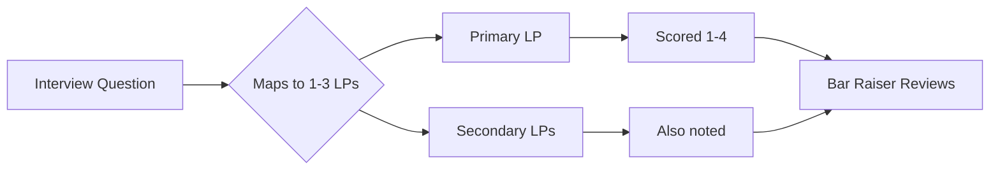

import { TimeEstimate, ConfidenceBuilder } from '@site/src/components/interview-guide';

# Amazon Leadership Principles: The Complete Guide

Amazon interviews are defined by Leadership Principles. Every question—behavioral and technical—maps to one or more LPs. **Master these, master Amazon interviews.**

<TimeEstimate
  learnTime="45-60 minutes"
  practiceTime="4-6 hours"
  masteryTime="32+ stories prepared (2 per LP)"
  interviewFrequency="100% at Amazon"
  difficultyRange="Company-specific"
  prerequisites="STAR Method"
/>

---

## How Amazon Uses LPs

**Key insight:** Amazon interviewers are assigned specific LPs to assess. Your story should demonstrate the primary LP clearly while touching others naturally.

---

## The 16 Leadership Principles

### 1. Customer Obsession 🔑

**"Leaders start with the customer and work backwards."**

This is LP #1 for a reason. Amazon's entire culture revolves around customer obsession.

**Sample Questions:**
- "Tell me about a time you went above and beyond for a customer"
- "Describe when customer feedback changed your approach"
- "When did you make a decision that prioritized long-term customer benefit over short-term gains?"

**Full STAR Example:**

> **SITUATION:** "Our e-commerce platform had a checkout flow that required 7 steps. Customer feedback surveys showed 23% abandonment at checkout, with complaints about complexity."
>
> **TASK:** "I wanted to reduce checkout friction, but our product manager prioritized other features. I needed to make the case with data."
>
> **ACTION:** "I analyzed session recordings and identified the exact drop-off points. I built a prototype of a 3-step checkout and ran an A/B test with 5% of traffic—using feature flags so we could roll back instantly. I documented customer complaints categorized by checkout step."
>
> **RESULT:** "The simplified flow reduced abandonment by 31%. We rolled it out fully, which translated to an estimated $2.3M additional annual revenue. More importantly, our NPS score increased 12 points."

**What they want to hear:**
- Customer-first thinking (not business-first)
- Understanding needs beyond stated requirements
- Measuring success by customer impact, not just business metrics

---

### 2. Ownership

**"Leaders act on behalf of the entire company. They never say 'that's not my job.'"**

**Sample Questions:**
- "Tell me about a time you took on something outside your area"
- "Describe when you saw a problem and owned the solution"
- "When did you sacrifice short-term for long-term?"

**Full STAR Example:**

> **SITUATION:** "I noticed our deployment pipeline was causing issues across multiple teams—builds took 45 minutes and flaky tests caused false failures 20% of the time. It wasn't my team's responsibility to fix."
>
> **TASK:** "I decided to own the problem even though it was technically the DevOps team's domain. They were underwater with other priorities."
>
> **ACTION:** "I spent evenings profiling the build system and identified that parallel test execution was misconfigured. I fixed the parallelization, added test result caching, and documented the changes. I also set up monitoring alerts for build times."
>
> **RESULT:** "Build times dropped from 45 to 12 minutes. The DevOps team adopted my changes company-wide. I saved an estimated 15 engineering hours per week across teams. My manager cited this as a key reason for my promotion."

**What they want to hear:**
- Taking initiative without being asked
- Long-term thinking over short-term convenience
- "I" statements showing personal accountability
- Never blaming others or circumstances

---

### 3. Invent and Simplify

**"Leaders expect and require innovation and invention from their teams."**

**Sample Questions:**
- "Tell me about an innovative solution you created"
- "Describe simplifying a complex process"
- "When did you question the status quo?"

**Full STAR Example:**

> **SITUATION:** "Our team's code review process required reviewers to manually check 15 different style guidelines and security patterns. Reviews took hours and still missed issues."
>
> **TASK:** "I wanted to automate the tedious parts so reviewers could focus on logic and architecture."
>
> **ACTION:** "I built a custom linting pipeline that ran automatically on PR creation. I added security pattern detection using AST parsing. The tool generated a checklist comment on each PR showing what passed/failed. I also created a simple web dashboard showing team code health trends."
>
> **RESULT:** "Review time dropped 60%. We caught 3 security issues that would have reached production. Other teams adopted the tool, and it became a company standard."

**What they want to hear:**
- Creative problem-solving
- Questioning "how it's always been done"
- Simplifying for customers/teammates
- Measurable improvement

---

### 4. Are Right, A Lot

**"Leaders have strong judgment and good instincts. They seek diverse perspectives."**

**Sample Questions:**
- "Tell me about a decision you made with incomplete data"
- "Describe when your judgment differed from the team and you were right"
- "When were you wrong? How did you handle it?"

**Full STAR Example:**

> **SITUATION:** "Our team was debating between two database solutions for a new service: PostgreSQL (familiar) vs DynamoDB (better fit but unknown). The majority favored PostgreSQL for familiarity."
>
> **TASK:** "I believed DynamoDB was the right choice based on our access patterns and scale requirements, but I needed to make a data-driven case."
>
> **ACTION:** "I built proof-of-concepts with both databases, simulating our expected load patterns. I documented the tradeoffs: PostgreSQL would require complex sharding at scale, while DynamoDB handled it natively. I presented the analysis with specific scenarios where each would succeed or fail."
>
> **RESULT:** "We chose DynamoDB. Six months later, when we hit 10x traffic, it scaled automatically with no changes. The PostgreSQL path would have required a major re-architecture. My manager noted this as an example of good technical judgment."

**What they want to hear:**
- Sound decision-making process
- Seeking diverse perspectives, not just confirming bias
- Willingness to change mind with new data
- Learning from times you were wrong

---

### 5. Learn and Be Curious

**"Leaders are never done learning and always seek to improve themselves."**

**Sample Questions:**
- "Tell me about something new you learned recently"
- "How do you stay current in your field?"
- "Describe learning something outside your comfort zone"

**Full STAR Example:**

> **SITUATION:** "I was a backend engineer with no frontend experience. Our team needed to build a complex data visualization dashboard, and we didn't have frontend resources."
>
> **TASK:** "I volunteered to learn React and D3.js to build it myself rather than wait months for frontend availability."
>
> **ACTION:** "I spent 3 weeks in my evenings learning React fundamentals through documentation and building small projects. I found a D3 course specifically for React integration. I paired with a frontend engineer on another team for code reviews to ensure I was following best practices."
>
> **RESULT:** "I delivered the dashboard in 6 weeks. It's still in production 2 years later. I've since become the team's go-to for frontend work and have mentored two backend engineers in React."

**What they want to hear:**
- Continuous learning mindset
- Curiosity beyond your immediate role
- Applying new knowledge to create value
- Growth mindset, not fixed

---

### 6. Hire and Develop the Best

**"Leaders raise the performance bar with every hire and promotion."**

**Sample Questions:**
- "Tell me about someone you hired or mentored"
- "Describe developing a struggling team member"
- "When did you have to make a difficult hiring decision?"

**Full STAR Example:**

> **SITUATION:** "A junior engineer on my team was struggling—missing deadlines, code quality issues, and seemed disengaged. My manager suggested we might need to let them go."
>
> **TASK:** "I believed they had potential and asked for 2 months to try a different approach before making that decision."
>
> **ACTION:** "I started weekly 1:1s focused entirely on their growth. I discovered they felt overwhelmed by our codebase and afraid to ask 'dumb questions.' I broke their tasks into smaller chunks with clear success criteria. I assigned them as my pair-programming partner on a feature, letting them drive while I guided. I publicly celebrated their wins in team standups."
>
> **RESULT:** "Within 2 months, they were meeting deadlines consistently. Within 6 months, they were mentoring new hires themselves. They're now a senior engineer. They later told me they'd been about to quit before our mentoring relationship started."

**What they want to hear:**
- Investing in others' growth
- Raising the bar, not lowering it
- Recognizing potential
- Making hard decisions when development doesn't work

---

### 7. Insist on the Highest Standards

**"Leaders have relentlessly high standards that many may think are unreasonably high."**

**Sample Questions:**
- "Tell me about refusing to compromise on quality"
- "Describe raising the bar on a project"
- "When did you push back on 'good enough'?"

**Full STAR Example:**

> **SITUATION:** "We were launching a payment feature with a tight deadline. QA found edge cases that affected 0.1% of transactions. The PM said we could fix post-launch since 99.9% worked."
>
> **TASK:** "I believed we shouldn't launch with known payment bugs, regardless of percentage. Payment failures destroy customer trust."
>
> **ACTION:** "I calculated the actual customer impact: 0.1% of our transaction volume meant 500 customers per day would see failures. I presented this to the PM and proposed a 3-day delay to fix the issues properly. I also created a test suite specifically for payment edge cases to prevent future regressions."
>
> **RESULT:** "We delayed launch by 3 days and fixed all edge cases. Post-launch, we had zero payment-related support tickets for the first month. The PM later thanked me—a competitor had launched a similar feature with bugs and faced social media backlash."

**What they want to hear:**
- High quality bar
- Not accepting "good enough" when it matters
- Holding others accountable to standards
- Specific quality metrics, not vague claims

---

### 8. Think Big

**"Thinking small is a self-fulfilling prophecy. Leaders create bold direction."**

**Sample Questions:**
- "Tell me about a bold goal you set"
- "Describe proposing something ambitious"
- "When did you think beyond immediate constraints?"

**Full STAR Example:**

> **SITUATION:** "Our team was manually processing customer data migrations, handling about 50 per month. The process took 2 days each."
>
> **TASK:** "Rather than just optimizing the manual process, I proposed building a self-service migration platform that could handle 1000+ per month."
>
> **ACTION:** "I created a design document showing how a self-service platform could scale our capacity 20x while reducing per-migration cost by 95%. I identified that 80% of migrations followed the same pattern and could be automated. I built a prototype demonstrating the core flow and presented to leadership with a 6-month roadmap."
>
> **RESULT:** "We got approval and dedicated resources. The platform launched in 5 months and handled 2000 migrations in year one—40x our previous capacity. It became a key selling point for enterprise customers."

**What they want to hear:**
- Bold vision beyond incremental improvement
- Not limited by current constraints
- Ability to inspire others
- Long-term impact thinking

---

### 9. Bias for Action

**"Speed matters in business. Many decisions and actions are reversible."**

**Sample Questions:**
- "Tell me about making a quick decision"
- "Describe acting without waiting for complete information"
- "When did analysis paralysis hurt a project?"

**Full STAR Example:**

> **SITUATION:** "On a Friday afternoon, our monitoring showed a memory leak causing gradual degradation. We had two options: roll back to last week's release (safe but loses 5 features) or try to hotfix the specific issue (faster but riskier)."
>
> **TASK:** "As the on-call engineer, I needed to decide quickly—degradation would become critical in 2 hours."
>
> **ACTION:** "I spent 15 minutes analyzing recent commits and identified the likely culprit—a cache that wasn't being evicted. I deployed a hotfix to one server, monitored for 10 minutes, and saw memory stabilize. I then rolled it out to all servers with the rollback command ready if metrics degraded."
>
> **RESULT:** "The hotfix worked. We avoided rolling back 5 features and avoided a Saturday incident. I documented the decision process and added a memory monitoring alert to catch similar issues earlier."

**What they want to hear:**
- Taking calculated risks
- Moving fast when appropriate
- Distinguishing reversible from irreversible decisions
- Learning from action, not just analysis

---

### 10. Frugality

**"Accomplish more with less. Constraints breed resourcefulness."**

**Sample Questions:**
- "Tell me about doing more with limited resources"
- "Describe a creative solution that saved money"
- "When did you accomplish something without a budget?"

**Full STAR Example:**

> **SITUATION:** "Our team needed a testing environment that mirrored production, but we didn't have budget for duplicate infrastructure (~$50K/month)."
>
> **TASK:** "I needed to find a way to test effectively without the full cost."
>
> **ACTION:** "I designed a scaled-down environment using spot instances that cost 70% less. I created scripts to spin up the environment on-demand and tear it down when not in use. I also implemented traffic replay using sampled production logs rather than synthetic data."
>
> **RESULT:** "Our testing environment cost $8K/month instead of $50K—84% savings. The on-demand model meant we only paid when actually testing. This approach was adopted by three other teams."

**What they want to hear:**
- Resourcefulness under constraints
- Not just cost-cutting but creative solutions
- Self-sufficiency
- Frugality enabling, not limiting

---

### 11. Earn Trust

**"Leaders listen attentively, speak candidly, and treat others respectfully."**

**Sample Questions:**
- "Tell me about building trust with a skeptical stakeholder"
- "Describe giving difficult feedback"
- "When did you have to rebuild trust?"

**Full STAR Example:**

> **SITUATION:** "A product manager didn't trust engineering estimates after several missed deadlines (before I joined). They micromanaged and questioned every timeline."
>
> **TASK:** "I wanted to rebuild trust so we could work collaboratively instead of adversarially."
>
> **ACTION:** "I started by acknowledging the history: 'I understand there have been missed deadlines. Here's what I'm doing differently.' I broke my estimates into visible milestones with demo checkpoints. When I saw risk, I communicated early—not at deadline. I also admitted when I was wrong: one estimate was off by 40%, and I explained why and what I learned."
>
> **RESULT:** "After 3 months of hitting milestones, the PM stopped micromanaging. They started defending engineering estimates to stakeholders. We developed a strong working relationship—they specifically requested to keep working with me on future projects."

**What they want to hear:**
- Honest communication even when difficult
- Admitting mistakes
- Building relationships over time
- Respectful disagreement

---

### 12. Dive Deep

**"Leaders operate at all levels, stay connected to the details, and audit frequently."**

**Sample Questions:**
- "Tell me about digging into details others missed"
- "Describe finding a problem through investigation"
- "When did you catch something important that wasn't obvious?"

**Full STAR Example:**

> **SITUATION:** "Our service's P99 latency had gradually increased from 100ms to 300ms over 3 months. Multiple engineers had investigated and found nothing."
>
> **TASK:** "I decided to do a deep investigation—not just look at the usual suspects but trace the entire request path."
>
> **ACTION:** "I added detailed timing instrumentation to every step of the request flow. I analyzed the distribution of slow requests—they weren't random, they clustered at specific times. I correlated with system metrics and found that garbage collection pauses had increased. Digging further, I discovered a memory leak in a rarely-used code path that was slowly growing the heap."
>
> **RESULT:** "Fixed the memory leak, and P99 dropped back to 100ms. The investigation also identified two other latent issues that would have become problems later. I created a latency investigation playbook for the team."

**What they want to hear:**
- Hands-on investigation
- Data-driven analysis
- Attention to details others miss
- Not just delegating investigation

---

### 13. Have Backbone; Disagree and Commit

**"Leaders are obligated to respectfully challenge decisions when they disagree."**

**Sample Questions:**
- "Tell me about disagreeing with your manager"
- "Describe changing your mind after disagreement"
- "When did you commit fully after disagreeing?"

**Full STAR Example:**

> **SITUATION:** "My manager wanted to rewrite our legacy service from scratch—a 6-month project. I believed incremental migration was safer and could deliver value sooner."
>
> **TASK:** "I needed to voice my disagreement respectfully and with data, then fully commit to whatever decision was made."
>
> **ACTION:** "I created a comparison document: rewrite vs incremental migration. I listed risks (rewrite had higher failure risk historically), timelines, and customer impact. I presented my case clearly in a 1:1. My manager heard me out but explained factors I hadn't considered—the legacy code had fundamental architectural issues that incremental migration couldn't solve."
>
> **RESULT:** "We went with the rewrite. Once decided, I committed fully—I didn't undermine the decision or say 'I told you so' when we hit obstacles. The rewrite succeeded, and my manager thanked me for both the challenge and the commitment. It taught me that disagreement should be about seeking the best outcome, not being right."

**What they want to hear:**
- Respectful challenge with data
- Willingness to be persuaded
- Full commitment once decided
- Not being disagreeable, just disagreeing

---

### 14. Deliver Results

**"Leaders focus on the key inputs for their business and deliver them with the right quality and in a timely fashion."**

**Sample Questions:**
- "Tell me about delivering under pressure"
- "Describe overcoming obstacles to deliver results"
- "When did you have to make tradeoffs to deliver?"

**Full STAR Example:**

> **SITUATION:** "Two weeks before a major customer launch, we discovered a critical integration bug that would take 3 weeks to fix properly."
>
> **TASK:** "I needed to find a way to meet the launch date without shipping a broken product."
>
> **ACTION:** "I identified the specific customer workflows affected and found that a workaround could handle 95% of cases. I built the workaround in 4 days, created documentation for the remaining 5% (manual process with support), and implemented the proper fix in parallel. I communicated the tradeoff clearly to stakeholders: we can launch on time with this approach, or delay 3 weeks for perfect."
>
> **RESULT:** "We launched on time. The customer was happy—they preferred launching with a minor workaround over delaying. The proper fix shipped 2 weeks post-launch with no customer impact."

**What they want to hear:**
- Results orientation over activity
- Overcoming real obstacles
- Clear communication about tradeoffs
- Metrics and outcomes, not just effort

---

### 15. Strive to be Earth's Best Employer

**"Leaders work every day to create a safer, more productive, more diverse, and more just work environment."**

**Sample Questions:**
- "Tell me about making your workplace better"
- "Describe helping a struggling colleague"
- "How do you create an inclusive environment?"

**Full STAR Example:**

> **SITUATION:** "I noticed our team's on-call rotation was burning people out—we had 1-week shifts with frequent pages. Two engineers had mentioned it was affecting their personal lives."
>
> **TASK:** "I wanted to improve on-call without reducing reliability."
>
> **ACTION:** "I proposed changes: shorter shifts (3-4 days instead of 7), follow-the-sun rotation with our European team, and a runbook improvement sprint. I also tracked page frequency and identified that 60% of pages were low-urgency items that could wait until morning. I implemented tiered alerting—true emergencies paged immediately, others went to a queue reviewed at start of day."
>
> **RESULT:** "After-hours pages dropped 55%. On-call satisfaction (surveyed) improved significantly. Two engineers who had been considering leaving mentioned this was a factor in staying. The approach was adopted by other teams."

**What they want to hear:**
- Proactive workplace improvement
- Work-life balance awareness
- Inclusive environment creation
- Acting as a force multiplier for team wellbeing

---

### 16. Success and Scale Bring Broad Responsibility

**"Leaders create more than they consume and always leave things better than they found them."**

**Sample Questions:**
- "Tell me about positive impact beyond your immediate work"
- "Describe considering broader implications of a decision"
- "How do you think about your work's wider effects?"

**Full STAR Example:**

> **SITUATION:** "Our team's compute usage had grown 3x in a year. I realized we were consuming significant resources but hadn't thought about the broader impact—both cost to the company and environmental footprint."
>
> **TASK:** "I wanted to optimize our resource usage not just for cost savings but as a responsibility to use resources efficiently."
>
> **ACTION:** "I audited our services and found many were over-provisioned—running at 15% CPU average. I right-sized instances, implemented auto-scaling, and moved batch jobs to spot instances. I also documented our optimization playbook and shared it with other teams."
>
> **RESULT:** "We reduced compute costs by 40% ($120K annually) and carbon footprint proportionally. The playbook was adopted by 8 other teams. I realized that at scale, small efficiency improvements have large cumulative impact."

**What they want to hear:**
- Long-term and broad thinking
- Environmental/social awareness
- Leaving things better than you found them
- Responsibility that comes with influence

---

## Preparation Strategy

### Build Your Story Matrix

Prepare 2 stories per LP. Many stories can cover 2-3 LPs:

| Story | Primary LP | Secondary LPs |
|-------|------------|---------------|
| Checkout optimization | Customer Obsession | Bias for Action, Deliver Results |
| Build system fix | Ownership | Invent and Simplify |
| Junior engineer mentoring | Hire and Develop Best | Earn Trust |
| Payment quality pushback | Highest Standards | Have Backbone |

### Story Checklist

Each story should have:

- [ ] Clear STAR structure (2-3 minutes)
- [ ] Quantified results (numbers, percentages)
- [ ] Your specific actions ("I" not "we")
- [ ] Lessons learned / reflection
- [ ] Addresses primary LP directly
- [ ] No red flags (blaming, "we" without your contribution)

---

## Common Mistakes

| Mistake | Why It Hurts | Better Approach |
|---------|--------------|-----------------|
| Using "we" exclusively | Can't assess YOUR contribution | "The team delivered X. My role was Y." |
| No metrics | Sounds like unverified claims | "Reduced by X%" / "Improved Y metric" |
| Blaming others | Shows lack of ownership | Own the situation, not blame |
| Too short (under 1 min) | Insufficient depth | Expand with details and reflection |
| Too long (over 4 min) | Loses interviewer | Practice to hit 2-3 minute sweet spot |

---

<ConfidenceBuilder type="youve-got-this" title="You Already Have LP Stories">

**You've lived these principles—you just need to name them.**

Every time you:
- Put users first → Customer Obsession
- Fixed something not your job → Ownership
- Questioned how things were done → Invent and Simplify
- Made a tough call → Are Right, A Lot

The stories exist. This guide helps you map them to Amazon's language.

</ConfidenceBuilder>

---

## Key Takeaways

1. **Customer Obsession is #1.** When in doubt, tie back to customer impact.

2. **Have 2 stories per LP.** Some stories naturally cover multiple principles.

3. **Use data and metrics.** Amazon is data-driven. "I improved performance" → "I improved P99 latency by 60%."

4. **Show ownership.** Never blame others. Own situations, not just successes.

5. **Practice out loud.** 2-3 minutes per answer. Record yourself.

6. **Reflect at the end.** What you learned shows growth mindset.

---

## What's Next?

More company-specific preparation:

**See also:** [STAR Method Guide](/docs/interview-guide/behavioral/star-method) — Structure your behavioral answers
