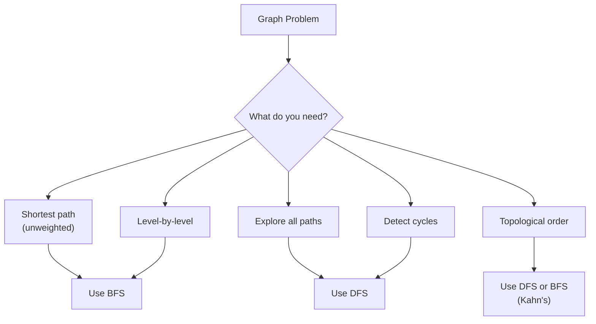

import { LanguageSelector, TimeEstimate, ConfidenceBuilder, DifficultyBadge } from '@site/src/components/interview-guide';
import { CodeTabs } from '@site/src/components/design-patterns/CodeTabs';
import TabItem from '@theme/TabItem';

# Graphs: Where Relationships Get Complex

Trees are graphs with rules: one parent, no cycles. Remove those rules, and you get graphs—the most flexible data structure for modeling relationships.

Social networks. Road maps. Course prerequisites. The internet itself. All graphs.

The first time I solved "Number of Islands," I spent 30 minutes trying to figure out why my solution was visiting cells multiple times. The breakthrough: **marking cells as visited as you add them to the queue, not when you process them.** That single insight eliminated the bug.

**If a problem involves connections between entities, think graph.**

<LanguageSelector />

<TimeEstimate
  learnTime="40-50 minutes"
  practiceTime="4-5 hours"
  masteryTime="15-20 problems"
  interviewFrequency="60%"
  difficultyRange="Medium to Hard"
  prerequisites="Trees, Stacks & Queues"
/>

---

## Graph Representations

### Adjacency List (Use This for Interviews)

<CodeTabs>
<TabItem value="python" label="Python">

```python
from collections import defaultdict

# Build graph from edges
def build_graph(edges: list[list[int]], directed: bool = False) -> dict[int, list[int]]:
    graph: dict[int, list[int]] = defaultdict(list)
    
    for u, v in edges:
        graph[u].append(v)
        if not directed:
            graph[v].append(u)
    
    return graph

# Example
edges = [[0, 1], [0, 2], [1, 2], [2, 3]]
graph = build_graph(edges)
# {0: [1, 2], 1: [0, 2], 2: [0, 1, 3], 3: [2]}
```

</TabItem>
<TabItem value="typescript" label="TypeScript">

```typescript
function buildGraph(
  edges: number[][],
  directed: boolean = false
): Map<number, number[]> {
  const graph = new Map<number, number[]>();

  for (const [u, v] of edges) {
    if (!graph.has(u)) graph.set(u, []);
    if (!graph.has(v)) graph.set(v, []);
    
    graph.get(u)!.push(v);
    if (!directed) {
      graph.get(v)!.push(u);
    }
  }

  return graph;
}
```

</TabItem>
<TabItem value="go" label="Go">

```go
func buildGraph(edges [][]int, directed bool) map[int][]int {
    graph := make(map[int][]int)
    
    for _, edge := range edges {
        u, v := edge[0], edge[1]
        graph[u] = append(graph[u], v)
        if !directed {
            graph[v] = append(graph[v], u)
        }
    }
    
    return graph
}
```

</TabItem>
<TabItem value="java" label="Java">

```java
public Map<Integer, List<Integer>> buildGraph(int[][] edges, boolean directed) {
    Map<Integer, List<Integer>> graph = new HashMap<>();
    
    for (int[] edge : edges) {
        int u = edge[0], v = edge[1];
        graph.computeIfAbsent(u, k -> new ArrayList<>()).add(v);
        if (!directed) {
            graph.computeIfAbsent(v, k -> new ArrayList<>()).add(u);
        }
    }
    
    return graph;
}
```

</TabItem>
<TabItem value="cpp" label="C++">

```cpp
unordered_map<int, vector<int>> buildGraph(vector<vector<int>>& edges, bool directed = false) {
    unordered_map<int, vector<int>> graph;
    
    for (auto& edge : edges) {
        int u = edge[0], v = edge[1];
        graph[u].push_back(v);
        if (!directed) {
            graph[v].push_back(u);
        }
    }
    
    return graph;
}
```

</TabItem>
<TabItem value="c" label="C">

```c
// Simple adjacency list with fixed size
#define MAX_NODES 1000
#define MAX_EDGES 10000

typedef struct {
    int adj[MAX_NODES][MAX_EDGES];
    int adjSize[MAX_NODES];
    int numNodes;
} Graph;

void initGraph(Graph* g, int n) {
    g->numNodes = n;
    for (int i = 0; i < n; i++) {
        g->adjSize[i] = 0;
    }
}

void addEdge(Graph* g, int u, int v, int directed) {
    g->adj[u][g->adjSize[u]++] = v;
    if (!directed) {
        g->adj[v][g->adjSize[v]++] = u;
    }
}
```

</TabItem>
<TabItem value="csharp" label="C#">

```csharp
public Dictionary<int, List<int>> BuildGraph(int[][] edges, bool directed = false) {
    var graph = new Dictionary<int, List<int>>();
    
    foreach (var edge in edges) {
        int u = edge[0], v = edge[1];
        
        if (!graph.ContainsKey(u)) graph[u] = new List<int>();
        if (!graph.ContainsKey(v)) graph[v] = new List<int>();
        
        graph[u].Add(v);
        if (!directed) {
            graph[v].Add(u);
        }
    }
    
    return graph;
}
```

</TabItem>
</CodeTabs>

**Complexity:** O(V + E) space — best for sparse graphs and most interview problems.

---

## BFS vs DFS Decision Guide



| Use BFS | Use DFS |
|---------|---------|
| Shortest path (unweighted) | Explore all paths |
| Level-by-level processing | Detect cycles |
| Nearest neighbor | Topological sort |
| Minimum steps/moves | Connected components |

---

## BFS: Breadth-First Search

**Use when:** Shortest path in unweighted graph, level-by-level processing.

<CodeTabs>
<TabItem value="python" label="Python">

```python
from collections import deque

def bfs(graph: dict[int, list[int]], start: int) -> list[int]:
    """
    BFS traversal from start node.
    Time: O(V + E), Space: O(V)
    """
    visited: set[int] = {start}
    queue: deque[int] = deque([start])
    order: list[int] = []
    
    while queue:
        node = queue.popleft()
        order.append(node)
        
        for neighbor in graph[node]:
            if neighbor not in visited:
                visited.add(neighbor)  # Mark visited WHEN ADDING
                queue.append(neighbor)
    
    return order


def shortest_path(graph: dict[int, list[int]], start: int, end: int) -> int:
    """
    Find shortest path length in unweighted graph.
    Returns -1 if no path exists.
    """
    if start == end:
        return 0
    
    visited: set[int] = {start}
    queue: deque[tuple[int, int]] = deque([(start, 0)])  # (node, distance)
    
    while queue:
        node, dist = queue.popleft()
        
        for neighbor in graph[node]:
            if neighbor == end:
                return dist + 1
            
            if neighbor not in visited:
                visited.add(neighbor)
                queue.append((neighbor, dist + 1))
    
    return -1  # No path
```

</TabItem>
<TabItem value="typescript" label="TypeScript">

```typescript
function bfs(graph: Map<number, number[]>, start: number): number[] {
  const visited = new Set<number>([start]);
  const queue: number[] = [start];
  const order: number[] = [];

  while (queue.length > 0) {
    const node = queue.shift()!;
    order.push(node);

    for (const neighbor of graph.get(node) || []) {
      if (!visited.has(neighbor)) {
        visited.add(neighbor);
        queue.push(neighbor);
      }
    }
  }

  return order;
}

function shortestPath(
  graph: Map<number, number[]>,
  start: number,
  end: number
): number {
  if (start === end) return 0;

  const visited = new Set<number>([start]);
  const queue: [number, number][] = [[start, 0]];

  while (queue.length > 0) {
    const [node, dist] = queue.shift()!;

    for (const neighbor of graph.get(node) || []) {
      if (neighbor === end) return dist + 1;

      if (!visited.has(neighbor)) {
        visited.add(neighbor);
        queue.push([neighbor, dist + 1]);
      }
    }
  }

  return -1;
}
```

</TabItem>
<TabItem value="go" label="Go">

```go
func bfs(graph map[int][]int, start int) []int {
    visited := map[int]bool{start: true}
    queue := []int{start}
    order := []int{}
    
    for len(queue) > 0 {
        node := queue[0]
        queue = queue[1:]
        order = append(order, node)
        
        for _, neighbor := range graph[node] {
            if !visited[neighbor] {
                visited[neighbor] = true
                queue = append(queue, neighbor)
            }
        }
    }
    
    return order
}

func shortestPath(graph map[int][]int, start, end int) int {
    if start == end {
        return 0
    }
    
    visited := map[int]bool{start: true}
    queue := [][]int{{start, 0}} // [node, distance]
    
    for len(queue) > 0 {
        node, dist := queue[0][0], queue[0][1]
        queue = queue[1:]
        
        for _, neighbor := range graph[node] {
            if neighbor == end {
                return dist + 1
            }
            
            if !visited[neighbor] {
                visited[neighbor] = true
                queue = append(queue, []int{neighbor, dist + 1})
            }
        }
    }
    
    return -1
}
```

</TabItem>
<TabItem value="java" label="Java">

```java
public List<Integer> bfs(Map<Integer, List<Integer>> graph, int start) {
    Set<Integer> visited = new HashSet<>();
    visited.add(start);
    Queue<Integer> queue = new LinkedList<>();
    queue.offer(start);
    List<Integer> order = new ArrayList<>();
    
    while (!queue.isEmpty()) {
        int node = queue.poll();
        order.add(node);
        
        for (int neighbor : graph.getOrDefault(node, Collections.emptyList())) {
            if (!visited.contains(neighbor)) {
                visited.add(neighbor);
                queue.offer(neighbor);
            }
        }
    }
    
    return order;
}

public int shortestPath(Map<Integer, List<Integer>> graph, int start, int end) {
    if (start == end) return 0;
    
    Set<Integer> visited = new HashSet<>();
    visited.add(start);
    Queue<int[]> queue = new LinkedList<>();
    queue.offer(new int[] {start, 0});
    
    while (!queue.isEmpty()) {
        int[] curr = queue.poll();
        int node = curr[0], dist = curr[1];
        
        for (int neighbor : graph.getOrDefault(node, Collections.emptyList())) {
            if (neighbor == end) return dist + 1;
            
            if (!visited.contains(neighbor)) {
                visited.add(neighbor);
                queue.offer(new int[] {neighbor, dist + 1});
            }
        }
    }
    
    return -1;
}
```

</TabItem>
<TabItem value="cpp" label="C++">

```cpp
vector<int> bfs(unordered_map<int, vector<int>>& graph, int start) {
    unordered_set<int> visited;
    visited.insert(start);
    queue<int> q;
    q.push(start);
    vector<int> order;
    
    while (!q.empty()) {
        int node = q.front();
        q.pop();
        order.push_back(node);
        
        for (int neighbor : graph[node]) {
            if (visited.find(neighbor) == visited.end()) {
                visited.insert(neighbor);
                q.push(neighbor);
            }
        }
    }
    
    return order;
}

int shortestPath(unordered_map<int, vector<int>>& graph, int start, int end) {
    if (start == end) return 0;
    
    unordered_set<int> visited;
    visited.insert(start);
    queue<pair<int, int>> q;
    q.push({start, 0});
    
    while (!q.empty()) {
        auto [node, dist] = q.front();
        q.pop();
        
        for (int neighbor : graph[node]) {
            if (neighbor == end) return dist + 1;
            
            if (visited.find(neighbor) == visited.end()) {
                visited.insert(neighbor);
                q.push({neighbor, dist + 1});
            }
        }
    }
    
    return -1;
}
```

</TabItem>
<TabItem value="c" label="C">

```c
// BFS using Graph struct defined above
void bfs(Graph* g, int start, int* order, int* orderSize) {
    bool visited[MAX_NODES] = {false};
    int queue[MAX_NODES];
    int front = 0, rear = 0;
    
    visited[start] = true;
    queue[rear++] = start;
    *orderSize = 0;
    
    while (front < rear) {
        int node = queue[front++];
        order[(*orderSize)++] = node;
        
        for (int i = 0; i < g->adjSize[node]; i++) {
            int neighbor = g->adj[node][i];
            if (!visited[neighbor]) {
                visited[neighbor] = true;
                queue[rear++] = neighbor;
            }
        }
    }
}
```

</TabItem>
<TabItem value="csharp" label="C#">

```csharp
public List<int> Bfs(Dictionary<int, List<int>> graph, int start) {
    var visited = new HashSet<int> { start };
    var queue = new Queue<int>();
    queue.Enqueue(start);
    var order = new List<int>();
    
    while (queue.Count > 0) {
        int node = queue.Dequeue();
        order.Add(node);
        
        if (graph.ContainsKey(node)) {
            foreach (int neighbor in graph[node]) {
                if (!visited.Contains(neighbor)) {
                    visited.Add(neighbor);
                    queue.Enqueue(neighbor);
                }
            }
        }
    }
    
    return order;
}

public int ShortestPath(Dictionary<int, List<int>> graph, int start, int end) {
    if (start == end) return 0;
    
    var visited = new HashSet<int> { start };
    var queue = new Queue<(int node, int dist)>();
    queue.Enqueue((start, 0));
    
    while (queue.Count > 0) {
        var (node, dist) = queue.Dequeue();
        
        if (graph.ContainsKey(node)) {
            foreach (int neighbor in graph[node]) {
                if (neighbor == end) return dist + 1;
                
                if (!visited.Contains(neighbor)) {
                    visited.Add(neighbor);
                    queue.Enqueue((neighbor, dist + 1));
                }
            }
        }
    }
    
    return -1;
}
```

</TabItem>
</CodeTabs>

<ConfidenceBuilder type="remember" title="Critical BFS Insight">

**Mark nodes as visited when you ADD them to the queue, not when you PROCESS them.**

If you mark when processing, multiple nodes can add the same neighbor to the queue before any of them processes it. This causes duplicate work and can lead to incorrect shortest path results.

</ConfidenceBuilder>

---

## DFS: Depth-First Search

**Use when:** Exploring all paths, detecting cycles, topological sort.

<CodeTabs>
<TabItem value="python" label="Python">

```python
def dfs_recursive(graph: dict[int, list[int]], start: int, 
                  visited: set[int] | None = None) -> list[int]:
    """Recursive DFS traversal."""
    if visited is None:
        visited = set()
    
    visited.add(start)
    result = [start]
    
    for neighbor in graph.get(start, []):
        if neighbor not in visited:
            result.extend(dfs_recursive(graph, neighbor, visited))
    
    return result


def dfs_iterative(graph: dict[int, list[int]], start: int) -> list[int]:
    """Iterative DFS using stack."""
    visited: set[int] = set()
    stack: list[int] = [start]
    order: list[int] = []
    
    while stack:
        node = stack.pop()
        
        if node not in visited:
            visited.add(node)
            order.append(node)
            
            # Add neighbors in reverse order for consistent traversal
            for neighbor in reversed(graph.get(node, [])):
                if neighbor not in visited:
                    stack.append(neighbor)
    
    return order
```

</TabItem>
<TabItem value="typescript" label="TypeScript">

```typescript
function dfsRecursive(
  graph: Map<number, number[]>,
  start: number,
  visited: Set<number> = new Set()
): number[] {
  visited.add(start);
  const result = [start];

  for (const neighbor of graph.get(start) || []) {
    if (!visited.has(neighbor)) {
      result.push(...dfsRecursive(graph, neighbor, visited));
    }
  }

  return result;
}

function dfsIterative(graph: Map<number, number[]>, start: number): number[] {
  const visited = new Set<number>();
  const stack = [start];
  const order: number[] = [];

  while (stack.length > 0) {
    const node = stack.pop()!;

    if (!visited.has(node)) {
      visited.add(node);
      order.push(node);

      for (const neighbor of (graph.get(node) || []).reverse()) {
        if (!visited.has(neighbor)) {
          stack.push(neighbor);
        }
      }
    }
  }

  return order;
}
```

</TabItem>
<TabItem value="go" label="Go">

```go
func dfsRecursive(graph map[int][]int, start int, visited map[int]bool) []int {
    if visited == nil {
        visited = make(map[int]bool)
    }
    
    visited[start] = true
    result := []int{start}
    
    for _, neighbor := range graph[start] {
        if !visited[neighbor] {
            result = append(result, dfsRecursive(graph, neighbor, visited)...)
        }
    }
    
    return result
}

func dfsIterative(graph map[int][]int, start int) []int {
    visited := make(map[int]bool)
    stack := []int{start}
    order := []int{}
    
    for len(stack) > 0 {
        node := stack[len(stack)-1]
        stack = stack[:len(stack)-1]
        
        if !visited[node] {
            visited[node] = true
            order = append(order, node)
            
            neighbors := graph[node]
            for i := len(neighbors) - 1; i >= 0; i-- {
                if !visited[neighbors[i]] {
                    stack = append(stack, neighbors[i])
                }
            }
        }
    }
    
    return order
}
```

</TabItem>
<TabItem value="java" label="Java">

```java
public List<Integer> dfsRecursive(Map<Integer, List<Integer>> graph, 
                                   int start, Set<Integer> visited) {
    if (visited == null) visited = new HashSet<>();
    
    visited.add(start);
    List<Integer> result = new ArrayList<>();
    result.add(start);
    
    for (int neighbor : graph.getOrDefault(start, Collections.emptyList())) {
        if (!visited.contains(neighbor)) {
            result.addAll(dfsRecursive(graph, neighbor, visited));
        }
    }
    
    return result;
}

public List<Integer> dfsIterative(Map<Integer, List<Integer>> graph, int start) {
    Set<Integer> visited = new HashSet<>();
    Deque<Integer> stack = new ArrayDeque<>();
    stack.push(start);
    List<Integer> order = new ArrayList<>();
    
    while (!stack.isEmpty()) {
        int node = stack.pop();
        
        if (!visited.contains(node)) {
            visited.add(node);
            order.add(node);
            
            List<Integer> neighbors = graph.getOrDefault(node, Collections.emptyList());
            for (int i = neighbors.size() - 1; i >= 0; i--) {
                if (!visited.contains(neighbors.get(i))) {
                    stack.push(neighbors.get(i));
                }
            }
        }
    }
    
    return order;
}
```

</TabItem>
<TabItem value="cpp" label="C++">

```cpp
void dfsRecursive(unordered_map<int, vector<int>>& graph, int start, 
                  unordered_set<int>& visited, vector<int>& result) {
    visited.insert(start);
    result.push_back(start);
    
    for (int neighbor : graph[start]) {
        if (visited.find(neighbor) == visited.end()) {
            dfsRecursive(graph, neighbor, visited, result);
        }
    }
}

vector<int> dfsIterative(unordered_map<int, vector<int>>& graph, int start) {
    unordered_set<int> visited;
    stack<int> stk;
    stk.push(start);
    vector<int> order;
    
    while (!stk.empty()) {
        int node = stk.top();
        stk.pop();
        
        if (visited.find(node) == visited.end()) {
            visited.insert(node);
            order.push_back(node);
            
            auto& neighbors = graph[node];
            for (auto it = neighbors.rbegin(); it != neighbors.rend(); ++it) {
                if (visited.find(*it) == visited.end()) {
                    stk.push(*it);
                }
            }
        }
    }
    
    return order;
}
```

</TabItem>
<TabItem value="c" label="C">

```c
void dfsRecursive(Graph* g, int node, bool* visited, int* order, int* orderSize) {
    visited[node] = true;
    order[(*orderSize)++] = node;
    
    for (int i = 0; i < g->adjSize[node]; i++) {
        int neighbor = g->adj[node][i];
        if (!visited[neighbor]) {
            dfsRecursive(g, neighbor, visited, order, orderSize);
        }
    }
}

void dfs(Graph* g, int start, int* order, int* orderSize) {
    bool visited[MAX_NODES] = {false};
    *orderSize = 0;
    dfsRecursive(g, start, visited, order, orderSize);
}
```

</TabItem>
<TabItem value="csharp" label="C#">

```csharp
public List<int> DfsRecursive(Dictionary<int, List<int>> graph, 
                               int start, HashSet<int>? visited = null) {
    visited ??= new HashSet<int>();
    visited.Add(start);
    var result = new List<int> { start };
    
    if (graph.ContainsKey(start)) {
        foreach (int neighbor in graph[start]) {
            if (!visited.Contains(neighbor)) {
                result.AddRange(DfsRecursive(graph, neighbor, visited));
            }
        }
    }
    
    return result;
}

public List<int> DfsIterative(Dictionary<int, List<int>> graph, int start) {
    var visited = new HashSet<int>();
    var stack = new Stack<int>();
    stack.Push(start);
    var order = new List<int>();
    
    while (stack.Count > 0) {
        int node = stack.Pop();
        
        if (!visited.Contains(node)) {
            visited.Add(node);
            order.Add(node);
            
            if (graph.ContainsKey(node)) {
                var neighbors = graph[node];
                for (int i = neighbors.Count - 1; i >= 0; i--) {
                    if (!visited.Contains(neighbors[i])) {
                        stack.Push(neighbors[i]);
                    }
                }
            }
        }
    }
    
    return order;
}
```

</TabItem>
</CodeTabs>

---

## Classic Problem: Number of Islands

<CodeTabs>
<TabItem value="python" label="Python">

```python
def num_islands(grid: list[list[str]]) -> int:
    """
    Count number of islands in a grid.
    Time: O(rows × cols), Space: O(rows × cols) for recursion stack
    """
    if not grid:
        return 0
    
    rows, cols = len(grid), len(grid[0])
    count = 0
    
    def dfs(r: int, c: int) -> None:
        # Boundary and water check
        if r < 0 or r >= rows or c < 0 or c >= cols or grid[r][c] == '0':
            return
        
        grid[r][c] = '0'  # Mark visited by sinking
        
        # Explore all 4 directions
        dfs(r + 1, c)
        dfs(r - 1, c)
        dfs(r, c + 1)
        dfs(r, c - 1)
    
    for r in range(rows):
        for c in range(cols):
            if grid[r][c] == '1':
                count += 1
                dfs(r, c)  # Sink the entire island
    
    return count
```

</TabItem>
<TabItem value="typescript" label="TypeScript">

```typescript
function numIslands(grid: string[][]): number {
  if (!grid || grid.length === 0) return 0;

  const rows = grid.length;
  const cols = grid[0].length;
  let count = 0;

  function dfs(r: number, c: number): void {
    if (r < 0 || r >= rows || c < 0 || c >= cols || grid[r][c] === '0') {
      return;
    }

    grid[r][c] = '0'; // Mark visited

    dfs(r + 1, c);
    dfs(r - 1, c);
    dfs(r, c + 1);
    dfs(r, c - 1);
  }

  for (let r = 0; r < rows; r++) {
    for (let c = 0; c < cols; c++) {
      if (grid[r][c] === '1') {
        count++;
        dfs(r, c);
      }
    }
  }

  return count;
}
```

</TabItem>
<TabItem value="go" label="Go">

```go
func numIslands(grid [][]byte) int {
    if len(grid) == 0 {
        return 0
    }
    
    rows, cols := len(grid), len(grid[0])
    count := 0
    
    var dfs func(r, c int)
    dfs = func(r, c int) {
        if r < 0 || r >= rows || c < 0 || c >= cols || grid[r][c] == '0' {
            return
        }
        
        grid[r][c] = '0'
        
        dfs(r+1, c)
        dfs(r-1, c)
        dfs(r, c+1)
        dfs(r, c-1)
    }
    
    for r := 0; r < rows; r++ {
        for c := 0; c < cols; c++ {
            if grid[r][c] == '1' {
                count++
                dfs(r, c)
            }
        }
    }
    
    return count
}
```

</TabItem>
<TabItem value="java" label="Java">

```java
public int numIslands(char[][] grid) {
    if (grid == null || grid.length == 0) return 0;
    
    int rows = grid.length;
    int cols = grid[0].length;
    int count = 0;
    
    for (int r = 0; r < rows; r++) {
        for (int c = 0; c < cols; c++) {
            if (grid[r][c] == '1') {
                count++;
                dfs(grid, r, c);
            }
        }
    }
    
    return count;
}

private void dfs(char[][] grid, int r, int c) {
    if (r < 0 || r >= grid.length || c < 0 || c >= grid[0].length || 
        grid[r][c] == '0') {
        return;
    }
    
    grid[r][c] = '0';
    
    dfs(grid, r + 1, c);
    dfs(grid, r - 1, c);
    dfs(grid, r, c + 1);
    dfs(grid, r, c - 1);
}
```

</TabItem>
<TabItem value="cpp" label="C++">

```cpp
int numIslands(vector<vector<char>>& grid) {
    if (grid.empty()) return 0;
    
    int rows = grid.size();
    int cols = grid[0].size();
    int count = 0;
    
    function<void(int, int)> dfs = [&](int r, int c) {
        if (r < 0 || r >= rows || c < 0 || c >= cols || grid[r][c] == '0') {
            return;
        }
        
        grid[r][c] = '0';
        
        dfs(r + 1, c);
        dfs(r - 1, c);
        dfs(r, c + 1);
        dfs(r, c - 1);
    };
    
    for (int r = 0; r < rows; r++) {
        for (int c = 0; c < cols; c++) {
            if (grid[r][c] == '1') {
                count++;
                dfs(r, c);
            }
        }
    }
    
    return count;
}
```

</TabItem>
<TabItem value="c" label="C">

```c
void dfsIsland(char** grid, int rows, int cols, int r, int c) {
    if (r < 0 || r >= rows || c < 0 || c >= cols || grid[r][c] == '0') {
        return;
    }
    
    grid[r][c] = '0';
    
    dfsIsland(grid, rows, cols, r + 1, c);
    dfsIsland(grid, rows, cols, r - 1, c);
    dfsIsland(grid, rows, cols, r, c + 1);
    dfsIsland(grid, rows, cols, r, c - 1);
}

int numIslands(char** grid, int gridSize, int* gridColSize) {
    if (gridSize == 0) return 0;
    
    int rows = gridSize;
    int cols = gridColSize[0];
    int count = 0;
    
    for (int r = 0; r < rows; r++) {
        for (int c = 0; c < cols; c++) {
            if (grid[r][c] == '1') {
                count++;
                dfsIsland(grid, rows, cols, r, c);
            }
        }
    }
    
    return count;
}
```

</TabItem>
<TabItem value="csharp" label="C#">

```csharp
public int NumIslands(char[][] grid) {
    if (grid == null || grid.Length == 0) return 0;
    
    int rows = grid.Length;
    int cols = grid[0].Length;
    int count = 0;
    
    void Dfs(int r, int c) {
        if (r < 0 || r >= rows || c < 0 || c >= cols || grid[r][c] == '0') {
            return;
        }
        
        grid[r][c] = '0';
        
        Dfs(r + 1, c);
        Dfs(r - 1, c);
        Dfs(r, c + 1);
        Dfs(r, c - 1);
    }
    
    for (int r = 0; r < rows; r++) {
        for (int c = 0; c < cols; c++) {
            if (grid[r][c] == '1') {
                count++;
                Dfs(r, c);
            }
        }
    }
    
    return count;
}
```

</TabItem>
</CodeTabs>

---

## 🎯 Pattern Triggers

| If the problem mentions... | Pattern |
|---------------------------|---------|
| "Shortest path" (unweighted) | **BFS** |
| "Minimum steps/moves" | **BFS** |
| "Level-by-level" | **BFS** |
| "Connected components" | **DFS** or **BFS** |
| "Detect cycle" | **DFS** |
| "Topological order" | **DFS** or **Kahn's BFS** |
| "All paths" | **DFS** with backtracking |
| "Grid traversal" | **DFS** (usually simpler) |

---

## 💬 How to Communicate This in Interviews

**When you identify a graph problem:**
> "This is a graph problem. The entities are [X] and the connections are [Y]. I'll represent this as an adjacency list..."

**Choosing BFS vs DFS:**
> "Since I need the shortest path in an unweighted graph, I'll use BFS. BFS explores level by level, so the first time I reach the target is guaranteed to be the shortest path."

**For grid problems:**
> "I'll treat this grid as a graph where each cell connects to its 4 neighbors. I'll use DFS to explore each island completely before counting it."

---

## 🏋️ Practice Problems

### Warm-Up (Build Confidence)

| Problem | Difficulty | Time | Pattern |
|---------|------------|------|---------|
| [Flood Fill](https://leetcode.com/problems/flood-fill/) | <DifficultyBadge level="easy" /> | 15 min | DFS on grid |
| [Find if Path Exists](https://leetcode.com/problems/find-if-path-exists-in-graph/) | <DifficultyBadge level="easy" /> | 15 min | BFS or DFS |

### Core Practice (Must Do)

| Problem | Difficulty | Companies | Pattern |
|---------|------------|-----------|---------|
| [Number of Islands](https://leetcode.com/problems/number-of-islands/) | <DifficultyBadge level="medium" /> | Amazon, Google, Meta | DFS on grid |
| [Clone Graph](https://leetcode.com/problems/clone-graph/) | <DifficultyBadge level="medium" /> | Meta, Amazon, Google | DFS with hash map |
| [Course Schedule](https://leetcode.com/problems/course-schedule/) | <DifficultyBadge level="medium" /> | Amazon, Meta, Google | Topological sort |
| [Rotting Oranges](https://leetcode.com/problems/rotting-oranges/) | <DifficultyBadge level="medium" /> | Amazon, Microsoft | Multi-source BFS |
| [Pacific Atlantic Water Flow](https://leetcode.com/problems/pacific-atlantic-water-flow/) | <DifficultyBadge level="medium" /> | Google, Amazon | DFS from boundaries |

### Challenge (For Mastery)

| Problem | Difficulty | Companies | Why It's Hard |
|---------|------------|-----------|---------------|
| [Word Ladder](https://leetcode.com/problems/word-ladder/) | <DifficultyBadge level="hard" /> | Amazon, Meta, Google | BFS + word generation |
| [Alien Dictionary](https://leetcode.com/problems/alien-dictionary/) | <DifficultyBadge level="hard" /> | Meta, Amazon, Airbnb | Build graph + topo sort |
| [Shortest Path in Binary Matrix](https://leetcode.com/problems/shortest-path-in-binary-matrix/) | <DifficultyBadge level="medium" /> | Google, Amazon, Meta | BFS with 8 directions |

---

## Key Takeaways

1. **Adjacency list for interviews.** O(V + E) space, handles sparse graphs well.

2. **BFS for shortest path** in unweighted graphs. Mark visited when adding to queue.

3. **DFS for exploration** and cycle detection. Use recursion or explicit stack.

4. **Grid = graph.** Each cell connects to its neighbors.

5. **Topological sort for dependencies.** Only works on DAGs (Directed Acyclic Graphs).

<ConfidenceBuilder type="youve-got-this">

**Graph problems have clear patterns.**

Once you identify whether you need BFS (shortest path, level-by-level) or DFS (exploration, cycles), the implementation follows naturally. The hard part is recognizing it's a graph problem in the first place.

</ConfidenceBuilder>

---

## What's Next?

Binary search extends beyond simple array search to optimization problems:

**Next up:** [Binary Search Pattern](/docs/interview-guide/coding/patterns/search-patterns/binary-search) — Beyond simple search
