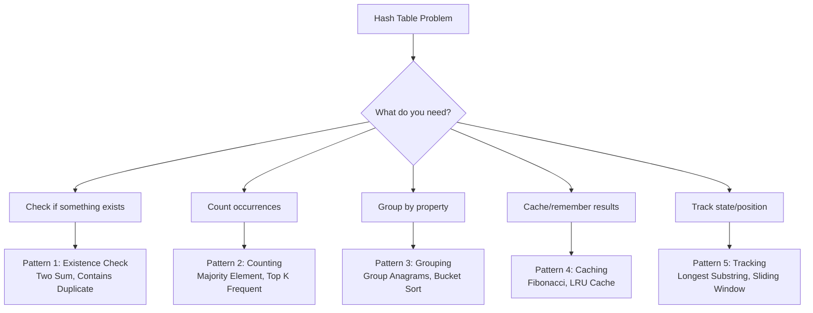

import { LanguageSelector, TimeEstimate, ConfidenceBuilder, DifficultyBadge } from '@site/src/components/interview-guide';
import { CodeTabs } from '@site/src/components/design-patterns/CodeTabs';
import TabItem from '@theme/TabItem';

# Hash Tables: Your Most Powerful Interview Tool

Here's a pattern I noticed after 50+ mock interviews: **candidates who instinctively reach for hash maps solve problems 2-3x faster than those who don't.**

When I see nested loops, my first thought is always: "Can I use a hash map to eliminate the inner loop?" The answer is usually yes.

I once spent 40 minutes on a "find pairs" problem using nested loops before my interviewer said, "What if you could look up in O(1)?" That moment—when I realized a hash set could replace the inner loop—changed how I approach every problem since.

**If you master one data structure for interviews, make it the hash table.**

<LanguageSelector />

<TimeEstimate
  learnTime="25-35 minutes"
  practiceTime="3-4 hours"
  masteryTime="10-12 problems"
  interviewFrequency="80%"
  difficultyRange="Easy to Hard"
  prerequisites="Arrays, Big-O Notation"
/>

---

## Why Hash Tables Matter

Hash tables give you O(1) average-case lookup. That single property is transformative:

<CodeTabs>
<TabItem value="python" label="Python">

```python
# Without hash table: O(n²)
def has_pair_sum_slow(arr: list[int], target: int) -> bool:
    for i in range(len(arr)):
        for j in range(i + 1, len(arr)):
            if arr[i] + arr[j] == target:
                return True
    return False

# With hash table: O(n)
def has_pair_sum_fast(arr: list[int], target: int) -> bool:
    seen: set[int] = set()
    for num in arr:
        if target - num in seen:  # O(1) lookup!
            return True
        seen.add(num)
    return False

# That's a 1000x speedup on an array of 1000 elements
```

</TabItem>
<TabItem value="typescript" label="TypeScript">

```typescript
// Without hash table: O(n²)
function hasPairSumSlow(arr: number[], target: number): boolean {
  for (let i = 0; i < arr.length; i++) {
    for (let j = i + 1; j < arr.length; j++) {
      if (arr[i] + arr[j] === target) return true;
    }
  }
  return false;
}

// With hash table: O(n)
function hasPairSumFast(arr: number[], target: number): boolean {
  const seen = new Set<number>();
  for (const num of arr) {
    if (seen.has(target - num)) return true; // O(1) lookup
    seen.add(num);
  }
  return false;
}
```

</TabItem>
<TabItem value="go" label="Go">

```go
// Without hash table: O(n²)
func hasPairSumSlow(arr []int, target int) bool {
    for i := 0; i < len(arr); i++ {
        for j := i + 1; j < len(arr); j++ {
            if arr[i]+arr[j] == target {
                return true
            }
        }
    }
    return false
}

// With hash table: O(n)
func hasPairSumFast(arr []int, target int) bool {
    seen := make(map[int]bool)
    for _, num := range arr {
        if seen[target-num] { // O(1) lookup
            return true
        }
        seen[num] = true
    }
    return false
}
```

</TabItem>
<TabItem value="java" label="Java">

```java
// Without hash table: O(n²)
public boolean hasPairSumSlow(int[] arr, int target) {
    for (int i = 0; i < arr.length; i++) {
        for (int j = i + 1; j < arr.length; j++) {
            if (arr[i] + arr[j] == target) return true;
        }
    }
    return false;
}

// With hash table: O(n)
public boolean hasPairSumFast(int[] arr, int target) {
    Set<Integer> seen = new HashSet<>();
    for (int num : arr) {
        if (seen.contains(target - num)) return true; // O(1)
        seen.add(num);
    }
    return false;
}
```

</TabItem>
<TabItem value="cpp" label="C++">

```cpp
// Without hash table: O(n²)
bool hasPairSumSlow(vector<int>& arr, int target) {
    for (int i = 0; i < arr.size(); i++) {
        for (int j = i + 1; j < arr.size(); j++) {
            if (arr[i] + arr[j] == target) return true;
        }
    }
    return false;
}

// With hash table: O(n)
bool hasPairSumFast(vector<int>& arr, int target) {
    unordered_set<int> seen;
    for (int num : arr) {
        if (seen.count(target - num)) return true; // O(1)
        seen.insert(num);
    }
    return false;
}
```

</TabItem>
<TabItem value="c" label="C">

```c
// Simple hash set implementation for demonstration
#define TABLE_SIZE 10007

typedef struct {
    int* keys;
    bool* occupied;
    int size;
} HashSet;

void initSet(HashSet* s) {
    s->keys = calloc(TABLE_SIZE, sizeof(int));
    s->occupied = calloc(TABLE_SIZE, sizeof(bool));
    s->size = 0;
}

int hash(int key) {
    return ((key % TABLE_SIZE) + TABLE_SIZE) % TABLE_SIZE;
}

void add(HashSet* s, int key) {
    int idx = hash(key);
    while (s->occupied[idx]) idx = (idx + 1) % TABLE_SIZE;
    s->keys[idx] = key;
    s->occupied[idx] = true;
}

bool contains(HashSet* s, int key) {
    int idx = hash(key);
    int start = idx;
    while (s->occupied[idx]) {
        if (s->keys[idx] == key) return true;
        idx = (idx + 1) % TABLE_SIZE;
        if (idx == start) break;
    }
    return false;
}

// With hash table: O(n)
bool hasPairSumFast(int* arr, int n, int target) {
    HashSet seen;
    initSet(&seen);
    for (int i = 0; i < n; i++) {
        if (contains(&seen, target - arr[i])) return true;
        add(&seen, arr[i]);
    }
    return false;
}
```

</TabItem>
<TabItem value="csharp" label="C#">

```csharp
// Without hash table: O(n²)
public bool HasPairSumSlow(int[] arr, int target) {
    for (int i = 0; i < arr.Length; i++) {
        for (int j = i + 1; j < arr.Length; j++) {
            if (arr[i] + arr[j] == target) return true;
        }
    }
    return false;
}

// With hash table: O(n)
public bool HasPairSumFast(int[] arr, int target) {
    var seen = new HashSet<int>();
    foreach (int num in arr) {
        if (seen.Contains(target - num)) return true; // O(1)
        seen.Add(num);
    }
    return false;
}
```

</TabItem>
</CodeTabs>

<ConfidenceBuilder type="real-talk" title="The Optimization Instinct">

**When you see nested loops, immediately ask: "Can I use a hash map to eliminate the inner loop?"**

This single question will help you optimize more problems than any other technique. It's the first thing I ask myself when I see O(n²) or worse.

</ConfidenceBuilder>

---

## Hash Table Operations

| Operation | Average | Worst | Notes |
|-----------|---------|-------|-------|
| Insert | O(1) | O(n) | Worst case: many collisions |
| Lookup | O(1) | O(n) | Worst case: many collisions |
| Delete | O(1) | O(n) | Worst case: many collisions |
| Iterate | O(n) | O(n) | Always linear |

**For interviews, assume O(1) operations** unless specifically asked about hash function details.

---

## Hash Set vs Hash Map

| Use Hash Set | Use Hash Map |
|--------------|--------------|
| Only need to check existence | Need to store associated values |
| Finding duplicates | Counting occurrences |
| Membership testing | Key-value associations |
| Set operations (union, intersection) | Looking up by key |

<CodeTabs>
<TabItem value="python" label="Python">

```python
# Hash Set - just checking existence
def contains_duplicate(nums: list[int]) -> bool:
    seen: set[int] = set()
    for num in nums:
        if num in seen:
            return True
        seen.add(num)
    return False

# Hash Map - need to store indices
def two_sum(nums: list[int], target: int) -> list[int]:
    seen: dict[int, int] = {}  # value → index
    for i, num in enumerate(nums):
        if target - num in seen:
            return [seen[target - num], i]
        seen[num] = i
    return []
```

</TabItem>
<TabItem value="typescript" label="TypeScript">

```typescript
// Hash Set - just checking existence
function containsDuplicate(nums: number[]): boolean {
  const seen = new Set<number>();
  for (const num of nums) {
    if (seen.has(num)) return true;
    seen.add(num);
  }
  return false;
}

// Hash Map - need to store indices
function twoSum(nums: number[], target: number): number[] {
  const seen = new Map<number, number>(); // value → index
  for (let i = 0; i < nums.length; i++) {
    if (seen.has(target - nums[i])) {
      return [seen.get(target - nums[i])!, i];
    }
    seen.set(nums[i], i);
  }
  return [];
}
```

</TabItem>
<TabItem value="go" label="Go">

```go
// Hash Set - just checking existence
func containsDuplicate(nums []int) bool {
    seen := make(map[int]bool)
    for _, num := range nums {
        if seen[num] {
            return true
        }
        seen[num] = true
    }
    return false
}

// Hash Map - need to store indices
func twoSum(nums []int, target int) []int {
    seen := make(map[int]int) // value → index
    for i, num := range nums {
        if j, ok := seen[target-num]; ok {
            return []int{j, i}
        }
        seen[num] = i
    }
    return []int{}
}
```

</TabItem>
<TabItem value="java" label="Java">

```java
// Hash Set - just checking existence
public boolean containsDuplicate(int[] nums) {
    Set<Integer> seen = new HashSet<>();
    for (int num : nums) {
        if (seen.contains(num)) return true;
        seen.add(num);
    }
    return false;
}

// Hash Map - need to store indices
public int[] twoSum(int[] nums, int target) {
    Map<Integer, Integer> seen = new HashMap<>(); // value → index
    for (int i = 0; i < nums.length; i++) {
        if (seen.containsKey(target - nums[i])) {
            return new int[] {seen.get(target - nums[i]), i};
        }
        seen.put(nums[i], i);
    }
    return new int[] {};
}
```

</TabItem>
<TabItem value="cpp" label="C++">

```cpp
// Hash Set - just checking existence
bool containsDuplicate(vector<int>& nums) {
    unordered_set<int> seen;
    for (int num : nums) {
        if (seen.count(num)) return true;
        seen.insert(num);
    }
    return false;
}

// Hash Map - need to store indices
vector<int> twoSum(vector<int>& nums, int target) {
    unordered_map<int, int> seen; // value → index
    for (int i = 0; i < nums.size(); i++) {
        if (seen.count(target - nums[i])) {
            return {seen[target - nums[i]], i};
        }
        seen[nums[i]] = i;
    }
    return {};
}
```

</TabItem>
<TabItem value="c" label="C">

```c
// Hash Map implementation for Two Sum
// Note: Production code would use a more robust implementation

#define TABLE_SIZE 10007

typedef struct Node {
    int key;
    int value;
    struct Node* next;
} Node;

typedef struct {
    Node* buckets[TABLE_SIZE];
} HashMap;

int hash(int key) {
    return ((key % TABLE_SIZE) + TABLE_SIZE) % TABLE_SIZE;
}

void put(HashMap* map, int key, int value) {
    int idx = hash(key);
    Node* node = malloc(sizeof(Node));
    node->key = key;
    node->value = value;
    node->next = map->buckets[idx];
    map->buckets[idx] = node;
}

int* get(HashMap* map, int key) {
    int idx = hash(key);
    Node* curr = map->buckets[idx];
    while (curr) {
        if (curr->key == key) return &curr->value;
        curr = curr->next;
    }
    return NULL;
}

int* twoSum(int* nums, int n, int target, int* returnSize) {
    *returnSize = 2;
    int* result = malloc(2 * sizeof(int));
    HashMap map = {0};
    
    for (int i = 0; i < n; i++) {
        int* found = get(&map, target - nums[i]);
        if (found) {
            result[0] = *found;
            result[1] = i;
            return result;
        }
        put(&map, nums[i], i);
    }
    return result;
}
```

</TabItem>
<TabItem value="csharp" label="C#">

```csharp
// Hash Set - just checking existence
public bool ContainsDuplicate(int[] nums) {
    var seen = new HashSet<int>();
    foreach (int num in nums) {
        if (seen.Contains(num)) return true;
        seen.Add(num);
    }
    return false;
}

// Hash Map - need to store indices
public int[] TwoSum(int[] nums, int target) {
    var seen = new Dictionary<int, int>(); // value → index
    for (int i = 0; i < nums.Length; i++) {
        if (seen.ContainsKey(target - nums[i])) {
            return new int[] { seen[target - nums[i]], i };
        }
        seen[nums[i]] = i;
    }
    return Array.Empty<int>();
}
```

</TabItem>
</CodeTabs>

---

## The Five Hash Table Patterns

**These five patterns cover 90% of hash table interview problems.**



---

## Pattern 1: Existence Check

**Problem:** Check if a complement/match exists.

<CodeTabs>
<TabItem value="python" label="Python">

```python
def two_sum(nums: list[int], target: int) -> list[int]:
    """
    The classic hash map problem.
    Time: O(n), Space: O(n)
    """
    seen: dict[int, int] = {}  # value → index
    
    for i, num in enumerate(nums):
        complement = target - num
        if complement in seen:
            return [seen[complement], i]
        seen[num] = i
    
    return []
```

</TabItem>
<TabItem value="typescript" label="TypeScript">

```typescript
function twoSum(nums: number[], target: number): number[] {
  const seen = new Map<number, number>(); // value → index

  for (let i = 0; i < nums.length; i++) {
    const complement = target - nums[i];
    if (seen.has(complement)) {
      return [seen.get(complement)!, i];
    }
    seen.set(nums[i], i);
  }

  return [];
}
```

</TabItem>
<TabItem value="go" label="Go">

```go
func twoSum(nums []int, target int) []int {
    seen := make(map[int]int) // value → index
    
    for i, num := range nums {
        complement := target - num
        if j, exists := seen[complement]; exists {
            return []int{j, i}
        }
        seen[num] = i
    }
    
    return []int{}
}
```

</TabItem>
<TabItem value="java" label="Java">

```java
public int[] twoSum(int[] nums, int target) {
    Map<Integer, Integer> seen = new HashMap<>();
    
    for (int i = 0; i < nums.length; i++) {
        int complement = target - nums[i];
        if (seen.containsKey(complement)) {
            return new int[] {seen.get(complement), i};
        }
        seen.put(nums[i], i);
    }
    
    return new int[] {};
}
```

</TabItem>
<TabItem value="cpp" label="C++">

```cpp
vector<int> twoSum(vector<int>& nums, int target) {
    unordered_map<int, int> seen; // value → index
    
    for (int i = 0; i < nums.size(); i++) {
        int complement = target - nums[i];
        if (seen.count(complement)) {
            return {seen[complement], i};
        }
        seen[nums[i]] = i;
    }
    
    return {};
}
```

</TabItem>
<TabItem value="c" label="C">

```c
// See full HashMap implementation above
int* twoSum(int* nums, int n, int target, int* returnSize) {
    *returnSize = 2;
    int* result = malloc(2 * sizeof(int));
    HashMap map = {0};
    
    for (int i = 0; i < n; i++) {
        int complement = target - nums[i];
        int* found = get(&map, complement);
        if (found) {
            result[0] = *found;
            result[1] = i;
            return result;
        }
        put(&map, nums[i], i);
    }
    
    *returnSize = 0;
    return NULL;
}
```

</TabItem>
<TabItem value="csharp" label="C#">

```csharp
public int[] TwoSum(int[] nums, int target) {
    var seen = new Dictionary<int, int>();
    
    for (int i = 0; i < nums.Length; i++) {
        int complement = target - nums[i];
        if (seen.ContainsKey(complement)) {
            return new int[] { seen[complement], i };
        }
        seen[nums[i]] = i;
    }
    
    return Array.Empty<int>();
}
```

</TabItem>
</CodeTabs>

**When to use:** Any time you need to find "another element that satisfies a condition."

---

## Pattern 2: Counting/Frequency

**Problem:** Count occurrences of elements.

<CodeTabs>
<TabItem value="python" label="Python">

```python
from collections import Counter

def majority_element(nums: list[int]) -> int | None:
    """
    Find element appearing more than n/2 times.
    Time: O(n), Space: O(n)
    """
    counts = Counter(nums)
    n = len(nums)
    
    for num, count in counts.items():
        if count > n // 2:
            return num
    
    return None

# Manual counting (when Counter isn't available)
def count_frequency(arr: list[int]) -> dict[int, int]:
    freq: dict[int, int] = {}
    for item in arr:
        freq[item] = freq.get(item, 0) + 1
    return freq
```

</TabItem>
<TabItem value="typescript" label="TypeScript">

```typescript
function majorityElement(nums: number[]): number | null {
  const counts = new Map<number, number>();
  const n = nums.length;

  for (const num of nums) {
    counts.set(num, (counts.get(num) || 0) + 1);
  }

  for (const [num, count] of counts) {
    if (count > Math.floor(n / 2)) {
      return num;
    }
  }

  return null;
}
```

</TabItem>
<TabItem value="go" label="Go">

```go
func majorityElement(nums []int) int {
    counts := make(map[int]int)
    n := len(nums)
    
    for _, num := range nums {
        counts[num]++
        if counts[num] > n/2 {
            return num
        }
    }
    
    return -1
}
```

</TabItem>
<TabItem value="java" label="Java">

```java
public int majorityElement(int[] nums) {
    Map<Integer, Integer> counts = new HashMap<>();
    int n = nums.length;
    
    for (int num : nums) {
        counts.put(num, counts.getOrDefault(num, 0) + 1);
        if (counts.get(num) > n / 2) {
            return num;
        }
    }
    
    return -1;
}
```

</TabItem>
<TabItem value="cpp" label="C++">

```cpp
int majorityElement(vector<int>& nums) {
    unordered_map<int, int> counts;
    int n = nums.size();
    
    for (int num : nums) {
        if (++counts[num] > n / 2) {
            return num;
        }
    }
    
    return -1;
}
```

</TabItem>
<TabItem value="c" label="C">

```c
int majorityElement(int* nums, int n) {
    // Using simple array for small range values
    // For large ranges, use HashMap implementation
    int* counts = calloc(100001, sizeof(int));
    int offset = 50000; // Handle negative numbers
    
    for (int i = 0; i < n; i++) {
        int idx = nums[i] + offset;
        counts[idx]++;
        if (counts[idx] > n / 2) {
            free(counts);
            return nums[i];
        }
    }
    
    free(counts);
    return -1;
}
```

</TabItem>
<TabItem value="csharp" label="C#">

```csharp
public int MajorityElement(int[] nums) {
    var counts = new Dictionary<int, int>();
    int n = nums.Length;
    
    foreach (int num in nums) {
        if (!counts.ContainsKey(num)) counts[num] = 0;
        counts[num]++;
        if (counts[num] > n / 2) {
            return num;
        }
    }
    
    return -1;
}
```

</TabItem>
</CodeTabs>

**When to use:** "Most frequent," "count occurrences," "appears more than k times."

---

## Pattern 3: Grouping

**Problem:** Group elements by some property.

<CodeTabs>
<TabItem value="python" label="Python">

```python
from collections import defaultdict

def group_anagrams(strs: list[str]) -> list[list[str]]:
    """
    Group strings that are anagrams of each other.
    Time: O(n * k log k) where k is max string length
    Space: O(n * k)
    """
    groups: dict[tuple[str, ...], list[str]] = defaultdict(list)
    
    for s in strs:
        # Sort string to create canonical key
        key = tuple(sorted(s))
        groups[key].append(s)
    
    return list(groups.values())

# Input: ["eat", "tea", "tan", "ate", "nat", "bat"]
# Output: [["eat", "tea", "ate"], ["tan", "nat"], ["bat"]]
```

</TabItem>
<TabItem value="typescript" label="TypeScript">

```typescript
function groupAnagrams(strs: string[]): string[][] {
  const groups = new Map<string, string[]>();

  for (const s of strs) {
    const key = s.split('').sort().join('');
    if (!groups.has(key)) {
      groups.set(key, []);
    }
    groups.get(key)!.push(s);
  }

  return Array.from(groups.values());
}
```

</TabItem>
<TabItem value="go" label="Go">

```go
import "sort"

func groupAnagrams(strs []string) [][]string {
    groups := make(map[string][]string)
    
    for _, s := range strs {
        // Sort string to create key
        runes := []rune(s)
        sort.Slice(runes, func(i, j int) bool {
            return runes[i] < runes[j]
        })
        key := string(runes)
        groups[key] = append(groups[key], s)
    }
    
    result := make([][]string, 0, len(groups))
    for _, group := range groups {
        result = append(result, group)
    }
    return result
}
```

</TabItem>
<TabItem value="java" label="Java">

```java
public List<List<String>> groupAnagrams(String[] strs) {
    Map<String, List<String>> groups = new HashMap<>();
    
    for (String s : strs) {
        char[] chars = s.toCharArray();
        Arrays.sort(chars);
        String key = new String(chars);
        
        groups.computeIfAbsent(key, k -> new ArrayList<>()).add(s);
    }
    
    return new ArrayList<>(groups.values());
}
```

</TabItem>
<TabItem value="cpp" label="C++">

```cpp
vector<vector<string>> groupAnagrams(vector<string>& strs) {
    unordered_map<string, vector<string>> groups;
    
    for (const string& s : strs) {
        string key = s;
        sort(key.begin(), key.end());
        groups[key].push_back(s);
    }
    
    vector<vector<string>> result;
    for (auto& [key, group] : groups) {
        result.push_back(move(group));
    }
    return result;
}
```

</TabItem>
<TabItem value="c" label="C">

```c
// Simplified version - production code needs proper memory management
char*** groupAnagrams(char** strs, int n, int* returnSize, int** returnColumnSizes) {
    // Implementation would use HashMap with string keys
    // Omitted for brevity - see C++ version for cleaner implementation
    *returnSize = 0;
    return NULL;
}
```

</TabItem>
<TabItem value="csharp" label="C#">

```csharp
public IList<IList<string>> GroupAnagrams(string[] strs) {
    var groups = new Dictionary<string, IList<string>>();
    
    foreach (string s in strs) {
        char[] chars = s.ToCharArray();
        Array.Sort(chars);
        string key = new string(chars);
        
        if (!groups.ContainsKey(key)) {
            groups[key] = new List<string>();
        }
        groups[key].Add(s);
    }
    
    return groups.Values.ToList();
}
```

</TabItem>
</CodeTabs>

**When to use:** "Group by property," "find all matching," "categorize."

---

## Pattern 4: Tracking State (Sliding Window)

**Problem:** Track state as you process data.

<CodeTabs>
<TabItem value="python" label="Python">

```python
def length_of_longest_substring(s: str) -> int:
    """
    Find longest substring without repeating characters.
    Time: O(n), Space: O(min(n, alphabet_size))
    """
    char_index: dict[str, int] = {}  # Track last index of each char
    max_length = 0
    start = 0
    
    for end, char in enumerate(s):
        # If char seen and within current window, shrink window
        if char in char_index and char_index[char] >= start:
            start = char_index[char] + 1
        
        char_index[char] = end
        max_length = max(max_length, end - start + 1)
    
    return max_length

# "abcabcbb" → 3 ("abc")
# "bbbbb" → 1 ("b")
# "pwwkew" → 3 ("wke")
```

</TabItem>
<TabItem value="typescript" label="TypeScript">

```typescript
function lengthOfLongestSubstring(s: string): number {
  const charIndex = new Map<string, number>();
  let maxLength = 0;
  let start = 0;

  for (let end = 0; end < s.length; end++) {
    const char = s[end];
    if (charIndex.has(char) && charIndex.get(char)! >= start) {
      start = charIndex.get(char)! + 1;
    }
    charIndex.set(char, end);
    maxLength = Math.max(maxLength, end - start + 1);
  }

  return maxLength;
}
```

</TabItem>
<TabItem value="go" label="Go">

```go
func lengthOfLongestSubstring(s string) int {
    charIndex := make(map[rune]int)
    maxLength := 0
    start := 0
    
    for end, char := range s {
        if idx, exists := charIndex[char]; exists && idx >= start {
            start = idx + 1
        }
        charIndex[char] = end
        if length := end - start + 1; length > maxLength {
            maxLength = length
        }
    }
    
    return maxLength
}
```

</TabItem>
<TabItem value="java" label="Java">

```java
public int lengthOfLongestSubstring(String s) {
    Map<Character, Integer> charIndex = new HashMap<>();
    int maxLength = 0;
    int start = 0;
    
    for (int end = 0; end < s.length(); end++) {
        char c = s.charAt(end);
        if (charIndex.containsKey(c) && charIndex.get(c) >= start) {
            start = charIndex.get(c) + 1;
        }
        charIndex.put(c, end);
        maxLength = Math.max(maxLength, end - start + 1);
    }
    
    return maxLength;
}
```

</TabItem>
<TabItem value="cpp" label="C++">

```cpp
int lengthOfLongestSubstring(string s) {
    unordered_map<char, int> charIndex;
    int maxLength = 0;
    int start = 0;
    
    for (int end = 0; end < s.size(); end++) {
        char c = s[end];
        if (charIndex.count(c) && charIndex[c] >= start) {
            start = charIndex[c] + 1;
        }
        charIndex[c] = end;
        maxLength = max(maxLength, end - start + 1);
    }
    
    return maxLength;
}
```

</TabItem>
<TabItem value="c" label="C">

```c
int lengthOfLongestSubstring(char* s) {
    int charIndex[128]; // ASCII characters
    memset(charIndex, -1, sizeof(charIndex));
    
    int maxLength = 0;
    int start = 0;
    
    for (int end = 0; s[end]; end++) {
        char c = s[end];
        if (charIndex[(int)c] >= start) {
            start = charIndex[(int)c] + 1;
        }
        charIndex[(int)c] = end;
        int length = end - start + 1;
        if (length > maxLength) maxLength = length;
    }
    
    return maxLength;
}
```

</TabItem>
<TabItem value="csharp" label="C#">

```csharp
public int LengthOfLongestSubstring(string s) {
    var charIndex = new Dictionary<char, int>();
    int maxLength = 0;
    int start = 0;
    
    for (int end = 0; end < s.Length; end++) {
        char c = s[end];
        if (charIndex.ContainsKey(c) && charIndex[c] >= start) {
            start = charIndex[c] + 1;
        }
        charIndex[c] = end;
        maxLength = Math.Max(maxLength, end - start + 1);
    }
    
    return maxLength;
}
```

</TabItem>
</CodeTabs>

**When to use:** Sliding window problems, tracking "last seen," maintaining state.

---

## 💬 How to Communicate This in Interviews

**When you identify a hash table optimization, say:**

> "I notice this has nested loops which is O(n²). Let me see if I can use a hash map to eliminate the inner loop and get O(n)..."

**When explaining the trade-off:**
> "We're trading O(n) space for O(n) time complexity, down from O(n²). That's usually a worthwhile trade-off."

**When choosing between set and map:**
> "I only need to check existence, so I'll use a hash set. If I needed to store indices, I'd use a hash map."

<ConfidenceBuilder type="youve-got-this">

**Two Sum is the gateway problem.** If you deeply understand Two Sum—why we use a hash map, how we store complements, when to check vs store—you understand 60% of hash table problems.

</ConfidenceBuilder>

---

## Common Mistakes

### 1. Modifying While Iterating

```python
# ❌ WRONG - RuntimeError
d = {'a': 1, 'b': 2, 'c': 3}
for key in d:
    if d[key] < 2:
        del d[key]  # Error!

# ✅ RIGHT - iterate over copy
for key in list(d.keys()):
    if d[key] < 2:
        del d[key]
```

### 2. Using Mutable Keys

```python
# ❌ WRONG - lists can't be keys
d = {}
d[[1, 2, 3]] = "value"  # TypeError!

# ✅ RIGHT - use tuples (immutable)
d[(1, 2, 3)] = "value"
```

### 3. Forgetting Default Values

```python
# ❌ VERBOSE - checking key existence
if key in d:
    d[key] += 1
else:
    d[key] = 1

# ✅ BETTER - use get() or defaultdict
d[key] = d.get(key, 0) + 1

# ✅ BEST - use Counter or defaultdict
from collections import defaultdict, Counter
d = defaultdict(int)
d[key] += 1
```

---

## 🏋️ Practice Problems

### Warm-Up (Build Confidence)

| Problem | Difficulty | Time | Pattern |
|---------|------------|------|---------|
| [Two Sum](https://leetcode.com/problems/two-sum/) | <DifficultyBadge level="easy" /> | 15 min | Existence check |
| [Contains Duplicate](https://leetcode.com/problems/contains-duplicate/) | <DifficultyBadge level="easy" /> | 10 min | Hash set |
| [Valid Anagram](https://leetcode.com/problems/valid-anagram/) | <DifficultyBadge level="easy" /> | 15 min | Counting |

### Core Practice (Must Do)

| Problem | Difficulty | Companies | Pattern |
|---------|------------|-----------|---------|
| [Group Anagrams](https://leetcode.com/problems/group-anagrams/) | <DifficultyBadge level="medium" /> | Meta, Google, Amazon | Grouping |
| [Top K Frequent Elements](https://leetcode.com/problems/top-k-frequent-elements/) | <DifficultyBadge level="medium" /> | Amazon, Meta, Google | Counting + heap |
| [Longest Consecutive Sequence](https://leetcode.com/problems/longest-consecutive-sequence/) | <DifficultyBadge level="medium" /> | Meta, Google, Amazon | Hash set |
| [Subarray Sum Equals K](https://leetcode.com/problems/subarray-sum-equals-k/) | <DifficultyBadge level="medium" /> | Google, Meta, Amazon | Prefix sum + hash |
| [LRU Cache](https://leetcode.com/problems/lru-cache/) | <DifficultyBadge level="medium" /> | Amazon, Meta, Google, Microsoft | Hash map + linked list |

### Challenge (For Mastery)

| Problem | Difficulty | Companies | Why It's Hard |
|---------|------------|-----------|---------------|
| [Minimum Window Substring](https://leetcode.com/problems/minimum-window-substring/) | <DifficultyBadge level="hard" /> | Meta, Amazon, Google | Hash map + sliding window |
| [Word Ladder](https://leetcode.com/problems/word-ladder/) | <DifficultyBadge level="hard" /> | Amazon, Meta, Google | BFS + hash set |
| [Alien Dictionary](https://leetcode.com/problems/alien-dictionary/) | <DifficultyBadge level="hard" /> | Meta, Amazon, Airbnb | Hash map + topological sort |

---

## Key Takeaways

1. **Hash tables give O(1) average lookup** — This is their superpower.

2. **Five patterns cover 90% of problems:** Existence, Counting, Grouping, Caching, Tracking.

3. **Hash Set vs Hash Map:** Set for existence only, Map when you need associated values.

4. **When you see O(n²), think hash map** — It's almost always the optimization.

5. **`Counter` and `defaultdict` are your friends** — Use them for cleaner code.

<ConfidenceBuilder type="remember">

**The hash table instinct will serve you well.**

"Can I eliminate this inner loop with a hash map?" is the single most valuable question you can ask yourself during coding interviews.

</ConfidenceBuilder>

---

## What's Next?

Trees combine hash tables with hierarchical thinking—and they're everywhere in interviews:

**Next up:** [Trees](/docs/interview-guide/coding/data-structures/trees) — Hierarchical data and recursive thinking
