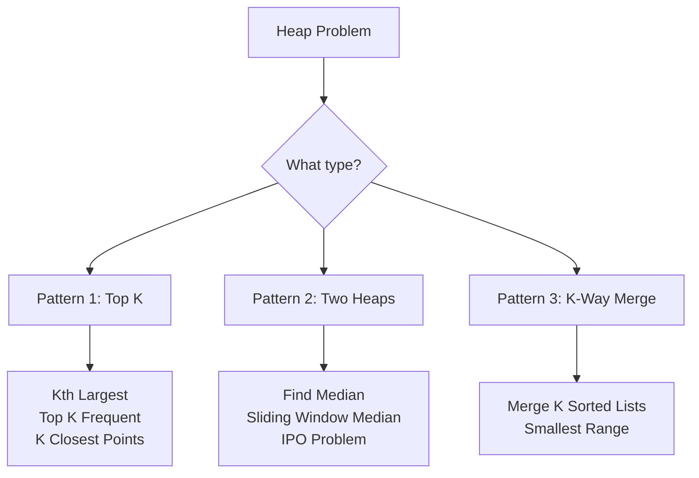

import { LanguageSelector, TimeEstimate, ConfidenceBuilder, DifficultyBadge } from '@site/src/components/interview-guide';
import { CodeTabs } from '@site/src/components/design-patterns/CodeTabs';
import TabItem from '@theme/TabItem';

# Heaps: When You Need Min or Max Repeatedly

There's a category of problems where you need to repeatedly find the smallest or largest element. Arrays give you O(n) per query. Sorting gives you O(n log n) upfront but doesn't handle dynamic data.

But heaps? **O(log n) to add or remove, O(1) to peek at the min or max.**

I remember struggling with "Find Median from Data Stream" for an hour before learning about the two-heap pattern. What seemed impossible became elegant: one heap for the smaller half, one for the larger half, median in O(1).

**Whenever you see "kth largest," "top K," or "running median"—think heap.**

<LanguageSelector />

<TimeEstimate
  learnTime="30-40 minutes"
  practiceTime="3-4 hours"
  masteryTime="10-12 problems"
  interviewFrequency="55%"
  difficultyRange="Medium to Hard"
  prerequisites="Arrays, Big-O Notation"
/>

---

## Heap Fundamentals

A heap is a complete binary tree where each parent is smaller (min-heap) or larger (max-heap) than its children.

```
Min-Heap:           Max-Heap:
     1                  9
    / \                / \
   3   2              7   8
  / \                / \
 7   4              3   5

Top is always       Top is always
the minimum         the maximum
```

### Complexity

| Operation | Time | Notes |
|-----------|------|-------|
| Push | O(log n) | Bubble up |
| Pop | O(log n) | Bubble down |
| Peek | O(1) | Just return root |
| Heapify | O(n) | Build heap from array |

---

## Heap Operations in All Languages

<CodeTabs>
<TabItem value="python" label="Python">

```python
import heapq

# Python only has MIN-HEAP
# Create and use
heap: list[int] = []
heapq.heappush(heap, 3)
heapq.heappush(heap, 1)
heapq.heappush(heap, 4)
# heap is now [1, 3, 4]

# Peek minimum - O(1)
min_val = heap[0]  # 1

# Pop minimum - O(log n)
min_val = heapq.heappop(heap)  # 1

# Heapify a list - O(n)
nums = [3, 1, 4, 1, 5]
heapq.heapify(nums)

# Push and pop in one operation
result = heapq.heappushpop(heap, 2)

# --- MAX-HEAP TRICK: Negate values ---
max_heap: list[int] = []
heapq.heappush(max_heap, -5)  # Store -5
heapq.heappush(max_heap, -3)  # Store -3
heapq.heappush(max_heap, -7)  # Store -7

max_val = -heapq.heappop(max_heap)  # Returns 7
```

</TabItem>
<TabItem value="typescript" label="TypeScript">

```typescript
// TypeScript doesn't have built-in heap
// Use a simple implementation or library like 'heap-js'

class MinHeap {
  private heap: number[] = [];

  push(val: number): void {
    this.heap.push(val);
    this.bubbleUp(this.heap.length - 1);
  }

  pop(): number | undefined {
    if (this.heap.length === 0) return undefined;
    const min = this.heap[0];
    const last = this.heap.pop()!;
    if (this.heap.length > 0) {
      this.heap[0] = last;
      this.bubbleDown(0);
    }
    return min;
  }

  peek(): number | undefined {
    return this.heap[0];
  }

  size(): number {
    return this.heap.length;
  }

  private bubbleUp(idx: number): void {
    while (idx > 0) {
      const parent = Math.floor((idx - 1) / 2);
      if (this.heap[parent] <= this.heap[idx]) break;
      [this.heap[parent], this.heap[idx]] = [this.heap[idx], this.heap[parent]];
      idx = parent;
    }
  }

  private bubbleDown(idx: number): void {
    while (true) {
      const left = 2 * idx + 1;
      const right = 2 * idx + 2;
      let smallest = idx;
      
      if (left < this.heap.length && this.heap[left] < this.heap[smallest]) {
        smallest = left;
      }
      if (right < this.heap.length && this.heap[right] < this.heap[smallest]) {
        smallest = right;
      }
      if (smallest === idx) break;
      
      [this.heap[idx], this.heap[smallest]] = [this.heap[smallest], this.heap[idx]];
      idx = smallest;
    }
  }
}
```

</TabItem>
<TabItem value="go" label="Go">

```go
import "container/heap"

// Go requires implementing heap.Interface
type MinHeap []int

func (h MinHeap) Len() int           { return len(h) }
func (h MinHeap) Less(i, j int) bool { return h[i] < h[j] }
func (h MinHeap) Swap(i, j int)      { h[i], h[j] = h[j], h[i] }

func (h *MinHeap) Push(x interface{}) {
    *h = append(*h, x.(int))
}

func (h *MinHeap) Pop() interface{} {
    old := *h
    n := len(old)
    x := old[n-1]
    *h = old[0 : n-1]
    return x
}

// Usage
func example() {
    h := &MinHeap{3, 1, 4}
    heap.Init(h)
    
    heap.Push(h, 2)           // Push
    min := heap.Pop(h).(int)  // Pop
    peek := (*h)[0]           // Peek
}

// For max-heap, reverse Less:
// func (h MaxHeap) Less(i, j int) bool { return h[i] > h[j] }
```

</TabItem>
<TabItem value="java" label="Java">

```java
import java.util.PriorityQueue;
import java.util.Collections;

// Min-heap (default)
PriorityQueue<Integer> minHeap = new PriorityQueue<>();
minHeap.offer(3);
minHeap.offer(1);
minHeap.offer(4);

int min = minHeap.peek();  // 1, O(1)
int popped = minHeap.poll();  // 1, O(log n)

// Max-heap
PriorityQueue<Integer> maxHeap = new PriorityQueue<>(Collections.reverseOrder());
// Or: new PriorityQueue<>((a, b) -> b - a);
maxHeap.offer(3);
maxHeap.offer(1);
maxHeap.offer(4);

int max = maxHeap.peek();  // 4

// Heap with custom objects
PriorityQueue<int[]> customHeap = new PriorityQueue<>((a, b) -> a[0] - b[0]);
customHeap.offer(new int[]{5, 0});  // Sort by first element
```

</TabItem>
<TabItem value="cpp" label="C++">

```cpp
#include <queue>
#include <vector>

// Max-heap (default in C++)
std::priority_queue<int> maxHeap;
maxHeap.push(3);
maxHeap.push(1);
maxHeap.push(4);

int max = maxHeap.top();  // 4, O(1)
maxHeap.pop();            // Remove max, O(log n)

// Min-heap
std::priority_queue<int, std::vector<int>, std::greater<int>> minHeap;
minHeap.push(3);
minHeap.push(1);
minHeap.push(4);

int min = minHeap.top();  // 1

// Custom comparator (for pairs, sort by first element ascending)
auto cmp = [](const std::pair<int,int>& a, const std::pair<int,int>& b) {
    return a.first > b.first;  // Min-heap by first
};
std::priority_queue<std::pair<int,int>, std::vector<std::pair<int,int>>, 
                    decltype(cmp)> customHeap(cmp);
```

</TabItem>
<TabItem value="c" label="C">

```c
// C doesn't have built-in heap
// Simple min-heap implementation

#define MAX_HEAP_SIZE 10000

typedef struct {
    int data[MAX_HEAP_SIZE];
    int size;
} MinHeap;

void initHeap(MinHeap* h) { h->size = 0; }

void swap(int* a, int* b) { int t = *a; *a = *b; *b = t; }

void push(MinHeap* h, int val) {
    int i = h->size++;
    h->data[i] = val;
    
    // Bubble up
    while (i > 0) {
        int parent = (i - 1) / 2;
        if (h->data[parent] <= h->data[i]) break;
        swap(&h->data[parent], &h->data[i]);
        i = parent;
    }
}

int pop(MinHeap* h) {
    int result = h->data[0];
    h->data[0] = h->data[--h->size];
    
    // Bubble down
    int i = 0;
    while (2*i + 1 < h->size) {
        int smallest = i;
        int left = 2*i + 1, right = 2*i + 2;
        
        if (h->data[left] < h->data[smallest]) smallest = left;
        if (right < h->size && h->data[right] < h->data[smallest]) smallest = right;
        
        if (smallest == i) break;
        swap(&h->data[i], &h->data[smallest]);
        i = smallest;
    }
    
    return result;
}

int peek(MinHeap* h) { return h->data[0]; }
```

</TabItem>
<TabItem value="csharp" label="C#">

```csharp
// C# has PriorityQueue in .NET 6+
using System.Collections.Generic;

// Min-heap (default)
var minHeap = new PriorityQueue<int, int>();
minHeap.Enqueue(3, 3);  // (element, priority)
minHeap.Enqueue(1, 1);
minHeap.Enqueue(4, 4);

int min = minHeap.Peek();     // 1
int popped = minHeap.Dequeue();  // 1

// Max-heap: use negative priority
var maxHeap = new PriorityQueue<int, int>();
maxHeap.Enqueue(3, -3);  // Negate priority
maxHeap.Enqueue(1, -1);
maxHeap.Enqueue(4, -4);

// Custom comparator
var customHeap = new PriorityQueue<string, int>(
    Comparer<int>.Create((a, b) => b - a)  // Max-heap
);
```

</TabItem>
</CodeTabs>

---

## The Three Heap Patterns



---

## Pattern 1: Top K Elements

**Use when:** Find the K largest, K smallest, or Kth element.

**Key insight:** Use a heap of size K.
- For K largest: use **min-heap** (keeps K largest, evicts smallest)
- For K smallest: use **max-heap** (keeps K smallest, evicts largest)

<CodeTabs>
<TabItem value="python" label="Python">

```python
import heapq

def find_kth_largest(nums: list[int], k: int) -> int:
    """
    Find the kth largest element in an array.
    Time: O(n log k), Space: O(k)
    
    Use min-heap of size k: it naturally evicts the smallest,
    leaving us with the k largest elements.
    """
    # Min-heap of size k
    heap = nums[:k]
    heapq.heapify(heap)
    
    for num in nums[k:]:
        if num > heap[0]:  # Only add if larger than smallest in heap
            heapq.heapreplace(heap, num)  # Pop and push in one operation
    
    return heap[0]  # Kth largest is the smallest in our k-largest heap

# [3, 2, 1, 5, 6, 4], k=2 → 5 (2nd largest)
```

</TabItem>
<TabItem value="typescript" label="TypeScript">

```typescript
function findKthLargest(nums: number[], k: number): number {
  // Using our MinHeap class from above
  const heap = new MinHeap();
  
  for (const num of nums) {
    heap.push(num);
    if (heap.size() > k) {
      heap.pop();  // Remove smallest
    }
  }
  
  return heap.peek()!;
}
```

</TabItem>
<TabItem value="go" label="Go">

```go
func findKthLargest(nums []int, k int) int {
    h := &MinHeap{}
    heap.Init(h)
    
    for _, num := range nums {
        heap.Push(h, num)
        if h.Len() > k {
            heap.Pop(h)
        }
    }
    
    return (*h)[0]
}
```

</TabItem>
<TabItem value="java" label="Java">

```java
public int findKthLargest(int[] nums, int k) {
    PriorityQueue<Integer> minHeap = new PriorityQueue<>();
    
    for (int num : nums) {
        minHeap.offer(num);
        if (minHeap.size() > k) {
            minHeap.poll();  // Remove smallest
        }
    }
    
    return minHeap.peek();
}
```

</TabItem>
<TabItem value="cpp" label="C++">

```cpp
int findKthLargest(vector<int>& nums, int k) {
    priority_queue<int, vector<int>, greater<int>> minHeap;
    
    for (int num : nums) {
        minHeap.push(num);
        if (minHeap.size() > k) {
            minHeap.pop();
        }
    }
    
    return minHeap.top();
}
```

</TabItem>
<TabItem value="c" label="C">

```c
int findKthLargest(int* nums, int n, int k) {
    MinHeap heap;
    initHeap(&heap);
    
    for (int i = 0; i < n; i++) {
        push(&heap, nums[i]);
        if (heap.size > k) {
            pop(&heap);
        }
    }
    
    return peek(&heap);
}
```

</TabItem>
<TabItem value="csharp" label="C#">

```csharp
public int FindKthLargest(int[] nums, int k) {
    var minHeap = new PriorityQueue<int, int>();
    
    foreach (int num in nums) {
        minHeap.Enqueue(num, num);
        if (minHeap.Count > k) {
            minHeap.Dequeue();
        }
    }
    
    return minHeap.Peek();
}
```

</TabItem>
</CodeTabs>

<ConfidenceBuilder type="remember" title="The Counter-Intuitive Insight">

**For K largest, use MIN-heap. For K smallest, use MAX-heap.**

Why? A min-heap evicts the smallest element. If you keep evicting the smallest and only keep K elements, you're left with the K largest.

</ConfidenceBuilder>

---

## Pattern 2: Two Heaps (Running Median)

**Use when:** Track median as elements arrive dynamically.

**Key insight:** Split elements into two halves:
- **Max-heap** for smaller half (gives us the largest of smaller half)
- **Min-heap** for larger half (gives us the smallest of larger half)

<CodeTabs>
<TabItem value="python" label="Python">

```python
import heapq

class MedianFinder:
    """
    Find median in a stream of numbers.
    Time: O(log n) per add, O(1) for median
    """
    def __init__(self):
        self.small: list[int] = []  # Max-heap (negated) for smaller half
        self.large: list[int] = []  # Min-heap for larger half
    
    def addNum(self, num: int) -> None:
        # Add to max-heap (smaller half) first
        heapq.heappush(self.small, -num)
        
        # Balance: ensure largest of small <= smallest of large
        if self.small and self.large and -self.small[0] > self.large[0]:
            val = -heapq.heappop(self.small)
            heapq.heappush(self.large, val)
        
        # Balance sizes: small can have at most 1 more than large
        if len(self.small) > len(self.large) + 1:
            val = -heapq.heappop(self.small)
            heapq.heappush(self.large, val)
        
        if len(self.large) > len(self.small):
            val = heapq.heappop(self.large)
            heapq.heappush(self.small, -val)
    
    def findMedian(self) -> float:
        if len(self.small) > len(self.large):
            return -self.small[0]
        return (-self.small[0] + self.large[0]) / 2

# Usage:
# mf = MedianFinder()
# mf.addNum(1) → median = 1
# mf.addNum(2) → median = 1.5
# mf.addNum(3) → median = 2
```

</TabItem>
<TabItem value="java" label="Java">

```java
class MedianFinder {
    private PriorityQueue<Integer> small; // Max-heap
    private PriorityQueue<Integer> large; // Min-heap
    
    public MedianFinder() {
        small = new PriorityQueue<>(Collections.reverseOrder());
        large = new PriorityQueue<>();
    }
    
    public void addNum(int num) {
        small.offer(num);
        
        // Balance: largest of small <= smallest of large
        if (!small.isEmpty() && !large.isEmpty() && small.peek() > large.peek()) {
            large.offer(small.poll());
        }
        
        // Balance sizes
        if (small.size() > large.size() + 1) {
            large.offer(small.poll());
        }
        if (large.size() > small.size()) {
            small.offer(large.poll());
        }
    }
    
    public double findMedian() {
        if (small.size() > large.size()) {
            return small.peek();
        }
        return (small.peek() + large.peek()) / 2.0;
    }
}
```

</TabItem>
<TabItem value="cpp" label="C++">

```cpp
class MedianFinder {
private:
    priority_queue<int> small;  // Max-heap
    priority_queue<int, vector<int>, greater<int>> large;  // Min-heap
    
public:
    void addNum(int num) {
        small.push(num);
        
        if (!small.empty() && !large.empty() && small.top() > large.top()) {
            large.push(small.top());
            small.pop();
        }
        
        if (small.size() > large.size() + 1) {
            large.push(small.top());
            small.pop();
        }
        if (large.size() > small.size()) {
            small.push(large.top());
            large.pop();
        }
    }
    
    double findMedian() {
        if (small.size() > large.size()) {
            return small.top();
        }
        return (small.top() + large.top()) / 2.0;
    }
};
```

</TabItem>
<TabItem value="go" label="Go">

```go
type MedianFinder struct {
    small *MaxHeap  // Max-heap for smaller half
    large *MinHeap  // Min-heap for larger half
}

func Constructor() MedianFinder {
    return MedianFinder{
        small: &MaxHeap{},
        large: &MinHeap{},
    }
}

func (mf *MedianFinder) AddNum(num int) {
    heap.Push(mf.small, num)
    
    if mf.small.Len() > 0 && mf.large.Len() > 0 && 
       (*mf.small)[0] > (*mf.large)[0] {
        heap.Push(mf.large, heap.Pop(mf.small).(int))
    }
    
    if mf.small.Len() > mf.large.Len()+1 {
        heap.Push(mf.large, heap.Pop(mf.small).(int))
    }
    if mf.large.Len() > mf.small.Len() {
        heap.Push(mf.small, heap.Pop(mf.large).(int))
    }
}

func (mf *MedianFinder) FindMedian() float64 {
    if mf.small.Len() > mf.large.Len() {
        return float64((*mf.small)[0])
    }
    return float64((*mf.small)[0]+(*mf.large)[0]) / 2.0
}
```

</TabItem>
<TabItem value="csharp" label="C#">

```csharp
public class MedianFinder {
    private PriorityQueue<int, int> small;  // Max-heap (negate priority)
    private PriorityQueue<int, int> large;  // Min-heap
    
    public MedianFinder() {
        small = new PriorityQueue<int, int>(Comparer<int>.Create((a, b) => b - a));
        large = new PriorityQueue<int, int>();
    }
    
    public void AddNum(int num) {
        small.Enqueue(num, -num);
        
        if (small.Count > 0 && large.Count > 0 && small.Peek() > large.Peek()) {
            large.Enqueue(small.Dequeue(), large.Peek());
        }
        
        while (small.Count > large.Count + 1) {
            int val = small.Dequeue();
            large.Enqueue(val, val);
        }
        while (large.Count > small.Count) {
            int val = large.Dequeue();
            small.Enqueue(val, -val);
        }
    }
    
    public double FindMedian() {
        if (small.Count > large.Count) {
            return small.Peek();
        }
        return (small.Peek() + large.Peek()) / 2.0;
    }
}
```

</TabItem>
</CodeTabs>

---

## 🎯 Pattern Triggers

| If the problem says... | Pattern | Heap Type |
|------------------------|---------|-----------|
| "Kth largest/smallest" | Top K | Min/Max heap of size K |
| "Top K elements" | Top K | Heap of size K |
| "Running median" | Two Heaps | Max-heap + min-heap |
| "Merge K sorted" | K-way Merge | Min-heap of K elements |
| "Repeatedly get min/max" | Basic Heap | Single heap |
| "Schedule by priority" | Priority Queue | Custom comparator |

---

## 💬 How to Communicate This in Interviews

**When you identify a heap problem, say:**

> "I need to repeatedly find the [kth largest / minimum / maximum], which suggests using a heap. Since I want the K largest elements, I'll use a min-heap of size K..."

**When explaining Top K:**
> "By keeping a min-heap of size K, I ensure that the smallest element in the heap is the Kth largest overall. Any element smaller than this gets evicted."

**When explaining Two Heaps:**
> "I'll maintain two heaps: a max-heap for elements smaller than the median, and a min-heap for elements larger. The median is either the top of the max-heap or the average of both tops."

---

## 🏋️ Practice Problems

### Warm-Up (Build Confidence)

| Problem | Difficulty | Time | Pattern |
|---------|------------|------|---------|
| [Kth Largest Element in Stream](https://leetcode.com/problems/kth-largest-element-in-a-stream/) | <DifficultyBadge level="easy" /> | 20 min | Top K |
| [Last Stone Weight](https://leetcode.com/problems/last-stone-weight/) | <DifficultyBadge level="easy" /> | 15 min | Max heap |

### Core Practice (Must Do)

| Problem | Difficulty | Companies | Pattern |
|---------|------------|-----------|---------|
| [Kth Largest Element](https://leetcode.com/problems/kth-largest-element-in-an-array/) | <DifficultyBadge level="medium" /> | Meta, Amazon, Google | Top K |
| [Top K Frequent Elements](https://leetcode.com/problems/top-k-frequent-elements/) | <DifficultyBadge level="medium" /> | Amazon, Meta, Google | Top K + counting |
| [K Closest Points to Origin](https://leetcode.com/problems/k-closest-points-to-origin/) | <DifficultyBadge level="medium" /> | Meta, Amazon, Google | Top K |
| [Find Median from Stream](https://leetcode.com/problems/find-median-from-data-stream/) | <DifficultyBadge level="hard" /> | Amazon, Meta, Google | Two heaps |
| [Task Scheduler](https://leetcode.com/problems/task-scheduler/) | <DifficultyBadge level="medium" /> | Meta, Amazon, Microsoft | Max heap |

### Challenge (For Mastery)

| Problem | Difficulty | Companies | Why It's Hard |
|---------|------------|-----------|---------------|
| [Merge K Sorted Lists](https://leetcode.com/problems/merge-k-sorted-lists/) | <DifficultyBadge level="hard" /> | Amazon, Meta, Google | K-way merge |
| [Sliding Window Median](https://leetcode.com/problems/sliding-window-median/) | <DifficultyBadge level="hard" /> | Google, Amazon | Two heaps + removal |
| [IPO](https://leetcode.com/problems/ipo/) | <DifficultyBadge level="hard" /> | Amazon | Two heaps + greedy |

---

## Key Takeaways

1. **Python heapq is min-heap only.** Negate values for max-heap behavior.

2. **Top K → heap of size K.** Use opposite heap type (min for largest, max for smallest).

3. **Running median → two heaps.** Max-heap for small half, min-heap for large half.

4. **O(n log k) beats O(n log n)** when k is much smaller than n.

5. **Custom comparators** handle complex objects—sort by distance, frequency, etc.

<ConfidenceBuilder type="youve-got-this">

**Heaps have a small pattern set.**

Once you've mastered Top K, Two Heaps, and K-Way Merge, you can solve 90%+ of heap problems. The patterns are consistent and predictable.

</ConfidenceBuilder>

---

## What's Next?

Graphs generalize trees with multiple paths and cycles:

**Next up:** [Graphs](/docs/interview-guide/coding/data-structures/graphs) — BFS, DFS, and graph algorithms
