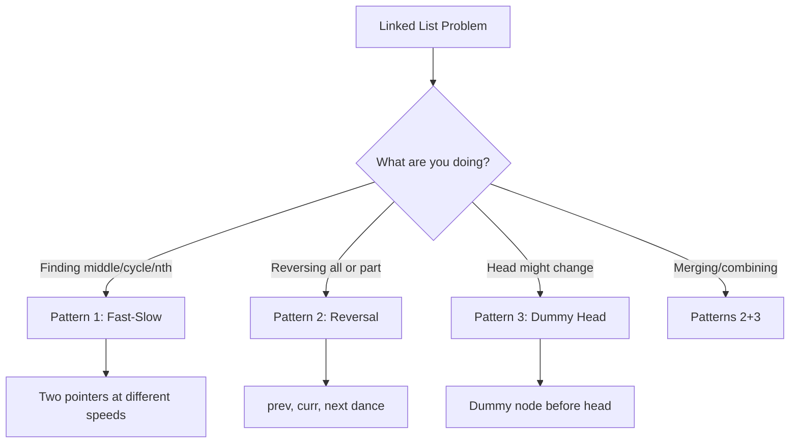

import { LanguageSelector, TimeEstimate, ConfidenceBuilder, DifficultyBadge } from '@site/src/components/interview-guide';
import { CodeTabs } from '@site/src/components/design-patterns/CodeTabs';
import TabItem from '@theme/TabItem';

# Linked Lists: Master Pointer Manipulation

In my first Amazon interview, I was asked to reverse a linked list. I'd done it a hundred times on LeetCode. But when I tried to write it on the whiteboard, my mind went blank.

The problem wasn't that I hadn't practiced. It was that I'd memorized code instead of understanding the pointer dance. I knew *what* the code looked like, but not *why* it worked.

That night, I drew out the reversal step by step—each pointer, each reassignment. The next morning, I could reverse a linked list in my sleep.

**Here's the insight that changed everything: linked list problems aren't about data structures—they're about pointer manipulation.** Once you understand how pointers move, every linked list problem becomes manageable.

<LanguageSelector />

<TimeEstimate
  learnTime="30-40 minutes"
  practiceTime="3-4 hours"
  masteryTime="10-15 problems"
  interviewFrequency="70%"
  difficultyRange="Easy to Hard"
  prerequisites="Big-O Notation, Arrays"
/>

---

## Why Linked Lists Matter in Interviews

Interviewers love linked lists because they test skills that transfer to real engineering:

1. **Pointer manipulation** — Can you track multiple references without getting confused?
2. **Edge case handling** — Empty list, single node, cycles
3. **In-place algorithms** — Can you modify without extra space?
4. **Visual thinking** — Can you draw what's happening?

<ConfidenceBuilder type="real-talk" title="What Interviewers Actually Evaluate">

When I interview candidates on linked lists, I'm not checking if they've memorized `reverse_list`. I'm watching for:

1. **Do they draw it first?** Candidates who sketch before coding almost always succeed.
2. **Do they handle edge cases?** Asking "what if the list is empty?" shows maturity.
3. **Can they trace through their code?** "Let me walk through with [1,2,3]..." is music to my ears.

The bar isn't perfection. It's systematic thinking.

</ConfidenceBuilder>

---

## The Node Structure

Before diving into patterns, let's establish the basic node structure in all 7 languages.

<CodeTabs>
<TabItem value="python" label="Python">

```python
# Singly Linked List Node
class ListNode:
    def __init__(self, val: int = 0, next: 'ListNode | None' = None):
        self.val = val
        self.next = next

# Doubly Linked List Node
class DoublyListNode:
    def __init__(self, val: int = 0, prev: 'DoublyListNode | None' = None, 
                 next: 'DoublyListNode | None' = None):
        self.val = val
        self.prev = prev
        self.next = next
```

</TabItem>
<TabItem value="typescript" label="TypeScript">

```typescript
// Singly Linked List Node
class ListNode {
  val: number;
  next: ListNode | null;

  constructor(val: number = 0, next: ListNode | null = null) {
    this.val = val;
    this.next = next;
  }
}

// Doubly Linked List Node
class DoublyListNode {
  val: number;
  prev: DoublyListNode | null;
  next: DoublyListNode | null;

  constructor(
    val: number = 0,
    prev: DoublyListNode | null = null,
    next: DoublyListNode | null = null
  ) {
    this.val = val;
    this.prev = prev;
    this.next = next;
  }
}
```

</TabItem>
<TabItem value="go" label="Go">

```go
// Singly Linked List Node
type ListNode struct {
    Val  int
    Next *ListNode
}

// Doubly Linked List Node
type DoublyListNode struct {
    Val  int
    Prev *DoublyListNode
    Next *DoublyListNode
}
```

</TabItem>
<TabItem value="java" label="Java">

```java
// Singly Linked List Node
public class ListNode {
    int val;
    ListNode next;

    ListNode() {}
    ListNode(int val) { this.val = val; }
    ListNode(int val, ListNode next) { 
        this.val = val; 
        this.next = next; 
    }
}

// Doubly Linked List Node
public class DoublyListNode {
    int val;
    DoublyListNode prev;
    DoublyListNode next;

    DoublyListNode(int val) { this.val = val; }
}
```

</TabItem>
<TabItem value="cpp" label="C++">

```cpp
// Singly Linked List Node
struct ListNode {
    int val;
    ListNode* next;
    
    ListNode() : val(0), next(nullptr) {}
    ListNode(int x) : val(x), next(nullptr) {}
    ListNode(int x, ListNode* next) : val(x), next(next) {}
};

// Doubly Linked List Node
struct DoublyListNode {
    int val;
    DoublyListNode* prev;
    DoublyListNode* next;
    
    DoublyListNode(int x) : val(x), prev(nullptr), next(nullptr) {}
};
```

</TabItem>
<TabItem value="c" label="C">

```c
// Singly Linked List Node
typedef struct ListNode {
    int val;
    struct ListNode* next;
} ListNode;

// Doubly Linked List Node
typedef struct DoublyListNode {
    int val;
    struct DoublyListNode* prev;
    struct DoublyListNode* next;
} DoublyListNode;

// Helper to create a node
ListNode* createNode(int val) {
    ListNode* node = (ListNode*)malloc(sizeof(ListNode));
    node->val = val;
    node->next = NULL;
    return node;
}
```

</TabItem>
<TabItem value="csharp" label="C#">

```csharp
// Singly Linked List Node
public class ListNode {
    public int Val;
    public ListNode? Next;

    public ListNode(int val = 0, ListNode? next = null) {
        Val = val;
        Next = next;
    }
}

// Doubly Linked List Node
public class DoublyListNode {
    public int Val;
    public DoublyListNode? Prev;
    public DoublyListNode? Next;

    public DoublyListNode(int val = 0) {
        Val = val;
    }
}
```

</TabItem>
</CodeTabs>

---

## Arrays vs Linked Lists

Understanding when to use each is crucial for system design discussions:

| Operation | Array | Linked List |
|-----------|-------|-------------|
| Access by index | O(1) | O(n) |
| Insert at beginning | O(n) | **O(1)** |
| Insert at end | O(1) amortized | O(1) with tail |
| Insert in middle | O(n) | O(1) after finding |
| Delete | O(n) | O(1) after finding |
| Memory | Contiguous | Scattered |
| Cache performance | **Excellent** | Poor |

**When linked lists shine:**
- Frequent insertions/deletions at the beginning
- Implementing LRU cache (doubly linked list + hash map)
- When you don't need random access

---

## The Three Essential Patterns

**90% of linked list problems use one of these three patterns.** Master them, and you'll recognize the solution to most problems within seconds.



---

## Pattern 1: Fast and Slow Pointers

**Use when:** Finding the middle, detecting cycles, finding nth from end.

The fast pointer moves twice as fast as the slow pointer. When fast reaches the end, slow is at the middle.

<CodeTabs>
<TabItem value="python" label="Python">

```python
def find_middle(head: ListNode | None) -> ListNode | None:
    """
    Find the middle node of a linked list.
    For even length, returns the second middle node.
    Time: O(n), Space: O(1)
    """
    if not head:
        return None
    
    slow = fast = head
    
    while fast and fast.next:
        slow = slow.next        # Move 1 step
        fast = fast.next.next   # Move 2 steps
    
    return slow  # slow is at middle when fast reaches end


def has_cycle(head: ListNode | None) -> bool:
    """
    Detect if a linked list has a cycle.
    Time: O(n), Space: O(1)
    """
    if not head:
        return False
    
    slow = fast = head
    
    while fast and fast.next:
        slow = slow.next
        fast = fast.next.next
        
        if slow == fast:  # They meet = cycle exists
            return True
    
    return False
```

</TabItem>
<TabItem value="typescript" label="TypeScript">

```typescript
function findMiddle(head: ListNode | null): ListNode | null {
  if (!head) return null;

  let slow: ListNode | null = head;
  let fast: ListNode | null = head;

  while (fast && fast.next) {
    slow = slow!.next;
    fast = fast.next.next;
  }

  return slow;
}

function hasCycle(head: ListNode | null): boolean {
  if (!head) return false;

  let slow: ListNode | null = head;
  let fast: ListNode | null = head;

  while (fast && fast.next) {
    slow = slow!.next;
    fast = fast.next.next;

    if (slow === fast) {
      return true;
    }
  }

  return false;
}
```

</TabItem>
<TabItem value="go" label="Go">

```go
func findMiddle(head *ListNode) *ListNode {
    if head == nil {
        return nil
    }
    
    slow, fast := head, head
    
    for fast != nil && fast.Next != nil {
        slow = slow.Next
        fast = fast.Next.Next
    }
    
    return slow
}

func hasCycle(head *ListNode) bool {
    if head == nil {
        return false
    }
    
    slow, fast := head, head
    
    for fast != nil && fast.Next != nil {
        slow = slow.Next
        fast = fast.Next.Next
        
        if slow == fast {
            return true
        }
    }
    
    return false
}
```

</TabItem>
<TabItem value="java" label="Java">

```java
public ListNode findMiddle(ListNode head) {
    if (head == null) return null;
    
    ListNode slow = head;
    ListNode fast = head;
    
    while (fast != null && fast.next != null) {
        slow = slow.next;
        fast = fast.next.next;
    }
    
    return slow;
}

public boolean hasCycle(ListNode head) {
    if (head == null) return false;
    
    ListNode slow = head;
    ListNode fast = head;
    
    while (fast != null && fast.next != null) {
        slow = slow.next;
        fast = fast.next.next;
        
        if (slow == fast) {
            return true;
        }
    }
    
    return false;
}
```

</TabItem>
<TabItem value="cpp" label="C++">

```cpp
ListNode* findMiddle(ListNode* head) {
    if (!head) return nullptr;
    
    ListNode* slow = head;
    ListNode* fast = head;
    
    while (fast && fast->next) {
        slow = slow->next;
        fast = fast->next->next;
    }
    
    return slow;
}

bool hasCycle(ListNode* head) {
    if (!head) return false;
    
    ListNode* slow = head;
    ListNode* fast = head;
    
    while (fast && fast->next) {
        slow = slow->next;
        fast = fast->next->next;
        
        if (slow == fast) {
            return true;
        }
    }
    
    return false;
}
```

</TabItem>
<TabItem value="c" label="C">

```c
ListNode* findMiddle(ListNode* head) {
    if (!head) return NULL;
    
    ListNode* slow = head;
    ListNode* fast = head;
    
    while (fast && fast->next) {
        slow = slow->next;
        fast = fast->next->next;
    }
    
    return slow;
}

bool hasCycle(ListNode* head) {
    if (!head) return false;
    
    ListNode* slow = head;
    ListNode* fast = head;
    
    while (fast && fast->next) {
        slow = slow->next;
        fast = fast->next->next;
        
        if (slow == fast) {
            return true;
        }
    }
    
    return false;
}
```

</TabItem>
<TabItem value="csharp" label="C#">

```csharp
public ListNode? FindMiddle(ListNode? head) {
    if (head == null) return null;
    
    var slow = head;
    var fast = head;
    
    while (fast != null && fast.Next != null) {
        slow = slow!.Next;
        fast = fast.Next.Next;
    }
    
    return slow;
}

public bool HasCycle(ListNode? head) {
    if (head == null) return false;
    
    var slow = head;
    var fast = head;
    
    while (fast != null && fast.Next != null) {
        slow = slow!.Next;
        fast = fast.Next.Next;
        
        if (slow == fast) {
            return true;
        }
    }
    
    return false;
}
```

</TabItem>
</CodeTabs>

### Visualization: Why Fast-Slow Works

```
Finding middle of [1 → 2 → 3 → 4 → 5]

Step 0: slow=1, fast=1
        [1] → 2 → 3 → 4 → 5
         S
         F

Step 1: slow=2, fast=3
        1 → [2] → 3 → 4 → 5
             S
                  F

Step 2: slow=3, fast=5
        1 → 2 → [3] → 4 → 5
                 S
                          F

Step 3: fast.next is None, stop!
        Return slow (node with value 3) = MIDDLE ✓
```

---

## Pattern 2: In-Place Reversal

**Use when:** Reversing the entire list or portions of it.

This is the pattern that trips up most candidates. The key is understanding the "three-pointer dance": `prev`, `curr`, and `next_temp`.

<CodeTabs>
<TabItem value="python" label="Python">

```python
def reverse_list(head: ListNode | None) -> ListNode | None:
    """
    Reverse a linked list in-place.
    Time: O(n), Space: O(1)
    """
    prev = None
    curr = head
    
    while curr:
        next_temp = curr.next  # Save next before we break the link
        curr.next = prev       # Reverse the pointer
        prev = curr            # Move prev forward
        curr = next_temp       # Move curr forward
    
    return prev  # prev is now the new head
```

</TabItem>
<TabItem value="typescript" label="TypeScript">

```typescript
function reverseList(head: ListNode | null): ListNode | null {
  let prev: ListNode | null = null;
  let curr: ListNode | null = head;

  while (curr) {
    const nextTemp = curr.next; // Save next
    curr.next = prev;           // Reverse pointer
    prev = curr;                // Move prev forward
    curr = nextTemp;            // Move curr forward
  }

  return prev; // New head
}
```

</TabItem>
<TabItem value="go" label="Go">

```go
func reverseList(head *ListNode) *ListNode {
    var prev *ListNode = nil
    curr := head
    
    for curr != nil {
        nextTemp := curr.Next  // Save next
        curr.Next = prev       // Reverse pointer
        prev = curr            // Move prev forward
        curr = nextTemp        // Move curr forward
    }
    
    return prev // New head
}
```

</TabItem>
<TabItem value="java" label="Java">

```java
public ListNode reverseList(ListNode head) {
    ListNode prev = null;
    ListNode curr = head;
    
    while (curr != null) {
        ListNode nextTemp = curr.next; // Save next
        curr.next = prev;              // Reverse pointer
        prev = curr;                   // Move prev forward
        curr = nextTemp;               // Move curr forward
    }
    
    return prev; // New head
}
```

</TabItem>
<TabItem value="cpp" label="C++">

```cpp
ListNode* reverseList(ListNode* head) {
    ListNode* prev = nullptr;
    ListNode* curr = head;
    
    while (curr) {
        ListNode* nextTemp = curr->next; // Save next
        curr->next = prev;               // Reverse pointer
        prev = curr;                     // Move prev forward
        curr = nextTemp;                 // Move curr forward
    }
    
    return prev; // New head
}
```

</TabItem>
<TabItem value="c" label="C">

```c
ListNode* reverseList(ListNode* head) {
    ListNode* prev = NULL;
    ListNode* curr = head;
    
    while (curr) {
        ListNode* nextTemp = curr->next; // Save next
        curr->next = prev;               // Reverse pointer
        prev = curr;                     // Move prev forward
        curr = nextTemp;                 // Move curr forward
    }
    
    return prev; // New head
}
```

</TabItem>
<TabItem value="csharp" label="C#">

```csharp
public ListNode? ReverseList(ListNode? head) {
    ListNode? prev = null;
    var curr = head;
    
    while (curr != null) {
        var nextTemp = curr.Next; // Save next
        curr.Next = prev;         // Reverse pointer
        prev = curr;              // Move prev forward
        curr = nextTemp;          // Move curr forward
    }
    
    return prev; // New head
}
```

</TabItem>
</CodeTabs>

### Visualization: The Reversal Dance

```
Reversing [1 → 2 → 3 → null]

Initial:  prev=null, curr=1
          null    1 → 2 → 3 → null
          prev   curr

Step 1:   Save next (2), reverse pointer, advance
          null ← 1    2 → 3 → null
                prev curr

Step 2:   Save next (3), reverse pointer, advance  
          null ← 1 ← 2    3 → null
                     prev curr

Step 3:   Save next (null), reverse pointer, advance
          null ← 1 ← 2 ← 3    null
                         prev  curr

Done!     curr is null, return prev (3)
          Result: 3 → 2 → 1 → null ✓
```

<ConfidenceBuilder type="youve-got-this">

**If you can draw the reversal, you can code it.**

Don't try to keep all the pointers in your head. Draw a small example (3-4 nodes), trace through each step, and the code writes itself.

</ConfidenceBuilder>

---

## Pattern 3: Dummy Head

**Use when:** The head might change, or you want cleaner edge case handling.

A dummy node before the actual head eliminates special cases for empty lists and operations at the head.

<CodeTabs>
<TabItem value="python" label="Python">

```python
def merge_two_lists(l1: ListNode | None, l2: ListNode | None) -> ListNode | None:
    """
    Merge two sorted linked lists.
    Time: O(n + m), Space: O(1)
    """
    dummy = ListNode(0)  # Dummy head simplifies logic
    curr = dummy
    
    while l1 and l2:
        if l1.val <= l2.val:
            curr.next = l1
            l1 = l1.next
        else:
            curr.next = l2
            l2 = l2.next
        curr = curr.next
    
    # Attach remaining nodes
    curr.next = l1 if l1 else l2
    
    return dummy.next  # Skip the dummy
```

</TabItem>
<TabItem value="typescript" label="TypeScript">

```typescript
function mergeTwoLists(
  l1: ListNode | null,
  l2: ListNode | null
): ListNode | null {
  const dummy = new ListNode(0);
  let curr = dummy;

  while (l1 && l2) {
    if (l1.val <= l2.val) {
      curr.next = l1;
      l1 = l1.next;
    } else {
      curr.next = l2;
      l2 = l2.next;
    }
    curr = curr.next;
  }

  curr.next = l1 ?? l2;

  return dummy.next;
}
```

</TabItem>
<TabItem value="go" label="Go">

```go
func mergeTwoLists(l1, l2 *ListNode) *ListNode {
    dummy := &ListNode{}
    curr := dummy
    
    for l1 != nil && l2 != nil {
        if l1.Val <= l2.Val {
            curr.Next = l1
            l1 = l1.Next
        } else {
            curr.Next = l2
            l2 = l2.Next
        }
        curr = curr.Next
    }
    
    if l1 != nil {
        curr.Next = l1
    } else {
        curr.Next = l2
    }
    
    return dummy.Next
}
```

</TabItem>
<TabItem value="java" label="Java">

```java
public ListNode mergeTwoLists(ListNode l1, ListNode l2) {
    ListNode dummy = new ListNode(0);
    ListNode curr = dummy;
    
    while (l1 != null && l2 != null) {
        if (l1.val <= l2.val) {
            curr.next = l1;
            l1 = l1.next;
        } else {
            curr.next = l2;
            l2 = l2.next;
        }
        curr = curr.next;
    }
    
    curr.next = (l1 != null) ? l1 : l2;
    
    return dummy.next;
}
```

</TabItem>
<TabItem value="cpp" label="C++">

```cpp
ListNode* mergeTwoLists(ListNode* l1, ListNode* l2) {
    ListNode dummy(0);
    ListNode* curr = &dummy;
    
    while (l1 && l2) {
        if (l1->val <= l2->val) {
            curr->next = l1;
            l1 = l1->next;
        } else {
            curr->next = l2;
            l2 = l2->next;
        }
        curr = curr->next;
    }
    
    curr->next = l1 ? l1 : l2;
    
    return dummy.next;
}
```

</TabItem>
<TabItem value="c" label="C">

```c
ListNode* mergeTwoLists(ListNode* l1, ListNode* l2) {
    ListNode dummy = {0, NULL};
    ListNode* curr = &dummy;
    
    while (l1 && l2) {
        if (l1->val <= l2->val) {
            curr->next = l1;
            l1 = l1->next;
        } else {
            curr->next = l2;
            l2 = l2->next;
        }
        curr = curr->next;
    }
    
    curr->next = l1 ? l1 : l2;
    
    return dummy.next;
}
```

</TabItem>
<TabItem value="csharp" label="C#">

```csharp
public ListNode? MergeTwoLists(ListNode? l1, ListNode? l2) {
    var dummy = new ListNode(0);
    var curr = dummy;
    
    while (l1 != null && l2 != null) {
        if (l1.Val <= l2.Val) {
            curr.Next = l1;
            l1 = l1.Next;
        } else {
            curr.Next = l2;
            l2 = l2.Next;
        }
        curr = curr.Next!;
    }
    
    curr.Next = l1 ?? l2;
    
    return dummy.Next;
}
```

</TabItem>
</CodeTabs>

---

## 🎯 Pattern Triggers

Recognizing which pattern to use is half the battle:

| If the problem mentions... | Pattern to try |
|---------------------------|----------------|
| "Find middle", "detect cycle", "nth from end" | **Fast-Slow** |
| "Reverse", "palindrome", "rotate" | **Reversal** |
| "Merge", "remove", "insert", head might change | **Dummy Head** |
| "In-place", "O(1) space" | **Reversal** (no extra list) |
| "Reorder", "partition" | **Combination** of patterns |

---

## 💬 How to Communicate This in Interviews

**When given a linked list problem, say:**

> "Before I start coding, let me think about which pattern applies here. This problem mentions [X], which suggests the [fast-slow/reversal/dummy head] pattern."

**Before coding:**
> "I'm going to use a dummy head here because the head might change during the operation. That way I don't need special cases."

**While coding:**
> "I'm saving `next_temp` before I modify `curr.next`—otherwise I'd lose the reference to the rest of the list."

**After coding:**
> "Let me trace through with a small example: [1,2,3]..."

---

## Common Mistakes (And How to Avoid Them)

### 1. Losing References

```python
# ❌ WRONG - Lost the rest of the list!
curr.next = curr.next.next

# ✅ RIGHT - Save reference first
temp = curr.next
curr.next = curr.next.next
# temp is still available if needed
```

### 2. Forgetting Null Checks

```python
# ❌ WRONG - Crashes on empty list
def get_second(head):
    return head.next.val  # NullPointerException!

# ✅ RIGHT - Check before accessing
def get_second(head):
    if not head or not head.next:
        return None
    return head.next.val
```

### 3. Infinite Loops

```python
# ❌ WRONG - Never terminates if cycle exists
while curr:
    curr = curr.next

# ✅ RIGHT - Use fast-slow to detect cycle first
# Or track visited nodes
```

---

## Edge Cases Checklist

Always test your solution with:

- [ ] Empty list (`head = None`)
- [ ] Single node
- [ ] Two nodes
- [ ] Odd vs even length
- [ ] Cycle present (for cycle-related problems)
- [ ] Operation at head
- [ ] Operation at tail

---

## 🏋️ Practice Problems

### Warm-Up (Build Confidence)

| Problem | Difficulty | Time | Hint |
|---------|------------|------|------|
| [Reverse Linked List](https://leetcode.com/problems/reverse-linked-list/) | <DifficultyBadge level="easy" /> | 15 min | prev, curr, next_temp |
| [Linked List Cycle](https://leetcode.com/problems/linked-list-cycle/) | <DifficultyBadge level="easy" /> | 10 min | Fast-slow pointers |
| [Merge Two Sorted Lists](https://leetcode.com/problems/merge-two-sorted-lists/) | <DifficultyBadge level="easy" /> | 15 min | Dummy head |
| [Middle of the Linked List](https://leetcode.com/problems/middle-of-the-linked-list/) | <DifficultyBadge level="easy" /> | 10 min | Fast-slow |

### Core Practice (Must Do)

| Problem | Difficulty | Companies | Pattern |
|---------|------------|-----------|---------|
| [Remove Nth Node From End](https://leetcode.com/problems/remove-nth-node-from-end-of-list/) | <DifficultyBadge level="medium" /> | Meta, Amazon, Microsoft | Two pointers n apart |
| [Linked List Cycle II](https://leetcode.com/problems/linked-list-cycle-ii/) | <DifficultyBadge level="medium" /> | Amazon, Microsoft, Bloomberg | Floyd's algorithm |
| [Reorder List](https://leetcode.com/problems/reorder-list/) | <DifficultyBadge level="medium" /> | Amazon, Meta, Adobe | Find middle + reverse + merge |
| [Add Two Numbers](https://leetcode.com/problems/add-two-numbers/) | <DifficultyBadge level="medium" /> | Amazon, Meta, Microsoft | Dummy head + carry |
| [Palindrome Linked List](https://leetcode.com/problems/palindrome-linked-list/) | <DifficultyBadge level="medium" /> | Meta, Amazon, Bloomberg | Fast-slow + reverse half |
| [Copy List with Random Pointer](https://leetcode.com/problems/copy-list-with-random-pointer/) | <DifficultyBadge level="medium" /> | Amazon, Meta, Microsoft | Interleaving or hash map |

### Challenge (For Mastery)

| Problem | Difficulty | Companies | Why It's Hard |
|---------|------------|-----------|---------------|
| [Merge k Sorted Lists](https://leetcode.com/problems/merge-k-sorted-lists/) | <DifficultyBadge level="hard" /> | Google, Amazon, Meta | Heap + merge logic |
| [Reverse Nodes in k-Group](https://leetcode.com/problems/reverse-nodes-in-k-group/) | <DifficultyBadge level="hard" /> | Meta, Amazon, Microsoft | Complex reversal tracking |
| [LRU Cache](https://leetcode.com/problems/lru-cache/) | <DifficultyBadge level="medium" /> | Amazon, Meta, Google, Microsoft | Doubly linked list + hash map |

---

## Key Takeaways

1. **Three patterns cover 90% of problems:** Fast-slow, reversal, dummy head.

2. **Draw before you code.** Linked list problems are visual—use that.

3. **Save references before modifying.** The `next_temp = curr.next` step prevents disasters.

4. **Dummy head eliminates edge cases.** When in doubt, use one.

5. **Practice the reversal until it's automatic.** It's the most commonly tested pattern.

<ConfidenceBuilder type="remember">

**Linked list problems test systematic thinking, not memorization.**

If you understand why each pointer moves, you can solve any linked list problem—even ones you've never seen before.

</ConfidenceBuilder>

---

## What's Next?

Stacks and queues are often implemented with linked lists and share similar pointer manipulation concepts:

**Next up:** [Stacks & Queues](/docs/interview-guide/coding/data-structures/stacks-queues) — LIFO and FIFO data structures
