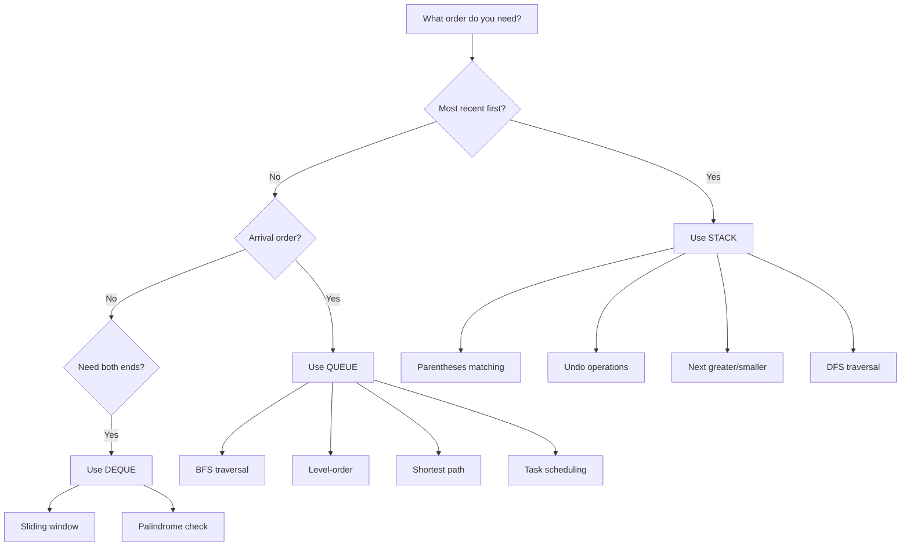

import { LanguageSelector, TimeEstimate, ConfidenceBuilder, DifficultyBadge } from '@site/src/components/interview-guide';
import { CodeTabs } from '@site/src/components/design-patterns/CodeTabs';
import TabItem from '@theme/TabItem';

# Stacks & Queues: Order Matters

There's a category of problems where the solution clicks the moment you realize: "Oh, I need to process things in a specific order."

Parentheses matching? Stack. Level-order traversal? Queue. Next greater element? Monotonic stack.

I remember struggling with "Daily Temperatures" for 30 minutes before someone said: "What if you tracked the temperatures you haven't found an answer for yet?" That's when the monotonic stack pattern clicked—and suddenly a whole class of problems became solvable.

**Stacks and queues aren't just data structures—they're thinking tools.** They tell you *how* to process data. The moment you identify which one a problem needs, you're halfway to the solution.

<LanguageSelector />

<TimeEstimate
  learnTime="30-40 minutes"
  practiceTime="3-4 hours"
  masteryTime="12-15 problems"
  interviewFrequency="65%"
  difficultyRange="Easy to Hard"
  prerequisites="Arrays, Big-O Notation"
/>

---

## Stack: Last In, First Out (LIFO)

Think of a stack of plates. You can only add or remove from the top. The last plate you put on is the first one you take off.

<CodeTabs>
<TabItem value="python" label="Python">

```python
# Stack operations in Python (use list)
stack: list[int] = []

# Push - O(1)
stack.append(1)
stack.append(2)
stack.append(3)

# Peek (view top without removing) - O(1)
top = stack[-1]  # 3

# Pop (remove and return top) - O(1)
item = stack.pop()  # 3

# Check empty
is_empty = len(stack) == 0
```

</TabItem>
<TabItem value="typescript" label="TypeScript">

```typescript
// Stack operations in TypeScript (use array)
const stack: number[] = [];

// Push - O(1)
stack.push(1);
stack.push(2);
stack.push(3);

// Peek - O(1)
const top = stack[stack.length - 1]; // 3

// Pop - O(1)
const item = stack.pop(); // 3

// Check empty
const isEmpty = stack.length === 0;
```

</TabItem>
<TabItem value="go" label="Go">

```go
// Stack operations in Go (use slice)
stack := []int{}

// Push - O(1) amortized
stack = append(stack, 1)
stack = append(stack, 2)
stack = append(stack, 3)

// Peek - O(1)
top := stack[len(stack)-1] // 3

// Pop - O(1)
item := stack[len(stack)-1]
stack = stack[:len(stack)-1]

// Check empty
isEmpty := len(stack) == 0
```

</TabItem>
<TabItem value="java" label="Java">

```java
// Stack operations in Java
// Prefer ArrayDeque over legacy Stack class
Deque<Integer> stack = new ArrayDeque<>();

// Push - O(1)
stack.push(1);
stack.push(2);
stack.push(3);

// Peek - O(1)
int top = stack.peek(); // 3

// Pop - O(1)
int item = stack.pop(); // 3

// Check empty
boolean isEmpty = stack.isEmpty();
```

</TabItem>
<TabItem value="cpp" label="C++">

```cpp
#include <stack>

// Stack operations in C++
std::stack<int> stack;

// Push - O(1)
stack.push(1);
stack.push(2);
stack.push(3);

// Peek - O(1)
int top = stack.top(); // 3

// Pop - O(1) - note: doesn't return value
stack.pop();

// Check empty
bool isEmpty = stack.empty();
```

</TabItem>
<TabItem value="c" label="C">

```c
// Stack implementation in C (array-based)
#define MAX_SIZE 1000

typedef struct {
    int data[MAX_SIZE];
    int top;
} Stack;

void initStack(Stack* s) { s->top = -1; }

bool isEmpty(Stack* s) { return s->top == -1; }

bool isFull(Stack* s) { return s->top == MAX_SIZE - 1; }

void push(Stack* s, int val) {
    if (!isFull(s)) s->data[++s->top] = val;
}

int pop(Stack* s) {
    if (!isEmpty(s)) return s->data[s->top--];
    return -1; // Error value
}

int peek(Stack* s) {
    if (!isEmpty(s)) return s->data[s->top];
    return -1;
}
```

</TabItem>
<TabItem value="csharp" label="C#">

```csharp
// Stack operations in C#
var stack = new Stack<int>();

// Push - O(1)
stack.Push(1);
stack.Push(2);
stack.Push(3);

// Peek - O(1)
int top = stack.Peek(); // 3

// Pop - O(1)
int item = stack.Pop(); // 3

// Check empty
bool isEmpty = stack.Count == 0;
```

</TabItem>
</CodeTabs>

### 🎯 When to Use Stack

| Signal in Problem | Example |
|-------------------|---------|
| "Match opening/closing" | Parentheses, HTML tags |
| "Most recent" matters | Undo operations, back button |
| "Process in reverse order" | Reverse string, reverse list |
| "Next greater/smaller" | Stock prices, temperatures |
| "DFS traversal" | Tree, graph depth-first |
| "Expression evaluation" | Calculator, postfix notation |

---

## Queue: First In, First Out (FIFO)

Think of a line at a store. The first person in line gets served first.

<CodeTabs>
<TabItem value="python" label="Python">

```python
from collections import deque

# Queue operations in Python (use deque for O(1))
queue: deque[int] = deque()

# Enqueue (add to back) - O(1)
queue.append(1)
queue.append(2)
queue.append(3)

# Peek front - O(1)
front = queue[0]  # 1

# Dequeue (remove from front) - O(1)
item = queue.popleft()  # 1

# Check empty
is_empty = len(queue) == 0
```

</TabItem>
<TabItem value="typescript" label="TypeScript">

```typescript
// Queue operations in TypeScript
// Note: shift() is O(n) - for better performance, use a proper queue library
const queue: number[] = [];

// Enqueue - O(1)
queue.push(1);
queue.push(2);
queue.push(3);

// Peek front - O(1)
const front = queue[0]; // 1

// Dequeue - O(n) with array, O(1) with proper queue
const item = queue.shift(); // 1

// Check empty
const isEmpty = queue.length === 0;
```

</TabItem>
<TabItem value="go" label="Go">

```go
// Queue operations in Go
// For production, consider container/list or a circular buffer
queue := []int{}

// Enqueue - O(1) amortized
queue = append(queue, 1)
queue = append(queue, 2)
queue = append(queue, 3)

// Peek front - O(1)
front := queue[0] // 1

// Dequeue - O(n) with slice
item := queue[0]
queue = queue[1:]

// Check empty
isEmpty := len(queue) == 0
```

</TabItem>
<TabItem value="java" label="Java">

```java
import java.util.*;

// Queue operations in Java
Queue<Integer> queue = new LinkedList<>();
// Or for better performance: new ArrayDeque<>()

// Enqueue - O(1)
queue.offer(1);
queue.offer(2);
queue.offer(3);

// Peek - O(1)
int front = queue.peek(); // 1

// Dequeue - O(1)
int item = queue.poll(); // 1

// Check empty
boolean isEmpty = queue.isEmpty();
```

</TabItem>
<TabItem value="cpp" label="C++">

```cpp
#include <queue>

// Queue operations in C++
std::queue<int> queue;

// Enqueue - O(1)
queue.push(1);
queue.push(2);
queue.push(3);

// Peek - O(1)
int front = queue.front(); // 1

// Dequeue - O(1)
queue.pop(); // Note: doesn't return value

// Check empty
bool isEmpty = queue.empty();
```

</TabItem>
<TabItem value="c" label="C">

```c
// Queue implementation in C (circular array)
#define MAX_SIZE 1000

typedef struct {
    int data[MAX_SIZE];
    int front, rear, size;
} Queue;

void initQueue(Queue* q) {
    q->front = 0;
    q->rear = -1;
    q->size = 0;
}

bool isEmpty(Queue* q) { return q->size == 0; }

void enqueue(Queue* q, int val) {
    if (q->size < MAX_SIZE) {
        q->rear = (q->rear + 1) % MAX_SIZE;
        q->data[q->rear] = val;
        q->size++;
    }
}

int dequeue(Queue* q) {
    if (!isEmpty(q)) {
        int val = q->data[q->front];
        q->front = (q->front + 1) % MAX_SIZE;
        q->size--;
        return val;
    }
    return -1;
}
```

</TabItem>
<TabItem value="csharp" label="C#">

```csharp
// Queue operations in C#
var queue = new Queue<int>();

// Enqueue - O(1)
queue.Enqueue(1);
queue.Enqueue(2);
queue.Enqueue(3);

// Peek - O(1)
int front = queue.Peek(); // 1

// Dequeue - O(1)
int item = queue.Dequeue(); // 1

// Check empty
bool isEmpty = queue.Count == 0;
```

</TabItem>
</CodeTabs>

<ConfidenceBuilder type="remember" title="Performance Trap">

**In Python:** Don't use `list.pop(0)` for queues—it's O(n) because all elements shift. Use `collections.deque.popleft()` for O(1).

**In JavaScript/TypeScript:** `Array.shift()` is also O(n). For interview problems this is usually acceptable, but mention the trade-off.

</ConfidenceBuilder>

### 🎯 When to Use Queue

| Signal in Problem | Example |
|-------------------|---------|
| "Process in order received" | Task scheduling |
| "Level by level" | BFS, level-order traversal |
| "Shortest path (unweighted)" | Maze, word ladder |
| "Sliding window max/min" | Monotonic deque |
| "Recent requests" | Rate limiting |

---

## Stack vs Queue Decision Flowchart



---

## Pattern 1: Matching Brackets (Stack)

The classic stack problem. Opens go on stack, closes must match top.

<CodeTabs>
<TabItem value="python" label="Python">

```python
def is_valid(s: str) -> bool:
    """
    Check if parentheses are balanced.
    Time: O(n), Space: O(n)
    """
    stack: list[str] = []
    pairs = {')': '(', '}': '{', ']': '['}
    
    for char in s:
        if char in '({[':
            stack.append(char)
        elif char in ')}]':
            if not stack or stack[-1] != pairs[char]:
                return False
            stack.pop()
    
    return len(stack) == 0

# Examples:
# "()" → True
# "()[]{}" → True  
# "(]" → False
# "([)]" → False
```

</TabItem>
<TabItem value="typescript" label="TypeScript">

```typescript
function isValid(s: string): boolean {
  const stack: string[] = [];
  const pairs: Record<string, string> = {
    ')': '(',
    '}': '{',
    ']': '['
  };

  for (const char of s) {
    if ('({['.includes(char)) {
      stack.push(char);
    } else if (')}]'.includes(char)) {
      if (stack.length === 0 || stack[stack.length - 1] !== pairs[char]) {
        return false;
      }
      stack.pop();
    }
  }

  return stack.length === 0;
}
```

</TabItem>
<TabItem value="go" label="Go">

```go
func isValid(s string) bool {
    stack := []rune{}
    pairs := map[rune]rune{
        ')': '(',
        '}': '{',
        ']': '[',
    }
    
    for _, char := range s {
        switch char {
        case '(', '{', '[':
            stack = append(stack, char)
        case ')', '}', ']':
            if len(stack) == 0 || stack[len(stack)-1] != pairs[char] {
                return false
            }
            stack = stack[:len(stack)-1]
        }
    }
    
    return len(stack) == 0
}
```

</TabItem>
<TabItem value="java" label="Java">

```java
public boolean isValid(String s) {
    Deque<Character> stack = new ArrayDeque<>();
    Map<Character, Character> pairs = Map.of(
        ')', '(',
        '}', '{',
        ']', '['
    );
    
    for (char c : s.toCharArray()) {
        if (c == '(' || c == '{' || c == '[') {
            stack.push(c);
        } else if (c == ')' || c == '}' || c == ']') {
            if (stack.isEmpty() || stack.peek() != pairs.get(c)) {
                return false;
            }
            stack.pop();
        }
    }
    
    return stack.isEmpty();
}
```

</TabItem>
<TabItem value="cpp" label="C++">

```cpp
bool isValid(string s) {
    stack<char> stk;
    unordered_map<char, char> pairs = {
        {')', '('},
        {'}', '{'},
        {']', '['}
    };
    
    for (char c : s) {
        if (c == '(' || c == '{' || c == '[') {
            stk.push(c);
        } else if (c == ')' || c == '}' || c == ']') {
            if (stk.empty() || stk.top() != pairs[c]) {
                return false;
            }
            stk.pop();
        }
    }
    
    return stk.empty();
}
```

</TabItem>
<TabItem value="c" label="C">

```c
bool isValid(char* s) {
    int len = strlen(s);
    char* stack = (char*)malloc(len);
    int top = -1;
    
    for (int i = 0; s[i]; i++) {
        char c = s[i];
        if (c == '(' || c == '{' || c == '[') {
            stack[++top] = c;
        } else {
            char expected;
            if (c == ')') expected = '(';
            else if (c == '}') expected = '{';
            else expected = '[';
            
            if (top < 0 || stack[top] != expected) {
                free(stack);
                return false;
            }
            top--;
        }
    }
    
    free(stack);
    return top == -1;
}
```

</TabItem>
<TabItem value="csharp" label="C#">

```csharp
public bool IsValid(string s) {
    var stack = new Stack<char>();
    var pairs = new Dictionary<char, char> {
        {')', '('},
        {'}', '{'},
        {']', '['}
    };
    
    foreach (char c in s) {
        if (c == '(' || c == '{' || c == '[') {
            stack.Push(c);
        } else if (c == ')' || c == '}' || c == ']') {
            if (stack.Count == 0 || stack.Peek() != pairs[c]) {
                return false;
            }
            stack.Pop();
        }
    }
    
    return stack.Count == 0;
}
```

</TabItem>
</CodeTabs>

---

## Pattern 2: Monotonic Stack

**Key insight:** Maintain a stack where elements are in sorted order (all increasing or all decreasing). Use when finding "next greater" or "next smaller."

<CodeTabs>
<TabItem value="python" label="Python">

```python
def daily_temperatures(temperatures: list[int]) -> list[int]:
    """
    For each day, find how many days until a warmer temperature.
    Time: O(n), Space: O(n)
    
    Key insight: We only care about temperatures we haven't found
    an answer for yet. Keep them on a stack.
    """
    n = len(temperatures)
    result = [0] * n
    stack: list[int] = []  # Store indices, values are decreasing
    
    for i in range(n):
        # Pop all days that found their warmer day
        while stack and temperatures[stack[-1]] < temperatures[i]:
            prev_idx = stack.pop()
            result[prev_idx] = i - prev_idx
        stack.append(i)
    
    return result

# Input:  [73, 74, 75, 71, 69, 72, 76, 73]
# Output: [1,  1,  4,  2,  1,  1,  0,  0]
```

</TabItem>
<TabItem value="typescript" label="TypeScript">

```typescript
function dailyTemperatures(temperatures: number[]): number[] {
  const n = temperatures.length;
  const result: number[] = new Array(n).fill(0);
  const stack: number[] = []; // indices with decreasing temperatures

  for (let i = 0; i < n; i++) {
    while (
      stack.length > 0 &&
      temperatures[stack[stack.length - 1]] < temperatures[i]
    ) {
      const prevIdx = stack.pop()!;
      result[prevIdx] = i - prevIdx;
    }
    stack.push(i);
  }

  return result;
}
```

</TabItem>
<TabItem value="go" label="Go">

```go
func dailyTemperatures(temperatures []int) []int {
    n := len(temperatures)
    result := make([]int, n)
    stack := []int{} // indices with decreasing temperatures
    
    for i := 0; i < n; i++ {
        for len(stack) > 0 && temperatures[stack[len(stack)-1]] < temperatures[i] {
            prevIdx := stack[len(stack)-1]
            stack = stack[:len(stack)-1]
            result[prevIdx] = i - prevIdx
        }
        stack = append(stack, i)
    }
    
    return result
}
```

</TabItem>
<TabItem value="java" label="Java">

```java
public int[] dailyTemperatures(int[] temperatures) {
    int n = temperatures.length;
    int[] result = new int[n];
    Deque<Integer> stack = new ArrayDeque<>();
    
    for (int i = 0; i < n; i++) {
        while (!stack.isEmpty() && temperatures[stack.peek()] < temperatures[i]) {
            int prevIdx = stack.pop();
            result[prevIdx] = i - prevIdx;
        }
        stack.push(i);
    }
    
    return result;
}
```

</TabItem>
<TabItem value="cpp" label="C++">

```cpp
vector<int> dailyTemperatures(vector<int>& temperatures) {
    int n = temperatures.size();
    vector<int> result(n, 0);
    stack<int> stk; // indices with decreasing temperatures
    
    for (int i = 0; i < n; i++) {
        while (!stk.empty() && temperatures[stk.top()] < temperatures[i]) {
            int prevIdx = stk.top();
            stk.pop();
            result[prevIdx] = i - prevIdx;
        }
        stk.push(i);
    }
    
    return result;
}
```

</TabItem>
<TabItem value="c" label="C">

```c
int* dailyTemperatures(int* temperatures, int n, int* returnSize) {
    *returnSize = n;
    int* result = (int*)calloc(n, sizeof(int));
    int* stack = (int*)malloc(n * sizeof(int));
    int top = -1;
    
    for (int i = 0; i < n; i++) {
        while (top >= 0 && temperatures[stack[top]] < temperatures[i]) {
            int prevIdx = stack[top--];
            result[prevIdx] = i - prevIdx;
        }
        stack[++top] = i;
    }
    
    free(stack);
    return result;
}
```

</TabItem>
<TabItem value="csharp" label="C#">

```csharp
public int[] DailyTemperatures(int[] temperatures) {
    int n = temperatures.Length;
    int[] result = new int[n];
    var stack = new Stack<int>();
    
    for (int i = 0; i < n; i++) {
        while (stack.Count > 0 && temperatures[stack.Peek()] < temperatures[i]) {
            int prevIdx = stack.Pop();
            result[prevIdx] = i - prevIdx;
        }
        stack.Push(i);
    }
    
    return result;
}
```

</TabItem>
</CodeTabs>

### Monotonic Stack Visualization

```
Processing temperatures [73, 74, 75, 71, 69, 72, 76, 73]

i=0: Push 0 (73)
     Stack: [0]
     Result: [0, 0, 0, 0, 0, 0, 0, 0]

i=1: 74 > 73, pop 0, result[0] = 1-0 = 1. Push 1
     Stack: [1]
     Result: [1, 0, 0, 0, 0, 0, 0, 0]

i=2: 75 > 74, pop 1, result[1] = 2-1 = 1. Push 2
     Stack: [2]
     Result: [1, 1, 0, 0, 0, 0, 0, 0]

i=3: 71 < 75, just push 3
     Stack: [2, 3]

i=4: 69 < 71, just push 4
     Stack: [2, 3, 4]

i=5: 72 > 69 and 72 > 71
     Pop 4: result[4] = 5-4 = 1
     Pop 3: result[3] = 5-3 = 2
     Push 5
     Stack: [2, 5]
     Result: [1, 1, 0, 2, 1, 0, 0, 0]

i=6: 76 > 72 and 76 > 75
     Pop 5: result[5] = 6-5 = 1
     Pop 2: result[2] = 6-2 = 4
     Push 6
     Stack: [6]
     Result: [1, 1, 4, 2, 1, 1, 0, 0]

i=7: 73 < 76, just push 7
     Stack: [6, 7]
     
Done! Result: [1, 1, 4, 2, 1, 1, 0, 0]
```

<ConfidenceBuilder type="youve-got-this">

**The monotonic stack pattern is tricky at first, but incredibly powerful once it clicks.**

Key insight: The stack holds "unsolved" elements. When you find an element that can "answer" items on the stack, pop them and record the answer. Everything else gets pushed.

</ConfidenceBuilder>

---

## Pattern 3: BFS with Queue

Level-by-level processing. Essential for shortest paths in unweighted graphs and tree level-order traversal.

<CodeTabs>
<TabItem value="python" label="Python">

```python
from collections import deque

def level_order(root) -> list[list[int]]:
    """
    Return nodes level by level.
    Time: O(n), Space: O(n)
    """
    if not root:
        return []
    
    result: list[list[int]] = []
    queue: deque = deque([root])
    
    while queue:
        level_size = len(queue)
        current_level: list[int] = []
        
        for _ in range(level_size):
            node = queue.popleft()
            current_level.append(node.val)
            
            if node.left:
                queue.append(node.left)
            if node.right:
                queue.append(node.right)
        
        result.append(current_level)
    
    return result
```

</TabItem>
<TabItem value="typescript" label="TypeScript">

```typescript
function levelOrder(root: TreeNode | null): number[][] {
  if (!root) return [];

  const result: number[][] = [];
  const queue: TreeNode[] = [root];

  while (queue.length > 0) {
    const levelSize = queue.length;
    const currentLevel: number[] = [];

    for (let i = 0; i < levelSize; i++) {
      const node = queue.shift()!;
      currentLevel.push(node.val);

      if (node.left) queue.push(node.left);
      if (node.right) queue.push(node.right);
    }

    result.push(currentLevel);
  }

  return result;
}
```

</TabItem>
<TabItem value="go" label="Go">

```go
func levelOrder(root *TreeNode) [][]int {
    if root == nil {
        return [][]int{}
    }
    
    result := [][]int{}
    queue := []*TreeNode{root}
    
    for len(queue) > 0 {
        levelSize := len(queue)
        currentLevel := []int{}
        
        for i := 0; i < levelSize; i++ {
            node := queue[0]
            queue = queue[1:]
            currentLevel = append(currentLevel, node.Val)
            
            if node.Left != nil {
                queue = append(queue, node.Left)
            }
            if node.Right != nil {
                queue = append(queue, node.Right)
            }
        }
        
        result = append(result, currentLevel)
    }
    
    return result
}
```

</TabItem>
<TabItem value="java" label="Java">

```java
public List<List<Integer>> levelOrder(TreeNode root) {
    List<List<Integer>> result = new ArrayList<>();
    if (root == null) return result;
    
    Queue<TreeNode> queue = new LinkedList<>();
    queue.offer(root);
    
    while (!queue.isEmpty()) {
        int levelSize = queue.size();
        List<Integer> currentLevel = new ArrayList<>();
        
        for (int i = 0; i < levelSize; i++) {
            TreeNode node = queue.poll();
            currentLevel.add(node.val);
            
            if (node.left != null) queue.offer(node.left);
            if (node.right != null) queue.offer(node.right);
        }
        
        result.add(currentLevel);
    }
    
    return result;
}
```

</TabItem>
<TabItem value="cpp" label="C++">

```cpp
vector<vector<int>> levelOrder(TreeNode* root) {
    vector<vector<int>> result;
    if (!root) return result;
    
    queue<TreeNode*> q;
    q.push(root);
    
    while (!q.empty()) {
        int levelSize = q.size();
        vector<int> currentLevel;
        
        for (int i = 0; i < levelSize; i++) {
            TreeNode* node = q.front();
            q.pop();
            currentLevel.push_back(node->val);
            
            if (node->left) q.push(node->left);
            if (node->right) q.push(node->right);
        }
        
        result.push_back(currentLevel);
    }
    
    return result;
}
```

</TabItem>
<TabItem value="c" label="C">

```c
// Returns array of arrays (level order)
// Note: Simplified version, production code needs proper memory management
int** levelOrder(struct TreeNode* root, int* returnSize, int** returnColumnSizes) {
    if (!root) {
        *returnSize = 0;
        return NULL;
    }
    
    // Use dynamic queue
    struct TreeNode** queue = malloc(10000 * sizeof(struct TreeNode*));
    int front = 0, rear = 0;
    queue[rear++] = root;
    
    int** result = malloc(1000 * sizeof(int*));
    *returnColumnSizes = malloc(1000 * sizeof(int));
    *returnSize = 0;
    
    while (front < rear) {
        int levelSize = rear - front;
        result[*returnSize] = malloc(levelSize * sizeof(int));
        (*returnColumnSizes)[*returnSize] = levelSize;
        
        for (int i = 0; i < levelSize; i++) {
            struct TreeNode* node = queue[front++];
            result[*returnSize][i] = node->val;
            
            if (node->left) queue[rear++] = node->left;
            if (node->right) queue[rear++] = node->right;
        }
        (*returnSize)++;
    }
    
    free(queue);
    return result;
}
```

</TabItem>
<TabItem value="csharp" label="C#">

```csharp
public IList<IList<int>> LevelOrder(TreeNode root) {
    var result = new List<IList<int>>();
    if (root == null) return result;
    
    var queue = new Queue<TreeNode>();
    queue.Enqueue(root);
    
    while (queue.Count > 0) {
        int levelSize = queue.Count;
        var currentLevel = new List<int>();
        
        for (int i = 0; i < levelSize; i++) {
            var node = queue.Dequeue();
            currentLevel.Add(node.val);
            
            if (node.left != null) queue.Enqueue(node.left);
            if (node.right != null) queue.Enqueue(node.right);
        }
        
        result.Add(currentLevel);
    }
    
    return result;
}
```

</TabItem>
</CodeTabs>

---

## 💬 How to Communicate This in Interviews

**When you identify a stack/queue problem, say:**

> "This problem is about [matching/ordering/level traversal], which suggests using a [stack/queue]. Let me explain why..."

**For bracket matching:**
> "I'll use a stack because I need to match the most recent opening bracket with each closing bracket—that's LIFO behavior."

**For monotonic stack:**
> "I'll maintain a monotonically decreasing stack. Each element represents an index I haven't found the answer for yet. When I find a larger element, I pop and record answers."

**For BFS:**
> "I need level-by-level processing, so I'll use a queue. I'll track the level size at the start of each iteration so I know when one level ends and the next begins."

---

## Common Mistakes

### 1. Using List for Queue (Python)

```python
# ❌ WRONG - O(n) for pop(0)
queue = []
queue.append(1)
item = queue.pop(0)  # O(n) - shifts all elements!

# ✅ RIGHT - O(1) with deque
from collections import deque
queue = deque()
queue.append(1)
item = queue.popleft()  # O(1)
```

### 2. Forgetting Empty Check

```python
# ❌ WRONG - IndexError on empty stack
top = stack[-1]

# ✅ RIGHT - Check first
if stack:
    top = stack[-1]
```

### 3. Wrong Comparison in Monotonic Stack

```python
# For "next GREATER" - pop when current is GREATER (>)
while stack and nums[stack[-1]] < nums[i]:  # ✅

# For "next SMALLER" - pop when current is SMALLER (<)
while stack and nums[stack[-1]] > nums[i]:  # ✅
```

---

## 🏋️ Practice Problems

### Warm-Up (Build Confidence)

| Problem | Difficulty | Time | Pattern |
|---------|------------|------|---------|
| [Valid Parentheses](https://leetcode.com/problems/valid-parentheses/) | <DifficultyBadge level="easy" /> | 15 min | Bracket matching |
| [Min Stack](https://leetcode.com/problems/min-stack/) | <DifficultyBadge level="medium" /> | 20 min | Auxiliary stack |
| [Implement Queue using Stacks](https://leetcode.com/problems/implement-queue-using-stacks/) | <DifficultyBadge level="easy" /> | 15 min | Two stacks |

### Core Practice (Must Do)

| Problem | Difficulty | Companies | Pattern |
|---------|------------|-----------|---------|
| [Daily Temperatures](https://leetcode.com/problems/daily-temperatures/) | <DifficultyBadge level="medium" /> | Google, Amazon, Meta | Monotonic stack |
| [Binary Tree Level Order](https://leetcode.com/problems/binary-tree-level-order-traversal/) | <DifficultyBadge level="medium" /> | Meta, Amazon, Microsoft | BFS queue |
| [Decode String](https://leetcode.com/problems/decode-string/) | <DifficultyBadge level="medium" /> | Google, Amazon, Bloomberg | Nested stack |
| [Evaluate Reverse Polish](https://leetcode.com/problems/evaluate-reverse-polish-notation/) | <DifficultyBadge level="medium" /> | Meta, Amazon, LinkedIn | Expression stack |
| [Number of Islands](https://leetcode.com/problems/number-of-islands/) | <DifficultyBadge level="medium" /> | Amazon, Google, Meta, Microsoft | BFS/DFS |
| [Rotting Oranges](https://leetcode.com/problems/rotting-oranges/) | <DifficultyBadge level="medium" /> | Amazon, Microsoft, Google | Multi-source BFS |

### Challenge (For Mastery)

| Problem | Difficulty | Companies | Why It's Hard |
|---------|------------|-----------|---------------|
| [Largest Rectangle in Histogram](https://leetcode.com/problems/largest-rectangle-in-histogram/) | <DifficultyBadge level="hard" /> | Google, Amazon, Meta | Monotonic + area calc |
| [Basic Calculator](https://leetcode.com/problems/basic-calculator/) | <DifficultyBadge level="hard" /> | Meta, Amazon, Google | Nested expressions |
| [Sliding Window Maximum](https://leetcode.com/problems/sliding-window-maximum/) | <DifficultyBadge level="hard" /> | Google, Amazon, Microsoft | Monotonic deque |
| [Trapping Rain Water](https://leetcode.com/problems/trapping-rain-water/) | <DifficultyBadge level="hard" /> | Google, Amazon, Meta, Apple | Monotonic or two pointers |

---

## Key Takeaways

1. **Stack = LIFO (most recent first), Queue = FIFO (arrival order).** The processing order determines which to use.

2. **Matching problems → Stack.** Parentheses, tags, nested structures.

3. **Level-by-level → Queue.** BFS, shortest path, level order traversal.

4. **Next greater/smaller → Monotonic Stack.** One of the most powerful (and under-appreciated) patterns.

5. **Use `deque` for queues in Python** — `list.pop(0)` is O(n), `deque.popleft()` is O(1).

<ConfidenceBuilder type="youve-got-this">

**Once you recognize the pattern, the solution is 80% done.**

"This needs LIFO → Stack" or "This needs level-by-level → Queue" is the breakthrough moment. The implementation follows naturally.

</ConfidenceBuilder>

---

## What's Next?

Hash tables are arguably the most important data structure for interviews—they turn O(n²) into O(n):

**Next up:** [Hash Tables](/docs/interview-guide/coding/data-structures/hash-tables) — Your most powerful interview tool
