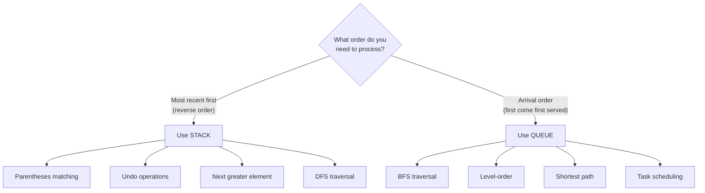

# Stacks & Queues: Order Matters

There's a category of problems where the solution clicks the moment you realize: "Oh, I need to process things in a specific order."

Parentheses matching? Stack. Level-order traversal? Queue. Next greater element? Monotonic stack.

**Stacks and queues aren't just data structures—they're thinking tools.** They tell you how to process data.

---

## Stack: Last In, First Out (LIFO)

Think of a stack of plates. You can only add or remove from the top.

```python
# Stack operations in Python (use list)
stack = []

stack.append(1)    # Push - O(1)
stack.append(2)
stack.append(3)

top = stack[-1]    # Peek - O(1) → 3
item = stack.pop() # Pop - O(1) → 3

is_empty = len(stack) == 0  # Check empty
```

### When to Use Stack

| Signal | Example |
|--------|---------|
| "Match opening/closing" | Parentheses, tags |
| "Most recent" matters | Undo, back button |
| "Process in reverse order" | Reverse string |
| "Next greater/smaller" | Stock prices, temperatures |
| "DFS traversal" | Tree, graph |
| "Expression evaluation" | Calculator |

---

## Queue: First In, First Out (FIFO)

Think of a line at a store. First person in line gets served first.

```python
from collections import deque

# Queue operations in Python (use deque for O(1))
queue = deque()

queue.append(1)     # Enqueue right - O(1)
queue.append(2)
queue.append(3)

front = queue[0]    # Peek front - O(1) → 1
item = queue.popleft()  # Dequeue - O(1) → 1

is_empty = len(queue) == 0
```

**Important:** Don't use `list.pop(0)` — it's O(n). Use `deque.popleft()` for O(1).

### When to Use Queue

| Signal | Example |
|--------|---------|
| "Process in order received" | Task scheduling |
| "Level by level" | BFS, level-order traversal |
| "Shortest path (unweighted)" | Maze, word ladder |
| "Sliding window max/min" | Monotonic deque |
| "Recent requests" | Rate limiting |

---

## The Essential Patterns

### Pattern 1: Matching Brackets

The classic stack problem. Opens go on stack, closes must match top.

```python
def is_valid(s):
    stack = []
    pairs = {')': '(', '}': '{', ']': '['}
    
    for char in s:
        if char in '({[':
            stack.append(char)
        elif char in ')}]':
            if not stack or stack[-1] != pairs[char]:
                return False
            stack.pop()
    
    return len(stack) == 0

# Examples:
# "()" → True
# "()[]{}" → True
# "(]" → False
# "([)]" → False
```

### Pattern 2: Monotonic Stack

**Key insight:** Maintain a stack where elements are in sorted order. Use when finding "next greater" or "next smaller."

```python
# Next Greater Element
def next_greater(nums):
    n = len(nums)
    result = [-1] * n
    stack = []  # Store indices, values are decreasing
    
    for i in range(n):
        # Pop all elements smaller than current
        while stack and nums[stack[-1]] < nums[i]:
            idx = stack.pop()
            result[idx] = nums[i]
        stack.append(i)
    
    return result

# Input: [2, 1, 2, 4, 3]
# Output: [4, 2, 4, -1, -1]
```

```python
# Daily Temperatures (days until warmer)
def daily_temperatures(temperatures):
    n = len(temperatures)
    result = [0] * n
    stack = []  # Store indices
    
    for i in range(n):
        while stack and temperatures[stack[-1]] < temperatures[i]:
            prev_idx = stack.pop()
            result[prev_idx] = i - prev_idx
        stack.append(i)
    
    return result
```

### Pattern 3: BFS with Queue

Level-by-level processing. Essential for shortest paths and tree traversals.

```python
from collections import deque

# Level Order Traversal
def level_order(root):
    if not root:
        return []
    
    result = []
    queue = deque([root])
    
    while queue:
        level_size = len(queue)
        current_level = []
        
        for _ in range(level_size):
            node = queue.popleft()
            current_level.append(node.val)
            
            if node.left:
                queue.append(node.left)
            if node.right:
                queue.append(node.right)
        
        result.append(current_level)
    
    return result
```

```python
# Shortest Path in Unweighted Graph
def shortest_path(graph, start, end):
    if start == end:
        return 0
    
    visited = {start}
    queue = deque([(start, 0)])  # (node, distance)
    
    while queue:
        node, dist = queue.popleft()
        
        for neighbor in graph[node]:
            if neighbor == end:
                return dist + 1
            if neighbor not in visited:
                visited.add(neighbor)
                queue.append((neighbor, dist + 1))
    
    return -1  # No path
```

### Pattern 4: Stack for Expression Evaluation

```python
# Basic Calculator (with +, -, parentheses)
def calculate(s):
    stack = []
    num = 0
    sign = 1
    result = 0
    
    for char in s:
        if char.isdigit():
            num = num * 10 + int(char)
        elif char == '+':
            result += sign * num
            num = 0
            sign = 1
        elif char == '-':
            result += sign * num
            num = 0
            sign = -1
        elif char == '(':
            stack.append(result)
            stack.append(sign)
            result = 0
            sign = 1
        elif char == ')':
            result += sign * num
            num = 0
            result *= stack.pop()  # sign
            result += stack.pop()  # previous result
    
    return result + sign * num
```

---

## Classic Interview Problems

### Problem 1: Min Stack

```python
class MinStack:
    def __init__(self):
        self.stack = []
        self.min_stack = []
    
    def push(self, val):
        self.stack.append(val)
        # Track minimum at each level
        if not self.min_stack or val <= self.min_stack[-1]:
            self.min_stack.append(val)
    
    def pop(self):
        val = self.stack.pop()
        if val == self.min_stack[-1]:
            self.min_stack.pop()
    
    def top(self):
        return self.stack[-1]
    
    def getMin(self):
        return self.min_stack[-1]
```

### Problem 2: Implement Queue using Stacks

```python
class MyQueue:
    def __init__(self):
        self.in_stack = []
        self.out_stack = []
    
    def push(self, x):
        self.in_stack.append(x)
    
    def pop(self):
        self._transfer()
        return self.out_stack.pop()
    
    def peek(self):
        self._transfer()
        return self.out_stack[-1]
    
    def empty(self):
        return not self.in_stack and not self.out_stack
    
    def _transfer(self):
        if not self.out_stack:
            while self.in_stack:
                self.out_stack.append(self.in_stack.pop())
```

### Problem 3: Largest Rectangle in Histogram

```python
def largest_rectangle_area(heights):
    stack = []  # Indices of increasing heights
    max_area = 0
    
    for i, h in enumerate(heights + [0]):  # Add 0 to flush stack
        while stack and heights[stack[-1]] > h:
            height = heights[stack.pop()]
            width = i if not stack else i - stack[-1] - 1
            max_area = max(max_area, height * width)
        stack.append(i)
    
    return max_area
```

### Problem 4: Sliding Window Maximum

```python
from collections import deque

def max_sliding_window(nums, k):
    result = []
    dq = deque()  # Store indices, values are decreasing
    
    for i, num in enumerate(nums):
        # Remove indices outside window
        while dq and dq[0] < i - k + 1:
            dq.popleft()
        
        # Remove smaller elements (they'll never be max)
        while dq and nums[dq[-1]] < num:
            dq.pop()
        
        dq.append(i)
        
        # Window is complete
        if i >= k - 1:
            result.append(nums[dq[0]])
    
    return result
```

---

## Stack vs Queue Decision Guide



---

## Practice Problems

### Stack - Easy

| Problem | Pattern | Company |
|---------|---------|---------|
| Valid Parentheses | Matching | Google, Amazon |
| Min Stack | Two Stacks | Amazon, Microsoft |
| Implement Queue using Stacks | Stack Ops | Apple |

### Stack - Medium

| Problem | Pattern | Company |
|---------|---------|---------|
| Daily Temperatures | Monotonic | Google |
| Evaluate Reverse Polish | Expression | Meta |
| Decode String | Nested Structure | Google |
| Asteroid Collision | Simulation | Amazon |

### Stack - Hard

| Problem | Pattern | Company |
|---------|---------|---------|
| Largest Rectangle | Monotonic | Google, Amazon |
| Basic Calculator | Expression | Meta |
| Trapping Rain Water | Monotonic | Google |

### Queue - Medium

| Problem | Pattern | Company |
|---------|---------|---------|
| Number of Islands | BFS | Amazon, Google |
| Rotting Oranges | Multi-source BFS | Amazon |
| Sliding Window Maximum | Monotonic Deque | Google |
| Open the Lock | BFS | Google |

---

## Common Mistakes

### 1. Using List for Queue

```python
# Wrong - O(n) for pop(0)
queue = []
queue.append(1)
item = queue.pop(0)  # O(n)!

# Right - O(1) with deque
from collections import deque
queue = deque()
queue.append(1)
item = queue.popleft()  # O(1)
```

### 2. Forgetting Empty Check

```python
# Wrong - crashes on empty
top = stack[-1]  # IndexError if empty!

# Right
if stack:
    top = stack[-1]
```

### 3. Wrong Order in Monotonic Stack

```python
# For "next greater" - pop smaller elements
while stack and nums[stack[-1]] < nums[i]:  # <, not >

# For "next smaller" - pop larger elements  
while stack and nums[stack[-1]] > nums[i]:  # >, not <
```

---

## Key Takeaways

1. **Stack = LIFO, Queue = FIFO.** The order determines which to use.

2. **Matching problems → Stack.** Parentheses, tags, nested structures.

3. **Level-by-level → Queue.** BFS, shortest path, level order.

4. **Next greater/smaller → Monotonic Stack.** One of the most powerful patterns.

5. **Use `deque` for queues** — `list.pop(0)` is O(n), `deque.popleft()` is O(1).

---

## What's Next?

Trees combine many concepts including stacks (DFS) and queues (BFS):

👉 [Trees →](./trees)
