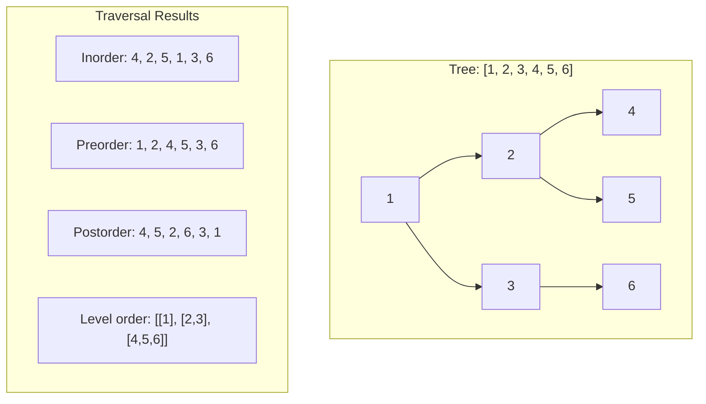

import { LanguageSelector, TimeEstimate, ConfidenceBuilder, DifficultyBadge } from '@site/src/components/interview-guide';
import { CodeTabs } from '@site/src/components/design-patterns/CodeTabs';
import TabItem from '@theme/TabItem';

# Trees: The Heart of Technical Interviews

Trees appear in roughly 25% of all coding interviews. They test recursion, pointer manipulation, and your ability to think hierarchically.

When I first encountered tree problems, I struggled with the recursive nature. I'd try to trace through every recursive call in my head and get hopelessly lost. The breakthrough came when I stopped trying to trace everything and instead **trusted the pattern**: solve for the current node, let recursion handle the rest.

The moment this clicked—probably during my 50th attempt at "Maximum Depth"—tree problems went from terrifying to my favorite category.

**Trees are where recursion finally makes sense.** Once you internalize the pattern, you'll see it everywhere.

<LanguageSelector />

<TimeEstimate
  learnTime="40-50 minutes"
  practiceTime="4-5 hours"
  masteryTime="15-20 problems"
  interviewFrequency="70%"
  difficultyRange="Easy to Hard"
  prerequisites="Recursion, Stacks & Queues"
/>

---

## Tree Fundamentals

### Basic Terminology

```
        1          ← Root (level 0, depth 0)
       / \
      2   3        ← Level 1, depth 1
     / \   \
    4   5   6      ← Level 2, depth 2 (leaves)
```

| Term | Definition |
|------|------------|
| **Root** | Top node (no parent) |
| **Leaf** | Node with no children |
| **Height** | Longest path from root to any leaf (tree property) |
| **Depth** | Distance from root to a specific node (node property) |
| **Binary tree** | Each node has at most 2 children |
| **BST** | Binary Search Tree: left < node < right |

### Node Structure

<CodeTabs>
<TabItem value="python" label="Python">

```python
class TreeNode:
    def __init__(self, val: int = 0, 
                 left: 'TreeNode | None' = None, 
                 right: 'TreeNode | None' = None):
        self.val = val
        self.left = left
        self.right = right
```

</TabItem>
<TabItem value="typescript" label="TypeScript">

```typescript
class TreeNode {
  val: number;
  left: TreeNode | null;
  right: TreeNode | null;

  constructor(
    val: number = 0,
    left: TreeNode | null = null,
    right: TreeNode | null = null
  ) {
    this.val = val;
    this.left = left;
    this.right = right;
  }
}
```

</TabItem>
<TabItem value="go" label="Go">

```go
type TreeNode struct {
    Val   int
    Left  *TreeNode
    Right *TreeNode
}
```

</TabItem>
<TabItem value="java" label="Java">

```java
public class TreeNode {
    int val;
    TreeNode left;
    TreeNode right;
    
    TreeNode() {}
    TreeNode(int val) { this.val = val; }
    TreeNode(int val, TreeNode left, TreeNode right) {
        this.val = val;
        this.left = left;
        this.right = right;
    }
}
```

</TabItem>
<TabItem value="cpp" label="C++">

```cpp
struct TreeNode {
    int val;
    TreeNode* left;
    TreeNode* right;
    
    TreeNode() : val(0), left(nullptr), right(nullptr) {}
    TreeNode(int x) : val(x), left(nullptr), right(nullptr) {}
    TreeNode(int x, TreeNode* left, TreeNode* right) 
        : val(x), left(left), right(right) {}
};
```

</TabItem>
<TabItem value="c" label="C">

```c
typedef struct TreeNode {
    int val;
    struct TreeNode* left;
    struct TreeNode* right;
} TreeNode;

TreeNode* createNode(int val) {
    TreeNode* node = (TreeNode*)malloc(sizeof(TreeNode));
    node->val = val;
    node->left = NULL;
    node->right = NULL;
    return node;
}
```

</TabItem>
<TabItem value="csharp" label="C#">

```csharp
public class TreeNode {
    public int Val;
    public TreeNode? Left;
    public TreeNode? Right;

    public TreeNode(int val = 0, TreeNode? left = null, TreeNode? right = null) {
        Val = val;
        Left = left;
        Right = right;
    }
}
```

</TabItem>
</CodeTabs>

---

## The Four Traversals

**This is the foundation of all tree problems.** Know these cold.



### Pattern 1: Inorder (Left → Node → Right)

**Key insight:** Inorder on BST gives sorted order.

<CodeTabs>
<TabItem value="python" label="Python">

```python
def inorder_recursive(root: TreeNode | None) -> list[int]:
    """Inorder: Left → Node → Right"""
    if not root:
        return []
    return inorder_recursive(root.left) + [root.val] + inorder_recursive(root.right)


def inorder_iterative(root: TreeNode | None) -> list[int]:
    """Iterative inorder using stack"""
    result: list[int] = []
    stack: list[TreeNode] = []
    curr = root
    
    while curr or stack:
        # Go left as far as possible
        while curr:
            stack.append(curr)
            curr = curr.left
        
        # Process node
        curr = stack.pop()
        result.append(curr.val)
        
        # Go right
        curr = curr.right
    
    return result
```

</TabItem>
<TabItem value="typescript" label="TypeScript">

```typescript
function inorderRecursive(root: TreeNode | null): number[] {
  if (!root) return [];
  return [
    ...inorderRecursive(root.left),
    root.val,
    ...inorderRecursive(root.right)
  ];
}

function inorderIterative(root: TreeNode | null): number[] {
  const result: number[] = [];
  const stack: TreeNode[] = [];
  let curr = root;

  while (curr || stack.length > 0) {
    while (curr) {
      stack.push(curr);
      curr = curr.left;
    }
    curr = stack.pop()!;
    result.push(curr.val);
    curr = curr.right;
  }

  return result;
}
```

</TabItem>
<TabItem value="go" label="Go">

```go
func inorderRecursive(root *TreeNode) []int {
    if root == nil {
        return []int{}
    }
    result := inorderRecursive(root.Left)
    result = append(result, root.Val)
    result = append(result, inorderRecursive(root.Right)...)
    return result
}

func inorderIterative(root *TreeNode) []int {
    result := []int{}
    stack := []*TreeNode{}
    curr := root
    
    for curr != nil || len(stack) > 0 {
        for curr != nil {
            stack = append(stack, curr)
            curr = curr.Left
        }
        curr = stack[len(stack)-1]
        stack = stack[:len(stack)-1]
        result = append(result, curr.Val)
        curr = curr.Right
    }
    
    return result
}
```

</TabItem>
<TabItem value="java" label="Java">

```java
public List<Integer> inorderRecursive(TreeNode root) {
    List<Integer> result = new ArrayList<>();
    if (root == null) return result;
    result.addAll(inorderRecursive(root.left));
    result.add(root.val);
    result.addAll(inorderRecursive(root.right));
    return result;
}

public List<Integer> inorderIterative(TreeNode root) {
    List<Integer> result = new ArrayList<>();
    Deque<TreeNode> stack = new ArrayDeque<>();
    TreeNode curr = root;
    
    while (curr != null || !stack.isEmpty()) {
        while (curr != null) {
            stack.push(curr);
            curr = curr.left;
        }
        curr = stack.pop();
        result.add(curr.val);
        curr = curr.right;
    }
    
    return result;
}
```

</TabItem>
<TabItem value="cpp" label="C++">

```cpp
vector<int> inorderRecursive(TreeNode* root) {
    if (!root) return {};
    vector<int> result = inorderRecursive(root->left);
    result.push_back(root->val);
    vector<int> right = inorderRecursive(root->right);
    result.insert(result.end(), right.begin(), right.end());
    return result;
}

vector<int> inorderIterative(TreeNode* root) {
    vector<int> result;
    stack<TreeNode*> stk;
    TreeNode* curr = root;
    
    while (curr || !stk.empty()) {
        while (curr) {
            stk.push(curr);
            curr = curr->left;
        }
        curr = stk.top();
        stk.pop();
        result.push_back(curr->val);
        curr = curr->right;
    }
    
    return result;
}
```

</TabItem>
<TabItem value="c" label="C">

```c
void inorderHelper(TreeNode* root, int* result, int* idx) {
    if (!root) return;
    inorderHelper(root->left, result, idx);
    result[(*idx)++] = root->val;
    inorderHelper(root->right, result, idx);
}

int* inorderTraversal(TreeNode* root, int* returnSize) {
    int* result = (int*)malloc(1000 * sizeof(int));
    *returnSize = 0;
    inorderHelper(root, result, returnSize);
    return result;
}
```

</TabItem>
<TabItem value="csharp" label="C#">

```csharp
public IList<int> InorderRecursive(TreeNode? root) {
    if (root == null) return new List<int>();
    var result = new List<int>();
    result.AddRange(InorderRecursive(root.Left));
    result.Add(root.Val);
    result.AddRange(InorderRecursive(root.Right));
    return result;
}

public IList<int> InorderIterative(TreeNode? root) {
    var result = new List<int>();
    var stack = new Stack<TreeNode>();
    var curr = root;
    
    while (curr != null || stack.Count > 0) {
        while (curr != null) {
            stack.Push(curr);
            curr = curr.Left;
        }
        curr = stack.Pop();
        result.Add(curr.Val);
        curr = curr.Right;
    }
    
    return result;
}
```

</TabItem>
</CodeTabs>

### Pattern 2: Level Order (BFS)

**Key insight:** Use a queue. Process level by level.

<CodeTabs>
<TabItem value="python" label="Python">

```python
from collections import deque

def level_order(root: TreeNode | None) -> list[list[int]]:
    """Level order traversal using BFS"""
    if not root:
        return []
    
    result: list[list[int]] = []
    queue: deque[TreeNode] = deque([root])
    
    while queue:
        level_size = len(queue)
        current_level: list[int] = []
        
        for _ in range(level_size):
            node = queue.popleft()
            current_level.append(node.val)
            
            if node.left:
                queue.append(node.left)
            if node.right:
                queue.append(node.right)
        
        result.append(current_level)
    
    return result
```

</TabItem>
<TabItem value="typescript" label="TypeScript">

```typescript
function levelOrder(root: TreeNode | null): number[][] {
  if (!root) return [];

  const result: number[][] = [];
  const queue: TreeNode[] = [root];

  while (queue.length > 0) {
    const levelSize = queue.length;
    const currentLevel: number[] = [];

    for (let i = 0; i < levelSize; i++) {
      const node = queue.shift()!;
      currentLevel.push(node.val);

      if (node.left) queue.push(node.left);
      if (node.right) queue.push(node.right);
    }

    result.push(currentLevel);
  }

  return result;
}
```

</TabItem>
<TabItem value="go" label="Go">

```go
func levelOrder(root *TreeNode) [][]int {
    if root == nil {
        return [][]int{}
    }
    
    result := [][]int{}
    queue := []*TreeNode{root}
    
    for len(queue) > 0 {
        levelSize := len(queue)
        currentLevel := []int{}
        
        for i := 0; i < levelSize; i++ {
            node := queue[0]
            queue = queue[1:]
            currentLevel = append(currentLevel, node.Val)
            
            if node.Left != nil {
                queue = append(queue, node.Left)
            }
            if node.Right != nil {
                queue = append(queue, node.Right)
            }
        }
        
        result = append(result, currentLevel)
    }
    
    return result
}
```

</TabItem>
<TabItem value="java" label="Java">

```java
public List<List<Integer>> levelOrder(TreeNode root) {
    List<List<Integer>> result = new ArrayList<>();
    if (root == null) return result;
    
    Queue<TreeNode> queue = new LinkedList<>();
    queue.offer(root);
    
    while (!queue.isEmpty()) {
        int levelSize = queue.size();
        List<Integer> currentLevel = new ArrayList<>();
        
        for (int i = 0; i < levelSize; i++) {
            TreeNode node = queue.poll();
            currentLevel.add(node.val);
            
            if (node.left != null) queue.offer(node.left);
            if (node.right != null) queue.offer(node.right);
        }
        
        result.add(currentLevel);
    }
    
    return result;
}
```

</TabItem>
<TabItem value="cpp" label="C++">

```cpp
vector<vector<int>> levelOrder(TreeNode* root) {
    vector<vector<int>> result;
    if (!root) return result;
    
    queue<TreeNode*> q;
    q.push(root);
    
    while (!q.empty()) {
        int levelSize = q.size();
        vector<int> currentLevel;
        
        for (int i = 0; i < levelSize; i++) {
            TreeNode* node = q.front();
            q.pop();
            currentLevel.push_back(node->val);
            
            if (node->left) q.push(node->left);
            if (node->right) q.push(node->right);
        }
        
        result.push_back(currentLevel);
    }
    
    return result;
}
```

</TabItem>
<TabItem value="c" label="C">

```c
// Level order in C requires queue implementation
// Simplified version using array as queue
int** levelOrder(TreeNode* root, int* returnSize, int** returnColumnSizes) {
    if (!root) {
        *returnSize = 0;
        return NULL;
    }
    
    TreeNode** queue = malloc(10000 * sizeof(TreeNode*));
    int front = 0, rear = 0;
    queue[rear++] = root;
    
    int** result = malloc(1000 * sizeof(int*));
    *returnColumnSizes = malloc(1000 * sizeof(int));
    *returnSize = 0;
    
    while (front < rear) {
        int levelSize = rear - front;
        result[*returnSize] = malloc(levelSize * sizeof(int));
        (*returnColumnSizes)[*returnSize] = levelSize;
        
        for (int i = 0; i < levelSize; i++) {
            TreeNode* node = queue[front++];
            result[*returnSize][i] = node->val;
            
            if (node->left) queue[rear++] = node->left;
            if (node->right) queue[rear++] = node->right;
        }
        (*returnSize)++;
    }
    
    free(queue);
    return result;
}
```

</TabItem>
<TabItem value="csharp" label="C#">

```csharp
public IList<IList<int>> LevelOrder(TreeNode? root) {
    var result = new List<IList<int>>();
    if (root == null) return result;
    
    var queue = new Queue<TreeNode>();
    queue.Enqueue(root);
    
    while (queue.Count > 0) {
        int levelSize = queue.Count;
        var currentLevel = new List<int>();
        
        for (int i = 0; i < levelSize; i++) {
            var node = queue.Dequeue();
            currentLevel.Add(node.Val);
            
            if (node.Left != null) queue.Enqueue(node.Left);
            if (node.Right != null) queue.Enqueue(node.Right);
        }
        
        result.Add(currentLevel);
    }
    
    return result;
}
```

</TabItem>
</CodeTabs>

---

## The Universal Recursive Pattern

**Most tree problems follow this template.** Memorize it.

```python
def solve(root):
    # 1. Base case: What to return for null/leaf?
    if not root:
        return base_value
    
    # 2. Recursive case: Solve for children
    left_result = solve(root.left)
    right_result = solve(root.right)
    
    # 3. Combine: How do results from children relate to current node?
    return combine(root.val, left_result, right_result)
```

<ConfidenceBuilder type="remember" title="Trust the Recursion">

**Don't trace every recursive call.** 

Trust that `solve(root.left)` correctly solves the left subtree. Trust that `solve(root.right)` correctly solves the right subtree. Your job is just to combine them correctly.

This mental shift is what separates "struggling with trees" from "trees are easy."

</ConfidenceBuilder>

### Example: Maximum Depth

<CodeTabs>
<TabItem value="python" label="Python">

```python
def max_depth(root: TreeNode | None) -> int:
    """
    Find the maximum depth of a binary tree.
    Time: O(n), Space: O(h) where h is height
    """
    # Base case
    if not root:
        return 0
    
    # Recursive case
    left_depth = max_depth(root.left)
    right_depth = max_depth(root.right)
    
    # Combine: depth is 1 + max of children
    return 1 + max(left_depth, right_depth)
```

</TabItem>
<TabItem value="typescript" label="TypeScript">

```typescript
function maxDepth(root: TreeNode | null): number {
  if (!root) return 0;
  
  const leftDepth = maxDepth(root.left);
  const rightDepth = maxDepth(root.right);
  
  return 1 + Math.max(leftDepth, rightDepth);
}
```

</TabItem>
<TabItem value="go" label="Go">

```go
func maxDepth(root *TreeNode) int {
    if root == nil {
        return 0
    }
    
    leftDepth := maxDepth(root.Left)
    rightDepth := maxDepth(root.Right)
    
    if leftDepth > rightDepth {
        return 1 + leftDepth
    }
    return 1 + rightDepth
}
```

</TabItem>
<TabItem value="java" label="Java">

```java
public int maxDepth(TreeNode root) {
    if (root == null) return 0;
    
    int leftDepth = maxDepth(root.left);
    int rightDepth = maxDepth(root.right);
    
    return 1 + Math.max(leftDepth, rightDepth);
}
```

</TabItem>
<TabItem value="cpp" label="C++">

```cpp
int maxDepth(TreeNode* root) {
    if (!root) return 0;
    
    int leftDepth = maxDepth(root->left);
    int rightDepth = maxDepth(root->right);
    
    return 1 + max(leftDepth, rightDepth);
}
```

</TabItem>
<TabItem value="c" label="C">

```c
int maxDepth(TreeNode* root) {
    if (!root) return 0;
    
    int leftDepth = maxDepth(root->left);
    int rightDepth = maxDepth(root->right);
    
    return 1 + (leftDepth > rightDepth ? leftDepth : rightDepth);
}
```

</TabItem>
<TabItem value="csharp" label="C#">

```csharp
public int MaxDepth(TreeNode? root) {
    if (root == null) return 0;
    
    int leftDepth = MaxDepth(root.Left);
    int rightDepth = MaxDepth(root.Right);
    
    return 1 + Math.Max(leftDepth, rightDepth);
}
```

</TabItem>
</CodeTabs>

---

## Binary Search Tree (BST) Operations

**BST Property:** For every node, all values in left subtree are smaller, all values in right subtree are larger.

### Validate BST

<CodeTabs>
<TabItem value="python" label="Python">

```python
def is_valid_bst(root: TreeNode | None, 
                 min_val: float = float('-inf'), 
                 max_val: float = float('inf')) -> bool:
    """
    Validate BST using bounds.
    Every node must be within (min_val, max_val).
    """
    if not root:
        return True
    
    # Check current node
    if root.val <= min_val or root.val >= max_val:
        return False
    
    # Left subtree: all values must be < root.val
    # Right subtree: all values must be > root.val
    return (is_valid_bst(root.left, min_val, root.val) and
            is_valid_bst(root.right, root.val, max_val))
```

</TabItem>
<TabItem value="typescript" label="TypeScript">

```typescript
function isValidBST(
  root: TreeNode | null,
  minVal: number = -Infinity,
  maxVal: number = Infinity
): boolean {
  if (!root) return true;
  
  if (root.val <= minVal || root.val >= maxVal) {
    return false;
  }
  
  return (
    isValidBST(root.left, minVal, root.val) &&
    isValidBST(root.right, root.val, maxVal)
  );
}
```

</TabItem>
<TabItem value="go" label="Go">

```go
func isValidBST(root *TreeNode) bool {
    return isValidBSTHelper(root, math.MinInt64, math.MaxInt64)
}

func isValidBSTHelper(root *TreeNode, minVal, maxVal int64) bool {
    if root == nil {
        return true
    }
    
    val := int64(root.Val)
    if val <= minVal || val >= maxVal {
        return false
    }
    
    return isValidBSTHelper(root.Left, minVal, val) &&
           isValidBSTHelper(root.Right, val, maxVal)
}
```

</TabItem>
<TabItem value="java" label="Java">

```java
public boolean isValidBST(TreeNode root) {
    return isValidBST(root, Long.MIN_VALUE, Long.MAX_VALUE);
}

private boolean isValidBST(TreeNode root, long minVal, long maxVal) {
    if (root == null) return true;
    
    if (root.val <= minVal || root.val >= maxVal) {
        return false;
    }
    
    return isValidBST(root.left, minVal, root.val) &&
           isValidBST(root.right, root.val, maxVal);
}
```

</TabItem>
<TabItem value="cpp" label="C++">

```cpp
bool isValidBST(TreeNode* root, long minVal = LONG_MIN, long maxVal = LONG_MAX) {
    if (!root) return true;
    
    if (root->val <= minVal || root->val >= maxVal) {
        return false;
    }
    
    return isValidBST(root->left, minVal, root->val) &&
           isValidBST(root->right, root->val, maxVal);
}
```

</TabItem>
<TabItem value="c" label="C">

```c
bool isValidBSTHelper(TreeNode* root, long minVal, long maxVal) {
    if (!root) return true;
    
    if (root->val <= minVal || root->val >= maxVal) {
        return false;
    }
    
    return isValidBSTHelper(root->left, minVal, root->val) &&
           isValidBSTHelper(root->right, root->val, maxVal);
}

bool isValidBST(TreeNode* root) {
    return isValidBSTHelper(root, LONG_MIN, LONG_MAX);
}
```

</TabItem>
<TabItem value="csharp" label="C#">

```csharp
public bool IsValidBST(TreeNode? root) {
    return IsValidBST(root, long.MinValue, long.MaxValue);
}

private bool IsValidBST(TreeNode? root, long minVal, long maxVal) {
    if (root == null) return true;
    
    if (root.Val <= minVal || root.Val >= maxVal) {
        return false;
    }
    
    return IsValidBST(root.Left, minVal, root.Val) &&
           IsValidBST(root.Right, root.Val, maxVal);
}
```

</TabItem>
</CodeTabs>

---

## 🎯 Pattern Triggers

| If the problem mentions... | Pattern to use |
|---------------------------|----------------|
| "Sorted order", "kth smallest/largest" | **Inorder traversal** (BST) |
| "Level by level", "depth", "closest to root" | **Level order (BFS)** |
| "All paths", "path sum", "root to leaf" | **DFS with path tracking** |
| "Valid BST", "range" | **Bounds validation** |
| "Serialize", "copy" | **Preorder** |
| "Delete", "bottom-up" | **Postorder** |

---

## 💬 How to Communicate This in Interviews

**When given a tree problem, say:**

> "This is a tree problem, so I'll think about whether DFS or BFS is more appropriate. Since [reason], I'll use [DFS/BFS]..."

**Before coding:**
> "I'll use the standard recursive pattern: check the base case for null, recursively solve for left and right subtrees, then combine the results."

**When explaining your approach:**
> "I'm using inorder traversal here because for a BST, inorder gives us the elements in sorted order—that's exactly what we need."

**When debugging:**
> "Let me trace through with a small example: a tree with nodes [1,2,3]..."

---

## 🏋️ Practice Problems

### Warm-Up (Build Confidence)

| Problem | Difficulty | Time | Pattern |
|---------|------------|------|---------|
| [Maximum Depth of Binary Tree](https://leetcode.com/problems/maximum-depth-of-binary-tree/) | <DifficultyBadge level="easy" /> | 10 min | Recursive |
| [Same Tree](https://leetcode.com/problems/same-tree/) | <DifficultyBadge level="easy" /> | 10 min | Recursive |
| [Invert Binary Tree](https://leetcode.com/problems/invert-binary-tree/) | <DifficultyBadge level="easy" /> | 10 min | Recursive |
| [Path Sum](https://leetcode.com/problems/path-sum/) | <DifficultyBadge level="easy" /> | 15 min | DFS |

### Core Practice (Must Do)

| Problem | Difficulty | Companies | Pattern |
|---------|------------|-----------|---------|
| [Validate BST](https://leetcode.com/problems/validate-binary-search-tree/) | <DifficultyBadge level="medium" /> | Amazon, Meta, Microsoft | Bounds |
| [Lowest Common Ancestor BST](https://leetcode.com/problems/lowest-common-ancestor-of-a-binary-search-tree/) | <DifficultyBadge level="medium" /> | Meta, Amazon, Google | BST property |
| [Lowest Common Ancestor BT](https://leetcode.com/problems/lowest-common-ancestor-of-a-binary-tree/) | <DifficultyBadge level="medium" /> | Meta, Amazon, Google | Recursive |
| [Binary Tree Level Order](https://leetcode.com/problems/binary-tree-level-order-traversal/) | <DifficultyBadge level="medium" /> | Amazon, Meta, Microsoft | BFS |
| [Construct from Preorder/Inorder](https://leetcode.com/problems/construct-binary-tree-from-preorder-and-inorder-traversal/) | <DifficultyBadge level="medium" /> | Google, Amazon, Meta | Divide & conquer |
| [Kth Smallest in BST](https://leetcode.com/problems/kth-smallest-element-in-a-bst/) | <DifficultyBadge level="medium" /> | Amazon, Meta, Google | Inorder |

### Challenge (For Mastery)

| Problem | Difficulty | Companies | Why It's Hard |
|---------|------------|-----------|---------------|
| [Serialize/Deserialize Binary Tree](https://leetcode.com/problems/serialize-and-deserialize-binary-tree/) | <DifficultyBadge level="hard" /> | Meta, Google, Amazon | Complex reconstruction |
| [Binary Tree Maximum Path Sum](https://leetcode.com/problems/binary-tree-maximum-path-sum/) | <DifficultyBadge level="hard" /> | Meta, Google, Amazon | Path can go through root |
| [Recover Binary Search Tree](https://leetcode.com/problems/recover-binary-search-tree/) | <DifficultyBadge level="hard" /> | Amazon, Microsoft | Find swapped nodes |

---

## Key Takeaways

1. **Four traversals:** Inorder, Preorder, Postorder, Level order. Know them cold.

2. **Universal pattern:** Base case → recurse left/right → combine results.

3. **Trust the recursion.** Don't trace every call. Solve for the current node.

4. **BST = sorted order.** Inorder traversal gives elements in sorted order.

5. **DFS for paths, BFS for levels.** Choose based on what the problem needs.

<ConfidenceBuilder type="youve-got-this">

**Trees are pattern recognition.**

Once you've solved 10-15 tree problems, you'll start to see that they're all variations of the same few patterns. The recursive structure becomes second nature.

</ConfidenceBuilder>

---

## What's Next?

Heaps and priority queues give you efficient access to min/max elements—essential for "top K" problems:

**Next up:** [Heaps & Priority Queues](/docs/interview-guide/coding/data-structures/heaps-priority-queues) — Finding the K largest/smallest
