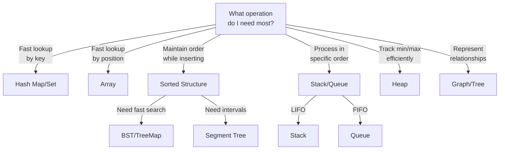

# Choosing the Right Data Structure

Early in my interview prep, I had a realization that changed everything: **most coding problems become obvious once you pick the right data structure.**

A problem that seems impossible with an array becomes trivial with a hash map. A question that looks like O(n²) drops to O(n) with the right choice. The hard part isn't writing the code—it's knowing which tool to reach for.

**The data structure you choose determines everything: your algorithm, your complexity, and whether you pass the interview.**

---

## The Decision Framework

When you see a problem, ask these questions in order:



---

## When to Use Each Data Structure

### Arrays

**Use when:**
- You need fast access by index
- Order matters and won't change
- You're doing sequential processing
- You need cache-friendly memory access

**Complexity:**
- Access by index: O(1)
- Search: O(n) unsorted, O(log n) sorted
- Insert/Delete at end: O(1)
- Insert/Delete at beginning: O(n)

**Interview signals:**
- "Given an array..."
- "Find the subarray..."
- "Sliding window..."
- "Two pointers..."

```python
# Good array use: sequential access
def find_max_subarray(nums):
    current_max = global_max = nums[0]
    for num in nums[1:]:
        current_max = max(num, current_max + num)
        global_max = max(global_max, current_max)
    return global_max
```

---

### Hash Maps (Dictionaries)

**Use when:**
- You need O(1) lookup by key
- You're counting occurrences
- You need to check for existence
- You want to eliminate nested loops

**Complexity:**
- Insert: O(1) average
- Lookup: O(1) average
- Delete: O(1) average
- Space: O(n)

**Interview signals:**
- "Find if exists..."
- "Count occurrences..."
- "Two Sum" and variants
- Need to reduce O(n²) to O(n)

```python
# Classic hash map pattern: Two Sum
def two_sum(nums, target):
    seen = {}  # value -> index
    for i, num in enumerate(nums):
        complement = target - num
        if complement in seen:
            return [seen[complement], i]
        seen[num] = i
    return []
```

**This is the most important data structure in interviews.** When you need to look something up quickly, reach for a hash map.

---

### Hash Sets

**Use when:**
- You need O(1) existence check
- You need unique elements
- You're checking for duplicates
- You need fast membership testing

```python
# Hash set for duplicate detection
def contains_duplicate(nums):
    seen = set()
    for num in nums:
        if num in seen:
            return True
        seen.add(num)
    return False
```

---

### Stacks (LIFO)

**Use when:**
- You need Last-In-First-Out order
- You're matching parentheses
- You're doing DFS traversal
- You need to track "most recent"

**Interview signals:**
- "Valid parentheses"
- "Next greater element"
- "Evaluate expression"
- "Undo/redo operations"

```python
# Stack for valid parentheses
def is_valid(s):
    stack = []
    pairs = {')': '(', '}': '{', ']': '['}
    
    for char in s:
        if char in '({[':
            stack.append(char)
        elif char in ')}]':
            if not stack or stack[-1] != pairs[char]:
                return False
            stack.pop()
    
    return len(stack) == 0
```

---

### Queues (FIFO)

**Use when:**
- You need First-In-First-Out order
- You're doing BFS traversal
- You're processing in arrival order
- You're implementing a cache (LRU)

**Interview signals:**
- "Level order traversal"
- "Shortest path in unweighted graph"
- "Process in order received"

```python
from collections import deque

# Queue for BFS
def bfs(graph, start):
    visited = {start}
    queue = deque([start])
    
    while queue:
        node = queue.popleft()
        for neighbor in graph[node]:
            if neighbor not in visited:
                visited.add(neighbor)
                queue.append(neighbor)
    
    return visited
```

---

### Heaps (Priority Queues)

**Use when:**
- You need the min or max repeatedly
- You're finding "top K" or "kth largest"
- You're merging sorted lists
- You need a running median

**Complexity:**
- Insert: O(log n)
- Get min/max: O(1)
- Extract min/max: O(log n)

**Interview signals:**
- "Find the kth largest..."
- "Merge k sorted..."
- "Top k frequent..."
- "Running median"

```python
import heapq

# Heap for kth largest
def find_kth_largest(nums, k):
    # Use min heap of size k
    heap = nums[:k]
    heapq.heapify(heap)
    
    for num in nums[k:]:
        if num > heap[0]:
            heapq.heapreplace(heap, num)
    
    return heap[0]
```

---

### Trees (Binary Trees, BSTs)

**Use when:**
- You need hierarchical structure
- You need sorted data with fast operations
- You're working with file systems or org charts
- You need range queries

**BST Complexity:**
- Search: O(log n) average, O(n) worst
- Insert: O(log n) average
- Delete: O(log n) average

**Interview signals:**
- "Given a binary tree..."
- "Sorted order with fast insert"
- "Find nodes in range"
- "Lowest common ancestor"

```python
# Tree traversal patterns
def inorder(root):
    if not root:
        return []
    return inorder(root.left) + [root.val] + inorder(root.right)

def preorder(root):
    if not root:
        return []
    return [root.val] + preorder(root.left) + preorder(root.right)

def postorder(root):
    if not root:
        return []
    return postorder(root.left) + postorder(root.right) + [root.val]
```

---

### Tries (Prefix Trees)

**Use when:**
- You're doing autocomplete
- You're searching for prefixes
- You need fast string operations
- You're implementing a dictionary

**Interview signals:**
- "Implement autocomplete"
- "Search for prefix"
- "Word search in grid"

```python
class TrieNode:
    def __init__(self):
        self.children = {}
        self.is_word = False

class Trie:
    def __init__(self):
        self.root = TrieNode()
    
    def insert(self, word):
        node = self.root
        for char in word:
            if char not in node.children:
                node.children[char] = TrieNode()
            node = node.children[char]
        node.is_word = True
    
    def search_prefix(self, prefix):
        node = self.root
        for char in prefix:
            if char not in node.children:
                return None
            node = node.children[char]
        return node
```

---

### Graphs

**Use when:**
- You have relationships between entities
- You need shortest paths
- You're detecting cycles
- You're doing dependency resolution

**Representation:**
- Adjacency list: Good for sparse graphs
- Adjacency matrix: Good for dense graphs, O(1) edge check

**Interview signals:**
- "Network of nodes"
- "Course prerequisites"
- "Social connections"
- "Islands in a grid"

```python
# Graph representations
# Adjacency list (most common)
graph = {
    'A': ['B', 'C'],
    'B': ['A', 'D'],
    'C': ['A', 'D'],
    'D': ['B', 'C']
}

# Adjacency matrix
#     A  B  C  D
# A [[0, 1, 1, 0],
# B  [1, 0, 0, 1],
# C  [1, 0, 0, 1],
# D  [0, 1, 1, 0]]
```

---

### Union-Find (Disjoint Set)

**Use when:**
- You need to group elements
- You're detecting cycles in undirected graphs
- You're checking if nodes are connected
- You need dynamic connectivity

```python
class UnionFind:
    def __init__(self, n):
        self.parent = list(range(n))
        self.rank = [0] * n
    
    def find(self, x):
        if self.parent[x] != x:
            self.parent[x] = self.find(self.parent[x])
        return self.parent[x]
    
    def union(self, x, y):
        px, py = self.find(x), self.find(y)
        if px == py:
            return False
        if self.rank[px] < self.rank[py]:
            px, py = py, px
        self.parent[py] = px
        if self.rank[px] == self.rank[py]:
            self.rank[px] += 1
        return True
```

---

## Quick Reference Table

| Need | Use | Time Complexity |
|------|-----|-----------------|
| Fast lookup by key | Hash Map | O(1) |
| Fast lookup by index | Array | O(1) |
| Track min/max | Heap | O(log n) insert, O(1) peek |
| LIFO processing | Stack | O(1) |
| FIFO processing | Queue | O(1) |
| Sorted data + fast ops | BST/TreeMap | O(log n) |
| Prefix operations | Trie | O(m) where m = string length |
| Relationships | Graph | Varies by algorithm |
| Connected components | Union-Find | ~O(1) amortized |

---

## Common Conversions

When your current approach is too slow, try these conversions:

| From | To | What Changes |
|------|-----|--------------|
| O(n²) nested loops | O(n) with hash map | Trade space for time |
| O(n) search | O(log n) with sorted array + binary search | Requires sorted data |
| O(n) repeated min/max | O(log n) with heap | Better for streaming data |
| O(n) string operations | O(m) with trie | Better for multiple queries |

---

## Interview Decision Patterns

**"Given an array, find two numbers that..."**
→ Hash map for O(n)

**"Find the kth largest/smallest..."**
→ Heap of size k

**"Shortest path in unweighted graph..."**
→ BFS with queue

**"Detect cycle in graph..."**
→ DFS with visited set, or Union-Find

**"Autocomplete/prefix search..."**
→ Trie

**"Level order traversal..."**
→ BFS with queue

**"Match parentheses/brackets..."**
→ Stack

---

## Key Takeaways

1. **Hash maps are your best friend.** They convert O(n²) to O(n) more often than any other structure.

2. **Heaps are for "top K" problems.** Whenever you need repeated min/max, think heap.

3. **Stacks are for matching problems.** Parentheses, expressions, "next greater element."

4. **Queues are for BFS.** Level-by-level traversal, shortest path in unweighted graphs.

5. **The constraint often hints at the structure.** Small n? Maybe O(n²) is fine. Large n? You need O(n) or O(n log n).

---

## What's Next?

Now that you know which data structure to reach for, learn the framework for solving any coding problem:

👉 [Problem-Solving Framework →](./problem-solving-framework)
