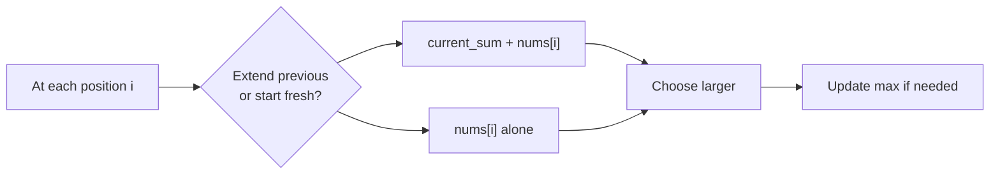

import { LanguageSelector, TimeEstimate, ConfidenceBuilder, DifficultyBadge } from '@site/src/components/interview-guide';
import { CodeTabs } from '@site/src/components/design-patterns/CodeTabs';
import TabItem from '@theme/TabItem';

# Kadane's Algorithm: Maximum Subarray

Kadane's algorithm finds the maximum sum contiguous subarray in O(n) time. It's one of the most elegant examples of dynamic programming.

<LanguageSelector />

<TimeEstimate
  learnTime="20-25 minutes"
  practiceTime="2-3 hours"
  masteryTime="5-6 problems"
  interviewFrequency="15%"
  difficultyRange="Medium"
  prerequisites="Arrays, DP basics"
/>

---

## The Core Insight



**The question at each index:** Should I extend the previous subarray, or start a new one here?

```
If current_sum + nums[i] < nums[i]:
  → Previous subarray is dragging us down
  → Start fresh from nums[i]
  
If current_sum + nums[i] >= nums[i]:
  → Previous subarray is helping (or neutral)
  → Extend it
```

---

## Basic Kadane's Algorithm

<CodeTabs>
<TabItem value="python" label="Python">

```python
def max_subarray(nums: list[int]) -> int:
    """
    Find maximum sum of contiguous subarray using Kadane's algorithm.
    Time: O(n), Space: O(1)
    
    Key insight: At each position, either extend previous subarray
    or start fresh. Choose whichever gives larger sum.
    """
    if not nums:
        return 0
    
    max_sum = nums[0]
    current_sum = nums[0]
    
    for i in range(1, len(nums)):
        # Either extend current subarray or start new one
        current_sum = max(nums[i], current_sum + nums[i])
        max_sum = max(max_sum, current_sum)
    
    return max_sum


# Example walkthrough:
# nums = [-2, 1, -3, 4, -1, 2, 1, -5, 4]
#
# i=0: current=-2, max=-2
# i=1: current=max(1, -2+1)=1, max=1
# i=2: current=max(-3, 1-3)=-2, max=1
# i=3: current=max(4, -2+4)=4, max=4
# i=4: current=max(-1, 4-1)=3, max=4
# i=5: current=max(2, 3+2)=5, max=5
# i=6: current=max(1, 5+1)=6, max=6  ← answer
# i=7: current=max(-5, 6-5)=1, max=6
# i=8: current=max(4, 1+4)=5, max=6
#
# Maximum subarray: [4, -1, 2, 1] = 6
```

</TabItem>
<TabItem value="typescript" label="TypeScript">

```typescript
function maxSubarray(nums: number[]): number {
  if (nums.length === 0) return 0;

  let maxSum = nums[0];
  let currentSum = nums[0];

  for (let i = 1; i < nums.length; i++) {
    currentSum = Math.max(nums[i], currentSum + nums[i]);
    maxSum = Math.max(maxSum, currentSum);
  }

  return maxSum;
}
```

</TabItem>
<TabItem value="go" label="Go">

```go
func maxSubarray(nums []int) int {
    if len(nums) == 0 {
        return 0
    }
    
    maxSum := nums[0]
    currentSum := nums[0]
    
    for i := 1; i < len(nums); i++ {
        if nums[i] > currentSum+nums[i] {
            currentSum = nums[i]
        } else {
            currentSum = currentSum + nums[i]
        }
        
        if currentSum > maxSum {
            maxSum = currentSum
        }
    }
    
    return maxSum
}
```

</TabItem>
<TabItem value="java" label="Java">

```java
public int maxSubarray(int[] nums) {
    if (nums.length == 0) return 0;
    
    int maxSum = nums[0];
    int currentSum = nums[0];
    
    for (int i = 1; i < nums.length; i++) {
        currentSum = Math.max(nums[i], currentSum + nums[i]);
        maxSum = Math.max(maxSum, currentSum);
    }
    
    return maxSum;
}
```

</TabItem>
<TabItem value="cpp" label="C++">

```cpp
int maxSubarray(vector<int>& nums) {
    if (nums.empty()) return 0;
    
    int maxSum = nums[0];
    int currentSum = nums[0];
    
    for (int i = 1; i < nums.size(); i++) {
        currentSum = max(nums[i], currentSum + nums[i]);
        maxSum = max(maxSum, currentSum);
    }
    
    return maxSum;
}
```

</TabItem>
<TabItem value="csharp" label="C#">

```csharp
public int MaxSubarray(int[] nums) {
    if (nums.Length == 0) return 0;
    
    int maxSum = nums[0];
    int currentSum = nums[0];
    
    for (int i = 1; i < nums.Length; i++) {
        currentSum = Math.Max(nums[i], currentSum + nums[i]);
        maxSum = Math.Max(maxSum, currentSum);
    }
    
    return maxSum;
}
```

</TabItem>
</CodeTabs>

---

## Finding the Subarray Indices

Often you need to return the actual subarray, not just the sum.

<CodeTabs>
<TabItem value="python" label="Python">

```python
def max_subarray_with_indices(nums: list[int]) -> tuple[int, int, int]:
    """
    Return (max_sum, start_index, end_index) of maximum subarray.
    Time: O(n), Space: O(1)
    """
    if not nums:
        return 0, -1, -1
    
    max_sum = nums[0]
    current_sum = nums[0]
    
    start = end = 0
    temp_start = 0  # Tracks start of current candidate
    
    for i in range(1, len(nums)):
        # Start fresh?
        if nums[i] > current_sum + nums[i]:
            current_sum = nums[i]
            temp_start = i
        else:
            current_sum = current_sum + nums[i]
        
        # Update max and indices
        if current_sum > max_sum:
            max_sum = current_sum
            start = temp_start
            end = i
    
    return max_sum, start, end


# Example:
# nums = [-2, 1, -3, 4, -1, 2, 1, -5, 4]
# Returns: (6, 3, 6) → subarray is nums[3:7] = [4, -1, 2, 1]
```

</TabItem>
<TabItem value="typescript" label="TypeScript">

```typescript
function maxSubarrayWithIndices(nums: number[]): [number, number, number] {
  if (nums.length === 0) return [0, -1, -1];

  let maxSum = nums[0];
  let currentSum = nums[0];
  let start = 0,
    end = 0,
    tempStart = 0;

  for (let i = 1; i < nums.length; i++) {
    if (nums[i] > currentSum + nums[i]) {
      currentSum = nums[i];
      tempStart = i;
    } else {
      currentSum = currentSum + nums[i];
    }

    if (currentSum > maxSum) {
      maxSum = currentSum;
      start = tempStart;
      end = i;
    }
  }

  return [maxSum, start, end];
}
```

</TabItem>
<TabItem value="go" label="Go">

```go
func maxSubarrayWithIndices(nums []int) (int, int, int) {
    if len(nums) == 0 {
        return 0, -1, -1
    }
    
    maxSum := nums[0]
    currentSum := nums[0]
    start, end, tempStart := 0, 0, 0
    
    for i := 1; i < len(nums); i++ {
        if nums[i] > currentSum+nums[i] {
            currentSum = nums[i]
            tempStart = i
        } else {
            currentSum = currentSum + nums[i]
        }
        
        if currentSum > maxSum {
            maxSum = currentSum
            start = tempStart
            end = i
        }
    }
    
    return maxSum, start, end
}
```

</TabItem>
<TabItem value="java" label="Java">

```java
public int[] maxSubarrayWithIndices(int[] nums) {
    if (nums.length == 0) return new int[]{0, -1, -1};
    
    int maxSum = nums[0];
    int currentSum = nums[0];
    int start = 0, end = 0, tempStart = 0;
    
    for (int i = 1; i < nums.length; i++) {
        if (nums[i] > currentSum + nums[i]) {
            currentSum = nums[i];
            tempStart = i;
        } else {
            currentSum = currentSum + nums[i];
        }
        
        if (currentSum > maxSum) {
            maxSum = currentSum;
            start = tempStart;
            end = i;
        }
    }
    
    return new int[]{maxSum, start, end};
}
```

</TabItem>
<TabItem value="cpp" label="C++">

```cpp
tuple<int, int, int> maxSubarrayWithIndices(vector<int>& nums) {
    if (nums.empty()) return {0, -1, -1};
    
    int maxSum = nums[0];
    int currentSum = nums[0];
    int start = 0, end = 0, tempStart = 0;
    
    for (int i = 1; i < nums.size(); i++) {
        if (nums[i] > currentSum + nums[i]) {
            currentSum = nums[i];
            tempStart = i;
        } else {
            currentSum = currentSum + nums[i];
        }
        
        if (currentSum > maxSum) {
            maxSum = currentSum;
            start = tempStart;
            end = i;
        }
    }
    
    return {maxSum, start, end};
}
```

</TabItem>
<TabItem value="csharp" label="C#">

```csharp
public (int sum, int start, int end) MaxSubarrayWithIndices(int[] nums) {
    if (nums.Length == 0) return (0, -1, -1);
    
    int maxSum = nums[0];
    int currentSum = nums[0];
    int start = 0, end = 0, tempStart = 0;
    
    for (int i = 1; i < nums.Length; i++) {
        if (nums[i] > currentSum + nums[i]) {
            currentSum = nums[i];
            tempStart = i;
        } else {
            currentSum = currentSum + nums[i];
        }
        
        if (currentSum > maxSum) {
            maxSum = currentSum;
            start = tempStart;
            end = i;
        }
    }
    
    return (maxSum, start, end);
}
```

</TabItem>
</CodeTabs>

---

## Maximum Circular Subarray

The subarray can wrap around the end of the array.

<CodeTabs>
<TabItem value="python" label="Python">

```python
def max_subarray_circular(nums: list[int]) -> int:
    """
    Maximum sum subarray in a circular array.
    
    Key insight: Either the max subarray doesn't wrap, OR it wraps.
    If it wraps: max_wrap = total_sum - min_subarray
    
    Time: O(n), Space: O(1)
    """
    if not nums:
        return 0
    
    # Case 1: Max subarray doesn't wrap (standard Kadane)
    max_kadane = kadane_max(nums)
    
    # Case 2: Max subarray wraps around
    # = Total sum - Minimum subarray in middle
    total = sum(nums)
    min_kadane = kadane_min(nums)
    max_wrap = total - min_kadane
    
    # Handle edge case: all negative numbers
    # (min_kadane would be entire array, max_wrap = 0, but we need max element)
    if max_wrap == 0:
        return max_kadane
    
    return max(max_kadane, max_wrap)


def kadane_max(nums: list[int]) -> int:
    """Standard Kadane for maximum subarray."""
    max_sum = current = nums[0]
    for num in nums[1:]:
        current = max(num, current + num)
        max_sum = max(max_sum, current)
    return max_sum


def kadane_min(nums: list[int]) -> int:
    """Kadane variant for minimum subarray."""
    min_sum = current = nums[0]
    for num in nums[1:]:
        current = min(num, current + num)
        min_sum = min(min_sum, current)
    return min_sum
```

</TabItem>
<TabItem value="typescript" label="TypeScript">

```typescript
function maxSubarrayCircular(nums: number[]): number {
  if (nums.length === 0) return 0;

  const kadaneMax = (arr: number[]): number => {
    let maxSum = arr[0];
    let current = arr[0];
    for (let i = 1; i < arr.length; i++) {
      current = Math.max(arr[i], current + arr[i]);
      maxSum = Math.max(maxSum, current);
    }
    return maxSum;
  };

  const kadaneMin = (arr: number[]): number => {
    let minSum = arr[0];
    let current = arr[0];
    for (let i = 1; i < arr.length; i++) {
      current = Math.min(arr[i], current + arr[i]);
      minSum = Math.min(minSum, current);
    }
    return minSum;
  };

  const maxKadane = kadaneMax(nums);
  const total = nums.reduce((a, b) => a + b, 0);
  const minKadane = kadaneMin(nums);
  const maxWrap = total - minKadane;

  if (maxWrap === 0) return maxKadane;
  return Math.max(maxKadane, maxWrap);
}
```

</TabItem>
<TabItem value="go" label="Go">

```go
func maxSubarrayCircular(nums []int) int {
    if len(nums) == 0 {
        return 0
    }
    
    kadaneMax := func(arr []int) int {
        maxSum, current := arr[0], arr[0]
        for i := 1; i < len(arr); i++ {
            current = max(arr[i], current+arr[i])
            maxSum = max(maxSum, current)
        }
        return maxSum
    }
    
    kadaneMin := func(arr []int) int {
        minSum, current := arr[0], arr[0]
        for i := 1; i < len(arr); i++ {
            current = min(arr[i], current+arr[i])
            minSum = min(minSum, current)
        }
        return minSum
    }
    
    maxK := kadaneMax(nums)
    
    total := 0
    for _, n := range nums {
        total += n
    }
    
    minK := kadaneMin(nums)
    maxWrap := total - minK
    
    if maxWrap == 0 {
        return maxK
    }
    return max(maxK, maxWrap)
}
```

</TabItem>
<TabItem value="java" label="Java">

```java
public int maxSubarrayCircular(int[] nums) {
    if (nums.length == 0) return 0;
    
    int maxKadane = kadaneMax(nums);
    
    int total = 0;
    for (int num : nums) total += num;
    
    int minKadane = kadaneMin(nums);
    int maxWrap = total - minKadane;
    
    if (maxWrap == 0) return maxKadane;
    return Math.max(maxKadane, maxWrap);
}

private int kadaneMax(int[] nums) {
    int maxSum = nums[0], current = nums[0];
    for (int i = 1; i < nums.length; i++) {
        current = Math.max(nums[i], current + nums[i]);
        maxSum = Math.max(maxSum, current);
    }
    return maxSum;
}

private int kadaneMin(int[] nums) {
    int minSum = nums[0], current = nums[0];
    for (int i = 1; i < nums.length; i++) {
        current = Math.min(nums[i], current + nums[i]);
        minSum = Math.min(minSum, current);
    }
    return minSum;
}
```

</TabItem>
<TabItem value="cpp" label="C++">

```cpp
int maxSubarrayCircular(vector<int>& nums) {
    if (nums.empty()) return 0;
    
    auto kadaneMax = [](vector<int>& arr) {
        int maxSum = arr[0], current = arr[0];
        for (int i = 1; i < arr.size(); i++) {
            current = max(arr[i], current + arr[i]);
            maxSum = max(maxSum, current);
        }
        return maxSum;
    };
    
    auto kadaneMin = [](vector<int>& arr) {
        int minSum = arr[0], current = arr[0];
        for (int i = 1; i < arr.size(); i++) {
            current = min(arr[i], current + arr[i]);
            minSum = min(minSum, current);
        }
        return minSum;
    };
    
    int maxK = kadaneMax(nums);
    int total = accumulate(nums.begin(), nums.end(), 0);
    int minK = kadaneMin(nums);
    int maxWrap = total - minK;
    
    if (maxWrap == 0) return maxK;
    return max(maxK, maxWrap);
}
```

</TabItem>
<TabItem value="csharp" label="C#">

```csharp
public int MaxSubarrayCircular(int[] nums) {
    if (nums.Length == 0) return 0;
    
    int KadaneMax(int[] arr) {
        int maxSum = arr[0], current = arr[0];
        for (int i = 1; i < arr.Length; i++) {
            current = Math.Max(arr[i], current + arr[i]);
            maxSum = Math.Max(maxSum, current);
        }
        return maxSum;
    }
    
    int KadaneMin(int[] arr) {
        int minSum = arr[0], current = arr[0];
        for (int i = 1; i < arr.Length; i++) {
            current = Math.Min(arr[i], current + arr[i]);
            minSum = Math.Min(minSum, current);
        }
        return minSum;
    }
    
    int maxK = KadaneMax(nums);
    int total = nums.Sum();
    int minK = KadaneMin(nums);
    int maxWrap = total - minK;
    
    return maxWrap == 0 ? maxK : Math.Max(maxK, maxWrap);
}
```

</TabItem>
</CodeTabs>

---

## Maximum Product Subarray

Similar idea, but with multiplication. Must track both max and min (negatives flip).

<CodeTabs>
<TabItem value="python" label="Python">

```python
def max_product(nums: list[int]) -> int:
    """
    Find contiguous subarray with maximum product.
    
    Key insight: Track both max and min product ending here.
    A negative number flips max ↔ min.
    
    Time: O(n), Space: O(1)
    """
    if not nums:
        return 0
    
    max_prod = min_prod = result = nums[0]
    
    for i in range(1, len(nums)):
        num = nums[i]
        
        # If negative, max becomes min and vice versa
        if num < 0:
            max_prod, min_prod = min_prod, max_prod
        
        # Either start fresh or extend
        max_prod = max(num, max_prod * num)
        min_prod = min(num, min_prod * num)
        
        result = max(result, max_prod)
    
    return result


# Example: [2, 3, -2, 4]
# i=0: max=2, min=2, result=2
# i=1: max=6, min=3, result=6
# i=2: max=-2, min=-12, result=6  (swapped due to -2)
# i=3: max=4, min=-48, result=6
# Answer: 6 (subarray [2,3])
```

</TabItem>
<TabItem value="typescript" label="TypeScript">

```typescript
function maxProduct(nums: number[]): number {
  if (nums.length === 0) return 0;

  let maxProd = nums[0];
  let minProd = nums[0];
  let result = nums[0];

  for (let i = 1; i < nums.length; i++) {
    const num = nums[i];

    if (num < 0) {
      [maxProd, minProd] = [minProd, maxProd];
    }

    maxProd = Math.max(num, maxProd * num);
    minProd = Math.min(num, minProd * num);
    result = Math.max(result, maxProd);
  }

  return result;
}
```

</TabItem>
<TabItem value="go" label="Go">

```go
func maxProduct(nums []int) int {
    if len(nums) == 0 {
        return 0
    }
    
    maxProd := nums[0]
    minProd := nums[0]
    result := nums[0]
    
    for i := 1; i < len(nums); i++ {
        num := nums[i]
        
        if num < 0 {
            maxProd, minProd = minProd, maxProd
        }
        
        maxProd = max(num, maxProd*num)
        minProd = min(num, minProd*num)
        result = max(result, maxProd)
    }
    
    return result
}
```

</TabItem>
<TabItem value="java" label="Java">

```java
public int maxProduct(int[] nums) {
    if (nums.length == 0) return 0;
    
    int maxProd = nums[0];
    int minProd = nums[0];
    int result = nums[0];
    
    for (int i = 1; i < nums.length; i++) {
        int num = nums[i];
        
        if (num < 0) {
            int temp = maxProd;
            maxProd = minProd;
            minProd = temp;
        }
        
        maxProd = Math.max(num, maxProd * num);
        minProd = Math.min(num, minProd * num);
        result = Math.max(result, maxProd);
    }
    
    return result;
}
```

</TabItem>
<TabItem value="cpp" label="C++">

```cpp
int maxProduct(vector<int>& nums) {
    if (nums.empty()) return 0;
    
    int maxProd = nums[0];
    int minProd = nums[0];
    int result = nums[0];
    
    for (int i = 1; i < nums.size(); i++) {
        int num = nums[i];
        
        if (num < 0) {
            swap(maxProd, minProd);
        }
        
        maxProd = max(num, maxProd * num);
        minProd = min(num, minProd * num);
        result = max(result, maxProd);
    }
    
    return result;
}
```

</TabItem>
<TabItem value="csharp" label="C#">

```csharp
public int MaxProduct(int[] nums) {
    if (nums.Length == 0) return 0;
    
    int maxProd = nums[0];
    int minProd = nums[0];
    int result = nums[0];
    
    for (int i = 1; i < nums.Length; i++) {
        int num = nums[i];
        
        if (num < 0) {
            (maxProd, minProd) = (minProd, maxProd);
        }
        
        maxProd = Math.Max(num, maxProd * num);
        minProd = Math.Min(num, minProd * num);
        result = Math.Max(result, maxProd);
    }
    
    return result;
}
```

</TabItem>
</CodeTabs>

---

## 🎯 Pattern Triggers

| Problem Clue | Approach |
|--------------|----------|
| "Maximum/minimum subarray sum" | Basic Kadane |
| "Circular array" + "max subarray" | Kadane max + (total - Kadane min) |
| "Maximum product subarray" | Track both max and min (for negatives) |
| "No adjacent elements" | House robber variant |
| "Maximum rectangle in matrix" | 2D Kadane |

---

## 💬 How to Communicate

**Explaining the algorithm:**
> "At each position, I ask: should I extend the current subarray, or start fresh from here? I extend if the previous sum helps me; otherwise, I start new. This way I track the best subarray ending at each position..."

**For circular variant:**
> "A wrapping subarray is equivalent to the total sum minus some middle subarray. So the maximum wrapping subarray equals total minus the minimum non-wrapping subarray..."

**For product variant:**
> "With multiplication, a negative flips max to min. So I track both the maximum and minimum product ending at each position. When I see a negative, they swap roles..."

---

## 🏋️ Practice Problems

| Problem | Difficulty | Variant |
|---------|------------|---------|
| [Maximum Subarray](https://leetcode.com/problems/maximum-subarray/) | <DifficultyBadge level="medium" /> | Basic |
| [Maximum Circular Subarray](https://leetcode.com/problems/maximum-sum-circular-subarray/) | <DifficultyBadge level="medium" /> | Circular |
| [Maximum Product Subarray](https://leetcode.com/problems/maximum-product-subarray/) | <DifficultyBadge level="medium" /> | Product |
| [House Robber](https://leetcode.com/problems/house-robber/) | <DifficultyBadge level="medium" /> | No adjacent |
| [Maximal Rectangle](https://leetcode.com/problems/maximal-rectangle/) | <DifficultyBadge level="hard" /> | 2D |

---

## Key Takeaways

1. **Core insight:** At each position, extend previous subarray or start fresh.

2. **O(n) time, O(1) space** for basic version.

3. **Circular variant:** `max(standard_kadane, total - min_kadane)`.

4. **Product variant:** Track both max and min (negatives flip signs).

5. **All-negative edge case:** For circular, ensure you don't return empty subarray.

<ConfidenceBuilder type="youve-got-this">

**Kadane is one question: "Extend or start fresh?"**

Once you internalize this, the variants become natural extensions. Circular? Find the complement. Product? Track min too. 2D? Apply 1D to column sums.

</ConfidenceBuilder>

---

## What's Next?

More array patterns:

**See also:** [Prefix Sum](/docs/interview-guide/coding/patterns/array-patterns/prefix-sum) — Range Query Optimization
