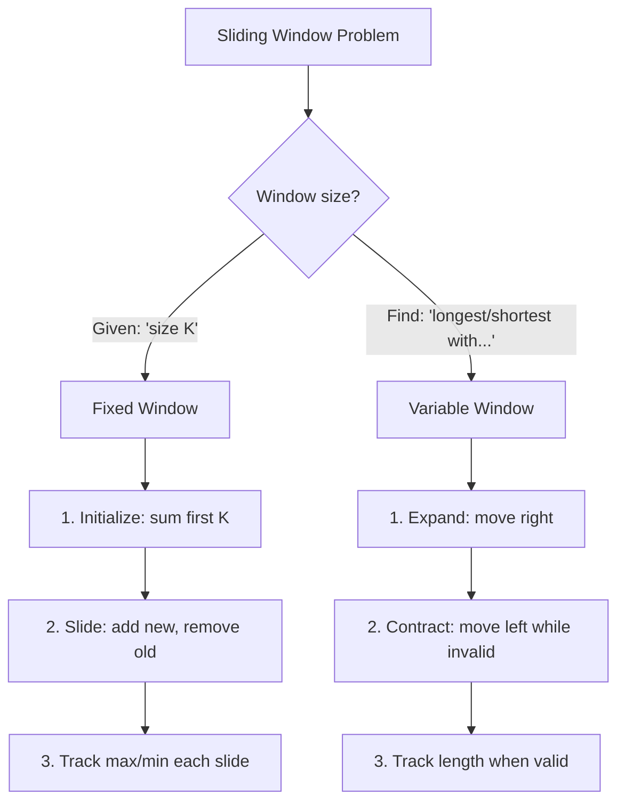

import { LanguageSelector, TimeEstimate, ConfidenceBuilder, DifficultyBadge } from '@site/src/components/interview-guide';
import { CodeTabs } from '@site/src/components/design-patterns/CodeTabs';
import TabItem from '@theme/TabItem';

# Sliding Window: Subarray Problems Made Easy

The first time I saw "find the longest substring with at most K distinct characters," I tried every combination of nested loops. Forty minutes later, I'd written an O(n³) solution that barely worked.

Then someone showed me sliding window. The same problem became O(n) with cleaner code.

That experience taught me something important: **sliding window isn't just an optimization—it's a completely different way of thinking about contiguous subarray problems.**

Instead of checking every possible subarray (O(n²) or worse), you maintain a "window" and slide it across the array, expanding and contracting as needed. Each element enters and exits the window at most once: O(n).

<LanguageSelector />

<TimeEstimate
  learnTime="30-40 minutes"
  practiceTime="3-4 hours"
  masteryTime="10-12 problems"
  interviewFrequency="65%"
  difficultyRange="Easy to Hard"
  prerequisites="Two Pointers, Hash Tables"
/>

---

## The Core Idea

```python
# ❌ Checking every subarray: O(n²) or O(n³)
for start in range(n):
    for end in range(start, n):
        process(arr[start:end+1])  # Additional O(n) to process

# ✅ Sliding window: O(n)
left = 0
for right in range(n):
    add(arr[right])           # Expand window
    while invalid():
        remove(arr[left])     # Contract window
        left += 1
    update_result()           # Process valid window
```

**Why O(n)?** Each element enters the window once (when `right` moves) and exits once (when `left` moves). That's at most 2n operations.

---

## Two Types of Windows



---

## Pattern 1: Fixed Size Window

**Use when:** "Find max/min in every subarray of size K"

<CodeTabs>
<TabItem value="python" label="Python">

```python
def max_sum_subarray(nums: list[int], k: int) -> int:
    """
    Find maximum sum of any subarray of size k.
    Time: O(n), Space: O(1)
    """
    if len(nums) < k:
        return 0
    
    # Initialize window with first k elements
    window_sum = sum(nums[:k])
    max_sum = window_sum
    
    # Slide window: add new element, remove old
    for i in range(k, len(nums)):
        window_sum += nums[i] - nums[i - k]
        max_sum = max(max_sum, window_sum)
    
    return max_sum

# [2, 1, 5, 1, 3, 2], k=3 → max is 5+1+3=9
```

</TabItem>
<TabItem value="typescript" label="TypeScript">

```typescript
function maxSumSubarray(nums: number[], k: number): number {
  if (nums.length < k) return 0;

  // Initialize window
  let windowSum = nums.slice(0, k).reduce((a, b) => a + b, 0);
  let maxSum = windowSum;

  // Slide window
  for (let i = k; i < nums.length; i++) {
    windowSum += nums[i] - nums[i - k];
    maxSum = Math.max(maxSum, windowSum);
  }

  return maxSum;
}
```

</TabItem>
<TabItem value="go" label="Go">

```go
func maxSumSubarray(nums []int, k int) int {
    if len(nums) < k {
        return 0
    }
    
    // Initialize window
    windowSum := 0
    for i := 0; i < k; i++ {
        windowSum += nums[i]
    }
    maxSum := windowSum
    
    // Slide window
    for i := k; i < len(nums); i++ {
        windowSum += nums[i] - nums[i-k]
        if windowSum > maxSum {
            maxSum = windowSum
        }
    }
    
    return maxSum
}
```

</TabItem>
<TabItem value="java" label="Java">

```java
public int maxSumSubarray(int[] nums, int k) {
    if (nums.length < k) return 0;
    
    // Initialize window
    int windowSum = 0;
    for (int i = 0; i < k; i++) {
        windowSum += nums[i];
    }
    int maxSum = windowSum;
    
    // Slide window
    for (int i = k; i < nums.length; i++) {
        windowSum += nums[i] - nums[i - k];
        maxSum = Math.max(maxSum, windowSum);
    }
    
    return maxSum;
}
```

</TabItem>
<TabItem value="cpp" label="C++">

```cpp
int maxSumSubarray(vector<int>& nums, int k) {
    if (nums.size() < k) return 0;
    
    // Initialize window
    int windowSum = 0;
    for (int i = 0; i < k; i++) {
        windowSum += nums[i];
    }
    int maxSum = windowSum;
    
    // Slide window
    for (int i = k; i < nums.size(); i++) {
        windowSum += nums[i] - nums[i - k];
        maxSum = max(maxSum, windowSum);
    }
    
    return maxSum;
}
```

</TabItem>
<TabItem value="c" label="C">

```c
int maxSumSubarray(int* nums, int n, int k) {
    if (n < k) return 0;
    
    // Initialize window
    int windowSum = 0;
    for (int i = 0; i < k; i++) {
        windowSum += nums[i];
    }
    int maxSum = windowSum;
    
    // Slide window
    for (int i = k; i < n; i++) {
        windowSum += nums[i] - nums[i - k];
        if (windowSum > maxSum) maxSum = windowSum;
    }
    
    return maxSum;
}
```

</TabItem>
<TabItem value="csharp" label="C#">

```csharp
public int MaxSumSubarray(int[] nums, int k) {
    if (nums.Length < k) return 0;
    
    // Initialize window
    int windowSum = nums.Take(k).Sum();
    int maxSum = windowSum;
    
    // Slide window
    for (int i = k; i < nums.Length; i++) {
        windowSum += nums[i] - nums[i - k];
        maxSum = Math.Max(maxSum, windowSum);
    }
    
    return maxSum;
}
```

</TabItem>
</CodeTabs>

---

## Pattern 2: Variable Size Window

**Use when:** "Find longest/shortest subarray satisfying a condition"

### The Universal Template

```python
def sliding_window_template(arr):
    left = 0
    result = initial_value
    state = {}  # Track window state (counts, sum, etc.)
    
    for right in range(len(arr)):
        # 1. EXPAND: Add arr[right] to window
        update_state_add(state, arr[right])
        
        # 2. CONTRACT: Shrink while invalid
        while is_invalid(state):
            update_state_remove(state, arr[left])
            left += 1
        
        # 3. UPDATE: Record result for valid window
        result = update_result(result, right - left + 1)
    
    return result
```

### Example: Longest Substring Without Repeating Characters

<CodeTabs>
<TabItem value="python" label="Python">

```python
def length_of_longest_substring(s: str) -> int:
    """
    Find length of longest substring without repeating characters.
    Time: O(n), Space: O(min(n, alphabet_size))
    """
    char_index: dict[str, int] = {}  # Character → last seen index
    left = 0
    max_length = 0
    
    for right, char in enumerate(s):
        # If char seen and within current window, shrink
        if char in char_index and char_index[char] >= left:
            left = char_index[char] + 1
        
        char_index[char] = right
        max_length = max(max_length, right - left + 1)
    
    return max_length

# "abcabcbb" → 3 ("abc")
# "bbbbb" → 1 ("b")
# "pwwkew" → 3 ("wke")
```

</TabItem>
<TabItem value="typescript" label="TypeScript">

```typescript
function lengthOfLongestSubstring(s: string): number {
  const charIndex = new Map<string, number>();
  let left = 0;
  let maxLength = 0;

  for (let right = 0; right < s.length; right++) {
    const char = s[right];
    
    if (charIndex.has(char) && charIndex.get(char)! >= left) {
      left = charIndex.get(char)! + 1;
    }
    
    charIndex.set(char, right);
    maxLength = Math.max(maxLength, right - left + 1);
  }

  return maxLength;
}
```

</TabItem>
<TabItem value="go" label="Go">

```go
func lengthOfLongestSubstring(s string) int {
    charIndex := make(map[rune]int)
    left := 0
    maxLength := 0
    
    for right, char := range s {
        if idx, exists := charIndex[char]; exists && idx >= left {
            left = idx + 1
        }
        
        charIndex[char] = right
        if length := right - left + 1; length > maxLength {
            maxLength = length
        }
    }
    
    return maxLength
}
```

</TabItem>
<TabItem value="java" label="Java">

```java
public int lengthOfLongestSubstring(String s) {
    Map<Character, Integer> charIndex = new HashMap<>();
    int left = 0;
    int maxLength = 0;
    
    for (int right = 0; right < s.length(); right++) {
        char c = s.charAt(right);
        
        if (charIndex.containsKey(c) && charIndex.get(c) >= left) {
            left = charIndex.get(c) + 1;
        }
        
        charIndex.put(c, right);
        maxLength = Math.max(maxLength, right - left + 1);
    }
    
    return maxLength;
}
```

</TabItem>
<TabItem value="cpp" label="C++">

```cpp
int lengthOfLongestSubstring(string s) {
    unordered_map<char, int> charIndex;
    int left = 0;
    int maxLength = 0;
    
    for (int right = 0; right < s.size(); right++) {
        char c = s[right];
        
        if (charIndex.count(c) && charIndex[c] >= left) {
            left = charIndex[c] + 1;
        }
        
        charIndex[c] = right;
        maxLength = max(maxLength, right - left + 1);
    }
    
    return maxLength;
}
```

</TabItem>
<TabItem value="c" label="C">

```c
int lengthOfLongestSubstring(char* s) {
    int charIndex[128];
    memset(charIndex, -1, sizeof(charIndex));
    
    int left = 0;
    int maxLength = 0;
    
    for (int right = 0; s[right]; right++) {
        char c = s[right];
        
        if (charIndex[(int)c] >= left) {
            left = charIndex[(int)c] + 1;
        }
        
        charIndex[(int)c] = right;
        int length = right - left + 1;
        if (length > maxLength) maxLength = length;
    }
    
    return maxLength;
}
```

</TabItem>
<TabItem value="csharp" label="C#">

```csharp
public int LengthOfLongestSubstring(string s) {
    var charIndex = new Dictionary<char, int>();
    int left = 0;
    int maxLength = 0;
    
    for (int right = 0; right < s.Length; right++) {
        char c = s[right];
        
        if (charIndex.ContainsKey(c) && charIndex[c] >= left) {
            left = charIndex[c] + 1;
        }
        
        charIndex[c] = right;
        maxLength = Math.Max(maxLength, right - left + 1);
    }
    
    return maxLength;
}
```

</TabItem>
</CodeTabs>

### Example: Minimum Window Substring (Hard)

<CodeTabs>
<TabItem value="python" label="Python">

```python
from collections import Counter

def min_window(s: str, t: str) -> str:
    """
    Find minimum window in s containing all characters of t.
    Time: O(n + m), Space: O(m) where n=len(s), m=len(t)
    """
    if not s or not t:
        return ""
    
    # Count required characters
    required = Counter(t)
    required_count = len(required)  # Unique chars needed
    
    left = 0
    formed = 0  # Unique chars with enough count
    window_counts: dict[str, int] = {}
    result = (float('inf'), 0, 0)  # (length, left, right)
    
    for right, char in enumerate(s):
        # EXPAND: Add character
        window_counts[char] = window_counts.get(char, 0) + 1
        
        if char in required and window_counts[char] == required[char]:
            formed += 1
        
        # CONTRACT: Shrink while valid (we want minimum)
        while formed == required_count:
            # Update result
            if right - left + 1 < result[0]:
                result = (right - left + 1, left, right)
            
            # Remove from left
            left_char = s[left]
            window_counts[left_char] -= 1
            
            if left_char in required and window_counts[left_char] < required[left_char]:
                formed -= 1
            
            left += 1
    
    return "" if result[0] == float('inf') else s[result[1]:result[2] + 1]

# s="ADOBECODEBANC", t="ABC" → "BANC"
```

</TabItem>
<TabItem value="typescript" label="TypeScript">

```typescript
function minWindow(s: string, t: string): string {
  if (!s || !t) return "";

  const required = new Map<string, number>();
  for (const char of t) {
    required.set(char, (required.get(char) || 0) + 1);
  }

  let left = 0;
  let formed = 0;
  const windowCounts = new Map<string, number>();
  let result: [number, number, number] = [Infinity, 0, 0];

  for (let right = 0; right < s.length; right++) {
    const char = s[right];
    windowCounts.set(char, (windowCounts.get(char) || 0) + 1);

    if (required.has(char) && windowCounts.get(char) === required.get(char)) {
      formed++;
    }

    while (formed === required.size) {
      if (right - left + 1 < result[0]) {
        result = [right - left + 1, left, right];
      }

      const leftChar = s[left];
      windowCounts.set(leftChar, windowCounts.get(leftChar)! - 1);

      if (required.has(leftChar) && windowCounts.get(leftChar)! < required.get(leftChar)!) {
        formed--;
      }

      left++;
    }
  }

  return result[0] === Infinity ? "" : s.slice(result[1], result[2] + 1);
}
```

</TabItem>
<TabItem value="go" label="Go">

```go
func minWindow(s string, t string) string {
    if len(s) == 0 || len(t) == 0 {
        return ""
    }
    
    required := make(map[byte]int)
    for i := 0; i < len(t); i++ {
        required[t[i]]++
    }
    
    left, formed := 0, 0
    windowCounts := make(map[byte]int)
    resultLen, resultLeft := len(s)+1, 0
    
    for right := 0; right < len(s); right++ {
        char := s[right]
        windowCounts[char]++
        
        if cnt, ok := required[char]; ok && windowCounts[char] == cnt {
            formed++
        }
        
        for formed == len(required) {
            if right-left+1 < resultLen {
                resultLen = right - left + 1
                resultLeft = left
            }
            
            leftChar := s[left]
            windowCounts[leftChar]--
            
            if cnt, ok := required[leftChar]; ok && windowCounts[leftChar] < cnt {
                formed--
            }
            
            left++
        }
    }
    
    if resultLen > len(s) {
        return ""
    }
    return s[resultLeft : resultLeft+resultLen]
}
```

</TabItem>
<TabItem value="java" label="Java">

```java
public String minWindow(String s, String t) {
    if (s.isEmpty() || t.isEmpty()) return "";
    
    Map<Character, Integer> required = new HashMap<>();
    for (char c : t.toCharArray()) {
        required.put(c, required.getOrDefault(c, 0) + 1);
    }
    
    int left = 0, formed = 0;
    Map<Character, Integer> windowCounts = new HashMap<>();
    int[] result = {Integer.MAX_VALUE, 0, 0}; // length, left, right
    
    for (int right = 0; right < s.length(); right++) {
        char c = s.charAt(right);
        windowCounts.put(c, windowCounts.getOrDefault(c, 0) + 1);
        
        if (required.containsKey(c) && 
            windowCounts.get(c).equals(required.get(c))) {
            formed++;
        }
        
        while (formed == required.size()) {
            if (right - left + 1 < result[0]) {
                result[0] = right - left + 1;
                result[1] = left;
                result[2] = right;
            }
            
            char leftChar = s.charAt(left);
            windowCounts.put(leftChar, windowCounts.get(leftChar) - 1);
            
            if (required.containsKey(leftChar) && 
                windowCounts.get(leftChar) < required.get(leftChar)) {
                formed--;
            }
            
            left++;
        }
    }
    
    return result[0] == Integer.MAX_VALUE ? "" : s.substring(result[1], result[2] + 1);
}
```

</TabItem>
<TabItem value="cpp" label="C++">

```cpp
string minWindow(string s, string t) {
    if (s.empty() || t.empty()) return "";
    
    unordered_map<char, int> required;
    for (char c : t) required[c]++;
    
    int left = 0, formed = 0;
    unordered_map<char, int> windowCounts;
    int resultLen = INT_MAX, resultLeft = 0;
    
    for (int right = 0; right < s.size(); right++) {
        char c = s[right];
        windowCounts[c]++;
        
        if (required.count(c) && windowCounts[c] == required[c]) {
            formed++;
        }
        
        while (formed == required.size()) {
            if (right - left + 1 < resultLen) {
                resultLen = right - left + 1;
                resultLeft = left;
            }
            
            char leftChar = s[left];
            windowCounts[leftChar]--;
            
            if (required.count(leftChar) && 
                windowCounts[leftChar] < required[leftChar]) {
                formed--;
            }
            
            left++;
        }
    }
    
    return resultLen == INT_MAX ? "" : s.substr(resultLeft, resultLen);
}
```

</TabItem>
<TabItem value="c" label="C">

```c
char* minWindow(char* s, char* t) {
    int sLen = strlen(s), tLen = strlen(t);
    if (sLen == 0 || tLen == 0) return "";
    
    int required[128] = {0};
    int windowCounts[128] = {0};
    int uniqueRequired = 0;
    
    for (int i = 0; i < tLen; i++) {
        if (required[(int)t[i]] == 0) uniqueRequired++;
        required[(int)t[i]]++;
    }
    
    int left = 0, formed = 0;
    int resultLen = sLen + 1, resultLeft = 0;
    
    for (int right = 0; right < sLen; right++) {
        char c = s[right];
        windowCounts[(int)c]++;
        
        if (required[(int)c] > 0 && windowCounts[(int)c] == required[(int)c]) {
            formed++;
        }
        
        while (formed == uniqueRequired) {
            if (right - left + 1 < resultLen) {
                resultLen = right - left + 1;
                resultLeft = left;
            }
            
            char leftChar = s[left];
            windowCounts[(int)leftChar]--;
            
            if (required[(int)leftChar] > 0 && 
                windowCounts[(int)leftChar] < required[(int)leftChar]) {
                formed--;
            }
            
            left++;
        }
    }
    
    if (resultLen > sLen) return "";
    
    char* result = (char*)malloc(resultLen + 1);
    strncpy(result, s + resultLeft, resultLen);
    result[resultLen] = '\0';
    return result;
}
```

</TabItem>
<TabItem value="csharp" label="C#">

```csharp
public string MinWindow(string s, string t) {
    if (string.IsNullOrEmpty(s) || string.IsNullOrEmpty(t)) return "";
    
    var required = t.GroupBy(c => c).ToDictionary(g => g.Key, g => g.Count());
    var windowCounts = new Dictionary<char, int>();
    
    int left = 0, formed = 0;
    (int length, int start, int end) result = (int.MaxValue, 0, 0);
    
    for (int right = 0; right < s.Length; right++) {
        char c = s[right];
        windowCounts[c] = windowCounts.GetValueOrDefault(c, 0) + 1;
        
        if (required.ContainsKey(c) && windowCounts[c] == required[c]) {
            formed++;
        }
        
        while (formed == required.Count) {
            if (right - left + 1 < result.length) {
                result = (right - left + 1, left, right);
            }
            
            char leftChar = s[left];
            windowCounts[leftChar]--;
            
            if (required.ContainsKey(leftChar) && 
                windowCounts[leftChar] < required[leftChar]) {
                formed--;
            }
            
            left++;
        }
    }
    
    return result.length == int.MaxValue ? "" : s.Substring(result.start, result.length);
}
```

</TabItem>
</CodeTabs>

---

## 🎯 Pattern Triggers

| If the problem says... | Window Type | What to Track |
|------------------------|-------------|---------------|
| "Subarray of size K" | Fixed | Sum, count |
| "Longest with at most K distinct" | Variable | Character counts |
| "Smallest with sum ≥ K" | Variable | Running sum |
| "Contains all characters" | Variable | Required counts vs window counts |
| "No repeating characters" | Variable | Last seen index |
| "Maximum of each window" | Fixed + Deque | Monotonic deque |

<ConfidenceBuilder type="remember" title="The Key Insight">

**For maximum/longest problems:** Expand right, contract left while invalid.

**For minimum/shortest problems:** Expand right, contract left while VALID (to find minimum valid window).

</ConfidenceBuilder>

---

## 💬 How to Communicate This in Interviews

**When you identify a sliding window problem, say:**

> "This is asking for a contiguous subarray with a property. I'll use sliding window—expand with the right pointer, contract with the left when [condition]..."

**When explaining the algorithm:**
> "Each character enters the window once and exits once, so despite the while loop, this is O(n) overall."

**When tracking state:**
> "I'm using a hash map to track character counts in my current window. When I add a character, I increment; when I remove, I decrement."

---

## Common Mistakes

### 1. Wrong Contraction Condition

```python
# ❌ WRONG: Using 'if' instead of 'while'
if len(char_count) > k:
    # Only contracts once!

# ✅ RIGHT: Keep contracting until valid
while len(char_count) > k:
    # Contracts as much as needed
```

### 2. Off-by-One in Window Size

```python
# Window from left to right (inclusive)
window_size = right - left + 1  # ✅ Correct

# Don't forget the +1!
window_size = right - left  # ❌ Wrong (off by one)
```

### 3. Not Cleaning Up Empty Counts

```python
# ❌ WRONG: Leaves zero counts in map
char_count[s[left]] -= 1
left += 1

# ✅ RIGHT: Remove when count hits zero
char_count[s[left]] -= 1
if char_count[s[left]] == 0:
    del char_count[s[left]]
left += 1
```

---

## 🏋️ Practice Problems

### Warm-Up (Build Confidence)

| Problem | Difficulty | Time | Type |
|---------|------------|------|------|
| [Max Consecutive Ones](https://leetcode.com/problems/max-consecutive-ones/) | <DifficultyBadge level="easy" /> | 10 min | Variable |
| [Maximum Average Subarray I](https://leetcode.com/problems/maximum-average-subarray-i/) | <DifficultyBadge level="easy" /> | 15 min | Fixed |
| [Contains Duplicate II](https://leetcode.com/problems/contains-duplicate-ii/) | <DifficultyBadge level="easy" /> | 15 min | Fixed |

### Core Practice (Must Do)

| Problem | Difficulty | Companies | Key Insight |
|---------|------------|-----------|-------------|
| [Longest Substring Without Repeating](https://leetcode.com/problems/longest-substring-without-repeating-characters/) | <DifficultyBadge level="medium" /> | Amazon, Meta, Google | Track last seen index |
| [Longest Repeating Character Replacement](https://leetcode.com/problems/longest-repeating-character-replacement/) | <DifficultyBadge level="medium" /> | Google, Amazon | Track max frequency |
| [Permutation in String](https://leetcode.com/problems/permutation-in-string/) | <DifficultyBadge level="medium" /> | Microsoft, Amazon | Compare counts |
| [Max Consecutive Ones III](https://leetcode.com/problems/max-consecutive-ones-iii/) | <DifficultyBadge level="medium" /> | Meta, Google | Track zeros flipped |
| [Fruit Into Baskets](https://leetcode.com/problems/fruit-into-baskets/) | <DifficultyBadge level="medium" /> | Google, Amazon | At most 2 distinct |

### Challenge (For Mastery)

| Problem | Difficulty | Companies | Why It's Hard |
|---------|------------|-----------|---------------|
| [Minimum Window Substring](https://leetcode.com/problems/minimum-window-substring/) | <DifficultyBadge level="hard" /> | Meta, Google, Amazon | Track formed count |
| [Sliding Window Maximum](https://leetcode.com/problems/sliding-window-maximum/) | <DifficultyBadge level="hard" /> | Amazon, Google, Microsoft | Monotonic deque |
| [Substring with Concatenation](https://leetcode.com/problems/substring-with-concatenation-of-all-words/) | <DifficultyBadge level="hard" /> | Amazon, Google | Fixed window + word matching |

---

## Key Takeaways

1. **Fixed window** = slide one element at a time, O(1) per slide.

2. **Variable window** = expand right, contract left while invalid.

3. **Track state with hash map** — character counts, distinct elements, sums.

4. **O(n) complexity** — each element enters and exits at most once.

5. **Contract with `while`, not `if`** — may need multiple contractions.

<ConfidenceBuilder type="youve-got-this">

**Sliding window has a learning curve, then becomes automatic.**

Once you've solved 5-6 sliding window problems, the template becomes second nature. You'll immediately recognize "longest substring with at most K..." and know exactly how to approach it.

</ConfidenceBuilder>

---

## What's Next?

Prefix sums handle range query problems efficiently:

**Next up:** [Prefix Sum Pattern](/docs/interview-guide/coding/patterns/array-patterns/prefix-sum) — Range queries in O(1)
