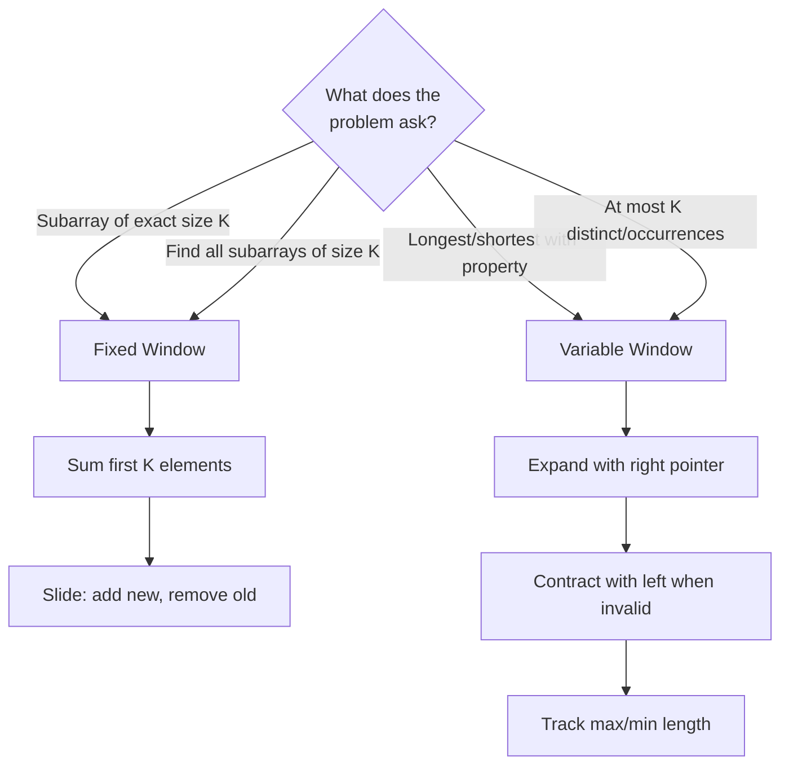

# Sliding Window: Subarray Problems Made Easy

The first time I saw "find the longest substring with at most K distinct characters," I tried every combination of nested loops. Forty minutes later, I'd written a O(n³) solution that barely worked.

Then someone showed me sliding window. The same problem became O(n) with cleaner code.

**Sliding window is the pattern for contiguous subarray/substring problems.**

---

## The Core Idea

Maintain a "window" of elements and slide it across the array:

```python
# Instead of checking every subarray: O(n²) or O(n³)
for start in range(n):
    for end in range(start, n):
        process(arr[start:end+1])

# Slide a window: O(n)
left = 0
for right in range(n):
    # Expand window
    add(arr[right])
    
    # Contract window when invalid
    while invalid():
        remove(arr[left])
        left += 1
    
    # Process valid window
    update_result()
```

---

## Two Types of Windows

### 1. Fixed Size Window

Window size is given. Slide one element at a time.

```python
def max_sum_subarray(nums, k):
    # Initial window
    window_sum = sum(nums[:k])
    max_sum = window_sum
    
    # Slide window
    for i in range(k, len(nums)):
        window_sum += nums[i] - nums[i - k]  # Add new, remove old
        max_sum = max(max_sum, window_sum)
    
    return max_sum
```

**Use when:** "Find max/min subarray of size K"

### 2. Variable Size Window

Window expands and contracts based on conditions.

```python
def longest_substring_k_distinct(s, k):
    char_count = {}
    left = 0
    max_length = 0
    
    for right in range(len(s)):
        # Expand: add character
        char_count[s[right]] = char_count.get(s[right], 0) + 1
        
        # Contract: too many distinct characters
        while len(char_count) > k:
            char_count[s[left]] -= 1
            if char_count[s[left]] == 0:
                del char_count[s[left]]
            left += 1
        
        # Update result
        max_length = max(max_length, right - left + 1)
    
    return max_length
```

**Use when:** "Find longest/shortest subarray satisfying condition"

---

## The Template

```python
def sliding_window(arr, ...):
    left = 0
    result = initial_value
    state = {}  # Track window state (counts, sum, etc.)
    
    for right in range(len(arr)):
        # 1. EXPAND: Add arr[right] to window
        update_state_add(state, arr[right])
        
        # 2. CONTRACT: Shrink window while invalid
        while is_invalid(state):
            update_state_remove(state, arr[left])
            left += 1
        
        # 3. UPDATE: Record result for valid window
        result = update_result(result, right - left + 1)
    
    return result
```

---

## Pattern Recognition

| Problem Signal | Window Type | State to Track |
|----------------|-------------|----------------|
| "Subarray of size K" | Fixed | Sum, count |
| "Longest with at most K..." | Variable | Count of distinct |
| "Smallest with sum ≥ K" | Variable | Running sum |
| "Contains all characters" | Variable | Character count |
| "No repeating characters" | Variable | Last seen index |

---

## Classic Problems

### Problem 1: Longest Substring Without Repeating

```python
def length_of_longest_substring(s):
    char_index = {}  # Character -> last index
    left = 0
    max_length = 0
    
    for right, char in enumerate(s):
        # If char seen and within current window
        if char in char_index and char_index[char] >= left:
            left = char_index[char] + 1
        
        char_index[char] = right
        max_length = max(max_length, right - left + 1)
    
    return max_length
```

### Problem 2: Minimum Window Substring

```python
def min_window(s, t):
    if not s or not t:
        return ""
    
    # Count required characters
    required = Counter(t)
    required_count = len(required)
    
    left = 0
    formed = 0  # Characters with enough count
    window_counts = {}
    result = (float('inf'), 0, 0)  # (length, left, right)
    
    for right, char in enumerate(s):
        # Expand
        window_counts[char] = window_counts.get(char, 0) + 1
        
        if char in required and window_counts[char] == required[char]:
            formed += 1
        
        # Contract while valid
        while formed == required_count:
            # Update result
            if right - left + 1 < result[0]:
                result = (right - left + 1, left, right)
            
            # Remove from left
            left_char = s[left]
            window_counts[left_char] -= 1
            
            if left_char in required and window_counts[left_char] < required[left_char]:
                formed -= 1
            
            left += 1
    
    return "" if result[0] == float('inf') else s[result[1]:result[2] + 1]
```

### Problem 3: Maximum Sum Subarray of Size K

```python
def max_sum_subarray(nums, k):
    if len(nums) < k:
        return 0
    
    window_sum = sum(nums[:k])
    max_sum = window_sum
    
    for i in range(k, len(nums)):
        window_sum += nums[i] - nums[i - k]
        max_sum = max(max_sum, window_sum)
    
    return max_sum
```

### Problem 4: Longest Repeating Character Replacement

```python
def character_replacement(s, k):
    count = {}
    left = 0
    max_freq = 0  # Frequency of most common char in window
    max_length = 0
    
    for right in range(len(s)):
        count[s[right]] = count.get(s[right], 0) + 1
        max_freq = max(max_freq, count[s[right]])
        
        # Window is valid if we can replace (window_size - max_freq) chars
        window_size = right - left + 1
        
        if window_size - max_freq > k:
            count[s[left]] -= 1
            left += 1
        
        max_length = max(max_length, right - left + 1)
    
    return max_length
```

### Problem 5: Permutation in String

```python
def check_inclusion(s1, s2):
    if len(s1) > len(s2):
        return False
    
    s1_count = Counter(s1)
    window_count = Counter(s2[:len(s1)])
    
    if s1_count == window_count:
        return True
    
    for i in range(len(s1), len(s2)):
        # Add new character
        window_count[s2[i]] += 1
        
        # Remove old character
        old_char = s2[i - len(s1)]
        window_count[old_char] -= 1
        if window_count[old_char] == 0:
            del window_count[old_char]
        
        if s1_count == window_count:
            return True
    
    return False
```

---

## Fixed vs Variable: Decision Guide



---

## Practice Problems

### Easy

| Problem | Type | Company |
|---------|------|---------|
| Max Sum Subarray of Size K | Fixed | Amazon |
| Contains Duplicate II | Fixed | Google |
| Max Consecutive Ones | Variable | Microsoft |

### Medium

| Problem | Type | Company |
|---------|------|---------|
| Longest Substring Without Repeating | Variable | Amazon, Google |
| Longest Repeating Character Replacement | Variable | Google |
| Permutation in String | Fixed | Microsoft |
| Fruit Into Baskets | Variable | Google |
| Max Consecutive Ones III | Variable | Meta |

### Hard

| Problem | Type | Company |
|---------|------|---------|
| Minimum Window Substring | Variable | Meta, Google |
| Sliding Window Maximum | Fixed + Deque | Amazon |
| Substring with Concatenation | Fixed | Amazon |

---

## Common Mistakes

1. **Not tracking window state properly** — Use hash map for counts
2. **Off-by-one in window size** — `right - left + 1` for inclusive
3. **Contracting too early** — Expand fully before contracting
4. **Wrong contraction condition** — Contract while invalid, not if

---

## Key Takeaways

1. **Fixed window** = slide one element at a time, O(1) per slide.

2. **Variable window** = expand right, contract left when invalid.

3. **Track state with hash map** — character counts, distinct elements.

4. **Window validity** determines when to contract.

5. **O(n) instead of O(n²)** — each element enters and exits at most once.

---

## What's Next?

Learn to handle prefix sums for range query problems:

👉 [Prefix Sum Pattern →](./prefix-sum)
