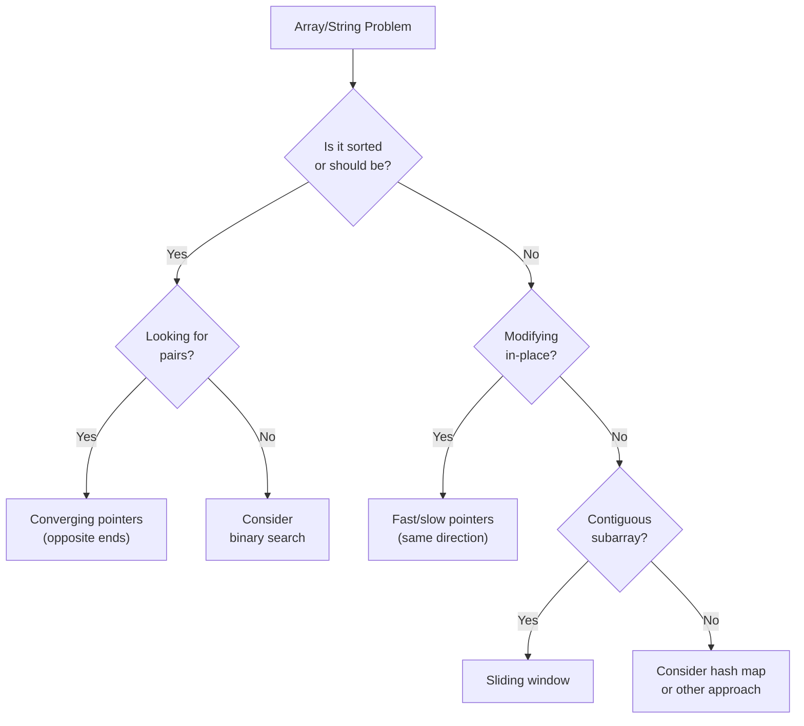

# Two Pointers: The Pattern That Changes Everything

The first time two pointers clicked for me, I felt like I'd discovered a cheat code.

I was struggling with a problem: find two numbers in a sorted array that sum to a target. My instinct was nested loops—check every pair. O(n²). It worked, but it was slow.

Then I saw the two-pointer solution: start at both ends, move inward based on whether the sum was too big or too small. Same problem, O(n). No extra space.

**That's when I realized: two pointers isn't just a technique—it's a way of thinking about array problems.**

The pattern appears everywhere. Palindrome checking, removing duplicates, partitioning arrays, merging sorted lists. Once you recognize the shape, problems that seemed hard become almost trivial.

---

## The Core Insight

**Two pointers work when you can make a decision about which pointer to move based on the current state.**

Think about it this way: with a single pointer, you have one decision each step—move forward. With two pointers, you have three options: move left, move right, or both. This extra control lets you explore the array more intelligently.

The key question to ask: "Can I eliminate possibilities by moving one pointer or the other?"

If yes, two pointers might be your solution.

---

## The Three Variations

Almost every two-pointer problem falls into one of three patterns. Learn to recognize which one applies.

### Variation 1: Opposite Ends (Converging Pointers)

**Setup:** One pointer at the start, one at the end. Move them toward each other.

**Use when:** You need to find pairs, check palindromes, or process from both ends.

```
Array: [1, 2, 3, 4, 5, 6, 7]
        ↑                 ↑
       left             right

Move pointers toward center based on some condition
```

**Classic example: Two Sum in Sorted Array**

```python
def two_sum_sorted(nums, target):
    """
    Find two numbers that sum to target in a sorted array.
    
    Why it works: If sum is too small, we need a bigger number.
    The bigger numbers are on the right, so move left pointer.
    If sum is too big, move right pointer to get smaller numbers.
    """
    left, right = 0, len(nums) - 1
    
    while left < right:
        current_sum = nums[left] + nums[right]
        
        if current_sum == target:
            return [left, right]
        elif current_sum < target:
            left += 1   # Need bigger sum, move to larger number
        else:
            right -= 1  # Need smaller sum, move to smaller number
    
    return []  # No solution found
```

**Why O(n)?** Each step eliminates at least one index from consideration. We can have at most n steps.

**Classic example: Valid Palindrome**

```python
def is_palindrome(s):
    """
    Check if string is palindrome, ignoring non-alphanumeric.
    
    Why it works: A palindrome reads same forward and backward.
    Compare characters from both ends, moving inward.
    """
    left, right = 0, len(s) - 1
    
    while left < right:
        # Skip non-alphanumeric characters
        while left < right and not s[left].isalnum():
            left += 1
        while left < right and not s[right].isalnum():
            right -= 1
        
        if s[left].lower() != s[right].lower():
            return False
        
        left += 1
        right -= 1
    
    return True
```

**Classic example: Container With Most Water**

```python
def max_area(heights):
    """
    Find two lines that form container with most water.
    
    Why it works: Area = width × min(height).
    Start with max width. Only way to improve area is taller min height.
    Move the shorter line inward hoping to find taller one.
    """
    left, right = 0, len(heights) - 1
    max_water = 0
    
    while left < right:
        width = right - left
        height = min(heights[left], heights[right])
        max_water = max(max_water, width * height)
        
        # Move the shorter line—the only way to potentially increase area
        if heights[left] < heights[right]:
            left += 1
        else:
            right -= 1
    
    return max_water
```

---

### Variation 2: Same Direction (Fast & Slow Pointers)

**Setup:** Both pointers start near the beginning. One moves faster or under different conditions.

**Use when:** You're partitioning the array, removing elements, or detecting cycles.

```
Array: [1, 2, 3, 4, 5, 6, 7]
        ↑  ↑
       slow fast

Fast scans ahead, slow marks the boundary of processed elements
```

**Classic example: Remove Duplicates from Sorted Array**

```python
def remove_duplicates(nums):
    """
    Remove duplicates in-place, return new length.
    
    Why it works: 'slow' marks where to place next unique element.
    'fast' scans for unique elements.
    When fast finds new unique, place it at slow and advance slow.
    """
    if not nums:
        return 0
    
    slow = 0  # Position of last unique element
    
    for fast in range(1, len(nums)):
        if nums[fast] != nums[slow]:
            slow += 1
            nums[slow] = nums[fast]
    
    return slow + 1  # Length of unique portion
```

**Classic example: Move Zeroes**

```python
def move_zeroes(nums):
    """
    Move all zeroes to end while maintaining relative order.
    
    Why it works: 'slow' marks where to place next non-zero.
    'fast' scans for non-zeroes.
    """
    slow = 0  # Position for next non-zero
    
    for fast in range(len(nums)):
        if nums[fast] != 0:
            nums[slow], nums[fast] = nums[fast], nums[slow]
            slow += 1
    
    # Now nums[0:slow] are non-zeroes, nums[slow:] are zeroes
```

**Classic example: Remove Element**

```python
def remove_element(nums, val):
    """
    Remove all occurrences of val in-place.
    
    Same pattern: slow marks boundary of kept elements.
    """
    slow = 0
    
    for fast in range(len(nums)):
        if nums[fast] != val:
            nums[slow] = nums[fast]
            slow += 1
    
    return slow
```

---

### Variation 3: Sliding Window (Two Pointers Defining a Range)

**Setup:** Both pointers define a window. Expand and contract the window as needed.

**Use when:** You need to find subarrays/substrings satisfying some condition.

```
String: "abcabcbb"
         ↑   ↑
       start end

The window [start, end] represents the current substring under consideration
```

I cover sliding window in detail in its own guide, but here's the core pattern:

```python
def longest_substring_without_repeating(s):
    """
    Find length of longest substring without repeating characters.
    
    Why it works: Window [start, end] contains valid substring.
    Expand 'end' to grow window.
    When duplicate found, shrink by moving 'start'.
    """
    char_index = {}  # Character -> most recent index
    max_length = 0
    start = 0
    
    for end in range(len(s)):
        char = s[end]
        
        # If char already in window, shrink window
        if char in char_index and char_index[char] >= start:
            start = char_index[char] + 1
        
        char_index[char] = end
        max_length = max(max_length, end - start + 1)
    
    return max_length
```

---

## When to Recognize Two Pointers

**Signals that suggest two pointers:**

1. **Sorted array** — "Given a sorted array, find two numbers that..."
2. **Pairs** — "Find a pair that...", "Two elements that..."
3. **Palindrome** — Compare from both ends
4. **In-place modification** — "Remove", "Partition", "Move"
5. **Optimal window** — "Longest substring", "Minimum window"
6. **Linked list cycles** — Fast and slow pointers

**Signals that suggest something else:**

1. **"All pairs"** — You might need O(n²) or a different approach
2. **Unsorted with no structure** — Hash map might be better
3. **Need to track more than two positions** — Consider three pointers or different approach

---

## The Decision Framework

When you see an array problem, ask yourself:



---

## Common Mistakes to Avoid

### Mistake 1: Off-by-One Errors

```python
# WRONG - might skip elements or go out of bounds
while left <= right:  # Should this be < or <=?

# Think about termination:
# - For palindrome check: left < right (they can meet in middle)
# - For finding something: left <= right (need to check last element)
```

### Mistake 2: Forgetting to Move Both Pointers

```python
# WRONG - infinite loop when equal
while left < right:
    if nums[left] == nums[right]:
        return True
    elif nums[left] < nums[right]:
        left += 1
    else:
        right -= 1

# RIGHT - always make progress
while left < right:
    if nums[left] == nums[right]:
        return True
    if nums[left] < nums[right]:
        left += 1
    else:
        right -= 1
```

### Mistake 3: Not Handling Duplicates

```python
def three_sum(nums):
    """Three sum with duplicate handling."""
    nums.sort()
    result = []
    
    for i in range(len(nums) - 2):
        # Skip duplicate first elements
        if i > 0 and nums[i] == nums[i-1]:
            continue
        
        left, right = i + 1, len(nums) - 1
        
        while left < right:
            total = nums[i] + nums[left] + nums[right]
            
            if total == 0:
                result.append([nums[i], nums[left], nums[right]])
                
                # Skip duplicates
                while left < right and nums[left] == nums[left + 1]:
                    left += 1
                while left < right and nums[right] == nums[right - 1]:
                    right -= 1
                
                left += 1
                right -= 1
            elif total < 0:
                left += 1
            else:
                right -= 1
    
    return result
```

---

## Practice Problems

Start with these, in order of difficulty:

| Problem | Variation | Key Insight |
|---------|-----------|-------------|
| Valid Palindrome | Converging | Compare ends, skip non-alnum |
| Two Sum II (Sorted) | Converging | Sum too big → move right down |
| Remove Duplicates | Fast/Slow | Slow marks unique boundary |
| Move Zeroes | Fast/Slow | Swap non-zeros to front |
| Container With Most Water | Converging | Move shorter line |
| 3Sum | Converging + Loop | Fix one, two-pointer the rest |
| Trapping Rain Water | Converging | Water level is min(leftMax, rightMax) |

---

## Key Takeaways

1. **Two pointers trade space for time.** They often convert O(n²) to O(n) without extra memory.

2. **The three variations cover most problems:**
   - Converging (opposite ends)
   - Fast/slow (same direction)
   - Sliding window (defining range)

3. **Sorted arrays are a strong signal** for two pointers. If not sorted, consider whether sorting helps.

4. **Always ensure progress.** Each iteration should move at least one pointer.

5. **Handle duplicates explicitly.** Many problems require skipping duplicates to avoid redundant work.

---

## What's Next?

Ready to level up? The sliding window pattern extends two pointers for substring and subarray problems:

👉 [Sliding Window Pattern →](./sliding-window)
