import { LanguageSelector, TimeEstimate, ConfidenceBuilder, DifficultyBadge } from '@site/src/components/interview-guide';
import { CodeTabs } from '@site/src/components/design-patterns/CodeTabs';
import TabItem from '@theme/TabItem';

# Two Pointers: The Pattern That Changes Everything

The first time two pointers clicked for me, I felt like I'd discovered a cheat code.

I was struggling with a problem: find two numbers in a sorted array that sum to a target. My instinct was nested loops—check every pair. O(n²). It worked, but it was slow.

Then I saw the two-pointer solution: start at both ends, move inward based on whether the sum was too big or too small. Same problem, O(n). No extra space.

**That's when I realized: two pointers isn't just a technique—it's a way of thinking about array problems.**

The pattern appears everywhere. Palindrome checking, removing duplicates, partitioning arrays, container with most water. Once you recognize the shape, problems that seemed hard become almost trivial.

<LanguageSelector />

<TimeEstimate
  learnTime="25-35 minutes"
  practiceTime="2-3 hours"
  masteryTime="8-12 problems"
  interviewFrequency="75%"
  difficultyRange="Easy to Hard"
  prerequisites="Arrays, Big-O Notation"
/>

---

## The Core Insight

**Two pointers work when you can make a decision about which pointer to move based on the current state.**

With a single pointer, you have one decision each step—move forward. With two pointers, you have three options: move left, move right, or both. This extra control lets you explore the array more intelligently.

The key question: **"Can I eliminate possibilities by moving one pointer or the other?"**

If yes, two pointers might be your solution.

---

## The Three Variations

```mermaid
flowchart TD
    A[Two Pointer Problem] --> B{What type?}
    
    B --> C["Variation 1: Converging<br/>(opposite ends)"]
    B --> D["Variation 2: Fast/Slow<br/>(same direction)"]
    B --> E["Variation 3: Sliding Window<br/>(defining range)"]
    
    C --> C1["• Two Sum (sorted)<br/>• Palindrome<br/>• Container Water<br/>• 3Sum"]
    
    D --> D1["• Remove Duplicates<br/>• Move Zeroes<br/>• Partition Array<br/>• Linked List Cycle"]
    
    E --> E1["• Longest Substring<br/>• Minimum Window<br/>• Max Sum Subarray<br/>→ See Sliding Window doc"]
```



---

## Variation 1: Opposite Ends (Converging Pointers)

**Setup:** One pointer at the start, one at the end. Move them toward each other.

**Use when:** You need to find pairs, check palindromes, or process from both ends.

```
Array: [1, 2, 3, 4, 5, 6, 7]
        ↑                 ↑
       left             right

Move pointers toward center based on some condition
```

### Example: Two Sum in Sorted Array

<CodeTabs>
<TabItem value="python" label="Python">

```python
def two_sum_sorted(nums: list[int], target: int) -> list[int]:
    """
    Find two numbers in sorted array that sum to target.
    Time: O(n), Space: O(1)
    
    Why it works: If sum is too small, we need a bigger number.
    Bigger numbers are on the right, so move left pointer.
    If sum is too big, move right pointer to get smaller sum.
    """
    left, right = 0, len(nums) - 1
    
    while left < right:
        current_sum = nums[left] + nums[right]
        
        if current_sum == target:
            return [left, right]
        elif current_sum < target:
            left += 1   # Need bigger sum
        else:
            right -= 1  # Need smaller sum
    
    return []  # No solution found
```

</TabItem>
<TabItem value="typescript" label="TypeScript">

```typescript
function twoSumSorted(nums: number[], target: number): number[] {
  let left = 0;
  let right = nums.length - 1;

  while (left < right) {
    const currentSum = nums[left] + nums[right];

    if (currentSum === target) {
      return [left, right];
    } else if (currentSum < target) {
      left++;
    } else {
      right--;
    }
  }

  return [];
}
```

</TabItem>
<TabItem value="go" label="Go">

```go
func twoSumSorted(nums []int, target int) []int {
    left, right := 0, len(nums)-1
    
    for left < right {
        currentSum := nums[left] + nums[right]
        
        if currentSum == target {
            return []int{left, right}
        } else if currentSum < target {
            left++
        } else {
            right--
        }
    }
    
    return []int{}
}
```

</TabItem>
<TabItem value="java" label="Java">

```java
public int[] twoSumSorted(int[] nums, int target) {
    int left = 0;
    int right = nums.length - 1;
    
    while (left < right) {
        int currentSum = nums[left] + nums[right];
        
        if (currentSum == target) {
            return new int[] {left, right};
        } else if (currentSum < target) {
            left++;
        } else {
            right--;
        }
    }
    
    return new int[] {};
}
```

</TabItem>
<TabItem value="cpp" label="C++">

```cpp
vector<int> twoSumSorted(vector<int>& nums, int target) {
    int left = 0;
    int right = nums.size() - 1;
    
    while (left < right) {
        int currentSum = nums[left] + nums[right];
        
        if (currentSum == target) {
            return {left, right};
        } else if (currentSum < target) {
            left++;
        } else {
            right--;
        }
    }
    
    return {};
}
```

</TabItem>
<TabItem value="c" label="C">

```c
int* twoSumSorted(int* nums, int n, int target, int* returnSize) {
    *returnSize = 2;
    int* result = (int*)malloc(2 * sizeof(int));
    
    int left = 0;
    int right = n - 1;
    
    while (left < right) {
        int currentSum = nums[left] + nums[right];
        
        if (currentSum == target) {
            result[0] = left;
            result[1] = right;
            return result;
        } else if (currentSum < target) {
            left++;
        } else {
            right--;
        }
    }
    
    *returnSize = 0;
    return NULL;
}
```

</TabItem>
<TabItem value="csharp" label="C#">

```csharp
public int[] TwoSumSorted(int[] nums, int target) {
    int left = 0;
    int right = nums.Length - 1;
    
    while (left < right) {
        int currentSum = nums[left] + nums[right];
        
        if (currentSum == target) {
            return new int[] { left, right };
        } else if (currentSum < target) {
            left++;
        } else {
            right--;
        }
    }
    
    return Array.Empty<int>();
}
```

</TabItem>
</CodeTabs>

### Example: Container With Most Water

<CodeTabs>
<TabItem value="python" label="Python">

```python
def max_area(heights: list[int]) -> int:
    """
    Find two lines forming container with most water.
    Time: O(n), Space: O(1)
    
    Why it works: Area = width × min(height).
    Start with max width. Only way to improve is taller min height.
    Move the shorter line inward hoping to find taller one.
    """
    left, right = 0, len(heights) - 1
    max_water = 0
    
    while left < right:
        width = right - left
        height = min(heights[left], heights[right])
        max_water = max(max_water, width * height)
        
        # Move the shorter line—only way to potentially increase area
        if heights[left] < heights[right]:
            left += 1
        else:
            right -= 1
    
    return max_water
```

</TabItem>
<TabItem value="typescript" label="TypeScript">

```typescript
function maxArea(heights: number[]): number {
  let left = 0;
  let right = heights.length - 1;
  let maxWater = 0;

  while (left < right) {
    const width = right - left;
    const height = Math.min(heights[left], heights[right]);
    maxWater = Math.max(maxWater, width * height);

    if (heights[left] < heights[right]) {
      left++;
    } else {
      right--;
    }
  }

  return maxWater;
}
```

</TabItem>
<TabItem value="go" label="Go">

```go
func maxArea(heights []int) int {
    left, right := 0, len(heights)-1
    maxWater := 0
    
    for left < right {
        width := right - left
        height := min(heights[left], heights[right])
        area := width * height
        if area > maxWater {
            maxWater = area
        }
        
        if heights[left] < heights[right] {
            left++
        } else {
            right--
        }
    }
    
    return maxWater
}

func min(a, b int) int {
    if a < b { return a }
    return b
}
```

</TabItem>
<TabItem value="java" label="Java">

```java
public int maxArea(int[] heights) {
    int left = 0;
    int right = heights.length - 1;
    int maxWater = 0;
    
    while (left < right) {
        int width = right - left;
        int height = Math.min(heights[left], heights[right]);
        maxWater = Math.max(maxWater, width * height);
        
        if (heights[left] < heights[right]) {
            left++;
        } else {
            right--;
        }
    }
    
    return maxWater;
}
```

</TabItem>
<TabItem value="cpp" label="C++">

```cpp
int maxArea(vector<int>& heights) {
    int left = 0;
    int right = heights.size() - 1;
    int maxWater = 0;
    
    while (left < right) {
        int width = right - left;
        int height = min(heights[left], heights[right]);
        maxWater = max(maxWater, width * height);
        
        if (heights[left] < heights[right]) {
            left++;
        } else {
            right--;
        }
    }
    
    return maxWater;
}
```

</TabItem>
<TabItem value="c" label="C">

```c
int maxArea(int* heights, int n) {
    int left = 0;
    int right = n - 1;
    int maxWater = 0;
    
    while (left < right) {
        int width = right - left;
        int height = heights[left] < heights[right] ? heights[left] : heights[right];
        int area = width * height;
        if (area > maxWater) maxWater = area;
        
        if (heights[left] < heights[right]) {
            left++;
        } else {
            right--;
        }
    }
    
    return maxWater;
}
```

</TabItem>
<TabItem value="csharp" label="C#">

```csharp
public int MaxArea(int[] heights) {
    int left = 0;
    int right = heights.Length - 1;
    int maxWater = 0;
    
    while (left < right) {
        int width = right - left;
        int height = Math.Min(heights[left], heights[right]);
        maxWater = Math.Max(maxWater, width * height);
        
        if (heights[left] < heights[right]) {
            left++;
        } else {
            right--;
        }
    }
    
    return maxWater;
}
```

</TabItem>
</CodeTabs>

---

## Variation 2: Same Direction (Fast & Slow)

**Setup:** Both pointers start near the beginning. One moves faster or under different conditions.

**Use when:** You're partitioning the array, removing elements, or detecting cycles.

```
Array: [0, 1, 0, 3, 12]
        ↑  ↑
       slow fast

Fast scans ahead, slow marks the boundary of processed elements
```

### Example: Move Zeroes

<CodeTabs>
<TabItem value="python" label="Python">

```python
def move_zeroes(nums: list[int]) -> None:
    """
    Move all zeroes to end while maintaining relative order.
    Time: O(n), Space: O(1)
    
    Why it works: 'slow' marks where to place next non-zero.
    'fast' scans for non-zeroes. Swap them to front.
    """
    slow = 0  # Position for next non-zero
    
    for fast in range(len(nums)):
        if nums[fast] != 0:
            nums[slow], nums[fast] = nums[fast], nums[slow]
            slow += 1
    
    # Now nums[0:slow] are non-zeroes, nums[slow:] are zeroes

# [0, 1, 0, 3, 12] → [1, 3, 12, 0, 0]
```

</TabItem>
<TabItem value="typescript" label="TypeScript">

```typescript
function moveZeroes(nums: number[]): void {
  let slow = 0;

  for (let fast = 0; fast < nums.length; fast++) {
    if (nums[fast] !== 0) {
      [nums[slow], nums[fast]] = [nums[fast], nums[slow]];
      slow++;
    }
  }
}
```

</TabItem>
<TabItem value="go" label="Go">

```go
func moveZeroes(nums []int) {
    slow := 0
    
    for fast := 0; fast < len(nums); fast++ {
        if nums[fast] != 0 {
            nums[slow], nums[fast] = nums[fast], nums[slow]
            slow++
        }
    }
}
```

</TabItem>
<TabItem value="java" label="Java">

```java
public void moveZeroes(int[] nums) {
    int slow = 0;
    
    for (int fast = 0; fast < nums.length; fast++) {
        if (nums[fast] != 0) {
            int temp = nums[slow];
            nums[slow] = nums[fast];
            nums[fast] = temp;
            slow++;
        }
    }
}
```

</TabItem>
<TabItem value="cpp" label="C++">

```cpp
void moveZeroes(vector<int>& nums) {
    int slow = 0;
    
    for (int fast = 0; fast < nums.size(); fast++) {
        if (nums[fast] != 0) {
            swap(nums[slow], nums[fast]);
            slow++;
        }
    }
}
```

</TabItem>
<TabItem value="c" label="C">

```c
void moveZeroes(int* nums, int n) {
    int slow = 0;
    
    for (int fast = 0; fast < n; fast++) {
        if (nums[fast] != 0) {
            int temp = nums[slow];
            nums[slow] = nums[fast];
            nums[fast] = temp;
            slow++;
        }
    }
}
```

</TabItem>
<TabItem value="csharp" label="C#">

```csharp
public void MoveZeroes(int[] nums) {
    int slow = 0;
    
    for (int fast = 0; fast < nums.Length; fast++) {
        if (nums[fast] != 0) {
            (nums[slow], nums[fast]) = (nums[fast], nums[slow]);
            slow++;
        }
    }
}
```

</TabItem>
</CodeTabs>

### Example: Remove Duplicates from Sorted Array

<CodeTabs>
<TabItem value="python" label="Python">

```python
def remove_duplicates(nums: list[int]) -> int:
    """
    Remove duplicates in-place from sorted array.
    Time: O(n), Space: O(1)
    Returns: Length of unique portion
    
    Why it works: 'slow' marks position of last unique element.
    'fast' scans for new unique elements.
    """
    if not nums:
        return 0
    
    slow = 0  # Position of last unique element
    
    for fast in range(1, len(nums)):
        if nums[fast] != nums[slow]:
            slow += 1
            nums[slow] = nums[fast]
    
    return slow + 1  # Length of unique portion

# [1, 1, 2, 2, 3] → [1, 2, 3, _, _], returns 3
```

</TabItem>
<TabItem value="typescript" label="TypeScript">

```typescript
function removeDuplicates(nums: number[]): number {
  if (nums.length === 0) return 0;

  let slow = 0;

  for (let fast = 1; fast < nums.length; fast++) {
    if (nums[fast] !== nums[slow]) {
      slow++;
      nums[slow] = nums[fast];
    }
  }

  return slow + 1;
}
```

</TabItem>
<TabItem value="go" label="Go">

```go
func removeDuplicates(nums []int) int {
    if len(nums) == 0 {
        return 0
    }
    
    slow := 0
    
    for fast := 1; fast < len(nums); fast++ {
        if nums[fast] != nums[slow] {
            slow++
            nums[slow] = nums[fast]
        }
    }
    
    return slow + 1
}
```

</TabItem>
<TabItem value="java" label="Java">

```java
public int removeDuplicates(int[] nums) {
    if (nums.length == 0) return 0;
    
    int slow = 0;
    
    for (int fast = 1; fast < nums.length; fast++) {
        if (nums[fast] != nums[slow]) {
            slow++;
            nums[slow] = nums[fast];
        }
    }
    
    return slow + 1;
}
```

</TabItem>
<TabItem value="cpp" label="C++">

```cpp
int removeDuplicates(vector<int>& nums) {
    if (nums.empty()) return 0;
    
    int slow = 0;
    
    for (int fast = 1; fast < nums.size(); fast++) {
        if (nums[fast] != nums[slow]) {
            slow++;
            nums[slow] = nums[fast];
        }
    }
    
    return slow + 1;
}
```

</TabItem>
<TabItem value="c" label="C">

```c
int removeDuplicates(int* nums, int n) {
    if (n == 0) return 0;
    
    int slow = 0;
    
    for (int fast = 1; fast < n; fast++) {
        if (nums[fast] != nums[slow]) {
            slow++;
            nums[slow] = nums[fast];
        }
    }
    
    return slow + 1;
}
```

</TabItem>
<TabItem value="csharp" label="C#">

```csharp
public int RemoveDuplicates(int[] nums) {
    if (nums.Length == 0) return 0;
    
    int slow = 0;
    
    for (int fast = 1; fast < nums.Length; fast++) {
        if (nums[fast] != nums[slow]) {
            slow++;
            nums[slow] = nums[fast];
        }
    }
    
    return slow + 1;
}
```

</TabItem>
</CodeTabs>

---

## 🎯 Pattern Triggers

| If the problem says... | Likely pattern |
|------------------------|----------------|
| "Sorted array... find pair" | Converging pointers |
| "Palindrome" | Converging pointers |
| "Container", "area", "two lines" | Converging pointers |
| "Remove", "move", "partition" in-place | Fast/slow pointers |
| "Sorted... remove duplicates" | Fast/slow pointers |
| "Linked list cycle" | Fast/slow pointers |
| "Substring", "subarray", "window" | Sliding window |

<ConfidenceBuilder type="remember" title="The Decision Shortcut">

**Sorted + pairs = converging.**
**In-place modification = fast/slow.**
**Contiguous range = sliding window.**

</ConfidenceBuilder>

---

## 💬 How to Communicate This in Interviews

**When you identify a two-pointer approach, say:**

> "This is a sorted array where I need to find pairs. I'll use two pointers starting from opposite ends. If the sum is too small, I move the left pointer right to get a larger value..."

**Before coding:**
> "I'll initialize left at index 0 and right at the last index. The loop continues while left is less than right..."

**When explaining the algorithm:**
> "Each iteration, I eliminate at least one index from consideration. Since we have n elements, we'll have at most n iterations, giving us O(n) time."

---

## Common Mistakes

### 1. Off-by-One Errors

```python
# The termination condition matters!
while left < right:   # For pairs: they shouldn't meet
while left <= right:  # For search: need to check last element

# Think: what happens when left == right?
```

### 2. Not Making Progress

```python
# ❌ WRONG - infinite loop when equal
while left < right:
    if nums[left] == nums[right]:
        return True
    # Missing else clause - doesn't advance pointers!

# ✅ RIGHT - always make progress
while left < right:
    if nums[left] == nums[right]:
        return True
    elif nums[left] < nums[right]:
        left += 1
    else:
        right -= 1
```

### 3. Forgetting Duplicates (3Sum)

```python
# ❌ WRONG - returns duplicate triplets
# ✅ RIGHT - skip duplicates
for i in range(len(nums) - 2):
    if i > 0 and nums[i] == nums[i-1]:
        continue  # Skip duplicate first element
```

---

## 🏋️ Practice Problems

### Warm-Up (Build Confidence)

| Problem | Difficulty | Time | Variation |
|---------|------------|------|-----------|
| [Valid Palindrome](https://leetcode.com/problems/valid-palindrome/) | <DifficultyBadge level="easy" /> | 15 min | Converging |
| [Two Sum II](https://leetcode.com/problems/two-sum-ii-input-array-is-sorted/) | <DifficultyBadge level="medium" /> | 15 min | Converging |
| [Remove Duplicates](https://leetcode.com/problems/remove-duplicates-from-sorted-array/) | <DifficultyBadge level="easy" /> | 15 min | Fast/slow |
| [Move Zeroes](https://leetcode.com/problems/move-zeroes/) | <DifficultyBadge level="easy" /> | 15 min | Fast/slow |

### Core Practice (Must Do)

| Problem | Difficulty | Companies | Pattern |
|---------|------------|-----------|---------|
| [Container With Most Water](https://leetcode.com/problems/container-with-most-water/) | <DifficultyBadge level="medium" /> | Amazon, Google, Meta | Converging |
| [3Sum](https://leetcode.com/problems/3sum/) | <DifficultyBadge level="medium" /> | Meta, Amazon, Google, Microsoft | Converging + loop |
| [Sort Colors](https://leetcode.com/problems/sort-colors/) | <DifficultyBadge level="medium" /> | Amazon, Microsoft, Meta | Three pointers |
| [Remove Element](https://leetcode.com/problems/remove-element/) | <DifficultyBadge level="easy" /> | Amazon, Google | Fast/slow |
| [Squares of Sorted Array](https://leetcode.com/problems/squares-of-a-sorted-array/) | <DifficultyBadge level="easy" /> | Amazon, Meta, Google | Converging |

### Challenge (For Mastery)

| Problem | Difficulty | Companies | Why It's Hard |
|---------|------------|-----------|---------------|
| [Trapping Rain Water](https://leetcode.com/problems/trapping-rain-water/) | <DifficultyBadge level="hard" /> | Google, Amazon, Meta, Microsoft | Level tracking |
| [4Sum](https://leetcode.com/problems/4sum/) | <DifficultyBadge level="medium" /> | Amazon, Meta | Nested two-pointer |
| [3Sum Closest](https://leetcode.com/problems/3sum-closest/) | <DifficultyBadge level="medium" /> | Amazon, Google, Meta | Tracking closest |

---

## Key Takeaways

1. **Two pointers trade space for time.** Often convert O(n²) to O(n) without extra memory.

2. **Three variations cover most problems:** Converging, Fast/slow, Sliding window.

3. **Sorted arrays are a strong signal.** If not sorted, consider whether sorting helps.

4. **Always ensure progress.** Each iteration should move at least one pointer.

5. **Handle duplicates explicitly.** Many problems require skipping duplicates.

<ConfidenceBuilder type="youve-got-this">

**Two pointers is a superpower.**

Once you internalize these three patterns, you'll immediately recognize 30%+ of array problems. The solution becomes almost automatic.

</ConfidenceBuilder>

---

## What's Next?

The sliding window pattern extends two pointers for substring and subarray problems:

**Next up:** [Sliding Window Pattern](/docs/interview-guide/coding/patterns/array-patterns/sliding-window) — Finding optimal subarrays and substrings
