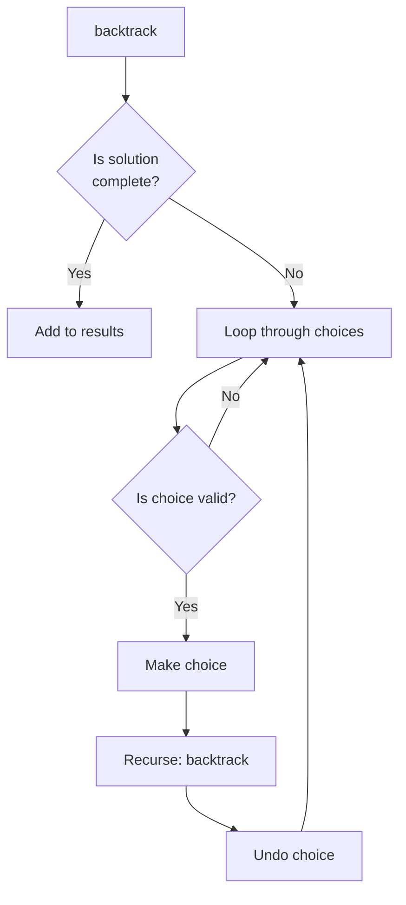

import { LanguageSelector, TimeEstimate, ConfidenceBuilder, DifficultyBadge } from '@site/src/components/interview-guide';
import { CodeTabs } from '@site/src/components/design-patterns/CodeTabs';
import TabItem from '@theme/TabItem';

# Backtracking: Explore All Possibilities

When I first saw "generate all permutations," I had no idea where to start. How do you systematically explore every possibility without missing any or creating duplicates?

The breakthrough was understanding that **backtracking is just DFS on a decision tree.** At each step, you make a choice, explore the consequences, then undo the choice and try the next option.

**The Pattern:**
1. Make a choice
2. Explore with that choice (recurse)
3. Undo the choice (backtrack)
4. Make the next choice

<LanguageSelector />

<TimeEstimate
  learnTime="35-45 minutes"
  practiceTime="5-6 hours"
  masteryTime="15-18 problems"
  interviewFrequency="40%"
  difficultyRange="Medium to Hard"
  prerequisites="Recursion, Trees"
/>

---

## The Backtracking Template



<CodeTabs>
<TabItem value="python" label="Python">

```python
def backtrack(path: list, choices: list) -> None:
    """
    Generic backtracking template.
    
    1. Check if we've found a solution
    2. Loop through choices
    3. Make choice, explore, undo choice
    """
    # Base case: found a complete solution
    if is_solution(path):
        result.append(path.copy())  # IMPORTANT: copy the path!
        return
    
    for choice in choices:
        # Pruning: skip invalid choices early
        if not is_valid(choice, path):
            continue
        
        # Make choice
        path.append(choice)
        
        # Explore with this choice
        backtrack(path, get_remaining_choices(choice, choices))
        
        # Undo choice (backtrack)
        path.pop()
```

</TabItem>
<TabItem value="typescript" label="TypeScript">

```typescript
function backtrack(path: number[], choices: number[]): void {
  // Base case: found complete solution
  if (isSolution(path)) {
    result.push([...path]); // Copy the path
    return;
  }

  for (const choice of choices) {
    // Pruning
    if (!isValid(choice, path)) continue;

    // Make choice
    path.push(choice);

    // Explore
    backtrack(path, getRemainingChoices(choice, choices));

    // Undo choice
    path.pop();
  }
}
```

</TabItem>
<TabItem value="go" label="Go">

```go
func backtrack(path []int, choices []int) {
    // Base case
    if isSolution(path) {
        // Copy path before adding to results
        temp := make([]int, len(path))
        copy(temp, path)
        result = append(result, temp)
        return
    }
    
    for _, choice := range choices {
        if !isValid(choice, path) {
            continue
        }
        
        // Make choice
        path = append(path, choice)
        
        // Explore
        backtrack(path, getRemainingChoices(choice, choices))
        
        // Undo choice
        path = path[:len(path)-1]
    }
}
```

</TabItem>
<TabItem value="java" label="Java">

```java
private void backtrack(List<Integer> path, List<Integer> choices) {
    // Base case
    if (isSolution(path)) {
        result.add(new ArrayList<>(path)); // Copy!
        return;
    }
    
    for (int choice : choices) {
        if (!isValid(choice, path)) continue;
        
        // Make choice
        path.add(choice);
        
        // Explore
        backtrack(path, getRemainingChoices(choice, choices));
        
        // Undo choice
        path.remove(path.size() - 1);
    }
}
```

</TabItem>
<TabItem value="cpp" label="C++">

```cpp
void backtrack(vector<int>& path, vector<int>& choices) {
    // Base case
    if (isSolution(path)) {
        result.push_back(path); // Vector copies by default
        return;
    }
    
    for (int choice : choices) {
        if (!isValid(choice, path)) continue;
        
        // Make choice
        path.push_back(choice);
        
        // Explore
        backtrack(path, getRemainingChoices(choice, choices));
        
        // Undo choice
        path.pop_back();
    }
}
```

</TabItem>
<TabItem value="c" label="C">

```c
void backtrack(int* path, int pathLen, int* choices, int choicesLen) {
    // Base case
    if (isSolution(path, pathLen)) {
        // Copy path to results
        int* copy = (int*)malloc(pathLen * sizeof(int));
        memcpy(copy, path, pathLen * sizeof(int));
        results[resultCount++] = copy;
        resultSizes[resultCount - 1] = pathLen;
        return;
    }
    
    for (int i = 0; i < choicesLen; i++) {
        if (!isValid(choices[i], path, pathLen)) continue;
        
        // Make choice
        path[pathLen] = choices[i];
        
        // Explore
        backtrack(path, pathLen + 1, getRemaining(choices, i), ...);
        
        // Undo is implicit - we just don't increment pathLen permanently
    }
}
```

</TabItem>
<TabItem value="csharp" label="C#">

```csharp
private void Backtrack(List<int> path, List<int> choices) {
    // Base case
    if (IsSolution(path)) {
        result.Add(new List<int>(path)); // Copy!
        return;
    }
    
    foreach (int choice in choices) {
        if (!IsValid(choice, path)) continue;
        
        // Make choice
        path.Add(choice);
        
        // Explore
        Backtrack(path, GetRemainingChoices(choice, choices));
        
        // Undo choice
        path.RemoveAt(path.Count - 1);
    }
}
```

</TabItem>
</CodeTabs>

<ConfidenceBuilder type="remember" title="The Most Common Bug">

**Always copy the path before adding to results!**

```python
# ❌ WRONG - all results point to same list
result.append(path)

# ✅ CORRECT - create independent copy  
result.append(path.copy())  # Python
result.push([...path])      # JavaScript
result.add(new ArrayList<>(path))  # Java
```

The path array is modified during backtracking. Without copying, all results would reference the same (now empty) list.

</ConfidenceBuilder>

---

## Subsets (Power Set)

Generate all 2^n subsets of an array.

<CodeTabs>
<TabItem value="python" label="Python">

```python
def subsets(nums: list[int]) -> list[list[int]]:
    """
    Generate all subsets of nums.
    Time: O(n × 2^n), Space: O(n) for recursion
    
    Key insight: Every path is a valid subset.
    """
    result: list[list[int]] = []
    
    def backtrack(start: int, path: list[int]) -> None:
        # Every path is a valid subset - add it
        result.append(path.copy())
        
        for i in range(start, len(nums)):
            path.append(nums[i])
            backtrack(i + 1, path)  # Move forward to avoid duplicates
            path.pop()
    
    backtrack(0, [])
    return result

# subsets([1,2,3]) → [[], [1], [1,2], [1,2,3], [1,3], [2], [2,3], [3]]
```

</TabItem>
<TabItem value="typescript" label="TypeScript">

```typescript
function subsets(nums: number[]): number[][] {
  const result: number[][] = [];

  function backtrack(start: number, path: number[]): void {
    result.push([...path]);

    for (let i = start; i < nums.length; i++) {
      path.push(nums[i]);
      backtrack(i + 1, path);
      path.pop();
    }
  }

  backtrack(0, []);
  return result;
}
```

</TabItem>
<TabItem value="go" label="Go">

```go
func subsets(nums []int) [][]int {
    var result [][]int
    
    var backtrack func(start int, path []int)
    backtrack = func(start int, path []int) {
        // Copy path before adding
        temp := make([]int, len(path))
        copy(temp, path)
        result = append(result, temp)
        
        for i := start; i < len(nums); i++ {
            path = append(path, nums[i])
            backtrack(i+1, path)
            path = path[:len(path)-1]
        }
    }
    
    backtrack(0, []int{})
    return result
}
```

</TabItem>
<TabItem value="java" label="Java">

```java
public List<List<Integer>> subsets(int[] nums) {
    List<List<Integer>> result = new ArrayList<>();
    backtrack(nums, 0, new ArrayList<>(), result);
    return result;
}

private void backtrack(int[] nums, int start, List<Integer> path, 
                       List<List<Integer>> result) {
    result.add(new ArrayList<>(path));
    
    for (int i = start; i < nums.length; i++) {
        path.add(nums[i]);
        backtrack(nums, i + 1, path, result);
        path.remove(path.size() - 1);
    }
}
```

</TabItem>
<TabItem value="cpp" label="C++">

```cpp
vector<vector<int>> subsets(vector<int>& nums) {
    vector<vector<int>> result;
    vector<int> path;
    backtrack(nums, 0, path, result);
    return result;
}

void backtrack(vector<int>& nums, int start, vector<int>& path,
               vector<vector<int>>& result) {
    result.push_back(path);
    
    for (int i = start; i < nums.size(); i++) {
        path.push_back(nums[i]);
        backtrack(nums, i + 1, path, result);
        path.pop_back();
    }
}
```

</TabItem>
<TabItem value="c" label="C">

```c
void backtrackSubsets(int* nums, int numsSize, int start, 
                      int* path, int pathLen, 
                      int** results, int* resultSizes, int* resultCount) {
    // Add current path as a subset
    int* copy = (int*)malloc(pathLen * sizeof(int));
    memcpy(copy, path, pathLen * sizeof(int));
    results[*resultCount] = copy;
    resultSizes[*resultCount] = pathLen;
    (*resultCount)++;
    
    for (int i = start; i < numsSize; i++) {
        path[pathLen] = nums[i];
        backtrackSubsets(nums, numsSize, i + 1, path, pathLen + 1,
                        results, resultSizes, resultCount);
    }
}
```

</TabItem>
<TabItem value="csharp" label="C#">

```csharp
public IList<IList<int>> Subsets(int[] nums) {
    var result = new List<IList<int>>();
    Backtrack(nums, 0, new List<int>(), result);
    return result;
}

private void Backtrack(int[] nums, int start, List<int> path,
                       List<IList<int>> result) {
    result.Add(new List<int>(path));
    
    for (int i = start; i < nums.Length; i++) {
        path.Add(nums[i]);
        Backtrack(nums, i + 1, path, result);
        path.RemoveAt(path.Count - 1);
    }
}
```

</TabItem>
</CodeTabs>

---

## Permutations

Generate all n! orderings.

<CodeTabs>
<TabItem value="python" label="Python">

```python
def permute(nums: list[int]) -> list[list[int]]:
    """
    Generate all permutations.
    Time: O(n × n!), Space: O(n)
    
    Key difference from subsets: use ALL elements, just in different orders.
    """
    result: list[list[int]] = []
    
    def backtrack(path: list[int], remaining: list[int]) -> None:
        if not remaining:
            result.append(path.copy())
            return
        
        for i in range(len(remaining)):
            path.append(remaining[i])
            # Remove element from remaining
            backtrack(path, remaining[:i] + remaining[i+1:])
            path.pop()
    
    backtrack([], nums)
    return result


def permute_swap(nums: list[int]) -> list[list[int]]:
    """Alternative using in-place swapping (more efficient)."""
    result: list[list[int]] = []
    
    def backtrack(start: int) -> None:
        if start == len(nums):
            result.append(nums.copy())
            return
        
        for i in range(start, len(nums)):
            nums[start], nums[i] = nums[i], nums[start]  # Swap
            backtrack(start + 1)
            nums[start], nums[i] = nums[i], nums[start]  # Undo swap
    
    backtrack(0)
    return result
```

</TabItem>
<TabItem value="typescript" label="TypeScript">

```typescript
function permute(nums: number[]): number[][] {
  const result: number[][] = [];

  function backtrack(path: number[], remaining: number[]): void {
    if (remaining.length === 0) {
      result.push([...path]);
      return;
    }

    for (let i = 0; i < remaining.length; i++) {
      path.push(remaining[i]);
      backtrack(path, [...remaining.slice(0, i), ...remaining.slice(i + 1)]);
      path.pop();
    }
  }

  backtrack([], nums);
  return result;
}
```

</TabItem>
<TabItem value="go" label="Go">

```go
func permute(nums []int) [][]int {
    var result [][]int
    
    var backtrack func(path, remaining []int)
    backtrack = func(path, remaining []int) {
        if len(remaining) == 0 {
            temp := make([]int, len(path))
            copy(temp, path)
            result = append(result, temp)
            return
        }
        
        for i := 0; i < len(remaining); i++ {
            path = append(path, remaining[i])
            newRemaining := make([]int, 0, len(remaining)-1)
            newRemaining = append(newRemaining, remaining[:i]...)
            newRemaining = append(newRemaining, remaining[i+1:]...)
            backtrack(path, newRemaining)
            path = path[:len(path)-1]
        }
    }
    
    backtrack([]int{}, nums)
    return result
}
```

</TabItem>
<TabItem value="java" label="Java">

```java
public List<List<Integer>> permute(int[] nums) {
    List<List<Integer>> result = new ArrayList<>();
    List<Integer> numList = new ArrayList<>();
    for (int num : nums) numList.add(num);
    backtrack(new ArrayList<>(), numList, result);
    return result;
}

private void backtrack(List<Integer> path, List<Integer> remaining,
                       List<List<Integer>> result) {
    if (remaining.isEmpty()) {
        result.add(new ArrayList<>(path));
        return;
    }
    
    for (int i = 0; i < remaining.size(); i++) {
        path.add(remaining.get(i));
        List<Integer> newRemaining = new ArrayList<>(remaining);
        newRemaining.remove(i);
        backtrack(path, newRemaining, result);
        path.remove(path.size() - 1);
    }
}
```

</TabItem>
<TabItem value="cpp" label="C++">

```cpp
vector<vector<int>> permute(vector<int>& nums) {
    vector<vector<int>> result;
    backtrack(nums, 0, result);
    return result;
}

void backtrack(vector<int>& nums, int start, vector<vector<int>>& result) {
    if (start == nums.size()) {
        result.push_back(nums);
        return;
    }
    
    for (int i = start; i < nums.size(); i++) {
        swap(nums[start], nums[i]);
        backtrack(nums, start + 1, result);
        swap(nums[start], nums[i]);
    }
}
```

</TabItem>
<TabItem value="c" label="C">

```c
void swap(int* a, int* b) {
    int temp = *a;
    *a = *b;
    *b = temp;
}

void backtrackPermute(int* nums, int n, int start,
                      int** results, int* resultCount) {
    if (start == n) {
        int* copy = (int*)malloc(n * sizeof(int));
        memcpy(copy, nums, n * sizeof(int));
        results[(*resultCount)++] = copy;
        return;
    }
    
    for (int i = start; i < n; i++) {
        swap(&nums[start], &nums[i]);
        backtrackPermute(nums, n, start + 1, results, resultCount);
        swap(&nums[start], &nums[i]);
    }
}
```

</TabItem>
<TabItem value="csharp" label="C#">

```csharp
public IList<IList<int>> Permute(int[] nums) {
    var result = new List<IList<int>>();
    Backtrack(nums, 0, result);
    return result;
}

private void Backtrack(int[] nums, int start, List<IList<int>> result) {
    if (start == nums.Length) {
        result.Add(nums.ToList());
        return;
    }
    
    for (int i = start; i < nums.Length; i++) {
        (nums[start], nums[i]) = (nums[i], nums[start]);
        Backtrack(nums, start + 1, result);
        (nums[start], nums[i]) = (nums[i], nums[start]);
    }
}
```

</TabItem>
</CodeTabs>

---

## Generate Parentheses

Generate all valid combinations of n pairs of parentheses.

<CodeTabs>
<TabItem value="python" label="Python">

```python
def generate_parenthesis(n: int) -> list[str]:
    """
    Generate n pairs of valid parentheses.
    Time: O(4^n / √n), Space: O(n)
    
    Key insight: Track open and close counts.
    Can add '(' if open < n
    Can add ')' if close < open
    """
    result: list[str] = []
    
    def backtrack(path: list[str], open_count: int, close_count: int) -> None:
        if len(path) == 2 * n:
            result.append(''.join(path))
            return
        
        # Can add '(' if we haven't used all n
        if open_count < n:
            path.append('(')
            backtrack(path, open_count + 1, close_count)
            path.pop()
        
        # Can add ')' if it won't create invalid sequence
        if close_count < open_count:
            path.append(')')
            backtrack(path, open_count, close_count + 1)
            path.pop()
    
    backtrack([], 0, 0)
    return result

# generate_parenthesis(3) → ["((()))", "(()())", "(())()", "()(())", "()()()"]
```

</TabItem>
<TabItem value="typescript" label="TypeScript">

```typescript
function generateParenthesis(n: number): string[] {
  const result: string[] = [];

  function backtrack(path: string[], open: number, close: number): void {
    if (path.length === 2 * n) {
      result.push(path.join(''));
      return;
    }

    if (open < n) {
      path.push('(');
      backtrack(path, open + 1, close);
      path.pop();
    }

    if (close < open) {
      path.push(')');
      backtrack(path, open, close + 1);
      path.pop();
    }
  }

  backtrack([], 0, 0);
  return result;
}
```

</TabItem>
<TabItem value="go" label="Go">

```go
func generateParenthesis(n int) []string {
    var result []string
    
    var backtrack func(path []byte, open, close int)
    backtrack = func(path []byte, open, close int) {
        if len(path) == 2*n {
            result = append(result, string(path))
            return
        }
        
        if open < n {
            path = append(path, '(')
            backtrack(path, open+1, close)
            path = path[:len(path)-1]
        }
        
        if close < open {
            path = append(path, ')')
            backtrack(path, open, close+1)
            path = path[:len(path)-1]
        }
    }
    
    backtrack([]byte{}, 0, 0)
    return result
}
```

</TabItem>
<TabItem value="java" label="Java">

```java
public List<String> generateParenthesis(int n) {
    List<String> result = new ArrayList<>();
    backtrack(new StringBuilder(), 0, 0, n, result);
    return result;
}

private void backtrack(StringBuilder path, int open, int close, int n,
                       List<String> result) {
    if (path.length() == 2 * n) {
        result.add(path.toString());
        return;
    }
    
    if (open < n) {
        path.append('(');
        backtrack(path, open + 1, close, n, result);
        path.deleteCharAt(path.length() - 1);
    }
    
    if (close < open) {
        path.append(')');
        backtrack(path, open, close + 1, n, result);
        path.deleteCharAt(path.length() - 1);
    }
}
```

</TabItem>
<TabItem value="cpp" label="C++">

```cpp
vector<string> generateParenthesis(int n) {
    vector<string> result;
    string path;
    backtrack(path, 0, 0, n, result);
    return result;
}

void backtrack(string& path, int open, int close, int n, vector<string>& result) {
    if (path.size() == 2 * n) {
        result.push_back(path);
        return;
    }
    
    if (open < n) {
        path.push_back('(');
        backtrack(path, open + 1, close, n, result);
        path.pop_back();
    }
    
    if (close < open) {
        path.push_back(')');
        backtrack(path, open, close + 1, n, result);
        path.pop_back();
    }
}
```

</TabItem>
<TabItem value="c" label="C">

```c
void backtrackParens(char* path, int pathLen, int open, int close, int n,
                     char** results, int* resultCount) {
    if (pathLen == 2 * n) {
        results[*resultCount] = (char*)malloc(2 * n + 1);
        strcpy(results[*resultCount], path);
        (*resultCount)++;
        return;
    }
    
    if (open < n) {
        path[pathLen] = '(';
        path[pathLen + 1] = '\0';
        backtrackParens(path, pathLen + 1, open + 1, close, n, results, resultCount);
    }
    
    if (close < open) {
        path[pathLen] = ')';
        path[pathLen + 1] = '\0';
        backtrackParens(path, pathLen + 1, open, close + 1, n, results, resultCount);
    }
}
```

</TabItem>
<TabItem value="csharp" label="C#">

```csharp
public IList<string> GenerateParenthesis(int n) {
    var result = new List<string>();
    Backtrack(new StringBuilder(), 0, 0, n, result);
    return result;
}

private void Backtrack(StringBuilder path, int open, int close, int n,
                       List<string> result) {
    if (path.Length == 2 * n) {
        result.Add(path.ToString());
        return;
    }
    
    if (open < n) {
        path.Append('(');
        Backtrack(path, open + 1, close, n, result);
        path.Length--;
    }
    
    if (close < open) {
        path.Append(')');
        Backtrack(path, open, close + 1, n, result);
        path.Length--;
    }
}
```

</TabItem>
</CodeTabs>

---

## Handling Duplicates

When input has duplicates, sort first and skip consecutive same elements.

<CodeTabs>
<TabItem value="python" label="Python">

```python
def subsets_with_dup(nums: list[int]) -> list[list[int]]:
    """
    Subsets with duplicate elements in input.
    
    Key: Sort first, then skip duplicates at same decision level.
    """
    nums.sort()  # IMPORTANT: sort first!
    result: list[list[int]] = []
    
    def backtrack(start: int, path: list[int]) -> None:
        result.append(path.copy())
        
        for i in range(start, len(nums)):
            # Skip duplicate at same level
            if i > start and nums[i] == nums[i - 1]:
                continue
            
            path.append(nums[i])
            backtrack(i + 1, path)
            path.pop()
    
    backtrack(0, [])
    return result

# [1,2,2] → [[], [1], [1,2], [1,2,2], [2], [2,2]]
# Without check: would have duplicate [1,2] and [2]
```

</TabItem>
<TabItem value="typescript" label="TypeScript">

```typescript
function subsetsWithDup(nums: number[]): number[][] {
  nums.sort((a, b) => a - b);
  const result: number[][] = [];

  function backtrack(start: number, path: number[]): void {
    result.push([...path]);

    for (let i = start; i < nums.length; i++) {
      if (i > start && nums[i] === nums[i - 1]) continue;

      path.push(nums[i]);
      backtrack(i + 1, path);
      path.pop();
    }
  }

  backtrack(0, []);
  return result;
}
```

</TabItem>
<TabItem value="java" label="Java">

```java
public List<List<Integer>> subsetsWithDup(int[] nums) {
    Arrays.sort(nums);
    List<List<Integer>> result = new ArrayList<>();
    backtrack(nums, 0, new ArrayList<>(), result);
    return result;
}

private void backtrack(int[] nums, int start, List<Integer> path,
                       List<List<Integer>> result) {
    result.add(new ArrayList<>(path));
    
    for (int i = start; i < nums.length; i++) {
        if (i > start && nums[i] == nums[i - 1]) continue;
        
        path.add(nums[i]);
        backtrack(nums, i + 1, path, result);
        path.remove(path.size() - 1);
    }
}
```

</TabItem>
<TabItem value="go" label="Go">

```go
func subsetsWithDup(nums []int) [][]int {
    sort.Ints(nums)
    var result [][]int
    
    var backtrack func(start int, path []int)
    backtrack = func(start int, path []int) {
        temp := make([]int, len(path))
        copy(temp, path)
        result = append(result, temp)
        
        for i := start; i < len(nums); i++ {
            if i > start && nums[i] == nums[i-1] {
                continue
            }
            path = append(path, nums[i])
            backtrack(i+1, path)
            path = path[:len(path)-1]
        }
    }
    
    backtrack(0, []int{})
    return result
}
```

</TabItem>
<TabItem value="cpp" label="C++">

```cpp
vector<vector<int>> subsetsWithDup(vector<int>& nums) {
    sort(nums.begin(), nums.end());
    vector<vector<int>> result;
    vector<int> path;
    backtrack(nums, 0, path, result);
    return result;
}

void backtrack(vector<int>& nums, int start, vector<int>& path,
               vector<vector<int>>& result) {
    result.push_back(path);
    
    for (int i = start; i < nums.size(); i++) {
        if (i > start && nums[i] == nums[i - 1]) continue;
        
        path.push_back(nums[i]);
        backtrack(nums, i + 1, path, result);
        path.pop_back();
    }
}
```

</TabItem>
<TabItem value="c" label="C">

```c
int compare(const void* a, const void* b) {
    return (*(int*)a - *(int*)b);
}

void backtrackSubsetsWithDup(int* nums, int n, int start,
                             int* path, int pathLen,
                             int** results, int* resultSizes, int* resultCount) {
    int* copy = (int*)malloc(pathLen * sizeof(int));
    memcpy(copy, path, pathLen * sizeof(int));
    results[*resultCount] = copy;
    resultSizes[*resultCount] = pathLen;
    (*resultCount)++;
    
    for (int i = start; i < n; i++) {
        if (i > start && nums[i] == nums[i - 1]) continue;
        
        path[pathLen] = nums[i];
        backtrackSubsetsWithDup(nums, n, i + 1, path, pathLen + 1,
                               results, resultSizes, resultCount);
    }
}

// Remember to qsort(nums, n, sizeof(int), compare) before calling
```

</TabItem>
<TabItem value="csharp" label="C#">

```csharp
public IList<IList<int>> SubsetsWithDup(int[] nums) {
    Array.Sort(nums);
    var result = new List<IList<int>>();
    Backtrack(nums, 0, new List<int>(), result);
    return result;
}

private void Backtrack(int[] nums, int start, List<int> path,
                       List<IList<int>> result) {
    result.Add(new List<int>(path));
    
    for (int i = start; i < nums.Length; i++) {
        if (i > start && nums[i] == nums[i - 1]) continue;
        
        path.Add(nums[i]);
        Backtrack(nums, i + 1, path, result);
        path.RemoveAt(path.Count - 1);
    }
}
```

</TabItem>
</CodeTabs>

---

## 🎯 Pattern Triggers

| If the problem asks for... | Pattern |
|---------------------------|---------|
| All subsets / power set | Subsets (add at every node) |
| All permutations / orderings | Permutations (use swap or remaining) |
| Choose k from n | Combinations (stop at size k) |
| All valid arrangements | Constraint backtracking |
| Generate strings with rules | Track counts like parentheses |

---

## 💬 How to Communicate This in Interviews

**Identifying backtracking:**
> "This is asking for all possible combinations/permutations. I'll use backtracking—make a choice, explore, then undo the choice..."

**Explaining the template:**
> "At each step, I loop through remaining choices. For each valid choice, I add it to the path, recurse, then remove it to backtrack..."

**For duplicates:**
> "Since the input has duplicates, I'll sort first and skip consecutive same elements at the same decision level to avoid duplicate results..."

---

## 🏋️ Practice Problems

### Warm-Up (Build Confidence)

| Problem | Difficulty | Time | Key Insight |
|---------|------------|------|-------------|
| [Subsets](https://leetcode.com/problems/subsets/) | <DifficultyBadge level="medium" /> | 20 min | Add at every node |
| [Permutations](https://leetcode.com/problems/permutations/) | <DifficultyBadge level="medium" /> | 20 min | Use all elements |

### Core Practice (Must Do)

| Problem | Difficulty | Companies | Pattern |
|---------|------------|-----------|---------|
| [Combinations](https://leetcode.com/problems/combinations/) | <DifficultyBadge level="medium" /> | Google, Amazon | Stop at size k |
| [Subsets II](https://leetcode.com/problems/subsets-ii/) | <DifficultyBadge level="medium" /> | Amazon, Meta | Handle duplicates |
| [Combination Sum](https://leetcode.com/problems/combination-sum/) | <DifficultyBadge level="medium" /> | Amazon, Google | Can reuse elements |
| [Generate Parentheses](https://leetcode.com/problems/generate-parentheses/) | <DifficultyBadge level="medium" /> | Amazon, Meta, Google | Track open/close |
| [Word Search](https://leetcode.com/problems/word-search/) | <DifficultyBadge level="medium" /> | Meta, Amazon | Grid + backtrack |

### Challenge (For Mastery)

| Problem | Difficulty | Companies | Why It's Hard |
|---------|------------|-----------|---------------|
| [N-Queens](https://leetcode.com/problems/n-queens/) | <DifficultyBadge level="hard" /> | Amazon, Google | Complex validity check |
| [Sudoku Solver](https://leetcode.com/problems/sudoku-solver/) | <DifficultyBadge level="hard" /> | Google, Amazon | Constraint propagation |
| [Palindrome Partitioning](https://leetcode.com/problems/palindrome-partitioning/) | <DifficultyBadge level="medium" /> | Amazon, Google | Substring + backtrack |

---

## Key Takeaways

1. **Three steps:** Make choice → Explore → Undo choice.

2. **Always copy** the path before adding to results.

3. **Subsets vs Permutations:** Subsets move forward (i+1), permutations use all.

4. **Handle duplicates:** Sort first, skip same elements at same level.

5. **Prune early** to avoid exploring invalid branches.

<ConfidenceBuilder type="youve-got-this">

**Backtracking has a mechanical template.**

Once you internalize the make-explore-undo pattern, most backtracking problems become straightforward. The creativity is in defining "valid choice" and "complete solution."

</ConfidenceBuilder>

---

## What's Next?

More backtracking variations with combinations and constraint satisfaction:

**Next up:** [Subsets & Combinations](/docs/interview-guide/coding/patterns/backtracking-patterns/subsets-combinations) — Deep Dive
