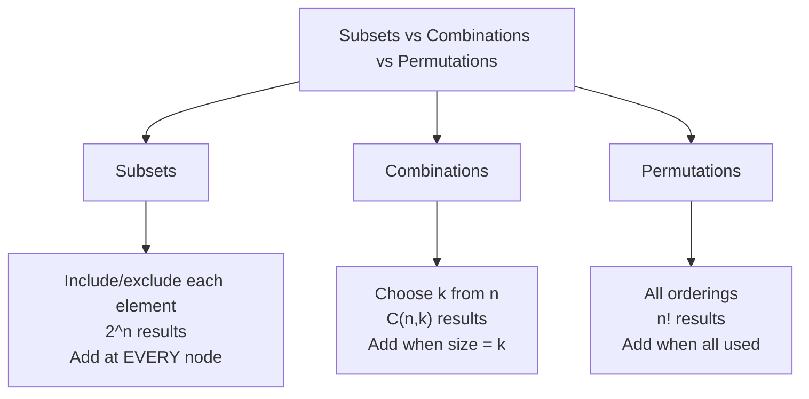

import { LanguageSelector, TimeEstimate, ConfidenceBuilder, DifficultyBadge } from '@site/src/components/interview-guide';
import { CodeTabs } from '@site/src/components/design-patterns/CodeTabs';
import TabItem from '@theme/TabItem';

# Subsets & Combinations: Generate Everything

Classic backtracking problems. The key differences:
- **Subsets:** Add result at every node
- **Combinations:** Add only when size = k
- **Permutations:** Use all elements exactly once

<LanguageSelector />

<TimeEstimate
  learnTime="30-35 minutes"
  practiceTime="4-5 hours"
  masteryTime="10-12 problems"
  interviewFrequency="25%"
  difficultyRange="Medium"
  prerequisites="Recursion, Backtracking basics"
/>

---

## Decision Tree Comparison



---

## Subsets (Power Set)

Generate all 2^n subsets.

<CodeTabs>
<TabItem value="python" label="Python">

```python
def subsets(nums: list[int]) -> list[list[int]]:
    """
    Generate all subsets (power set).
    Time: O(n × 2^n), Space: O(n) recursion depth
    
    Key insight: At each node, the current path IS a valid subset.
    So we add to result at EVERY recursive call, not just leaves.
    """
    result: list[list[int]] = []
    
    def backtrack(start: int, current: list[int]) -> None:
        # Add current subset (every path is valid)
        result.append(current[:])
        
        # Try adding each remaining element
        for i in range(start, len(nums)):
            current.append(nums[i])
            backtrack(i + 1, current)  # i+1 to avoid duplicates
            current.pop()  # Backtrack
    
    backtrack(0, [])
    return result


# Example: [1, 2, 3]
# Tree:
#           []
#     /     |      \
#   [1]    [2]     [3]
#   / \     |
# [1,2] [1,3] [2,3]
#   |
# [1,2,3]
#
# Result: [[], [1], [1,2], [1,2,3], [1,3], [2], [2,3], [3]]
```

</TabItem>
<TabItem value="typescript" label="TypeScript">

```typescript
function subsets(nums: number[]): number[][] {
  const result: number[][] = [];

  function backtrack(start: number, current: number[]): void {
    result.push([...current]);

    for (let i = start; i < nums.length; i++) {
      current.push(nums[i]);
      backtrack(i + 1, current);
      current.pop();
    }
  }

  backtrack(0, []);
  return result;
}
```

</TabItem>
<TabItem value="go" label="Go">

```go
func subsets(nums []int) [][]int {
    result := [][]int{}
    
    var backtrack func(start int, current []int)
    backtrack = func(start int, current []int) {
        // Make a copy to add to result
        subset := make([]int, len(current))
        copy(subset, current)
        result = append(result, subset)
        
        for i := start; i < len(nums); i++ {
            backtrack(i+1, append(current, nums[i]))
        }
    }
    
    backtrack(0, []int{})
    return result
}
```

</TabItem>
<TabItem value="java" label="Java">

```java
public List<List<Integer>> subsets(int[] nums) {
    List<List<Integer>> result = new ArrayList<>();
    backtrack(nums, 0, new ArrayList<>(), result);
    return result;
}

private void backtrack(int[] nums, int start, List<Integer> current, 
                       List<List<Integer>> result) {
    result.add(new ArrayList<>(current));
    
    for (int i = start; i < nums.length; i++) {
        current.add(nums[i]);
        backtrack(nums, i + 1, current, result);
        current.remove(current.size() - 1);
    }
}
```

</TabItem>
<TabItem value="cpp" label="C++">

```cpp
vector<vector<int>> subsets(vector<int>& nums) {
    vector<vector<int>> result;
    vector<int> current;
    
    function<void(int)> backtrack = [&](int start) {
        result.push_back(current);
        
        for (int i = start; i < nums.size(); i++) {
            current.push_back(nums[i]);
            backtrack(i + 1);
            current.pop_back();
        }
    };
    
    backtrack(0);
    return result;
}
```

</TabItem>
<TabItem value="csharp" label="C#">

```csharp
public IList<IList<int>> Subsets(int[] nums) {
    List<IList<int>> result = new();
    Backtrack(nums, 0, new List<int>(), result);
    return result;
}

private void Backtrack(int[] nums, int start, List<int> current, 
                       List<IList<int>> result) {
    result.Add(new List<int>(current));
    
    for (int i = start; i < nums.Length; i++) {
        current.Add(nums[i]);
        Backtrack(nums, i + 1, current, result);
        current.RemoveAt(current.Count - 1);
    }
}
```

</TabItem>
</CodeTabs>

---

## Subsets with Duplicates

Handle duplicate elements by sorting and skipping.

<CodeTabs>
<TabItem value="python" label="Python">

```python
def subsets_with_dup(nums: list[int]) -> list[list[int]]:
    """
    Generate subsets when input has duplicates.
    Key: Sort first, then skip consecutive same elements at same level.
    """
    nums.sort()  # Critical: sort first
    result: list[list[int]] = []
    
    def backtrack(start: int, current: list[int]) -> None:
        result.append(current[:])
        
        for i in range(start, len(nums)):
            # Skip duplicates at same level
            if i > start and nums[i] == nums[i - 1]:
                continue
            
            current.append(nums[i])
            backtrack(i + 1, current)
            current.pop()
    
    backtrack(0, [])
    return result


# Example: [1, 2, 2]
# Without skip: would generate [1,2], [1,2] twice
# With skip: only generates [1,2] once
```

</TabItem>
<TabItem value="typescript" label="TypeScript">

```typescript
function subsetsWithDup(nums: number[]): number[][] {
  nums.sort((a, b) => a - b);
  const result: number[][] = [];

  function backtrack(start: number, current: number[]): void {
    result.push([...current]);

    for (let i = start; i < nums.length; i++) {
      if (i > start && nums[i] === nums[i - 1]) continue;

      current.push(nums[i]);
      backtrack(i + 1, current);
      current.pop();
    }
  }

  backtrack(0, []);
  return result;
}
```

</TabItem>
<TabItem value="java" label="Java">

```java
public List<List<Integer>> subsetsWithDup(int[] nums) {
    Arrays.sort(nums);
    List<List<Integer>> result = new ArrayList<>();
    backtrackDup(nums, 0, new ArrayList<>(), result);
    return result;
}

private void backtrackDup(int[] nums, int start, List<Integer> current, 
                          List<List<Integer>> result) {
    result.add(new ArrayList<>(current));
    
    for (int i = start; i < nums.length; i++) {
        if (i > start && nums[i] == nums[i - 1]) continue;
        
        current.add(nums[i]);
        backtrackDup(nums, i + 1, current, result);
        current.remove(current.size() - 1);
    }
}
```

</TabItem>
</CodeTabs>

---

## Combinations (Choose k from n)

<CodeTabs>
<TabItem value="python" label="Python">

```python
def combine(n: int, k: int) -> list[list[int]]:
    """
    Generate all combinations of k numbers from 1 to n.
    C(n,k) = n! / (k! × (n-k)!)
    
    Key difference from subsets: Only add when len(current) == k
    """
    result: list[list[int]] = []
    
    def backtrack(start: int, current: list[int]) -> None:
        # Only add when we have exactly k elements
        if len(current) == k:
            result.append(current[:])
            return
        
        # Optimization: stop early if not enough elements remaining
        # Need (k - len(current)) more elements
        # Have (n - start + 1) elements left
        remaining_needed = k - len(current)
        
        for i in range(start, n - remaining_needed + 2):
            current.append(i)
            backtrack(i + 1, current)
            current.pop()
    
    backtrack(1, [])
    return result


# combine(4, 2) → [[1,2], [1,3], [1,4], [2,3], [2,4], [3,4]]
```

</TabItem>
<TabItem value="typescript" label="TypeScript">

```typescript
function combine(n: number, k: number): number[][] {
  const result: number[][] = [];

  function backtrack(start: number, current: number[]): void {
    if (current.length === k) {
      result.push([...current]);
      return;
    }

    const remaining = k - current.length;
    for (let i = start; i <= n - remaining + 1; i++) {
      current.push(i);
      backtrack(i + 1, current);
      current.pop();
    }
  }

  backtrack(1, []);
  return result;
}
```

</TabItem>
<TabItem value="go" label="Go">

```go
func combine(n int, k int) [][]int {
    result := [][]int{}
    
    var backtrack func(start int, current []int)
    backtrack = func(start int, current []int) {
        if len(current) == k {
            combo := make([]int, k)
            copy(combo, current)
            result = append(result, combo)
            return
        }
        
        remaining := k - len(current)
        for i := start; i <= n-remaining+1; i++ {
            backtrack(i+1, append(current, i))
        }
    }
    
    backtrack(1, []int{})
    return result
}
```

</TabItem>
<TabItem value="java" label="Java">

```java
public List<List<Integer>> combine(int n, int k) {
    List<List<Integer>> result = new ArrayList<>();
    backtrackCombine(n, k, 1, new ArrayList<>(), result);
    return result;
}

private void backtrackCombine(int n, int k, int start, List<Integer> current, 
                              List<List<Integer>> result) {
    if (current.size() == k) {
        result.add(new ArrayList<>(current));
        return;
    }
    
    int remaining = k - current.size();
    for (int i = start; i <= n - remaining + 1; i++) {
        current.add(i);
        backtrackCombine(n, k, i + 1, current, result);
        current.remove(current.size() - 1);
    }
}
```

</TabItem>
<TabItem value="cpp" label="C++">

```cpp
vector<vector<int>> combine(int n, int k) {
    vector<vector<int>> result;
    vector<int> current;
    
    function<void(int)> backtrack = [&](int start) {
        if (current.size() == k) {
            result.push_back(current);
            return;
        }
        
        int remaining = k - current.size();
        for (int i = start; i <= n - remaining + 1; i++) {
            current.push_back(i);
            backtrack(i + 1);
            current.pop_back();
        }
    };
    
    backtrack(1);
    return result;
}
```

</TabItem>
<TabItem value="csharp" label="C#">

```csharp
public IList<IList<int>> Combine(int n, int k) {
    List<IList<int>> result = new();
    BacktrackCombine(n, k, 1, new List<int>(), result);
    return result;
}

private void BacktrackCombine(int n, int k, int start, List<int> current, 
                              List<IList<int>> result) {
    if (current.Count == k) {
        result.Add(new List<int>(current));
        return;
    }
    
    int remaining = k - current.Count;
    for (int i = start; i <= n - remaining + 1; i++) {
        current.Add(i);
        BacktrackCombine(n, k, i + 1, current, result);
        current.RemoveAt(current.Count - 1);
    }
}
```

</TabItem>
</CodeTabs>

---

## Combination Sum (Elements Can Repeat)

<CodeTabs>
<TabItem value="python" label="Python">

```python
def combination_sum(candidates: list[int], target: int) -> list[list[int]]:
    """
    Find all combinations that sum to target.
    Same element CAN be used multiple times.
    
    Key: Pass i (not i+1) to allow reusing same element.
    """
    result: list[list[int]] = []
    
    def backtrack(start: int, current: list[int], remaining: int) -> None:
        if remaining == 0:
            result.append(current[:])
            return
        
        for i in range(start, len(candidates)):
            if candidates[i] > remaining:
                continue  # Skip if too large
            
            current.append(candidates[i])
            # Pass i (not i+1) to allow reusing same element
            backtrack(i, current, remaining - candidates[i])
            current.pop()
    
    backtrack(0, [], target)
    return result


# combination_sum([2,3,6,7], 7)
# → [[2,2,3], [7]]
```

</TabItem>
<TabItem value="typescript" label="TypeScript">

```typescript
function combinationSum(candidates: number[], target: number): number[][] {
  const result: number[][] = [];

  function backtrack(start: number, current: number[], remaining: number): void {
    if (remaining === 0) {
      result.push([...current]);
      return;
    }

    for (let i = start; i < candidates.length; i++) {
      if (candidates[i] > remaining) continue;

      current.push(candidates[i]);
      backtrack(i, current, remaining - candidates[i]); // i, not i+1
      current.pop();
    }
  }

  backtrack(0, [], target);
  return result;
}
```

</TabItem>
<TabItem value="java" label="Java">

```java
public List<List<Integer>> combinationSum(int[] candidates, int target) {
    List<List<Integer>> result = new ArrayList<>();
    backtrackSum(candidates, target, 0, new ArrayList<>(), result);
    return result;
}

private void backtrackSum(int[] candidates, int remaining, int start, 
                          List<Integer> current, List<List<Integer>> result) {
    if (remaining == 0) {
        result.add(new ArrayList<>(current));
        return;
    }
    
    for (int i = start; i < candidates.length; i++) {
        if (candidates[i] > remaining) continue;
        
        current.add(candidates[i]);
        backtrackSum(candidates, remaining - candidates[i], i, current, result);
        current.remove(current.size() - 1);
    }
}
```

</TabItem>
</CodeTabs>

---

## Permutations

Generate all n! orderings.

<CodeTabs>
<TabItem value="python" label="Python">

```python
def permute(nums: list[int]) -> list[list[int]]:
    """
    Generate all permutations. n! results.
    
    Key difference: Can use any remaining element (not just after start).
    """
    result: list[list[int]] = []
    
    def backtrack(current: list[int], remaining: list[int]) -> None:
        if not remaining:
            result.append(current[:])
            return
        
        for i in range(len(remaining)):
            current.append(remaining[i])
            # Remove element i from remaining
            backtrack(current, remaining[:i] + remaining[i+1:])
            current.pop()
    
    backtrack([], nums)
    return result


# Alternative: In-place with swap
def permute_swap(nums: list[int]) -> list[list[int]]:
    result: list[list[int]] = []
    
    def backtrack(start: int) -> None:
        if start == len(nums):
            result.append(nums[:])
            return
        
        for i in range(start, len(nums)):
            nums[start], nums[i] = nums[i], nums[start]  # Swap
            backtrack(start + 1)
            nums[start], nums[i] = nums[i], nums[start]  # Swap back
    
    backtrack(0)
    return result
```

</TabItem>
<TabItem value="typescript" label="TypeScript">

```typescript
function permute(nums: number[]): number[][] {
  const result: number[][] = [];

  function backtrack(current: number[], remaining: number[]): void {
    if (remaining.length === 0) {
      result.push([...current]);
      return;
    }

    for (let i = 0; i < remaining.length; i++) {
      current.push(remaining[i]);
      backtrack(current, [...remaining.slice(0, i), ...remaining.slice(i + 1)]);
      current.pop();
    }
  }

  backtrack([], nums);
  return result;
}
```

</TabItem>
<TabItem value="go" label="Go">

```go
func permute(nums []int) [][]int {
    result := [][]int{}
    
    var backtrack func(current, remaining []int)
    backtrack = func(current, remaining []int) {
        if len(remaining) == 0 {
            perm := make([]int, len(current))
            copy(perm, current)
            result = append(result, perm)
            return
        }
        
        for i := 0; i < len(remaining); i++ {
            newRemaining := make([]int, 0, len(remaining)-1)
            newRemaining = append(newRemaining, remaining[:i]...)
            newRemaining = append(newRemaining, remaining[i+1:]...)
            backtrack(append(current, remaining[i]), newRemaining)
        }
    }
    
    backtrack([]int{}, nums)
    return result
}
```

</TabItem>
<TabItem value="java" label="Java">

```java
public List<List<Integer>> permute(int[] nums) {
    List<List<Integer>> result = new ArrayList<>();
    List<Integer> numList = new ArrayList<>();
    for (int num : nums) numList.add(num);
    backtrackPermute(numList, new ArrayList<>(), result);
    return result;
}

private void backtrackPermute(List<Integer> remaining, List<Integer> current, 
                              List<List<Integer>> result) {
    if (remaining.isEmpty()) {
        result.add(new ArrayList<>(current));
        return;
    }
    
    for (int i = 0; i < remaining.size(); i++) {
        current.add(remaining.get(i));
        List<Integer> newRemaining = new ArrayList<>(remaining);
        newRemaining.remove(i);
        backtrackPermute(newRemaining, current, result);
        current.remove(current.size() - 1);
    }
}
```

</TabItem>
<TabItem value="cpp" label="C++">

```cpp
vector<vector<int>> permute(vector<int>& nums) {
    vector<vector<int>> result;
    
    function<void(int)> backtrack = [&](int start) {
        if (start == nums.size()) {
            result.push_back(nums);
            return;
        }
        
        for (int i = start; i < nums.size(); i++) {
            swap(nums[start], nums[i]);
            backtrack(start + 1);
            swap(nums[start], nums[i]);
        }
    };
    
    backtrack(0);
    return result;
}
```

</TabItem>
<TabItem value="csharp" label="C#">

```csharp
public IList<IList<int>> Permute(int[] nums) {
    List<IList<int>> result = new();
    BacktrackPermute(nums.ToList(), new List<int>(), result);
    return result;
}

private void BacktrackPermute(List<int> remaining, List<int> current, 
                              List<IList<int>> result) {
    if (remaining.Count == 0) {
        result.Add(new List<int>(current));
        return;
    }
    
    for (int i = 0; i < remaining.Count; i++) {
        current.Add(remaining[i]);
        var newRemaining = remaining.Where((_, idx) => idx != i).ToList();
        BacktrackPermute(newRemaining, current, result);
        current.RemoveAt(current.Count - 1);
    }
}
```

</TabItem>
</CodeTabs>

---

## 🎯 Template Summary

| Problem | When to Add | Loop Range | Key Difference |
|---------|-------------|------------|----------------|
| **Subsets** | Every call | `start` to `n` | Add immediately |
| **Combinations** | When `size == k` | `start` to `n-remaining+1` | Pruning optimization |
| **Permutations** | When all used | All remaining | No `start` index |
| **With Duplicates** | Same as above | Skip `if nums[i] == nums[i-1]` | Sort first |

---

## 🏋️ Practice Problems

| Problem | Difficulty | Type |
|---------|------------|------|
| [Subsets](https://leetcode.com/problems/subsets/) | <DifficultyBadge level="medium" /> | Basic |
| [Subsets II](https://leetcode.com/problems/subsets-ii/) | <DifficultyBadge level="medium" /> | Duplicates |
| [Combinations](https://leetcode.com/problems/combinations/) | <DifficultyBadge level="medium" /> | Basic |
| [Combination Sum](https://leetcode.com/problems/combination-sum/) | <DifficultyBadge level="medium" /> | Reuse allowed |
| [Permutations](https://leetcode.com/problems/permutations/) | <DifficultyBadge level="medium" /> | Basic |
| [Permutations II](https://leetcode.com/problems/permutations-ii/) | <DifficultyBadge level="medium" /> | Duplicates |

---

## Key Takeaways

1. **Subsets:** Add result at EVERY node—every path is a valid subset.

2. **Combinations:** Add only when size equals k—prune early.

3. **Permutations:** Use each element exactly once—track remaining.

4. **Duplicates:** Sort first, then skip `nums[i] == nums[i-1]` at same level.

5. **Reuse allowed:** Pass `i` (not `i+1`) to reuse same element.

<ConfidenceBuilder type="youve-got-this">

**Three templates, countless problems.**

The core patterns are identical. What changes is WHEN you add to results and whether you move `start` forward. Master these templates and the problems become mechanical.

</ConfidenceBuilder>

---

## What's Next?

More backtracking patterns:

**See also:** [Backtracking Introduction](/docs/interview-guide/coding/patterns/backtracking-patterns/introduction) — Core Concepts
