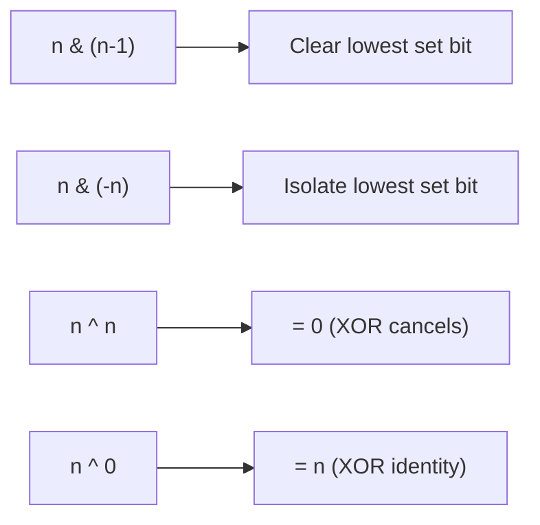

import { LanguageSelector, TimeEstimate, ConfidenceBuilder, DifficultyBadge } from '@site/src/components/interview-guide';
import { CodeTabs } from '@site/src/components/design-patterns/CodeTabs';
import TabItem from '@theme/TabItem';

# Bit Manipulation: The Low-Level Superpower

Bit manipulation seems arcane, but a handful of patterns solve many problems elegantly and efficiently.

<LanguageSelector />

<TimeEstimate
  learnTime="25-30 minutes"
  practiceTime="3-4 hours"
  masteryTime="8-10 problems"
  interviewFrequency="10%"
  difficultyRange="Easy to Hard"
  prerequisites="Binary number representation"
/>

---

## Essential Bit Operations



<CodeTabs>
<TabItem value="python" label="Python">

```python
def bit_operations_demo(n: int, i: int) -> None:
    """
    Essential bit manipulation operations.
    i = bit position (0-indexed from right)
    """
    
    # Check if bit i is set
    is_set = (n >> i) & 1 == 1
    
    # Set bit i
    set_bit = n | (1 << i)
    
    # Clear bit i
    clear_bit = n & ~(1 << i)
    
    # Toggle bit i
    toggle_bit = n ^ (1 << i)
    
    # Get lowest set bit
    lowest_set = n & (-n)
    
    # Clear lowest set bit (Brian Kernighan)
    clear_lowest = n & (n - 1)


# Count set bits (popcount)
def count_bits(n: int) -> int:
    """Count number of 1s in binary representation."""
    count = 0
    while n:
        count += n & 1
        n >>= 1
    return count


# Brian Kernighan's algorithm - faster
def count_bits_fast(n: int) -> int:
    """
    Each iteration clears the lowest set bit.
    Loops only as many times as there are 1s.
    """
    count = 0
    while n:
        n &= (n - 1)  # Clear lowest set bit
        count += 1
    return count
```

</TabItem>
<TabItem value="typescript" label="TypeScript">

```typescript
// Check if bit i is set
function isBitSet(n: number, i: number): boolean {
  return ((n >> i) & 1) === 1;
}

// Set bit i
function setBit(n: number, i: number): number {
  return n | (1 << i);
}

// Clear bit i
function clearBit(n: number, i: number): number {
  return n & ~(1 << i);
}

// Toggle bit i
function toggleBit(n: number, i: number): number {
  return n ^ (1 << i);
}

// Count set bits
function countBits(n: number): number {
  let count = 0;
  while (n) {
    n &= n - 1; // Clear lowest set bit
    count++;
  }
  return count;
}
```

</TabItem>
<TabItem value="go" label="Go">

```go
// Check if bit i is set
func isBitSet(n, i int) bool {
    return (n>>i)&1 == 1
}

// Set bit i
func setBit(n, i int) int {
    return n | (1 << i)
}

// Clear bit i
func clearBit(n, i int) int {
    return n & ^(1 << i)
}

// Toggle bit i
func toggleBit(n, i int) int {
    return n ^ (1 << i)
}

// Count set bits (Brian Kernighan)
func countBits(n int) int {
    count := 0
    for n != 0 {
        n &= (n - 1)
        count++
    }
    return count
}
```

</TabItem>
<TabItem value="java" label="Java">

```java
// Check if bit i is set
boolean isBitSet(int n, int i) {
    return ((n >> i) & 1) == 1;
}

// Set bit i
int setBit(int n, int i) {
    return n | (1 << i);
}

// Clear bit i
int clearBit(int n, int i) {
    return n & ~(1 << i);
}

// Toggle bit i
int toggleBit(int n, int i) {
    return n ^ (1 << i);
}

// Count set bits
int countBits(int n) {
    int count = 0;
    while (n != 0) {
        n &= (n - 1);
        count++;
    }
    return count;
}

// Built-in: Integer.bitCount(n)
```

</TabItem>
<TabItem value="cpp" label="C++">

```cpp
// Check if bit i is set
bool isBitSet(int n, int i) {
    return (n >> i) & 1;
}

// Set bit i
int setBit(int n, int i) {
    return n | (1 << i);
}

// Clear bit i
int clearBit(int n, int i) {
    return n & ~(1 << i);
}

// Toggle bit i
int toggleBit(int n, int i) {
    return n ^ (1 << i);
}

// Count set bits
int countBits(int n) {
    int count = 0;
    while (n) {
        n &= (n - 1);
        count++;
    }
    return count;
}

// Built-in: __builtin_popcount(n)
```

</TabItem>
<TabItem value="csharp" label="C#">

```csharp
// Check if bit i is set
bool IsBitSet(int n, int i) => ((n >> i) & 1) == 1;

// Set bit i
int SetBit(int n, int i) => n | (1 << i);

// Clear bit i
int ClearBit(int n, int i) => n & ~(1 << i);

// Toggle bit i
int ToggleBit(int n, int i) => n ^ (1 << i);

// Count set bits
int CountBits(int n) {
    int count = 0;
    while (n != 0) {
        n &= (n - 1);
        count++;
    }
    return count;
}

// Built-in: BitOperations.PopCount((uint)n)
```

</TabItem>
</CodeTabs>

---

## XOR Properties (The Magic Tool)

```
a ^ a = 0        // Same numbers cancel
a ^ 0 = a        // Identity
a ^ b ^ a = b    // Find the odd one out
a ^ b = b ^ a    // Commutative
(a ^ b) ^ c = a ^ (b ^ c)  // Associative
```

---

## Single Number (Find Unique Element)

<CodeTabs>
<TabItem value="python" label="Python">

```python
def single_number(nums: list[int]) -> int:
    """
    Every element appears twice except one. Find it.
    XOR all numbers: pairs cancel, unique remains.
    Time: O(n), Space: O(1)
    """
    result = 0
    for num in nums:
        result ^= num
    return result


# Example: [4, 1, 2, 1, 2]
# 4 ^ 1 ^ 2 ^ 1 ^ 2
# = 4 ^ (1 ^ 1) ^ (2 ^ 2)
# = 4 ^ 0 ^ 0
# = 4
```

</TabItem>
<TabItem value="typescript" label="TypeScript">

```typescript
function singleNumber(nums: number[]): number {
  return nums.reduce((acc, num) => acc ^ num, 0);
}
```

</TabItem>
<TabItem value="go" label="Go">

```go
func singleNumber(nums []int) int {
    result := 0
    for _, num := range nums {
        result ^= num
    }
    return result
}
```

</TabItem>
<TabItem value="java" label="Java">

```java
public int singleNumber(int[] nums) {
    int result = 0;
    for (int num : nums) {
        result ^= num;
    }
    return result;
}
```

</TabItem>
<TabItem value="cpp" label="C++">

```cpp
int singleNumber(vector<int>& nums) {
    int result = 0;
    for (int num : nums) {
        result ^= num;
    }
    return result;
}
```

</TabItem>
<TabItem value="csharp" label="C#">

```csharp
public int SingleNumber(int[] nums) {
    return nums.Aggregate(0, (acc, num) => acc ^ num);
}
```

</TabItem>
</CodeTabs>

---

## Two Single Numbers (Two Unique Elements)

<CodeTabs>
<TabItem value="python" label="Python">

```python
def single_number_iii(nums: list[int]) -> list[int]:
    """
    Two elements appear once, rest appear twice. Find both.
    
    Key insight: XOR of all gives a ^ b.
    Use a differing bit to separate a and b into two groups.
    """
    # XOR all: result is a ^ b (where a, b are the two unique)
    xor_all = 0
    for num in nums:
        xor_all ^= num
    
    # Find rightmost set bit (where a and b differ)
    # This bit is 1 in one unique number and 0 in the other
    diff_bit = xor_all & (-xor_all)
    
    # Separate into two groups based on this bit
    a = b = 0
    for num in nums:
        if num & diff_bit:
            a ^= num  # Numbers with this bit set
        else:
            b ^= num  # Numbers with this bit unset
    
    return [a, b]


# Example: [1, 2, 1, 3, 2, 5]
# XOR all: 1^2^1^3^2^5 = 3^5 = 110 ^ 101 = 011 (binary)
# diff_bit: 011 & 101 = 001 (rightmost set bit)
# Group 1 (bit set): 1, 1, 3, 5 → 1^1^3^5 = 3^5 = ?
# Wait, let me recalculate...
# 3 = 011, 5 = 101, diff_bit = 001
# Group with bit 0 set: 1, 1, 3, 5 (all have bit 0 = 1)
# Group with bit 0 unset: 2, 2 → XOR = 0... that's wrong
# 
# Actually: diff_bit separates 3 (011) from 5 (101) at bit 1
# 3 & 010 = 010 (set), 5 & 010 = 000 (unset)
# Let's use bit 1: diff_bit = 010
# Group 1: 2, 2, 3 → XOR = 3
# Group 2: 1, 1, 5 → XOR = 5
# Result: [3, 5]
```

</TabItem>
<TabItem value="java" label="Java">

```java
public int[] singleNumberIII(int[] nums) {
    // XOR all numbers
    int xorAll = 0;
    for (int num : nums) {
        xorAll ^= num;
    }
    
    // Find rightmost set bit
    int diffBit = xorAll & (-xorAll);
    
    // Separate into two groups
    int a = 0, b = 0;
    for (int num : nums) {
        if ((num & diffBit) != 0) {
            a ^= num;
        } else {
            b ^= num;
        }
    }
    
    return new int[]{a, b};
}
```

</TabItem>
</CodeTabs>

---

## Power of Two

<CodeTabs>
<TabItem value="python" label="Python">

```python
def is_power_of_two(n: int) -> bool:
    """
    Power of 2 has exactly one bit set: 1, 10, 100, 1000...
    n & (n-1) clears the lowest set bit.
    If result is 0, there was only one bit.
    """
    return n > 0 and (n & (n - 1)) == 0


# Examples:
# 8 = 1000, 8-1 = 0111, 1000 & 0111 = 0000 → True
# 6 = 0110, 6-1 = 0101, 0110 & 0101 = 0100 → False
```

</TabItem>
<TabItem value="typescript" label="TypeScript">

```typescript
function isPowerOfTwo(n: number): boolean {
  return n > 0 && (n & (n - 1)) === 0;
}
```

</TabItem>
<TabItem value="go" label="Go">

```go
func isPowerOfTwo(n int) bool {
    return n > 0 && (n & (n - 1)) == 0
}
```

</TabItem>
<TabItem value="java" label="Java">

```java
public boolean isPowerOfTwo(int n) {
    return n > 0 && (n & (n - 1)) == 0;
}
```

</TabItem>
</CodeTabs>

---

## Missing Number

<CodeTabs>
<TabItem value="python" label="Python">

```python
def missing_number(nums: list[int]) -> int:
    """
    Array contains n numbers from 0 to n with one missing.
    XOR all numbers with 0 to n: result is missing number.
    """
    n = len(nums)
    result = n  # Start with n (might be the missing one)
    
    for i in range(n):
        result ^= i ^ nums[i]
    
    return result


# Alternative: Math approach
def missing_number_math(nums: list[int]) -> int:
    n = len(nums)
    expected_sum = n * (n + 1) // 2
    actual_sum = sum(nums)
    return expected_sum - actual_sum
```

</TabItem>
<TabItem value="java" label="Java">

```java
public int missingNumber(int[] nums) {
    int n = nums.length;
    int result = n;
    
    for (int i = 0; i < n; i++) {
        result ^= i ^ nums[i];
    }
    
    return result;
}
```

</TabItem>
</CodeTabs>

---

## Reverse Bits

<CodeTabs>
<TabItem value="python" label="Python">

```python
def reverse_bits(n: int) -> int:
    """
    Reverse all 32 bits of an unsigned integer.
    """
    result = 0
    for _ in range(32):
        result = (result << 1) | (n & 1)
        n >>= 1
    return result


# Example: 
# n = 00000010100101000001111010011100
# reversed = 00111001011110000010100101000000
```

</TabItem>
<TabItem value="java" label="Java">

```java
public int reverseBits(int n) {
    int result = 0;
    for (int i = 0; i < 32; i++) {
        result = (result << 1) | (n & 1);
        n >>= 1;
    }
    return result;
}
```

</TabItem>
<TabItem value="cpp" label="C++">

```cpp
uint32_t reverseBits(uint32_t n) {
    uint32_t result = 0;
    for (int i = 0; i < 32; i++) {
        result = (result << 1) | (n & 1);
        n >>= 1;
    }
    return result;
}
```

</TabItem>
</CodeTabs>

---

## 🎯 Key Formulas Cheat Sheet

| Operation | Formula | Use Case |
|-----------|---------|----------|
| Clear lowest set bit | `n & (n-1)` | Count bits, power of 2 |
| Isolate lowest set bit | `n & (-n)` | Separate groups |
| Check if bit i is set | `(n >> i) & 1` | Bit inspection |
| Set bit i | `n \| (1 << i)` | Turn on bit |
| Clear bit i | `n & ~(1 << i)` | Turn off bit |
| Toggle bit i | `n ^ (1 << i)` | Flip bit |

---

## 🏋️ Practice Problems

| Problem | Pattern | Difficulty |
|---------|---------|------------|
| [Single Number](https://leetcode.com/problems/single-number/) | XOR | <DifficultyBadge level="easy" /> |
| [Number of 1 Bits](https://leetcode.com/problems/number-of-1-bits/) | Kernighan | <DifficultyBadge level="easy" /> |
| [Power of Two](https://leetcode.com/problems/power-of-two/) | `n & (n-1)` | <DifficultyBadge level="easy" /> |
| [Missing Number](https://leetcode.com/problems/missing-number/) | XOR | <DifficultyBadge level="easy" /> |
| [Single Number III](https://leetcode.com/problems/single-number-iii/) | XOR + split | <DifficultyBadge level="medium" /> |
| [Reverse Bits](https://leetcode.com/problems/reverse-bits/) | Bit by bit | <DifficultyBadge level="easy" /> |

---

## Key Takeaways

1. **XOR is the star.** `a ^ a = 0` and `a ^ 0 = a` solve many problems.

2. **`n & (n-1)` clears the lowest set bit.** Use for counting and power-of-2.

3. **`n & (-n)` isolates the lowest set bit.** Use to separate groups.

4. **Bit manipulation is O(1) space.** Replace hash maps when possible.

<ConfidenceBuilder type="youve-got-this">

**Memorize 5 formulas, solve dozens of problems.**

Bit manipulation isn't magic—it's just knowing what each operation does. XOR for finding unique elements, `n & (n-1)` for counting/power-of-2, and `n & (-n)` for isolation.

</ConfidenceBuilder>

---

## What's Next?

More bit manipulation patterns:

**See also:** [Bit Manipulation Basics](/docs/interview-guide/coding/patterns/bit-manipulation/basics) — More Operations
