import { LanguageSelector, TimeEstimate, ConfidenceBuilder, DifficultyBadge } from '@site/src/components/interview-guide';
import { CodeTabs } from '@site/src/components/design-patterns/CodeTabs';
import TabItem from '@theme/TabItem';

# Grid DP: 2D Dynamic Programming

Grid problems are DP classics: navigate from one corner to another, count paths, minimize cost, maximize value.

The first time I saw "Dungeon Game," I tried to solve it going forward like every other grid problem. I kept getting wrong answers. The insight: **some grid problems require working backward from the destination.**

When you need to know the end state to determine the start state, flip your thinking.

**State:** `dp[i][j]` = answer for cell (i, j)  
**Usually depends on:** `dp[i-1][j]`, `dp[i][j-1]`, or both

<LanguageSelector />

<TimeEstimate
  learnTime="25-35 minutes"
  practiceTime="3-4 hours"
  masteryTime="10-12 problems"
  interviewFrequency="30%"
  difficultyRange="Medium to Hard"
  prerequisites="DP Introduction"
/>

---

## Grid DP Decision Guide

```mermaid
flowchart TD
    A[Grid DP Problem] --> B{What direction?}
    
    B --> C["Start → End<br/>(top-left to bottom-right)"]
    B --> D["End → Start<br/>(need end state first)"]
    
    C --> C1["Forward DP<br/>dp[0][0] → dp[m-1][n-1]"]
    D --> D1["Backward DP<br/>dp[m-1][n-1] → dp[0][0]"]
    
    C1 --> E{Optimization goal?}
    D1 --> E
    
    E --> F["Count paths: +="]
    E --> G["Min cost: min()"]
    E --> H["Max value: max()"]
```



---

## Unique Paths

Count paths from top-left to bottom-right, moving only right or down.

<CodeTabs>
<TabItem value="python" label="Python">

```python
def unique_paths(m: int, n: int) -> int:
    """
    Count unique paths in m×n grid.
    
    State: dp[i][j] = number of paths to reach (i, j)
    Recurrence: dp[i][j] = dp[i-1][j] + dp[i][j-1]
    
    Time: O(m×n), Space: O(m×n)
    """
    dp: list[list[int]] = [[1] * n for _ in range(m)]
    
    for i in range(1, m):
        for j in range(1, n):
            dp[i][j] = dp[i - 1][j] + dp[i][j - 1]
    
    return dp[m - 1][n - 1]


def unique_paths_optimized(m: int, n: int) -> int:
    """
    Space optimized: O(n) instead of O(m×n).
    
    Key insight: We only need the previous row!
    row[j] after update = row[j] (from above) + row[j-1] (from left, already updated)
    """
    row: list[int] = [1] * n
    
    for _ in range(1, m):
        for j in range(1, n):
            row[j] += row[j - 1]
    
    return row[n - 1]
```

</TabItem>
<TabItem value="typescript" label="TypeScript">

```typescript
function uniquePaths(m: number, n: number): number {
  const dp: number[][] = Array.from({ length: m }, () => Array(n).fill(1));

  for (let i = 1; i < m; i++) {
    for (let j = 1; j < n; j++) {
      dp[i][j] = dp[i - 1][j] + dp[i][j - 1];
    }
  }

  return dp[m - 1][n - 1];
}

function uniquePathsOptimized(m: number, n: number): number {
  const row: number[] = new Array(n).fill(1);

  for (let i = 1; i < m; i++) {
    for (let j = 1; j < n; j++) {
      row[j] += row[j - 1];
    }
  }

  return row[n - 1];
}
```

</TabItem>
<TabItem value="go" label="Go">

```go
func uniquePaths(m int, n int) int {
    dp := make([][]int, m)
    for i := range dp {
        dp[i] = make([]int, n)
        for j := range dp[i] {
            dp[i][j] = 1
        }
    }
    
    for i := 1; i < m; i++ {
        for j := 1; j < n; j++ {
            dp[i][j] = dp[i-1][j] + dp[i][j-1]
        }
    }
    
    return dp[m-1][n-1]
}

func uniquePathsOptimized(m int, n int) int {
    row := make([]int, n)
    for j := range row {
        row[j] = 1
    }
    
    for i := 1; i < m; i++ {
        for j := 1; j < n; j++ {
            row[j] += row[j-1]
        }
    }
    
    return row[n-1]
}
```

</TabItem>
<TabItem value="java" label="Java">

```java
public int uniquePaths(int m, int n) {
    int[][] dp = new int[m][n];
    
    for (int i = 0; i < m; i++) dp[i][0] = 1;
    for (int j = 0; j < n; j++) dp[0][j] = 1;
    
    for (int i = 1; i < m; i++) {
        for (int j = 1; j < n; j++) {
            dp[i][j] = dp[i - 1][j] + dp[i][j - 1];
        }
    }
    
    return dp[m - 1][n - 1];
}

public int uniquePathsOptimized(int m, int n) {
    int[] row = new int[n];
    Arrays.fill(row, 1);
    
    for (int i = 1; i < m; i++) {
        for (int j = 1; j < n; j++) {
            row[j] += row[j - 1];
        }
    }
    
    return row[n - 1];
}
```

</TabItem>
<TabItem value="cpp" label="C++">

```cpp
int uniquePaths(int m, int n) {
    vector<vector<int>> dp(m, vector<int>(n, 1));
    
    for (int i = 1; i < m; i++) {
        for (int j = 1; j < n; j++) {
            dp[i][j] = dp[i - 1][j] + dp[i][j - 1];
        }
    }
    
    return dp[m - 1][n - 1];
}

int uniquePathsOptimized(int m, int n) {
    vector<int> row(n, 1);
    
    for (int i = 1; i < m; i++) {
        for (int j = 1; j < n; j++) {
            row[j] += row[j - 1];
        }
    }
    
    return row[n - 1];
}
```

</TabItem>
<TabItem value="c" label="C">

```c
int uniquePaths(int m, int n) {
    int* row = (int*)malloc(n * sizeof(int));
    for (int j = 0; j < n; j++) {
        row[j] = 1;
    }
    
    for (int i = 1; i < m; i++) {
        for (int j = 1; j < n; j++) {
            row[j] += row[j - 1];
        }
    }
    
    int result = row[n - 1];
    free(row);
    return result;
}
```

</TabItem>
<TabItem value="csharp" label="C#">

```csharp
public int UniquePaths(int m, int n) {
    int[,] dp = new int[m, n];
    
    for (int i = 0; i < m; i++) dp[i, 0] = 1;
    for (int j = 0; j < n; j++) dp[0, j] = 1;
    
    for (int i = 1; i < m; i++) {
        for (int j = 1; j < n; j++) {
            dp[i, j] = dp[i - 1, j] + dp[i, j - 1];
        }
    }
    
    return dp[m - 1, n - 1];
}

public int UniquePathsOptimized(int m, int n) {
    int[] row = Enumerable.Repeat(1, n).ToArray();
    
    for (int i = 1; i < m; i++) {
        for (int j = 1; j < n; j++) {
            row[j] += row[j - 1];
        }
    }
    
    return row[n - 1];
}
```

</TabItem>
</CodeTabs>

---

## Unique Paths II (With Obstacles)

<CodeTabs>
<TabItem value="python" label="Python">

```python
def unique_paths_with_obstacles(obstacle_grid: list[list[int]]) -> int:
    """
    Count paths avoiding obstacles (1 = obstacle, 0 = free).
    
    Key insight: If cell is obstacle, dp[i][j] = 0
    """
    m, n = len(obstacle_grid), len(obstacle_grid[0])
    
    if obstacle_grid[0][0] == 1:
        return 0
    
    dp: list[list[int]] = [[0] * n for _ in range(m)]
    dp[0][0] = 1
    
    # First row: propagate until obstacle
    for j in range(1, n):
        dp[0][j] = dp[0][j - 1] if obstacle_grid[0][j] == 0 else 0
    
    # First column: propagate until obstacle
    for i in range(1, m):
        dp[i][0] = dp[i - 1][0] if obstacle_grid[i][0] == 0 else 0
    
    # Rest of grid
    for i in range(1, m):
        for j in range(1, n):
            if obstacle_grid[i][j] == 0:
                dp[i][j] = dp[i - 1][j] + dp[i][j - 1]
            # else: dp[i][j] remains 0
    
    return dp[m - 1][n - 1]
```

</TabItem>
<TabItem value="typescript" label="TypeScript">

```typescript
function uniquePathsWithObstacles(obstacleGrid: number[][]): number {
  const m = obstacleGrid.length;
  const n = obstacleGrid[0].length;

  if (obstacleGrid[0][0] === 1) return 0;

  const dp: number[][] = Array.from({ length: m }, () => Array(n).fill(0));
  dp[0][0] = 1;

  for (let j = 1; j < n; j++) {
    dp[0][j] = obstacleGrid[0][j] === 0 ? dp[0][j - 1] : 0;
  }

  for (let i = 1; i < m; i++) {
    dp[i][0] = obstacleGrid[i][0] === 0 ? dp[i - 1][0] : 0;
  }

  for (let i = 1; i < m; i++) {
    for (let j = 1; j < n; j++) {
      if (obstacleGrid[i][j] === 0) {
        dp[i][j] = dp[i - 1][j] + dp[i][j - 1];
      }
    }
  }

  return dp[m - 1][n - 1];
}
```

</TabItem>
<TabItem value="java" label="Java">

```java
public int uniquePathsWithObstacles(int[][] obstacleGrid) {
    int m = obstacleGrid.length;
    int n = obstacleGrid[0].length;
    
    if (obstacleGrid[0][0] == 1) return 0;
    
    int[][] dp = new int[m][n];
    dp[0][0] = 1;
    
    for (int j = 1; j < n; j++) {
        dp[0][j] = obstacleGrid[0][j] == 0 ? dp[0][j - 1] : 0;
    }
    
    for (int i = 1; i < m; i++) {
        dp[i][0] = obstacleGrid[i][0] == 0 ? dp[i - 1][0] : 0;
    }
    
    for (int i = 1; i < m; i++) {
        for (int j = 1; j < n; j++) {
            if (obstacleGrid[i][j] == 0) {
                dp[i][j] = dp[i - 1][j] + dp[i][j - 1];
            }
        }
    }
    
    return dp[m - 1][n - 1];
}
```

</TabItem>
<TabItem value="go" label="Go">

```go
func uniquePathsWithObstacles(obstacleGrid [][]int) int {
    m, n := len(obstacleGrid), len(obstacleGrid[0])
    
    if obstacleGrid[0][0] == 1 {
        return 0
    }
    
    dp := make([][]int, m)
    for i := range dp {
        dp[i] = make([]int, n)
    }
    dp[0][0] = 1
    
    for j := 1; j < n; j++ {
        if obstacleGrid[0][j] == 0 {
            dp[0][j] = dp[0][j-1]
        }
    }
    
    for i := 1; i < m; i++ {
        if obstacleGrid[i][0] == 0 {
            dp[i][0] = dp[i-1][0]
        }
    }
    
    for i := 1; i < m; i++ {
        for j := 1; j < n; j++ {
            if obstacleGrid[i][j] == 0 {
                dp[i][j] = dp[i-1][j] + dp[i][j-1]
            }
        }
    }
    
    return dp[m-1][n-1]
}
```

</TabItem>
<TabItem value="cpp" label="C++">

```cpp
int uniquePathsWithObstacles(vector<vector<int>>& obstacleGrid) {
    int m = obstacleGrid.size();
    int n = obstacleGrid[0].size();
    
    if (obstacleGrid[0][0] == 1) return 0;
    
    vector<vector<long>> dp(m, vector<long>(n, 0));
    dp[0][0] = 1;
    
    for (int j = 1; j < n; j++) {
        dp[0][j] = obstacleGrid[0][j] == 0 ? dp[0][j - 1] : 0;
    }
    
    for (int i = 1; i < m; i++) {
        dp[i][0] = obstacleGrid[i][0] == 0 ? dp[i - 1][0] : 0;
    }
    
    for (int i = 1; i < m; i++) {
        for (int j = 1; j < n; j++) {
            if (obstacleGrid[i][j] == 0) {
                dp[i][j] = dp[i - 1][j] + dp[i][j - 1];
            }
        }
    }
    
    return dp[m - 1][n - 1];
}
```

</TabItem>
<TabItem value="c" label="C">

```c
int uniquePathsWithObstacles(int** obstacleGrid, int m, int* colSizes) {
    int n = colSizes[0];
    
    if (obstacleGrid[0][0] == 1) return 0;
    
    long** dp = (long**)calloc(m, sizeof(long*));
    for (int i = 0; i < m; i++) {
        dp[i] = (long*)calloc(n, sizeof(long));
    }
    dp[0][0] = 1;
    
    for (int j = 1; j < n; j++) {
        dp[0][j] = obstacleGrid[0][j] == 0 ? dp[0][j - 1] : 0;
    }
    
    for (int i = 1; i < m; i++) {
        dp[i][0] = obstacleGrid[i][0] == 0 ? dp[i - 1][0] : 0;
    }
    
    for (int i = 1; i < m; i++) {
        for (int j = 1; j < n; j++) {
            if (obstacleGrid[i][j] == 0) {
                dp[i][j] = dp[i - 1][j] + dp[i][j - 1];
            }
        }
    }
    
    int result = (int)dp[m - 1][n - 1];
    for (int i = 0; i < m; i++) free(dp[i]);
    free(dp);
    return result;
}
```

</TabItem>
<TabItem value="csharp" label="C#">

```csharp
public int UniquePathsWithObstacles(int[][] obstacleGrid) {
    int m = obstacleGrid.Length;
    int n = obstacleGrid[0].Length;
    
    if (obstacleGrid[0][0] == 1) return 0;
    
    int[,] dp = new int[m, n];
    dp[0, 0] = 1;
    
    for (int j = 1; j < n; j++) {
        dp[0, j] = obstacleGrid[0][j] == 0 ? dp[0, j - 1] : 0;
    }
    
    for (int i = 1; i < m; i++) {
        dp[i, 0] = obstacleGrid[i][0] == 0 ? dp[i - 1, 0] : 0;
    }
    
    for (int i = 1; i < m; i++) {
        for (int j = 1; j < n; j++) {
            if (obstacleGrid[i][j] == 0) {
                dp[i, j] = dp[i - 1, j] + dp[i, j - 1];
            }
        }
    }
    
    return dp[m - 1, n - 1];
}
```

</TabItem>
</CodeTabs>

---

## Minimum Path Sum

<CodeTabs>
<TabItem value="python" label="Python">

```python
def min_path_sum(grid: list[list[int]]) -> int:
    """
    Find path from top-left to bottom-right with minimum sum.
    
    State: dp[i][j] = minimum sum to reach (i, j)
    Recurrence: dp[i][j] = grid[i][j] + min(dp[i-1][j], dp[i][j-1])
    """
    m, n = len(grid), len(grid[0])
    dp: list[list[int]] = [[0] * n for _ in range(m)]
    
    dp[0][0] = grid[0][0]
    
    # First row: can only come from left
    for j in range(1, n):
        dp[0][j] = dp[0][j - 1] + grid[0][j]
    
    # First column: can only come from above
    for i in range(1, m):
        dp[i][0] = dp[i - 1][0] + grid[i][0]
    
    # Rest: min of coming from above or left
    for i in range(1, m):
        for j in range(1, n):
            dp[i][j] = min(dp[i - 1][j], dp[i][j - 1]) + grid[i][j]
    
    return dp[m - 1][n - 1]
```

</TabItem>
<TabItem value="typescript" label="TypeScript">

```typescript
function minPathSum(grid: number[][]): number {
  const m = grid.length;
  const n = grid[0].length;
  const dp: number[][] = Array.from({ length: m }, () => Array(n).fill(0));

  dp[0][0] = grid[0][0];

  for (let j = 1; j < n; j++) {
    dp[0][j] = dp[0][j - 1] + grid[0][j];
  }

  for (let i = 1; i < m; i++) {
    dp[i][0] = dp[i - 1][0] + grid[i][0];
  }

  for (let i = 1; i < m; i++) {
    for (let j = 1; j < n; j++) {
      dp[i][j] = Math.min(dp[i - 1][j], dp[i][j - 1]) + grid[i][j];
    }
  }

  return dp[m - 1][n - 1];
}
```

</TabItem>
<TabItem value="java" label="Java">

```java
public int minPathSum(int[][] grid) {
    int m = grid.length;
    int n = grid[0].length;
    int[][] dp = new int[m][n];
    
    dp[0][0] = grid[0][0];
    
    for (int j = 1; j < n; j++) {
        dp[0][j] = dp[0][j - 1] + grid[0][j];
    }
    
    for (int i = 1; i < m; i++) {
        dp[i][0] = dp[i - 1][0] + grid[i][0];
    }
    
    for (int i = 1; i < m; i++) {
        for (int j = 1; j < n; j++) {
            dp[i][j] = Math.min(dp[i - 1][j], dp[i][j - 1]) + grid[i][j];
        }
    }
    
    return dp[m - 1][n - 1];
}
```

</TabItem>
<TabItem value="go" label="Go">

```go
func minPathSum(grid [][]int) int {
    m, n := len(grid), len(grid[0])
    dp := make([][]int, m)
    for i := range dp {
        dp[i] = make([]int, n)
    }
    
    dp[0][0] = grid[0][0]
    
    for j := 1; j < n; j++ {
        dp[0][j] = dp[0][j-1] + grid[0][j]
    }
    
    for i := 1; i < m; i++ {
        dp[i][0] = dp[i-1][0] + grid[i][0]
    }
    
    for i := 1; i < m; i++ {
        for j := 1; j < n; j++ {
            dp[i][j] = min(dp[i-1][j], dp[i][j-1]) + grid[i][j]
        }
    }
    
    return dp[m-1][n-1]
}
```

</TabItem>
<TabItem value="cpp" label="C++">

```cpp
int minPathSum(vector<vector<int>>& grid) {
    int m = grid.size();
    int n = grid[0].size();
    vector<vector<int>> dp(m, vector<int>(n));
    
    dp[0][0] = grid[0][0];
    
    for (int j = 1; j < n; j++) {
        dp[0][j] = dp[0][j - 1] + grid[0][j];
    }
    
    for (int i = 1; i < m; i++) {
        dp[i][0] = dp[i - 1][0] + grid[i][0];
    }
    
    for (int i = 1; i < m; i++) {
        for (int j = 1; j < n; j++) {
            dp[i][j] = min(dp[i - 1][j], dp[i][j - 1]) + grid[i][j];
        }
    }
    
    return dp[m - 1][n - 1];
}
```

</TabItem>
<TabItem value="c" label="C">

```c
int minPathSum(int** grid, int m, int* colSizes) {
    int n = colSizes[0];
    int** dp = (int**)malloc(m * sizeof(int*));
    for (int i = 0; i < m; i++) {
        dp[i] = (int*)malloc(n * sizeof(int));
    }
    
    dp[0][0] = grid[0][0];
    
    for (int j = 1; j < n; j++) {
        dp[0][j] = dp[0][j - 1] + grid[0][j];
    }
    
    for (int i = 1; i < m; i++) {
        dp[i][0] = dp[i - 1][0] + grid[i][0];
    }
    
    for (int i = 1; i < m; i++) {
        for (int j = 1; j < n; j++) {
            dp[i][j] = (dp[i - 1][j] < dp[i][j - 1] ? dp[i - 1][j] : dp[i][j - 1]) + grid[i][j];
        }
    }
    
    int result = dp[m - 1][n - 1];
    for (int i = 0; i < m; i++) free(dp[i]);
    free(dp);
    return result;
}
```

</TabItem>
<TabItem value="csharp" label="C#">

```csharp
public int MinPathSum(int[][] grid) {
    int m = grid.Length;
    int n = grid[0].Length;
    int[,] dp = new int[m, n];
    
    dp[0, 0] = grid[0][0];
    
    for (int j = 1; j < n; j++) {
        dp[0, j] = dp[0, j - 1] + grid[0][j];
    }
    
    for (int i = 1; i < m; i++) {
        dp[i, 0] = dp[i - 1, 0] + grid[i][0];
    }
    
    for (int i = 1; i < m; i++) {
        for (int j = 1; j < n; j++) {
            dp[i, j] = Math.Min(dp[i - 1, j], dp[i, j - 1]) + grid[i][j];
        }
    }
    
    return dp[m - 1, n - 1];
}
```

</TabItem>
</CodeTabs>

---

## Dungeon Game (Backward DP)

Find minimum initial health to reach bottom-right. This requires **backward DP** because we need to know the end state.

<CodeTabs>
<TabItem value="python" label="Python">

```python
def calculate_minimum_hp(dungeon: list[list[int]]) -> int:
    """
    Minimum initial health to survive dungeon.
    
    Key insight: Work BACKWARD from destination.
    dp[i][j] = minimum health needed at (i,j) to survive.
    
    Why backward? Because health needed at start depends on
    path taken, and we need to ensure we survive at the END.
    """
    m, n = len(dungeon), len(dungeon[0])
    
    # dp[i][j] = min health needed to survive from (i,j) to end
    dp: list[list[int]] = [[float('inf')] * (n + 1) for _ in range(m + 1)]
    
    # Need at least 1 HP at destination
    dp[m][n - 1] = dp[m - 1][n] = 1
    
    # Fill backward
    for i in range(m - 1, -1, -1):
        for j in range(n - 1, -1, -1):
            # Min health needed from next cells
            min_next = min(dp[i + 1][j], dp[i][j + 1])
            
            # Health needed at current cell
            # If dungeon[i][j] is positive (heal), need less
            # If dungeon[i][j] is negative (damage), need more
            dp[i][j] = max(1, min_next - dungeon[i][j])
    
    return dp[0][0]
```

</TabItem>
<TabItem value="typescript" label="TypeScript">

```typescript
function calculateMinimumHP(dungeon: number[][]): number {
  const m = dungeon.length;
  const n = dungeon[0].length;

  const dp: number[][] = Array.from({ length: m + 1 }, () =>
    Array(n + 1).fill(Infinity)
  );

  dp[m][n - 1] = dp[m - 1][n] = 1;

  for (let i = m - 1; i >= 0; i--) {
    for (let j = n - 1; j >= 0; j--) {
      const minNext = Math.min(dp[i + 1][j], dp[i][j + 1]);
      dp[i][j] = Math.max(1, minNext - dungeon[i][j]);
    }
  }

  return dp[0][0];
}
```

</TabItem>
<TabItem value="java" label="Java">

```java
public int calculateMinimumHP(int[][] dungeon) {
    int m = dungeon.length;
    int n = dungeon[0].length;
    
    int[][] dp = new int[m + 1][n + 1];
    for (int[] row : dp) Arrays.fill(row, Integer.MAX_VALUE);
    
    dp[m][n - 1] = dp[m - 1][n] = 1;
    
    for (int i = m - 1; i >= 0; i--) {
        for (int j = n - 1; j >= 0; j--) {
            int minNext = Math.min(dp[i + 1][j], dp[i][j + 1]);
            dp[i][j] = Math.max(1, minNext - dungeon[i][j]);
        }
    }
    
    return dp[0][0];
}
```

</TabItem>
<TabItem value="go" label="Go">

```go
func calculateMinimumHP(dungeon [][]int) int {
    m, n := len(dungeon), len(dungeon[0])
    
    dp := make([][]int, m+1)
    for i := range dp {
        dp[i] = make([]int, n+1)
        for j := range dp[i] {
            dp[i][j] = math.MaxInt32
        }
    }
    
    dp[m][n-1], dp[m-1][n] = 1, 1
    
    for i := m - 1; i >= 0; i-- {
        for j := n - 1; j >= 0; j-- {
            minNext := min(dp[i+1][j], dp[i][j+1])
            dp[i][j] = max(1, minNext-dungeon[i][j])
        }
    }
    
    return dp[0][0]
}
```

</TabItem>
<TabItem value="cpp" label="C++">

```cpp
int calculateMinimumHP(vector<vector<int>>& dungeon) {
    int m = dungeon.size();
    int n = dungeon[0].size();
    
    vector<vector<int>> dp(m + 1, vector<int>(n + 1, INT_MAX));
    dp[m][n - 1] = dp[m - 1][n] = 1;
    
    for (int i = m - 1; i >= 0; i--) {
        for (int j = n - 1; j >= 0; j--) {
            int minNext = min(dp[i + 1][j], dp[i][j + 1]);
            dp[i][j] = max(1, minNext - dungeon[i][j]);
        }
    }
    
    return dp[0][0];
}
```

</TabItem>
<TabItem value="c" label="C">

```c
#include <limits.h>

int calculateMinimumHP(int** dungeon, int m, int* colSizes) {
    int n = colSizes[0];
    
    int** dp = (int**)malloc((m + 1) * sizeof(int*));
    for (int i = 0; i <= m; i++) {
        dp[i] = (int*)malloc((n + 1) * sizeof(int));
        for (int j = 0; j <= n; j++) {
            dp[i][j] = INT_MAX;
        }
    }
    
    dp[m][n - 1] = dp[m - 1][n] = 1;
    
    for (int i = m - 1; i >= 0; i--) {
        for (int j = n - 1; j >= 0; j--) {
            int minNext = dp[i + 1][j] < dp[i][j + 1] ? dp[i + 1][j] : dp[i][j + 1];
            int needed = minNext - dungeon[i][j];
            dp[i][j] = needed > 1 ? needed : 1;
        }
    }
    
    int result = dp[0][0];
    for (int i = 0; i <= m; i++) free(dp[i]);
    free(dp);
    return result;
}
```

</TabItem>
<TabItem value="csharp" label="C#">

```csharp
public int CalculateMinimumHP(int[][] dungeon) {
    int m = dungeon.Length;
    int n = dungeon[0].Length;
    
    int[,] dp = new int[m + 1, n + 1];
    for (int i = 0; i <= m; i++) {
        for (int j = 0; j <= n; j++) {
            dp[i, j] = int.MaxValue;
        }
    }
    
    dp[m, n - 1] = dp[m - 1, n] = 1;
    
    for (int i = m - 1; i >= 0; i--) {
        for (int j = n - 1; j >= 0; j--) {
            int minNext = Math.Min(dp[i + 1, j], dp[i, j + 1]);
            dp[i, j] = Math.Max(1, minNext - dungeon[i][j]);
        }
    }
    
    return dp[0, 0];
}
```

</TabItem>
</CodeTabs>

<ConfidenceBuilder type="remember" title="When to Use Backward DP">

**Use backward DP when:**
- You need to know the end state to determine the start
- The question asks for initial conditions (like "minimum starting health")
- Forward DP would require knowing information about future cells

**Use forward DP when:**
- You're accumulating a value (count paths, sum costs)
- Each cell's answer only depends on previous cells

</ConfidenceBuilder>

---

## 🎯 Pattern Triggers

| Problem Type | Direction | Aggregation |
|--------------|-----------|-------------|
| Count paths | Forward | `+=` |
| Minimize cost | Forward | `min()` |
| Maximize value | Forward | `max()` |
| Minimum initial value | **Backward** | `max(1, ...)` |
| Two traversals | 3D state | Combine |

---

## 💬 How to Communicate This in Interviews

**Starting the problem:**
> "This is a classic grid DP problem. I'll define `dp[i][j]` as the [count/minimum/maximum] to reach cell (i,j)..."

**Explaining direction:**
> "I'll work forward from (0,0) because each cell's answer only depends on cells we've already computed..."

**For backward DP:**
> "This needs backward DP because we need to know the end state first. The minimum health at (0,0) depends on what happens later in the path..."

---

## 🏋️ Practice Problems

### Warm-Up (Build Confidence)

| Problem | Difficulty | Time | Direction |
|---------|------------|------|-----------|
| [Unique Paths](https://leetcode.com/problems/unique-paths/) | <DifficultyBadge level="medium" /> | 15 min | Forward |
| [Minimum Path Sum](https://leetcode.com/problems/minimum-path-sum/) | <DifficultyBadge level="medium" /> | 20 min | Forward |

### Core Practice (Must Do)

| Problem | Difficulty | Companies | Key Insight |
|---------|------------|-----------|-------------|
| [Unique Paths II](https://leetcode.com/problems/unique-paths-ii/) | <DifficultyBadge level="medium" /> | Google, Amazon | Handle obstacles |
| [Triangle](https://leetcode.com/problems/triangle/) | <DifficultyBadge level="medium" /> | Amazon, Microsoft | Bottom-up saves space |
| [Dungeon Game](https://leetcode.com/problems/dungeon-game/) | <DifficultyBadge level="hard" /> | Amazon, Google | Backward DP |
| [Maximal Square](https://leetcode.com/problems/maximal-square/) | <DifficultyBadge level="medium" /> | Google, Amazon | Different recurrence |

### Challenge (For Mastery)

| Problem | Difficulty | Companies | Why It's Hard |
|---------|------------|-----------|---------------|
| [Cherry Pickup](https://leetcode.com/problems/cherry-pickup/) | <DifficultyBadge level="hard" /> | Google | Two simultaneous paths |
| [Cherry Pickup II](https://leetcode.com/problems/cherry-pickup-ii/) | <DifficultyBadge level="hard" /> | Google | 3D state |

---

## Key Takeaways

1. **Top-left to bottom-right** is the classic setup, but not the only one.

2. **Space optimization** from O(m×n) to O(n) is usually possible.

3. **Backward DP** for problems requiring end state knowledge.

4. **Two traversals** need 3D state or clever compression.

<ConfidenceBuilder type="youve-got-this">

**Grid DP has a visual intuition.**

Draw the grid, mark the dependencies with arrows. If arrows point from top-left, go forward. If you need bottom-right first, go backward. The code follows the arrows.

</ConfidenceBuilder>

---

## What's Next?

String DP for comparing and transforming sequences:

**Next up:** [String DP Pattern](/docs/interview-guide/coding/patterns/dp-patterns/string-dp) — Two Sequence Problems
