import { LanguageSelector, TimeEstimate, ConfidenceBuilder, DifficultyBadge } from '@site/src/components/interview-guide';
import { CodeTabs } from '@site/src/components/design-patterns/CodeTabs';
import TabItem from '@theme/TabItem';

# Dynamic Programming: The Pattern Behind the Magic

I used to think DP was about memorizing solutions. Fibonacci, knapsack, longest common subsequence—learn the code, move on.

Then I failed three DP problems in a row in real interviews. I knew the classic solutions, but the problems were slightly different. That's when I realized: **memorizing DP solutions is like memorizing math answers without understanding algebra.**

The breakthrough came when I stopped thinking of DP as a collection of tricks and started seeing it as a systematic approach: **identify the state, find the recurrence, handle base cases.**

**DP isn't about memorizing solutions. It's about recognizing when a problem has overlapping subproblems and optimal substructure.**

<LanguageSelector />

<TimeEstimate
  learnTime="45-60 minutes"
  practiceTime="8-10 hours"
  masteryTime="25-30 problems"
  interviewFrequency="45%"
  difficultyRange="Medium to Hard"
  prerequisites="Recursion, Arrays"
/>

---

## When to Use DP

```mermaid
flowchart TD
    A[Problem Analysis] --> B{Can you break it into<br/>smaller subproblems?}
    
    B -->|No| C["Not DP"]
    B -->|Yes| D{Are subproblems<br/>solved multiple times?}
    
    D -->|No| E["Plain Recursion<br/>(Divide & Conquer)"]
    D -->|Yes| F{Does optimal solution<br/>use optimal subproblems?}
    
    F -->|No| G["Greedy or Other"]
    F -->|Yes| H["Dynamic Programming ✓"]
```



**Two required properties:**
1. **Optimal Substructure:** The optimal solution contains optimal solutions to subproblems
2. **Overlapping Subproblems:** Same subproblems are solved multiple times

**Pattern triggers in problem statements:**
- "Find minimum/maximum..."
- "Count the number of ways..."
- "Is it possible to..."
- "Find the longest/shortest..."
- "Can you partition..."

---

## The Two Approaches

### Top-Down (Memoization)

Start with the main problem, recursively solve subproblems, cache results.

<CodeTabs>
<TabItem value="python" label="Python">

```python
def fib_memo(n: int, memo: dict[int, int] | None = None) -> int:
    """
    Fibonacci with memoization.
    Time: O(n), Space: O(n)
    """
    if memo is None:
        memo = {}
    
    if n in memo:
        return memo[n]
    if n <= 1:
        return n
    
    memo[n] = fib_memo(n - 1, memo) + fib_memo(n - 2, memo)
    return memo[n]
```

</TabItem>
<TabItem value="typescript" label="TypeScript">

```typescript
function fibMemo(n: number, memo: Map<number, number> = new Map()): number {
  if (memo.has(n)) return memo.get(n)!;
  if (n <= 1) return n;

  const result = fibMemo(n - 1, memo) + fibMemo(n - 2, memo);
  memo.set(n, result);
  return result;
}
```

</TabItem>
<TabItem value="go" label="Go">

```go
func fibMemo(n int, memo map[int]int) int {
    if memo == nil {
        memo = make(map[int]int)
    }
    
    if val, exists := memo[n]; exists {
        return val
    }
    if n <= 1 {
        return n
    }
    
    memo[n] = fibMemo(n-1, memo) + fibMemo(n-2, memo)
    return memo[n]
}
```

</TabItem>
<TabItem value="java" label="Java">

```java
private Map<Integer, Integer> memo = new HashMap<>();

public int fibMemo(int n) {
    if (memo.containsKey(n)) return memo.get(n);
    if (n <= 1) return n;
    
    int result = fibMemo(n - 1) + fibMemo(n - 2);
    memo.put(n, result);
    return result;
}
```

</TabItem>
<TabItem value="cpp" label="C++">

```cpp
unordered_map<int, int> memo;

int fibMemo(int n) {
    if (memo.count(n)) return memo[n];
    if (n <= 1) return n;
    
    memo[n] = fibMemo(n - 1) + fibMemo(n - 2);
    return memo[n];
}
```

</TabItem>
<TabItem value="c" label="C">

```c
int memo[1000];
bool computed[1000];

int fibMemo(int n) {
    if (n <= 1) return n;
    if (computed[n]) return memo[n];
    
    memo[n] = fibMemo(n - 1) + fibMemo(n - 2);
    computed[n] = true;
    return memo[n];
}
```

</TabItem>
<TabItem value="csharp" label="C#">

```csharp
private Dictionary<int, int> memo = new();

public int FibMemo(int n) {
    if (memo.ContainsKey(n)) return memo[n];
    if (n <= 1) return n;
    
    memo[n] = FibMemo(n - 1) + FibMemo(n - 2);
    return memo[n];
}
```

</TabItem>
</CodeTabs>

**Pros:** Natural recursive thinking, only computes needed subproblems  
**Cons:** Recursion overhead, possible stack overflow for deep recursion

### Bottom-Up (Tabulation)

Build solution from smallest subproblems up.

<CodeTabs>
<TabItem value="python" label="Python">

```python
def fib_tab(n: int) -> int:
    """
    Fibonacci with tabulation.
    Time: O(n), Space: O(n)
    """
    if n <= 1:
        return n
    
    dp: list[int] = [0] * (n + 1)
    dp[1] = 1
    
    for i in range(2, n + 1):
        dp[i] = dp[i - 1] + dp[i - 2]
    
    return dp[n]
```

</TabItem>
<TabItem value="typescript" label="TypeScript">

```typescript
function fibTab(n: number): number {
  if (n <= 1) return n;

  const dp: number[] = new Array(n + 1).fill(0);
  dp[1] = 1;

  for (let i = 2; i <= n; i++) {
    dp[i] = dp[i - 1] + dp[i - 2];
  }

  return dp[n];
}
```

</TabItem>
<TabItem value="go" label="Go">

```go
func fibTab(n int) int {
    if n <= 1 {
        return n
    }
    
    dp := make([]int, n+1)
    dp[1] = 1
    
    for i := 2; i <= n; i++ {
        dp[i] = dp[i-1] + dp[i-2]
    }
    
    return dp[n]
}
```

</TabItem>
<TabItem value="java" label="Java">

```java
public int fibTab(int n) {
    if (n <= 1) return n;
    
    int[] dp = new int[n + 1];
    dp[1] = 1;
    
    for (int i = 2; i <= n; i++) {
        dp[i] = dp[i - 1] + dp[i - 2];
    }
    
    return dp[n];
}
```

</TabItem>
<TabItem value="cpp" label="C++">

```cpp
int fibTab(int n) {
    if (n <= 1) return n;
    
    vector<int> dp(n + 1, 0);
    dp[1] = 1;
    
    for (int i = 2; i <= n; i++) {
        dp[i] = dp[i - 1] + dp[i - 2];
    }
    
    return dp[n];
}
```

</TabItem>
<TabItem value="c" label="C">

```c
int fibTab(int n) {
    if (n <= 1) return n;
    
    int* dp = (int*)calloc(n + 1, sizeof(int));
    dp[1] = 1;
    
    for (int i = 2; i <= n; i++) {
        dp[i] = dp[i - 1] + dp[i - 2];
    }
    
    int result = dp[n];
    free(dp);
    return result;
}
```

</TabItem>
<TabItem value="csharp" label="C#">

```csharp
public int FibTab(int n) {
    if (n <= 1) return n;
    
    int[] dp = new int[n + 1];
    dp[1] = 1;
    
    for (int i = 2; i <= n; i++) {
        dp[i] = dp[i - 1] + dp[i - 2];
    }
    
    return dp[n];
}
```

</TabItem>
</CodeTabs>

**Pros:** No recursion overhead, usually faster, predictable memory  
**Cons:** Must solve all subproblems, need to determine correct order

<ConfidenceBuilder type="remember" title="Which Approach to Use?">

**Start with memoization** if the recursive structure is clear—it's easier to get right. **Convert to tabulation** if you need better performance or worry about stack overflow.

In interviews, either approach is valid. Choose the one you're more comfortable with.

</ConfidenceBuilder>

---

## The DP Framework

Every DP problem follows this structure:

```python
def solve_dp(input):
    # 1. DEFINE STATE
    # What information represents a subproblem?
    # dp[i] = answer for subproblem involving first i elements
    
    # 2. IDENTIFY BASE CASE
    # What are the smallest subproblems I can solve directly?
    # dp[0] = ... (often 0, 1, or True)
    
    # 3. FIND RECURRENCE RELATION
    # How does dp[i] relate to smaller subproblems?
    # dp[i] = f(dp[i-1], dp[i-2], ...)
    
    # 4. DETERMINE COMPUTATION ORDER
    # In what order should I solve subproblems?
    # Usually: smallest to largest
    
    # 5. RETURN FINAL ANSWER
    # Which state gives me the answer?
    # Usually: dp[n] or dp[n-1]
```

---

## The Five DP Patterns

### Pattern 1: Linear DP (1D Array)

**State:** `dp[i]` = answer considering elements 0 to i

<CodeTabs>
<TabItem value="python" label="Python">

```python
def climb_stairs(n: int) -> int:
    """
    Climbing Stairs: Count ways to reach top.
    At each step, you can climb 1 or 2 steps.
    
    State: dp[i] = number of ways to reach step i
    Recurrence: dp[i] = dp[i-1] + dp[i-2]
    """
    if n <= 2:
        return n
    
    dp: list[int] = [0] * (n + 1)
    dp[1], dp[2] = 1, 2
    
    for i in range(3, n + 1):
        dp[i] = dp[i - 1] + dp[i - 2]
    
    return dp[n]
```

</TabItem>
<TabItem value="typescript" label="TypeScript">

```typescript
function climbStairs(n: number): number {
  if (n <= 2) return n;

  const dp: number[] = new Array(n + 1).fill(0);
  dp[1] = 1;
  dp[2] = 2;

  for (let i = 3; i <= n; i++) {
    dp[i] = dp[i - 1] + dp[i - 2];
  }

  return dp[n];
}
```

</TabItem>
<TabItem value="java" label="Java">

```java
public int climbStairs(int n) {
    if (n <= 2) return n;
    
    int[] dp = new int[n + 1];
    dp[1] = 1;
    dp[2] = 2;
    
    for (int i = 3; i <= n; i++) {
        dp[i] = dp[i - 1] + dp[i - 2];
    }
    
    return dp[n];
}
```

</TabItem>
<TabItem value="go" label="Go">

```go
func climbStairs(n int) int {
    if n <= 2 {
        return n
    }
    
    dp := make([]int, n+1)
    dp[1], dp[2] = 1, 2
    
    for i := 3; i <= n; i++ {
        dp[i] = dp[i-1] + dp[i-2]
    }
    
    return dp[n]
}
```

</TabItem>
<TabItem value="cpp" label="C++">

```cpp
int climbStairs(int n) {
    if (n <= 2) return n;
    
    vector<int> dp(n + 1);
    dp[1] = 1;
    dp[2] = 2;
    
    for (int i = 3; i <= n; i++) {
        dp[i] = dp[i - 1] + dp[i - 2];
    }
    
    return dp[n];
}
```

</TabItem>
<TabItem value="c" label="C">

```c
int climbStairs(int n) {
    if (n <= 2) return n;
    
    int* dp = (int*)calloc(n + 1, sizeof(int));
    dp[1] = 1;
    dp[2] = 2;
    
    for (int i = 3; i <= n; i++) {
        dp[i] = dp[i - 1] + dp[i - 2];
    }
    
    int result = dp[n];
    free(dp);
    return result;
}
```

</TabItem>
<TabItem value="csharp" label="C#">

```csharp
public int ClimbStairs(int n) {
    if (n <= 2) return n;
    
    int[] dp = new int[n + 1];
    dp[1] = 1;
    dp[2] = 2;
    
    for (int i = 3; i <= n; i++) {
        dp[i] = dp[i - 1] + dp[i - 2];
    }
    
    return dp[n];
}
```

</TabItem>
</CodeTabs>

### Pattern 2: Decision DP (Take or Skip)

**State:** `dp[i]` = best answer considering items 0 to i  
**Recurrence:** At each item, decide whether to take it or skip it

<CodeTabs>
<TabItem value="python" label="Python">

```python
def rob(nums: list[int]) -> int:
    """
    House Robber: Max money without robbing adjacent houses.
    
    State: dp[i] = max money robbing houses 0 to i
    Decision: Rob house i (skip i-1) or skip house i
    Recurrence: dp[i] = max(dp[i-1], dp[i-2] + nums[i])
    """
    if not nums:
        return 0
    if len(nums) == 1:
        return nums[0]
    
    dp: list[int] = [0] * len(nums)
    dp[0] = nums[0]
    dp[1] = max(nums[0], nums[1])
    
    for i in range(2, len(nums)):
        dp[i] = max(dp[i - 1], dp[i - 2] + nums[i])
    
    return dp[-1]
```

</TabItem>
<TabItem value="typescript" label="TypeScript">

```typescript
function rob(nums: number[]): number {
  if (nums.length === 0) return 0;
  if (nums.length === 1) return nums[0];

  const dp: number[] = new Array(nums.length).fill(0);
  dp[0] = nums[0];
  dp[1] = Math.max(nums[0], nums[1]);

  for (let i = 2; i < nums.length; i++) {
    dp[i] = Math.max(dp[i - 1], dp[i - 2] + nums[i]);
  }

  return dp[dp.length - 1];
}
```

</TabItem>
<TabItem value="java" label="Java">

```java
public int rob(int[] nums) {
    if (nums.length == 0) return 0;
    if (nums.length == 1) return nums[0];
    
    int[] dp = new int[nums.length];
    dp[0] = nums[0];
    dp[1] = Math.max(nums[0], nums[1]);
    
    for (int i = 2; i < nums.length; i++) {
        dp[i] = Math.max(dp[i - 1], dp[i - 2] + nums[i]);
    }
    
    return dp[nums.length - 1];
}
```

</TabItem>
<TabItem value="go" label="Go">

```go
func rob(nums []int) int {
    if len(nums) == 0 {
        return 0
    }
    if len(nums) == 1 {
        return nums[0]
    }
    
    dp := make([]int, len(nums))
    dp[0] = nums[0]
    dp[1] = max(nums[0], nums[1])
    
    for i := 2; i < len(nums); i++ {
        dp[i] = max(dp[i-1], dp[i-2]+nums[i])
    }
    
    return dp[len(nums)-1]
}
```

</TabItem>
<TabItem value="cpp" label="C++">

```cpp
int rob(vector<int>& nums) {
    if (nums.empty()) return 0;
    if (nums.size() == 1) return nums[0];
    
    vector<int> dp(nums.size());
    dp[0] = nums[0];
    dp[1] = max(nums[0], nums[1]);
    
    for (int i = 2; i < nums.size(); i++) {
        dp[i] = max(dp[i - 1], dp[i - 2] + nums[i]);
    }
    
    return dp.back();
}
```

</TabItem>
<TabItem value="c" label="C">

```c
int rob(int* nums, int n) {
    if (n == 0) return 0;
    if (n == 1) return nums[0];
    
    int* dp = (int*)malloc(n * sizeof(int));
    dp[0] = nums[0];
    dp[1] = nums[0] > nums[1] ? nums[0] : nums[1];
    
    for (int i = 2; i < n; i++) {
        int take = dp[i - 2] + nums[i];
        dp[i] = dp[i - 1] > take ? dp[i - 1] : take;
    }
    
    int result = dp[n - 1];
    free(dp);
    return result;
}
```

</TabItem>
<TabItem value="csharp" label="C#">

```csharp
public int Rob(int[] nums) {
    if (nums.Length == 0) return 0;
    if (nums.Length == 1) return nums[0];
    
    int[] dp = new int[nums.Length];
    dp[0] = nums[0];
    dp[1] = Math.Max(nums[0], nums[1]);
    
    for (int i = 2; i < nums.Length; i++) {
        dp[i] = Math.Max(dp[i - 1], dp[i - 2] + nums[i]);
    }
    
    return dp[nums.Length - 1];
}
```

</TabItem>
</CodeTabs>

### Pattern 3: Grid DP (2D Pathfinding)

**State:** `dp[i][j]` = answer at position (i, j)

<CodeTabs>
<TabItem value="python" label="Python">

```python
def unique_paths(m: int, n: int) -> int:
    """
    Count unique paths from top-left to bottom-right.
    Can only move right or down.
    
    State: dp[i][j] = number of paths to reach (i, j)
    Recurrence: dp[i][j] = dp[i-1][j] + dp[i][j-1]
    """
    dp: list[list[int]] = [[1] * n for _ in range(m)]
    
    for i in range(1, m):
        for j in range(1, n):
            dp[i][j] = dp[i - 1][j] + dp[i][j - 1]
    
    return dp[m - 1][n - 1]
```

</TabItem>
<TabItem value="typescript" label="TypeScript">

```typescript
function uniquePaths(m: number, n: number): number {
  const dp: number[][] = Array.from({ length: m }, () => Array(n).fill(1));

  for (let i = 1; i < m; i++) {
    for (let j = 1; j < n; j++) {
      dp[i][j] = dp[i - 1][j] + dp[i][j - 1];
    }
  }

  return dp[m - 1][n - 1];
}
```

</TabItem>
<TabItem value="java" label="Java">

```java
public int uniquePaths(int m, int n) {
    int[][] dp = new int[m][n];
    
    // Initialize first row and column
    for (int i = 0; i < m; i++) dp[i][0] = 1;
    for (int j = 0; j < n; j++) dp[0][j] = 1;
    
    for (int i = 1; i < m; i++) {
        for (int j = 1; j < n; j++) {
            dp[i][j] = dp[i - 1][j] + dp[i][j - 1];
        }
    }
    
    return dp[m - 1][n - 1];
}
```

</TabItem>
<TabItem value="go" label="Go">

```go
func uniquePaths(m int, n int) int {
    dp := make([][]int, m)
    for i := range dp {
        dp[i] = make([]int, n)
        dp[i][0] = 1
    }
    for j := 0; j < n; j++ {
        dp[0][j] = 1
    }
    
    for i := 1; i < m; i++ {
        for j := 1; j < n; j++ {
            dp[i][j] = dp[i-1][j] + dp[i][j-1]
        }
    }
    
    return dp[m-1][n-1]
}
```

</TabItem>
<TabItem value="cpp" label="C++">

```cpp
int uniquePaths(int m, int n) {
    vector<vector<int>> dp(m, vector<int>(n, 1));
    
    for (int i = 1; i < m; i++) {
        for (int j = 1; j < n; j++) {
            dp[i][j] = dp[i - 1][j] + dp[i][j - 1];
        }
    }
    
    return dp[m - 1][n - 1];
}
```

</TabItem>
<TabItem value="c" label="C">

```c
int uniquePaths(int m, int n) {
    int** dp = (int**)malloc(m * sizeof(int*));
    for (int i = 0; i < m; i++) {
        dp[i] = (int*)malloc(n * sizeof(int));
        for (int j = 0; j < n; j++) {
            dp[i][j] = 1;
        }
    }
    
    for (int i = 1; i < m; i++) {
        for (int j = 1; j < n; j++) {
            dp[i][j] = dp[i - 1][j] + dp[i][j - 1];
        }
    }
    
    int result = dp[m - 1][n - 1];
    
    for (int i = 0; i < m; i++) free(dp[i]);
    free(dp);
    
    return result;
}
```

</TabItem>
<TabItem value="csharp" label="C#">

```csharp
public int UniquePaths(int m, int n) {
    int[,] dp = new int[m, n];
    
    for (int i = 0; i < m; i++) dp[i, 0] = 1;
    for (int j = 0; j < n; j++) dp[0, j] = 1;
    
    for (int i = 1; i < m; i++) {
        for (int j = 1; j < n; j++) {
            dp[i, j] = dp[i - 1, j] + dp[i, j - 1];
        }
    }
    
    return dp[m - 1, n - 1];
}
```

</TabItem>
</CodeTabs>

### Pattern 4: String DP (Two Sequences)

**State:** `dp[i][j]` = answer for first i chars of s1 and first j chars of s2

<CodeTabs>
<TabItem value="python" label="Python">

```python
def longest_common_subsequence(text1: str, text2: str) -> int:
    """
    Longest Common Subsequence (LCS).
    
    State: dp[i][j] = LCS length of text1[0:i] and text2[0:j]
    Recurrence:
      - If chars match: dp[i][j] = dp[i-1][j-1] + 1
      - Else: dp[i][j] = max(dp[i-1][j], dp[i][j-1])
    """
    m, n = len(text1), len(text2)
    dp: list[list[int]] = [[0] * (n + 1) for _ in range(m + 1)]
    
    for i in range(1, m + 1):
        for j in range(1, n + 1):
            if text1[i - 1] == text2[j - 1]:
                dp[i][j] = dp[i - 1][j - 1] + 1
            else:
                dp[i][j] = max(dp[i - 1][j], dp[i][j - 1])
    
    return dp[m][n]
```

</TabItem>
<TabItem value="typescript" label="TypeScript">

```typescript
function longestCommonSubsequence(text1: string, text2: string): number {
  const m = text1.length;
  const n = text2.length;
  const dp: number[][] = Array.from({ length: m + 1 }, () =>
    Array(n + 1).fill(0)
  );

  for (let i = 1; i <= m; i++) {
    for (let j = 1; j <= n; j++) {
      if (text1[i - 1] === text2[j - 1]) {
        dp[i][j] = dp[i - 1][j - 1] + 1;
      } else {
        dp[i][j] = Math.max(dp[i - 1][j], dp[i][j - 1]);
      }
    }
  }

  return dp[m][n];
}
```

</TabItem>
<TabItem value="java" label="Java">

```java
public int longestCommonSubsequence(String text1, String text2) {
    int m = text1.length(), n = text2.length();
    int[][] dp = new int[m + 1][n + 1];
    
    for (int i = 1; i <= m; i++) {
        for (int j = 1; j <= n; j++) {
            if (text1.charAt(i - 1) == text2.charAt(j - 1)) {
                dp[i][j] = dp[i - 1][j - 1] + 1;
            } else {
                dp[i][j] = Math.max(dp[i - 1][j], dp[i][j - 1]);
            }
        }
    }
    
    return dp[m][n];
}
```

</TabItem>
<TabItem value="go" label="Go">

```go
func longestCommonSubsequence(text1 string, text2 string) int {
    m, n := len(text1), len(text2)
    dp := make([][]int, m+1)
    for i := range dp {
        dp[i] = make([]int, n+1)
    }
    
    for i := 1; i <= m; i++ {
        for j := 1; j <= n; j++ {
            if text1[i-1] == text2[j-1] {
                dp[i][j] = dp[i-1][j-1] + 1
            } else {
                dp[i][j] = max(dp[i-1][j], dp[i][j-1])
            }
        }
    }
    
    return dp[m][n]
}
```

</TabItem>
<TabItem value="cpp" label="C++">

```cpp
int longestCommonSubsequence(string text1, string text2) {
    int m = text1.size(), n = text2.size();
    vector<vector<int>> dp(m + 1, vector<int>(n + 1, 0));
    
    for (int i = 1; i <= m; i++) {
        for (int j = 1; j <= n; j++) {
            if (text1[i - 1] == text2[j - 1]) {
                dp[i][j] = dp[i - 1][j - 1] + 1;
            } else {
                dp[i][j] = max(dp[i - 1][j], dp[i][j - 1]);
            }
        }
    }
    
    return dp[m][n];
}
```

</TabItem>
<TabItem value="c" label="C">

```c
int longestCommonSubsequence(char* text1, char* text2) {
    int m = strlen(text1), n = strlen(text2);
    int** dp = (int**)calloc(m + 1, sizeof(int*));
    for (int i = 0; i <= m; i++) {
        dp[i] = (int*)calloc(n + 1, sizeof(int));
    }
    
    for (int i = 1; i <= m; i++) {
        for (int j = 1; j <= n; j++) {
            if (text1[i - 1] == text2[j - 1]) {
                dp[i][j] = dp[i - 1][j - 1] + 1;
            } else {
                dp[i][j] = dp[i - 1][j] > dp[i][j - 1] ? dp[i - 1][j] : dp[i][j - 1];
            }
        }
    }
    
    int result = dp[m][n];
    for (int i = 0; i <= m; i++) free(dp[i]);
    free(dp);
    return result;
}
```

</TabItem>
<TabItem value="csharp" label="C#">

```csharp
public int LongestCommonSubsequence(string text1, string text2) {
    int m = text1.Length, n = text2.Length;
    int[,] dp = new int[m + 1, n + 1];
    
    for (int i = 1; i <= m; i++) {
        for (int j = 1; j <= n; j++) {
            if (text1[i - 1] == text2[j - 1]) {
                dp[i, j] = dp[i - 1, j - 1] + 1;
            } else {
                dp[i, j] = Math.Max(dp[i - 1, j], dp[i, j - 1]);
            }
        }
    }
    
    return dp[m, n];
}
```

</TabItem>
</CodeTabs>

### Pattern 5: Interval DP

**State:** `dp[i][j]` = answer for interval [i, j]  
**Order:** Process by increasing interval length

*(Covered in detail in String DP patterns)*

---

## Space Optimization

Many DP problems only need the previous row or previous few values:

<CodeTabs>
<TabItem value="python" label="Python">

```python
def fib_optimized(n: int) -> int:
    """
    Fibonacci: O(n) space → O(1) space
    We only need the previous two values!
    """
    if n <= 1:
        return n
    
    prev2, prev1 = 0, 1
    
    for _ in range(2, n + 1):
        curr = prev1 + prev2
        prev2, prev1 = prev1, curr
    
    return prev1


def unique_paths_optimized(m: int, n: int) -> int:
    """
    Unique Paths: O(m×n) space → O(n) space
    We only need the previous row!
    """
    dp: list[int] = [1] * n
    
    for _ in range(1, m):
        for j in range(1, n):
            dp[j] += dp[j - 1]
    
    return dp[n - 1]
```

</TabItem>
<TabItem value="typescript" label="TypeScript">

```typescript
function fibOptimized(n: number): number {
  if (n <= 1) return n;

  let prev2 = 0;
  let prev1 = 1;

  for (let i = 2; i <= n; i++) {
    const curr = prev1 + prev2;
    prev2 = prev1;
    prev1 = curr;
  }

  return prev1;
}

function uniquePathsOptimized(m: number, n: number): number {
  const dp: number[] = new Array(n).fill(1);

  for (let i = 1; i < m; i++) {
    for (let j = 1; j < n; j++) {
      dp[j] += dp[j - 1];
    }
  }

  return dp[n - 1];
}
```

</TabItem>
<TabItem value="java" label="Java">

```java
public int fibOptimized(int n) {
    if (n <= 1) return n;
    
    int prev2 = 0, prev1 = 1;
    
    for (int i = 2; i <= n; i++) {
        int curr = prev1 + prev2;
        prev2 = prev1;
        prev1 = curr;
    }
    
    return prev1;
}

public int uniquePathsOptimized(int m, int n) {
    int[] dp = new int[n];
    Arrays.fill(dp, 1);
    
    for (int i = 1; i < m; i++) {
        for (int j = 1; j < n; j++) {
            dp[j] += dp[j - 1];
        }
    }
    
    return dp[n - 1];
}
```

</TabItem>
<TabItem value="go" label="Go">

```go
func fibOptimized(n int) int {
    if n <= 1 {
        return n
    }
    
    prev2, prev1 := 0, 1
    
    for i := 2; i <= n; i++ {
        curr := prev1 + prev2
        prev2, prev1 = prev1, curr
    }
    
    return prev1
}

func uniquePathsOptimized(m int, n int) int {
    dp := make([]int, n)
    for i := range dp {
        dp[i] = 1
    }
    
    for i := 1; i < m; i++ {
        for j := 1; j < n; j++ {
            dp[j] += dp[j-1]
        }
    }
    
    return dp[n-1]
}
```

</TabItem>
<TabItem value="cpp" label="C++">

```cpp
int fibOptimized(int n) {
    if (n <= 1) return n;
    
    int prev2 = 0, prev1 = 1;
    
    for (int i = 2; i <= n; i++) {
        int curr = prev1 + prev2;
        prev2 = prev1;
        prev1 = curr;
    }
    
    return prev1;
}

int uniquePathsOptimized(int m, int n) {
    vector<int> dp(n, 1);
    
    for (int i = 1; i < m; i++) {
        for (int j = 1; j < n; j++) {
            dp[j] += dp[j - 1];
        }
    }
    
    return dp[n - 1];
}
```

</TabItem>
<TabItem value="c" label="C">

```c
int fibOptimized(int n) {
    if (n <= 1) return n;
    
    int prev2 = 0, prev1 = 1;
    
    for (int i = 2; i <= n; i++) {
        int curr = prev1 + prev2;
        prev2 = prev1;
        prev1 = curr;
    }
    
    return prev1;
}

int uniquePathsOptimized(int m, int n) {
    int* dp = (int*)malloc(n * sizeof(int));
    for (int i = 0; i < n; i++) dp[i] = 1;
    
    for (int i = 1; i < m; i++) {
        for (int j = 1; j < n; j++) {
            dp[j] += dp[j - 1];
        }
    }
    
    int result = dp[n - 1];
    free(dp);
    return result;
}
```

</TabItem>
<TabItem value="csharp" label="C#">

```csharp
public int FibOptimized(int n) {
    if (n <= 1) return n;
    
    int prev2 = 0, prev1 = 1;
    
    for (int i = 2; i <= n; i++) {
        int curr = prev1 + prev2;
        prev2 = prev1;
        prev1 = curr;
    }
    
    return prev1;
}

public int UniquePathsOptimized(int m, int n) {
    int[] dp = Enumerable.Repeat(1, n).ToArray();
    
    for (int i = 1; i < m; i++) {
        for (int j = 1; j < n; j++) {
            dp[j] += dp[j - 1];
        }
    }
    
    return dp[n - 1];
}
```

</TabItem>
</CodeTabs>

---

## 🎯 Pattern Triggers

| If the problem says... | DP Pattern |
|------------------------|------------|
| "Count ways to reach..." | Linear DP |
| "Max/min considering elements" | Decision DP |
| "Path in grid" | Grid DP |
| "Two strings/sequences" | String DP |
| "Subarray/interval" | Interval DP |
| "Select items with constraints" | Knapsack (next page) |

---

## 💬 How to Communicate This in Interviews

**When identifying DP:**
> "I see we need to find the maximum/count ways, and the problem has optimal substructure—the answer for n depends on answers for smaller inputs. This suggests dynamic programming..."

**Explaining your approach:**
> "Let me define the state: `dp[i]` represents [what]. The recurrence is `dp[i] = [formula]` because [reasoning]. The base case is `dp[0] = [value]`..."

**Optimizing:**
> "The basic solution uses O(n²) space, but I notice we only ever look at the previous row. We can reduce to O(n) by keeping just one row..."

---

## 🏋️ Practice Problems

### Warm-Up (Build Confidence)

| Problem | Difficulty | Time | Pattern |
|---------|------------|------|---------|
| [Climbing Stairs](https://leetcode.com/problems/climbing-stairs/) | <DifficultyBadge level="easy" /> | 15 min | Linear DP |
| [Min Cost Climbing Stairs](https://leetcode.com/problems/min-cost-climbing-stairs/) | <DifficultyBadge level="easy" /> | 15 min | Linear DP |
| [House Robber](https://leetcode.com/problems/house-robber/) | <DifficultyBadge level="medium" /> | 20 min | Decision DP |

### Core Practice (Must Do)

| Problem | Difficulty | Companies | Pattern |
|---------|------------|-----------|---------|
| [Unique Paths](https://leetcode.com/problems/unique-paths/) | <DifficultyBadge level="medium" /> | Google, Amazon, Meta | Grid DP |
| [Coin Change](https://leetcode.com/problems/coin-change/) | <DifficultyBadge level="medium" /> | Amazon, Google, Microsoft | Knapsack |
| [Longest Common Subsequence](https://leetcode.com/problems/longest-common-subsequence/) | <DifficultyBadge level="medium" /> | Google, Amazon, Meta | String DP |
| [Word Break](https://leetcode.com/problems/word-break/) | <DifficultyBadge level="medium" /> | Amazon, Meta, Google | Linear + Set |
| [Decode Ways](https://leetcode.com/problems/decode-ways/) | <DifficultyBadge level="medium" /> | Meta, Amazon, Google | Linear DP |

### Challenge (For Mastery)

| Problem | Difficulty | Companies | Why It's Hard |
|---------|------------|-----------|---------------|
| [Edit Distance](https://leetcode.com/problems/edit-distance/) | <DifficultyBadge level="medium" /> | Amazon, Google, Microsoft | 2D state + 3 transitions |
| [Longest Increasing Subsequence](https://leetcode.com/problems/longest-increasing-subsequence/) | <DifficultyBadge level="medium" /> | Google, Amazon, Meta | O(n²) vs O(n log n) |
| [Burst Balloons](https://leetcode.com/problems/burst-balloons/) | <DifficultyBadge level="hard" /> | Google, Amazon | Interval DP, non-obvious |

---

## Key Takeaways

1. **DP = Optimal substructure + Overlapping subproblems.** Both conditions must be present.

2. **Define state clearly first.** Everything else follows from this.

3. **Start with memoization** if recursion is natural—easier to get right.

4. **Space optimization** is often possible—look for what you actually need.

5. **Recognize the five patterns:** Linear, Decision, Grid, String, Interval.

<ConfidenceBuilder type="youve-got-this">

**DP has a systematic framework.**

The intimidation around DP usually comes from seeing solutions without understanding how they were derived. Once you learn to define state → find recurrence → handle base cases, you have a reliable process for any DP problem.

</ConfidenceBuilder>

---

## What's Next?

The Knapsack pattern is essential for selection problems with constraints:

**Next up:** [Knapsack Pattern](/docs/interview-guide/coding/patterns/dp-patterns/knapsack) — Selection Problems
