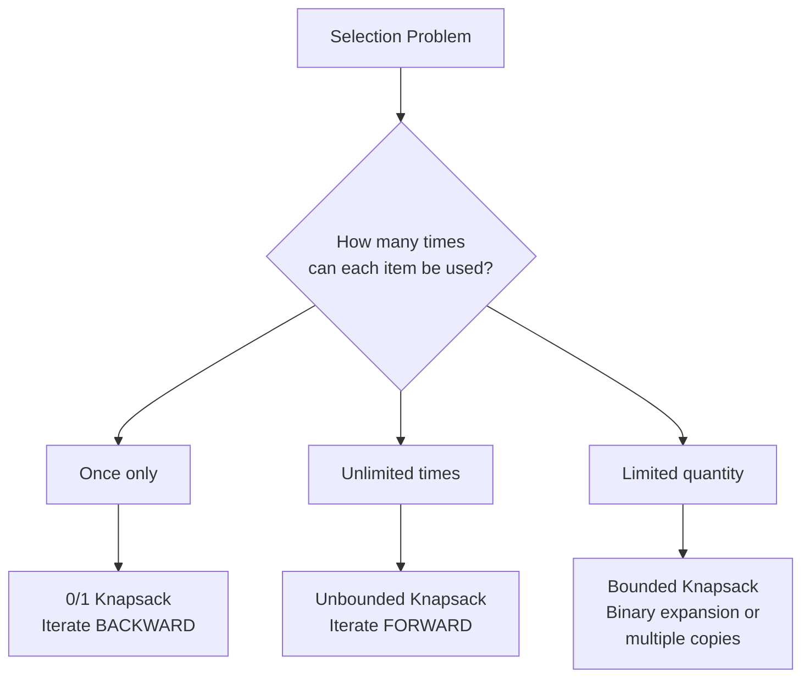

import { LanguageSelector, TimeEstimate, ConfidenceBuilder, DifficultyBadge } from '@site/src/components/interview-guide';
import { CodeTabs } from '@site/src/components/design-patterns/CodeTabs';
import TabItem from '@theme/TabItem';

# Knapsack: The Selection Pattern

"Given items with weights and values, maximize value without exceeding capacity."

That's the classic knapsack. But the pattern appears in disguise everywhere:

- "Can you partition array into two equal sums?" — Knapsack
- "How many ways to make change for amount K?" — Knapsack  
- "What's the minimum number of coins?" — Knapsack
- "Assign + or - to numbers to reach target" — Knapsack

The first time I saw "Partition Equal Subset Sum," I had no idea it was a knapsack problem. There was no "bag" or "weight" anywhere in the problem. The insight: **any problem where you select items with a constraint on the total is a knapsack variant.**

**Knapsack is about selecting items with constraints.**

<LanguageSelector />

<TimeEstimate
  learnTime="30-40 minutes"
  practiceTime="4-5 hours"
  masteryTime="12-15 problems"
  interviewFrequency="35%"
  difficultyRange="Medium to Hard"
  prerequisites="DP Introduction"
/>

---

## Knapsack Variants



---

## The 0/1 Knapsack Pattern

Each item can be taken once or not at all.

<CodeTabs>
<TabItem value="python" label="Python">

```python
def knapsack_01(weights: list[int], values: list[int], capacity: int) -> int:
    """
    0/1 Knapsack: Maximize value without exceeding capacity.
    Each item can be used at most once.
    
    State: dp[i][w] = max value using first i items with capacity w
    Decision: For each item, take it or skip it
    
    Time: O(n × capacity), Space: O(n × capacity)
    """
    n = len(weights)
    dp: list[list[int]] = [[0] * (capacity + 1) for _ in range(n + 1)]
    
    for i in range(1, n + 1):
        for w in range(capacity + 1):
            # Option 1: Don't take item i
            dp[i][w] = dp[i - 1][w]
            
            # Option 2: Take item i (if it fits)
            if weights[i - 1] <= w:
                dp[i][w] = max(
                    dp[i][w],
                    dp[i - 1][w - weights[i - 1]] + values[i - 1]
                )
    
    return dp[n][capacity]


def knapsack_01_optimized(weights: list[int], values: list[int], capacity: int) -> int:
    """
    Space-optimized 0/1 Knapsack.
    
    Key insight: We only need the previous row.
    CRITICAL: Traverse BACKWARD to avoid using same item twice.
    
    Time: O(n × capacity), Space: O(capacity)
    """
    dp: list[int] = [0] * (capacity + 1)
    
    for i in range(len(weights)):
        # MUST go backward to prevent using item multiple times
        for w in range(capacity, weights[i] - 1, -1):
            dp[w] = max(dp[w], dp[w - weights[i]] + values[i])
    
    return dp[capacity]
```

</TabItem>
<TabItem value="typescript" label="TypeScript">

```typescript
function knapsack01(
  weights: number[],
  values: number[],
  capacity: number
): number {
  const n = weights.length;
  const dp: number[][] = Array.from({ length: n + 1 }, () =>
    Array(capacity + 1).fill(0)
  );

  for (let i = 1; i <= n; i++) {
    for (let w = 0; w <= capacity; w++) {
      dp[i][w] = dp[i - 1][w]; // Don't take

      if (weights[i - 1] <= w) {
        dp[i][w] = Math.max(
          dp[i][w],
          dp[i - 1][w - weights[i - 1]] + values[i - 1]
        );
      }
    }
  }

  return dp[n][capacity];
}

function knapsack01Optimized(
  weights: number[],
  values: number[],
  capacity: number
): number {
  const dp: number[] = new Array(capacity + 1).fill(0);

  for (let i = 0; i < weights.length; i++) {
    // BACKWARD to prevent reuse
    for (let w = capacity; w >= weights[i]; w--) {
      dp[w] = Math.max(dp[w], dp[w - weights[i]] + values[i]);
    }
  }

  return dp[capacity];
}
```

</TabItem>
<TabItem value="go" label="Go">

```go
func knapsack01(weights, values []int, capacity int) int {
    n := len(weights)
    dp := make([][]int, n+1)
    for i := range dp {
        dp[i] = make([]int, capacity+1)
    }
    
    for i := 1; i <= n; i++ {
        for w := 0; w <= capacity; w++ {
            dp[i][w] = dp[i-1][w]
            
            if weights[i-1] <= w {
                take := dp[i-1][w-weights[i-1]] + values[i-1]
                if take > dp[i][w] {
                    dp[i][w] = take
                }
            }
        }
    }
    
    return dp[n][capacity]
}

func knapsack01Optimized(weights, values []int, capacity int) int {
    dp := make([]int, capacity+1)
    
    for i := 0; i < len(weights); i++ {
        for w := capacity; w >= weights[i]; w-- {
            if dp[w-weights[i]]+values[i] > dp[w] {
                dp[w] = dp[w-weights[i]] + values[i]
            }
        }
    }
    
    return dp[capacity]
}
```

</TabItem>
<TabItem value="java" label="Java">

```java
public int knapsack01(int[] weights, int[] values, int capacity) {
    int n = weights.length;
    int[][] dp = new int[n + 1][capacity + 1];
    
    for (int i = 1; i <= n; i++) {
        for (int w = 0; w <= capacity; w++) {
            dp[i][w] = dp[i - 1][w];
            
            if (weights[i - 1] <= w) {
                dp[i][w] = Math.max(
                    dp[i][w],
                    dp[i - 1][w - weights[i - 1]] + values[i - 1]
                );
            }
        }
    }
    
    return dp[n][capacity];
}

public int knapsack01Optimized(int[] weights, int[] values, int capacity) {
    int[] dp = new int[capacity + 1];
    
    for (int i = 0; i < weights.length; i++) {
        for (int w = capacity; w >= weights[i]; w--) {
            dp[w] = Math.max(dp[w], dp[w - weights[i]] + values[i]);
        }
    }
    
    return dp[capacity];
}
```

</TabItem>
<TabItem value="cpp" label="C++">

```cpp
int knapsack01(vector<int>& weights, vector<int>& values, int capacity) {
    int n = weights.size();
    vector<vector<int>> dp(n + 1, vector<int>(capacity + 1, 0));
    
    for (int i = 1; i <= n; i++) {
        for (int w = 0; w <= capacity; w++) {
            dp[i][w] = dp[i - 1][w];
            
            if (weights[i - 1] <= w) {
                dp[i][w] = max(
                    dp[i][w],
                    dp[i - 1][w - weights[i - 1]] + values[i - 1]
                );
            }
        }
    }
    
    return dp[n][capacity];
}

int knapsack01Optimized(vector<int>& weights, vector<int>& values, int capacity) {
    vector<int> dp(capacity + 1, 0);
    
    for (int i = 0; i < weights.size(); i++) {
        for (int w = capacity; w >= weights[i]; w--) {
            dp[w] = max(dp[w], dp[w - weights[i]] + values[i]);
        }
    }
    
    return dp[capacity];
}
```

</TabItem>
<TabItem value="c" label="C">

```c
int knapsack01Optimized(int* weights, int* values, int n, int capacity) {
    int* dp = (int*)calloc(capacity + 1, sizeof(int));
    
    for (int i = 0; i < n; i++) {
        for (int w = capacity; w >= weights[i]; w--) {
            int take = dp[w - weights[i]] + values[i];
            if (take > dp[w]) {
                dp[w] = take;
            }
        }
    }
    
    int result = dp[capacity];
    free(dp);
    return result;
}
```

</TabItem>
<TabItem value="csharp" label="C#">

```csharp
public int Knapsack01(int[] weights, int[] values, int capacity) {
    int n = weights.Length;
    int[,] dp = new int[n + 1, capacity + 1];
    
    for (int i = 1; i <= n; i++) {
        for (int w = 0; w <= capacity; w++) {
            dp[i, w] = dp[i - 1, w];
            
            if (weights[i - 1] <= w) {
                dp[i, w] = Math.Max(
                    dp[i, w],
                    dp[i - 1, w - weights[i - 1]] + values[i - 1]
                );
            }
        }
    }
    
    return dp[n, capacity];
}

public int Knapsack01Optimized(int[] weights, int[] values, int capacity) {
    int[] dp = new int[capacity + 1];
    
    for (int i = 0; i < weights.Length; i++) {
        for (int w = capacity; w >= weights[i]; w--) {
            dp[w] = Math.Max(dp[w], dp[w - weights[i]] + values[i]);
        }
    }
    
    return dp[capacity];
}
```

</TabItem>
</CodeTabs>

<ConfidenceBuilder type="remember" title="Why Iterate Backward in 0/1 Knapsack?">

If we iterate forward, when we compute `dp[w]`, we might use an updated `dp[w - weight]` that already includes the current item. This would let us use the same item multiple times.

By iterating backward, we ensure `dp[w - weight]` still contains the value from the previous item (before current item was considered).

</ConfidenceBuilder>

---

## Unbounded Knapsack

Each item can be used unlimited times.

<CodeTabs>
<TabItem value="python" label="Python">

```python
def knapsack_unbounded(weights: list[int], values: list[int], capacity: int) -> int:
    """
    Unbounded Knapsack: Each item can be used any number of times.
    
    Key difference from 0/1: Iterate FORWARD because we WANT to reuse items.
    
    Time: O(n × capacity), Space: O(capacity)
    """
    dp: list[int] = [0] * (capacity + 1)
    
    for w in range(1, capacity + 1):
        for i in range(len(weights)):
            if weights[i] <= w:
                dp[w] = max(dp[w], dp[w - weights[i]] + values[i])
    
    return dp[capacity]


def coin_change(coins: list[int], amount: int) -> int:
    """
    Minimum coins to make amount (Unbounded Knapsack variant).
    
    State: dp[a] = minimum coins to make amount a
    Recurrence: dp[a] = min(dp[a], dp[a - coin] + 1)
    """
    dp: list[float] = [float('inf')] * (amount + 1)
    dp[0] = 0  # 0 coins needed for amount 0
    
    for coin in coins:
        for a in range(coin, amount + 1):  # FORWARD for unbounded
            dp[a] = min(dp[a], dp[a - coin] + 1)
    
    return dp[amount] if dp[amount] != float('inf') else -1
```

</TabItem>
<TabItem value="typescript" label="TypeScript">

```typescript
function knapsackUnbounded(
  weights: number[],
  values: number[],
  capacity: number
): number {
  const dp: number[] = new Array(capacity + 1).fill(0);

  for (let w = 1; w <= capacity; w++) {
    for (let i = 0; i < weights.length; i++) {
      if (weights[i] <= w) {
        dp[w] = Math.max(dp[w], dp[w - weights[i]] + values[i]);
      }
    }
  }

  return dp[capacity];
}

function coinChange(coins: number[], amount: number): number {
  const dp: number[] = new Array(amount + 1).fill(Infinity);
  dp[0] = 0;

  for (const coin of coins) {
    for (let a = coin; a <= amount; a++) {
      dp[a] = Math.min(dp[a], dp[a - coin] + 1);
    }
  }

  return dp[amount] === Infinity ? -1 : dp[amount];
}
```

</TabItem>
<TabItem value="go" label="Go">

```go
func coinChange(coins []int, amount int) int {
    dp := make([]int, amount+1)
    for i := 1; i <= amount; i++ {
        dp[i] = amount + 1 // Use amount+1 as infinity
    }
    
    for _, coin := range coins {
        for a := coin; a <= amount; a++ {
            if dp[a-coin]+1 < dp[a] {
                dp[a] = dp[a-coin] + 1
            }
        }
    }
    
    if dp[amount] > amount {
        return -1
    }
    return dp[amount]
}
```

</TabItem>
<TabItem value="java" label="Java">

```java
public int coinChange(int[] coins, int amount) {
    int[] dp = new int[amount + 1];
    Arrays.fill(dp, amount + 1);
    dp[0] = 0;
    
    for (int coin : coins) {
        for (int a = coin; a <= amount; a++) {
            dp[a] = Math.min(dp[a], dp[a - coin] + 1);
        }
    }
    
    return dp[amount] > amount ? -1 : dp[amount];
}
```

</TabItem>
<TabItem value="cpp" label="C++">

```cpp
int coinChange(vector<int>& coins, int amount) {
    vector<int> dp(amount + 1, amount + 1);
    dp[0] = 0;
    
    for (int coin : coins) {
        for (int a = coin; a <= amount; a++) {
            dp[a] = min(dp[a], dp[a - coin] + 1);
        }
    }
    
    return dp[amount] > amount ? -1 : dp[amount];
}
```

</TabItem>
<TabItem value="c" label="C">

```c
int coinChange(int* coins, int n, int amount) {
    int* dp = (int*)malloc((amount + 1) * sizeof(int));
    for (int i = 0; i <= amount; i++) {
        dp[i] = amount + 1;
    }
    dp[0] = 0;
    
    for (int i = 0; i < n; i++) {
        for (int a = coins[i]; a <= amount; a++) {
            if (dp[a - coins[i]] + 1 < dp[a]) {
                dp[a] = dp[a - coins[i]] + 1;
            }
        }
    }
    
    int result = dp[amount] > amount ? -1 : dp[amount];
    free(dp);
    return result;
}
```

</TabItem>
<TabItem value="csharp" label="C#">

```csharp
public int CoinChange(int[] coins, int amount) {
    int[] dp = new int[amount + 1];
    Array.Fill(dp, amount + 1);
    dp[0] = 0;
    
    foreach (int coin in coins) {
        for (int a = coin; a <= amount; a++) {
            dp[a] = Math.Min(dp[a], dp[a - coin] + 1);
        }
    }
    
    return dp[amount] > amount ? -1 : dp[amount];
}
```

</TabItem>
</CodeTabs>

---

## Classic Problem: Partition Equal Subset Sum

"Can array be partitioned into two equal sums?"

This is 0/1 Knapsack in disguise: Can we select items that sum to `total/2`?

<CodeTabs>
<TabItem value="python" label="Python">

```python
def can_partition(nums: list[int]) -> bool:
    """
    Partition Equal Subset Sum.
    
    Transform: Can we find a subset that sums to total/2?
    This is exactly 0/1 Knapsack with target = total/2
    
    Time: O(n × sum), Space: O(sum)
    """
    total = sum(nums)
    
    # Can't split odd sum equally
    if total % 2 != 0:
        return False
    
    target = total // 2
    dp: list[bool] = [False] * (target + 1)
    dp[0] = True  # Empty subset sums to 0
    
    for num in nums:
        # BACKWARD because each number used at most once
        for s in range(target, num - 1, -1):
            dp[s] = dp[s] or dp[s - num]
    
    return dp[target]
```

</TabItem>
<TabItem value="typescript" label="TypeScript">

```typescript
function canPartition(nums: number[]): boolean {
  const total = nums.reduce((a, b) => a + b, 0);

  if (total % 2 !== 0) return false;

  const target = total / 2;
  const dp: boolean[] = new Array(target + 1).fill(false);
  dp[0] = true;

  for (const num of nums) {
    for (let s = target; s >= num; s--) {
      dp[s] = dp[s] || dp[s - num];
    }
  }

  return dp[target];
}
```

</TabItem>
<TabItem value="go" label="Go">

```go
func canPartition(nums []int) bool {
    total := 0
    for _, num := range nums {
        total += num
    }
    
    if total%2 != 0 {
        return false
    }
    
    target := total / 2
    dp := make([]bool, target+1)
    dp[0] = true
    
    for _, num := range nums {
        for s := target; s >= num; s-- {
            dp[s] = dp[s] || dp[s-num]
        }
    }
    
    return dp[target]
}
```

</TabItem>
<TabItem value="java" label="Java">

```java
public boolean canPartition(int[] nums) {
    int total = Arrays.stream(nums).sum();
    
    if (total % 2 != 0) return false;
    
    int target = total / 2;
    boolean[] dp = new boolean[target + 1];
    dp[0] = true;
    
    for (int num : nums) {
        for (int s = target; s >= num; s--) {
            dp[s] = dp[s] || dp[s - num];
        }
    }
    
    return dp[target];
}
```

</TabItem>
<TabItem value="cpp" label="C++">

```cpp
bool canPartition(vector<int>& nums) {
    int total = accumulate(nums.begin(), nums.end(), 0);
    
    if (total % 2 != 0) return false;
    
    int target = total / 2;
    vector<bool> dp(target + 1, false);
    dp[0] = true;
    
    for (int num : nums) {
        for (int s = target; s >= num; s--) {
            dp[s] = dp[s] || dp[s - num];
        }
    }
    
    return dp[target];
}
```

</TabItem>
<TabItem value="c" label="C">

```c
bool canPartition(int* nums, int n) {
    int total = 0;
    for (int i = 0; i < n; i++) {
        total += nums[i];
    }
    
    if (total % 2 != 0) return false;
    
    int target = total / 2;
    bool* dp = (bool*)calloc(target + 1, sizeof(bool));
    dp[0] = true;
    
    for (int i = 0; i < n; i++) {
        for (int s = target; s >= nums[i]; s--) {
            dp[s] = dp[s] || dp[s - nums[i]];
        }
    }
    
    bool result = dp[target];
    free(dp);
    return result;
}
```

</TabItem>
<TabItem value="csharp" label="C#">

```csharp
public bool CanPartition(int[] nums) {
    int total = nums.Sum();
    
    if (total % 2 != 0) return false;
    
    int target = total / 2;
    bool[] dp = new bool[target + 1];
    dp[0] = true;
    
    foreach (int num in nums) {
        for (int s = target; s >= num; s--) {
            dp[s] = dp[s] || dp[s - num];
        }
    }
    
    return dp[target];
}
```

</TabItem>
</CodeTabs>

---

## Classic Problem: Coin Change 2 (Count Ways)

"Number of ways to make amount using coins."

<CodeTabs>
<TabItem value="python" label="Python">

```python
def change(amount: int, coins: list[int]) -> int:
    """
    Coin Change 2: Count number of ways to make amount.
    
    State: dp[a] = number of ways to make amount a
    Recurrence: dp[a] += dp[a - coin]
    
    Note: Loop order matters! Coins outer, amount inner prevents
    counting same combination multiple times.
    """
    dp: list[int] = [0] * (amount + 1)
    dp[0] = 1  # One way to make 0: use no coins
    
    for coin in coins:
        for a in range(coin, amount + 1):
            dp[a] += dp[a - coin]
    
    return dp[amount]
```

</TabItem>
<TabItem value="typescript" label="TypeScript">

```typescript
function change(amount: number, coins: number[]): number {
  const dp: number[] = new Array(amount + 1).fill(0);
  dp[0] = 1;

  for (const coin of coins) {
    for (let a = coin; a <= amount; a++) {
      dp[a] += dp[a - coin];
    }
  }

  return dp[amount];
}
```

</TabItem>
<TabItem value="go" label="Go">

```go
func change(amount int, coins []int) int {
    dp := make([]int, amount+1)
    dp[0] = 1
    
    for _, coin := range coins {
        for a := coin; a <= amount; a++ {
            dp[a] += dp[a-coin]
        }
    }
    
    return dp[amount]
}
```

</TabItem>
<TabItem value="java" label="Java">

```java
public int change(int amount, int[] coins) {
    int[] dp = new int[amount + 1];
    dp[0] = 1;
    
    for (int coin : coins) {
        for (int a = coin; a <= amount; a++) {
            dp[a] += dp[a - coin];
        }
    }
    
    return dp[amount];
}
```

</TabItem>
<TabItem value="cpp" label="C++">

```cpp
int change(int amount, vector<int>& coins) {
    vector<int> dp(amount + 1, 0);
    dp[0] = 1;
    
    for (int coin : coins) {
        for (int a = coin; a <= amount; a++) {
            dp[a] += dp[a - coin];
        }
    }
    
    return dp[amount];
}
```

</TabItem>
<TabItem value="c" label="C">

```c
int change(int amount, int* coins, int n) {
    int* dp = (int*)calloc(amount + 1, sizeof(int));
    dp[0] = 1;
    
    for (int i = 0; i < n; i++) {
        for (int a = coins[i]; a <= amount; a++) {
            dp[a] += dp[a - coins[i]];
        }
    }
    
    int result = dp[amount];
    free(dp);
    return result;
}
```

</TabItem>
<TabItem value="csharp" label="C#">

```csharp
public int Change(int amount, int[] coins) {
    int[] dp = new int[amount + 1];
    dp[0] = 1;
    
    foreach (int coin in coins) {
        for (int a = coin; a <= amount; a++) {
            dp[a] += dp[a - coin];
        }
    }
    
    return dp[amount];
}
```

</TabItem>
</CodeTabs>

---

## Classic Problem: Target Sum

"Assign + or - to each number to reach target sum."

Transform: Find subset with sum = (total + target) / 2

<CodeTabs>
<TabItem value="python" label="Python">

```python
def find_target_sum_ways(nums: list[int], target: int) -> int:
    """
    Target Sum: Assign + or - to reach target.
    
    Transform: If P = positive subset, N = negative subset:
    P - N = target
    P + N = total
    Therefore: P = (total + target) / 2
    
    Problem becomes: Count subsets with sum = (total + target) / 2
    """
    total = sum(nums)
    
    # Check if solution exists
    if (total + target) % 2 != 0 or abs(target) > total:
        return 0
    
    subset_sum = (total + target) // 2
    
    dp: list[int] = [0] * (subset_sum + 1)
    dp[0] = 1  # One way to get sum 0: select nothing
    
    for num in nums:
        for s in range(subset_sum, num - 1, -1):
            dp[s] += dp[s - num]
    
    return dp[subset_sum]
```

</TabItem>
<TabItem value="typescript" label="TypeScript">

```typescript
function findTargetSumWays(nums: number[], target: number): number {
  const total = nums.reduce((a, b) => a + b, 0);

  if ((total + target) % 2 !== 0 || Math.abs(target) > total) {
    return 0;
  }

  const subsetSum = (total + target) / 2;
  const dp: number[] = new Array(subsetSum + 1).fill(0);
  dp[0] = 1;

  for (const num of nums) {
    for (let s = subsetSum; s >= num; s--) {
      dp[s] += dp[s - num];
    }
  }

  return dp[subsetSum];
}
```

</TabItem>
<TabItem value="go" label="Go">

```go
func findTargetSumWays(nums []int, target int) int {
    total := 0
    for _, num := range nums {
        total += num
    }
    
    if (total+target)%2 != 0 || abs(target) > total {
        return 0
    }
    
    subsetSum := (total + target) / 2
    dp := make([]int, subsetSum+1)
    dp[0] = 1
    
    for _, num := range nums {
        for s := subsetSum; s >= num; s-- {
            dp[s] += dp[s-num]
        }
    }
    
    return dp[subsetSum]
}

func abs(x int) int {
    if x < 0 {
        return -x
    }
    return x
}
```

</TabItem>
<TabItem value="java" label="Java">

```java
public int findTargetSumWays(int[] nums, int target) {
    int total = Arrays.stream(nums).sum();
    
    if ((total + target) % 2 != 0 || Math.abs(target) > total) {
        return 0;
    }
    
    int subsetSum = (total + target) / 2;
    int[] dp = new int[subsetSum + 1];
    dp[0] = 1;
    
    for (int num : nums) {
        for (int s = subsetSum; s >= num; s--) {
            dp[s] += dp[s - num];
        }
    }
    
    return dp[subsetSum];
}
```

</TabItem>
<TabItem value="cpp" label="C++">

```cpp
int findTargetSumWays(vector<int>& nums, int target) {
    int total = accumulate(nums.begin(), nums.end(), 0);
    
    if ((total + target) % 2 != 0 || abs(target) > total) {
        return 0;
    }
    
    int subsetSum = (total + target) / 2;
    vector<int> dp(subsetSum + 1, 0);
    dp[0] = 1;
    
    for (int num : nums) {
        for (int s = subsetSum; s >= num; s--) {
            dp[s] += dp[s - num];
        }
    }
    
    return dp[subsetSum];
}
```

</TabItem>
<TabItem value="c" label="C">

```c
int findTargetSumWays(int* nums, int n, int target) {
    int total = 0;
    for (int i = 0; i < n; i++) {
        total += nums[i];
    }
    
    if ((total + target) % 2 != 0 || abs(target) > total) {
        return 0;
    }
    
    int subsetSum = (total + target) / 2;
    int* dp = (int*)calloc(subsetSum + 1, sizeof(int));
    dp[0] = 1;
    
    for (int i = 0; i < n; i++) {
        for (int s = subsetSum; s >= nums[i]; s--) {
            dp[s] += dp[s - nums[i]];
        }
    }
    
    int result = dp[subsetSum];
    free(dp);
    return result;
}
```

</TabItem>
<TabItem value="csharp" label="C#">

```csharp
public int FindTargetSumWays(int[] nums, int target) {
    int total = nums.Sum();
    
    if ((total + target) % 2 != 0 || Math.Abs(target) > total) {
        return 0;
    }
    
    int subsetSum = (total + target) / 2;
    int[] dp = new int[subsetSum + 1];
    dp[0] = 1;
    
    foreach (int num in nums) {
        for (int s = subsetSum; s >= num; s--) {
            dp[s] += dp[s - num];
        }
    }
    
    return dp[subsetSum];
}
```

</TabItem>
</CodeTabs>

---

## 🎯 Pattern Recognition

| Problem Type | Knapsack Variant | Loop Direction |
|--------------|-----------------|----------------|
| Select items once | 0/1 Knapsack | **Backward** |
| Unlimited selection | Unbounded | **Forward** |
| Limited quantities | Bounded | Binary expansion |
| Find max/min | Standard DP | `max`/`min` |
| Count ways | Sum DP | `+=` |
| Check possible | Boolean DP | `or` |

---

## Key Insights

### 1. Loop Direction is Critical

```python
# 0/1 Knapsack: BACKWARD (each item once)
for w in range(capacity, weight - 1, -1):

# Unbounded: FORWARD (item can repeat)
for w in range(weight, capacity + 1):
```

### 2. Many Problems Transform to Subset Sum

| Original Problem | Transform To |
|-----------------|--------------|
| Partition Equal Subset | subset sum = total/2 |
| Target Sum | subset sum = (total + target)/2 |
| Last Stone Weight II | subset sum minimizing |total - 2*subset| |

### 3. Base Cases by Problem Type

```python
# Minimum problems: dp[0] = 0, rest = infinity
# Count problems: dp[0] = 1, rest = 0  
# Boolean problems: dp[0] = True, rest = False
```

---

## 💬 How to Communicate This in Interviews

**Recognizing knapsack:**
> "This is a selection problem with a constraint on the total. I'll use the knapsack pattern where I decide for each item whether to include it or not..."

**Explaining the transform:**
> "I can transform this partition problem to: 'Can I find a subset that sums to half the total?' This is exactly 0/1 knapsack..."

**Loop direction:**
> "I'm iterating backward because each item can only be used once. If I went forward, I might accidentally use the same item multiple times..."

---

## 🏋️ Practice Problems

### Warm-Up (Build Confidence)

| Problem | Difficulty | Time | Variant |
|---------|------------|------|---------|
| [Partition Equal Subset Sum](https://leetcode.com/problems/partition-equal-subset-sum/) | <DifficultyBadge level="medium" /> | 25 min | 0/1 Boolean |
| [Coin Change](https://leetcode.com/problems/coin-change/) | <DifficultyBadge level="medium" /> | 20 min | Unbounded Min |

### Core Practice (Must Do)

| Problem | Difficulty | Companies | Variant |
|---------|------------|-----------|---------|
| [Target Sum](https://leetcode.com/problems/target-sum/) | <DifficultyBadge level="medium" /> | Google, Meta, Amazon | 0/1 Count |
| [Coin Change 2](https://leetcode.com/problems/coin-change-ii/) | <DifficultyBadge level="medium" /> | Google, Amazon | Unbounded Count |
| [Last Stone Weight II](https://leetcode.com/problems/last-stone-weight-ii/) | <DifficultyBadge level="medium" /> | Google, Amazon | 0/1 Min Diff |
| [Ones and Zeroes](https://leetcode.com/problems/ones-and-zeroes/) | <DifficultyBadge level="medium" /> | Google | Multi-dimensional |

### Challenge (For Mastery)

| Problem | Difficulty | Companies | Why It's Hard |
|---------|------------|-----------|---------------|
| [Profitable Schemes](https://leetcode.com/problems/profitable-schemes/) | <DifficultyBadge level="hard" /> | Google | 3D state |
| [Tallest Billboard](https://leetcode.com/problems/tallest-billboard/) | <DifficultyBadge level="hard" /> | Google | Non-obvious transform |

---

## Key Takeaways

1. **Backward loop for 0/1**, forward for unbounded—this is the most common mistake.

2. **Transform problems** to subset sum when possible.

3. **Space optimization** from O(n×W) to O(W) is almost always possible.

4. **Different aggregations** for different goals: `max` for optimize, `+=` for count, `or` for boolean.

<ConfidenceBuilder type="youve-got-this">

**Knapsack has predictable transformations.**

Once you recognize the selection-with-constraint pattern, the solution structure is almost mechanical. The creative part is transforming the original problem into knapsack form.

</ConfidenceBuilder>

---

## What's Next?

Grid DP for pathfinding and matrix problems:

**Next up:** [Grid DP Pattern](/docs/interview-guide/coding/patterns/dp-patterns/grid-dp) — 2D Pathfinding Problems
