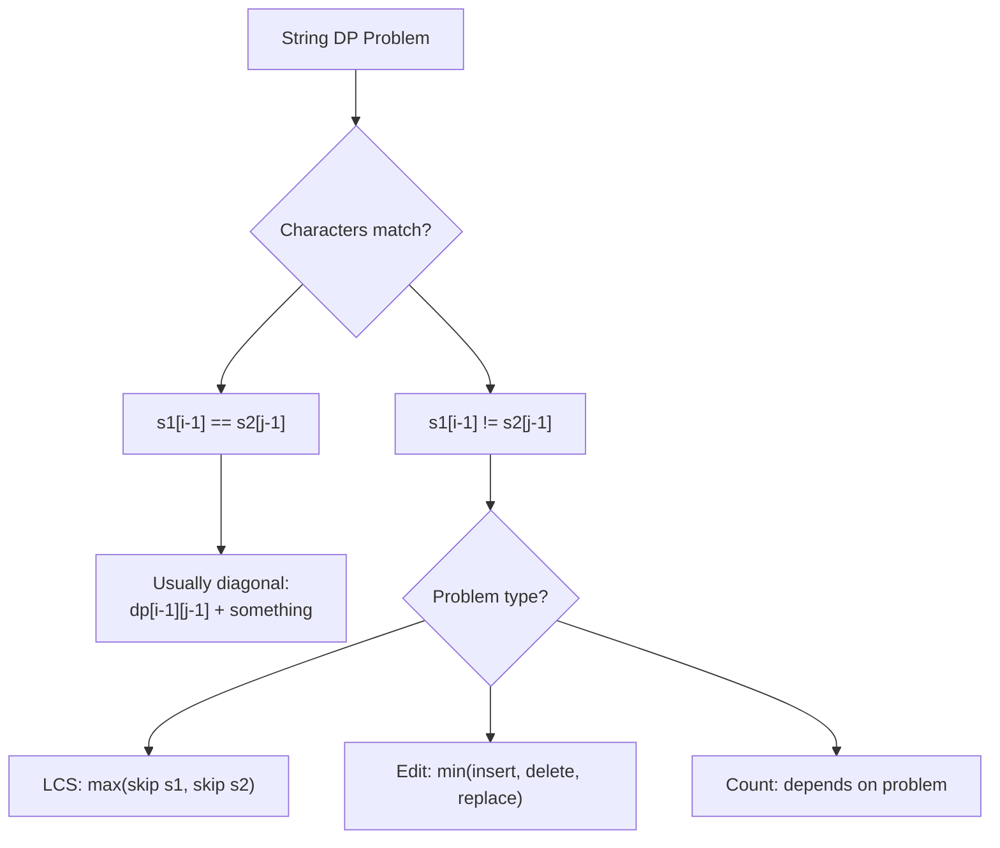

import { LanguageSelector, TimeEstimate, ConfidenceBuilder, DifficultyBadge } from '@site/src/components/interview-guide';
import { CodeTabs } from '@site/src/components/design-patterns/CodeTabs';
import TabItem from '@theme/TabItem';

# String DP: Two Sequence Problems

String DP problems typically involve two strings and a 2D table. The pattern is remarkably consistent: `dp[i][j]` represents the answer for the first `i` characters of string 1 and the first `j` characters of string 2.

The first time I saw Edit Distance, I tried to solve it greedily. "Just count the differences!" That doesn't work because the optimal solution might involve insertions that shift everything. The insight: **you need to consider all possible alignments, which is what the 2D DP table captures.**

**State:** `dp[i][j]` = answer for `s1[0:i]` and `s2[0:j]`  
**Key decision:** What happens when `s1[i-1]` and `s2[j-1]` match or don't match?

<LanguageSelector />

<TimeEstimate
  learnTime="30-40 minutes"
  practiceTime="4-5 hours"
  masteryTime="12-15 problems"
  interviewFrequency="35%"
  difficultyRange="Medium to Hard"
  prerequisites="DP Introduction"
/>

---

## String DP Decision Guide



---

## Longest Common Subsequence (LCS)

The foundation of most string DP problems.

<CodeTabs>
<TabItem value="python" label="Python">

```python
def longest_common_subsequence(text1: str, text2: str) -> int:
    """
    Find length of longest common subsequence.
    
    State: dp[i][j] = LCS length for text1[0:i] and text2[0:j]
    
    Recurrence:
    - Match: dp[i][j] = dp[i-1][j-1] + 1 (extend LCS)
    - No match: dp[i][j] = max(dp[i-1][j], dp[i][j-1]) (skip one char)
    
    Time: O(m×n), Space: O(m×n)
    """
    m, n = len(text1), len(text2)
    dp: list[list[int]] = [[0] * (n + 1) for _ in range(m + 1)]
    
    for i in range(1, m + 1):
        for j in range(1, n + 1):
            if text1[i - 1] == text2[j - 1]:
                dp[i][j] = dp[i - 1][j - 1] + 1  # Characters match
            else:
                dp[i][j] = max(dp[i - 1][j], dp[i][j - 1])  # Skip one
    
    return dp[m][n]


def lcs_optimized(text1: str, text2: str) -> int:
    """Space optimized: O(n) instead of O(m×n)."""
    m, n = len(text1), len(text2)
    prev: list[int] = [0] * (n + 1)
    curr: list[int] = [0] * (n + 1)
    
    for i in range(1, m + 1):
        for j in range(1, n + 1):
            if text1[i - 1] == text2[j - 1]:
                curr[j] = prev[j - 1] + 1
            else:
                curr[j] = max(prev[j], curr[j - 1])
        prev, curr = curr, prev
    
    return prev[n]
```

</TabItem>
<TabItem value="typescript" label="TypeScript">

```typescript
function longestCommonSubsequence(text1: string, text2: string): number {
  const m = text1.length;
  const n = text2.length;
  const dp: number[][] = Array.from({ length: m + 1 }, () =>
    Array(n + 1).fill(0)
  );

  for (let i = 1; i <= m; i++) {
    for (let j = 1; j <= n; j++) {
      if (text1[i - 1] === text2[j - 1]) {
        dp[i][j] = dp[i - 1][j - 1] + 1;
      } else {
        dp[i][j] = Math.max(dp[i - 1][j], dp[i][j - 1]);
      }
    }
  }

  return dp[m][n];
}
```

</TabItem>
<TabItem value="go" label="Go">

```go
func longestCommonSubsequence(text1 string, text2 string) int {
    m, n := len(text1), len(text2)
    dp := make([][]int, m+1)
    for i := range dp {
        dp[i] = make([]int, n+1)
    }
    
    for i := 1; i <= m; i++ {
        for j := 1; j <= n; j++ {
            if text1[i-1] == text2[j-1] {
                dp[i][j] = dp[i-1][j-1] + 1
            } else {
                dp[i][j] = max(dp[i-1][j], dp[i][j-1])
            }
        }
    }
    
    return dp[m][n]
}
```

</TabItem>
<TabItem value="java" label="Java">

```java
public int longestCommonSubsequence(String text1, String text2) {
    int m = text1.length();
    int n = text2.length();
    int[][] dp = new int[m + 1][n + 1];
    
    for (int i = 1; i <= m; i++) {
        for (int j = 1; j <= n; j++) {
            if (text1.charAt(i - 1) == text2.charAt(j - 1)) {
                dp[i][j] = dp[i - 1][j - 1] + 1;
            } else {
                dp[i][j] = Math.max(dp[i - 1][j], dp[i][j - 1]);
            }
        }
    }
    
    return dp[m][n];
}
```

</TabItem>
<TabItem value="cpp" label="C++">

```cpp
int longestCommonSubsequence(string text1, string text2) {
    int m = text1.size();
    int n = text2.size();
    vector<vector<int>> dp(m + 1, vector<int>(n + 1, 0));
    
    for (int i = 1; i <= m; i++) {
        for (int j = 1; j <= n; j++) {
            if (text1[i - 1] == text2[j - 1]) {
                dp[i][j] = dp[i - 1][j - 1] + 1;
            } else {
                dp[i][j] = max(dp[i - 1][j], dp[i][j - 1]);
            }
        }
    }
    
    return dp[m][n];
}
```

</TabItem>
<TabItem value="c" label="C">

```c
int longestCommonSubsequence(char* text1, char* text2) {
    int m = strlen(text1);
    int n = strlen(text2);
    
    int** dp = (int**)calloc(m + 1, sizeof(int*));
    for (int i = 0; i <= m; i++) {
        dp[i] = (int*)calloc(n + 1, sizeof(int));
    }
    
    for (int i = 1; i <= m; i++) {
        for (int j = 1; j <= n; j++) {
            if (text1[i - 1] == text2[j - 1]) {
                dp[i][j] = dp[i - 1][j - 1] + 1;
            } else {
                dp[i][j] = dp[i - 1][j] > dp[i][j - 1] ? dp[i - 1][j] : dp[i][j - 1];
            }
        }
    }
    
    int result = dp[m][n];
    for (int i = 0; i <= m; i++) free(dp[i]);
    free(dp);
    return result;
}
```

</TabItem>
<TabItem value="csharp" label="C#">

```csharp
public int LongestCommonSubsequence(string text1, string text2) {
    int m = text1.Length;
    int n = text2.Length;
    int[,] dp = new int[m + 1, n + 1];
    
    for (int i = 1; i <= m; i++) {
        for (int j = 1; j <= n; j++) {
            if (text1[i - 1] == text2[j - 1]) {
                dp[i, j] = dp[i - 1, j - 1] + 1;
            } else {
                dp[i, j] = Math.Max(dp[i - 1, j], dp[i, j - 1]);
            }
        }
    }
    
    return dp[m, n];
}
```

</TabItem>
</CodeTabs>

---

## Edit Distance (Levenshtein)

Minimum operations to transform word1 into word2.

<CodeTabs>
<TabItem value="python" label="Python">

```python
def min_distance(word1: str, word2: str) -> int:
    """
    Minimum edit distance (insert, delete, replace).
    
    State: dp[i][j] = min operations to convert word1[0:i] to word2[0:j]
    
    Operations:
    - Insert: dp[i][j-1] + 1 (insert char to match word2[j-1])
    - Delete: dp[i-1][j] + 1 (delete word1[i-1])
    - Replace: dp[i-1][j-1] + 1 (replace word1[i-1] with word2[j-1])
    
    Time: O(m×n), Space: O(m×n)
    """
    m, n = len(word1), len(word2)
    dp: list[list[int]] = [[0] * (n + 1) for _ in range(m + 1)]
    
    # Base cases: converting to/from empty string
    for i in range(m + 1):
        dp[i][0] = i  # Delete all characters
    for j in range(n + 1):
        dp[0][j] = j  # Insert all characters
    
    for i in range(1, m + 1):
        for j in range(1, n + 1):
            if word1[i - 1] == word2[j - 1]:
                dp[i][j] = dp[i - 1][j - 1]  # No operation needed
            else:
                dp[i][j] = 1 + min(
                    dp[i - 1][j],      # Delete from word1
                    dp[i][j - 1],      # Insert into word1
                    dp[i - 1][j - 1]   # Replace
                )
    
    return dp[m][n]
```

</TabItem>
<TabItem value="typescript" label="TypeScript">

```typescript
function minDistance(word1: string, word2: string): number {
  const m = word1.length;
  const n = word2.length;
  const dp: number[][] = Array.from({ length: m + 1 }, () =>
    Array(n + 1).fill(0)
  );

  for (let i = 0; i <= m; i++) dp[i][0] = i;
  for (let j = 0; j <= n; j++) dp[0][j] = j;

  for (let i = 1; i <= m; i++) {
    for (let j = 1; j <= n; j++) {
      if (word1[i - 1] === word2[j - 1]) {
        dp[i][j] = dp[i - 1][j - 1];
      } else {
        dp[i][j] =
          1 + Math.min(dp[i - 1][j], dp[i][j - 1], dp[i - 1][j - 1]);
      }
    }
  }

  return dp[m][n];
}
```

</TabItem>
<TabItem value="go" label="Go">

```go
func minDistance(word1 string, word2 string) int {
    m, n := len(word1), len(word2)
    dp := make([][]int, m+1)
    for i := range dp {
        dp[i] = make([]int, n+1)
        dp[i][0] = i
    }
    for j := 0; j <= n; j++ {
        dp[0][j] = j
    }
    
    for i := 1; i <= m; i++ {
        for j := 1; j <= n; j++ {
            if word1[i-1] == word2[j-1] {
                dp[i][j] = dp[i-1][j-1]
            } else {
                dp[i][j] = 1 + min(dp[i-1][j], dp[i][j-1], dp[i-1][j-1])
            }
        }
    }
    
    return dp[m][n]
}

func min(a, b, c int) int {
    if a <= b && a <= c {
        return a
    }
    if b <= c {
        return b
    }
    return c
}
```

</TabItem>
<TabItem value="java" label="Java">

```java
public int minDistance(String word1, String word2) {
    int m = word1.length();
    int n = word2.length();
    int[][] dp = new int[m + 1][n + 1];
    
    for (int i = 0; i <= m; i++) dp[i][0] = i;
    for (int j = 0; j <= n; j++) dp[0][j] = j;
    
    for (int i = 1; i <= m; i++) {
        for (int j = 1; j <= n; j++) {
            if (word1.charAt(i - 1) == word2.charAt(j - 1)) {
                dp[i][j] = dp[i - 1][j - 1];
            } else {
                dp[i][j] = 1 + Math.min(
                    dp[i - 1][j],
                    Math.min(dp[i][j - 1], dp[i - 1][j - 1])
                );
            }
        }
    }
    
    return dp[m][n];
}
```

</TabItem>
<TabItem value="cpp" label="C++">

```cpp
int minDistance(string word1, string word2) {
    int m = word1.size();
    int n = word2.size();
    vector<vector<int>> dp(m + 1, vector<int>(n + 1));
    
    for (int i = 0; i <= m; i++) dp[i][0] = i;
    for (int j = 0; j <= n; j++) dp[0][j] = j;
    
    for (int i = 1; i <= m; i++) {
        for (int j = 1; j <= n; j++) {
            if (word1[i - 1] == word2[j - 1]) {
                dp[i][j] = dp[i - 1][j - 1];
            } else {
                dp[i][j] = 1 + min({dp[i - 1][j], dp[i][j - 1], dp[i - 1][j - 1]});
            }
        }
    }
    
    return dp[m][n];
}
```

</TabItem>
<TabItem value="c" label="C">

```c
int minDistance(char* word1, char* word2) {
    int m = strlen(word1);
    int n = strlen(word2);
    
    int** dp = (int**)malloc((m + 1) * sizeof(int*));
    for (int i = 0; i <= m; i++) {
        dp[i] = (int*)malloc((n + 1) * sizeof(int));
        dp[i][0] = i;
    }
    for (int j = 0; j <= n; j++) {
        dp[0][j] = j;
    }
    
    for (int i = 1; i <= m; i++) {
        for (int j = 1; j <= n; j++) {
            if (word1[i - 1] == word2[j - 1]) {
                dp[i][j] = dp[i - 1][j - 1];
            } else {
                int del = dp[i - 1][j];
                int ins = dp[i][j - 1];
                int rep = dp[i - 1][j - 1];
                int minOp = del < ins ? del : ins;
                minOp = minOp < rep ? minOp : rep;
                dp[i][j] = 1 + minOp;
            }
        }
    }
    
    int result = dp[m][n];
    for (int i = 0; i <= m; i++) free(dp[i]);
    free(dp);
    return result;
}
```

</TabItem>
<TabItem value="csharp" label="C#">

```csharp
public int MinDistance(string word1, string word2) {
    int m = word1.Length;
    int n = word2.Length;
    int[,] dp = new int[m + 1, n + 1];
    
    for (int i = 0; i <= m; i++) dp[i, 0] = i;
    for (int j = 0; j <= n; j++) dp[0, j] = j;
    
    for (int i = 1; i <= m; i++) {
        for (int j = 1; j <= n; j++) {
            if (word1[i - 1] == word2[j - 1]) {
                dp[i, j] = dp[i - 1, j - 1];
            } else {
                dp[i, j] = 1 + Math.Min(
                    dp[i - 1, j],
                    Math.Min(dp[i, j - 1], dp[i - 1, j - 1])
                );
            }
        }
    }
    
    return dp[m, n];
}
```

</TabItem>
</CodeTabs>

<ConfidenceBuilder type="remember" title="Edit Distance Operations Visualized">

```
dp[i-1][j-1]  dp[i-1][j]
      ↘           ↓
       REPLACE   DELETE
       
dp[i][j-1] → INSERT → dp[i][j]
```

- **Insert:** We have `word1[0:i]`, need to insert `word2[j-1]`
- **Delete:** We have extra `word1[i-1]`, need to delete it
- **Replace:** Change `word1[i-1]` to `word2[j-1]`

</ConfidenceBuilder>

---

## Distinct Subsequences

Count ways to form `t` as a subsequence of `s`.

<CodeTabs>
<TabItem value="python" label="Python">

```python
def num_distinct(s: str, t: str) -> int:
    """
    Count distinct subsequences of s that equal t.
    
    State: dp[i][j] = ways to form t[0:j] from s[0:i]
    
    Recurrence:
    - Match: dp[i][j] = dp[i-1][j-1] + dp[i-1][j]
      (use this char OR skip it)
    - No match: dp[i][j] = dp[i-1][j]
      (must skip this char)
    """
    m, n = len(s), len(t)
    dp: list[list[int]] = [[0] * (n + 1) for _ in range(m + 1)]
    
    # Empty t is subsequence of any prefix of s
    for i in range(m + 1):
        dp[i][0] = 1
    
    for i in range(1, m + 1):
        for j in range(1, n + 1):
            if s[i - 1] == t[j - 1]:
                # Use s[i-1] to match t[j-1], OR skip s[i-1]
                dp[i][j] = dp[i - 1][j - 1] + dp[i - 1][j]
            else:
                # Must skip s[i-1]
                dp[i][j] = dp[i - 1][j]
    
    return dp[m][n]
```

</TabItem>
<TabItem value="typescript" label="TypeScript">

```typescript
function numDistinct(s: string, t: string): number {
  const m = s.length;
  const n = t.length;
  const dp: number[][] = Array.from({ length: m + 1 }, () =>
    Array(n + 1).fill(0)
  );

  for (let i = 0; i <= m; i++) {
    dp[i][0] = 1;
  }

  for (let i = 1; i <= m; i++) {
    for (let j = 1; j <= n; j++) {
      if (s[i - 1] === t[j - 1]) {
        dp[i][j] = dp[i - 1][j - 1] + dp[i - 1][j];
      } else {
        dp[i][j] = dp[i - 1][j];
      }
    }
  }

  return dp[m][n];
}
```

</TabItem>
<TabItem value="java" label="Java">

```java
public int numDistinct(String s, String t) {
    int m = s.length();
    int n = t.length();
    long[][] dp = new long[m + 1][n + 1];
    
    for (int i = 0; i <= m; i++) {
        dp[i][0] = 1;
    }
    
    for (int i = 1; i <= m; i++) {
        for (int j = 1; j <= n; j++) {
            if (s.charAt(i - 1) == t.charAt(j - 1)) {
                dp[i][j] = dp[i - 1][j - 1] + dp[i - 1][j];
            } else {
                dp[i][j] = dp[i - 1][j];
            }
        }
    }
    
    return (int) dp[m][n];
}
```

</TabItem>
<TabItem value="go" label="Go">

```go
func numDistinct(s string, t string) int {
    m, n := len(s), len(t)
    dp := make([][]int, m+1)
    for i := range dp {
        dp[i] = make([]int, n+1)
        dp[i][0] = 1
    }
    
    for i := 1; i <= m; i++ {
        for j := 1; j <= n; j++ {
            if s[i-1] == t[j-1] {
                dp[i][j] = dp[i-1][j-1] + dp[i-1][j]
            } else {
                dp[i][j] = dp[i-1][j]
            }
        }
    }
    
    return dp[m][n]
}
```

</TabItem>
<TabItem value="cpp" label="C++">

```cpp
int numDistinct(string s, string t) {
    int m = s.size();
    int n = t.size();
    vector<vector<unsigned long long>> dp(m + 1, vector<unsigned long long>(n + 1, 0));
    
    for (int i = 0; i <= m; i++) {
        dp[i][0] = 1;
    }
    
    for (int i = 1; i <= m; i++) {
        for (int j = 1; j <= n; j++) {
            if (s[i - 1] == t[j - 1]) {
                dp[i][j] = dp[i - 1][j - 1] + dp[i - 1][j];
            } else {
                dp[i][j] = dp[i - 1][j];
            }
        }
    }
    
    return dp[m][n];
}
```

</TabItem>
<TabItem value="c" label="C">

```c
int numDistinct(char* s, char* t) {
    int m = strlen(s);
    int n = strlen(t);
    
    unsigned long long** dp = (unsigned long long**)calloc(m + 1, sizeof(unsigned long long*));
    for (int i = 0; i <= m; i++) {
        dp[i] = (unsigned long long*)calloc(n + 1, sizeof(unsigned long long));
        dp[i][0] = 1;
    }
    
    for (int i = 1; i <= m; i++) {
        for (int j = 1; j <= n; j++) {
            if (s[i - 1] == t[j - 1]) {
                dp[i][j] = dp[i - 1][j - 1] + dp[i - 1][j];
            } else {
                dp[i][j] = dp[i - 1][j];
            }
        }
    }
    
    int result = (int)dp[m][n];
    for (int i = 0; i <= m; i++) free(dp[i]);
    free(dp);
    return result;
}
```

</TabItem>
<TabItem value="csharp" label="C#">

```csharp
public int NumDistinct(string s, string t) {
    int m = s.Length;
    int n = t.Length;
    long[,] dp = new long[m + 1, n + 1];
    
    for (int i = 0; i <= m; i++) {
        dp[i, 0] = 1;
    }
    
    for (int i = 1; i <= m; i++) {
        for (int j = 1; j <= n; j++) {
            if (s[i - 1] == t[j - 1]) {
                dp[i, j] = dp[i - 1, j - 1] + dp[i - 1, j];
            } else {
                dp[i, j] = dp[i - 1, j];
            }
        }
    }
    
    return (int)dp[m, n];
}
```

</TabItem>
</CodeTabs>

---

## Longest Palindromic Subsequence

Find longest subsequence that reads same forward and backward.

<CodeTabs>
<TabItem value="python" label="Python">

```python
def longest_palindrome_subseq(s: str) -> int:
    """
    Longest palindromic subsequence.
    
    Key insight: LPS(s) = LCS(s, reverse(s))
    
    Or use interval DP: dp[i][j] = LPS in s[i:j+1]
    """
    # Method 1: Use LCS with reversed string
    return longest_common_subsequence(s, s[::-1])


def longest_palindrome_subseq_interval(s: str) -> int:
    """
    Interval DP approach.
    
    State: dp[i][j] = LPS length in s[i..j]
    Process by increasing interval length.
    """
    n = len(s)
    dp: list[list[int]] = [[0] * n for _ in range(n)]
    
    # Base case: single characters are palindromes of length 1
    for i in range(n):
        dp[i][i] = 1
    
    # Fill by increasing interval length
    for length in range(2, n + 1):
        for i in range(n - length + 1):
            j = i + length - 1
            
            if s[i] == s[j]:
                dp[i][j] = dp[i + 1][j - 1] + 2
            else:
                dp[i][j] = max(dp[i + 1][j], dp[i][j - 1])
    
    return dp[0][n - 1]
```

</TabItem>
<TabItem value="typescript" label="TypeScript">

```typescript
function longestPalindromeSubseq(s: string): number {
  const n = s.length;
  const dp: number[][] = Array.from({ length: n }, () => Array(n).fill(0));

  for (let i = 0; i < n; i++) {
    dp[i][i] = 1;
  }

  for (let len = 2; len <= n; len++) {
    for (let i = 0; i <= n - len; i++) {
      const j = i + len - 1;

      if (s[i] === s[j]) {
        dp[i][j] = dp[i + 1][j - 1] + 2;
      } else {
        dp[i][j] = Math.max(dp[i + 1][j], dp[i][j - 1]);
      }
    }
  }

  return dp[0][n - 1];
}
```

</TabItem>
<TabItem value="java" label="Java">

```java
public int longestPalindromeSubseq(String s) {
    int n = s.length();
    int[][] dp = new int[n][n];
    
    for (int i = 0; i < n; i++) {
        dp[i][i] = 1;
    }
    
    for (int len = 2; len <= n; len++) {
        for (int i = 0; i <= n - len; i++) {
            int j = i + len - 1;
            
            if (s.charAt(i) == s.charAt(j)) {
                dp[i][j] = dp[i + 1][j - 1] + 2;
            } else {
                dp[i][j] = Math.max(dp[i + 1][j], dp[i][j - 1]);
            }
        }
    }
    
    return dp[0][n - 1];
}
```

</TabItem>
<TabItem value="go" label="Go">

```go
func longestPalindromeSubseq(s string) int {
    n := len(s)
    dp := make([][]int, n)
    for i := range dp {
        dp[i] = make([]int, n)
        dp[i][i] = 1
    }
    
    for length := 2; length <= n; length++ {
        for i := 0; i <= n-length; i++ {
            j := i + length - 1
            
            if s[i] == s[j] {
                dp[i][j] = dp[i+1][j-1] + 2
            } else {
                dp[i][j] = max(dp[i+1][j], dp[i][j-1])
            }
        }
    }
    
    return dp[0][n-1]
}
```

</TabItem>
<TabItem value="cpp" label="C++">

```cpp
int longestPalindromeSubseq(string s) {
    int n = s.size();
    vector<vector<int>> dp(n, vector<int>(n, 0));
    
    for (int i = 0; i < n; i++) {
        dp[i][i] = 1;
    }
    
    for (int len = 2; len <= n; len++) {
        for (int i = 0; i <= n - len; i++) {
            int j = i + len - 1;
            
            if (s[i] == s[j]) {
                dp[i][j] = dp[i + 1][j - 1] + 2;
            } else {
                dp[i][j] = max(dp[i + 1][j], dp[i][j - 1]);
            }
        }
    }
    
    return dp[0][n - 1];
}
```

</TabItem>
<TabItem value="c" label="C">

```c
int longestPalindromeSubseq(char* s) {
    int n = strlen(s);
    int** dp = (int**)calloc(n, sizeof(int*));
    for (int i = 0; i < n; i++) {
        dp[i] = (int*)calloc(n, sizeof(int));
        dp[i][i] = 1;
    }
    
    for (int len = 2; len <= n; len++) {
        for (int i = 0; i <= n - len; i++) {
            int j = i + len - 1;
            
            if (s[i] == s[j]) {
                dp[i][j] = dp[i + 1][j - 1] + 2;
            } else {
                dp[i][j] = dp[i + 1][j] > dp[i][j - 1] ? dp[i + 1][j] : dp[i][j - 1];
            }
        }
    }
    
    int result = dp[0][n - 1];
    for (int i = 0; i < n; i++) free(dp[i]);
    free(dp);
    return result;
}
```

</TabItem>
<TabItem value="csharp" label="C#">

```csharp
public int LongestPalindromeSubseq(string s) {
    int n = s.Length;
    int[,] dp = new int[n, n];
    
    for (int i = 0; i < n; i++) {
        dp[i, i] = 1;
    }
    
    for (int len = 2; len <= n; len++) {
        for (int i = 0; i <= n - len; i++) {
            int j = i + len - 1;
            
            if (s[i] == s[j]) {
                dp[i, j] = dp[i + 1, j - 1] + 2;
            } else {
                dp[i, j] = Math.Max(dp[i + 1, j], dp[i, j - 1]);
            }
        }
    }
    
    return dp[0, n - 1];
}
```

</TabItem>
</CodeTabs>

---

## 🎯 Pattern Recognition

| Problem | Match Recurrence | No-Match Recurrence |
|---------|------------------|---------------------|
| LCS | `dp[i-1][j-1] + 1` | `max(dp[i-1][j], dp[i][j-1])` |
| Edit Distance | `dp[i-1][j-1]` | `1 + min(del, ins, rep)` |
| Distinct Subseq | `dp[i-1][j-1] + dp[i-1][j]` | `dp[i-1][j]` |
| LPS (interval) | `dp[i+1][j-1] + 2` | `max(dp[i+1][j], dp[i][j-1])` |

---

## 💬 How to Communicate This in Interviews

**Starting:**
> "This is a classic string DP problem. I'll use a 2D table where `dp[i][j]` represents the answer for the first `i` characters of string 1 and first `j` characters of string 2..."

**Explaining recurrence:**
> "When characters match, we extend from the diagonal. When they don't match, we take the best from either skipping a character from s1 or s2..."

**Base cases:**
> "The base cases are when one string is empty. `dp[i][0]` means converting to empty string, which takes `i` deletions..."

---

## 🏋️ Practice Problems

### Warm-Up (Build Confidence)

| Problem | Difficulty | Time | Pattern |
|---------|------------|------|---------|
| [Longest Common Subsequence](https://leetcode.com/problems/longest-common-subsequence/) | <DifficultyBadge level="medium" /> | 20 min | LCS |
| [Edit Distance](https://leetcode.com/problems/edit-distance/) | <DifficultyBadge level="medium" /> | 25 min | Edit |

### Core Practice (Must Do)

| Problem | Difficulty | Companies | Pattern |
|---------|------------|-----------|---------|
| [Longest Palindromic Subsequence](https://leetcode.com/problems/longest-palindromic-subsequence/) | <DifficultyBadge level="medium" /> | Amazon, Google | LCS variant |
| [Distinct Subsequences](https://leetcode.com/problems/distinct-subsequences/) | <DifficultyBadge level="hard" /> | Google, Amazon | Counting |
| [Interleaving String](https://leetcode.com/problems/interleaving-string/) | <DifficultyBadge level="medium" /> | Amazon, Microsoft | Boolean |
| [Shortest Common Supersequence](https://leetcode.com/problems/shortest-common-supersequence/) | <DifficultyBadge level="hard" /> | Google | LCS + reconstruct |

### Challenge (For Mastery)

| Problem | Difficulty | Companies | Why It's Hard |
|---------|------------|-----------|---------------|
| [Regular Expression Matching](https://leetcode.com/problems/regular-expression-matching/) | <DifficultyBadge level="hard" /> | Meta, Google | `*` handling |
| [Wildcard Matching](https://leetcode.com/problems/wildcard-matching/) | <DifficultyBadge level="hard" /> | Google, Amazon | `*` matches sequence |

---

## Key Takeaways

1. **2D table** where `dp[i][j]` represents `s1[0:i]` and `s2[0:j]`.

2. **Match vs no-match** gives different recurrences—understand both.

3. **Base cases** are usually empty string scenarios.

4. **Space optimization** to O(n) is usually possible with two rows.

5. **LCS is foundational**—many problems reduce to it.

<ConfidenceBuilder type="youve-got-this">

**String DP has consistent patterns.**

Once you understand LCS and Edit Distance, most string DP problems are variations. The 2D table structure and match/no-match logic apply everywhere.

</ConfidenceBuilder>

---

## What's Next?

Backtracking for exploring all possibilities with pruning:

**Next up:** [Backtracking Patterns](/docs/interview-guide/coding/patterns/backtracking) — Exploring All Solutions
