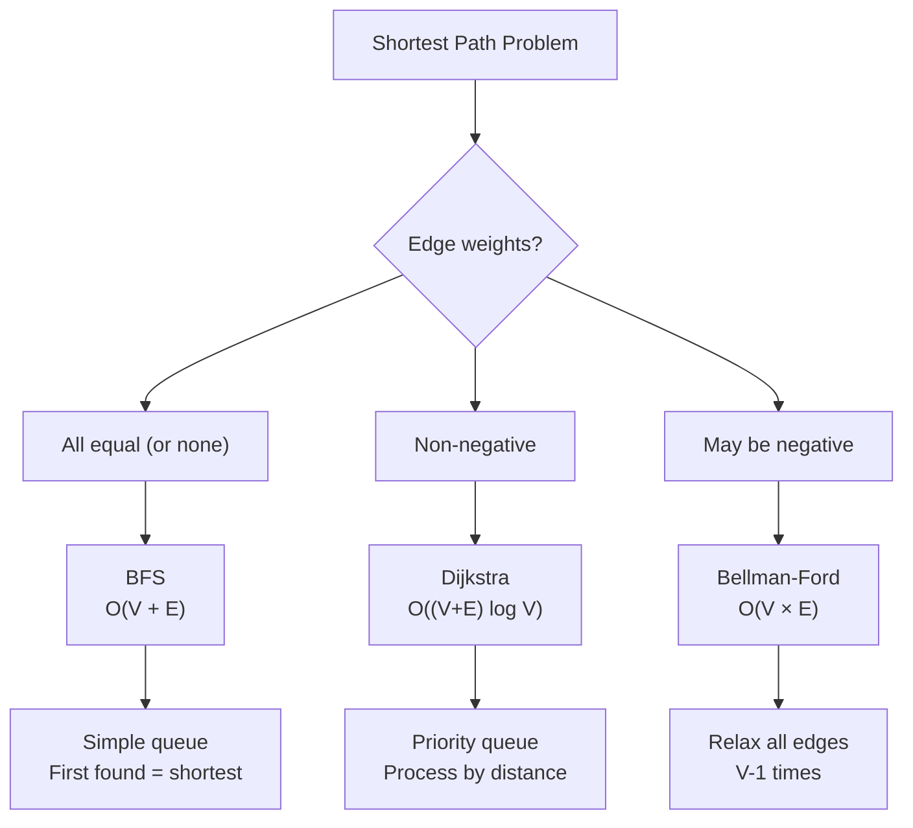

import { LanguageSelector, TimeEstimate, ConfidenceBuilder, DifficultyBadge } from '@site/src/components/interview-guide';
import { CodeTabs } from '@site/src/components/design-patterns/CodeTabs';
import TabItem from '@theme/TabItem';

# Shortest Path: Finding the Way

Different algorithms for different graph types. The key is knowing which to use when.

<LanguageSelector />

<TimeEstimate
  learnTime="35-45 minutes"
  practiceTime="4-5 hours"
  masteryTime="10-12 problems"
  interviewFrequency="25%"
  difficultyRange="Medium to Hard"
  prerequisites="Graphs, BFS, Priority Queues"
/>

---

## Algorithm Selection Guide



| Graph Type | Algorithm | Time Complexity |
|------------|-----------|-----------------|
| Unweighted | **BFS** | O(V + E) |
| Non-negative weights | **Dijkstra** | O((V+E) log V) |
| Negative weights (no neg cycle) | **Bellman-Ford** | O(V × E) |
| All pairs | **Floyd-Warshall** | O(V³) |

---

## BFS (Unweighted Graphs)

The simplest shortest path algorithm. Works when all edges have equal weight.

<CodeTabs>
<TabItem value="python" label="Python">

```python
from collections import deque

def shortest_path_bfs(
    graph: dict[int, list[int]], 
    start: int, 
    end: int
) -> int:
    """
    Find shortest path in unweighted graph using BFS.
    First path found is guaranteed to be shortest.
    
    Time: O(V + E), Space: O(V)
    """
    if start == end:
        return 0
    
    visited: set[int] = {start}
    queue: deque[tuple[int, int]] = deque([(start, 0)])
    
    while queue:
        node, dist = queue.popleft()
        
        for neighbor in graph.get(node, []):
            if neighbor == end:
                return dist + 1
            
            if neighbor not in visited:
                visited.add(neighbor)
                queue.append((neighbor, dist + 1))
    
    return -1  # No path exists


def shortest_path_bfs_with_path(
    graph: dict[int, list[int]], 
    start: int, 
    end: int
) -> tuple[int, list[int]]:
    """BFS with path reconstruction."""
    if start == end:
        return 0, [start]
    
    visited: set[int] = {start}
    queue: deque[tuple[int, list[int]]] = deque([(start, [start])])
    
    while queue:
        node, path = queue.popleft()
        
        for neighbor in graph.get(node, []):
            if neighbor == end:
                return len(path), path + [neighbor]
            
            if neighbor not in visited:
                visited.add(neighbor)
                queue.append((neighbor, path + [neighbor]))
    
    return -1, []
```

</TabItem>
<TabItem value="typescript" label="TypeScript">

```typescript
function shortestPathBFS(
  graph: Map<number, number[]>,
  start: number,
  end: number
): number {
  if (start === end) return 0;

  const visited: Set<number> = new Set([start]);
  const queue: [number, number][] = [[start, 0]];

  while (queue.length > 0) {
    const [node, dist] = queue.shift()!;

    for (const neighbor of graph.get(node) || []) {
      if (neighbor === end) return dist + 1;

      if (!visited.has(neighbor)) {
        visited.add(neighbor);
        queue.push([neighbor, dist + 1]);
      }
    }
  }

  return -1;
}
```

</TabItem>
<TabItem value="go" label="Go">

```go
func shortestPathBFS(graph map[int][]int, start, end int) int {
    if start == end {
        return 0
    }
    
    visited := map[int]bool{start: true}
    queue := [][2]int{{start, 0}} // {node, distance}
    
    for len(queue) > 0 {
        node, dist := queue[0][0], queue[0][1]
        queue = queue[1:]
        
        for _, neighbor := range graph[node] {
            if neighbor == end {
                return dist + 1
            }
            
            if !visited[neighbor] {
                visited[neighbor] = true
                queue = append(queue, [2]int{neighbor, dist + 1})
            }
        }
    }
    
    return -1
}
```

</TabItem>
<TabItem value="java" label="Java">

```java
public int shortestPathBFS(Map<Integer, List<Integer>> graph, int start, int end) {
    if (start == end) return 0;
    
    Set<Integer> visited = new HashSet<>();
    visited.add(start);
    Queue<int[]> queue = new LinkedList<>();
    queue.offer(new int[]{start, 0});
    
    while (!queue.isEmpty()) {
        int[] curr = queue.poll();
        int node = curr[0], dist = curr[1];
        
        for (int neighbor : graph.getOrDefault(node, List.of())) {
            if (neighbor == end) return dist + 1;
            
            if (!visited.contains(neighbor)) {
                visited.add(neighbor);
                queue.offer(new int[]{neighbor, dist + 1});
            }
        }
    }
    
    return -1;
}
```

</TabItem>
<TabItem value="cpp" label="C++">

```cpp
int shortestPathBFS(unordered_map<int, vector<int>>& graph, int start, int end) {
    if (start == end) return 0;
    
    unordered_set<int> visited;
    visited.insert(start);
    queue<pair<int, int>> q; // {node, distance}
    q.push({start, 0});
    
    while (!q.empty()) {
        auto [node, dist] = q.front();
        q.pop();
        
        for (int neighbor : graph[node]) {
            if (neighbor == end) return dist + 1;
            
            if (visited.find(neighbor) == visited.end()) {
                visited.insert(neighbor);
                q.push({neighbor, dist + 1});
            }
        }
    }
    
    return -1;
}
```

</TabItem>
<TabItem value="csharp" label="C#">

```csharp
public int ShortestPathBFS(Dictionary<int, List<int>> graph, int start, int end) {
    if (start == end) return 0;
    
    HashSet<int> visited = new() { start };
    Queue<(int node, int dist)> queue = new();
    queue.Enqueue((start, 0));
    
    while (queue.Count > 0) {
        var (node, dist) = queue.Dequeue();
        
        if (graph.TryGetValue(node, out var neighbors)) {
            foreach (int neighbor in neighbors) {
                if (neighbor == end) return dist + 1;
                
                if (!visited.Contains(neighbor)) {
                    visited.Add(neighbor);
                    queue.Enqueue((neighbor, dist + 1));
                }
            }
        }
    }
    
    return -1;
}
```

</TabItem>
</CodeTabs>

---

## Dijkstra's Algorithm (Non-Negative Weights)

The go-to algorithm for weighted graphs with non-negative edges.

<CodeTabs>
<TabItem value="python" label="Python">

```python
import heapq
from collections import defaultdict

def dijkstra(
    graph: dict[int, list[tuple[int, int]]], 
    start: int
) -> dict[int, int]:
    """
    Dijkstra's algorithm for shortest paths from start to all nodes.
    graph[node] = [(neighbor, weight), ...]
    
    Time: O((V + E) log V), Space: O(V)
    """
    distances: dict[int, float] = defaultdict(lambda: float('inf'))
    distances[start] = 0
    
    # Min-heap: (distance, node)
    heap: list[tuple[int, int]] = [(0, start)]
    
    while heap:
        dist, node = heapq.heappop(heap)
        
        # Skip if we've already found a shorter path
        if dist > distances[node]:
            continue
        
        for neighbor, weight in graph[node]:
            new_dist = dist + weight
            
            if new_dist < distances[neighbor]:
                distances[neighbor] = new_dist
                heapq.heappush(heap, (new_dist, neighbor))
    
    return dict(distances)


def dijkstra_to_target(
    graph: dict[int, list[tuple[int, int]]], 
    start: int, 
    end: int
) -> tuple[int, list[int]]:
    """Dijkstra with early termination and path reconstruction."""
    distances: dict[int, float] = defaultdict(lambda: float('inf'))
    distances[start] = 0
    previous: dict[int, int | None] = {start: None}
    
    heap: list[tuple[int, int]] = [(0, start)]
    
    while heap:
        dist, node = heapq.heappop(heap)
        
        # Early termination
        if node == end:
            break
        
        if dist > distances[node]:
            continue
        
        for neighbor, weight in graph[node]:
            new_dist = dist + weight
            
            if new_dist < distances[neighbor]:
                distances[neighbor] = new_dist
                previous[neighbor] = node
                heapq.heappush(heap, (new_dist, neighbor))
    
    # Reconstruct path
    if distances[end] == float('inf'):
        return -1, []
    
    path: list[int] = []
    current: int | None = end
    while current is not None:
        path.append(current)
        current = previous.get(current)
    
    return int(distances[end]), path[::-1]
```

</TabItem>
<TabItem value="typescript" label="TypeScript">

```typescript
class MinHeap {
  private heap: [number, number][] = [];

  push(item: [number, number]): void {
    this.heap.push(item);
    this.bubbleUp(this.heap.length - 1);
  }

  pop(): [number, number] | undefined {
    if (this.heap.length === 0) return undefined;
    const result = this.heap[0];
    const last = this.heap.pop()!;
    if (this.heap.length > 0) {
      this.heap[0] = last;
      this.bubbleDown(0);
    }
    return result;
  }

  get length(): number {
    return this.heap.length;
  }

  private bubbleUp(i: number): void {
    while (i > 0) {
      const parent = Math.floor((i - 1) / 2);
      if (this.heap[parent][0] <= this.heap[i][0]) break;
      [this.heap[parent], this.heap[i]] = [this.heap[i], this.heap[parent]];
      i = parent;
    }
  }

  private bubbleDown(i: number): void {
    while (true) {
      let smallest = i;
      const left = 2 * i + 1;
      const right = 2 * i + 2;
      if (left < this.heap.length && this.heap[left][0] < this.heap[smallest][0])
        smallest = left;
      if (right < this.heap.length && this.heap[right][0] < this.heap[smallest][0])
        smallest = right;
      if (smallest === i) break;
      [this.heap[smallest], this.heap[i]] = [this.heap[i], this.heap[smallest]];
      i = smallest;
    }
  }
}

function dijkstra(
  graph: Map<number, [number, number][]>,
  start: number
): Map<number, number> {
  const distances: Map<number, number> = new Map();
  distances.set(start, 0);

  const heap = new MinHeap();
  heap.push([0, start]);

  while (heap.length > 0) {
    const [dist, node] = heap.pop()!;

    if (distances.has(node) && dist > distances.get(node)!) continue;

    for (const [neighbor, weight] of graph.get(node) || []) {
      const newDist = dist + weight;
      if (!distances.has(neighbor) || newDist < distances.get(neighbor)!) {
        distances.set(neighbor, newDist);
        heap.push([newDist, neighbor]);
      }
    }
  }

  return distances;
}
```

</TabItem>
<TabItem value="go" label="Go">

```go
import (
    "container/heap"
    "math"
)

type Item struct {
    node, dist int
}

type MinHeap []Item

func (h MinHeap) Len() int           { return len(h) }
func (h MinHeap) Less(i, j int) bool { return h[i].dist < h[j].dist }
func (h MinHeap) Swap(i, j int)      { h[i], h[j] = h[j], h[i] }
func (h *MinHeap) Push(x any)        { *h = append(*h, x.(Item)) }
func (h *MinHeap) Pop() any {
    old := *h
    n := len(old)
    x := old[n-1]
    *h = old[0 : n-1]
    return x
}

func dijkstra(graph map[int][][2]int, start int) map[int]int {
    distances := make(map[int]int)
    for node := range graph {
        distances[node] = math.MaxInt32
    }
    distances[start] = 0
    
    h := &MinHeap{{start, 0}}
    heap.Init(h)
    
    for h.Len() > 0 {
        item := heap.Pop(h).(Item)
        node, dist := item.node, item.dist
        
        if dist > distances[node] {
            continue
        }
        
        for _, edge := range graph[node] {
            neighbor, weight := edge[0], edge[1]
            newDist := dist + weight
            
            if newDist < distances[neighbor] {
                distances[neighbor] = newDist
                heap.Push(h, Item{neighbor, newDist})
            }
        }
    }
    
    return distances
}
```

</TabItem>
<TabItem value="java" label="Java">

```java
public Map<Integer, Integer> dijkstra(
    Map<Integer, List<int[]>> graph, 
    int start
) {
    Map<Integer, Integer> distances = new HashMap<>();
    for (int node : graph.keySet()) {
        distances.put(node, Integer.MAX_VALUE);
    }
    distances.put(start, 0);
    
    // PriorityQueue: {distance, node}
    PriorityQueue<int[]> heap = new PriorityQueue<>((a, b) -> a[0] - b[0]);
    heap.offer(new int[]{0, start});
    
    while (!heap.isEmpty()) {
        int[] curr = heap.poll();
        int dist = curr[0], node = curr[1];
        
        if (dist > distances.get(node)) continue;
        
        for (int[] edge : graph.getOrDefault(node, List.of())) {
            int neighbor = edge[0], weight = edge[1];
            int newDist = dist + weight;
            
            if (newDist < distances.getOrDefault(neighbor, Integer.MAX_VALUE)) {
                distances.put(neighbor, newDist);
                heap.offer(new int[]{newDist, neighbor});
            }
        }
    }
    
    return distances;
}
```

</TabItem>
<TabItem value="cpp" label="C++">

```cpp
unordered_map<int, int> dijkstra(
    unordered_map<int, vector<pair<int, int>>>& graph, 
    int start
) {
    unordered_map<int, int> distances;
    for (auto& [node, _] : graph) {
        distances[node] = INT_MAX;
    }
    distances[start] = 0;
    
    // Min-heap: {distance, node}
    priority_queue<pair<int, int>, vector<pair<int, int>>, greater<>> heap;
    heap.push({0, start});
    
    while (!heap.empty()) {
        auto [dist, node] = heap.top();
        heap.pop();
        
        if (dist > distances[node]) continue;
        
        for (auto& [neighbor, weight] : graph[node]) {
            int newDist = dist + weight;
            
            if (newDist < distances[neighbor]) {
                distances[neighbor] = newDist;
                heap.push({newDist, neighbor});
            }
        }
    }
    
    return distances;
}
```

</TabItem>
<TabItem value="csharp" label="C#">

```csharp
public Dictionary<int, int> Dijkstra(
    Dictionary<int, List<(int neighbor, int weight)>> graph,
    int start
) {
    Dictionary<int, int> distances = new();
    foreach (var node in graph.Keys) {
        distances[node] = int.MaxValue;
    }
    distances[start] = 0;
    
    PriorityQueue<int, int> heap = new();
    heap.Enqueue(start, 0);
    
    while (heap.Count > 0) {
        int node = heap.Dequeue();
        int dist = distances[node];
        
        if (!graph.TryGetValue(node, out var edges)) continue;
        
        foreach (var (neighbor, weight) in edges) {
            int newDist = dist + weight;
            
            if (newDist < distances.GetValueOrDefault(neighbor, int.MaxValue)) {
                distances[neighbor] = newDist;
                heap.Enqueue(neighbor, newDist);
            }
        }
    }
    
    return distances;
}
```

</TabItem>
</CodeTabs>

<ConfidenceBuilder type="remember" title="Why Check dist > distances[node]?">

The heap may contain outdated entries for a node. If we've already processed a shorter path to this node, skip the outdated entry. This is why Dijkstra doesn't work with negative weights—we might find a shorter path after "finalizing" a node.

</ConfidenceBuilder>

---

## Bellman-Ford (Handles Negative Weights)

Use when edges can have negative weights (but no negative cycles).

<CodeTabs>
<TabItem value="python" label="Python">

```python
def bellman_ford(
    n: int, 
    edges: list[tuple[int, int, int]], 
    start: int
) -> list[float] | None:
    """
    Bellman-Ford algorithm for graphs with negative weights.
    edges = [(u, v, weight), ...]
    
    Returns None if negative cycle exists.
    Time: O(V × E), Space: O(V)
    """
    distances: list[float] = [float('inf')] * n
    distances[start] = 0
    
    # Relax all edges V-1 times
    for _ in range(n - 1):
        updated = False
        for u, v, weight in edges:
            if distances[u] + weight < distances[v]:
                distances[v] = distances[u] + weight
                updated = True
        
        # Early termination if no updates
        if not updated:
            break
    
    # Check for negative cycles (one more iteration)
    for u, v, weight in edges:
        if distances[u] + weight < distances[v]:
            return None  # Negative cycle exists
    
    return distances
```

</TabItem>
<TabItem value="typescript" label="TypeScript">

```typescript
function bellmanFord(
  n: number,
  edges: [number, number, number][],
  start: number
): number[] | null {
  const distances: number[] = new Array(n).fill(Infinity);
  distances[start] = 0;

  for (let i = 0; i < n - 1; i++) {
    let updated = false;
    for (const [u, v, weight] of edges) {
      if (distances[u] + weight < distances[v]) {
        distances[v] = distances[u] + weight;
        updated = true;
      }
    }
    if (!updated) break;
  }

  for (const [u, v, weight] of edges) {
    if (distances[u] + weight < distances[v]) {
      return null; // Negative cycle
    }
  }

  return distances;
}
```

</TabItem>
<TabItem value="go" label="Go">

```go
func bellmanFord(n int, edges [][3]int, start int) ([]int, bool) {
    distances := make([]int, n)
    for i := range distances {
        distances[i] = math.MaxInt32
    }
    distances[start] = 0
    
    for i := 0; i < n-1; i++ {
        updated := false
        for _, edge := range edges {
            u, v, weight := edge[0], edge[1], edge[2]
            if distances[u] != math.MaxInt32 && distances[u]+weight < distances[v] {
                distances[v] = distances[u] + weight
                updated = true
            }
        }
        if !updated {
            break
        }
    }
    
    for _, edge := range edges {
        u, v, weight := edge[0], edge[1], edge[2]
        if distances[u] != math.MaxInt32 && distances[u]+weight < distances[v] {
            return nil, false // Negative cycle
        }
    }
    
    return distances, true
}
```

</TabItem>
<TabItem value="java" label="Java">

```java
public int[] bellmanFord(int n, int[][] edges, int start) {
    int[] distances = new int[n];
    Arrays.fill(distances, Integer.MAX_VALUE);
    distances[start] = 0;
    
    for (int i = 0; i < n - 1; i++) {
        boolean updated = false;
        for (int[] edge : edges) {
            int u = edge[0], v = edge[1], weight = edge[2];
            if (distances[u] != Integer.MAX_VALUE && 
                distances[u] + weight < distances[v]) {
                distances[v] = distances[u] + weight;
                updated = true;
            }
        }
        if (!updated) break;
    }
    
    for (int[] edge : edges) {
        int u = edge[0], v = edge[1], weight = edge[2];
        if (distances[u] != Integer.MAX_VALUE && 
            distances[u] + weight < distances[v]) {
            return null; // Negative cycle
        }
    }
    
    return distances;
}
```

</TabItem>
<TabItem value="cpp" label="C++">

```cpp
vector<int> bellmanFord(int n, vector<tuple<int, int, int>>& edges, int start) {
    vector<int> distances(n, INT_MAX);
    distances[start] = 0;
    
    for (int i = 0; i < n - 1; i++) {
        bool updated = false;
        for (auto& [u, v, weight] : edges) {
            if (distances[u] != INT_MAX && distances[u] + weight < distances[v]) {
                distances[v] = distances[u] + weight;
                updated = true;
            }
        }
        if (!updated) break;
    }
    
    for (auto& [u, v, weight] : edges) {
        if (distances[u] != INT_MAX && distances[u] + weight < distances[v]) {
            return {}; // Negative cycle
        }
    }
    
    return distances;
}
```

</TabItem>
<TabItem value="csharp" label="C#">

```csharp
public int[]? BellmanFord(int n, int[][] edges, int start) {
    int[] distances = new int[n];
    Array.Fill(distances, int.MaxValue);
    distances[start] = 0;
    
    for (int i = 0; i < n - 1; i++) {
        bool updated = false;
        foreach (var edge in edges) {
            int u = edge[0], v = edge[1], weight = edge[2];
            if (distances[u] != int.MaxValue && 
                distances[u] + weight < distances[v]) {
                distances[v] = distances[u] + weight;
                updated = true;
            }
        }
        if (!updated) break;
    }
    
    foreach (var edge in edges) {
        int u = edge[0], v = edge[1], weight = edge[2];
        if (distances[u] != int.MaxValue && 
            distances[u] + weight < distances[v]) {
            return null; // Negative cycle
        }
    }
    
    return distances;
}
```

</TabItem>
</CodeTabs>

---

## 🎯 Pattern Triggers

| Problem Clue | Algorithm |
|--------------|-----------|
| "Shortest path" + unweighted | **BFS** |
| "Shortest path" + weights ≥ 0 | **Dijkstra** |
| "Shortest path" + negative weights | **Bellman-Ford** |
| "K stops" or limited steps | **Modified BFS/Bellman-Ford** |
| "Minimum effort" (max edge on path) | **Dijkstra variant** |
| "Detect negative cycle" | **Bellman-Ford** |

---

## 💬 How to Communicate This in Interviews

**Algorithm selection:**
> "First, let me check the edge weights. If they're all non-negative, I'll use Dijkstra with a priority queue for O((V+E) log V). If there might be negative weights, I'll need Bellman-Ford..."

**Dijkstra explanation:**
> "I'll use a min-heap to always process the node with the smallest known distance. When I pop a node, I relax its edges—if I find a shorter path to a neighbor, I update and add to the heap..."

**Handling duplicates in heap:**
> "The heap might have stale entries. I skip any entry where the distance is greater than what I've already computed. This is lazy deletion..."

---

## 🏋️ Practice Problems

| Problem | Difficulty | Algorithm |
|---------|------------|-----------|
| [Network Delay Time](https://leetcode.com/problems/network-delay-time/) | <DifficultyBadge level="medium" /> | Dijkstra |
| [Cheapest Flights Within K Stops](https://leetcode.com/problems/cheapest-flights-within-k-stops/) | <DifficultyBadge level="medium" /> | Modified Bellman-Ford |
| [Path With Minimum Effort](https://leetcode.com/problems/path-with-minimum-effort/) | <DifficultyBadge level="medium" /> | Dijkstra variant |
| [Shortest Path Binary Matrix](https://leetcode.com/problems/shortest-path-in-binary-matrix/) | <DifficultyBadge level="medium" /> | BFS |
| [Swim in Rising Water](https://leetcode.com/problems/swim-in-rising-water/) | <DifficultyBadge level="hard" /> | Dijkstra |

---

## Key Takeaways

1. **BFS for unweighted** graphs—simplest and fastest.

2. **Dijkstra for non-negative** weights—use priority queue.

3. **Bellman-Ford handles negatives** but is slower (O(V×E)).

4. **Detect negative cycles** with one extra Bellman-Ford iteration.

5. **Dijkstra variants** work for min-max path problems (change `+` to `max`).

<ConfidenceBuilder type="youve-got-this">

**Shortest path is about choosing the right tool.**

Know the three algorithms and when each applies. Most interview problems use Dijkstra or BFS. Bellman-Ford is rarer but essential when negative weights appear.

</ConfidenceBuilder>

---

## What's Next?

More graph patterns and techniques:

**See also:** [Graph Traversal](/docs/interview-guide/coding/patterns/graph-patterns/traversal) — BFS and DFS
