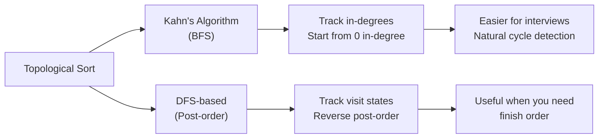

import { LanguageSelector, TimeEstimate, ConfidenceBuilder, DifficultyBadge } from '@site/src/components/interview-guide';
import { CodeTabs } from '@site/src/components/design-patterns/CodeTabs';
import TabItem from '@theme/TabItem';

# Topological Sort: Ordering Dependencies

Topological sort orders vertices in a DAG (Directed Acyclic Graph) so that for every edge u→v, u comes before v.

**When you see these keywords, think topological sort:**
- "ordering"
- "prerequisites"
- "dependencies"
- "build order"
- "schedule"

<LanguageSelector />

<TimeEstimate
  learnTime="25-30 minutes"
  practiceTime="2-3 hours"
  masteryTime="6-8 problems"
  interviewFrequency="25%"
  difficultyRange="Medium"
  prerequisites="Graphs, BFS/DFS"
/>

---

## Two Approaches



---

## Kahn's Algorithm (BFS) — Recommended

<CodeTabs>
<TabItem value="python" label="Python">

```python
from collections import deque, defaultdict

def topological_sort(num_nodes: int, edges: list[tuple[int, int]]) -> list[int]:
    """
    Kahn's algorithm for topological sort.
    
    Process:
    1. Build graph and count in-degrees
    2. Start with nodes having 0 in-degree
    3. Process node, reduce in-degree of neighbors
    4. Add neighbors with 0 in-degree to queue
    
    Returns empty list if cycle exists.
    Time: O(V + E), Space: O(V + E)
    """
    # Build adjacency list and in-degree count
    graph: dict[int, list[int]] = defaultdict(list)
    in_degree: list[int] = [0] * num_nodes
    
    for u, v in edges:  # u → v (u must come before v)
        graph[u].append(v)
        in_degree[v] += 1
    
    # Start with nodes having no dependencies
    queue: deque[int] = deque()
    for i in range(num_nodes):
        if in_degree[i] == 0:
            queue.append(i)
    
    result: list[int] = []
    
    while queue:
        node = queue.popleft()
        result.append(node)
        
        for neighbor in graph[node]:
            in_degree[neighbor] -= 1
            if in_degree[neighbor] == 0:
                queue.append(neighbor)
    
    # If we processed all nodes, no cycle exists
    if len(result) != num_nodes:
        return []  # Cycle detected
    
    return result
```

</TabItem>
<TabItem value="typescript" label="TypeScript">

```typescript
function topologicalSort(numNodes: number, edges: [number, number][]): number[] {
  const graph: Map<number, number[]> = new Map();
  const inDegree: number[] = new Array(numNodes).fill(0);

  for (const [u, v] of edges) {
    if (!graph.has(u)) graph.set(u, []);
    graph.get(u)!.push(v);
    inDegree[v]++;
  }

  const queue: number[] = [];
  for (let i = 0; i < numNodes; i++) {
    if (inDegree[i] === 0) queue.push(i);
  }

  const result: number[] = [];

  while (queue.length > 0) {
    const node = queue.shift()!;
    result.push(node);

    for (const neighbor of graph.get(node) || []) {
      inDegree[neighbor]--;
      if (inDegree[neighbor] === 0) {
        queue.push(neighbor);
      }
    }
  }

  return result.length === numNodes ? result : [];
}
```

</TabItem>
<TabItem value="go" label="Go">

```go
func topologicalSort(numNodes int, edges [][]int) []int {
    graph := make(map[int][]int)
    inDegree := make([]int, numNodes)
    
    for _, edge := range edges {
        u, v := edge[0], edge[1]
        graph[u] = append(graph[u], v)
        inDegree[v]++
    }
    
    queue := []int{}
    for i := 0; i < numNodes; i++ {
        if inDegree[i] == 0 {
            queue = append(queue, i)
        }
    }
    
    result := []int{}
    
    for len(queue) > 0 {
        node := queue[0]
        queue = queue[1:]
        result = append(result, node)
        
        for _, neighbor := range graph[node] {
            inDegree[neighbor]--
            if inDegree[neighbor] == 0 {
                queue = append(queue, neighbor)
            }
        }
    }
    
    if len(result) != numNodes {
        return []int{} // Cycle detected
    }
    
    return result
}
```

</TabItem>
<TabItem value="java" label="Java">

```java
public int[] topologicalSort(int numNodes, int[][] edges) {
    List<List<Integer>> graph = new ArrayList<>();
    int[] inDegree = new int[numNodes];
    
    for (int i = 0; i < numNodes; i++) {
        graph.add(new ArrayList<>());
    }
    
    for (int[] edge : edges) {
        graph.get(edge[0]).add(edge[1]);
        inDegree[edge[1]]++;
    }
    
    Queue<Integer> queue = new LinkedList<>();
    for (int i = 0; i < numNodes; i++) {
        if (inDegree[i] == 0) {
            queue.offer(i);
        }
    }
    
    int[] result = new int[numNodes];
    int index = 0;
    
    while (!queue.isEmpty()) {
        int node = queue.poll();
        result[index++] = node;
        
        for (int neighbor : graph.get(node)) {
            inDegree[neighbor]--;
            if (inDegree[neighbor] == 0) {
                queue.offer(neighbor);
            }
        }
    }
    
    return index == numNodes ? result : new int[0];
}
```

</TabItem>
<TabItem value="cpp" label="C++">

```cpp
vector<int> topologicalSort(int numNodes, vector<pair<int, int>>& edges) {
    vector<vector<int>> graph(numNodes);
    vector<int> inDegree(numNodes, 0);
    
    for (auto& [u, v] : edges) {
        graph[u].push_back(v);
        inDegree[v]++;
    }
    
    queue<int> q;
    for (int i = 0; i < numNodes; i++) {
        if (inDegree[i] == 0) {
            q.push(i);
        }
    }
    
    vector<int> result;
    
    while (!q.empty()) {
        int node = q.front();
        q.pop();
        result.push_back(node);
        
        for (int neighbor : graph[node]) {
            inDegree[neighbor]--;
            if (inDegree[neighbor] == 0) {
                q.push(neighbor);
            }
        }
    }
    
    return result.size() == numNodes ? result : vector<int>();
}
```

</TabItem>
<TabItem value="c" label="C">

```c
int* topologicalSort(int numNodes, int** edges, int edgesSize, int* returnSize) {
    int** graph = (int**)malloc(numNodes * sizeof(int*));
    int* graphSizes = (int*)calloc(numNodes, sizeof(int));
    int* graphCaps = (int*)malloc(numNodes * sizeof(int));
    int* inDegree = (int*)calloc(numNodes, sizeof(int));
    
    for (int i = 0; i < numNodes; i++) {
        graphCaps[i] = 4;
        graph[i] = (int*)malloc(4 * sizeof(int));
    }
    
    for (int i = 0; i < edgesSize; i++) {
        int u = edges[i][0], v = edges[i][1];
        if (graphSizes[u] >= graphCaps[u]) {
            graphCaps[u] *= 2;
            graph[u] = (int*)realloc(graph[u], graphCaps[u] * sizeof(int));
        }
        graph[u][graphSizes[u]++] = v;
        inDegree[v]++;
    }
    
    int* queue = (int*)malloc(numNodes * sizeof(int));
    int front = 0, rear = 0;
    
    for (int i = 0; i < numNodes; i++) {
        if (inDegree[i] == 0) queue[rear++] = i;
    }
    
    int* result = (int*)malloc(numNodes * sizeof(int));
    *returnSize = 0;
    
    while (front < rear) {
        int node = queue[front++];
        result[(*returnSize)++] = node;
        
        for (int i = 0; i < graphSizes[node]; i++) {
            int neighbor = graph[node][i];
            if (--inDegree[neighbor] == 0) {
                queue[rear++] = neighbor;
            }
        }
    }
    
    if (*returnSize != numNodes) *returnSize = 0;
    
    // Cleanup...
    return result;
}
```

</TabItem>
<TabItem value="csharp" label="C#">

```csharp
public int[] TopologicalSort(int numNodes, int[][] edges) {
    List<List<int>> graph = new();
    int[] inDegree = new int[numNodes];
    
    for (int i = 0; i < numNodes; i++) {
        graph.Add(new List<int>());
    }
    
    foreach (var edge in edges) {
        graph[edge[0]].Add(edge[1]);
        inDegree[edge[1]]++;
    }
    
    Queue<int> queue = new();
    for (int i = 0; i < numNodes; i++) {
        if (inDegree[i] == 0) queue.Enqueue(i);
    }
    
    List<int> result = new();
    
    while (queue.Count > 0) {
        int node = queue.Dequeue();
        result.Add(node);
        
        foreach (int neighbor in graph[node]) {
            if (--inDegree[neighbor] == 0) {
                queue.Enqueue(neighbor);
            }
        }
    }
    
    return result.Count == numNodes ? result.ToArray() : Array.Empty<int>();
}
```

</TabItem>
</CodeTabs>

<ConfidenceBuilder type="remember" title="Why Kahn's Algorithm Works">

Nodes with 0 in-degree have no dependencies—they can go first. After processing a node, its dependents may now have 0 in-degree. If we can't process all nodes, there's a cycle (circular dependency).

</ConfidenceBuilder>

---

## Course Schedule (Can Finish?)

<CodeTabs>
<TabItem value="python" label="Python">

```python
from collections import deque, defaultdict

def can_finish(num_courses: int, prerequisites: list[list[int]]) -> bool:
    """
    Can you finish all courses given prerequisites?
    
    prerequisites[i] = [course, prereq] means:
    You must take prereq before course.
    
    This is just checking if topological sort exists (no cycle).
    """
    graph: dict[int, list[int]] = defaultdict(list)
    in_degree: list[int] = [0] * num_courses
    
    for course, prereq in prerequisites:
        graph[prereq].append(course)  # prereq → course
        in_degree[course] += 1
    
    # Start with courses having no prerequisites
    queue: deque[int] = deque()
    for i in range(num_courses):
        if in_degree[i] == 0:
            queue.append(i)
    
    completed = 0
    
    while queue:
        course = queue.popleft()
        completed += 1
        
        for next_course in graph[course]:
            in_degree[next_course] -= 1
            if in_degree[next_course] == 0:
                queue.append(next_course)
    
    return completed == num_courses

# [[1,0]] → True (take 0 before 1)
# [[1,0],[0,1]] → False (cycle: 0 needs 1, 1 needs 0)
```

</TabItem>
<TabItem value="typescript" label="TypeScript">

```typescript
function canFinish(numCourses: number, prerequisites: number[][]): boolean {
  const graph: Map<number, number[]> = new Map();
  const inDegree: number[] = new Array(numCourses).fill(0);

  for (const [course, prereq] of prerequisites) {
    if (!graph.has(prereq)) graph.set(prereq, []);
    graph.get(prereq)!.push(course);
    inDegree[course]++;
  }

  const queue: number[] = [];
  for (let i = 0; i < numCourses; i++) {
    if (inDegree[i] === 0) queue.push(i);
  }

  let completed = 0;

  while (queue.length > 0) {
    const course = queue.shift()!;
    completed++;

    for (const nextCourse of graph.get(course) || []) {
      if (--inDegree[nextCourse] === 0) {
        queue.push(nextCourse);
      }
    }
  }

  return completed === numCourses;
}
```

</TabItem>
<TabItem value="go" label="Go">

```go
func canFinish(numCourses int, prerequisites [][]int) bool {
    graph := make(map[int][]int)
    inDegree := make([]int, numCourses)
    
    for _, prereq := range prerequisites {
        course, pre := prereq[0], prereq[1]
        graph[pre] = append(graph[pre], course)
        inDegree[course]++
    }
    
    queue := []int{}
    for i := 0; i < numCourses; i++ {
        if inDegree[i] == 0 {
            queue = append(queue, i)
        }
    }
    
    completed := 0
    
    for len(queue) > 0 {
        course := queue[0]
        queue = queue[1:]
        completed++
        
        for _, nextCourse := range graph[course] {
            inDegree[nextCourse]--
            if inDegree[nextCourse] == 0 {
                queue = append(queue, nextCourse)
            }
        }
    }
    
    return completed == numCourses
}
```

</TabItem>
<TabItem value="java" label="Java">

```java
public boolean canFinish(int numCourses, int[][] prerequisites) {
    List<List<Integer>> graph = new ArrayList<>();
    int[] inDegree = new int[numCourses];
    
    for (int i = 0; i < numCourses; i++) {
        graph.add(new ArrayList<>());
    }
    
    for (int[] prereq : prerequisites) {
        graph.get(prereq[1]).add(prereq[0]);
        inDegree[prereq[0]]++;
    }
    
    Queue<Integer> queue = new LinkedList<>();
    for (int i = 0; i < numCourses; i++) {
        if (inDegree[i] == 0) queue.offer(i);
    }
    
    int completed = 0;
    
    while (!queue.isEmpty()) {
        int course = queue.poll();
        completed++;
        
        for (int nextCourse : graph.get(course)) {
            if (--inDegree[nextCourse] == 0) {
                queue.offer(nextCourse);
            }
        }
    }
    
    return completed == numCourses;
}
```

</TabItem>
<TabItem value="cpp" label="C++">

```cpp
bool canFinish(int numCourses, vector<vector<int>>& prerequisites) {
    vector<vector<int>> graph(numCourses);
    vector<int> inDegree(numCourses, 0);
    
    for (auto& prereq : prerequisites) {
        graph[prereq[1]].push_back(prereq[0]);
        inDegree[prereq[0]]++;
    }
    
    queue<int> q;
    for (int i = 0; i < numCourses; i++) {
        if (inDegree[i] == 0) q.push(i);
    }
    
    int completed = 0;
    
    while (!q.empty()) {
        int course = q.front();
        q.pop();
        completed++;
        
        for (int nextCourse : graph[course]) {
            if (--inDegree[nextCourse] == 0) {
                q.push(nextCourse);
            }
        }
    }
    
    return completed == numCourses;
}
```

</TabItem>
<TabItem value="csharp" label="C#">

```csharp
public bool CanFinish(int numCourses, int[][] prerequisites) {
    List<List<int>> graph = new();
    int[] inDegree = new int[numCourses];
    
    for (int i = 0; i < numCourses; i++) {
        graph.Add(new List<int>());
    }
    
    foreach (var prereq in prerequisites) {
        graph[prereq[1]].Add(prereq[0]);
        inDegree[prereq[0]]++;
    }
    
    Queue<int> queue = new();
    for (int i = 0; i < numCourses; i++) {
        if (inDegree[i] == 0) queue.Enqueue(i);
    }
    
    int completed = 0;
    
    while (queue.Count > 0) {
        int course = queue.Dequeue();
        completed++;
        
        foreach (int nextCourse in graph[course]) {
            if (--inDegree[nextCourse] == 0) {
                queue.Enqueue(nextCourse);
            }
        }
    }
    
    return completed == numCourses;
}
```

</TabItem>
</CodeTabs>

---

## Course Schedule II (Return Order)

<CodeTabs>
<TabItem value="python" label="Python">

```python
from collections import deque, defaultdict

def find_order(num_courses: int, prerequisites: list[list[int]]) -> list[int]:
    """
    Return order to take courses, or empty if impossible.
    Same as topological sort.
    """
    graph: dict[int, list[int]] = defaultdict(list)
    in_degree: list[int] = [0] * num_courses
    
    for course, prereq in prerequisites:
        graph[prereq].append(course)
        in_degree[course] += 1
    
    queue: deque[int] = deque()
    for i in range(num_courses):
        if in_degree[i] == 0:
            queue.append(i)
    
    order: list[int] = []
    
    while queue:
        course = queue.popleft()
        order.append(course)
        
        for next_course in graph[course]:
            in_degree[next_course] -= 1
            if in_degree[next_course] == 0:
                queue.append(next_course)
    
    return order if len(order) == num_courses else []

# 4 courses, [[1,0],[2,0],[3,1],[3,2]] → [0,1,2,3] or [0,2,1,3]
```

</TabItem>
<TabItem value="typescript" label="TypeScript">

```typescript
function findOrder(numCourses: number, prerequisites: number[][]): number[] {
  const graph: Map<number, number[]> = new Map();
  const inDegree: number[] = new Array(numCourses).fill(0);

  for (const [course, prereq] of prerequisites) {
    if (!graph.has(prereq)) graph.set(prereq, []);
    graph.get(prereq)!.push(course);
    inDegree[course]++;
  }

  const queue: number[] = [];
  for (let i = 0; i < numCourses; i++) {
    if (inDegree[i] === 0) queue.push(i);
  }

  const order: number[] = [];

  while (queue.length > 0) {
    const course = queue.shift()!;
    order.push(course);

    for (const nextCourse of graph.get(course) || []) {
      if (--inDegree[nextCourse] === 0) {
        queue.push(nextCourse);
      }
    }
  }

  return order.length === numCourses ? order : [];
}
```

</TabItem>
<TabItem value="java" label="Java">

```java
public int[] findOrder(int numCourses, int[][] prerequisites) {
    List<List<Integer>> graph = new ArrayList<>();
    int[] inDegree = new int[numCourses];
    
    for (int i = 0; i < numCourses; i++) {
        graph.add(new ArrayList<>());
    }
    
    for (int[] prereq : prerequisites) {
        graph.get(prereq[1]).add(prereq[0]);
        inDegree[prereq[0]]++;
    }
    
    Queue<Integer> queue = new LinkedList<>();
    for (int i = 0; i < numCourses; i++) {
        if (inDegree[i] == 0) queue.offer(i);
    }
    
    int[] order = new int[numCourses];
    int index = 0;
    
    while (!queue.isEmpty()) {
        int course = queue.poll();
        order[index++] = course;
        
        for (int nextCourse : graph.get(course)) {
            if (--inDegree[nextCourse] == 0) {
                queue.offer(nextCourse);
            }
        }
    }
    
    return index == numCourses ? order : new int[0];
}
```

</TabItem>
<TabItem value="go" label="Go">

```go
func findOrder(numCourses int, prerequisites [][]int) []int {
    graph := make(map[int][]int)
    inDegree := make([]int, numCourses)
    
    for _, prereq := range prerequisites {
        course, pre := prereq[0], prereq[1]
        graph[pre] = append(graph[pre], course)
        inDegree[course]++
    }
    
    queue := []int{}
    for i := 0; i < numCourses; i++ {
        if inDegree[i] == 0 {
            queue = append(queue, i)
        }
    }
    
    order := []int{}
    
    for len(queue) > 0 {
        course := queue[0]
        queue = queue[1:]
        order = append(order, course)
        
        for _, nextCourse := range graph[course] {
            inDegree[nextCourse]--
            if inDegree[nextCourse] == 0 {
                queue = append(queue, nextCourse)
            }
        }
    }
    
    if len(order) != numCourses {
        return []int{}
    }
    return order
}
```

</TabItem>
<TabItem value="cpp" label="C++">

```cpp
vector<int> findOrder(int numCourses, vector<vector<int>>& prerequisites) {
    vector<vector<int>> graph(numCourses);
    vector<int> inDegree(numCourses, 0);
    
    for (auto& prereq : prerequisites) {
        graph[prereq[1]].push_back(prereq[0]);
        inDegree[prereq[0]]++;
    }
    
    queue<int> q;
    for (int i = 0; i < numCourses; i++) {
        if (inDegree[i] == 0) q.push(i);
    }
    
    vector<int> order;
    
    while (!q.empty()) {
        int course = q.front();
        q.pop();
        order.push_back(course);
        
        for (int nextCourse : graph[course]) {
            if (--inDegree[nextCourse] == 0) {
                q.push(nextCourse);
            }
        }
    }
    
    return order.size() == numCourses ? order : vector<int>();
}
```

</TabItem>
<TabItem value="csharp" label="C#">

```csharp
public int[] FindOrder(int numCourses, int[][] prerequisites) {
    List<List<int>> graph = new();
    int[] inDegree = new int[numCourses];
    
    for (int i = 0; i < numCourses; i++) {
        graph.Add(new List<int>());
    }
    
    foreach (var prereq in prerequisites) {
        graph[prereq[1]].Add(prereq[0]);
        inDegree[prereq[0]]++;
    }
    
    Queue<int> queue = new();
    for (int i = 0; i < numCourses; i++) {
        if (inDegree[i] == 0) queue.Enqueue(i);
    }
    
    List<int> order = new();
    
    while (queue.Count > 0) {
        int course = queue.Dequeue();
        order.Add(course);
        
        foreach (int nextCourse in graph[course]) {
            if (--inDegree[nextCourse] == 0) {
                queue.Enqueue(nextCourse);
            }
        }
    }
    
    return order.Count == numCourses ? order.ToArray() : Array.Empty<int>();
}
```

</TabItem>
</CodeTabs>

---

## 🎯 Pattern Triggers

| Problem Clue | Approach |
|--------------|----------|
| "Course prerequisites" | Topological sort |
| "Build order" | Topological sort |
| "Task dependencies" | Topological sort |
| "Can complete all?" | Check if valid topo order exists |
| "Return valid order" | Return topo sort result |
| "Detect circular dependency" | Cycle detection (count != total) |

---

## 💬 How to Communicate This in Interviews

**Identifying the pattern:**
> "This is a dependency ordering problem. I'll use topological sort with Kahn's algorithm..."

**Explaining the approach:**
> "I'll track in-degrees—the number of dependencies each node has. Nodes with zero in-degree can be processed first. After processing, I reduce the in-degree of dependent nodes..."

**Handling cycles:**
> "If I can't process all nodes, there's a cycle. With Kahn's algorithm, I check if the result size equals the total number of nodes..."

---

## 🏋️ Practice Problems

| Problem | Difficulty | Companies | Notes |
|---------|------------|-----------|-------|
| [Course Schedule](https://leetcode.com/problems/course-schedule/) | <DifficultyBadge level="medium" /> | Amazon, Google | Cycle detection |
| [Course Schedule II](https://leetcode.com/problems/course-schedule-ii/) | <DifficultyBadge level="medium" /> | Amazon, Meta | Return order |
| [Alien Dictionary](https://leetcode.com/problems/alien-dictionary/) | <DifficultyBadge level="hard" /> | Meta, Google | Build graph from words |
| [Minimum Height Trees](https://leetcode.com/problems/minimum-height-trees/) | <DifficultyBadge level="medium" /> | Google | Reverse topo sort |
| [Parallel Courses](https://leetcode.com/problems/parallel-courses/) | <DifficultyBadge level="medium" /> | Google | Track levels |

---

## Key Takeaways

1. **Kahn's algorithm (BFS)** is often simpler for interviews.

2. **Cycle detection** is built-in: count != total nodes means cycle.

3. **Build the graph** from dependency pairs first.

4. **In-degree tracking** is the key insight.

5. **Zero in-degree** = no dependencies = can process now.

<ConfidenceBuilder type="youve-got-this">

**Topological sort is a straightforward algorithm once you understand it.**

The pattern is consistent: build graph, track in-degrees, BFS from zero in-degree nodes. Most variations just add requirements on top of this base.

</ConfidenceBuilder>

---

## What's Next?

Bit manipulation for low-level optimization:

**Next up:** [Bit Manipulation](/docs/interview-guide/coding/patterns/bit-manipulation/basics) — XOR Tricks and More
