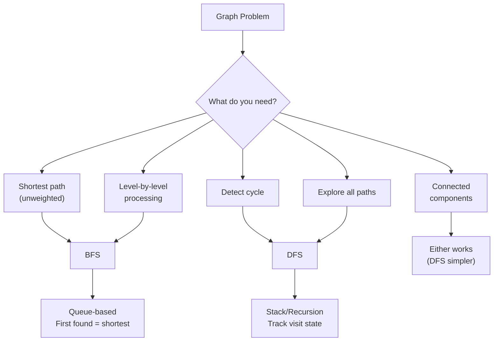

import { LanguageSelector, TimeEstimate, ConfidenceBuilder, DifficultyBadge } from '@site/src/components/interview-guide';
import { CodeTabs } from '@site/src/components/design-patterns/CodeTabs';
import TabItem from '@theme/TabItem';

# Graph Traversal: BFS vs DFS

"When do I use BFS? When do I use DFS?"

This question confused me for months. I'd pick randomly and hope it worked.

**The simple rule:**
- **BFS:** When you need **shortest path** or **level-by-level** processing
- **DFS:** When you need to **explore all paths** or **detect cycles**

<LanguageSelector />

<TimeEstimate
  learnTime="35-45 minutes"
  practiceTime="4-6 hours"
  masteryTime="15-20 problems"
  interviewFrequency="40%"
  difficultyRange="Medium to Hard"
  prerequisites="Graphs Data Structure, Queues, Stacks"
/>

---

## Decision Framework



---

## BFS: Level by Level

### Basic BFS Template

<CodeTabs>
<TabItem value="python" label="Python">

```python
from collections import deque

def bfs(graph: dict[int, list[int]], start: int) -> list[int]:
    """
    BFS traversal from start node.
    Returns nodes in BFS order (level by level).
    
    Time: O(V + E), Space: O(V)
    """
    visited: set[int] = {start}
    queue: deque[int] = deque([start])
    result: list[int] = []
    
    while queue:
        node = queue.popleft()
        result.append(node)
        
        for neighbor in graph.get(node, []):
            if neighbor not in visited:
                visited.add(neighbor)  # Mark BEFORE adding to queue
                queue.append(neighbor)
    
    return result
```

</TabItem>
<TabItem value="typescript" label="TypeScript">

```typescript
function bfs(graph: Map<number, number[]>, start: number): number[] {
  const visited: Set<number> = new Set([start]);
  const queue: number[] = [start];
  const result: number[] = [];

  while (queue.length > 0) {
    const node = queue.shift()!;
    result.push(node);

    for (const neighbor of graph.get(node) || []) {
      if (!visited.has(neighbor)) {
        visited.add(neighbor);
        queue.push(neighbor);
      }
    }
  }

  return result;
}
```

</TabItem>
<TabItem value="go" label="Go">

```go
func bfs(graph map[int][]int, start int) []int {
    visited := map[int]bool{start: true}
    queue := []int{start}
    result := []int{}
    
    for len(queue) > 0 {
        node := queue[0]
        queue = queue[1:]
        result = append(result, node)
        
        for _, neighbor := range graph[node] {
            if !visited[neighbor] {
                visited[neighbor] = true
                queue = append(queue, neighbor)
            }
        }
    }
    
    return result
}
```

</TabItem>
<TabItem value="java" label="Java">

```java
public List<Integer> bfs(Map<Integer, List<Integer>> graph, int start) {
    Set<Integer> visited = new HashSet<>();
    visited.add(start);
    Queue<Integer> queue = new LinkedList<>();
    queue.offer(start);
    List<Integer> result = new ArrayList<>();
    
    while (!queue.isEmpty()) {
        int node = queue.poll();
        result.add(node);
        
        for (int neighbor : graph.getOrDefault(node, List.of())) {
            if (!visited.contains(neighbor)) {
                visited.add(neighbor);
                queue.offer(neighbor);
            }
        }
    }
    
    return result;
}
```

</TabItem>
<TabItem value="cpp" label="C++">

```cpp
vector<int> bfs(unordered_map<int, vector<int>>& graph, int start) {
    unordered_set<int> visited;
    visited.insert(start);
    queue<int> q;
    q.push(start);
    vector<int> result;
    
    while (!q.empty()) {
        int node = q.front();
        q.pop();
        result.push_back(node);
        
        for (int neighbor : graph[node]) {
            if (visited.find(neighbor) == visited.end()) {
                visited.insert(neighbor);
                q.push(neighbor);
            }
        }
    }
    
    return result;
}
```

</TabItem>
<TabItem value="c" label="C">

```c
void bfs(int** graph, int* graphSizes, int n, int start, int* result, int* resultSize) {
    int* visited = (int*)calloc(n, sizeof(int));
    int* queue = (int*)malloc(n * sizeof(int));
    int front = 0, rear = 0;
    
    visited[start] = 1;
    queue[rear++] = start;
    *resultSize = 0;
    
    while (front < rear) {
        int node = queue[front++];
        result[(*resultSize)++] = node;
        
        for (int i = 0; i < graphSizes[node]; i++) {
            int neighbor = graph[node][i];
            if (!visited[neighbor]) {
                visited[neighbor] = 1;
                queue[rear++] = neighbor;
            }
        }
    }
    
    free(visited);
    free(queue);
}
```

</TabItem>
<TabItem value="csharp" label="C#">

```csharp
public List<int> BFS(Dictionary<int, List<int>> graph, int start) {
    HashSet<int> visited = new() { start };
    Queue<int> queue = new();
    queue.Enqueue(start);
    List<int> result = new();
    
    while (queue.Count > 0) {
        int node = queue.Dequeue();
        result.Add(node);
        
        if (graph.TryGetValue(node, out var neighbors)) {
            foreach (int neighbor in neighbors) {
                if (!visited.Contains(neighbor)) {
                    visited.Add(neighbor);
                    queue.Enqueue(neighbor);
                }
            }
        }
    }
    
    return result;
}
```

</TabItem>
</CodeTabs>

<ConfidenceBuilder type="remember" title="Mark Before Queuing">

**Critical:** Add to `visited` BEFORE adding to queue, not after popping. This prevents the same node from being added multiple times.

</ConfidenceBuilder>

---

### BFS with Level Tracking

<CodeTabs>
<TabItem value="python" label="Python">

```python
def bfs_levels(graph: dict[int, list[int]], start: int) -> list[list[int]]:
    """
    BFS with level tracking.
    Returns nodes grouped by their distance from start.
    """
    visited: set[int] = {start}
    queue: deque[int] = deque([start])
    levels: list[list[int]] = []
    
    while queue:
        level_size = len(queue)
        current_level: list[int] = []
        
        for _ in range(level_size):
            node = queue.popleft()
            current_level.append(node)
            
            for neighbor in graph.get(node, []):
                if neighbor not in visited:
                    visited.add(neighbor)
                    queue.append(neighbor)
        
        levels.append(current_level)
    
    return levels
```

</TabItem>
<TabItem value="typescript" label="TypeScript">

```typescript
function bfsLevels(graph: Map<number, number[]>, start: number): number[][] {
  const visited: Set<number> = new Set([start]);
  let queue: number[] = [start];
  const levels: number[][] = [];

  while (queue.length > 0) {
    const currentLevel: number[] = [];
    const nextQueue: number[] = [];

    for (const node of queue) {
      currentLevel.push(node);

      for (const neighbor of graph.get(node) || []) {
        if (!visited.has(neighbor)) {
          visited.add(neighbor);
          nextQueue.push(neighbor);
        }
      }
    }

    levels.push(currentLevel);
    queue = nextQueue;
  }

  return levels;
}
```

</TabItem>
<TabItem value="java" label="Java">

```java
public List<List<Integer>> bfsLevels(Map<Integer, List<Integer>> graph, int start) {
    Set<Integer> visited = new HashSet<>();
    visited.add(start);
    Queue<Integer> queue = new LinkedList<>();
    queue.offer(start);
    List<List<Integer>> levels = new ArrayList<>();
    
    while (!queue.isEmpty()) {
        int levelSize = queue.size();
        List<Integer> currentLevel = new ArrayList<>();
        
        for (int i = 0; i < levelSize; i++) {
            int node = queue.poll();
            currentLevel.add(node);
            
            for (int neighbor : graph.getOrDefault(node, List.of())) {
                if (!visited.contains(neighbor)) {
                    visited.add(neighbor);
                    queue.offer(neighbor);
                }
            }
        }
        
        levels.add(currentLevel);
    }
    
    return levels;
}
```

</TabItem>
<TabItem value="go" label="Go">

```go
func bfsLevels(graph map[int][]int, start int) [][]int {
    visited := map[int]bool{start: true}
    queue := []int{start}
    levels := [][]int{}
    
    for len(queue) > 0 {
        levelSize := len(queue)
        currentLevel := []int{}
        
        for i := 0; i < levelSize; i++ {
            node := queue[0]
            queue = queue[1:]
            currentLevel = append(currentLevel, node)
            
            for _, neighbor := range graph[node] {
                if !visited[neighbor] {
                    visited[neighbor] = true
                    queue = append(queue, neighbor)
                }
            }
        }
        
        levels = append(levels, currentLevel)
    }
    
    return levels
}
```

</TabItem>
<TabItem value="cpp" label="C++">

```cpp
vector<vector<int>> bfsLevels(unordered_map<int, vector<int>>& graph, int start) {
    unordered_set<int> visited;
    visited.insert(start);
    queue<int> q;
    q.push(start);
    vector<vector<int>> levels;
    
    while (!q.empty()) {
        int levelSize = q.size();
        vector<int> currentLevel;
        
        for (int i = 0; i < levelSize; i++) {
            int node = q.front();
            q.pop();
            currentLevel.push_back(node);
            
            for (int neighbor : graph[node]) {
                if (visited.find(neighbor) == visited.end()) {
                    visited.insert(neighbor);
                    q.push(neighbor);
                }
            }
        }
        
        levels.push_back(currentLevel);
    }
    
    return levels;
}
```

</TabItem>
<TabItem value="csharp" label="C#">

```csharp
public List<List<int>> BFSLevels(Dictionary<int, List<int>> graph, int start) {
    HashSet<int> visited = new() { start };
    Queue<int> queue = new();
    queue.Enqueue(start);
    List<List<int>> levels = new();
    
    while (queue.Count > 0) {
        int levelSize = queue.Count;
        List<int> currentLevel = new();
        
        for (int i = 0; i < levelSize; i++) {
            int node = queue.Dequeue();
            currentLevel.Add(node);
            
            if (graph.TryGetValue(node, out var neighbors)) {
                foreach (int neighbor in neighbors) {
                    if (!visited.Contains(neighbor)) {
                        visited.Add(neighbor);
                        queue.Enqueue(neighbor);
                    }
                }
            }
        }
        
        levels.Add(currentLevel);
    }
    
    return levels;
}
```

</TabItem>
</CodeTabs>

---

## DFS: Go Deep First

### Recursive DFS

<CodeTabs>
<TabItem value="python" label="Python">

```python
def dfs_recursive(
    graph: dict[int, list[int]], 
    start: int,
    visited: set[int] | None = None
) -> list[int]:
    """
    DFS traversal using recursion.
    Returns nodes in DFS order.
    """
    if visited is None:
        visited = set()
    
    visited.add(start)
    result = [start]
    
    for neighbor in graph.get(start, []):
        if neighbor not in visited:
            result.extend(dfs_recursive(graph, neighbor, visited))
    
    return result
```

</TabItem>
<TabItem value="typescript" label="TypeScript">

```typescript
function dfsRecursive(
  graph: Map<number, number[]>,
  start: number,
  visited: Set<number> = new Set()
): number[] {
  visited.add(start);
  const result: number[] = [start];

  for (const neighbor of graph.get(start) || []) {
    if (!visited.has(neighbor)) {
      result.push(...dfsRecursive(graph, neighbor, visited));
    }
  }

  return result;
}
```

</TabItem>
<TabItem value="go" label="Go">

```go
func dfsRecursive(graph map[int][]int, start int, visited map[int]bool) []int {
    if visited == nil {
        visited = make(map[int]bool)
    }
    
    visited[start] = true
    result := []int{start}
    
    for _, neighbor := range graph[start] {
        if !visited[neighbor] {
            result = append(result, dfsRecursive(graph, neighbor, visited)...)
        }
    }
    
    return result
}
```

</TabItem>
<TabItem value="java" label="Java">

```java
public List<Integer> dfsRecursive(Map<Integer, List<Integer>> graph, int start) {
    List<Integer> result = new ArrayList<>();
    Set<Integer> visited = new HashSet<>();
    dfsHelper(graph, start, visited, result);
    return result;
}

private void dfsHelper(Map<Integer, List<Integer>> graph, int node,
                       Set<Integer> visited, List<Integer> result) {
    visited.add(node);
    result.add(node);
    
    for (int neighbor : graph.getOrDefault(node, List.of())) {
        if (!visited.contains(neighbor)) {
            dfsHelper(graph, neighbor, visited, result);
        }
    }
}
```

</TabItem>
<TabItem value="cpp" label="C++">

```cpp
void dfsHelper(unordered_map<int, vector<int>>& graph, int node,
               unordered_set<int>& visited, vector<int>& result) {
    visited.insert(node);
    result.push_back(node);
    
    for (int neighbor : graph[node]) {
        if (visited.find(neighbor) == visited.end()) {
            dfsHelper(graph, neighbor, visited, result);
        }
    }
}

vector<int> dfsRecursive(unordered_map<int, vector<int>>& graph, int start) {
    unordered_set<int> visited;
    vector<int> result;
    dfsHelper(graph, start, visited, result);
    return result;
}
```

</TabItem>
<TabItem value="csharp" label="C#">

```csharp
public List<int> DFSRecursive(Dictionary<int, List<int>> graph, int start) {
    HashSet<int> visited = new();
    List<int> result = new();
    DFSHelper(graph, start, visited, result);
    return result;
}

private void DFSHelper(Dictionary<int, List<int>> graph, int node,
                       HashSet<int> visited, List<int> result) {
    visited.Add(node);
    result.Add(node);
    
    if (graph.TryGetValue(node, out var neighbors)) {
        foreach (int neighbor in neighbors) {
            if (!visited.Contains(neighbor)) {
                DFSHelper(graph, neighbor, visited, result);
            }
        }
    }
}
```

</TabItem>
</CodeTabs>

---

### Iterative DFS (Using Stack)

<CodeTabs>
<TabItem value="python" label="Python">

```python
def dfs_iterative(graph: dict[int, list[int]], start: int) -> list[int]:
    """
    DFS traversal using explicit stack.
    Useful when recursion depth might be too deep.
    """
    visited: set[int] = set()
    stack: list[int] = [start]
    result: list[int] = []
    
    while stack:
        node = stack.pop()
        
        if node in visited:
            continue
        
        visited.add(node)
        result.append(node)
        
        # Add neighbors in reverse order for same order as recursive
        for neighbor in reversed(graph.get(node, [])):
            if neighbor not in visited:
                stack.append(neighbor)
    
    return result
```

</TabItem>
<TabItem value="typescript" label="TypeScript">

```typescript
function dfsIterative(graph: Map<number, number[]>, start: number): number[] {
  const visited: Set<number> = new Set();
  const stack: number[] = [start];
  const result: number[] = [];

  while (stack.length > 0) {
    const node = stack.pop()!;

    if (visited.has(node)) continue;

    visited.add(node);
    result.push(node);

    const neighbors = graph.get(node) || [];
    for (let i = neighbors.length - 1; i >= 0; i--) {
      if (!visited.has(neighbors[i])) {
        stack.push(neighbors[i]);
      }
    }
  }

  return result;
}
```

</TabItem>
<TabItem value="java" label="Java">

```java
public List<Integer> dfsIterative(Map<Integer, List<Integer>> graph, int start) {
    Set<Integer> visited = new HashSet<>();
    Deque<Integer> stack = new ArrayDeque<>();
    stack.push(start);
    List<Integer> result = new ArrayList<>();
    
    while (!stack.isEmpty()) {
        int node = stack.pop();
        
        if (visited.contains(node)) continue;
        
        visited.add(node);
        result.add(node);
        
        List<Integer> neighbors = graph.getOrDefault(node, List.of());
        for (int i = neighbors.size() - 1; i >= 0; i--) {
            if (!visited.contains(neighbors.get(i))) {
                stack.push(neighbors.get(i));
            }
        }
    }
    
    return result;
}
```

</TabItem>
<TabItem value="go" label="Go">

```go
func dfsIterative(graph map[int][]int, start int) []int {
    visited := make(map[int]bool)
    stack := []int{start}
    result := []int{}
    
    for len(stack) > 0 {
        node := stack[len(stack)-1]
        stack = stack[:len(stack)-1]
        
        if visited[node] {
            continue
        }
        
        visited[node] = true
        result = append(result, node)
        
        neighbors := graph[node]
        for i := len(neighbors) - 1; i >= 0; i-- {
            if !visited[neighbors[i]] {
                stack = append(stack, neighbors[i])
            }
        }
    }
    
    return result
}
```

</TabItem>
<TabItem value="cpp" label="C++">

```cpp
vector<int> dfsIterative(unordered_map<int, vector<int>>& graph, int start) {
    unordered_set<int> visited;
    stack<int> st;
    st.push(start);
    vector<int> result;
    
    while (!st.empty()) {
        int node = st.top();
        st.pop();
        
        if (visited.count(node)) continue;
        
        visited.insert(node);
        result.push_back(node);
        
        auto& neighbors = graph[node];
        for (int i = neighbors.size() - 1; i >= 0; i--) {
            if (!visited.count(neighbors[i])) {
                st.push(neighbors[i]);
            }
        }
    }
    
    return result;
}
```

</TabItem>
<TabItem value="csharp" label="C#">

```csharp
public List<int> DFSIterative(Dictionary<int, List<int>> graph, int start) {
    HashSet<int> visited = new();
    Stack<int> stack = new();
    stack.Push(start);
    List<int> result = new();
    
    while (stack.Count > 0) {
        int node = stack.Pop();
        
        if (visited.Contains(node)) continue;
        
        visited.Add(node);
        result.Add(node);
        
        if (graph.TryGetValue(node, out var neighbors)) {
            for (int i = neighbors.Count - 1; i >= 0; i--) {
                if (!visited.Contains(neighbors[i])) {
                    stack.Push(neighbors[i]);
                }
            }
        }
    }
    
    return result;
}
```

</TabItem>
</CodeTabs>

---

## Classic Problem: Number of Islands

<CodeTabs>
<TabItem value="python" label="Python">

```python
def num_islands(grid: list[list[str]]) -> int:
    """
    Count number of islands (connected '1's).
    DFS from each unvisited '1', mark entire island as visited.
    
    Time: O(rows × cols), Space: O(rows × cols) for recursion
    """
    if not grid:
        return 0
    
    rows, cols = len(grid), len(grid[0])
    count = 0
    
    def dfs(r: int, c: int) -> None:
        # Boundary check and water check
        if r < 0 or r >= rows or c < 0 or c >= cols or grid[r][c] == '0':
            return
        
        grid[r][c] = '0'  # Mark as visited (sink the land)
        
        # Explore all 4 directions
        dfs(r + 1, c)
        dfs(r - 1, c)
        dfs(r, c + 1)
        dfs(r, c - 1)
    
    for r in range(rows):
        for c in range(cols):
            if grid[r][c] == '1':
                count += 1
                dfs(r, c)  # Sink entire island
    
    return count
```

</TabItem>
<TabItem value="typescript" label="TypeScript">

```typescript
function numIslands(grid: string[][]): number {
  if (grid.length === 0) return 0;

  const rows = grid.length;
  const cols = grid[0].length;
  let count = 0;

  function dfs(r: number, c: number): void {
    if (r < 0 || r >= rows || c < 0 || c >= cols || grid[r][c] === "0") {
      return;
    }

    grid[r][c] = "0";

    dfs(r + 1, c);
    dfs(r - 1, c);
    dfs(r, c + 1);
    dfs(r, c - 1);
  }

  for (let r = 0; r < rows; r++) {
    for (let c = 0; c < cols; c++) {
      if (grid[r][c] === "1") {
        count++;
        dfs(r, c);
      }
    }
  }

  return count;
}
```

</TabItem>
<TabItem value="go" label="Go">

```go
func numIslands(grid [][]byte) int {
    if len(grid) == 0 {
        return 0
    }
    
    rows, cols := len(grid), len(grid[0])
    count := 0
    
    var dfs func(r, c int)
    dfs = func(r, c int) {
        if r < 0 || r >= rows || c < 0 || c >= cols || grid[r][c] == '0' {
            return
        }
        
        grid[r][c] = '0'
        
        dfs(r+1, c)
        dfs(r-1, c)
        dfs(r, c+1)
        dfs(r, c-1)
    }
    
    for r := 0; r < rows; r++ {
        for c := 0; c < cols; c++ {
            if grid[r][c] == '1' {
                count++
                dfs(r, c)
            }
        }
    }
    
    return count
}
```

</TabItem>
<TabItem value="java" label="Java">

```java
public int numIslands(char[][] grid) {
    if (grid.length == 0) return 0;
    
    int rows = grid.length, cols = grid[0].length;
    int count = 0;
    
    for (int r = 0; r < rows; r++) {
        for (int c = 0; c < cols; c++) {
            if (grid[r][c] == '1') {
                count++;
                dfs(grid, r, c);
            }
        }
    }
    
    return count;
}

private void dfs(char[][] grid, int r, int c) {
    if (r < 0 || r >= grid.length || c < 0 || c >= grid[0].length 
        || grid[r][c] == '0') {
        return;
    }
    
    grid[r][c] = '0';
    
    dfs(grid, r + 1, c);
    dfs(grid, r - 1, c);
    dfs(grid, r, c + 1);
    dfs(grid, r, c - 1);
}
```

</TabItem>
<TabItem value="cpp" label="C++">

```cpp
int numIslands(vector<vector<char>>& grid) {
    if (grid.empty()) return 0;
    
    int rows = grid.size(), cols = grid[0].size();
    int count = 0;
    
    function<void(int, int)> dfs = [&](int r, int c) {
        if (r < 0 || r >= rows || c < 0 || c >= cols || grid[r][c] == '0') {
            return;
        }
        
        grid[r][c] = '0';
        
        dfs(r + 1, c);
        dfs(r - 1, c);
        dfs(r, c + 1);
        dfs(r, c - 1);
    };
    
    for (int r = 0; r < rows; r++) {
        for (int c = 0; c < cols; c++) {
            if (grid[r][c] == '1') {
                count++;
                dfs(r, c);
            }
        }
    }
    
    return count;
}
```

</TabItem>
<TabItem value="csharp" label="C#">

```csharp
public int NumIslands(char[][] grid) {
    if (grid.Length == 0) return 0;
    
    int rows = grid.Length, cols = grid[0].Length;
    int count = 0;
    
    void Dfs(int r, int c) {
        if (r < 0 || r >= rows || c < 0 || c >= cols || grid[r][c] == '0') {
            return;
        }
        
        grid[r][c] = '0';
        
        Dfs(r + 1, c);
        Dfs(r - 1, c);
        Dfs(r, c + 1);
        Dfs(r, c - 1);
    }
    
    for (int r = 0; r < rows; r++) {
        for (int c = 0; c < cols; c++) {
            if (grid[r][c] == '1') {
                count++;
                Dfs(r, c);
            }
        }
    }
    
    return count;
}
```

</TabItem>
</CodeTabs>

---

## Classic Problem: Shortest Path in Binary Matrix (BFS)

<CodeTabs>
<TabItem value="python" label="Python">

```python
from collections import deque

def shortest_path_binary_matrix(grid: list[list[int]]) -> int:
    """
    Find shortest path from top-left to bottom-right.
    Can move in 8 directions. Only through 0s.
    
    BFS guarantees first path found is shortest.
    """
    if grid[0][0] == 1 or grid[-1][-1] == 1:
        return -1
    
    n = len(grid)
    directions = [(-1,-1), (-1,0), (-1,1), (0,-1), 
                  (0,1), (1,-1), (1,0), (1,1)]
    
    queue: deque[tuple[int, int, int]] = deque([(0, 0, 1)])  # (row, col, distance)
    grid[0][0] = 1  # Mark as visited
    
    while queue:
        r, c, dist = queue.popleft()
        
        if r == n - 1 and c == n - 1:
            return dist
        
        for dr, dc in directions:
            nr, nc = r + dr, c + dc
            if 0 <= nr < n and 0 <= nc < n and grid[nr][nc] == 0:
                grid[nr][nc] = 1  # Mark visited
                queue.append((nr, nc, dist + 1))
    
    return -1
```

</TabItem>
<TabItem value="typescript" label="TypeScript">

```typescript
function shortestPathBinaryMatrix(grid: number[][]): number {
  if (grid[0][0] === 1 || grid[grid.length - 1][grid.length - 1] === 1) {
    return -1;
  }

  const n = grid.length;
  const directions = [
    [-1, -1], [-1, 0], [-1, 1], [0, -1],
    [0, 1], [1, -1], [1, 0], [1, 1],
  ];

  const queue: [number, number, number][] = [[0, 0, 1]];
  grid[0][0] = 1;

  while (queue.length > 0) {
    const [r, c, dist] = queue.shift()!;

    if (r === n - 1 && c === n - 1) {
      return dist;
    }

    for (const [dr, dc] of directions) {
      const nr = r + dr;
      const nc = c + dc;

      if (nr >= 0 && nr < n && nc >= 0 && nc < n && grid[nr][nc] === 0) {
        grid[nr][nc] = 1;
        queue.push([nr, nc, dist + 1]);
      }
    }
  }

  return -1;
}
```

</TabItem>
<TabItem value="java" label="Java">

```java
public int shortestPathBinaryMatrix(int[][] grid) {
    int n = grid.length;
    if (grid[0][0] == 1 || grid[n-1][n-1] == 1) return -1;
    
    int[][] directions = {{-1,-1},{-1,0},{-1,1},{0,-1},
                          {0,1},{1,-1},{1,0},{1,1}};
    
    Queue<int[]> queue = new LinkedList<>();
    queue.offer(new int[]{0, 0, 1});
    grid[0][0] = 1;
    
    while (!queue.isEmpty()) {
        int[] curr = queue.poll();
        int r = curr[0], c = curr[1], dist = curr[2];
        
        if (r == n - 1 && c == n - 1) return dist;
        
        for (int[] dir : directions) {
            int nr = r + dir[0], nc = c + dir[1];
            if (nr >= 0 && nr < n && nc >= 0 && nc < n && grid[nr][nc] == 0) {
                grid[nr][nc] = 1;
                queue.offer(new int[]{nr, nc, dist + 1});
            }
        }
    }
    
    return -1;
}
```

</TabItem>
<TabItem value="go" label="Go">

```go
func shortestPathBinaryMatrix(grid [][]int) int {
    n := len(grid)
    if grid[0][0] == 1 || grid[n-1][n-1] == 1 {
        return -1
    }
    
    directions := [][2]int{{-1,-1},{-1,0},{-1,1},{0,-1},
                           {0,1},{1,-1},{1,0},{1,1}}
    
    queue := [][3]int{{0, 0, 1}}
    grid[0][0] = 1
    
    for len(queue) > 0 {
        curr := queue[0]
        queue = queue[1:]
        r, c, dist := curr[0], curr[1], curr[2]
        
        if r == n-1 && c == n-1 {
            return dist
        }
        
        for _, dir := range directions {
            nr, nc := r+dir[0], c+dir[1]
            if nr >= 0 && nr < n && nc >= 0 && nc < n && grid[nr][nc] == 0 {
                grid[nr][nc] = 1
                queue = append(queue, [3]int{nr, nc, dist + 1})
            }
        }
    }
    
    return -1
}
```

</TabItem>
<TabItem value="cpp" label="C++">

```cpp
int shortestPathBinaryMatrix(vector<vector<int>>& grid) {
    int n = grid.size();
    if (grid[0][0] == 1 || grid[n-1][n-1] == 1) return -1;
    
    vector<pair<int,int>> directions = {{-1,-1},{-1,0},{-1,1},{0,-1},
                                         {0,1},{1,-1},{1,0},{1,1}};
    
    queue<tuple<int,int,int>> q;
    q.push({0, 0, 1});
    grid[0][0] = 1;
    
    while (!q.empty()) {
        auto [r, c, dist] = q.front();
        q.pop();
        
        if (r == n - 1 && c == n - 1) return dist;
        
        for (auto [dr, dc] : directions) {
            int nr = r + dr, nc = c + dc;
            if (nr >= 0 && nr < n && nc >= 0 && nc < n && grid[nr][nc] == 0) {
                grid[nr][nc] = 1;
                q.push({nr, nc, dist + 1});
            }
        }
    }
    
    return -1;
}
```

</TabItem>
<TabItem value="csharp" label="C#">

```csharp
public int ShortestPathBinaryMatrix(int[][] grid) {
    int n = grid.Length;
    if (grid[0][0] == 1 || grid[n-1][n-1] == 1) return -1;
    
    int[][] directions = new[] {
        new[] {-1,-1}, new[] {-1,0}, new[] {-1,1}, new[] {0,-1},
        new[] {0,1}, new[] {1,-1}, new[] {1,0}, new[] {1,1}
    };
    
    Queue<(int r, int c, int dist)> queue = new();
    queue.Enqueue((0, 0, 1));
    grid[0][0] = 1;
    
    while (queue.Count > 0) {
        var (r, c, dist) = queue.Dequeue();
        
        if (r == n - 1 && c == n - 1) return dist;
        
        foreach (var dir in directions) {
            int nr = r + dir[0], nc = c + dir[1];
            if (nr >= 0 && nr < n && nc >= 0 && nc < n && grid[nr][nc] == 0) {
                grid[nr][nc] = 1;
                queue.Enqueue((nr, nc, dist + 1));
            }
        }
    }
    
    return -1;
}
```

</TabItem>
</CodeTabs>

---

## 🎯 Pattern Triggers

| Problem Clue | Use | Why |
|--------------|-----|-----|
| "Shortest path" (unweighted) | **BFS** | First path found is shortest |
| "Minimum steps/moves" | **BFS** | Each level = one step |
| "Level-order traversal" | **BFS** | Natural level progression |
| "Detect cycle" | **DFS** | Track visiting vs visited state |
| "Find any path" | **DFS** | Just need existence |
| "Connected components" | **Either** | DFS slightly simpler |
| "Backtracking" | **DFS** | Natural undo with recursion |

---

## 💬 How to Communicate This in Interviews

**Choosing traversal:**
> "Since we need the shortest path in an unweighted graph, BFS is the right choice. It guarantees the first path found is the shortest..."

**Explaining BFS:**
> "I'll use BFS with a queue. I mark nodes as visited before adding to the queue to avoid processing duplicates..."

**Explaining DFS:**
> "For cycle detection, I need DFS with three states: unvisited, currently visiting, and fully visited. Finding a node that's 'currently visiting' indicates a cycle..."

---

## 🏋️ Practice Problems

### BFS Problems

| Problem | Difficulty | Companies |
|---------|------------|-----------|
| [Number of Islands](https://leetcode.com/problems/number-of-islands/) | <DifficultyBadge level="medium" /> | Amazon, Meta |
| [Rotting Oranges](https://leetcode.com/problems/rotting-oranges/) | <DifficultyBadge level="medium" /> | Amazon, Google |
| [Word Ladder](https://leetcode.com/problems/word-ladder/) | <DifficultyBadge level="hard" /> | Amazon, Google |
| [01 Matrix](https://leetcode.com/problems/01-matrix/) | <DifficultyBadge level="medium" /> | Google, Meta |

### DFS Problems

| Problem | Difficulty | Companies |
|---------|------------|-----------|
| [Clone Graph](https://leetcode.com/problems/clone-graph/) | <DifficultyBadge level="medium" /> | Meta, Amazon |
| [Course Schedule](https://leetcode.com/problems/course-schedule/) | <DifficultyBadge level="medium" /> | Amazon, Google |
| [Pacific Atlantic Water Flow](https://leetcode.com/problems/pacific-atlantic-water-flow/) | <DifficultyBadge level="medium" /> | Google, Amazon |
| [All Paths From Source to Target](https://leetcode.com/problems/all-paths-from-source-to-target/) | <DifficultyBadge level="medium" /> | Google |

---

## Key Takeaways

1. **BFS for shortest path** in unweighted graphs—first found is shortest.

2. **DFS for cycle detection** and path exploration.

3. **Mark visited BEFORE queuing** to avoid duplicates.

4. **Level-by-level BFS:** Process by `queue.size()` at start of each iteration.

5. **Grid problems:** Check bounds first, then process.

<ConfidenceBuilder type="youve-got-this">

**BFS and DFS are the foundation of graph problems.**

Most graph problems are variations on these two traversals. Master the templates, and you'll handle 80% of graph questions.

</ConfidenceBuilder>

---

## What's Next?

Topological sort for dependency ordering:

**Next up:** [Topological Sort](/docs/interview-guide/coding/patterns/graph-patterns/topological-sort) — Ordering Dependencies
