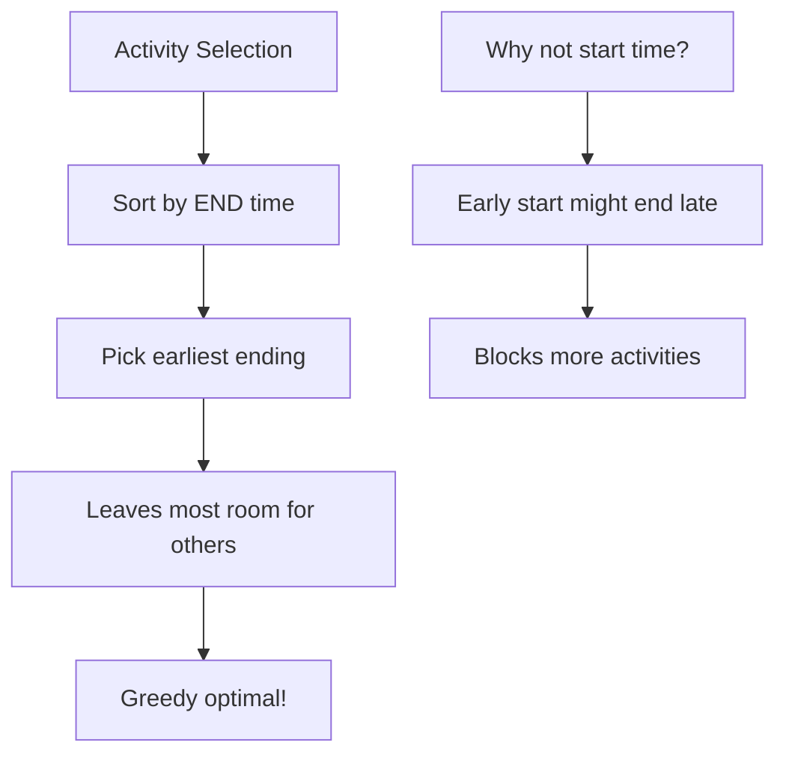

import { LanguageSelector, TimeEstimate, ConfidenceBuilder, DifficultyBadge } from '@site/src/components/interview-guide';
import { CodeTabs } from '@site/src/components/design-patterns/CodeTabs';
import TabItem from '@theme/TabItem';

# Activity Selection: Greedy Scheduling

Select maximum non-overlapping activities—the classic greedy problem.

**Key insight:** Sort by END time, always pick earliest-ending activity.

<LanguageSelector />

<TimeEstimate
  learnTime="25-30 minutes"
  practiceTime="3-4 hours"
  masteryTime="6-8 problems"
  interviewFrequency="10%"
  difficultyRange="Easy to Hard"
  prerequisites="Sorting, Heaps"
/>

---

## Why Sort by End Time?



**Exchange argument:** If you pick an activity A over B where A ends later, you can always swap A for B and do at least as well (B ends earlier, leaving more room).

---

## Maximum Activities (Classic Problem)

<CodeTabs>
<TabItem value="python" label="Python">

```python
def max_activities(activities: list[tuple[int, int]]) -> int:
    """
    Find maximum number of non-overlapping activities.
    Time: O(n log n) for sorting, Space: O(1)
    
    Key: Sort by END time, greedily pick earliest-ending.
    """
    if not activities:
        return 0
    
    # Sort by end time
    activities.sort(key=lambda x: x[1])
    
    count = 1
    last_end = activities[0][1]
    
    for start, end in activities[1:]:
        # Can we attend this activity?
        if start >= last_end:
            count += 1
            last_end = end
    
    return count


# Example:
# Activities: [(1,4), (3,5), (0,6), (5,7), (3,8), (5,9), (6,10), (8,11), (8,12), (2,13), (12,14)]
# Sorted by end: [(1,4), (3,5), (0,6), (5,7), (3,8), (5,9), (6,10), (8,11), (8,12), (2,13), (12,14)]
# Pick: (1,4) → (5,7) → (8,11) → (12,14) = 4 activities
```

</TabItem>
<TabItem value="typescript" label="TypeScript">

```typescript
function maxActivities(activities: [number, number][]): number {
  if (activities.length === 0) return 0;

  // Sort by end time
  activities.sort((a, b) => a[1] - b[1]);

  let count = 1;
  let lastEnd = activities[0][1];

  for (let i = 1; i < activities.length; i++) {
    const [start, end] = activities[i];
    if (start >= lastEnd) {
      count++;
      lastEnd = end;
    }
  }

  return count;
}
```

</TabItem>
<TabItem value="go" label="Go">

```go
import "sort"

func maxActivities(activities [][2]int) int {
    if len(activities) == 0 {
        return 0
    }
    
    sort.Slice(activities, func(i, j int) bool {
        return activities[i][1] < activities[j][1]
    })
    
    count := 1
    lastEnd := activities[0][1]
    
    for i := 1; i < len(activities); i++ {
        if activities[i][0] >= lastEnd {
            count++
            lastEnd = activities[i][1]
        }
    }
    
    return count
}
```

</TabItem>
<TabItem value="java" label="Java">

```java
public int maxActivities(int[][] activities) {
    if (activities.length == 0) return 0;
    
    // Sort by end time
    Arrays.sort(activities, (a, b) -> a[1] - b[1]);
    
    int count = 1;
    int lastEnd = activities[0][1];
    
    for (int i = 1; i < activities.length; i++) {
        if (activities[i][0] >= lastEnd) {
            count++;
            lastEnd = activities[i][1];
        }
    }
    
    return count;
}
```

</TabItem>
<TabItem value="cpp" label="C++">

```cpp
int maxActivities(vector<pair<int, int>>& activities) {
    if (activities.empty()) return 0;
    
    sort(activities.begin(), activities.end(),
         [](auto& a, auto& b) { return a.second < b.second; });
    
    int count = 1;
    int lastEnd = activities[0].second;
    
    for (int i = 1; i < activities.size(); i++) {
        if (activities[i].first >= lastEnd) {
            count++;
            lastEnd = activities[i].second;
        }
    }
    
    return count;
}
```

</TabItem>
<TabItem value="csharp" label="C#">

```csharp
public int MaxActivities(int[][] activities) {
    if (activities.Length == 0) return 0;
    
    Array.Sort(activities, (a, b) => a[1] - b[1]);
    
    int count = 1;
    int lastEnd = activities[0][1];
    
    for (int i = 1; i < activities.Length; i++) {
        if (activities[i][0] >= lastEnd) {
            count++;
            lastEnd = activities[i][1];
        }
    }
    
    return count;
}
```

</TabItem>
</CodeTabs>

---

## Maximum Events (Each Takes One Day)

When you can choose which day to attend each event.

<CodeTabs>
<TabItem value="python" label="Python">

```python
import heapq

def max_events(events: list[list[int]]) -> int:
    """
    Attend maximum events where each event spans [start, end] days
    and you can attend on any ONE day within that range.
    
    Strategy: For each day, attend the event with earliest deadline.
    """
    events.sort()  # Sort by start day
    
    count = 0
    day = 0
    i = 0
    n = len(events)
    heap: list[int] = []  # Min-heap of end days
    
    while i < n or heap:
        # If no events available, jump to next event's start
        if not heap:
            day = events[i][0]
        
        # Add all events starting on or before current day
        while i < n and events[i][0] <= day:
            heapq.heappush(heap, events[i][1])
            i += 1
        
        # Attend event with earliest deadline
        heapq.heappop(heap)
        count += 1
        day += 1
        
        # Remove events whose deadline has passed
        while heap and heap[0] < day:
            heapq.heappop(heap)
    
    return count


# Example:
# events = [[1,2], [2,3], [3,4]]
# Day 1: attend [1,2]
# Day 2: attend [2,3]
# Day 3: attend [3,4]
# Total: 3
```

</TabItem>
<TabItem value="java" label="Java">

```java
public int maxEvents(int[][] events) {
    Arrays.sort(events, (a, b) -> a[0] - b[0]);
    
    PriorityQueue<Integer> heap = new PriorityQueue<>();
    int count = 0;
    int day = 0;
    int i = 0;
    
    while (i < events.length || !heap.isEmpty()) {
        if (heap.isEmpty()) {
            day = events[i][0];
        }
        
        while (i < events.length && events[i][0] <= day) {
            heap.offer(events[i][1]);
            i++;
        }
        
        heap.poll();
        count++;
        day++;
        
        while (!heap.isEmpty() && heap.peek() < day) {
            heap.poll();
        }
    }
    
    return count;
}
```

</TabItem>
<TabItem value="cpp" label="C++">

```cpp
int maxEvents(vector<vector<int>>& events) {
    sort(events.begin(), events.end());
    
    priority_queue<int, vector<int>, greater<int>> heap;
    int count = 0;
    int day = 0;
    int i = 0;
    int n = events.size();
    
    while (i < n || !heap.empty()) {
        if (heap.empty()) {
            day = events[i][0];
        }
        
        while (i < n && events[i][0] <= day) {
            heap.push(events[i][1]);
            i++;
        }
        
        heap.pop();
        count++;
        day++;
        
        while (!heap.empty() && heap.top() < day) {
            heap.pop();
        }
    }
    
    return count;
}
```

</TabItem>
</CodeTabs>

---

## Task Scheduler (with Cooldown)

Schedule tasks with cooldown between same tasks.

<CodeTabs>
<TabItem value="python" label="Python">

```python
from collections import Counter

def least_interval(tasks: list[str], n: int) -> int:
    """
    Schedule tasks with cooldown n between same tasks.
    Return minimum time to complete all tasks.
    
    Math approach: Most frequent task dictates minimum time.
    """
    count = Counter(tasks)
    max_count = max(count.values())
    
    # How many tasks have the maximum count?
    num_max = sum(1 for c in count.values() if c == max_count)
    
    # Minimum needed based on most frequent task:
    # (max_count - 1) intervals of (n + 1) slots each
    # Plus the final row with num_max tasks
    min_length = (max_count - 1) * (n + 1) + num_max
    
    # Can't be less than total number of tasks
    return max(len(tasks), min_length)


# Example: tasks = ["A","A","A","B","B","B"], n = 2
# max_count = 3 (A appears 3 times)
# num_max = 2 (both A and B appear 3 times)
# min_length = (3-1) * (2+1) + 2 = 2 * 3 + 2 = 8
# Schedule: A B _ A B _ A B (8 slots)
```

</TabItem>
<TabItem value="typescript" label="TypeScript">

```typescript
function leastInterval(tasks: string[], n: number): number {
  const count = new Map<string, number>();
  for (const task of tasks) {
    count.set(task, (count.get(task) || 0) + 1);
  }

  const maxCount = Math.max(...count.values());
  const numMax = [...count.values()].filter((c) => c === maxCount).length;

  const minLength = (maxCount - 1) * (n + 1) + numMax;
  return Math.max(tasks.length, minLength);
}
```

</TabItem>
<TabItem value="go" label="Go">

```go
func leastInterval(tasks []byte, n int) int {
    count := make(map[byte]int)
    for _, task := range tasks {
        count[task]++
    }
    
    maxCount := 0
    for _, c := range count {
        if c > maxCount {
            maxCount = c
        }
    }
    
    numMax := 0
    for _, c := range count {
        if c == maxCount {
            numMax++
        }
    }
    
    minLength := (maxCount-1)*(n+1) + numMax
    if len(tasks) > minLength {
        return len(tasks)
    }
    return minLength
}
```

</TabItem>
<TabItem value="java" label="Java">

```java
public int leastInterval(char[] tasks, int n) {
    int[] count = new int[26];
    for (char task : tasks) {
        count[task - 'A']++;
    }
    
    int maxCount = 0;
    for (int c : count) {
        maxCount = Math.max(maxCount, c);
    }
    
    int numMax = 0;
    for (int c : count) {
        if (c == maxCount) numMax++;
    }
    
    int minLength = (maxCount - 1) * (n + 1) + numMax;
    return Math.max(tasks.length, minLength);
}
```

</TabItem>
<TabItem value="cpp" label="C++">

```cpp
int leastInterval(vector<char>& tasks, int n) {
    vector<int> count(26, 0);
    for (char task : tasks) {
        count[task - 'A']++;
    }
    
    int maxCount = *max_element(count.begin(), count.end());
    int numMax = std::count(count.begin(), count.end(), maxCount);
    
    int minLength = (maxCount - 1) * (n + 1) + numMax;
    return max((int)tasks.size(), minLength);
}
```

</TabItem>
<TabItem value="csharp" label="C#">

```csharp
public int LeastInterval(char[] tasks, int n) {
    int[] count = new int[26];
    foreach (char task in tasks) {
        count[task - 'A']++;
    }
    
    int maxCount = count.Max();
    int numMax = count.Count(c => c == maxCount);
    
    int minLength = (maxCount - 1) * (n + 1) + numMax;
    return Math.Max(tasks.Length, minLength);
}
```

</TabItem>
</CodeTabs>

---

## Job Sequencing with Deadlines

Maximize profit by completing jobs before their deadlines.

<CodeTabs>
<TabItem value="python" label="Python">

```python
def job_sequencing(jobs: list[tuple[int, int, int]]) -> int:
    """
    Maximize profit by scheduling jobs before deadlines.
    Each job takes 1 unit of time.
    jobs = [(job_id, deadline, profit), ...]
    
    Greedy: Sort by profit descending, schedule in latest available slot.
    """
    # Sort by profit (descending)
    jobs.sort(key=lambda x: -x[2])
    
    max_deadline = max(j[1] for j in jobs)
    slots: list[int] = [-1] * max_deadline  # -1 means slot is free
    
    total_profit = 0
    
    for job_id, deadline, profit in jobs:
        # Find latest available slot before deadline
        for slot in range(deadline - 1, -1, -1):
            if slots[slot] == -1:
                slots[slot] = job_id
                total_profit += profit
                break
    
    return total_profit


# Example:
# jobs = [(1, 2, 100), (2, 1, 19), (3, 2, 27), (4, 1, 25), (5, 3, 15)]
# Sort by profit: (1, 2, 100), (3, 2, 27), (4, 1, 25), (2, 1, 19), (5, 3, 15)
# Schedule:
#   Job 1 (deadline 2, profit 100) → slot 1
#   Job 3 (deadline 2, profit 27) → slot 0
#   Job 4 (deadline 1, profit 25) → no slot (slot 0 taken)
#   Job 5 (deadline 3, profit 15) → slot 2
# Total: 100 + 27 + 15 = 142
```

</TabItem>
<TabItem value="java" label="Java">

```java
public int jobSequencing(int[][] jobs) {
    // jobs[i] = [id, deadline, profit]
    Arrays.sort(jobs, (a, b) -> b[2] - a[2]); // Sort by profit descending
    
    int maxDeadline = 0;
    for (int[] job : jobs) {
        maxDeadline = Math.max(maxDeadline, job[1]);
    }
    
    int[] slots = new int[maxDeadline];
    Arrays.fill(slots, -1);
    
    int totalProfit = 0;
    
    for (int[] job : jobs) {
        int deadline = job[1];
        int profit = job[2];
        
        for (int slot = deadline - 1; slot >= 0; slot--) {
            if (slots[slot] == -1) {
                slots[slot] = job[0];
                totalProfit += profit;
                break;
            }
        }
    }
    
    return totalProfit;
}
```

</TabItem>
</CodeTabs>

---

## 🎯 Pattern Triggers

| Problem Clue | Sort By | Strategy |
|--------------|---------|----------|
| "Maximum non-overlapping" | End time | Pick earliest ending |
| "Attend events" | Start time + heap | Earliest deadline first |
| "Task cooldown" | Frequency | Math formula |
| "Job profit + deadline" | Profit (desc) | Latest available slot |

---

## 💬 How to Communicate

**Explaining activity selection:**
> "I'll use a greedy approach and sort by end time. The intuition is that picking the earliest-ending activity leaves the most room for subsequent activities. I can prove this with an exchange argument: if there's an optimal solution that picks a later-ending activity, I can swap it for an earlier one without losing anything..."

**Explaining task scheduler:**
> "The minimum time is dictated by the most frequent task. If task A appears k times and needs cooldown n, I need at least (k-1) × (n+1) slots for the gaps, plus slots for all tasks that appear k times. The answer is the max of this and the total task count..."

---

## 🏋️ Practice Problems

| Problem | Difficulty | Pattern |
|---------|------------|---------|
| [Maximum Events](https://leetcode.com/problems/maximum-number-of-events-that-can-be-attended/) | <DifficultyBadge level="medium" /> | Heap + greedy |
| [Task Scheduler](https://leetcode.com/problems/task-scheduler/) | <DifficultyBadge level="medium" /> | Math/simulation |
| [Non-overlapping Intervals](https://leetcode.com/problems/non-overlapping-intervals/) | <DifficultyBadge level="medium" /> | Classic activity |
| [Meeting Rooms II](https://leetcode.com/problems/meeting-rooms-ii/) | <DifficultyBadge level="medium" /> | Heap scheduling |
| [Car Pooling](https://leetcode.com/problems/car-pooling/) | <DifficultyBadge level="medium" /> | Timeline sweep |

---

## Key Takeaways

1. **Sort by END time** for activity selection (maximize count).

2. **Greedy works** when local optimal leads to global optimal.

3. **Use heap** for dynamic selection with deadlines.

4. **Math shortcuts** exist for many scheduling problems.

5. **Prove greedy correctness** with exchange argument in interviews.

<ConfidenceBuilder type="youve-got-this">

**Greedy = local optimal → global optimal.**

The challenge is recognizing WHEN greedy works and proving WHY. For scheduling problems, sorting by end time is usually the key insight.

</ConfidenceBuilder>

---

## What's Next?

More greedy patterns:

**See also:** [Interval Problems](/docs/interview-guide/coding/patterns/intervals/merge-overlapping) — Merge & Overlap
