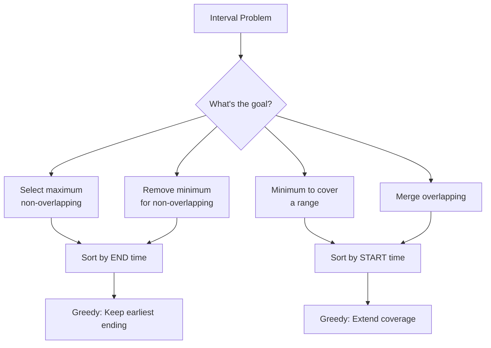

import { LanguageSelector, TimeEstimate, ConfidenceBuilder, DifficultyBadge } from '@site/src/components/interview-guide';
import { CodeTabs } from '@site/src/components/design-patterns/CodeTabs';
import TabItem from '@theme/TabItem';

# Greedy Interval Problems

Greedy algorithms make locally optimal choices hoping for a globally optimal result. For intervals, greedy works when the problem has **optimal substructure** and the **greedy choice property**.

The first time I saw "remove minimum intervals to make non-overlapping," I tried DP. Too slow. The insight: **sort by end time, then greedily keep intervals that end earliest.** This leaves maximum room for future intervals.

**Two key patterns:**
- **Selection problems:** Sort by END time
- **Coverage/Merge problems:** Sort by START time

<LanguageSelector />

<TimeEstimate
  learnTime="25-35 minutes"
  practiceTime="3-4 hours"
  masteryTime="10-12 problems"
  interviewFrequency="30%"
  difficultyRange="Medium"
  prerequisites="Sorting, Arrays"
/>

---

## Greedy Interval Decision Guide



---

## Non-Overlapping Intervals

Remove minimum intervals to make all non-overlapping.

**Key insight:** Keep intervals that end earliest—they leave most room for future intervals.

<CodeTabs>
<TabItem value="python" label="Python">

```python
def erase_overlap_intervals(intervals: list[list[int]]) -> int:
    """
    Remove minimum intervals to make non-overlapping.
    
    Strategy: Sort by END time, keep intervals that end earliest.
    Time: O(n log n), Space: O(1)
    """
    if not intervals:
        return 0
    
    # Sort by end time
    intervals.sort(key=lambda x: x[1])
    
    count = 0
    prev_end = intervals[0][1]
    
    for i in range(1, len(intervals)):
        start, end = intervals[i]
        
        if start < prev_end:
            # Overlap - must remove one interval
            count += 1
            # Keep the one that ends earlier (already prev_end)
        else:
            # No overlap - update prev_end
            prev_end = end
    
    return count

# [[1,2],[2,3],[3,4],[1,3]] → 1 (remove [1,3])
```

</TabItem>
<TabItem value="typescript" label="TypeScript">

```typescript
function eraseOverlapIntervals(intervals: number[][]): number {
  if (intervals.length === 0) return 0;

  // Sort by end time
  intervals.sort((a, b) => a[1] - b[1]);

  let count = 0;
  let prevEnd = intervals[0][1];

  for (let i = 1; i < intervals.length; i++) {
    const [start, end] = intervals[i];

    if (start < prevEnd) {
      count++; // Remove this interval
    } else {
      prevEnd = end;
    }
  }

  return count;
}
```

</TabItem>
<TabItem value="go" label="Go">

```go
func eraseOverlapIntervals(intervals [][]int) int {
    if len(intervals) == 0 {
        return 0
    }
    
    // Sort by end time
    sort.Slice(intervals, func(i, j int) bool {
        return intervals[i][1] < intervals[j][1]
    })
    
    count := 0
    prevEnd := intervals[0][1]
    
    for i := 1; i < len(intervals); i++ {
        start, end := intervals[i][0], intervals[i][1]
        
        if start < prevEnd {
            count++
        } else {
            prevEnd = end
        }
    }
    
    return count
}
```

</TabItem>
<TabItem value="java" label="Java">

```java
public int eraseOverlapIntervals(int[][] intervals) {
    if (intervals.length == 0) return 0;
    
    // Sort by end time
    Arrays.sort(intervals, (a, b) -> Integer.compare(a[1], b[1]));
    
    int count = 0;
    int prevEnd = intervals[0][1];
    
    for (int i = 1; i < intervals.length; i++) {
        int start = intervals[i][0];
        int end = intervals[i][1];
        
        if (start < prevEnd) {
            count++;
        } else {
            prevEnd = end;
        }
    }
    
    return count;
}
```

</TabItem>
<TabItem value="cpp" label="C++">

```cpp
int eraseOverlapIntervals(vector<vector<int>>& intervals) {
    if (intervals.empty()) return 0;
    
    // Sort by end time
    sort(intervals.begin(), intervals.end(), 
         [](auto& a, auto& b) { return a[1] < b[1]; });
    
    int count = 0;
    int prevEnd = intervals[0][1];
    
    for (int i = 1; i < intervals.size(); i++) {
        int start = intervals[i][0];
        int end = intervals[i][1];
        
        if (start < prevEnd) {
            count++;
        } else {
            prevEnd = end;
        }
    }
    
    return count;
}
```

</TabItem>
<TabItem value="c" label="C">

```c
int compare(const void* a, const void* b) {
    int* intervalA = *(int**)a;
    int* intervalB = *(int**)b;
    return intervalA[1] - intervalB[1];
}

int eraseOverlapIntervals(int** intervals, int intervalsSize, int* intervalsColSize) {
    if (intervalsSize == 0) return 0;
    
    qsort(intervals, intervalsSize, sizeof(int*), compare);
    
    int count = 0;
    int prevEnd = intervals[0][1];
    
    for (int i = 1; i < intervalsSize; i++) {
        int start = intervals[i][0];
        int end = intervals[i][1];
        
        if (start < prevEnd) {
            count++;
        } else {
            prevEnd = end;
        }
    }
    
    return count;
}
```

</TabItem>
<TabItem value="csharp" label="C#">

```csharp
public int EraseOverlapIntervals(int[][] intervals) {
    if (intervals.Length == 0) return 0;
    
    // Sort by end time
    Array.Sort(intervals, (a, b) => a[1].CompareTo(b[1]));
    
    int count = 0;
    int prevEnd = intervals[0][1];
    
    for (int i = 1; i < intervals.Length; i++) {
        int start = intervals[i][0];
        int end = intervals[i][1];
        
        if (start < prevEnd) {
            count++;
        } else {
            prevEnd = end;
        }
    }
    
    return count;
}
```

</TabItem>
</CodeTabs>

<ConfidenceBuilder type="remember" title="Why Sort by End Time?">

When you pick an interval that ends early, you leave **maximum room** for future intervals. This greedy choice is provably optimal for activity selection problems.

If you sorted by start time instead, you might pick a long interval that blocks many others.

</ConfidenceBuilder>

---

## Minimum Arrows to Burst Balloons

Find minimum arrows to burst all balloons (intervals on x-axis).

<CodeTabs>
<TabItem value="python" label="Python">

```python
def find_min_arrow_shots(points: list[list[int]]) -> int:
    """
    Minimum arrows to burst all balloons.
    Each arrow can burst all balloons at a single x-coordinate.
    
    Strategy: Sort by end, shoot at each interval's end.
    If next balloon starts after current arrow, need new arrow.
    """
    if not points:
        return 0
    
    # Sort by end position
    points.sort(key=lambda x: x[1])
    
    arrows = 1
    arrow_pos = points[0][1]  # Shoot at first balloon's end
    
    for start, end in points[1:]:
        if start > arrow_pos:
            # Current arrow can't reach this balloon
            arrows += 1
            arrow_pos = end  # New arrow at this balloon's end
        # else: current arrow already bursts this balloon
    
    return arrows

# [[10,16],[2,8],[1,6],[7,12]] → 2
```

</TabItem>
<TabItem value="typescript" label="TypeScript">

```typescript
function findMinArrowShots(points: number[][]): number {
  if (points.length === 0) return 0;

  points.sort((a, b) => a[1] - b[1]);

  let arrows = 1;
  let arrowPos = points[0][1];

  for (let i = 1; i < points.length; i++) {
    const [start, end] = points[i];

    if (start > arrowPos) {
      arrows++;
      arrowPos = end;
    }
  }

  return arrows;
}
```

</TabItem>
<TabItem value="go" label="Go">

```go
func findMinArrowShots(points [][]int) int {
    if len(points) == 0 {
        return 0
    }
    
    sort.Slice(points, func(i, j int) bool {
        return points[i][1] < points[j][1]
    })
    
    arrows := 1
    arrowPos := points[0][1]
    
    for i := 1; i < len(points); i++ {
        start := points[i][0]
        end := points[i][1]
        
        if start > arrowPos {
            arrows++
            arrowPos = end
        }
    }
    
    return arrows
}
```

</TabItem>
<TabItem value="java" label="Java">

```java
public int findMinArrowShots(int[][] points) {
    if (points.length == 0) return 0;
    
    // Sort by end - use Long to avoid overflow
    Arrays.sort(points, (a, b) -> Long.compare(a[1], b[1]));
    
    int arrows = 1;
    int arrowPos = points[0][1];
    
    for (int i = 1; i < points.length; i++) {
        int start = points[i][0];
        int end = points[i][1];
        
        if (start > arrowPos) {
            arrows++;
            arrowPos = end;
        }
    }
    
    return arrows;
}
```

</TabItem>
<TabItem value="cpp" label="C++">

```cpp
int findMinArrowShots(vector<vector<int>>& points) {
    if (points.empty()) return 0;
    
    sort(points.begin(), points.end(), 
         [](auto& a, auto& b) { return a[1] < b[1]; });
    
    int arrows = 1;
    long arrowPos = points[0][1];
    
    for (int i = 1; i < points.size(); i++) {
        if (points[i][0] > arrowPos) {
            arrows++;
            arrowPos = points[i][1];
        }
    }
    
    return arrows;
}
```

</TabItem>
<TabItem value="c" label="C">

```c
int compareEnd(const void* a, const void* b) {
    int* pa = *(int**)a;
    int* pb = *(int**)b;
    if (pa[1] < pb[1]) return -1;
    if (pa[1] > pb[1]) return 1;
    return 0;
}

int findMinArrowShots(int** points, int pointsSize, int* pointsColSize) {
    if (pointsSize == 0) return 0;
    
    qsort(points, pointsSize, sizeof(int*), compareEnd);
    
    int arrows = 1;
    long arrowPos = points[0][1];
    
    for (int i = 1; i < pointsSize; i++) {
        if (points[i][0] > arrowPos) {
            arrows++;
            arrowPos = points[i][1];
        }
    }
    
    return arrows;
}
```

</TabItem>
<TabItem value="csharp" label="C#">

```csharp
public int FindMinArrowShots(int[][] points) {
    if (points.Length == 0) return 0;
    
    Array.Sort(points, (a, b) => a[1].CompareTo(b[1]));
    
    int arrows = 1;
    int arrowPos = points[0][1];
    
    for (int i = 1; i < points.Length; i++) {
        int start = points[i][0];
        int end = points[i][1];
        
        if (start > arrowPos) {
            arrows++;
            arrowPos = end;
        }
    }
    
    return arrows;
}
```

</TabItem>
</CodeTabs>

---

## Merge Intervals

Merge all overlapping intervals.

<CodeTabs>
<TabItem value="python" label="Python">

```python
def merge(intervals: list[list[int]]) -> list[list[int]]:
    """
    Merge overlapping intervals.
    
    Strategy: Sort by start, extend or add new interval.
    Time: O(n log n), Space: O(n)
    """
    if not intervals:
        return []
    
    # Sort by start time
    intervals.sort(key=lambda x: x[0])
    
    merged: list[list[int]] = [intervals[0]]
    
    for start, end in intervals[1:]:
        if start <= merged[-1][1]:
            # Overlaps - extend current interval
            merged[-1][1] = max(merged[-1][1], end)
        else:
            # No overlap - add new interval
            merged.append([start, end])
    
    return merged

# [[1,3],[2,6],[8,10],[15,18]] → [[1,6],[8,10],[15,18]]
```

</TabItem>
<TabItem value="typescript" label="TypeScript">

```typescript
function merge(intervals: number[][]): number[][] {
  if (intervals.length === 0) return [];

  intervals.sort((a, b) => a[0] - b[0]);

  const merged: number[][] = [intervals[0]];

  for (let i = 1; i < intervals.length; i++) {
    const [start, end] = intervals[i];
    const last = merged[merged.length - 1];

    if (start <= last[1]) {
      last[1] = Math.max(last[1], end);
    } else {
      merged.push([start, end]);
    }
  }

  return merged;
}
```

</TabItem>
<TabItem value="go" label="Go">

```go
func merge(intervals [][]int) [][]int {
    if len(intervals) == 0 {
        return [][]int{}
    }
    
    sort.Slice(intervals, func(i, j int) bool {
        return intervals[i][0] < intervals[j][0]
    })
    
    merged := [][]int{intervals[0]}
    
    for i := 1; i < len(intervals); i++ {
        start, end := intervals[i][0], intervals[i][1]
        last := merged[len(merged)-1]
        
        if start <= last[1] {
            if end > last[1] {
                last[1] = end
            }
        } else {
            merged = append(merged, []int{start, end})
        }
    }
    
    return merged
}
```

</TabItem>
<TabItem value="java" label="Java">

```java
public int[][] merge(int[][] intervals) {
    if (intervals.length == 0) return new int[0][];
    
    Arrays.sort(intervals, (a, b) -> Integer.compare(a[0], b[0]));
    
    List<int[]> merged = new ArrayList<>();
    merged.add(intervals[0]);
    
    for (int i = 1; i < intervals.length; i++) {
        int[] last = merged.get(merged.size() - 1);
        int start = intervals[i][0];
        int end = intervals[i][1];
        
        if (start <= last[1]) {
            last[1] = Math.max(last[1], end);
        } else {
            merged.add(new int[] {start, end});
        }
    }
    
    return merged.toArray(new int[merged.size()][]);
}
```

</TabItem>
<TabItem value="cpp" label="C++">

```cpp
vector<vector<int>> merge(vector<vector<int>>& intervals) {
    if (intervals.empty()) return {};
    
    sort(intervals.begin(), intervals.end());
    
    vector<vector<int>> merged = {intervals[0]};
    
    for (int i = 1; i < intervals.size(); i++) {
        int start = intervals[i][0];
        int end = intervals[i][1];
        
        if (start <= merged.back()[1]) {
            merged.back()[1] = max(merged.back()[1], end);
        } else {
            merged.push_back({start, end});
        }
    }
    
    return merged;
}
```

</TabItem>
<TabItem value="c" label="C">

```c
int compareStart(const void* a, const void* b) {
    int* pa = *(int**)a;
    int* pb = *(int**)b;
    return pa[0] - pb[0];
}

int** merge(int** intervals, int intervalsSize, int* intervalsColSize,
            int* returnSize, int** returnColumnSizes) {
    if (intervalsSize == 0) {
        *returnSize = 0;
        return NULL;
    }
    
    qsort(intervals, intervalsSize, sizeof(int*), compareStart);
    
    int** merged = (int**)malloc(intervalsSize * sizeof(int*));
    *returnColumnSizes = (int*)malloc(intervalsSize * sizeof(int));
    
    merged[0] = (int*)malloc(2 * sizeof(int));
    merged[0][0] = intervals[0][0];
    merged[0][1] = intervals[0][1];
    (*returnColumnSizes)[0] = 2;
    int count = 1;
    
    for (int i = 1; i < intervalsSize; i++) {
        if (intervals[i][0] <= merged[count-1][1]) {
            if (intervals[i][1] > merged[count-1][1]) {
                merged[count-1][1] = intervals[i][1];
            }
        } else {
            merged[count] = (int*)malloc(2 * sizeof(int));
            merged[count][0] = intervals[i][0];
            merged[count][1] = intervals[i][1];
            (*returnColumnSizes)[count] = 2;
            count++;
        }
    }
    
    *returnSize = count;
    return merged;
}
```

</TabItem>
<TabItem value="csharp" label="C#">

```csharp
public int[][] Merge(int[][] intervals) {
    if (intervals.Length == 0) return Array.Empty<int[]>();
    
    Array.Sort(intervals, (a, b) => a[0].CompareTo(b[0]));
    
    var merged = new List<int[]> { intervals[0] };
    
    for (int i = 1; i < intervals.Length; i++) {
        int start = intervals[i][0];
        int end = intervals[i][1];
        int[] last = merged[merged.Count - 1];
        
        if (start <= last[1]) {
            last[1] = Math.Max(last[1], end);
        } else {
            merged.Add(new int[] { start, end });
        }
    }
    
    return merged.ToArray();
}
```

</TabItem>
</CodeTabs>

---

## Jump Game II

Minimum jumps to reach end.

<CodeTabs>
<TabItem value="python" label="Python">

```python
def jump(nums: list[int]) -> int:
    """
    Minimum jumps to reach the last index.
    
    Greedy: Track current coverage, jump when we reach its end.
    Time: O(n), Space: O(1)
    """
    if len(nums) <= 1:
        return 0
    
    jumps = 0
    current_end = 0   # End of current jump's reach
    farthest = 0      # Farthest we can reach
    
    for i in range(len(nums) - 1):  # Don't need to jump from last index
        farthest = max(farthest, i + nums[i])
        
        if i == current_end:
            # Must jump now
            jumps += 1
            current_end = farthest
            
            if current_end >= len(nums) - 1:
                break
    
    return jumps

# [2,3,1,1,4] → 2 (jump 1 → 2 → end)
```

</TabItem>
<TabItem value="typescript" label="TypeScript">

```typescript
function jump(nums: number[]): number {
  if (nums.length <= 1) return 0;

  let jumps = 0;
  let currentEnd = 0;
  let farthest = 0;

  for (let i = 0; i < nums.length - 1; i++) {
    farthest = Math.max(farthest, i + nums[i]);

    if (i === currentEnd) {
      jumps++;
      currentEnd = farthest;

      if (currentEnd >= nums.length - 1) break;
    }
  }

  return jumps;
}
```

</TabItem>
<TabItem value="go" label="Go">

```go
func jump(nums []int) int {
    if len(nums) <= 1 {
        return 0
    }
    
    jumps := 0
    currentEnd := 0
    farthest := 0
    
    for i := 0; i < len(nums)-1; i++ {
        if i+nums[i] > farthest {
            farthest = i + nums[i]
        }
        
        if i == currentEnd {
            jumps++
            currentEnd = farthest
            
            if currentEnd >= len(nums)-1 {
                break
            }
        }
    }
    
    return jumps
}
```

</TabItem>
<TabItem value="java" label="Java">

```java
public int jump(int[] nums) {
    if (nums.length <= 1) return 0;
    
    int jumps = 0;
    int currentEnd = 0;
    int farthest = 0;
    
    for (int i = 0; i < nums.length - 1; i++) {
        farthest = Math.max(farthest, i + nums[i]);
        
        if (i == currentEnd) {
            jumps++;
            currentEnd = farthest;
            
            if (currentEnd >= nums.length - 1) break;
        }
    }
    
    return jumps;
}
```

</TabItem>
<TabItem value="cpp" label="C++">

```cpp
int jump(vector<int>& nums) {
    if (nums.size() <= 1) return 0;
    
    int jumps = 0;
    int currentEnd = 0;
    int farthest = 0;
    
    for (int i = 0; i < nums.size() - 1; i++) {
        farthest = max(farthest, i + nums[i]);
        
        if (i == currentEnd) {
            jumps++;
            currentEnd = farthest;
            
            if (currentEnd >= nums.size() - 1) break;
        }
    }
    
    return jumps;
}
```

</TabItem>
<TabItem value="c" label="C">

```c
int jump(int* nums, int numsSize) {
    if (numsSize <= 1) return 0;
    
    int jumps = 0;
    int currentEnd = 0;
    int farthest = 0;
    
    for (int i = 0; i < numsSize - 1; i++) {
        if (i + nums[i] > farthest) {
            farthest = i + nums[i];
        }
        
        if (i == currentEnd) {
            jumps++;
            currentEnd = farthest;
            
            if (currentEnd >= numsSize - 1) break;
        }
    }
    
    return jumps;
}
```

</TabItem>
<TabItem value="csharp" label="C#">

```csharp
public int Jump(int[] nums) {
    if (nums.Length <= 1) return 0;
    
    int jumps = 0;
    int currentEnd = 0;
    int farthest = 0;
    
    for (int i = 0; i < nums.Length - 1; i++) {
        farthest = Math.Max(farthest, i + nums[i]);
        
        if (i == currentEnd) {
            jumps++;
            currentEnd = farthest;
            
            if (currentEnd >= nums.Length - 1) break;
        }
    }
    
    return jumps;
}
```

</TabItem>
</CodeTabs>

---

## 🎯 Pattern Triggers

| If the problem asks for... | Sort By | Strategy |
|---------------------------|---------|----------|
| Maximum non-overlapping | **END time** | Keep earliest ending |
| Minimum to remove for non-overlap | **END time** | Count overlaps |
| Minimum arrows/groups | **END time** | Count non-overlapping groups |
| Merge overlapping | **START time** | Extend current interval |
| Minimum to cover range | **START time** | Greedy extension |

---

## 💬 How to Communicate This in Interviews

**Identifying greedy:**
> "This is an interval selection problem. I'll use greedy because picking locally optimal choices gives globally optimal results..."

**Explaining sort order:**
> "I sort by end time because keeping intervals that end earliest leaves maximum room for future intervals..."

**For coverage problems:**
> "I sort by start time because I need to extend coverage progressively from the beginning..."

---

## 🏋️ Practice Problems

### Warm-Up (Build Confidence)

| Problem | Difficulty | Time |
|---------|------------|------|
| [Merge Intervals](https://leetcode.com/problems/merge-intervals/) | <DifficultyBadge level="medium" /> | 20 min |
| [Non-overlapping Intervals](https://leetcode.com/problems/non-overlapping-intervals/) | <DifficultyBadge level="medium" /> | 20 min |

### Core Practice (Must Do)

| Problem | Difficulty | Companies | Pattern |
|---------|------------|-----------|---------|
| [Minimum Arrows](https://leetcode.com/problems/minimum-number-of-arrows-to-burst-balloons/) | <DifficultyBadge level="medium" /> | Meta, Amazon | Sort by end |
| [Insert Interval](https://leetcode.com/problems/insert-interval/) | <DifficultyBadge level="medium" /> | Google, Amazon | Merge logic |
| [Jump Game II](https://leetcode.com/problems/jump-game-ii/) | <DifficultyBadge level="medium" /> | Amazon, Google | Coverage extension |
| [Video Stitching](https://leetcode.com/problems/video-stitching/) | <DifficultyBadge level="medium" /> | Google | Coverage greedy |
| [Meeting Rooms II](https://leetcode.com/problems/meeting-rooms-ii/) | <DifficultyBadge level="medium" /> | Meta, Amazon, Google | Sweep line |

### Challenge (For Mastery)

| Problem | Difficulty | Companies | Why It's Hard |
|---------|------------|-----------|---------------|
| [Car Pooling](https://leetcode.com/problems/car-pooling/) | <DifficultyBadge level="medium" /> | Google, Amazon | Sweep line |
| [Interval List Intersections](https://leetcode.com/problems/interval-list-intersections/) | <DifficultyBadge level="medium" /> | Meta, Amazon | Two-pointer on intervals |

---

## Key Takeaways

1. **Sort by END** for selection problems (maximize non-overlapping).

2. **Sort by START** for coverage/merge problems.

3. **Greedy choice:** Pick locally optimal, prove globally optimal.

4. **Track current coverage** and extend greedily.

5. **Interval problems** often have O(n log n) complexity due to sorting.

<ConfidenceBuilder type="youve-got-this">

**Interval greedy has clear patterns.**

Once you recognize whether it's a selection problem (sort by end) or coverage problem (sort by start), the solution follows naturally. The greedy choice is predictable.

</ConfidenceBuilder>

---

## What's Next?

More algorithmic patterns for different problem types:

**Next up:** [Graph Patterns](/docs/interview-guide/coding/patterns/graph-patterns/traversal) — Traversal and Connectivity
