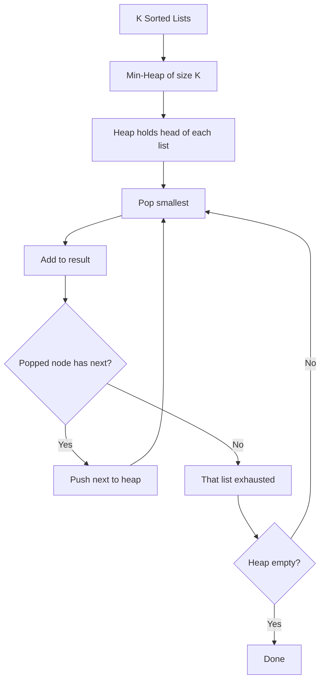

import { LanguageSelector, TimeEstimate, ConfidenceBuilder, DifficultyBadge } from '@site/src/components/interview-guide';
import { CodeTabs } from '@site/src/components/design-patterns/CodeTabs';
import TabItem from '@theme/TabItem';

# Merge K Sorted: K-Way Merge

Merging K sorted lists is a classic heap problem. The heap maintains the smallest element from each list, giving O(N log K) time.

<LanguageSelector />

<TimeEstimate
  learnTime="25-30 minutes"
  practiceTime="3-4 hours"
  masteryTime="6-8 problems"
  interviewFrequency="10%"
  difficultyRange="Medium to Hard"
  prerequisites="Heaps, Linked Lists"
/>

---

## The Pattern



**Why O(N log K)?**
- N total elements, each pushed/popped once
- Heap size is K (number of lists)
- Each operation is O(log K)

---

## Merge K Sorted Lists

<CodeTabs>
<TabItem value="python" label="Python">

```python
import heapq
from typing import Optional

class ListNode:
    def __init__(self, val: int = 0, next: 'ListNode' = None):
        self.val = val
        self.next = next

def merge_k_lists(lists: list[Optional[ListNode]]) -> Optional[ListNode]:
    """
    Merge K sorted linked lists into one sorted list.
    Time: O(N log K), Space: O(K) for heap
    
    Key insight: Heap size is K (number of lists), not N.
    """
    # Min-heap: (value, list_index, node)
    # list_index needed to break ties (nodes aren't comparable)
    heap: list[tuple[int, int, ListNode]] = []
    
    # Add head of each non-empty list
    for i, lst in enumerate(lists):
        if lst:
            heapq.heappush(heap, (lst.val, i, lst))
    
    dummy = ListNode()
    current = dummy
    
    while heap:
        val, i, node = heapq.heappop(heap)
        
        # Add to result
        current.next = node
        current = current.next
        
        # If this list has more nodes, add next one
        if node.next:
            heapq.heappush(heap, (node.next.val, i, node.next))
    
    return dummy.next


# Visual walkthrough:
# Lists: [1→4→5], [1→3→4], [2→6]
#
# Initial heap: [(1, 0, node), (1, 1, node), (2, 2, node)]
# Pop (1, 0, node), result: 1, push 4 → heap: [(1, 1), (2, 2), (4, 0)]
# Pop (1, 1, node), result: 1→1, push 3 → heap: [(2, 2), (3, 1), (4, 0)]
# Pop (2, 2, node), result: 1→1→2, push 6 → heap: [(3, 1), (4, 0), (6, 2)]
# ... continue until heap empty
# Final: 1→1→2→3→4→4→5→6
```

</TabItem>
<TabItem value="typescript" label="TypeScript">

```typescript
class ListNode {
  val: number;
  next: ListNode | null;
  constructor(val = 0, next: ListNode | null = null) {
    this.val = val;
    this.next = next;
  }
}

// Using a simple min-heap implementation
class MinHeap<T> {
  private heap: T[] = [];
  constructor(private compare: (a: T, b: T) => number) {}

  push(val: T): void {
    this.heap.push(val);
    this.bubbleUp(this.heap.length - 1);
  }

  pop(): T | undefined {
    if (this.heap.length === 0) return undefined;
    const result = this.heap[0];
    const last = this.heap.pop()!;
    if (this.heap.length > 0) {
      this.heap[0] = last;
      this.bubbleDown(0);
    }
    return result;
  }

  get size(): number {
    return this.heap.length;
  }

  private bubbleUp(i: number): void {
    while (i > 0) {
      const parent = Math.floor((i - 1) / 2);
      if (this.compare(this.heap[i], this.heap[parent]) >= 0) break;
      [this.heap[i], this.heap[parent]] = [this.heap[parent], this.heap[i]];
      i = parent;
    }
  }

  private bubbleDown(i: number): void {
    while (true) {
      const left = 2 * i + 1;
      const right = 2 * i + 2;
      let smallest = i;
      if (left < this.heap.length && this.compare(this.heap[left], this.heap[smallest]) < 0) {
        smallest = left;
      }
      if (right < this.heap.length && this.compare(this.heap[right], this.heap[smallest]) < 0) {
        smallest = right;
      }
      if (smallest === i) break;
      [this.heap[i], this.heap[smallest]] = [this.heap[smallest], this.heap[i]];
      i = smallest;
    }
  }
}

function mergeKLists(lists: (ListNode | null)[]): ListNode | null {
  const heap = new MinHeap<[number, number, ListNode]>((a, b) =>
    a[0] === b[0] ? a[1] - b[1] : a[0] - b[0]
  );

  for (let i = 0; i < lists.length; i++) {
    if (lists[i]) {
      heap.push([lists[i]!.val, i, lists[i]!]);
    }
  }

  const dummy = new ListNode();
  let current = dummy;

  while (heap.size > 0) {
    const [, i, node] = heap.pop()!;
    current.next = node;
    current = current.next;

    if (node.next) {
      heap.push([node.next.val, i, node.next]);
    }
  }

  return dummy.next;
}
```

</TabItem>
<TabItem value="go" label="Go">

```go
import "container/heap"

type ListNode struct {
    Val  int
    Next *ListNode
}

type Item struct {
    node  *ListNode
    index int
}

type MinHeap []Item

func (h MinHeap) Len() int           { return len(h) }
func (h MinHeap) Less(i, j int) bool { return h[i].node.Val < h[j].node.Val }
func (h MinHeap) Swap(i, j int)      { h[i], h[j] = h[j], h[i] }
func (h *MinHeap) Push(x any)        { *h = append(*h, x.(Item)) }
func (h *MinHeap) Pop() any {
    old := *h
    n := len(old)
    x := old[n-1]
    *h = old[0 : n-1]
    return x
}

func mergeKLists(lists []*ListNode) *ListNode {
    h := &MinHeap{}
    heap.Init(h)
    
    for i, list := range lists {
        if list != nil {
            heap.Push(h, Item{list, i})
        }
    }
    
    dummy := &ListNode{}
    current := dummy
    
    for h.Len() > 0 {
        item := heap.Pop(h).(Item)
        current.Next = item.node
        current = current.Next
        
        if item.node.Next != nil {
            heap.Push(h, Item{item.node.Next, item.index})
        }
    }
    
    return dummy.Next
}
```

</TabItem>
<TabItem value="java" label="Java">

```java
public ListNode mergeKLists(ListNode[] lists) {
    if (lists == null || lists.length == 0) return null;
    
    PriorityQueue<ListNode> heap = new PriorityQueue<>(
        (a, b) -> a.val - b.val
    );
    
    // Add head of each list
    for (ListNode list : lists) {
        if (list != null) {
            heap.offer(list);
        }
    }
    
    ListNode dummy = new ListNode();
    ListNode current = dummy;
    
    while (!heap.isEmpty()) {
        ListNode node = heap.poll();
        current.next = node;
        current = current.next;
        
        if (node.next != null) {
            heap.offer(node.next);
        }
    }
    
    return dummy.next;
}
```

</TabItem>
<TabItem value="cpp" label="C++">

```cpp
struct ListNode {
    int val;
    ListNode* next;
    ListNode(int x = 0) : val(x), next(nullptr) {}
};

ListNode* mergeKLists(vector<ListNode*>& lists) {
    auto compare = [](ListNode* a, ListNode* b) {
        return a->val > b->val;  // min-heap
    };
    
    priority_queue<ListNode*, vector<ListNode*>, decltype(compare)> heap(compare);
    
    for (auto list : lists) {
        if (list) heap.push(list);
    }
    
    ListNode dummy;
    ListNode* current = &dummy;
    
    while (!heap.empty()) {
        ListNode* node = heap.top();
        heap.pop();
        
        current->next = node;
        current = current->next;
        
        if (node->next) {
            heap.push(node->next);
        }
    }
    
    return dummy.next;
}
```

</TabItem>
<TabItem value="csharp" label="C#">

```csharp
public ListNode MergeKLists(ListNode[] lists) {
    if (lists == null || lists.Length == 0) return null;
    
    var heap = new PriorityQueue<ListNode, int>();
    
    foreach (var list in lists) {
        if (list != null) {
            heap.Enqueue(list, list.val);
        }
    }
    
    ListNode dummy = new ListNode();
    ListNode current = dummy;
    
    while (heap.Count > 0) {
        var node = heap.Dequeue();
        current.next = node;
        current = current.next;
        
        if (node.next != null) {
            heap.Enqueue(node.next, node.next.val);
        }
    }
    
    return dummy.next;
}
```

</TabItem>
</CodeTabs>

---

## Merge K Sorted Arrays

<CodeTabs>
<TabItem value="python" label="Python">

```python
import heapq

def merge_k_arrays(arrays: list[list[int]]) -> list[int]:
    """
    Merge K sorted arrays into one sorted array.
    Time: O(N log K), Space: O(K) for heap + O(N) for result
    """
    heap: list[tuple[int, int, int]] = []  # (value, array_idx, elem_idx)
    
    # Add first element of each array
    for i, arr in enumerate(arrays):
        if arr:
            heapq.heappush(heap, (arr[0], i, 0))
    
    result: list[int] = []
    
    while heap:
        val, arr_idx, elem_idx = heapq.heappop(heap)
        result.append(val)
        
        # If more elements in this array, add next one
        if elem_idx + 1 < len(arrays[arr_idx]):
            next_val = arrays[arr_idx][elem_idx + 1]
            heapq.heappush(heap, (next_val, arr_idx, elem_idx + 1))
    
    return result


# Example:
# arrays = [[1, 4, 5], [1, 3, 4], [2, 6]]
# Result: [1, 1, 2, 3, 4, 4, 5, 6]
```

</TabItem>
<TabItem value="java" label="Java">

```java
public int[] mergeKArrays(int[][] arrays) {
    PriorityQueue<int[]> heap = new PriorityQueue<>(
        (a, b) -> a[0] - b[0]  // Compare by value
    );
    
    int totalSize = 0;
    for (int i = 0; i < arrays.length; i++) {
        if (arrays[i].length > 0) {
            // [value, array_index, element_index]
            heap.offer(new int[]{arrays[i][0], i, 0});
            totalSize += arrays[i].length;
        }
    }
    
    int[] result = new int[totalSize];
    int idx = 0;
    
    while (!heap.isEmpty()) {
        int[] item = heap.poll();
        result[idx++] = item[0];
        
        int arrIdx = item[1];
        int elemIdx = item[2];
        
        if (elemIdx + 1 < arrays[arrIdx].length) {
            heap.offer(new int[]{arrays[arrIdx][elemIdx + 1], arrIdx, elemIdx + 1});
        }
    }
    
    return result;
}
```

</TabItem>
</CodeTabs>

---

## Smallest Range Covering K Lists

Find smallest range [a, b] that includes at least one element from each list.

<CodeTabs>
<TabItem value="python" label="Python">

```python
import heapq

def smallest_range(nums: list[list[int]]) -> list[int]:
    """
    Find smallest range covering all K lists.
    
    Key insight: Track both min (via heap) and max (via variable).
    Range = [current_min, current_max]
    
    Stop when any list is exhausted (can't cover all lists anymore).
    """
    heap: list[tuple[int, int, int]] = []  # (value, list_idx, elem_idx)
    current_max = float('-inf')
    
    # Initialize with first element of each list
    for i, lst in enumerate(nums):
        heapq.heappush(heap, (lst[0], i, 0))
        current_max = max(current_max, lst[0])
    
    result = [float('-inf'), float('inf')]
    
    while True:
        current_min, list_idx, elem_idx = heapq.heappop(heap)
        
        # Update result if this range is smaller
        if current_max - current_min < result[1] - result[0]:
            result = [current_min, current_max]
        
        # Try to advance this list
        if elem_idx + 1 == len(nums[list_idx]):
            break  # This list exhausted, can't continue
        
        next_val = nums[list_idx][elem_idx + 1]
        heapq.heappush(heap, (next_val, list_idx, elem_idx + 1))
        current_max = max(current_max, next_val)
    
    return result


# Example:
# nums = [[4,10,15,24,26], [0,9,12,20], [5,18,22,30]]
# Result: [20, 24] (covers 24, 20, 22)
```

</TabItem>
<TabItem value="java" label="Java">

```java
public int[] smallestRange(List<List<Integer>> nums) {
    PriorityQueue<int[]> heap = new PriorityQueue<>((a, b) -> a[0] - b[0]);
    int currentMax = Integer.MIN_VALUE;
    
    for (int i = 0; i < nums.size(); i++) {
        int val = nums.get(i).get(0);
        heap.offer(new int[]{val, i, 0});
        currentMax = Math.max(currentMax, val);
    }
    
    int[] result = {Integer.MIN_VALUE, Integer.MAX_VALUE};
    
    while (true) {
        int[] item = heap.poll();
        int currentMin = item[0];
        int listIdx = item[1];
        int elemIdx = item[2];
        
        if (currentMax - currentMin < result[1] - result[0]) {
            result = new int[]{currentMin, currentMax};
        }
        
        if (elemIdx + 1 == nums.get(listIdx).size()) {
            break;
        }
        
        int nextVal = nums.get(listIdx).get(elemIdx + 1);
        heap.offer(new int[]{nextVal, listIdx, elemIdx + 1});
        currentMax = Math.max(currentMax, nextVal);
    }
    
    return result;
}
```

</TabItem>
</CodeTabs>

---

## Kth Smallest in Sorted Matrix

<CodeTabs>
<TabItem value="python" label="Python">

```python
import heapq

def kth_smallest(matrix: list[list[int]], k: int) -> int:
    """
    Find kth smallest element in matrix where rows and columns are sorted.
    
    Approach: Start from top-left, expand to right and down.
    Use set to avoid duplicates.
    """
    n = len(matrix)
    heap: list[tuple[int, int, int]] = [(matrix[0][0], 0, 0)]
    visited: set[tuple[int, int]] = {(0, 0)}
    
    for _ in range(k):
        val, row, col = heapq.heappop(heap)
        
        # Add right neighbor
        if col + 1 < n and (row, col + 1) not in visited:
            heapq.heappush(heap, (matrix[row][col + 1], row, col + 1))
            visited.add((row, col + 1))
        
        # Add bottom neighbor
        if row + 1 < n and (row + 1, col) not in visited:
            heapq.heappush(heap, (matrix[row + 1][col], row + 1, col))
            visited.add((row + 1, col))
    
    return val  # The kth popped value
```

</TabItem>
<TabItem value="java" label="Java">

```java
public int kthSmallest(int[][] matrix, int k) {
    int n = matrix.length;
    PriorityQueue<int[]> heap = new PriorityQueue<>((a, b) -> a[0] - b[0]);
    Set<String> visited = new HashSet<>();
    
    heap.offer(new int[]{matrix[0][0], 0, 0});
    visited.add("0,0");
    
    int result = 0;
    for (int i = 0; i < k; i++) {
        int[] item = heap.poll();
        result = item[0];
        int row = item[1];
        int col = item[2];
        
        if (col + 1 < n && !visited.contains(row + "," + (col + 1))) {
            heap.offer(new int[]{matrix[row][col + 1], row, col + 1});
            visited.add(row + "," + (col + 1));
        }
        
        if (row + 1 < n && !visited.contains((row + 1) + "," + col)) {
            heap.offer(new int[]{matrix[row + 1][col], row + 1, col});
            visited.add((row + 1) + "," + col);
        }
    }
    
    return result;
}
```

</TabItem>
</CodeTabs>

---

## 🎯 Pattern Triggers

| Problem Clue | Approach |
|--------------|----------|
| "Merge K sorted..." | Min-heap of size K |
| "Kth smallest from multiple sorted..." | K-way merge until kth |
| "Smallest range covering..." | Track min (heap) and max |
| "Sorted matrix..." | Treat rows/columns as K sorted lists |

---

## 💬 How to Communicate

**Explaining merge K lists:**
> "I'll use a min-heap to always get the smallest available element. The heap holds the head of each list. When I pop an element, I push its next node if it exists. The heap size is at most K, so each operation is O(log K), giving O(N log K) total..."

---

## 🏋️ Practice Problems

| Problem | Difficulty | Pattern |
|---------|------------|---------|
| [Merge K Sorted Lists](https://leetcode.com/problems/merge-k-sorted-lists/) | <DifficultyBadge level="hard" /> | Core pattern |
| [Kth Smallest in Sorted Matrix](https://leetcode.com/problems/kth-smallest-element-in-a-sorted-matrix/) | <DifficultyBadge level="medium" /> | Matrix as K lists |
| [Smallest Range](https://leetcode.com/problems/smallest-range-covering-elements-from-k-lists/) | <DifficultyBadge level="hard" /> | Min + max tracking |
| [Find K Pairs Smallest Sums](https://leetcode.com/problems/find-k-pairs-with-smallest-sums/) | <DifficultyBadge level="medium" /> | K-way expansion |

---

## Key Takeaways

1. **Heap size is K** (number of lists), not total elements.

2. **Store (value, list_id, index)** to track position in each list.

3. **O(N log K)** beats O(N log N) naive sort when K << N.

4. **Works for any sorted sequences:** linked lists, arrays, iterators.

<ConfidenceBuilder type="youve-got-this">

**The heap is your merge coordinator.**

It always knows which list has the next smallest element. Pop, add to result, push successor. That's the entire algorithm.

</ConfidenceBuilder>

---

## What's Next?

More heap patterns:

**See also:** [Top K Elements](/docs/interview-guide/coding/patterns/heap-patterns/top-k) — Quick Select vs Heap
