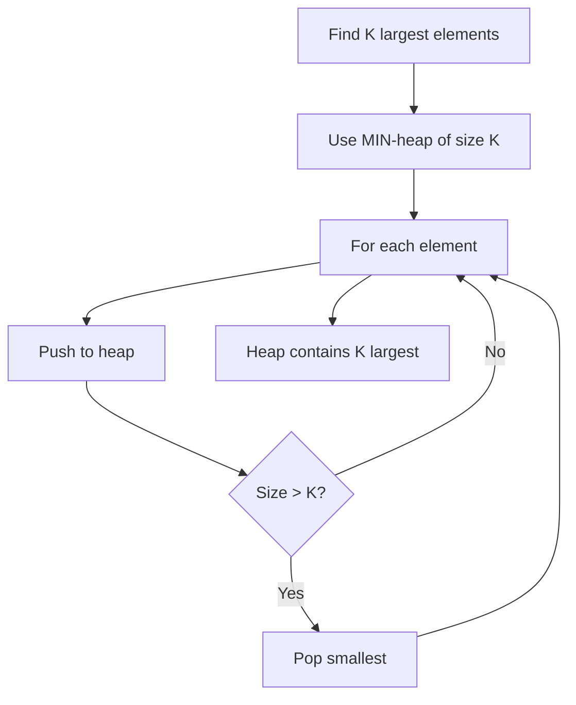

import { LanguageSelector, TimeEstimate, ConfidenceBuilder, DifficultyBadge } from '@site/src/components/interview-guide';
import { CodeTabs } from '@site/src/components/design-patterns/CodeTabs';
import TabItem from '@theme/TabItem';

# Top K Elements: Heap Mastery

"Find top K" problems are heap classics. The counterintuitive insight: **use a min-heap of size K to find K largest elements.**

<LanguageSelector />

<TimeEstimate
  learnTime="25-30 minutes"
  practiceTime="3-4 hours"
  masteryTime="8-10 problems"
  interviewFrequency="20%"
  difficultyRange="Medium"
  prerequisites="Heaps, Hash Tables"
/>

---

## The Core Pattern



**Why min-heap for K largest?**
- Always remove the smallest among candidates
- What remains are the K largest
- Time: O(n log k) vs O(n log n) for sorting

---

## Kth Largest Element

<CodeTabs>
<TabItem value="python" label="Python">

```python
import heapq

def find_kth_largest(nums: list[int], k: int) -> int:
    """
    Find kth largest element using min-heap of size k.
    Time: O(n log k), Space: O(k)
    
    The heap always contains the k largest elements seen so far.
    The smallest of those k (heap top) is the kth largest overall.
    """
    heap: list[int] = []
    
    for num in nums:
        heapq.heappush(heap, num)
        
        # If we have more than k elements, remove smallest
        if len(heap) > k:
            heapq.heappop(heap)
    
    # The smallest of the k largest = kth largest
    return heap[0]


# Alternative using heapq.nlargest (simpler but same complexity)
def find_kth_largest_simple(nums: list[int], k: int) -> int:
    return heapq.nlargest(k, nums)[-1]


# Example:
# nums = [3, 2, 1, 5, 6, 4], k = 2
# After processing: heap = [5, 6] (k largest)
# Return 5 (2nd largest)
```

</TabItem>
<TabItem value="typescript" label="TypeScript">

```typescript
class MinHeap {
  private heap: number[] = [];

  push(val: number): void {
    this.heap.push(val);
    this.bubbleUp(this.heap.length - 1);
  }

  pop(): number | undefined {
    if (this.heap.length === 0) return undefined;
    const result = this.heap[0];
    const last = this.heap.pop()!;
    if (this.heap.length > 0) {
      this.heap[0] = last;
      this.bubbleDown(0);
    }
    return result;
  }

  peek(): number | undefined {
    return this.heap[0];
  }

  get size(): number {
    return this.heap.length;
  }

  private bubbleUp(i: number): void {
    while (i > 0) {
      const parent = Math.floor((i - 1) / 2);
      if (this.heap[parent] <= this.heap[i]) break;
      [this.heap[parent], this.heap[i]] = [this.heap[i], this.heap[parent]];
      i = parent;
    }
  }

  private bubbleDown(i: number): void {
    while (true) {
      let smallest = i;
      const left = 2 * i + 1;
      const right = 2 * i + 2;
      if (left < this.heap.length && this.heap[left] < this.heap[smallest])
        smallest = left;
      if (right < this.heap.length && this.heap[right] < this.heap[smallest])
        smallest = right;
      if (smallest === i) break;
      [this.heap[smallest], this.heap[i]] = [this.heap[i], this.heap[smallest]];
      i = smallest;
    }
  }
}

function findKthLargest(nums: number[], k: number): number {
  const heap = new MinHeap();

  for (const num of nums) {
    heap.push(num);
    if (heap.size > k) {
      heap.pop();
    }
  }

  return heap.peek()!;
}
```

</TabItem>
<TabItem value="go" label="Go">

```go
import "container/heap"

type MinHeap []int

func (h MinHeap) Len() int           { return len(h) }
func (h MinHeap) Less(i, j int) bool { return h[i] < h[j] }
func (h MinHeap) Swap(i, j int)      { h[i], h[j] = h[j], h[i] }
func (h *MinHeap) Push(x any)        { *h = append(*h, x.(int)) }
func (h *MinHeap) Pop() any {
    old := *h
    n := len(old)
    x := old[n-1]
    *h = old[0 : n-1]
    return x
}

func findKthLargest(nums []int, k int) int {
    h := &MinHeap{}
    heap.Init(h)
    
    for _, num := range nums {
        heap.Push(h, num)
        if h.Len() > k {
            heap.Pop(h)
        }
    }
    
    return (*h)[0]
}
```

</TabItem>
<TabItem value="java" label="Java">

```java
public int findKthLargest(int[] nums, int k) {
    // Min-heap (default PriorityQueue behavior)
    PriorityQueue<Integer> heap = new PriorityQueue<>();
    
    for (int num : nums) {
        heap.offer(num);
        if (heap.size() > k) {
            heap.poll();
        }
    }
    
    return heap.peek();
}
```

</TabItem>
<TabItem value="cpp" label="C++">

```cpp
int findKthLargest(vector<int>& nums, int k) {
    // Min-heap using greater<int> comparator
    priority_queue<int, vector<int>, greater<int>> heap;
    
    for (int num : nums) {
        heap.push(num);
        if (heap.size() > k) {
            heap.pop();
        }
    }
    
    return heap.top();
}
```

</TabItem>
<TabItem value="csharp" label="C#">

```csharp
public int FindKthLargest(int[] nums, int k) {
    // PriorityQueue in C# is min-heap by default
    PriorityQueue<int, int> heap = new();
    
    foreach (int num in nums) {
        heap.Enqueue(num, num);
        if (heap.Count > k) {
            heap.Dequeue();
        }
    }
    
    return heap.Peek();
}
```

</TabItem>
</CodeTabs>

---

## Top K Frequent Elements

Combine frequency counting with heap selection.

<CodeTabs>
<TabItem value="python" label="Python">

```python
from collections import Counter
import heapq

def top_k_frequent(nums: list[int], k: int) -> list[int]:
    """
    Find k most frequent elements.
    Time: O(n log k), Space: O(n)
    
    1. Count frequencies
    2. Use min-heap of size k keyed by frequency
    3. Heap contains k most frequent at the end
    """
    count = Counter(nums)
    
    # Min-heap of (frequency, element)
    heap: list[tuple[int, int]] = []
    
    for num, freq in count.items():
        heapq.heappush(heap, (freq, num))
        if len(heap) > k:
            heapq.heappop(heap)
    
    return [num for freq, num in heap]


# Bucket sort alternative: O(n) time
def top_k_frequent_bucket(nums: list[int], k: int) -> list[int]:
    """
    Bucket sort approach - O(n) time.
    Bucket index = frequency, bucket contains numbers with that frequency.
    """
    count = Counter(nums)
    
    # buckets[i] = list of numbers with frequency i
    buckets: list[list[int]] = [[] for _ in range(len(nums) + 1)]
    
    for num, freq in count.items():
        buckets[freq].append(num)
    
    result: list[int] = []
    for i in range(len(buckets) - 1, -1, -1):
        for num in buckets[i]:
            result.append(num)
            if len(result) == k:
                return result
    
    return result
```

</TabItem>
<TabItem value="typescript" label="TypeScript">

```typescript
function topKFrequent(nums: number[], k: number): number[] {
  // Count frequencies
  const count: Map<number, number> = new Map();
  for (const num of nums) {
    count.set(num, (count.get(num) || 0) + 1);
  }

  // Bucket sort: buckets[freq] = [numbers with that frequency]
  const buckets: number[][] = Array.from({ length: nums.length + 1 }, () => []);

  for (const [num, freq] of count) {
    buckets[freq].push(num);
  }

  // Collect k most frequent from highest buckets
  const result: number[] = [];
  for (let i = buckets.length - 1; i >= 0 && result.length < k; i--) {
    result.push(...buckets[i]);
  }

  return result.slice(0, k);
}
```

</TabItem>
<TabItem value="go" label="Go">

```go
func topKFrequent(nums []int, k int) []int {
    // Count frequencies
    count := make(map[int]int)
    for _, num := range nums {
        count[num]++
    }
    
    // Min-heap of {frequency, number}
    h := &FreqHeap{}
    heap.Init(h)
    
    for num, freq := range count {
        heap.Push(h, [2]int{freq, num})
        if h.Len() > k {
            heap.Pop(h)
        }
    }
    
    result := make([]int, k)
    for i := k - 1; i >= 0; i-- {
        result[i] = heap.Pop(h).([2]int)[1]
    }
    return result
}

type FreqHeap [][2]int // {frequency, number}

func (h FreqHeap) Len() int           { return len(h) }
func (h FreqHeap) Less(i, j int) bool { return h[i][0] < h[j][0] }
func (h FreqHeap) Swap(i, j int)      { h[i], h[j] = h[j], h[i] }
func (h *FreqHeap) Push(x any)        { *h = append(*h, x.([2]int)) }
func (h *FreqHeap) Pop() any {
    old := *h
    n := len(old)
    x := old[n-1]
    *h = old[0 : n-1]
    return x
}
```

</TabItem>
<TabItem value="java" label="Java">

```java
public int[] topKFrequent(int[] nums, int k) {
    // Count frequencies
    Map<Integer, Integer> count = new HashMap<>();
    for (int num : nums) {
        count.put(num, count.getOrDefault(num, 0) + 1);
    }
    
    // Min-heap by frequency
    PriorityQueue<int[]> heap = new PriorityQueue<>((a, b) -> a[1] - b[1]);
    
    for (Map.Entry<Integer, Integer> entry : count.entrySet()) {
        heap.offer(new int[]{entry.getKey(), entry.getValue()});
        if (heap.size() > k) {
            heap.poll();
        }
    }
    
    int[] result = new int[k];
    for (int i = 0; i < k; i++) {
        result[i] = heap.poll()[0];
    }
    return result;
}
```

</TabItem>
<TabItem value="cpp" label="C++">

```cpp
vector<int> topKFrequent(vector<int>& nums, int k) {
    unordered_map<int, int> count;
    for (int num : nums) {
        count[num]++;
    }
    
    // Min-heap of {frequency, number}
    priority_queue<pair<int, int>, vector<pair<int, int>>, greater<>> heap;
    
    for (auto& [num, freq] : count) {
        heap.push({freq, num});
        if (heap.size() > k) {
            heap.pop();
        }
    }
    
    vector<int> result;
    while (!heap.empty()) {
        result.push_back(heap.top().second);
        heap.pop();
    }
    return result;
}
```

</TabItem>
<TabItem value="csharp" label="C#">

```csharp
public int[] TopKFrequent(int[] nums, int k) {
    // Count frequencies
    Dictionary<int, int> count = new();
    foreach (int num in nums) {
        count[num] = count.GetValueOrDefault(num, 0) + 1;
    }
    
    // Min-heap by frequency
    PriorityQueue<int, int> heap = new();
    
    foreach (var (num, freq) in count) {
        heap.Enqueue(num, freq);
        if (heap.Count > k) {
            heap.Dequeue();
        }
    }
    
    int[] result = new int[k];
    for (int i = 0; i < k; i++) {
        result[i] = heap.Dequeue();
    }
    return result;
}
```

</TabItem>
</CodeTabs>

---

## K Closest Points to Origin

<CodeTabs>
<TabItem value="python" label="Python">

```python
import heapq

def k_closest(points: list[list[int]], k: int) -> list[list[int]]:
    """
    Find k closest points to origin.
    Use MAX-heap of size k (negate distance for max behavior).
    
    Time: O(n log k), Space: O(k)
    """
    heap: list[tuple[int, int, int]] = []  # (-distance, x, y)
    
    for x, y in points:
        dist = -(x * x + y * y)  # Negate for max-heap behavior
        
        heapq.heappush(heap, (dist, x, y))
        
        if len(heap) > k:
            heapq.heappop(heap)  # Remove farthest (largest -dist = smallest dist)
    
    return [[x, y] for dist, x, y in heap]
```

</TabItem>
<TabItem value="typescript" label="TypeScript">

```typescript
function kClosest(points: number[][], k: number): number[][] {
  // Max-heap by distance (negate for max behavior)
  const heap: [number, number, number][] = []; // [negDist, x, y]

  const pushHeap = (item: [number, number, number]) => {
    heap.push(item);
    let i = heap.length - 1;
    while (i > 0) {
      const parent = Math.floor((i - 1) / 2);
      if (heap[parent][0] >= heap[i][0]) break;
      [heap[parent], heap[i]] = [heap[i], heap[parent]];
      i = parent;
    }
  };

  const popHeap = () => {
    const result = heap[0];
    const last = heap.pop()!;
    if (heap.length > 0) {
      heap[0] = last;
      let i = 0;
      while (true) {
        let largest = i;
        const left = 2 * i + 1;
        const right = 2 * i + 2;
        if (left < heap.length && heap[left][0] > heap[largest][0]) largest = left;
        if (right < heap.length && heap[right][0] > heap[largest][0]) largest = right;
        if (largest === i) break;
        [heap[largest], heap[i]] = [heap[i], heap[largest]];
        i = largest;
      }
    }
    return result;
  };

  for (const [x, y] of points) {
    const dist = -(x * x + y * y);
    pushHeap([dist, x, y]);
    if (heap.length > k) popHeap();
  }

  return heap.map(([_, x, y]) => [x, y]);
}
```

</TabItem>
<TabItem value="java" label="Java">

```java
public int[][] kClosest(int[][] points, int k) {
    // Max-heap by distance (reverse comparator)
    PriorityQueue<int[]> heap = new PriorityQueue<>(
        (a, b) -> (b[0]*b[0] + b[1]*b[1]) - (a[0]*a[0] + a[1]*a[1])
    );
    
    for (int[] point : points) {
        heap.offer(point);
        if (heap.size() > k) {
            heap.poll();
        }
    }
    
    return heap.toArray(new int[k][2]);
}
```

</TabItem>
<TabItem value="cpp" label="C++">

```cpp
vector<vector<int>> kClosest(vector<vector<int>>& points, int k) {
    // Max-heap by distance
    auto cmp = [](vector<int>& a, vector<int>& b) {
        return a[0]*a[0] + a[1]*a[1] < b[0]*b[0] + b[1]*b[1];
    };
    priority_queue<vector<int>, vector<vector<int>>, decltype(cmp)> heap(cmp);
    
    for (auto& point : points) {
        heap.push(point);
        if (heap.size() > k) {
            heap.pop();
        }
    }
    
    vector<vector<int>> result;
    while (!heap.empty()) {
        result.push_back(heap.top());
        heap.pop();
    }
    return result;
}
```

</TabItem>
<TabItem value="csharp" label="C#">

```csharp
public int[][] KClosest(int[][] points, int k) {
    // Max-heap by distance (use negative priority for min-heap)
    PriorityQueue<int[], int> heap = new();
    
    foreach (var point in points) {
        int dist = point[0] * point[0] + point[1] * point[1];
        heap.Enqueue(point, -dist); // Negative for max behavior
        if (heap.Count > k) {
            heap.Dequeue();
        }
    }
    
    int[][] result = new int[k][];
    for (int i = 0; i < k; i++) {
        result[i] = heap.Dequeue();
    }
    return result;
}
```

</TabItem>
</CodeTabs>

---

## When to Use What

| Approach | Use When | Time |
|----------|----------|------|
| **Min-heap (size K)** | K largest elements | O(n log k) |
| **Max-heap (size K)** | K smallest elements | O(n log k) |
| **QuickSelect** | Only need Kth element | O(n) average |
| **Bucket sort** | Frequency-based, bounded range | O(n) |
| **Full sort** | Need all K in order | O(n log n) |

---

## 🎯 Pattern Triggers

| Problem Clue | Approach |
|--------------|----------|
| "K largest" / "Kth largest" | Min-heap of size K |
| "K smallest" / "Kth smallest" | Max-heap of size K |
| "K most frequent" | Count + min-heap by freq |
| "K closest" | Max-heap of size K (by distance) |
| "Stream" + "Kth" | Maintain heap of size K |

---

## 💬 How to Communicate

**Explaining the pattern:**
> "I'll use a min-heap of size K. As I process each element, I add it to the heap. If the heap exceeds K elements, I remove the smallest. At the end, the heap contains exactly the K largest elements, and the top is the Kth largest..."

**Why min-heap for max:**
> "It's counterintuitive, but a min-heap lets me efficiently remove the smallest candidate. What remains are the K largest. Using a max-heap would require processing all N elements in the heap..."

---

## 🏋️ Practice Problems

| Problem | Difficulty | Variant |
|---------|------------|---------|
| [Kth Largest Element](https://leetcode.com/problems/kth-largest-element-in-an-array/) | <DifficultyBadge level="medium" /> | Basic |
| [Top K Frequent Elements](https://leetcode.com/problems/top-k-frequent-elements/) | <DifficultyBadge level="medium" /> | Frequency |
| [K Closest Points](https://leetcode.com/problems/k-closest-points-to-origin/) | <DifficultyBadge level="medium" /> | Distance |
| [Kth Largest in Stream](https://leetcode.com/problems/kth-largest-element-in-a-stream/) | <DifficultyBadge level="easy" /> | Streaming |
| [Top K Frequent Words](https://leetcode.com/problems/top-k-frequent-words/) | <DifficultyBadge level="medium" /> | Tie-breaking |

---

## Key Takeaways

1. **Min-heap of size K** for K largest—counterintuitive but efficient.

2. **O(n log k)** beats O(n log n) sorting when k is much smaller than n.

3. **Negate values** to simulate max-heap in Python/languages with only min-heap.

4. **Frequency problems:** Count first, then heap by frequency.

5. **QuickSelect** gives O(n) average for just finding Kth element.

<ConfidenceBuilder type="youve-got-this">

**Top K is one pattern: bounded heap.**

Keep a heap of size K. Push new elements, pop when too big. What remains is your answer. The trick is choosing min vs max heap based on what you're finding.

</ConfidenceBuilder>

---

## What's Next?

More heap patterns:

**Next up:** [Two Heaps Pattern](/docs/interview-guide/coding/patterns/heap-patterns/two-heaps) — Track Both Extremes
