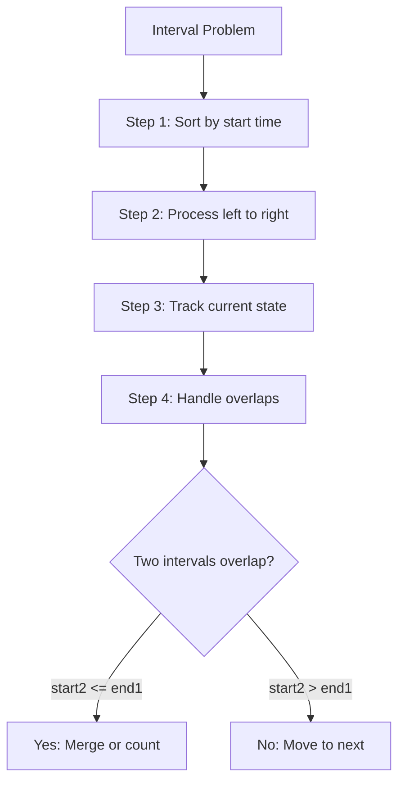

import { LanguageSelector, TimeEstimate, ConfidenceBuilder, DifficultyBadge } from '@site/src/components/interview-guide';
import { CodeTabs } from '@site/src/components/design-patterns/CodeTabs';
import TabItem from '@theme/TabItem';

# Interval Problems: Overlap Detection

Interval problems appear frequently in interviews. The pattern: **sort by start time, then process left to right**.

<LanguageSelector />

<TimeEstimate
  learnTime="30-35 minutes"
  practiceTime="4-5 hours"
  masteryTime="8-10 problems"
  interviewFrequency="15%"
  difficultyRange="Easy to Hard"
  prerequisites="Sorting, Heaps"
/>

---

## The Core Pattern



**Overlap condition:** Two intervals [s1, e1] and [s2, e2] overlap if and only if:
```
s1 <= e2 AND s2 <= e1
```

When sorted by start: simply check `s2 <= e1`.

---

## Merge Intervals

<CodeTabs>
<TabItem value="python" label="Python">

```python
def merge(intervals: list[list[int]]) -> list[list[int]]:
    """
    Merge all overlapping intervals.
    Time: O(n log n) for sorting, Space: O(n) for result
    
    Key: After sorting, just check if current start <= last end
    """
    if not intervals:
        return []
    
    # Sort by start time
    intervals.sort(key=lambda x: x[0])
    
    merged: list[list[int]] = [intervals[0]]
    
    for start, end in intervals[1:]:
        last_end = merged[-1][1]
        
        if start <= last_end:  # Overlap exists
            # Extend the last interval
            merged[-1][1] = max(last_end, end)
        else:
            # No overlap, add new interval
            merged.append([start, end])
    
    return merged


# Example: [[1,3], [2,6], [8,10], [15,18]]
# After sort: same (already sorted)
# Process:
#   [1,3] → merged = [[1,3]]
#   [2,6] → 2 <= 3, overlap → [[1,6]]
#   [8,10] → 8 > 6, no overlap → [[1,6], [8,10]]
#   [15,18] → 15 > 10, no overlap → [[1,6], [8,10], [15,18]]
```

</TabItem>
<TabItem value="typescript" label="TypeScript">

```typescript
function merge(intervals: number[][]): number[][] {
  if (intervals.length === 0) return [];

  intervals.sort((a, b) => a[0] - b[0]);

  const merged: number[][] = [intervals[0]];

  for (let i = 1; i < intervals.length; i++) {
    const [start, end] = intervals[i];
    const lastEnd = merged[merged.length - 1][1];

    if (start <= lastEnd) {
      merged[merged.length - 1][1] = Math.max(lastEnd, end);
    } else {
      merged.push([start, end]);
    }
  }

  return merged;
}
```

</TabItem>
<TabItem value="go" label="Go">

```go
import "sort"

func merge(intervals [][]int) [][]int {
    if len(intervals) == 0 {
        return [][]int{}
    }
    
    sort.Slice(intervals, func(i, j int) bool {
        return intervals[i][0] < intervals[j][0]
    })
    
    merged := [][]int{intervals[0]}
    
    for i := 1; i < len(intervals); i++ {
        start, end := intervals[i][0], intervals[i][1]
        lastEnd := merged[len(merged)-1][1]
        
        if start <= lastEnd {
            if end > lastEnd {
                merged[len(merged)-1][1] = end
            }
        } else {
            merged = append(merged, intervals[i])
        }
    }
    
    return merged
}
```

</TabItem>
<TabItem value="java" label="Java">

```java
public int[][] merge(int[][] intervals) {
    if (intervals.length == 0) return new int[0][];
    
    Arrays.sort(intervals, (a, b) -> a[0] - b[0]);
    
    List<int[]> merged = new ArrayList<>();
    merged.add(intervals[0]);
    
    for (int i = 1; i < intervals.length; i++) {
        int[] last = merged.get(merged.size() - 1);
        int[] curr = intervals[i];
        
        if (curr[0] <= last[1]) {
            last[1] = Math.max(last[1], curr[1]);
        } else {
            merged.add(curr);
        }
    }
    
    return merged.toArray(new int[merged.size()][]);
}
```

</TabItem>
<TabItem value="cpp" label="C++">

```cpp
vector<vector<int>> merge(vector<vector<int>>& intervals) {
    if (intervals.empty()) return {};
    
    sort(intervals.begin(), intervals.end());
    
    vector<vector<int>> merged;
    merged.push_back(intervals[0]);
    
    for (int i = 1; i < intervals.size(); i++) {
        if (intervals[i][0] <= merged.back()[1]) {
            merged.back()[1] = max(merged.back()[1], intervals[i][1]);
        } else {
            merged.push_back(intervals[i]);
        }
    }
    
    return merged;
}
```

</TabItem>
<TabItem value="csharp" label="C#">

```csharp
public int[][] Merge(int[][] intervals) {
    if (intervals.Length == 0) return Array.Empty<int[]>();
    
    Array.Sort(intervals, (a, b) => a[0] - b[0]);
    
    List<int[]> merged = new() { intervals[0] };
    
    for (int i = 1; i < intervals.Length; i++) {
        var last = merged[^1];
        var curr = intervals[i];
        
        if (curr[0] <= last[1]) {
            last[1] = Math.Max(last[1], curr[1]);
        } else {
            merged.Add(curr);
        }
    }
    
    return merged.ToArray();
}
```

</TabItem>
</CodeTabs>

---

## Insert Interval

Insert a new interval and merge if necessary.

<CodeTabs>
<TabItem value="python" label="Python">

```python
def insert(
    intervals: list[list[int]], 
    new_interval: list[int]
) -> list[list[int]]:
    """
    Insert new interval into sorted, non-overlapping intervals.
    Merge any overlapping intervals.
    Time: O(n), Space: O(n)
    """
    result: list[list[int]] = []
    i = 0
    n = len(intervals)
    
    # Step 1: Add all intervals that end before new_interval starts
    while i < n and intervals[i][1] < new_interval[0]:
        result.append(intervals[i])
        i += 1
    
    # Step 2: Merge all overlapping intervals with new_interval
    while i < n and intervals[i][0] <= new_interval[1]:
        new_interval[0] = min(new_interval[0], intervals[i][0])
        new_interval[1] = max(new_interval[1], intervals[i][1])
        i += 1
    
    result.append(new_interval)
    
    # Step 3: Add remaining intervals
    while i < n:
        result.append(intervals[i])
        i += 1
    
    return result
```

</TabItem>
<TabItem value="typescript" label="TypeScript">

```typescript
function insert(intervals: number[][], newInterval: number[]): number[][] {
  const result: number[][] = [];
  let i = 0;
  const n = intervals.length;

  // Add intervals ending before newInterval starts
  while (i < n && intervals[i][1] < newInterval[0]) {
    result.push(intervals[i]);
    i++;
  }

  // Merge overlapping
  while (i < n && intervals[i][0] <= newInterval[1]) {
    newInterval[0] = Math.min(newInterval[0], intervals[i][0]);
    newInterval[1] = Math.max(newInterval[1], intervals[i][1]);
    i++;
  }
  result.push(newInterval);

  // Add remaining
  while (i < n) {
    result.push(intervals[i]);
    i++;
  }

  return result;
}
```

</TabItem>
<TabItem value="java" label="Java">

```java
public int[][] insert(int[][] intervals, int[] newInterval) {
    List<int[]> result = new ArrayList<>();
    int i = 0;
    int n = intervals.length;
    
    // Add intervals ending before newInterval starts
    while (i < n && intervals[i][1] < newInterval[0]) {
        result.add(intervals[i]);
        i++;
    }
    
    // Merge overlapping
    while (i < n && intervals[i][0] <= newInterval[1]) {
        newInterval[0] = Math.min(newInterval[0], intervals[i][0]);
        newInterval[1] = Math.max(newInterval[1], intervals[i][1]);
        i++;
    }
    result.add(newInterval);
    
    // Add remaining
    while (i < n) {
        result.add(intervals[i]);
        i++;
    }
    
    return result.toArray(new int[result.size()][]);
}
```

</TabItem>
</CodeTabs>

---

## Meeting Rooms II (Minimum Rooms)

Find minimum number of conference rooms needed.

<CodeTabs>
<TabItem value="python" label="Python">

```python
import heapq

def min_meeting_rooms(intervals: list[list[int]]) -> int:
    """
    Find minimum meeting rooms required.
    Time: O(n log n), Space: O(n)
    
    Approach: Use min-heap of end times.
    When new meeting starts, check if earliest ending room is free.
    """
    if not intervals:
        return 0
    
    intervals.sort(key=lambda x: x[0])
    
    # Min-heap of end times (rooms in use)
    heap: list[int] = [intervals[0][1]]
    
    for start, end in intervals[1:]:
        # If earliest ending meeting is done, reuse that room
        if start >= heap[0]:
            heapq.heappop(heap)
        
        # Add current meeting's end time
        heapq.heappush(heap, end)
    
    return len(heap)


# Alternative: Event-based approach
def min_meeting_rooms_events(intervals: list[list[int]]) -> int:
    """
    Event-based: +1 at start, -1 at end.
    Track maximum concurrent meetings.
    """
    events: list[tuple[int, int]] = []
    
    for start, end in intervals:
        events.append((start, 1))   # Meeting starts
        events.append((end, -1))    # Meeting ends
    
    # Sort by time, with ends before starts at same time
    events.sort(key=lambda x: (x[0], x[1]))
    
    max_rooms = current = 0
    for time, delta in events:
        current += delta
        max_rooms = max(max_rooms, current)
    
    return max_rooms
```

</TabItem>
<TabItem value="typescript" label="TypeScript">

```typescript
function minMeetingRooms(intervals: number[][]): number {
  if (intervals.length === 0) return 0;

  // Event-based approach
  const events: [number, number][] = [];

  for (const [start, end] of intervals) {
    events.push([start, 1]);
    events.push([end, -1]);
  }

  events.sort((a, b) => (a[0] === b[0] ? a[1] - b[1] : a[0] - b[0]));

  let maxRooms = 0;
  let current = 0;

  for (const [, delta] of events) {
    current += delta;
    maxRooms = Math.max(maxRooms, current);
  }

  return maxRooms;
}
```

</TabItem>
<TabItem value="go" label="Go">

```go
import (
    "container/heap"
    "sort"
)

type MinHeap []int

func (h MinHeap) Len() int           { return len(h) }
func (h MinHeap) Less(i, j int) bool { return h[i] < h[j] }
func (h MinHeap) Swap(i, j int)      { h[i], h[j] = h[j], h[i] }
func (h *MinHeap) Push(x any)        { *h = append(*h, x.(int)) }
func (h *MinHeap) Pop() any {
    old := *h
    n := len(old)
    x := old[n-1]
    *h = old[0 : n-1]
    return x
}

func minMeetingRooms(intervals [][]int) int {
    if len(intervals) == 0 {
        return 0
    }
    
    sort.Slice(intervals, func(i, j int) bool {
        return intervals[i][0] < intervals[j][0]
    })
    
    h := &MinHeap{intervals[0][1]}
    heap.Init(h)
    
    for i := 1; i < len(intervals); i++ {
        if intervals[i][0] >= (*h)[0] {
            heap.Pop(h)
        }
        heap.Push(h, intervals[i][1])
    }
    
    return h.Len()
}
```

</TabItem>
<TabItem value="java" label="Java">

```java
public int minMeetingRooms(int[][] intervals) {
    if (intervals.length == 0) return 0;
    
    Arrays.sort(intervals, (a, b) -> a[0] - b[0]);
    
    PriorityQueue<Integer> heap = new PriorityQueue<>();
    heap.offer(intervals[0][1]);
    
    for (int i = 1; i < intervals.length; i++) {
        if (intervals[i][0] >= heap.peek()) {
            heap.poll();
        }
        heap.offer(intervals[i][1]);
    }
    
    return heap.size();
}
```

</TabItem>
<TabItem value="cpp" label="C++">

```cpp
int minMeetingRooms(vector<vector<int>>& intervals) {
    if (intervals.empty()) return 0;
    
    sort(intervals.begin(), intervals.end());
    
    priority_queue<int, vector<int>, greater<int>> heap;
    heap.push(intervals[0][1]);
    
    for (int i = 1; i < intervals.size(); i++) {
        if (intervals[i][0] >= heap.top()) {
            heap.pop();
        }
        heap.push(intervals[i][1]);
    }
    
    return heap.size();
}
```

</TabItem>
<TabItem value="csharp" label="C#">

```csharp
public int MinMeetingRooms(int[][] intervals) {
    if (intervals.Length == 0) return 0;
    
    Array.Sort(intervals, (a, b) => a[0] - b[0]);
    
    PriorityQueue<int, int> heap = new();
    heap.Enqueue(intervals[0][1], intervals[0][1]);
    
    for (int i = 1; i < intervals.Length; i++) {
        if (intervals[i][0] >= heap.Peek()) {
            heap.Dequeue();
        }
        heap.Enqueue(intervals[i][1], intervals[i][1]);
    }
    
    return heap.Count;
}
```

</TabItem>
</CodeTabs>

---

## Non-Overlapping Intervals (Minimum Removals)

<CodeTabs>
<TabItem value="python" label="Python">

```python
def erase_overlap_intervals(intervals: list[list[int]]) -> int:
    """
    Find minimum intervals to remove to make all non-overlapping.
    
    Greedy approach: Sort by END time.
    Keep intervals that end earliest (leave most room for others).
    """
    if not intervals:
        return 0
    
    # Sort by end time (greedy: keep earliest ending)
    intervals.sort(key=lambda x: x[1])
    
    count = 0
    prev_end = intervals[0][1]
    
    for i in range(1, len(intervals)):
        if intervals[i][0] < prev_end:
            # Overlap: remove this interval (don't update prev_end)
            count += 1
        else:
            # No overlap: keep this interval
            prev_end = intervals[i][1]
    
    return count
```

</TabItem>
<TabItem value="typescript" label="TypeScript">

```typescript
function eraseOverlapIntervals(intervals: number[][]): number {
  if (intervals.length === 0) return 0;

  intervals.sort((a, b) => a[1] - b[1]);

  let count = 0;
  let prevEnd = intervals[0][1];

  for (let i = 1; i < intervals.length; i++) {
    if (intervals[i][0] < prevEnd) {
      count++;
    } else {
      prevEnd = intervals[i][1];
    }
  }

  return count;
}
```

</TabItem>
<TabItem value="java" label="Java">

```java
public int eraseOverlapIntervals(int[][] intervals) {
    if (intervals.length == 0) return 0;
    
    Arrays.sort(intervals, (a, b) -> a[1] - b[1]);
    
    int count = 0;
    int prevEnd = intervals[0][1];
    
    for (int i = 1; i < intervals.length; i++) {
        if (intervals[i][0] < prevEnd) {
            count++;
        } else {
            prevEnd = intervals[i][1];
        }
    }
    
    return count;
}
```

</TabItem>
</CodeTabs>

---

## 🎯 Pattern Triggers

| Problem Clue | Approach |
|--------------|----------|
| "Merge overlapping intervals" | Sort by start, extend if overlap |
| "Insert into sorted intervals" | Three-phase: before, merge, after |
| "Meeting rooms needed" | Heap of end times OR event-based |
| "Maximum non-overlapping" | Sort by END time, greedy |
| "Interval intersection" | Two pointers, advance smaller end |

---

## 💬 How to Communicate

**Explaining merge:**
> "I'll sort by start time first. Then I iterate through, and for each interval, I check if it overlaps with the last merged interval. Overlap means the current start is less than or equal to the last end. If they overlap, I extend the last interval; otherwise, I add a new one..."

**Explaining meeting rooms:**
> "I'll use a min-heap to track the end times of ongoing meetings. When a new meeting starts, I check if the earliest ending meeting is done. If so, I can reuse that room. The heap size at the end tells me the minimum rooms needed..."

---

## 🏋️ Practice Problems

| Problem | Difficulty | Pattern |
|---------|------------|---------|
| [Merge Intervals](https://leetcode.com/problems/merge-intervals/) | <DifficultyBadge level="medium" /> | Sort + merge |
| [Insert Interval](https://leetcode.com/problems/insert-interval/) | <DifficultyBadge level="medium" /> | Three-phase |
| [Meeting Rooms](https://leetcode.com/problems/meeting-rooms/) | <DifficultyBadge level="easy" /> | Overlap check |
| [Meeting Rooms II](https://leetcode.com/problems/meeting-rooms-ii/) | <DifficultyBadge level="medium" /> | Heap |
| [Non-overlapping Intervals](https://leetcode.com/problems/non-overlapping-intervals/) | <DifficultyBadge level="medium" /> | Greedy (sort by end) |
| [Interval Intersections](https://leetcode.com/problems/interval-list-intersections/) | <DifficultyBadge level="medium" /> | Two pointers |

---

## Key Takeaways

1. **Sort by start time** is the first step for most interval problems.

2. **Sort by end time** for greedy selection (max non-overlapping).

3. **Heap tracks end times** for room scheduling problems.

4. **Event-based** approach works well for counting concurrent items.

5. **Overlap condition:** `start2 <= end1` (when sorted by start).

<ConfidenceBuilder type="youve-got-this">

**Interval problems follow a recipe.**

Sort first (usually by start, sometimes by end). Then iterate once, tracking state. Most problems are variations of "do these overlap?" and "what do I do if they do?"

</ConfidenceBuilder>

---

## What's Next?

More greedy patterns:

**See also:** [Greedy Intervals](/docs/interview-guide/coding/patterns/greedy-patterns/intervals) — Activity Selection
