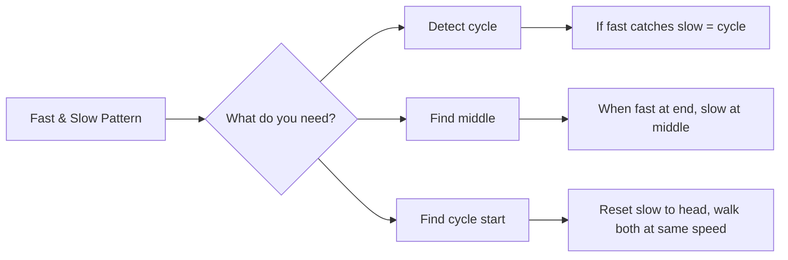

import { LanguageSelector, TimeEstimate, ConfidenceBuilder, DifficultyBadge } from '@site/src/components/interview-guide';
import { CodeTabs } from '@site/src/components/design-patterns/CodeTabs';
import TabItem from '@theme/TabItem';

# Fast & Slow Pointers: The Tortoise and Hare

Two pointers moving at different speeds solve many linked list problems elegantly. This technique is also known as **Floyd's Cycle Detection Algorithm**.

<LanguageSelector />

<TimeEstimate
  learnTime="25-30 minutes"
  practiceTime="3-4 hours"
  masteryTime="8-10 problems"
  interviewFrequency="20%"
  difficultyRange="Easy to Medium"
  prerequisites="Linked Lists"
/>

---

## The Core Pattern

```
Slow pointer: moves 1 step per iteration
Fast pointer: moves 2 steps per iteration

Two key insights:
1. If there's a cycle, fast will eventually catch slow
2. When fast reaches the end, slow is at the middle
```



---

## Detect Cycle

<CodeTabs>
<TabItem value="python" label="Python">

```python
class ListNode:
    def __init__(self, val=0, next=None):
        self.val = val
        self.next = next


def has_cycle(head: ListNode | None) -> bool:
    """
    Detect if linked list has a cycle.
    Time: O(n), Space: O(1)
    
    If there's a cycle, fast will eventually lap slow and they'll meet.
    """
    if not head or not head.next:
        return False
    
    slow = fast = head
    
    while fast and fast.next:
        slow = slow.next
        fast = fast.next.next
        
        if slow == fast:
            return True
    
    return False
```

</TabItem>
<TabItem value="typescript" label="TypeScript">

```typescript
class ListNode {
  val: number;
  next: ListNode | null;
  constructor(val = 0, next: ListNode | null = null) {
    this.val = val;
    this.next = next;
  }
}

function hasCycle(head: ListNode | null): boolean {
  if (!head || !head.next) return false;

  let slow: ListNode | null = head;
  let fast: ListNode | null = head;

  while (fast && fast.next) {
    slow = slow!.next;
    fast = fast.next.next;

    if (slow === fast) return true;
  }

  return false;
}
```

</TabItem>
<TabItem value="go" label="Go">

```go
type ListNode struct {
    Val  int
    Next *ListNode
}

func hasCycle(head *ListNode) bool {
    if head == nil || head.Next == nil {
        return false
    }
    
    slow, fast := head, head
    
    for fast != nil && fast.Next != nil {
        slow = slow.Next
        fast = fast.Next.Next
        
        if slow == fast {
            return true
        }
    }
    
    return false
}
```

</TabItem>
<TabItem value="java" label="Java">

```java
public boolean hasCycle(ListNode head) {
    if (head == null || head.next == null) return false;
    
    ListNode slow = head;
    ListNode fast = head;
    
    while (fast != null && fast.next != null) {
        slow = slow.next;
        fast = fast.next.next;
        
        if (slow == fast) return true;
    }
    
    return false;
}
```

</TabItem>
<TabItem value="cpp" label="C++">

```cpp
bool hasCycle(ListNode* head) {
    if (!head || !head->next) return false;
    
    ListNode* slow = head;
    ListNode* fast = head;
    
    while (fast && fast->next) {
        slow = slow->next;
        fast = fast->next->next;
        
        if (slow == fast) return true;
    }
    
    return false;
}
```

</TabItem>
<TabItem value="csharp" label="C#">

```csharp
public bool HasCycle(ListNode head) {
    if (head == null || head.next == null) return false;
    
    ListNode slow = head;
    ListNode fast = head;
    
    while (fast != null && fast.next != null) {
        slow = slow.next;
        fast = fast.next.next;
        
        if (slow == fast) return true;
    }
    
    return false;
}
```

</TabItem>
</CodeTabs>

---

## Find Cycle Start

After detecting a cycle, find where it begins.

<CodeTabs>
<TabItem value="python" label="Python">

```python
def detect_cycle(head: ListNode | None) -> ListNode | None:
    """
    Find the node where cycle begins, or None if no cycle.
    
    Mathematical proof:
    Let F = distance from head to cycle start
    Let C = cycle length
    Let X = distance from cycle start to meeting point
    
    When they meet:
    - slow traveled: F + X
    - fast traveled: F + X + n*C (went around cycle n times)
    
    Since fast is 2x speed: 2(F + X) = F + X + n*C
    Therefore: F = n*C - X
    
    This means: distance from head to cycle start = 
                distance from meeting point to cycle start (going forward)
    """
    if not head or not head.next:
        return None
    
    slow = fast = head
    
    # Phase 1: Find meeting point
    while fast and fast.next:
        slow = slow.next
        fast = fast.next.next
        
        if slow == fast:
            break
    else:
        return None  # No cycle
    
    # Phase 2: Find cycle start
    # Reset slow to head, move both at same speed
    slow = head
    while slow != fast:
        slow = slow.next
        fast = fast.next
    
    return slow  # This is the cycle start
```

</TabItem>
<TabItem value="typescript" label="TypeScript">

```typescript
function detectCycle(head: ListNode | null): ListNode | null {
  if (!head || !head.next) return null;

  let slow: ListNode | null = head;
  let fast: ListNode | null = head;

  // Phase 1: Find meeting point
  while (fast && fast.next) {
    slow = slow!.next;
    fast = fast.next.next;

    if (slow === fast) {
      // Phase 2: Find cycle start
      slow = head;
      while (slow !== fast) {
        slow = slow!.next;
        fast = fast!.next;
      }
      return slow;
    }
  }

  return null;
}
```

</TabItem>
<TabItem value="go" label="Go">

```go
func detectCycle(head *ListNode) *ListNode {
    if head == nil || head.Next == nil {
        return nil
    }
    
    slow, fast := head, head
    
    // Phase 1: Find meeting point
    for fast != nil && fast.Next != nil {
        slow = slow.Next
        fast = fast.Next.Next
        
        if slow == fast {
            // Phase 2: Find cycle start
            slow = head
            for slow != fast {
                slow = slow.Next
                fast = fast.Next
            }
            return slow
        }
    }
    
    return nil
}
```

</TabItem>
<TabItem value="java" label="Java">

```java
public ListNode detectCycle(ListNode head) {
    if (head == null || head.next == null) return null;
    
    ListNode slow = head;
    ListNode fast = head;
    
    // Phase 1: Find meeting point
    while (fast != null && fast.next != null) {
        slow = slow.next;
        fast = fast.next.next;
        
        if (slow == fast) {
            // Phase 2: Find cycle start
            slow = head;
            while (slow != fast) {
                slow = slow.next;
                fast = fast.next;
            }
            return slow;
        }
    }
    
    return null;
}
```

</TabItem>
<TabItem value="cpp" label="C++">

```cpp
ListNode* detectCycle(ListNode* head) {
    if (!head || !head->next) return nullptr;
    
    ListNode* slow = head;
    ListNode* fast = head;
    
    // Phase 1: Find meeting point
    while (fast && fast->next) {
        slow = slow->next;
        fast = fast->next->next;
        
        if (slow == fast) {
            // Phase 2: Find cycle start
            slow = head;
            while (slow != fast) {
                slow = slow->next;
                fast = fast->next;
            }
            return slow;
        }
    }
    
    return nullptr;
}
```

</TabItem>
<TabItem value="csharp" label="C#">

```csharp
public ListNode DetectCycle(ListNode head) {
    if (head == null || head.next == null) return null;
    
    ListNode slow = head;
    ListNode fast = head;
    
    // Phase 1: Find meeting point
    while (fast != null && fast.next != null) {
        slow = slow.next;
        fast = fast.next.next;
        
        if (slow == fast) {
            // Phase 2: Find cycle start
            slow = head;
            while (slow != fast) {
                slow = slow.next;
                fast = fast.next;
            }
            return slow;
        }
    }
    
    return null;
}
```

</TabItem>
</CodeTabs>

---

## Find Middle of List

<CodeTabs>
<TabItem value="python" label="Python">

```python
def find_middle(head: ListNode | None) -> ListNode | None:
    """
    Find middle node of linked list.
    For even length, returns second middle.
    
    When fast reaches end (or None), slow is at middle.
    Time: O(n), Space: O(1)
    """
    if not head:
        return None
    
    slow = fast = head
    
    while fast and fast.next:
        slow = slow.next
        fast = fast.next.next
    
    return slow


def find_first_middle(head: ListNode | None) -> ListNode | None:
    """
    For even length lists, returns FIRST middle.
    Useful when you need to split the list.
    
    Example: 1→2→3→4 returns 2 (not 3)
    """
    if not head:
        return None
    
    slow = fast = head
    
    # Stop when fast.next.next would be None
    while fast.next and fast.next.next:
        slow = slow.next
        fast = fast.next.next
    
    return slow
```

</TabItem>
<TabItem value="typescript" label="TypeScript">

```typescript
function findMiddle(head: ListNode | null): ListNode | null {
  if (!head) return null;

  let slow: ListNode | null = head;
  let fast: ListNode | null = head;

  while (fast && fast.next) {
    slow = slow!.next;
    fast = fast.next.next;
  }

  return slow;
}

// Returns first middle for even-length lists
function findFirstMiddle(head: ListNode | null): ListNode | null {
  if (!head) return null;

  let slow: ListNode = head;
  let fast: ListNode = head;

  while (fast.next && fast.next.next) {
    slow = slow.next!;
    fast = fast.next.next;
  }

  return slow;
}
```

</TabItem>
<TabItem value="go" label="Go">

```go
func findMiddle(head *ListNode) *ListNode {
    if head == nil {
        return nil
    }
    
    slow, fast := head, head
    
    for fast != nil && fast.Next != nil {
        slow = slow.Next
        fast = fast.Next.Next
    }
    
    return slow
}
```

</TabItem>
<TabItem value="java" label="Java">

```java
public ListNode findMiddle(ListNode head) {
    if (head == null) return null;
    
    ListNode slow = head;
    ListNode fast = head;
    
    while (fast != null && fast.next != null) {
        slow = slow.next;
        fast = fast.next.next;
    }
    
    return slow;
}
```

</TabItem>
<TabItem value="cpp" label="C++">

```cpp
ListNode* findMiddle(ListNode* head) {
    if (!head) return nullptr;
    
    ListNode* slow = head;
    ListNode* fast = head;
    
    while (fast && fast->next) {
        slow = slow->next;
        fast = fast->next->next;
    }
    
    return slow;
}
```

</TabItem>
<TabItem value="csharp" label="C#">

```csharp
public ListNode FindMiddle(ListNode head) {
    if (head == null) return null;
    
    ListNode slow = head;
    ListNode fast = head;
    
    while (fast != null && fast.next != null) {
        slow = slow.next;
        fast = fast.next.next;
    }
    
    return slow;
}
```

</TabItem>
</CodeTabs>

---

## Happy Number (Non-List Application)

Fast-slow works on any sequence that might cycle!

<CodeTabs>
<TabItem value="python" label="Python">

```python
def is_happy(n: int) -> bool:
    """
    A happy number eventually reaches 1 when repeatedly
    replacing with sum of squares of digits.
    
    If not happy, the sequence enters a cycle.
    Use fast-slow to detect if we reach 1 or enter cycle.
    """
    def get_next(num: int) -> int:
        total = 0
        while num > 0:
            digit = num % 10
            total += digit * digit
            num //= 10
        return total
    
    slow = fast = n
    
    while True:
        slow = get_next(slow)
        fast = get_next(get_next(fast))
        
        if fast == 1:
            return True
        if slow == fast:
            return False  # Entered a cycle that doesn't include 1
```

</TabItem>
<TabItem value="typescript" label="TypeScript">

```typescript
function isHappy(n: number): boolean {
  function getNext(num: number): number {
    let total = 0;
    while (num > 0) {
      const digit = num % 10;
      total += digit * digit;
      num = Math.floor(num / 10);
    }
    return total;
  }

  let slow = n;
  let fast = n;

  do {
    slow = getNext(slow);
    fast = getNext(getNext(fast));
  } while (fast !== 1 && slow !== fast);

  return fast === 1;
}
```

</TabItem>
<TabItem value="go" label="Go">

```go
func isHappy(n int) bool {
    getNext := func(num int) int {
        total := 0
        for num > 0 {
            digit := num % 10
            total += digit * digit
            num /= 10
        }
        return total
    }
    
    slow, fast := n, n
    
    for {
        slow = getNext(slow)
        fast = getNext(getNext(fast))
        
        if fast == 1 {
            return true
        }
        if slow == fast {
            return false
        }
    }
}
```

</TabItem>
<TabItem value="java" label="Java">

```java
public boolean isHappy(int n) {
    int slow = n;
    int fast = n;
    
    do {
        slow = getNext(slow);
        fast = getNext(getNext(fast));
    } while (fast != 1 && slow != fast);
    
    return fast == 1;
}

private int getNext(int num) {
    int total = 0;
    while (num > 0) {
        int digit = num % 10;
        total += digit * digit;
        num /= 10;
    }
    return total;
}
```

</TabItem>
<TabItem value="cpp" label="C++">

```cpp
bool isHappy(int n) {
    auto getNext = [](int num) {
        int total = 0;
        while (num > 0) {
            int digit = num % 10;
            total += digit * digit;
            num /= 10;
        }
        return total;
    };
    
    int slow = n, fast = n;
    
    do {
        slow = getNext(slow);
        fast = getNext(getNext(fast));
    } while (fast != 1 && slow != fast);
    
    return fast == 1;
}
```

</TabItem>
<TabItem value="csharp" label="C#">

```csharp
public bool IsHappy(int n) {
    int GetNext(int num) {
        int total = 0;
        while (num > 0) {
            int digit = num % 10;
            total += digit * digit;
            num /= 10;
        }
        return total;
    }
    
    int slow = n, fast = n;
    
    do {
        slow = GetNext(slow);
        fast = GetNext(GetNext(fast));
    } while (fast != 1 && slow != fast);
    
    return fast == 1;
}
```

</TabItem>
</CodeTabs>

---

## 🎯 Pattern Triggers

| Problem Clue | Approach |
|--------------|----------|
| "Detect cycle in linked list" | Fast-slow, check if they meet |
| "Find middle of linked list" | Fast-slow, slow is middle when fast ends |
| "Find where cycle starts" | Meet first, then reset slow and walk same speed |
| "Palindrome linked list" | Find middle, reverse second half, compare |
| "Any repeating sequence" | Fast-slow (Happy Number, etc.) |

---

## 💬 How to Communicate

**Explaining cycle detection:**
> "I'll use two pointers—slow moves one step, fast moves two steps. If there's a cycle, fast will eventually lap slow and they'll meet. If fast reaches null, there's no cycle..."

**Explaining cycle start:**
> "After they meet, I reset slow to head. Now both move one step at a time. Mathematically, they'll meet at the cycle start because the distance from head to cycle start equals the distance from meeting point to cycle start..."

---

## 🏋️ Practice Problems

| Problem | Difficulty | Pattern |
|---------|------------|---------|
| [Linked List Cycle](https://leetcode.com/problems/linked-list-cycle/) | <DifficultyBadge level="easy" /> | Basic detection |
| [Linked List Cycle II](https://leetcode.com/problems/linked-list-cycle-ii/) | <DifficultyBadge level="medium" /> | Find start |
| [Middle of Linked List](https://leetcode.com/problems/middle-of-the-linked-list/) | <DifficultyBadge level="easy" /> | Find middle |
| [Palindrome Linked List](https://leetcode.com/problems/palindrome-linked-list/) | <DifficultyBadge level="easy" /> | Middle + reverse |
| [Happy Number](https://leetcode.com/problems/happy-number/) | <DifficultyBadge level="easy" /> | Cycle in sequence |
| [Reorder List](https://leetcode.com/problems/reorder-list/) | <DifficultyBadge level="medium" /> | Middle + reverse + merge |

---

## Key Takeaways

1. **Cycle detection:** Fast catches slow if cycle exists.

2. **Find middle:** When fast reaches end, slow is at middle.

3. **Cycle start:** The math works—reset and walk at same speed.

4. **Beyond lists:** Pattern applies to any repeating function/sequence.

5. **O(n) time, O(1) space** for all variations.

<ConfidenceBuilder type="youve-got-this">

**Fast-slow is about catching up.**

If there's a cycle, the faster pointer will eventually lap the slower one. If there's no cycle, the faster pointer reaches the end first. This simple idea solves a surprising variety of problems.

</ConfidenceBuilder>

---

## What's Next?

More linked list patterns:

**Next up:** [Linked List Reversal](/docs/interview-guide/coding/patterns/linkedlist-patterns/reversal) — The Core Pattern
