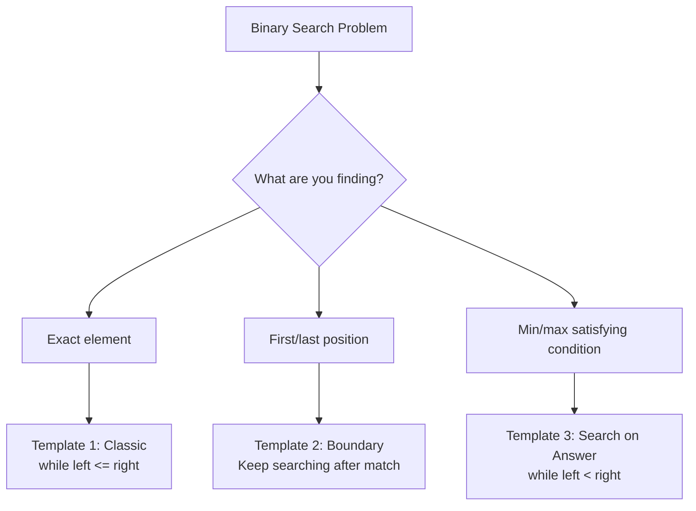

import { LanguageSelector, TimeEstimate, ConfidenceBuilder, DifficultyBadge } from '@site/src/components/interview-guide';
import { CodeTabs } from '@site/src/components/design-patterns/CodeTabs';
import TabItem from '@theme/TabItem';

# Binary Search: More Than Just Finding Elements

Most people think binary search is simple: find an element in a sorted array. But in interviews, it's rarely that straightforward.

"Find the minimum in rotated sorted array." "Find first position of element." "Find the smallest divisor given a threshold."

The first time I saw "Koko Eating Bananas," I had no idea it was a binary search problem. There was no sorted array! The insight that changed everything: **you can binary search on the answer itself.**

**Binary search is a technique for eliminating half the search space each step.** The "sorted array" is just one application.

<LanguageSelector />

<TimeEstimate
  learnTime="30-40 minutes"
  practiceTime="3-4 hours"
  masteryTime="12-15 problems"
  interviewFrequency="55%"
  difficultyRange="Easy to Hard"
  prerequisites="Arrays, Big-O Notation"
/>

---

## The Three Templates



---

## Template 1: Classic Binary Search

**Use when:** Finding exact element, answer exists or doesn't.

<CodeTabs>
<TabItem value="python" label="Python">

```python
def binary_search(nums: list[int], target: int) -> int:
    """
    Find target in sorted array.
    Time: O(log n), Space: O(1)
    Returns index if found, -1 otherwise.
    """
    left, right = 0, len(nums) - 1
    
    while left <= right:  # Note: <=
        mid = left + (right - left) // 2  # Avoid overflow
        
        if nums[mid] == target:
            return mid
        elif nums[mid] < target:
            left = mid + 1
        else:
            right = mid - 1
    
    return -1
```

</TabItem>
<TabItem value="typescript" label="TypeScript">

```typescript
function binarySearch(nums: number[], target: number): number {
  let left = 0;
  let right = nums.length - 1;

  while (left <= right) {
    const mid = left + Math.floor((right - left) / 2);

    if (nums[mid] === target) {
      return mid;
    } else if (nums[mid] < target) {
      left = mid + 1;
    } else {
      right = mid - 1;
    }
  }

  return -1;
}
```

</TabItem>
<TabItem value="go" label="Go">

```go
func binarySearch(nums []int, target int) int {
    left, right := 0, len(nums)-1
    
    for left <= right {
        mid := left + (right-left)/2
        
        if nums[mid] == target {
            return mid
        } else if nums[mid] < target {
            left = mid + 1
        } else {
            right = mid - 1
        }
    }
    
    return -1
}
```

</TabItem>
<TabItem value="java" label="Java">

```java
public int binarySearch(int[] nums, int target) {
    int left = 0;
    int right = nums.length - 1;
    
    while (left <= right) {
        int mid = left + (right - left) / 2;
        
        if (nums[mid] == target) {
            return mid;
        } else if (nums[mid] < target) {
            left = mid + 1;
        } else {
            right = mid - 1;
        }
    }
    
    return -1;
}
```

</TabItem>
<TabItem value="cpp" label="C++">

```cpp
int binarySearch(vector<int>& nums, int target) {
    int left = 0;
    int right = nums.size() - 1;
    
    while (left <= right) {
        int mid = left + (right - left) / 2;
        
        if (nums[mid] == target) {
            return mid;
        } else if (nums[mid] < target) {
            left = mid + 1;
        } else {
            right = mid - 1;
        }
    }
    
    return -1;
}
```

</TabItem>
<TabItem value="c" label="C">

```c
int binarySearch(int* nums, int n, int target) {
    int left = 0;
    int right = n - 1;
    
    while (left <= right) {
        int mid = left + (right - left) / 2;
        
        if (nums[mid] == target) {
            return mid;
        } else if (nums[mid] < target) {
            left = mid + 1;
        } else {
            right = mid - 1;
        }
    }
    
    return -1;
}
```

</TabItem>
<TabItem value="csharp" label="C#">

```csharp
public int BinarySearch(int[] nums, int target) {
    int left = 0;
    int right = nums.Length - 1;
    
    while (left <= right) {
        int mid = left + (right - left) / 2;
        
        if (nums[mid] == target) {
            return mid;
        } else if (nums[mid] < target) {
            left = mid + 1;
        } else {
            right = mid - 1;
        }
    }
    
    return -1;
}
```

</TabItem>
</CodeTabs>

---

## Template 2: Find First/Last Position (Boundary)

**Use when:** Finding boundary positions, first/last occurrence of element.

<CodeTabs>
<TabItem value="python" label="Python">

```python
def find_first(nums: list[int], target: int) -> int:
    """
    Find first occurrence of target.
    Key insight: When found, keep searching LEFT for earlier occurrence.
    """
    left, right = 0, len(nums) - 1
    result = -1
    
    while left <= right:
        mid = left + (right - left) // 2
        
        if nums[mid] == target:
            result = mid
            right = mid - 1  # Keep searching left
        elif nums[mid] < target:
            left = mid + 1
        else:
            right = mid - 1
    
    return result


def find_last(nums: list[int], target: int) -> int:
    """
    Find last occurrence of target.
    Key insight: When found, keep searching RIGHT for later occurrence.
    """
    left, right = 0, len(nums) - 1
    result = -1
    
    while left <= right:
        mid = left + (right - left) // 2
        
        if nums[mid] == target:
            result = mid
            left = mid + 1  # Keep searching right
        elif nums[mid] < target:
            left = mid + 1
        else:
            right = mid - 1
    
    return result


def search_range(nums: list[int], target: int) -> list[int]:
    """Find first and last position of target."""
    return [find_first(nums, target), find_last(nums, target)]

# [5, 7, 7, 8, 8, 10], target=8 → [3, 4]
```

</TabItem>
<TabItem value="typescript" label="TypeScript">

```typescript
function findFirst(nums: number[], target: number): number {
  let left = 0;
  let right = nums.length - 1;
  let result = -1;

  while (left <= right) {
    const mid = left + Math.floor((right - left) / 2);

    if (nums[mid] === target) {
      result = mid;
      right = mid - 1; // Keep searching left
    } else if (nums[mid] < target) {
      left = mid + 1;
    } else {
      right = mid - 1;
    }
  }

  return result;
}

function findLast(nums: number[], target: number): number {
  let left = 0;
  let right = nums.length - 1;
  let result = -1;

  while (left <= right) {
    const mid = left + Math.floor((right - left) / 2);

    if (nums[mid] === target) {
      result = mid;
      left = mid + 1; // Keep searching right
    } else if (nums[mid] < target) {
      left = mid + 1;
    } else {
      right = mid - 1;
    }
  }

  return result;
}
```

</TabItem>
<TabItem value="go" label="Go">

```go
func findFirst(nums []int, target int) int {
    left, right := 0, len(nums)-1
    result := -1
    
    for left <= right {
        mid := left + (right-left)/2
        
        if nums[mid] == target {
            result = mid
            right = mid - 1 // Keep searching left
        } else if nums[mid] < target {
            left = mid + 1
        } else {
            right = mid - 1
        }
    }
    
    return result
}

func findLast(nums []int, target int) int {
    left, right := 0, len(nums)-1
    result := -1
    
    for left <= right {
        mid := left + (right-left)/2
        
        if nums[mid] == target {
            result = mid
            left = mid + 1 // Keep searching right
        } else if nums[mid] < target {
            left = mid + 1
        } else {
            right = mid - 1
        }
    }
    
    return result
}
```

</TabItem>
<TabItem value="java" label="Java">

```java
public int findFirst(int[] nums, int target) {
    int left = 0, right = nums.length - 1;
    int result = -1;
    
    while (left <= right) {
        int mid = left + (right - left) / 2;
        
        if (nums[mid] == target) {
            result = mid;
            right = mid - 1;
        } else if (nums[mid] < target) {
            left = mid + 1;
        } else {
            right = mid - 1;
        }
    }
    
    return result;
}

public int findLast(int[] nums, int target) {
    int left = 0, right = nums.length - 1;
    int result = -1;
    
    while (left <= right) {
        int mid = left + (right - left) / 2;
        
        if (nums[mid] == target) {
            result = mid;
            left = mid + 1;
        } else if (nums[mid] < target) {
            left = mid + 1;
        } else {
            right = mid - 1;
        }
    }
    
    return result;
}
```

</TabItem>
<TabItem value="cpp" label="C++">

```cpp
int findFirst(vector<int>& nums, int target) {
    int left = 0, right = nums.size() - 1;
    int result = -1;
    
    while (left <= right) {
        int mid = left + (right - left) / 2;
        
        if (nums[mid] == target) {
            result = mid;
            right = mid - 1;
        } else if (nums[mid] < target) {
            left = mid + 1;
        } else {
            right = mid - 1;
        }
    }
    
    return result;
}

int findLast(vector<int>& nums, int target) {
    int left = 0, right = nums.size() - 1;
    int result = -1;
    
    while (left <= right) {
        int mid = left + (right - left) / 2;
        
        if (nums[mid] == target) {
            result = mid;
            left = mid + 1;
        } else if (nums[mid] < target) {
            left = mid + 1;
        } else {
            right = mid - 1;
        }
    }
    
    return result;
}
```

</TabItem>
<TabItem value="c" label="C">

```c
int findFirst(int* nums, int n, int target) {
    int left = 0, right = n - 1;
    int result = -1;
    
    while (left <= right) {
        int mid = left + (right - left) / 2;
        
        if (nums[mid] == target) {
            result = mid;
            right = mid - 1;
        } else if (nums[mid] < target) {
            left = mid + 1;
        } else {
            right = mid - 1;
        }
    }
    
    return result;
}

int findLast(int* nums, int n, int target) {
    int left = 0, right = n - 1;
    int result = -1;
    
    while (left <= right) {
        int mid = left + (right - left) / 2;
        
        if (nums[mid] == target) {
            result = mid;
            left = mid + 1;
        } else if (nums[mid] < target) {
            left = mid + 1;
        } else {
            right = mid - 1;
        }
    }
    
    return result;
}
```

</TabItem>
<TabItem value="csharp" label="C#">

```csharp
public int FindFirst(int[] nums, int target) {
    int left = 0, right = nums.Length - 1;
    int result = -1;
    
    while (left <= right) {
        int mid = left + (right - left) / 2;
        
        if (nums[mid] == target) {
            result = mid;
            right = mid - 1;
        } else if (nums[mid] < target) {
            left = mid + 1;
        } else {
            right = mid - 1;
        }
    }
    
    return result;
}

public int FindLast(int[] nums, int target) {
    int left = 0, right = nums.Length - 1;
    int result = -1;
    
    while (left <= right) {
        int mid = left + (right - left) / 2;
        
        if (nums[mid] == target) {
            result = mid;
            left = mid + 1;
        } else if (nums[mid] < target) {
            left = mid + 1;
        } else {
            right = mid - 1;
        }
    }
    
    return result;
}
```

</TabItem>
</CodeTabs>

---

## Template 3: Search on Answer

**Use when:** Finding minimum/maximum value that satisfies a condition.

This is the most powerful and least intuitive template. **You're not searching an array—you're searching the space of possible answers.**

<CodeTabs>
<TabItem value="python" label="Python">

```python
def min_eating_speed(piles: list[int], h: int) -> int:
    """
    Koko Eating Bananas: Find minimum eating speed to finish in h hours.
    
    Key insight: If speed K works, any speed > K also works.
    This monotonic property enables binary search on the ANSWER.
    
    Time: O(n log m) where m = max(piles)
    """
    def can_finish(speed: int) -> bool:
        """Check if Koko can finish all piles at this speed in h hours."""
        hours = sum((pile + speed - 1) // speed for pile in piles)  # Ceiling division
        return hours <= h
    
    left, right = 1, max(piles)  # Search space: [1, max_pile]
    
    while left < right:  # Note: < not <=
        mid = left + (right - left) // 2
        
        if can_finish(mid):
            right = mid  # Speed works, try smaller
        else:
            left = mid + 1  # Speed doesn't work, need larger
    
    return left

# piles = [3, 6, 7, 11], h = 8 → 4
# At speed 4: ceil(3/4) + ceil(6/4) + ceil(7/4) + ceil(11/4) = 1+2+2+3 = 8 ✓
```

</TabItem>
<TabItem value="typescript" label="TypeScript">

```typescript
function minEatingSpeed(piles: number[], h: number): number {
  function canFinish(speed: number): boolean {
    let hours = 0;
    for (const pile of piles) {
      hours += Math.ceil(pile / speed);
    }
    return hours <= h;
  }

  let left = 1;
  let right = Math.max(...piles);

  while (left < right) {
    const mid = left + Math.floor((right - left) / 2);

    if (canFinish(mid)) {
      right = mid;
    } else {
      left = mid + 1;
    }
  }

  return left;
}
```

</TabItem>
<TabItem value="go" label="Go">

```go
func minEatingSpeed(piles []int, h int) int {
    canFinish := func(speed int) bool {
        hours := 0
        for _, pile := range piles {
            hours += (pile + speed - 1) / speed
        }
        return hours <= h
    }
    
    left, right := 1, 0
    for _, pile := range piles {
        if pile > right {
            right = pile
        }
    }
    
    for left < right {
        mid := left + (right-left)/2
        
        if canFinish(mid) {
            right = mid
        } else {
            left = mid + 1
        }
    }
    
    return left
}
```

</TabItem>
<TabItem value="java" label="Java">

```java
public int minEatingSpeed(int[] piles, int h) {
    int left = 1;
    int right = Arrays.stream(piles).max().getAsInt();
    
    while (left < right) {
        int mid = left + (right - left) / 2;
        
        if (canFinish(piles, mid, h)) {
            right = mid;
        } else {
            left = mid + 1;
        }
    }
    
    return left;
}

private boolean canFinish(int[] piles, int speed, int h) {
    int hours = 0;
    for (int pile : piles) {
        hours += (pile + speed - 1) / speed;
    }
    return hours <= h;
}
```

</TabItem>
<TabItem value="cpp" label="C++">

```cpp
int minEatingSpeed(vector<int>& piles, int h) {
    auto canFinish = [&](int speed) {
        long hours = 0;
        for (int pile : piles) {
            hours += (pile + speed - 1) / speed;
        }
        return hours <= h;
    };
    
    int left = 1;
    int right = *max_element(piles.begin(), piles.end());
    
    while (left < right) {
        int mid = left + (right - left) / 2;
        
        if (canFinish(mid)) {
            right = mid;
        } else {
            left = mid + 1;
        }
    }
    
    return left;
}
```

</TabItem>
<TabItem value="c" label="C">

```c
bool canFinish(int* piles, int n, int speed, int h) {
    long hours = 0;
    for (int i = 0; i < n; i++) {
        hours += (piles[i] + speed - 1) / speed;
    }
    return hours <= h;
}

int minEatingSpeed(int* piles, int n, int h) {
    int left = 1;
    int right = 0;
    for (int i = 0; i < n; i++) {
        if (piles[i] > right) right = piles[i];
    }
    
    while (left < right) {
        int mid = left + (right - left) / 2;
        
        if (canFinish(piles, n, mid, h)) {
            right = mid;
        } else {
            left = mid + 1;
        }
    }
    
    return left;
}
```

</TabItem>
<TabItem value="csharp" label="C#">

```csharp
public int MinEatingSpeed(int[] piles, int h) {
    bool CanFinish(int speed) {
        long hours = 0;
        foreach (int pile in piles) {
            hours += (pile + speed - 1) / speed;
        }
        return hours <= h;
    }
    
    int left = 1;
    int right = piles.Max();
    
    while (left < right) {
        int mid = left + (right - left) / 2;
        
        if (CanFinish(mid)) {
            right = mid;
        } else {
            left = mid + 1;
        }
    }
    
    return left;
}
```

</TabItem>
</CodeTabs>

<ConfidenceBuilder type="remember" title="When to Use Search on Answer">

**Look for monotonic conditions:** If value X works, do all values > X (or < X) also work?

Examples:
- "Minimum speed to finish in time" → If speed 5 works, speed 6 also works
- "Maximum number of groups" → If 3 groups work, 2 groups also work
- "Minimum capacity to ship" → If capacity 10 works, capacity 11 also works

</ConfidenceBuilder>

---

## Search in Rotated Sorted Array

A classic interview problem combining binary search with array insight.

<CodeTabs>
<TabItem value="python" label="Python">

```python
def search_rotated(nums: list[int], target: int) -> int:
    """
    Search in rotated sorted array.
    Key insight: At least one half is always sorted.
    
    Time: O(log n), Space: O(1)
    """
    left, right = 0, len(nums) - 1
    
    while left <= right:
        mid = left + (right - left) // 2
        
        if nums[mid] == target:
            return mid
        
        # Check which half is sorted
        if nums[left] <= nums[mid]:  # Left half is sorted
            if nums[left] <= target < nums[mid]:
                right = mid - 1  # Target in sorted left half
            else:
                left = mid + 1   # Target in right half
        else:  # Right half is sorted
            if nums[mid] < target <= nums[right]:
                left = mid + 1   # Target in sorted right half
            else:
                right = mid - 1  # Target in left half
    
    return -1

# [4, 5, 6, 7, 0, 1, 2], target=0 → 4
```

</TabItem>
<TabItem value="typescript" label="TypeScript">

```typescript
function searchRotated(nums: number[], target: number): number {
  let left = 0;
  let right = nums.length - 1;

  while (left <= right) {
    const mid = left + Math.floor((right - left) / 2);

    if (nums[mid] === target) {
      return mid;
    }

    if (nums[left] <= nums[mid]) {
      // Left half is sorted
      if (nums[left] <= target && target < nums[mid]) {
        right = mid - 1;
      } else {
        left = mid + 1;
      }
    } else {
      // Right half is sorted
      if (nums[mid] < target && target <= nums[right]) {
        left = mid + 1;
      } else {
        right = mid - 1;
      }
    }
  }

  return -1;
}
```

</TabItem>
<TabItem value="java" label="Java">

```java
public int searchRotated(int[] nums, int target) {
    int left = 0, right = nums.length - 1;
    
    while (left <= right) {
        int mid = left + (right - left) / 2;
        
        if (nums[mid] == target) {
            return mid;
        }
        
        if (nums[left] <= nums[mid]) {
            if (nums[left] <= target && target < nums[mid]) {
                right = mid - 1;
            } else {
                left = mid + 1;
            }
        } else {
            if (nums[mid] < target && target <= nums[right]) {
                left = mid + 1;
            } else {
                right = mid - 1;
            }
        }
    }
    
    return -1;
}
```

</TabItem>
<TabItem value="go" label="Go">

```go
func searchRotated(nums []int, target int) int {
    left, right := 0, len(nums)-1
    
    for left <= right {
        mid := left + (right-left)/2
        
        if nums[mid] == target {
            return mid
        }
        
        if nums[left] <= nums[mid] {
            if nums[left] <= target && target < nums[mid] {
                right = mid - 1
            } else {
                left = mid + 1
            }
        } else {
            if nums[mid] < target && target <= nums[right] {
                left = mid + 1
            } else {
                right = mid - 1
            }
        }
    }
    
    return -1
}
```

</TabItem>
<TabItem value="cpp" label="C++">

```cpp
int searchRotated(vector<int>& nums, int target) {
    int left = 0, right = nums.size() - 1;
    
    while (left <= right) {
        int mid = left + (right - left) / 2;
        
        if (nums[mid] == target) {
            return mid;
        }
        
        if (nums[left] <= nums[mid]) {
            if (nums[left] <= target && target < nums[mid]) {
                right = mid - 1;
            } else {
                left = mid + 1;
            }
        } else {
            if (nums[mid] < target && target <= nums[right]) {
                left = mid + 1;
            } else {
                right = mid - 1;
            }
        }
    }
    
    return -1;
}
```

</TabItem>
<TabItem value="c" label="C">

```c
int searchRotated(int* nums, int n, int target) {
    int left = 0, right = n - 1;
    
    while (left <= right) {
        int mid = left + (right - left) / 2;
        
        if (nums[mid] == target) {
            return mid;
        }
        
        if (nums[left] <= nums[mid]) {
            if (nums[left] <= target && target < nums[mid]) {
                right = mid - 1;
            } else {
                left = mid + 1;
            }
        } else {
            if (nums[mid] < target && target <= nums[right]) {
                left = mid + 1;
            } else {
                right = mid - 1;
            }
        }
    }
    
    return -1;
}
```

</TabItem>
<TabItem value="csharp" label="C#">

```csharp
public int SearchRotated(int[] nums, int target) {
    int left = 0, right = nums.Length - 1;
    
    while (left <= right) {
        int mid = left + (right - left) / 2;
        
        if (nums[mid] == target) {
            return mid;
        }
        
        if (nums[left] <= nums[mid]) {
            if (nums[left] <= target && target < nums[mid]) {
                right = mid - 1;
            } else {
                left = mid + 1;
            }
        } else {
            if (nums[mid] < target && target <= nums[right]) {
                left = mid + 1;
            } else {
                right = mid - 1;
            }
        }
    }
    
    return -1;
}
```

</TabItem>
</CodeTabs>

---

## 🎯 Pattern Triggers

| If the problem says... | Template |
|------------------------|----------|
| "Find element in sorted array" | Classic |
| "First/last position" | Boundary |
| "Minimum satisfying condition" | Search on answer |
| "Rotated array" | Modified classic |
| "Find peak" | Compare with neighbor |
| "2D matrix (sorted)" | Index conversion |

---

## Common Mistakes

### 1. Infinite Loop

```python
# ❌ WRONG - infinite loop when left = mid
while left < right:
    mid = (left + right) // 2
    if condition:
        left = mid  # When left = right-1 and condition true, stuck!

# ✅ RIGHT - use mid + 1
while left < right:
    mid = (left + right) // 2
    if condition:
        left = mid + 1
```

### 2. Wrong Loop Condition

```python
# Template 1 & 2: Use <=
while left <= right:  # For finding exact element

# Template 3: Use <
while left < right:   # For search on answer (converge to single value)
```

### 3. Integer Overflow

```python
# ❌ WRONG - can overflow in some languages
mid = (left + right) / 2

# ✅ RIGHT - avoid overflow
mid = left + (right - left) // 2
```

---

## 💬 How to Communicate This in Interviews

**When you identify binary search:**
> "The array is sorted, so I can use binary search to find the target in O(log n) time instead of linear search..."

**For search on answer:**
> "I notice that if X works, then X+1 also works. This monotonic property means I can binary search on the answer space instead of trying every possibility..."

**When debugging:**
> "Let me trace through with a small example. If nums = [1,3,5], target = 3..."

---

## 🏋️ Practice Problems

### Warm-Up (Build Confidence)

| Problem | Difficulty | Time | Template |
|---------|------------|------|----------|
| [Binary Search](https://leetcode.com/problems/binary-search/) | <DifficultyBadge level="easy" /> | 10 min | Classic |
| [First Bad Version](https://leetcode.com/problems/first-bad-version/) | <DifficultyBadge level="easy" /> | 15 min | Boundary |
| [Search Insert Position](https://leetcode.com/problems/search-insert-position/) | <DifficultyBadge level="easy" /> | 15 min | Boundary |

### Core Practice (Must Do)

| Problem | Difficulty | Companies | Template |
|---------|------------|-----------|----------|
| [Search in Rotated Array](https://leetcode.com/problems/search-in-rotated-sorted-array/) | <DifficultyBadge level="medium" /> | Meta, Amazon, Google | Modified |
| [Find First and Last Position](https://leetcode.com/problems/find-first-and-last-position-of-element-in-sorted-array/) | <DifficultyBadge level="medium" /> | Meta, Amazon | Boundary |
| [Find Peak Element](https://leetcode.com/problems/find-peak-element/) | <DifficultyBadge level="medium" /> | Meta, Google, Amazon | Compare neighbor |
| [Koko Eating Bananas](https://leetcode.com/problems/koko-eating-bananas/) | <DifficultyBadge level="medium" /> | Google, Amazon | Search on answer |
| [Capacity to Ship](https://leetcode.com/problems/capacity-to-ship-packages-within-d-days/) | <DifficultyBadge level="medium" /> | Amazon, Google | Search on answer |

### Challenge (For Mastery)

| Problem | Difficulty | Companies | Why It's Hard |
|---------|------------|-----------|---------------|
| [Median of Two Sorted Arrays](https://leetcode.com/problems/median-of-two-sorted-arrays/) | <DifficultyBadge level="hard" /> | Google, Amazon, Meta | Binary search on partition |
| [Split Array Largest Sum](https://leetcode.com/problems/split-array-largest-sum/) | <DifficultyBadge level="hard" /> | Google, Amazon | Search on answer + greedy |

---

## Key Takeaways

1. **Three templates** cover 90% of problems: classic, boundary, search-on-answer.

2. **Search on answer** is the most powerful—look for monotonic conditions.

3. **Always avoid overflow:** Use `left + (right - left) / 2`.

4. **Check loop termination:** `<=` for exact match, `<` for convergence.

5. **Sorted or monotonic property required.** If it's not obvious, look harder—it might be there.

<ConfidenceBuilder type="youve-got-this">

**Binary search has predictable patterns.**

Once you recognize which template applies, the implementation is almost mechanical. The hard part is seeing that binary search applies in the first place—especially for "search on answer" problems.

</ConfidenceBuilder>

---

## What's Next?

Dynamic Programming for problems with optimal substructure:

**Next up:** [Dynamic Programming Introduction](/docs/interview-guide/coding/patterns/dp-patterns/introduction) — Breaking down complex problems
