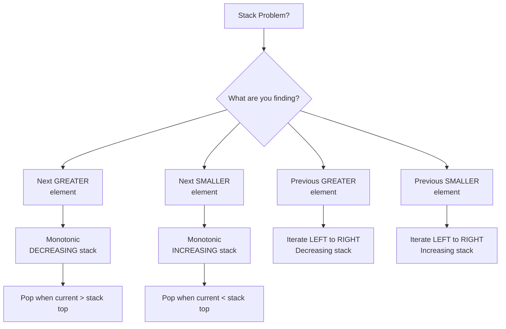

import { LanguageSelector, TimeEstimate, ConfidenceBuilder, DifficultyBadge } from '@site/src/components/interview-guide';
import { CodeTabs } from '@site/src/components/design-patterns/CodeTabs';
import TabItem from '@theme/TabItem';

# Monotonic Stack: Next Greater/Smaller in O(n)

The first time I saw "find the next greater element for each position," I nested two loops. O(n²).

Then I learned the monotonic stack trick: **maintain a stack where elements are always increasing (or decreasing)**. When you encounter an element that breaks the order, you've found the "next greater" for everything you pop.

**One pass. O(n). Beautiful.**

<LanguageSelector />

<TimeEstimate
  learnTime="25-35 minutes"
  practiceTime="3-4 hours"
  masteryTime="8-10 problems"
  interviewFrequency="25%"
  difficultyRange="Medium to Hard"
  prerequisites="Stacks, Arrays"
/>

---

## The Pattern Visualized

```
Finding next greater element:

Array: [4, 2, 1, 5, 3]

Stack evolution (stores indices):
i=0: push 0       stack=[0]           (4 waiting)
i=1: push 1       stack=[0,1]         (4,2 waiting)  
i=2: push 2       stack=[0,1,2]       (4,2,1 waiting)
i=3: 5 > 1, pop 2 → result[2]=5
     5 > 2, pop 1 → result[1]=5
     5 > 4, pop 0 → result[0]=5
     push 3       stack=[3]
i=4: push 4       stack=[3,4]

Result: [5, 5, 5, -1, -1]
```

**Key insight:** Each element is pushed once, popped once → O(n) total.

---

## Decision Guide



---

## Next Greater Element

<CodeTabs>
<TabItem value="python" label="Python">

```python
def next_greater_element(nums: list[int]) -> list[int]:
    """
    Find the next greater element for each position.
    
    Strategy: Maintain a decreasing stack of indices.
    When we find a larger element, it's the answer for all smaller waiting elements.
    
    Time: O(n) - each element pushed and popped at most once
    Space: O(n) - stack space
    """
    n = len(nums)
    result = [-1] * n
    stack: list[int] = []  # Indices of elements waiting for next greater
    
    for i in range(n):
        # While current element is greater than stack top
        while stack and nums[i] > nums[stack[-1]]:
            idx = stack.pop()
            result[idx] = nums[i]  # Found next greater for idx
        
        stack.append(i)  # This element now waits for its next greater
    
    # Elements remaining in stack have no next greater (-1)
    return result

# [4, 2, 1, 5, 3] → [5, 5, 5, -1, -1]
```

</TabItem>
<TabItem value="typescript" label="TypeScript">

```typescript
function nextGreaterElement(nums: number[]): number[] {
  const n = nums.length;
  const result: number[] = new Array(n).fill(-1);
  const stack: number[] = []; // Indices

  for (let i = 0; i < n; i++) {
    while (stack.length > 0 && nums[i] > nums[stack[stack.length - 1]]) {
      const idx = stack.pop()!;
      result[idx] = nums[i];
    }
    stack.push(i);
  }

  return result;
}
```

</TabItem>
<TabItem value="go" label="Go">

```go
func nextGreaterElement(nums []int) []int {
    n := len(nums)
    result := make([]int, n)
    for i := range result {
        result[i] = -1
    }
    
    stack := []int{} // Indices
    
    for i := 0; i < n; i++ {
        for len(stack) > 0 && nums[i] > nums[stack[len(stack)-1]] {
            idx := stack[len(stack)-1]
            stack = stack[:len(stack)-1]
            result[idx] = nums[i]
        }
        stack = append(stack, i)
    }
    
    return result
}
```

</TabItem>
<TabItem value="java" label="Java">

```java
public int[] nextGreaterElement(int[] nums) {
    int n = nums.length;
    int[] result = new int[n];
    Arrays.fill(result, -1);
    
    Deque<Integer> stack = new ArrayDeque<>(); // Indices
    
    for (int i = 0; i < n; i++) {
        while (!stack.isEmpty() && nums[i] > nums[stack.peek()]) {
            int idx = stack.pop();
            result[idx] = nums[i];
        }
        stack.push(i);
    }
    
    return result;
}
```

</TabItem>
<TabItem value="cpp" label="C++">

```cpp
vector<int> nextGreaterElement(vector<int>& nums) {
    int n = nums.size();
    vector<int> result(n, -1);
    stack<int> st; // Indices
    
    for (int i = 0; i < n; i++) {
        while (!st.empty() && nums[i] > nums[st.top()]) {
            int idx = st.top();
            st.pop();
            result[idx] = nums[i];
        }
        st.push(i);
    }
    
    return result;
}
```

</TabItem>
<TabItem value="c" label="C">

```c
int* nextGreaterElement(int* nums, int numsSize, int* returnSize) {
    *returnSize = numsSize;
    int* result = (int*)malloc(numsSize * sizeof(int));
    int* stack = (int*)malloc(numsSize * sizeof(int));
    int top = -1;
    
    for (int i = 0; i < numsSize; i++) {
        result[i] = -1;
    }
    
    for (int i = 0; i < numsSize; i++) {
        while (top >= 0 && nums[i] > nums[stack[top]]) {
            int idx = stack[top--];
            result[idx] = nums[i];
        }
        stack[++top] = i;
    }
    
    free(stack);
    return result;
}
```

</TabItem>
<TabItem value="csharp" label="C#">

```csharp
public int[] NextGreaterElement(int[] nums) {
    int n = nums.Length;
    int[] result = new int[n];
    Array.Fill(result, -1);
    
    Stack<int> stack = new(); // Indices
    
    for (int i = 0; i < n; i++) {
        while (stack.Count > 0 && nums[i] > nums[stack.Peek()]) {
            int idx = stack.Pop();
            result[idx] = nums[i];
        }
        stack.Push(i);
    }
    
    return result;
}
```

</TabItem>
</CodeTabs>

<ConfidenceBuilder type="remember" title="Why Store Indices?">

We store **indices** (not values) because:
1. We need to know **where** to put the answer
2. We can calculate **distances** (like "how many days until warmer")
3. We can still access the **value** via `nums[stack[-1]]`

</ConfidenceBuilder>

---

## Daily Temperatures

How many days until a warmer temperature?

<CodeTabs>
<TabItem value="python" label="Python">

```python
def daily_temperatures(temperatures: list[int]) -> list[int]:
    """
    For each day, find days until warmer temperature.
    
    Same pattern as next greater, but return DISTANCE instead of VALUE.
    """
    n = len(temperatures)
    result = [0] * n
    stack: list[int] = []  # Indices of days waiting for warmer
    
    for i in range(n):
        while stack and temperatures[i] > temperatures[stack[-1]]:
            prev_day = stack.pop()
            result[prev_day] = i - prev_day  # Days until warmer
        
        stack.append(i)
    
    # Days remaining in stack never get warmer (result stays 0)
    return result

# [73,74,75,71,69,72,76,73] → [1,1,4,2,1,1,0,0]
```

</TabItem>
<TabItem value="typescript" label="TypeScript">

```typescript
function dailyTemperatures(temperatures: number[]): number[] {
  const n = temperatures.length;
  const result: number[] = new Array(n).fill(0);
  const stack: number[] = [];

  for (let i = 0; i < n; i++) {
    while (
      stack.length > 0 &&
      temperatures[i] > temperatures[stack[stack.length - 1]]
    ) {
      const prevDay = stack.pop()!;
      result[prevDay] = i - prevDay;
    }
    stack.push(i);
  }

  return result;
}
```

</TabItem>
<TabItem value="go" label="Go">

```go
func dailyTemperatures(temperatures []int) []int {
    n := len(temperatures)
    result := make([]int, n)
    stack := []int{}
    
    for i := 0; i < n; i++ {
        for len(stack) > 0 && temperatures[i] > temperatures[stack[len(stack)-1]] {
            prevDay := stack[len(stack)-1]
            stack = stack[:len(stack)-1]
            result[prevDay] = i - prevDay
        }
        stack = append(stack, i)
    }
    
    return result
}
```

</TabItem>
<TabItem value="java" label="Java">

```java
public int[] dailyTemperatures(int[] temperatures) {
    int n = temperatures.length;
    int[] result = new int[n];
    Deque<Integer> stack = new ArrayDeque<>();
    
    for (int i = 0; i < n; i++) {
        while (!stack.isEmpty() && temperatures[i] > temperatures[stack.peek()]) {
            int prevDay = stack.pop();
            result[prevDay] = i - prevDay;
        }
        stack.push(i);
    }
    
    return result;
}
```

</TabItem>
<TabItem value="cpp" label="C++">

```cpp
vector<int> dailyTemperatures(vector<int>& temperatures) {
    int n = temperatures.size();
    vector<int> result(n, 0);
    stack<int> st;
    
    for (int i = 0; i < n; i++) {
        while (!st.empty() && temperatures[i] > temperatures[st.top()]) {
            int prevDay = st.top();
            st.pop();
            result[prevDay] = i - prevDay;
        }
        st.push(i);
    }
    
    return result;
}
```

</TabItem>
<TabItem value="c" label="C">

```c
int* dailyTemperatures(int* temperatures, int temperaturesSize, int* returnSize) {
    *returnSize = temperaturesSize;
    int* result = (int*)calloc(temperaturesSize, sizeof(int));
    int* stack = (int*)malloc(temperaturesSize * sizeof(int));
    int top = -1;
    
    for (int i = 0; i < temperaturesSize; i++) {
        while (top >= 0 && temperatures[i] > temperatures[stack[top]]) {
            int prevDay = stack[top--];
            result[prevDay] = i - prevDay;
        }
        stack[++top] = i;
    }
    
    free(stack);
    return result;
}
```

</TabItem>
<TabItem value="csharp" label="C#">

```csharp
public int[] DailyTemperatures(int[] temperatures) {
    int n = temperatures.Length;
    int[] result = new int[n];
    Stack<int> stack = new();
    
    for (int i = 0; i < n; i++) {
        while (stack.Count > 0 && temperatures[i] > temperatures[stack.Peek()]) {
            int prevDay = stack.Pop();
            result[prevDay] = i - prevDay;
        }
        stack.Push(i);
    }
    
    return result;
}
```

</TabItem>
</CodeTabs>

---

## Largest Rectangle in Histogram

Classic hard problem. Find the largest rectangle that can be formed.

<CodeTabs>
<TabItem value="python" label="Python">

```python
def largest_rectangle_area(heights: list[int]) -> int:
    """
    Find largest rectangle in histogram.
    
    Key insight: For each bar, find how far left and right it can extend
    (until a shorter bar is found). Monotonic stack finds these boundaries.
    
    Time: O(n), Space: O(n)
    """
    stack: list[int] = []  # Indices of bars in increasing height order
    max_area = 0
    
    for i, h in enumerate(heights):
        start = i  # Leftmost position this height can extend to
        
        # Pop bars taller than current - they can't extend further right
        while stack and heights[stack[-1]] > h:
            idx = stack.pop()
            height = heights[idx]
            width = i - idx  # From idx to i-1
            max_area = max(max_area, height * width)
            start = idx  # Current bar can extend back to where popped bar started
        
        stack.append(start)
        heights[start] = h  # Update height at start position
    
    # Process remaining bars - they extend to the end
    n = len(heights)
    for idx in stack:
        height = heights[idx]
        width = n - idx
        max_area = max(max_area, height * width)
    
    return max_area

# [2,1,5,6,2,3] → 10 (heights 5,6 form 2×5=10)
```

</TabItem>
<TabItem value="typescript" label="TypeScript">

```typescript
function largestRectangleArea(heights: number[]): number {
  const stack: [number, number][] = []; // [index, height]
  let maxArea = 0;

  for (let i = 0; i < heights.length; i++) {
    let start = i;

    while (stack.length > 0 && stack[stack.length - 1][1] > heights[i]) {
      const [idx, height] = stack.pop()!;
      maxArea = Math.max(maxArea, height * (i - idx));
      start = idx;
    }

    stack.push([start, heights[i]]);
  }

  // Process remaining
  for (const [idx, height] of stack) {
    maxArea = Math.max(maxArea, height * (heights.length - idx));
  }

  return maxArea;
}
```

</TabItem>
<TabItem value="go" label="Go">

```go
func largestRectangleArea(heights []int) int {
    type pair struct {
        idx, height int
    }
    
    stack := []pair{}
    maxArea := 0
    
    for i, h := range heights {
        start := i
        
        for len(stack) > 0 && stack[len(stack)-1].height > h {
            top := stack[len(stack)-1]
            stack = stack[:len(stack)-1]
            area := top.height * (i - top.idx)
            if area > maxArea {
                maxArea = area
            }
            start = top.idx
        }
        
        stack = append(stack, pair{start, h})
    }
    
    n := len(heights)
    for _, p := range stack {
        area := p.height * (n - p.idx)
        if area > maxArea {
            maxArea = area
        }
    }
    
    return maxArea
}
```

</TabItem>
<TabItem value="java" label="Java">

```java
public int largestRectangleArea(int[] heights) {
    Deque<int[]> stack = new ArrayDeque<>(); // [index, height]
    int maxArea = 0;
    
    for (int i = 0; i < heights.length; i++) {
        int start = i;
        
        while (!stack.isEmpty() && stack.peek()[1] > heights[i]) {
            int[] top = stack.pop();
            maxArea = Math.max(maxArea, top[1] * (i - top[0]));
            start = top[0];
        }
        
        stack.push(new int[] {start, heights[i]});
    }
    
    int n = heights.length;
    while (!stack.isEmpty()) {
        int[] top = stack.pop();
        maxArea = Math.max(maxArea, top[1] * (n - top[0]));
    }
    
    return maxArea;
}
```

</TabItem>
<TabItem value="cpp" label="C++">

```cpp
int largestRectangleArea(vector<int>& heights) {
    stack<pair<int, int>> st; // {index, height}
    int maxArea = 0;
    
    for (int i = 0; i < heights.size(); i++) {
        int start = i;
        
        while (!st.empty() && st.top().second > heights[i]) {
            auto [idx, height] = st.top();
            st.pop();
            maxArea = max(maxArea, height * (i - idx));
            start = idx;
        }
        
        st.push({start, heights[i]});
    }
    
    int n = heights.size();
    while (!st.empty()) {
        auto [idx, height] = st.top();
        st.pop();
        maxArea = max(maxArea, height * (n - idx));
    }
    
    return maxArea;
}
```

</TabItem>
<TabItem value="c" label="C">

```c
int largestRectangleArea(int* heights, int heightsSize) {
    int* stackIdx = (int*)malloc(heightsSize * sizeof(int));
    int* stackHeight = (int*)malloc(heightsSize * sizeof(int));
    int top = -1;
    int maxArea = 0;
    
    for (int i = 0; i < heightsSize; i++) {
        int start = i;
        
        while (top >= 0 && stackHeight[top] > heights[i]) {
            int area = stackHeight[top] * (i - stackIdx[top]);
            if (area > maxArea) maxArea = area;
            start = stackIdx[top];
            top--;
        }
        
        top++;
        stackIdx[top] = start;
        stackHeight[top] = heights[i];
    }
    
    while (top >= 0) {
        int area = stackHeight[top] * (heightsSize - stackIdx[top]);
        if (area > maxArea) maxArea = area;
        top--;
    }
    
    free(stackIdx);
    free(stackHeight);
    return maxArea;
}
```

</TabItem>
<TabItem value="csharp" label="C#">

```csharp
public int LargestRectangleArea(int[] heights) {
    Stack<(int idx, int height)> stack = new();
    int maxArea = 0;
    
    for (int i = 0; i < heights.Length; i++) {
        int start = i;
        
        while (stack.Count > 0 && stack.Peek().height > heights[i]) {
            var (idx, height) = stack.Pop();
            maxArea = Math.Max(maxArea, height * (i - idx));
            start = idx;
        }
        
        stack.Push((start, heights[i]));
    }
    
    int n = heights.Length;
    while (stack.Count > 0) {
        var (idx, height) = stack.Pop();
        maxArea = Math.Max(maxArea, height * (n - idx));
    }
    
    return maxArea;
}
```

</TabItem>
</CodeTabs>

---

## Trapping Rain Water

Calculate water trapped between bars.

<CodeTabs>
<TabItem value="python" label="Python">

```python
def trap(height: list[int]) -> int:
    """
    Calculate trapped rain water.
    
    Stack approach: When we find a bar taller than stack top,
    we can trap water with the bar at stack top as the bottom.
    
    Time: O(n), Space: O(n)
    """
    stack: list[int] = []
    water = 0
    
    for i, h in enumerate(height):
        while stack and h > height[stack[-1]]:
            bottom = height[stack.pop()]  # Bottom of water container
            
            if not stack:  # No left wall
                break
            
            left_wall = stack[-1]
            width = i - left_wall - 1
            bounded_height = min(h, height[left_wall]) - bottom
            water += width * bounded_height
        
        stack.append(i)
    
    return water

# [0,1,0,2,1,0,1,3,2,1,2,1] → 6
```

</TabItem>
<TabItem value="typescript" label="TypeScript">

```typescript
function trap(height: number[]): number {
  const stack: number[] = [];
  let water = 0;

  for (let i = 0; i < height.length; i++) {
    while (stack.length > 0 && height[i] > height[stack[stack.length - 1]]) {
      const bottom = height[stack.pop()!];

      if (stack.length === 0) break;

      const leftWall = stack[stack.length - 1];
      const width = i - leftWall - 1;
      const boundedHeight = Math.min(height[i], height[leftWall]) - bottom;
      water += width * boundedHeight;
    }

    stack.push(i);
  }

  return water;
}
```

</TabItem>
<TabItem value="go" label="Go">

```go
func trap(height []int) int {
    stack := []int{}
    water := 0
    
    for i, h := range height {
        for len(stack) > 0 && h > height[stack[len(stack)-1]] {
            bottom := height[stack[len(stack)-1]]
            stack = stack[:len(stack)-1]
            
            if len(stack) == 0 {
                break
            }
            
            leftWall := stack[len(stack)-1]
            width := i - leftWall - 1
            boundedHeight := min(h, height[leftWall]) - bottom
            water += width * boundedHeight
        }
        
        stack = append(stack, i)
    }
    
    return water
}

func min(a, b int) int {
    if a < b {
        return a
    }
    return b
}
```

</TabItem>
<TabItem value="java" label="Java">

```java
public int trap(int[] height) {
    Deque<Integer> stack = new ArrayDeque<>();
    int water = 0;
    
    for (int i = 0; i < height.length; i++) {
        while (!stack.isEmpty() && height[i] > height[stack.peek()]) {
            int bottom = height[stack.pop()];
            
            if (stack.isEmpty()) break;
            
            int leftWall = stack.peek();
            int width = i - leftWall - 1;
            int boundedHeight = Math.min(height[i], height[leftWall]) - bottom;
            water += width * boundedHeight;
        }
        
        stack.push(i);
    }
    
    return water;
}
```

</TabItem>
<TabItem value="cpp" label="C++">

```cpp
int trap(vector<int>& height) {
    stack<int> st;
    int water = 0;
    
    for (int i = 0; i < height.size(); i++) {
        while (!st.empty() && height[i] > height[st.top()]) {
            int bottom = height[st.top()];
            st.pop();
            
            if (st.empty()) break;
            
            int leftWall = st.top();
            int width = i - leftWall - 1;
            int boundedHeight = min(height[i], height[leftWall]) - bottom;
            water += width * boundedHeight;
        }
        
        st.push(i);
    }
    
    return water;
}
```

</TabItem>
<TabItem value="c" label="C">

```c
int trap(int* height, int heightSize) {
    int* stack = (int*)malloc(heightSize * sizeof(int));
    int top = -1;
    int water = 0;
    
    for (int i = 0; i < heightSize; i++) {
        while (top >= 0 && height[i] > height[stack[top]]) {
            int bottom = height[stack[top--]];
            
            if (top < 0) break;
            
            int leftWall = stack[top];
            int width = i - leftWall - 1;
            int h = height[i] < height[leftWall] ? height[i] : height[leftWall];
            water += width * (h - bottom);
        }
        
        stack[++top] = i;
    }
    
    free(stack);
    return water;
}
```

</TabItem>
<TabItem value="csharp" label="C#">

```csharp
public int Trap(int[] height) {
    Stack<int> stack = new();
    int water = 0;
    
    for (int i = 0; i < height.Length; i++) {
        while (stack.Count > 0 && height[i] > height[stack.Peek()]) {
            int bottom = height[stack.Pop()];
            
            if (stack.Count == 0) break;
            
            int leftWall = stack.Peek();
            int width = i - leftWall - 1;
            int boundedHeight = Math.Min(height[i], height[leftWall]) - bottom;
            water += width * boundedHeight;
        }
        
        stack.Push(i);
    }
    
    return water;
}
```

</TabItem>
</CodeTabs>

---

## 🎯 Pattern Triggers

| Problem Clue | Stack Type | Pop Condition |
|--------------|------------|---------------|
| "Next **greater** element" | Decreasing | `current > stack top` |
| "Next **smaller** element" | Increasing | `current < stack top` |
| "Previous greater" | Decreasing, iterate L→R | Same |
| "Days until..." | Store indices | Distance = `i - idx` |
| "Largest rectangle" | Increasing heights | Height can't extend right |
| "Trapping water" | Find boundaries | Fill horizontal layers |

---

## 💬 How to Communicate This in Interviews

**Identifying the pattern:**
> "This is a 'next greater element' problem. I'll use a monotonic stack to solve it in O(n)..."

**Explaining the approach:**
> "I'll maintain a stack of indices in decreasing order. When I find an element greater than the stack top, I've found the answer for that position..."

**Analyzing complexity:**
> "Each element is pushed once and popped at most once, so total operations is O(n) despite the nested while loop..."

---

## 🏋️ Practice Problems

### Warm-Up (Build Confidence)

| Problem | Difficulty | Time |
|---------|------------|------|
| [Next Greater Element I](https://leetcode.com/problems/next-greater-element-i/) | <DifficultyBadge level="easy" /> | 15 min |
| [Daily Temperatures](https://leetcode.com/problems/daily-temperatures/) | <DifficultyBadge level="medium" /> | 20 min |

### Core Practice (Must Do)

| Problem | Difficulty | Companies | Pattern |
|---------|------------|-----------|---------|
| [Next Greater Element II](https://leetcode.com/problems/next-greater-element-ii/) | <DifficultyBadge level="medium" /> | Amazon, Google | Circular array |
| [Stock Span Problem](https://leetcode.com/problems/online-stock-span/) | <DifficultyBadge level="medium" /> | Goldman, Amazon | Previous greater |
| [Largest Rectangle in Histogram](https://leetcode.com/problems/largest-rectangle-in-histogram/) | <DifficultyBadge level="hard" /> | Amazon, Google | Classic hard |
| [Trapping Rain Water](https://leetcode.com/problems/trapping-rain-water/) | <DifficultyBadge level="hard" /> | Google, Amazon, Meta | Boundaries |

### Challenge (For Mastery)

| Problem | Difficulty | Companies | Why It's Hard |
|---------|------------|-----------|---------------|
| [Maximal Rectangle](https://leetcode.com/problems/maximal-rectangle/) | <DifficultyBadge level="hard" /> | Meta, Google | 2D histogram |
| [Remove K Digits](https://leetcode.com/problems/remove-k-digits/) | <DifficultyBadge level="medium" /> | Amazon | Greedy + stack |
| [Sum of Subarray Minimums](https://leetcode.com/problems/sum-of-subarray-minimums/) | <DifficultyBadge level="medium" /> | Amazon | Contribution counting |

---

## Key Takeaways

1. **Monotonic stack** solves "next greater/smaller" in O(n).

2. **Store indices** to calculate distances and access values.

3. **Decreasing stack** for next greater, **increasing** for next smaller.

4. **Process while popping**—that's when elements find their answer.

5. **Don't forget remaining elements**—they have no next greater/smaller.

<ConfidenceBuilder type="youve-got-this">

**Monotonic stack is a one-trick pony—but it's a great trick.**

Once you recognize "next greater/smaller," the solution pattern is nearly identical every time. Master the template, then just adapt the details.

</ConfidenceBuilder>

---

## What's Next?

Another powerful array technique for range queries:

**Next up:** [Prefix Sum Pattern](/docs/interview-guide/coding/patterns/array-patterns/prefix-sum) — O(1) Range Queries
