import { LanguageSelector, TimeEstimate, ConfidenceBuilder, DifficultyBadge } from '@site/src/components/interview-guide';
import { CodeTabs } from '@site/src/components/design-patterns/CodeTabs';
import TabItem from '@theme/TabItem';

# Palindrome Problems: Symmetry Mastery

Palindrome problems appear frequently in interviews. They test string manipulation, two-pointers, DP, and sometimes backtracking.

<LanguageSelector />

<TimeEstimate
  learnTime="25-30 minutes"
  practiceTime="3-4 hours"
  masteryTime="8-10 problems"
  interviewFrequency="15%"
  difficultyRange="Easy to Hard"
  prerequisites="Strings, Two Pointers, DP basics"
/>

---

## Pattern Overview

```mermaid
flowchart TD
    A[Palindrome Problem] --> B{What's asked?}
    
    B --> C["Is it a palindrome?"]
    B --> D["Find longest"]
    B --> E["Partition into palindromes"]
    B --> F["Count palindromes"]
    
    C --> G["Two Pointers<br/>O(n)"]
    D --> H["Expand Around Center<br/>O(n²)"]
    E --> I["Backtracking + DP<br/>O(n × 2^n)"]
    F --> J["DP or Expand<br/>O(n²)"]
```



---

## Check if Palindrome

The foundation—verify if a string reads the same forwards and backwards.

<CodeTabs>
<TabItem value="python" label="Python">

```python
def is_palindrome(s: str) -> bool:
    """Simple palindrome check. O(n) time, O(n) space."""
    return s == s[::-1]


def is_palindrome_two_pointers(s: str) -> bool:
    """Two-pointer approach. O(n) time, O(1) space."""
    left, right = 0, len(s) - 1
    
    while left < right:
        if s[left] != s[right]:
            return False
        left += 1
        right -= 1
    
    return True


def is_palindrome_alphanumeric(s: str) -> bool:
    """
    Valid Palindrome (LeetCode 125)
    Considers only alphanumeric characters, ignoring case.
    """
    left, right = 0, len(s) - 1
    
    while left < right:
        # Skip non-alphanumeric from left
        while left < right and not s[left].isalnum():
            left += 1
        # Skip non-alphanumeric from right
        while left < right and not s[right].isalnum():
            right -= 1
        
        if s[left].lower() != s[right].lower():
            return False
        
        left += 1
        right -= 1
    
    return True
```

</TabItem>
<TabItem value="typescript" label="TypeScript">

```typescript
function isPalindrome(s: string): boolean {
  return s === s.split("").reverse().join("");
}

function isPalindromeTwoPointers(s: string): boolean {
  let left = 0;
  let right = s.length - 1;

  while (left < right) {
    if (s[left] !== s[right]) return false;
    left++;
    right--;
  }

  return true;
}

function isPalindromeAlphanumeric(s: string): boolean {
  let left = 0;
  let right = s.length - 1;

  while (left < right) {
    while (left < right && !isAlphanumeric(s[left])) left++;
    while (left < right && !isAlphanumeric(s[right])) right--;

    if (s[left].toLowerCase() !== s[right].toLowerCase()) return false;

    left++;
    right--;
  }

  return true;
}

function isAlphanumeric(c: string): boolean {
  return /[a-zA-Z0-9]/.test(c);
}
```

</TabItem>
<TabItem value="go" label="Go">

```go
func isPalindrome(s string) bool {
    runes := []rune(s)
    for i, j := 0, len(runes)-1; i < j; i, j = i+1, j-1 {
        runes[i], runes[j] = runes[j], runes[i]
    }
    return s == string(runes)
}

func isPalindromeTwoPointers(s string) bool {
    left, right := 0, len(s)-1
    
    for left < right {
        if s[left] != s[right] {
            return false
        }
        left++
        right--
    }
    
    return true
}

func isPalindromeAlphanumeric(s string) bool {
    left, right := 0, len(s)-1
    
    for left < right {
        for left < right && !isAlphanumeric(rune(s[left])) {
            left++
        }
        for left < right && !isAlphanumeric(rune(s[right])) {
            right--
        }
        
        if unicode.ToLower(rune(s[left])) != unicode.ToLower(rune(s[right])) {
            return false
        }
        left++
        right--
    }
    
    return true
}

func isAlphanumeric(r rune) bool {
    return unicode.IsLetter(r) || unicode.IsDigit(r)
}
```

</TabItem>
<TabItem value="java" label="Java">

```java
public boolean isPalindrome(String s) {
    return s.equals(new StringBuilder(s).reverse().toString());
}

public boolean isPalindromeTwoPointers(String s) {
    int left = 0, right = s.length() - 1;
    
    while (left < right) {
        if (s.charAt(left) != s.charAt(right)) return false;
        left++;
        right--;
    }
    
    return true;
}

public boolean isPalindromeAlphanumeric(String s) {
    int left = 0, right = s.length() - 1;
    
    while (left < right) {
        while (left < right && !Character.isLetterOrDigit(s.charAt(left))) {
            left++;
        }
        while (left < right && !Character.isLetterOrDigit(s.charAt(right))) {
            right--;
        }
        
        if (Character.toLowerCase(s.charAt(left)) != 
            Character.toLowerCase(s.charAt(right))) {
            return false;
        }
        left++;
        right--;
    }
    
    return true;
}
```

</TabItem>
<TabItem value="cpp" label="C++">

```cpp
bool isPalindrome(const string& s) {
    string reversed = s;
    reverse(reversed.begin(), reversed.end());
    return s == reversed;
}

bool isPalindromeTwoPointers(const string& s) {
    int left = 0, right = s.length() - 1;
    
    while (left < right) {
        if (s[left] != s[right]) return false;
        left++;
        right--;
    }
    
    return true;
}

bool isPalindromeAlphanumeric(const string& s) {
    int left = 0, right = s.length() - 1;
    
    while (left < right) {
        while (left < right && !isalnum(s[left])) left++;
        while (left < right && !isalnum(s[right])) right--;
        
        if (tolower(s[left]) != tolower(s[right])) return false;
        left++;
        right--;
    }
    
    return true;
}
```

</TabItem>
<TabItem value="csharp" label="C#">

```csharp
public bool IsPalindrome(string s) {
    char[] chars = s.ToCharArray();
    Array.Reverse(chars);
    return s == new string(chars);
}

public bool IsPalindromeTwoPointers(string s) {
    int left = 0, right = s.Length - 1;
    
    while (left < right) {
        if (s[left] != s[right]) return false;
        left++;
        right--;
    }
    
    return true;
}

public bool IsPalindromeAlphanumeric(string s) {
    int left = 0, right = s.Length - 1;
    
    while (left < right) {
        while (left < right && !char.IsLetterOrDigit(s[left])) left++;
        while (left < right && !char.IsLetterOrDigit(s[right])) right--;
        
        if (char.ToLower(s[left]) != char.ToLower(s[right])) return false;
        left++;
        right--;
    }
    
    return true;
}
```

</TabItem>
</CodeTabs>

---

## Longest Palindromic Substring

**The classic problem.** Use "expand around center" for O(n²) solution.

<CodeTabs>
<TabItem value="python" label="Python">

```python
def longest_palindrome(s: str) -> str:
    """
    Find longest palindromic substring using expand around center.
    Time: O(n²), Space: O(1)
    """
    if not s:
        return ""
    
    def expand_around_center(left: int, right: int) -> tuple[int, int]:
        """Expand while characters match, return final bounds."""
        while left >= 0 and right < len(s) and s[left] == s[right]:
            left -= 1
            right += 1
        # Return bounds of palindrome (left+1 to right-1 are valid)
        return left + 1, right - 1
    
    start, end = 0, 0
    
    for i in range(len(s)):
        # Odd length palindromes (single center)
        left1, right1 = expand_around_center(i, i)
        # Even length palindromes (two centers)
        left2, right2 = expand_around_center(i, i + 1)
        
        # Update if we found a longer palindrome
        if right1 - left1 > end - start:
            start, end = left1, right1
        if right2 - left2 > end - start:
            start, end = left2, right2
    
    return s[start:end + 1]
```

</TabItem>
<TabItem value="typescript" label="TypeScript">

```typescript
function longestPalindrome(s: string): string {
  if (!s) return "";

  function expandAroundCenter(left: number, right: number): [number, number] {
    while (left >= 0 && right < s.length && s[left] === s[right]) {
      left--;
      right++;
    }
    return [left + 1, right - 1];
  }

  let start = 0;
  let end = 0;

  for (let i = 0; i < s.length; i++) {
    const [left1, right1] = expandAroundCenter(i, i);
    const [left2, right2] = expandAroundCenter(i, i + 1);

    if (right1 - left1 > end - start) {
      [start, end] = [left1, right1];
    }
    if (right2 - left2 > end - start) {
      [start, end] = [left2, right2];
    }
  }

  return s.slice(start, end + 1);
}
```

</TabItem>
<TabItem value="go" label="Go">

```go
func longestPalindrome(s string) string {
    if len(s) == 0 {
        return ""
    }
    
    expandAroundCenter := func(left, right int) (int, int) {
        for left >= 0 && right < len(s) && s[left] == s[right] {
            left--
            right++
        }
        return left + 1, right - 1
    }
    
    start, end := 0, 0
    
    for i := 0; i < len(s); i++ {
        left1, right1 := expandAroundCenter(i, i)
        left2, right2 := expandAroundCenter(i, i+1)
        
        if right1-left1 > end-start {
            start, end = left1, right1
        }
        if right2-left2 > end-start {
            start, end = left2, right2
        }
    }
    
    return s[start : end+1]
}
```

</TabItem>
<TabItem value="java" label="Java">

```java
public String longestPalindrome(String s) {
    if (s == null || s.isEmpty()) return "";
    
    int start = 0, end = 0;
    
    for (int i = 0; i < s.length(); i++) {
        int[] bounds1 = expandAroundCenter(s, i, i);
        int[] bounds2 = expandAroundCenter(s, i, i + 1);
        
        if (bounds1[1] - bounds1[0] > end - start) {
            start = bounds1[0];
            end = bounds1[1];
        }
        if (bounds2[1] - bounds2[0] > end - start) {
            start = bounds2[0];
            end = bounds2[1];
        }
    }
    
    return s.substring(start, end + 1);
}

private int[] expandAroundCenter(String s, int left, int right) {
    while (left >= 0 && right < s.length() && 
           s.charAt(left) == s.charAt(right)) {
        left--;
        right++;
    }
    return new int[]{left + 1, right - 1};
}
```

</TabItem>
<TabItem value="cpp" label="C++">

```cpp
string longestPalindrome(string s) {
    if (s.empty()) return "";
    
    auto expandAroundCenter = [&](int left, int right) -> pair<int, int> {
        while (left >= 0 && right < s.length() && s[left] == s[right]) {
            left--;
            right++;
        }
        return {left + 1, right - 1};
    };
    
    int start = 0, end = 0;
    
    for (int i = 0; i < s.length(); i++) {
        auto [left1, right1] = expandAroundCenter(i, i);
        auto [left2, right2] = expandAroundCenter(i, i + 1);
        
        if (right1 - left1 > end - start) {
            start = left1;
            end = right1;
        }
        if (right2 - left2 > end - start) {
            start = left2;
            end = right2;
        }
    }
    
    return s.substr(start, end - start + 1);
}
```

</TabItem>
<TabItem value="csharp" label="C#">

```csharp
public string LongestPalindrome(string s) {
    if (string.IsNullOrEmpty(s)) return "";
    
    (int, int) ExpandAroundCenter(int left, int right) {
        while (left >= 0 && right < s.Length && s[left] == s[right]) {
            left--;
            right++;
        }
        return (left + 1, right - 1);
    }
    
    int start = 0, end = 0;
    
    for (int i = 0; i < s.Length; i++) {
        var (left1, right1) = ExpandAroundCenter(i, i);
        var (left2, right2) = ExpandAroundCenter(i, i + 1);
        
        if (right1 - left1 > end - start) {
            (start, end) = (left1, right1);
        }
        if (right2 - left2 > end - start) {
            (start, end) = (left2, right2);
        }
    }
    
    return s.Substring(start, end - start + 1);
}
```

</TabItem>
</CodeTabs>

---

## Valid Palindrome II (Remove One Character)

Can we make it a palindrome by removing at most one character?

<CodeTabs>
<TabItem value="python" label="Python">

```python
def valid_palindrome_ii(s: str) -> bool:
    """
    Check if string can become palindrome by removing at most one char.
    Time: O(n), Space: O(1)
    """
    def is_palindrome_range(left: int, right: int) -> bool:
        while left < right:
            if s[left] != s[right]:
                return False
            left += 1
            right -= 1
        return True
    
    left, right = 0, len(s) - 1
    
    while left < right:
        if s[left] != s[right]:
            # Mismatch found: try removing left char OR right char
            return (is_palindrome_range(left + 1, right) or 
                    is_palindrome_range(left, right - 1))
        left += 1
        right -= 1
    
    return True
```

</TabItem>
<TabItem value="typescript" label="TypeScript">

```typescript
function validPalindromeII(s: string): boolean {
  function isPalindromeRange(left: number, right: number): boolean {
    while (left < right) {
      if (s[left] !== s[right]) return false;
      left++;
      right--;
    }
    return true;
  }

  let left = 0;
  let right = s.length - 1;

  while (left < right) {
    if (s[left] !== s[right]) {
      return isPalindromeRange(left + 1, right) || isPalindromeRange(left, right - 1);
    }
    left++;
    right--;
  }

  return true;
}
```

</TabItem>
<TabItem value="go" label="Go">

```go
func validPalindromeII(s string) bool {
    isPalindromeRange := func(left, right int) bool {
        for left < right {
            if s[left] != s[right] {
                return false
            }
            left++
            right--
        }
        return true
    }
    
    left, right := 0, len(s)-1
    
    for left < right {
        if s[left] != s[right] {
            return isPalindromeRange(left+1, right) || isPalindromeRange(left, right-1)
        }
        left++
        right--
    }
    
    return true
}
```

</TabItem>
<TabItem value="java" label="Java">

```java
public boolean validPalindromeII(String s) {
    int left = 0, right = s.length() - 1;
    
    while (left < right) {
        if (s.charAt(left) != s.charAt(right)) {
            return isPalindromeRange(s, left + 1, right) || 
                   isPalindromeRange(s, left, right - 1);
        }
        left++;
        right--;
    }
    
    return true;
}

private boolean isPalindromeRange(String s, int left, int right) {
    while (left < right) {
        if (s.charAt(left) != s.charAt(right)) return false;
        left++;
        right--;
    }
    return true;
}
```

</TabItem>
<TabItem value="cpp" label="C++">

```cpp
bool validPalindromeII(string s) {
    auto isPalindromeRange = [&](int left, int right) {
        while (left < right) {
            if (s[left] != s[right]) return false;
            left++;
            right--;
        }
        return true;
    };
    
    int left = 0, right = s.length() - 1;
    
    while (left < right) {
        if (s[left] != s[right]) {
            return isPalindromeRange(left + 1, right) || 
                   isPalindromeRange(left, right - 1);
        }
        left++;
        right--;
    }
    
    return true;
}
```

</TabItem>
<TabItem value="csharp" label="C#">

```csharp
public bool ValidPalindromeII(string s) {
    bool IsPalindromeRange(int left, int right) {
        while (left < right) {
            if (s[left] != s[right]) return false;
            left++;
            right--;
        }
        return true;
    }
    
    int l = 0, r = s.Length - 1;
    
    while (l < r) {
        if (s[l] != s[r]) {
            return IsPalindromeRange(l + 1, r) || IsPalindromeRange(l, r - 1);
        }
        l++;
        r--;
    }
    
    return true;
}
```

</TabItem>
</CodeTabs>

---

## Palindrome Partitioning

Find all ways to partition a string into palindromes.

<CodeTabs>
<TabItem value="python" label="Python">

```python
def partition(s: str) -> list[list[str]]:
    """
    Find all ways to partition s into palindromes.
    Uses backtracking with palindrome check optimization.
    Time: O(n × 2^n), Space: O(n) for recursion
    """
    result: list[list[str]] = []
    
    def is_palindrome(start: int, end: int) -> bool:
        while start < end:
            if s[start] != s[end]:
                return False
            start += 1
            end -= 1
        return True
    
    def backtrack(start: int, path: list[str]) -> None:
        if start == len(s):
            result.append(path[:])
            return
        
        for end in range(start, len(s)):
            if is_palindrome(start, end):
                path.append(s[start:end + 1])
                backtrack(end + 1, path)
                path.pop()
    
    backtrack(0, [])
    return result
```

</TabItem>
<TabItem value="typescript" label="TypeScript">

```typescript
function partition(s: string): string[][] {
  const result: string[][] = [];

  function isPalindrome(start: number, end: number): boolean {
    while (start < end) {
      if (s[start] !== s[end]) return false;
      start++;
      end--;
    }
    return true;
  }

  function backtrack(start: number, path: string[]): void {
    if (start === s.length) {
      result.push([...path]);
      return;
    }

    for (let end = start; end < s.length; end++) {
      if (isPalindrome(start, end)) {
        path.push(s.slice(start, end + 1));
        backtrack(end + 1, path);
        path.pop();
      }
    }
  }

  backtrack(0, []);
  return result;
}
```

</TabItem>
<TabItem value="go" label="Go">

```go
func partition(s string) [][]string {
    result := [][]string{}
    
    var isPalindrome func(start, end int) bool
    isPalindrome = func(start, end int) bool {
        for start < end {
            if s[start] != s[end] {
                return false
            }
            start++
            end--
        }
        return true
    }
    
    var backtrack func(start int, path []string)
    backtrack = func(start int, path []string) {
        if start == len(s) {
            pathCopy := make([]string, len(path))
            copy(pathCopy, path)
            result = append(result, pathCopy)
            return
        }
        
        for end := start; end < len(s); end++ {
            if isPalindrome(start, end) {
                backtrack(end+1, append(path, s[start:end+1]))
            }
        }
    }
    
    backtrack(0, []string{})
    return result
}
```

</TabItem>
<TabItem value="java" label="Java">

```java
public List<List<String>> partition(String s) {
    List<List<String>> result = new ArrayList<>();
    backtrack(s, 0, new ArrayList<>(), result);
    return result;
}

private void backtrack(String s, int start, List<String> path, 
                       List<List<String>> result) {
    if (start == s.length()) {
        result.add(new ArrayList<>(path));
        return;
    }
    
    for (int end = start; end < s.length(); end++) {
        if (isPalindrome(s, start, end)) {
            path.add(s.substring(start, end + 1));
            backtrack(s, end + 1, path, result);
            path.remove(path.size() - 1);
        }
    }
}

private boolean isPalindrome(String s, int start, int end) {
    while (start < end) {
        if (s.charAt(start) != s.charAt(end)) return false;
        start++;
        end--;
    }
    return true;
}
```

</TabItem>
<TabItem value="cpp" label="C++">

```cpp
vector<vector<string>> partition(string s) {
    vector<vector<string>> result;
    vector<string> path;
    
    function<bool(int, int)> isPalindrome = [&](int start, int end) {
        while (start < end) {
            if (s[start] != s[end]) return false;
            start++;
            end--;
        }
        return true;
    };
    
    function<void(int)> backtrack = [&](int start) {
        if (start == s.length()) {
            result.push_back(path);
            return;
        }
        
        for (int end = start; end < s.length(); end++) {
            if (isPalindrome(start, end)) {
                path.push_back(s.substr(start, end - start + 1));
                backtrack(end + 1);
                path.pop_back();
            }
        }
    };
    
    backtrack(0);
    return result;
}
```

</TabItem>
<TabItem value="csharp" label="C#">

```csharp
public IList<IList<string>> Partition(string s) {
    List<IList<string>> result = new();
    Backtrack(s, 0, new List<string>(), result);
    return result;
}

private void Backtrack(string s, int start, List<string> path, 
                       List<IList<string>> result) {
    if (start == s.Length) {
        result.Add(new List<string>(path));
        return;
    }
    
    for (int end = start; end < s.Length; end++) {
        if (IsPalindrome(s, start, end)) {
            path.Add(s.Substring(start, end - start + 1));
            Backtrack(s, end + 1, path, result);
            path.RemoveAt(path.Count - 1);
        }
    }
}

private bool IsPalindrome(string s, int start, int end) {
    while (start < end) {
        if (s[start] != s[end]) return false;
        start++;
        end--;
    }
    return true;
}
```

</TabItem>
</CodeTabs>

---

## Count Palindromic Substrings

Count total number of palindromic substrings.

<CodeTabs>
<TabItem value="python" label="Python">

```python
def count_substrings(s: str) -> int:
    """
    Count all palindromic substrings using expand around center.
    Time: O(n²), Space: O(1)
    """
    count = 0
    
    def count_palindromes_from(left: int, right: int) -> int:
        """Count palindromes that can be expanded from this center."""
        result = 0
        while left >= 0 and right < len(s) and s[left] == s[right]:
            result += 1
            left -= 1
            right += 1
        return result
    
    for i in range(len(s)):
        # Odd length palindromes
        count += count_palindromes_from(i, i)
        # Even length palindromes
        count += count_palindromes_from(i, i + 1)
    
    return count
```

</TabItem>
<TabItem value="typescript" label="TypeScript">

```typescript
function countSubstrings(s: string): number {
  let count = 0;

  function countPalindromesFrom(left: number, right: number): number {
    let result = 0;
    while (left >= 0 && right < s.length && s[left] === s[right]) {
      result++;
      left--;
      right++;
    }
    return result;
  }

  for (let i = 0; i < s.length; i++) {
    count += countPalindromesFrom(i, i);
    count += countPalindromesFrom(i, i + 1);
  }

  return count;
}
```

</TabItem>
<TabItem value="go" label="Go">

```go
func countSubstrings(s string) int {
    count := 0
    
    countPalindromesFrom := func(left, right int) int {
        result := 0
        for left >= 0 && right < len(s) && s[left] == s[right] {
            result++
            left--
            right++
        }
        return result
    }
    
    for i := 0; i < len(s); i++ {
        count += countPalindromesFrom(i, i)
        count += countPalindromesFrom(i, i+1)
    }
    
    return count
}
```

</TabItem>
<TabItem value="java" label="Java">

```java
public int countSubstrings(String s) {
    int count = 0;
    
    for (int i = 0; i < s.length(); i++) {
        count += countPalindromesFrom(s, i, i);
        count += countPalindromesFrom(s, i, i + 1);
    }
    
    return count;
}

private int countPalindromesFrom(String s, int left, int right) {
    int count = 0;
    while (left >= 0 && right < s.length() && 
           s.charAt(left) == s.charAt(right)) {
        count++;
        left--;
        right++;
    }
    return count;
}
```

</TabItem>
<TabItem value="cpp" label="C++">

```cpp
int countSubstrings(string s) {
    int count = 0;
    
    auto countPalindromesFrom = [&](int left, int right) {
        int result = 0;
        while (left >= 0 && right < s.length() && s[left] == s[right]) {
            result++;
            left--;
            right++;
        }
        return result;
    };
    
    for (int i = 0; i < s.length(); i++) {
        count += countPalindromesFrom(i, i);
        count += countPalindromesFrom(i, i + 1);
    }
    
    return count;
}
```

</TabItem>
<TabItem value="csharp" label="C#">

```csharp
public int CountSubstrings(string s) {
    int count = 0;
    
    int CountPalindromesFrom(int left, int right) {
        int result = 0;
        while (left >= 0 && right < s.Length && s[left] == s[right]) {
            result++;
            left--;
            right++;
        }
        return result;
    }
    
    for (int i = 0; i < s.Length; i++) {
        count += CountPalindromesFrom(i, i);
        count += CountPalindromesFrom(i, i + 1);
    }
    
    return count;
}
```

</TabItem>
</CodeTabs>

---

## 🎯 Pattern Triggers

| Problem Clue | Approach |
|--------------|----------|
| "Is palindrome" | Two pointers from ends |
| "Longest palindrome" | Expand around center |
| "All palindrome partitions" | Backtracking |
| "Count palindromes" | Expand from each center |
| "Make palindrome by X" | Try both options at mismatch |
| "Minimum cuts for palindrome" | DP |

---

## 💬 How to Communicate

**Explaining expand around center:**
> "I'll check each position as a potential center. For each center, I expand outward while characters match. I need to try both odd-length (single center) and even-length (two centers) palindromes..."

**Time complexity:**
> "Expand around center is O(n²) in the worst case—n centers, and expansion can take O(n) for each. But it's O(1) space, which is often better than the DP approach..."

---

## 🏋️ Practice Problems

| Problem | Difficulty | Pattern |
|---------|------------|---------|
| [Valid Palindrome](https://leetcode.com/problems/valid-palindrome/) | <DifficultyBadge level="easy" /> | Two pointers |
| [Valid Palindrome II](https://leetcode.com/problems/valid-palindrome-ii/) | <DifficultyBadge level="easy" /> | Two pointers + branch |
| [Longest Palindromic Substring](https://leetcode.com/problems/longest-palindromic-substring/) | <DifficultyBadge level="medium" /> | Expand around center |
| [Palindromic Substrings](https://leetcode.com/problems/palindromic-substrings/) | <DifficultyBadge level="medium" /> | Expand around center |
| [Palindrome Partitioning](https://leetcode.com/problems/palindrome-partitioning/) | <DifficultyBadge level="medium" /> | Backtracking |
| [Shortest Palindrome](https://leetcode.com/problems/shortest-palindrome/) | <DifficultyBadge level="hard" /> | KMP or expand |

---

## Key Takeaways

1. **Expand around center** for longest palindrome—O(n²) time, O(1) space.

2. **Two pointers from ends** for simple palindrome checks.

3. **Backtracking** for partitioning into all palindrome combinations.

4. **Check both odd and even** length palindromes when expanding.

5. **Manacher's algorithm** exists for O(n)—know it exists, rarely needed in interviews.

<ConfidenceBuilder type="youve-got-this">

**Palindromes are about symmetry.**

Two pointers to check, expand around center to find, backtrack to partition. These three techniques cover 90% of palindrome problems.

</ConfidenceBuilder>

---

## What's Next?

More string patterns:

**Next up:** [Substring Problems](/docs/interview-guide/coding/patterns/string-patterns/substring) — Sliding Window + Hash Map
