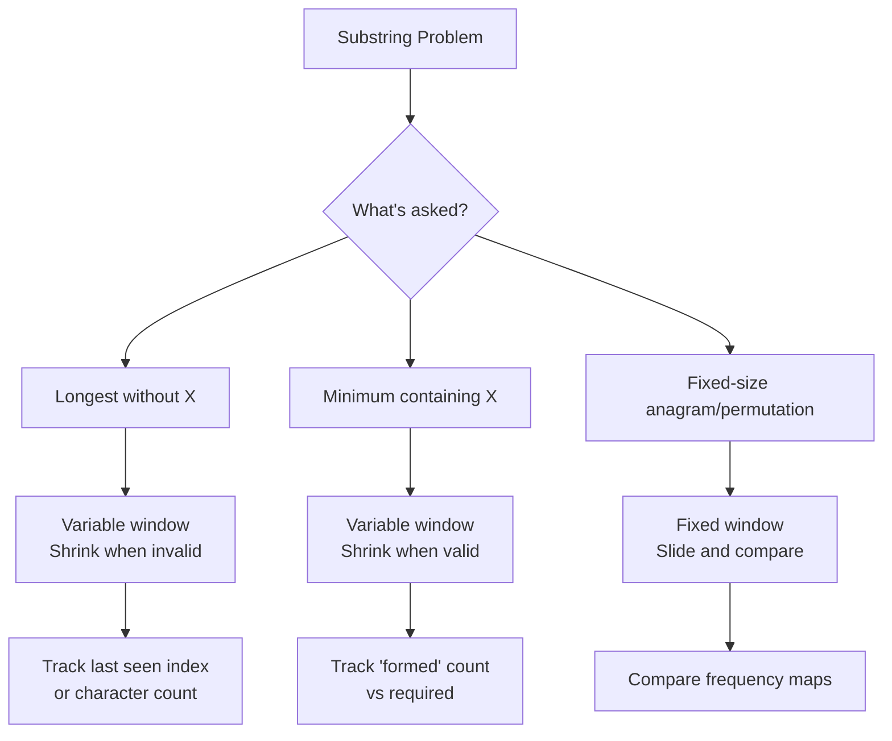

import { LanguageSelector, TimeEstimate, ConfidenceBuilder, DifficultyBadge } from '@site/src/components/interview-guide';
import { CodeTabs } from '@site/src/components/design-patterns/CodeTabs';
import TabItem from '@theme/TabItem';

# Substring Problems: Window + Hash Map

Most substring problems combine sliding window with hash maps for character counting. Once you see the pattern, the problems become variations of the same theme.

<LanguageSelector />

<TimeEstimate
  learnTime="30-40 minutes"
  practiceTime="4-5 hours"
  masteryTime="10-12 problems"
  interviewFrequency="20%"
  difficultyRange="Medium to Hard"
  prerequisites="Sliding Window, Hash Tables"
/>

---

## Pattern Overview



---

## Longest Substring Without Repeating Characters

**The classic.** Track last-seen index of each character.

<CodeTabs>
<TabItem value="python" label="Python">

```python
def length_of_longest_substring(s: str) -> int:
    """
    Find length of longest substring without repeating characters.
    Time: O(n), Space: O(min(n, alphabet_size))
    
    Key insight: When we see a repeat, jump start past the previous occurrence.
    """
    char_index: dict[str, int] = {}  # char -> last seen index
    max_length = 0
    start = 0
    
    for end, char in enumerate(s):
        # If char was seen and is within current window
        if char in char_index and char_index[char] >= start:
            # Move start past the previous occurrence
            start = char_index[char] + 1
        
        char_index[char] = end
        max_length = max(max_length, end - start + 1)
    
    return max_length
```

</TabItem>
<TabItem value="typescript" label="TypeScript">

```typescript
function lengthOfLongestSubstring(s: string): number {
  const charIndex: Map<string, number> = new Map();
  let maxLength = 0;
  let start = 0;

  for (let end = 0; end < s.length; end++) {
    const char = s[end];

    if (charIndex.has(char) && charIndex.get(char)! >= start) {
      start = charIndex.get(char)! + 1;
    }

    charIndex.set(char, end);
    maxLength = Math.max(maxLength, end - start + 1);
  }

  return maxLength;
}
```

</TabItem>
<TabItem value="go" label="Go">

```go
func lengthOfLongestSubstring(s string) int {
    charIndex := make(map[rune]int)
    maxLength := 0
    start := 0
    
    for end, char := range s {
        if idx, found := charIndex[char]; found && idx >= start {
            start = idx + 1
        }
        
        charIndex[char] = end
        if end-start+1 > maxLength {
            maxLength = end - start + 1
        }
    }
    
    return maxLength
}
```

</TabItem>
<TabItem value="java" label="Java">

```java
public int lengthOfLongestSubstring(String s) {
    Map<Character, Integer> charIndex = new HashMap<>();
    int maxLength = 0;
    int start = 0;
    
    for (int end = 0; end < s.length(); end++) {
        char c = s.charAt(end);
        
        if (charIndex.containsKey(c) && charIndex.get(c) >= start) {
            start = charIndex.get(c) + 1;
        }
        
        charIndex.put(c, end);
        maxLength = Math.max(maxLength, end - start + 1);
    }
    
    return maxLength;
}
```

</TabItem>
<TabItem value="cpp" label="C++">

```cpp
int lengthOfLongestSubstring(string s) {
    unordered_map<char, int> charIndex;
    int maxLength = 0;
    int start = 0;
    
    for (int end = 0; end < s.length(); end++) {
        char c = s[end];
        
        if (charIndex.count(c) && charIndex[c] >= start) {
            start = charIndex[c] + 1;
        }
        
        charIndex[c] = end;
        maxLength = max(maxLength, end - start + 1);
    }
    
    return maxLength;
}
```

</TabItem>
<TabItem value="csharp" label="C#">

```csharp
public int LengthOfLongestSubstring(string s) {
    Dictionary<char, int> charIndex = new();
    int maxLength = 0;
    int start = 0;
    
    for (int end = 0; end < s.Length; end++) {
        char c = s[end];
        
        if (charIndex.TryGetValue(c, out int idx) && idx >= start) {
            start = idx + 1;
        }
        
        charIndex[c] = end;
        maxLength = Math.Max(maxLength, end - start + 1);
    }
    
    return maxLength;
}
```

</TabItem>
</CodeTabs>

---

## Longest Substring with K Distinct Characters

Variable window that shrinks when we exceed K distinct characters.

<CodeTabs>
<TabItem value="python" label="Python">

```python
def longest_k_distinct(s: str, k: int) -> int:
    """
    Find longest substring with at most K distinct characters.
    Time: O(n), Space: O(k)
    """
    if k == 0:
        return 0
    
    char_count: dict[str, int] = {}
    max_length = 0
    start = 0
    
    for end, char in enumerate(s):
        char_count[char] = char_count.get(char, 0) + 1
        
        # Shrink window while we have more than k distinct chars
        while len(char_count) > k:
            left_char = s[start]
            char_count[left_char] -= 1
            if char_count[left_char] == 0:
                del char_count[left_char]
            start += 1
        
        max_length = max(max_length, end - start + 1)
    
    return max_length
```

</TabItem>
<TabItem value="typescript" label="TypeScript">

```typescript
function longestKDistinct(s: string, k: number): number {
  if (k === 0) return 0;

  const charCount: Map<string, number> = new Map();
  let maxLength = 0;
  let start = 0;

  for (let end = 0; end < s.length; end++) {
    const char = s[end];
    charCount.set(char, (charCount.get(char) || 0) + 1);

    while (charCount.size > k) {
      const leftChar = s[start];
      charCount.set(leftChar, charCount.get(leftChar)! - 1);
      if (charCount.get(leftChar) === 0) {
        charCount.delete(leftChar);
      }
      start++;
    }

    maxLength = Math.max(maxLength, end - start + 1);
  }

  return maxLength;
}
```

</TabItem>
<TabItem value="go" label="Go">

```go
func longestKDistinct(s string, k int) int {
    if k == 0 {
        return 0
    }
    
    charCount := make(map[rune]int)
    maxLength := 0
    start := 0
    runes := []rune(s)
    
    for end, char := range runes {
        charCount[char]++
        
        for len(charCount) > k {
            leftChar := runes[start]
            charCount[leftChar]--
            if charCount[leftChar] == 0 {
                delete(charCount, leftChar)
            }
            start++
        }
        
        if end-start+1 > maxLength {
            maxLength = end - start + 1
        }
    }
    
    return maxLength
}
```

</TabItem>
<TabItem value="java" label="Java">

```java
public int longestKDistinct(String s, int k) {
    if (k == 0) return 0;
    
    Map<Character, Integer> charCount = new HashMap<>();
    int maxLength = 0;
    int start = 0;
    
    for (int end = 0; end < s.length(); end++) {
        char c = s.charAt(end);
        charCount.put(c, charCount.getOrDefault(c, 0) + 1);
        
        while (charCount.size() > k) {
            char leftChar = s.charAt(start);
            charCount.put(leftChar, charCount.get(leftChar) - 1);
            if (charCount.get(leftChar) == 0) {
                charCount.remove(leftChar);
            }
            start++;
        }
        
        maxLength = Math.max(maxLength, end - start + 1);
    }
    
    return maxLength;
}
```

</TabItem>
<TabItem value="cpp" label="C++">

```cpp
int longestKDistinct(string s, int k) {
    if (k == 0) return 0;
    
    unordered_map<char, int> charCount;
    int maxLength = 0;
    int start = 0;
    
    for (int end = 0; end < s.length(); end++) {
        charCount[s[end]]++;
        
        while (charCount.size() > k) {
            char leftChar = s[start];
            charCount[leftChar]--;
            if (charCount[leftChar] == 0) {
                charCount.erase(leftChar);
            }
            start++;
        }
        
        maxLength = max(maxLength, end - start + 1);
    }
    
    return maxLength;
}
```

</TabItem>
<TabItem value="csharp" label="C#">

```csharp
public int LongestKDistinct(string s, int k) {
    if (k == 0) return 0;
    
    Dictionary<char, int> charCount = new();
    int maxLength = 0;
    int start = 0;
    
    for (int end = 0; end < s.Length; end++) {
        char c = s[end];
        charCount[c] = charCount.GetValueOrDefault(c, 0) + 1;
        
        while (charCount.Count > k) {
            char leftChar = s[start];
            charCount[leftChar]--;
            if (charCount[leftChar] == 0) {
                charCount.Remove(leftChar);
            }
            start++;
        }
        
        maxLength = Math.Max(maxLength, end - start + 1);
    }
    
    return maxLength;
}
```

</TabItem>
</CodeTabs>

---

## Minimum Window Substring

Find the minimum window in `s` that contains all characters of `t`. **The hardest sliding window problem.**

<CodeTabs>
<TabItem value="python" label="Python">

```python
from collections import Counter

def min_window(s: str, t: str) -> str:
    """
    Find minimum window in s containing all characters of t.
    Time: O(m + n), Space: O(m + n) where m = len(s), n = len(t)
    
    Key insight: Track how many target chars are "formed" (have required count).
    """
    if not s or not t or len(s) < len(t):
        return ""
    
    # Count required characters
    target_count = Counter(t)
    required = len(target_count)  # Number of unique chars needed
    
    # Window state
    window_count: dict[str, int] = {}
    formed = 0  # How many unique chars have required count
    
    # Result: (length, left, right)
    result = (float('inf'), 0, 0)
    left = 0
    
    for right, char in enumerate(s):
        # Expand: add character to window
        window_count[char] = window_count.get(char, 0) + 1
        
        # Check if this char reaches its target count
        if char in target_count and window_count[char] == target_count[char]:
            formed += 1
        
        # Contract: shrink window while valid
        while formed == required:
            # Update result if this window is smaller
            if right - left + 1 < result[0]:
                result = (right - left + 1, left, right)
            
            # Remove left char from window
            left_char = s[left]
            window_count[left_char] -= 1
            
            if left_char in target_count and window_count[left_char] < target_count[left_char]:
                formed -= 1
            
            left += 1
    
    return "" if result[0] == float('inf') else s[result[1]:result[2] + 1]
```

</TabItem>
<TabItem value="typescript" label="TypeScript">

```typescript
function minWindow(s: string, t: string): string {
  if (!s || !t || s.length < t.length) return "";

  const targetCount: Map<string, number> = new Map();
  for (const char of t) {
    targetCount.set(char, (targetCount.get(char) || 0) + 1);
  }
  const required = targetCount.size;

  const windowCount: Map<string, number> = new Map();
  let formed = 0;
  let result: [number, number, number] = [Infinity, 0, 0];
  let left = 0;

  for (let right = 0; right < s.length; right++) {
    const char = s[right];
    windowCount.set(char, (windowCount.get(char) || 0) + 1);

    if (targetCount.has(char) && windowCount.get(char) === targetCount.get(char)) {
      formed++;
    }

    while (formed === required) {
      if (right - left + 1 < result[0]) {
        result = [right - left + 1, left, right];
      }

      const leftChar = s[left];
      windowCount.set(leftChar, windowCount.get(leftChar)! - 1);

      if (targetCount.has(leftChar) && windowCount.get(leftChar)! < targetCount.get(leftChar)!) {
        formed--;
      }

      left++;
    }
  }

  return result[0] === Infinity ? "" : s.slice(result[1], result[2] + 1);
}
```

</TabItem>
<TabItem value="go" label="Go">

```go
func minWindow(s string, t string) string {
    if len(s) == 0 || len(t) == 0 || len(s) < len(t) {
        return ""
    }
    
    targetCount := make(map[byte]int)
    for i := 0; i < len(t); i++ {
        targetCount[t[i]]++
    }
    required := len(targetCount)
    
    windowCount := make(map[byte]int)
    formed := 0
    resultLen, resultLeft := len(s)+1, 0
    left := 0
    
    for right := 0; right < len(s); right++ {
        char := s[right]
        windowCount[char]++
        
        if cnt, ok := targetCount[char]; ok && windowCount[char] == cnt {
            formed++
        }
        
        for formed == required {
            if right-left+1 < resultLen {
                resultLen = right - left + 1
                resultLeft = left
            }
            
            leftChar := s[left]
            windowCount[leftChar]--
            
            if cnt, ok := targetCount[leftChar]; ok && windowCount[leftChar] < cnt {
                formed--
            }
            
            left++
        }
    }
    
    if resultLen > len(s) {
        return ""
    }
    return s[resultLeft : resultLeft+resultLen]
}
```

</TabItem>
<TabItem value="java" label="Java">

```java
public String minWindow(String s, String t) {
    if (s == null || t == null || s.length() < t.length()) return "";
    
    Map<Character, Integer> targetCount = new HashMap<>();
    for (char c : t.toCharArray()) {
        targetCount.put(c, targetCount.getOrDefault(c, 0) + 1);
    }
    int required = targetCount.size();
    
    Map<Character, Integer> windowCount = new HashMap<>();
    int formed = 0;
    int[] result = {Integer.MAX_VALUE, 0, 0}; // length, left, right
    int left = 0;
    
    for (int right = 0; right < s.length(); right++) {
        char c = s.charAt(right);
        windowCount.put(c, windowCount.getOrDefault(c, 0) + 1);
        
        if (targetCount.containsKey(c) && 
            windowCount.get(c).equals(targetCount.get(c))) {
            formed++;
        }
        
        while (formed == required) {
            if (right - left + 1 < result[0]) {
                result[0] = right - left + 1;
                result[1] = left;
                result[2] = right;
            }
            
            char leftChar = s.charAt(left);
            windowCount.put(leftChar, windowCount.get(leftChar) - 1);
            
            if (targetCount.containsKey(leftChar) && 
                windowCount.get(leftChar) < targetCount.get(leftChar)) {
                formed--;
            }
            
            left++;
        }
    }
    
    return result[0] == Integer.MAX_VALUE ? "" : 
           s.substring(result[1], result[2] + 1);
}
```

</TabItem>
<TabItem value="cpp" label="C++">

```cpp
string minWindow(string s, string t) {
    if (s.empty() || t.empty() || s.length() < t.length()) return "";
    
    unordered_map<char, int> targetCount;
    for (char c : t) targetCount[c]++;
    int required = targetCount.size();
    
    unordered_map<char, int> windowCount;
    int formed = 0;
    int resultLen = INT_MAX, resultLeft = 0;
    int left = 0;
    
    for (int right = 0; right < s.length(); right++) {
        char c = s[right];
        windowCount[c]++;
        
        if (targetCount.count(c) && windowCount[c] == targetCount[c]) {
            formed++;
        }
        
        while (formed == required) {
            if (right - left + 1 < resultLen) {
                resultLen = right - left + 1;
                resultLeft = left;
            }
            
            char leftChar = s[left];
            windowCount[leftChar]--;
            
            if (targetCount.count(leftChar) && 
                windowCount[leftChar] < targetCount[leftChar]) {
                formed--;
            }
            
            left++;
        }
    }
    
    return resultLen == INT_MAX ? "" : s.substr(resultLeft, resultLen);
}
```

</TabItem>
<TabItem value="csharp" label="C#">

```csharp
public string MinWindow(string s, string t) {
    if (string.IsNullOrEmpty(s) || string.IsNullOrEmpty(t) || s.Length < t.Length)
        return "";
    
    Dictionary<char, int> targetCount = new();
    foreach (char c in t) {
        targetCount[c] = targetCount.GetValueOrDefault(c, 0) + 1;
    }
    int required = targetCount.Count;
    
    Dictionary<char, int> windowCount = new();
    int formed = 0;
    (int len, int left, int right) result = (int.MaxValue, 0, 0);
    int l = 0;
    
    for (int r = 0; r < s.Length; r++) {
        char c = s[r];
        windowCount[c] = windowCount.GetValueOrDefault(c, 0) + 1;
        
        if (targetCount.ContainsKey(c) && windowCount[c] == targetCount[c]) {
            formed++;
        }
        
        while (formed == required) {
            if (r - l + 1 < result.len) {
                result = (r - l + 1, l, r);
            }
            
            char leftChar = s[l];
            windowCount[leftChar]--;
            
            if (targetCount.ContainsKey(leftChar) && 
                windowCount[leftChar] < targetCount[leftChar]) {
                formed--;
            }
            
            l++;
        }
    }
    
    return result.len == int.MaxValue ? "" : s.Substring(result.left, result.len);
}
```

</TabItem>
</CodeTabs>

<ConfidenceBuilder type="remember" title="The 'formed' Variable is Key">

Don't compare the entire frequency map each iteration—that's O(26) or O(n). Instead, track `formed` count: increment when a character reaches its target count, decrement when it falls below. This keeps each comparison O(1).

</ConfidenceBuilder>

---

## Find All Anagrams

Find all starting indices where an anagram of `p` exists in `s`.

<CodeTabs>
<TabItem value="python" label="Python">

```python
from collections import Counter

def find_anagrams(s: str, p: str) -> list[int]:
    """
    Find all starting indices of p's anagrams in s.
    Uses fixed-size sliding window.
    Time: O(n), Space: O(1) - alphabet is bounded
    """
    if len(p) > len(s):
        return []
    
    p_count = Counter(p)
    window_count = Counter(s[:len(p)])
    result: list[int] = []
    
    if window_count == p_count:
        result.append(0)
    
    for i in range(len(p), len(s)):
        # Add new character
        new_char = s[i]
        window_count[new_char] += 1
        
        # Remove old character
        old_char = s[i - len(p)]
        window_count[old_char] -= 1
        if window_count[old_char] == 0:
            del window_count[old_char]
        
        # Check if anagram
        if window_count == p_count:
            result.append(i - len(p) + 1)
    
    return result
```

</TabItem>
<TabItem value="typescript" label="TypeScript">

```typescript
function findAnagrams(s: string, p: string): number[] {
  if (p.length > s.length) return [];

  const pCount: Map<string, number> = new Map();
  const windowCount: Map<string, number> = new Map();

  for (const char of p) {
    pCount.set(char, (pCount.get(char) || 0) + 1);
  }

  for (let i = 0; i < p.length; i++) {
    windowCount.set(s[i], (windowCount.get(s[i]) || 0) + 1);
  }

  const result: number[] = [];

  const mapsEqual = (a: Map<string, number>, b: Map<string, number>): boolean => {
    if (a.size !== b.size) return false;
    for (const [k, v] of a) {
      if (b.get(k) !== v) return false;
    }
    return true;
  };

  if (mapsEqual(windowCount, pCount)) result.push(0);

  for (let i = p.length; i < s.length; i++) {
    windowCount.set(s[i], (windowCount.get(s[i]) || 0) + 1);

    const oldChar = s[i - p.length];
    windowCount.set(oldChar, windowCount.get(oldChar)! - 1);
    if (windowCount.get(oldChar) === 0) windowCount.delete(oldChar);

    if (mapsEqual(windowCount, pCount)) result.push(i - p.length + 1);
  }

  return result;
}
```

</TabItem>
<TabItem value="go" label="Go">

```go
func findAnagrams(s string, p string) []int {
    if len(p) > len(s) {
        return []int{}
    }
    
    pCount := make(map[byte]int)
    windowCount := make(map[byte]int)
    
    for i := 0; i < len(p); i++ {
        pCount[p[i]]++
        windowCount[s[i]]++
    }
    
    result := []int{}
    
    mapsEqual := func() bool {
        if len(pCount) != len(windowCount) {
            return false
        }
        for k, v := range pCount {
            if windowCount[k] != v {
                return false
            }
        }
        return true
    }
    
    if mapsEqual() {
        result = append(result, 0)
    }
    
    for i := len(p); i < len(s); i++ {
        windowCount[s[i]]++
        
        oldChar := s[i-len(p)]
        windowCount[oldChar]--
        if windowCount[oldChar] == 0 {
            delete(windowCount, oldChar)
        }
        
        if mapsEqual() {
            result = append(result, i-len(p)+1)
        }
    }
    
    return result
}
```

</TabItem>
<TabItem value="java" label="Java">

```java
public List<Integer> findAnagrams(String s, String p) {
    List<Integer> result = new ArrayList<>();
    if (p.length() > s.length()) return result;
    
    Map<Character, Integer> pCount = new HashMap<>();
    Map<Character, Integer> windowCount = new HashMap<>();
    
    for (char c : p.toCharArray()) {
        pCount.put(c, pCount.getOrDefault(c, 0) + 1);
    }
    
    for (int i = 0; i < p.length(); i++) {
        char c = s.charAt(i);
        windowCount.put(c, windowCount.getOrDefault(c, 0) + 1);
    }
    
    if (windowCount.equals(pCount)) result.add(0);
    
    for (int i = p.length(); i < s.length(); i++) {
        char newChar = s.charAt(i);
        windowCount.put(newChar, windowCount.getOrDefault(newChar, 0) + 1);
        
        char oldChar = s.charAt(i - p.length());
        windowCount.put(oldChar, windowCount.get(oldChar) - 1);
        if (windowCount.get(oldChar) == 0) {
            windowCount.remove(oldChar);
        }
        
        if (windowCount.equals(pCount)) {
            result.add(i - p.length() + 1);
        }
    }
    
    return result;
}
```

</TabItem>
<TabItem value="cpp" label="C++">

```cpp
vector<int> findAnagrams(string s, string p) {
    vector<int> result;
    if (p.length() > s.length()) return result;
    
    unordered_map<char, int> pCount, windowCount;
    
    for (char c : p) pCount[c]++;
    for (int i = 0; i < p.length(); i++) windowCount[s[i]]++;
    
    if (windowCount == pCount) result.push_back(0);
    
    for (int i = p.length(); i < s.length(); i++) {
        windowCount[s[i]]++;
        
        char oldChar = s[i - p.length()];
        windowCount[oldChar]--;
        if (windowCount[oldChar] == 0) {
            windowCount.erase(oldChar);
        }
        
        if (windowCount == pCount) {
            result.push_back(i - p.length() + 1);
        }
    }
    
    return result;
}
```

</TabItem>
<TabItem value="csharp" label="C#">

```csharp
public IList<int> FindAnagrams(string s, string p) {
    List<int> result = new();
    if (p.Length > s.Length) return result;
    
    Dictionary<char, int> pCount = new();
    Dictionary<char, int> windowCount = new();
    
    foreach (char c in p) {
        pCount[c] = pCount.GetValueOrDefault(c, 0) + 1;
    }
    
    for (int i = 0; i < p.Length; i++) {
        windowCount[s[i]] = windowCount.GetValueOrDefault(s[i], 0) + 1;
    }
    
    bool DictsEqual() {
        if (pCount.Count != windowCount.Count) return false;
        foreach (var (k, v) in pCount) {
            if (!windowCount.TryGetValue(k, out int wv) || wv != v) return false;
        }
        return true;
    }
    
    if (DictsEqual()) result.Add(0);
    
    for (int i = p.Length; i < s.Length; i++) {
        windowCount[s[i]] = windowCount.GetValueOrDefault(s[i], 0) + 1;
        
        char oldChar = s[i - p.Length];
        windowCount[oldChar]--;
        if (windowCount[oldChar] == 0) windowCount.Remove(oldChar);
        
        if (DictsEqual()) result.Add(i - p.Length + 1);
    }
    
    return result;
}
```

</TabItem>
</CodeTabs>

---

## Longest Repeating Character Replacement

Find longest substring where you can replace at most `k` characters to make all same.

<CodeTabs>
<TabItem value="python" label="Python">

```python
def character_replacement(s: str, k: int) -> int:
    """
    Longest substring with same chars after at most k replacements.
    Time: O(n), Space: O(26) = O(1)
    
    Key insight: Window is valid if (window_size - max_freq) <= k
    """
    char_count: dict[str, int] = {}
    max_freq = 0  # Max frequency of any single char in current window
    max_length = 0
    left = 0
    
    for right, char in enumerate(s):
        char_count[char] = char_count.get(char, 0) + 1
        max_freq = max(max_freq, char_count[char])
        
        window_size = right - left + 1
        
        # If we need more than k replacements, shrink window
        if window_size - max_freq > k:
            char_count[s[left]] -= 1
            left += 1
        
        max_length = max(max_length, right - left + 1)
    
    return max_length
```

</TabItem>
<TabItem value="typescript" label="TypeScript">

```typescript
function characterReplacement(s: string, k: number): number {
  const charCount: Map<string, number> = new Map();
  let maxFreq = 0;
  let maxLength = 0;
  let left = 0;

  for (let right = 0; right < s.length; right++) {
    const char = s[right];
    charCount.set(char, (charCount.get(char) || 0) + 1);
    maxFreq = Math.max(maxFreq, charCount.get(char)!);

    const windowSize = right - left + 1;

    if (windowSize - maxFreq > k) {
      charCount.set(s[left], charCount.get(s[left])! - 1);
      left++;
    }

    maxLength = Math.max(maxLength, right - left + 1);
  }

  return maxLength;
}
```

</TabItem>
<TabItem value="go" label="Go">

```go
func characterReplacement(s string, k int) int {
    charCount := make(map[byte]int)
    maxFreq := 0
    maxLength := 0
    left := 0
    
    for right := 0; right < len(s); right++ {
        charCount[s[right]]++
        if charCount[s[right]] > maxFreq {
            maxFreq = charCount[s[right]]
        }
        
        windowSize := right - left + 1
        
        if windowSize-maxFreq > k {
            charCount[s[left]]--
            left++
        }
        
        if right-left+1 > maxLength {
            maxLength = right - left + 1
        }
    }
    
    return maxLength
}
```

</TabItem>
<TabItem value="java" label="Java">

```java
public int characterReplacement(String s, int k) {
    Map<Character, Integer> charCount = new HashMap<>();
    int maxFreq = 0;
    int maxLength = 0;
    int left = 0;
    
    for (int right = 0; right < s.length(); right++) {
        char c = s.charAt(right);
        charCount.put(c, charCount.getOrDefault(c, 0) + 1);
        maxFreq = Math.max(maxFreq, charCount.get(c));
        
        int windowSize = right - left + 1;
        
        if (windowSize - maxFreq > k) {
            char leftChar = s.charAt(left);
            charCount.put(leftChar, charCount.get(leftChar) - 1);
            left++;
        }
        
        maxLength = Math.max(maxLength, right - left + 1);
    }
    
    return maxLength;
}
```

</TabItem>
<TabItem value="cpp" label="C++">

```cpp
int characterReplacement(string s, int k) {
    unordered_map<char, int> charCount;
    int maxFreq = 0;
    int maxLength = 0;
    int left = 0;
    
    for (int right = 0; right < s.length(); right++) {
        charCount[s[right]]++;
        maxFreq = max(maxFreq, charCount[s[right]]);
        
        int windowSize = right - left + 1;
        
        if (windowSize - maxFreq > k) {
            charCount[s[left]]--;
            left++;
        }
        
        maxLength = max(maxLength, right - left + 1);
    }
    
    return maxLength;
}
```

</TabItem>
<TabItem value="csharp" label="C#">

```csharp
public int CharacterReplacement(string s, int k) {
    Dictionary<char, int> charCount = new();
    int maxFreq = 0;
    int maxLength = 0;
    int left = 0;
    
    for (int right = 0; right < s.Length; right++) {
        char c = s[right];
        charCount[c] = charCount.GetValueOrDefault(c, 0) + 1;
        maxFreq = Math.Max(maxFreq, charCount[c]);
        
        int windowSize = right - left + 1;
        
        if (windowSize - maxFreq > k) {
            charCount[s[left]]--;
            left++;
        }
        
        maxLength = Math.Max(maxLength, right - left + 1);
    }
    
    return maxLength;
}
```

</TabItem>
</CodeTabs>

---

## 🎯 Pattern Triggers

| Problem Clue | Approach |
|--------------|----------|
| "Longest substring without X" | Variable window, shrink when invalid |
| "Minimum substring containing X" | Variable window, shrink when valid |
| "Find all anagrams/permutations" | Fixed window, compare maps |
| "At most K distinct" | Variable window, count distinct |
| "Replace at most K" | `window_size - max_freq <= k` |

---

## 💬 How to Communicate

**Explaining the window approach:**
> "I'll use a sliding window with a hash map to track character frequencies. I'll expand the right pointer to grow the window, and contract the left pointer when my condition is violated..."

**For minimum window:**
> "I need to track how many target characters are 'formed'—meaning they've reached their required count. When all are formed, I try to shrink the window to find the minimum..."

---

## 🏋️ Practice Problems

| Problem | Difficulty | Pattern |
|---------|------------|---------|
| [Longest Substring Without Repeat](https://leetcode.com/problems/longest-substring-without-repeating-characters/) | <DifficultyBadge level="medium" /> | Last-seen index |
| [Minimum Window Substring](https://leetcode.com/problems/minimum-window-substring/) | <DifficultyBadge level="hard" /> | Formed count |
| [Find All Anagrams](https://leetcode.com/problems/find-all-anagrams-in-a-string/) | <DifficultyBadge level="medium" /> | Fixed window |
| [Permutation in String](https://leetcode.com/problems/permutation-in-string/) | <DifficultyBadge level="medium" /> | Fixed window |
| [Longest Repeating Char Replacement](https://leetcode.com/problems/longest-repeating-character-replacement/) | <DifficultyBadge level="medium" /> | Max freq |
| [Fruit Into Baskets](https://leetcode.com/problems/fruit-into-baskets/) | <DifficultyBadge level="medium" /> | K distinct (k=2) |

---

## Key Takeaways

1. **Sliding window + hash map** is the core pattern for substring problems.

2. **Variable window:** Expand right, shrink left based on validity condition.

3. **Fixed window:** Initialize window, then slide by adding/removing one char at a time.

4. **Track "formed" count** for problems like minimum window substring.

5. **Delete zero-count keys** to make map comparisons work correctly.

<ConfidenceBuilder type="youve-got-this">

**Substring problems are variations of one pattern.**

Once you understand window + hash map, you can adapt to any variant. The key variables change (last-seen index, formed count, max frequency), but the structure stays the same.

</ConfidenceBuilder>

---

## What's Next?

More string patterns:

**See also:** [Palindrome Problems](/docs/interview-guide/coding/patterns/string-patterns/palindrome) — Symmetry Mastery
