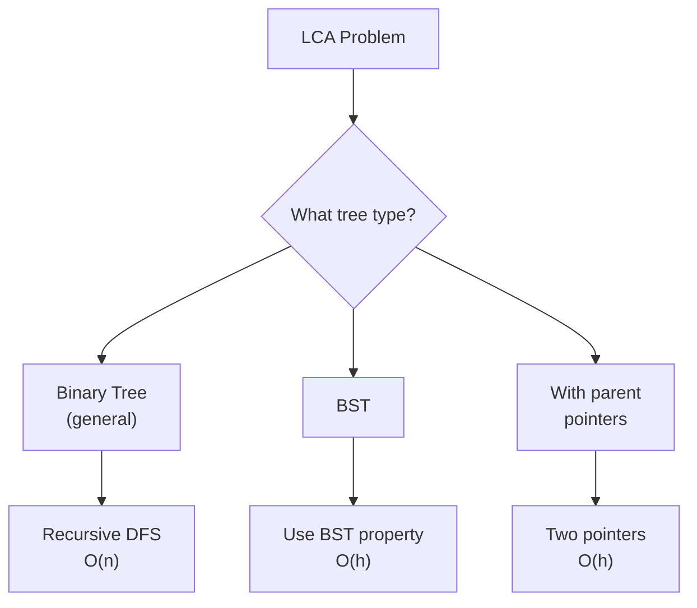

import { LanguageSelector, TimeEstimate, ConfidenceBuilder, DifficultyBadge } from '@site/src/components/interview-guide';
import { CodeTabs } from '@site/src/components/design-patterns/CodeTabs';
import TabItem from '@theme/TabItem';

# Lowest Common Ancestor: Find the Meeting Point

LCA is the **deepest node** that is an **ancestor of both** given nodes.

```
        3
       / \
      5   1
     /|   |\
    6 2   0 8
     / \
    7   4

LCA(5, 1) = 3  (root is ancestor of both)
LCA(5, 4) = 5  (5 is ancestor of 4, and ancestor of itself)
LCA(6, 4) = 5  (5 is common ancestor)
```

<LanguageSelector />

<TimeEstimate
  learnTime="20-25 minutes"
  practiceTime="2-3 hours"
  masteryTime="6-8 problems"
  interviewFrequency="25%"
  difficultyRange="Medium"
  prerequisites="Tree Traversal, Recursion"
/>

---

## Three Variations



---

## Binary Tree LCA (General)

This is the most common version. The tree has no special properties.

<CodeTabs>
<TabItem value="python" label="Python">

```python
class TreeNode:
    def __init__(self, val=0, left=None, right=None):
        self.val = val
        self.left = left
        self.right = right


def lowest_common_ancestor(
    root: TreeNode | None, 
    p: TreeNode, 
    q: TreeNode
) -> TreeNode | None:
    """
    Find LCA in a binary tree.
    
    Key insight: If p and q are on different sides of a node,
    that node is the LCA.
    
    Returns:
    - p if found (q might be in its subtree)
    - q if found (p might be in its subtree)  
    - root if p and q are on different sides
    - None if neither found
    
    Time: O(n), Space: O(h) for recursion
    """
    # Base case: reached leaf, or found p or q
    if not root or root == p or root == q:
        return root
    
    # Search in left and right subtrees
    left = lowest_common_ancestor(root.left, p, q)
    right = lowest_common_ancestor(root.right, p, q)
    
    # If both sides return non-null, root is LCA
    if left and right:
        return root
    
    # Otherwise, return whichever side found something
    return left or right
```

</TabItem>
<TabItem value="typescript" label="TypeScript">

```typescript
class TreeNode {
  val: number;
  left: TreeNode | null;
  right: TreeNode | null;

  constructor(val = 0, left: TreeNode | null = null, right: TreeNode | null = null) {
    this.val = val;
    this.left = left;
    this.right = right;
  }
}

function lowestCommonAncestor(
  root: TreeNode | null,
  p: TreeNode,
  q: TreeNode
): TreeNode | null {
  if (!root || root === p || root === q) {
    return root;
  }

  const left = lowestCommonAncestor(root.left, p, q);
  const right = lowestCommonAncestor(root.right, p, q);

  if (left && right) {
    return root;
  }

  return left || right;
}
```

</TabItem>
<TabItem value="go" label="Go">

```go
type TreeNode struct {
    Val   int
    Left  *TreeNode
    Right *TreeNode
}

func lowestCommonAncestor(root, p, q *TreeNode) *TreeNode {
    if root == nil || root == p || root == q {
        return root
    }
    
    left := lowestCommonAncestor(root.Left, p, q)
    right := lowestCommonAncestor(root.Right, p, q)
    
    if left != nil && right != nil {
        return root
    }
    
    if left != nil {
        return left
    }
    return right
}
```

</TabItem>
<TabItem value="java" label="Java">

```java
public TreeNode lowestCommonAncestor(TreeNode root, TreeNode p, TreeNode q) {
    if (root == null || root == p || root == q) {
        return root;
    }
    
    TreeNode left = lowestCommonAncestor(root.left, p, q);
    TreeNode right = lowestCommonAncestor(root.right, p, q);
    
    if (left != null && right != null) {
        return root;
    }
    
    return left != null ? left : right;
}
```

</TabItem>
<TabItem value="cpp" label="C++">

```cpp
TreeNode* lowestCommonAncestor(TreeNode* root, TreeNode* p, TreeNode* q) {
    if (!root || root == p || root == q) {
        return root;
    }
    
    TreeNode* left = lowestCommonAncestor(root->left, p, q);
    TreeNode* right = lowestCommonAncestor(root->right, p, q);
    
    if (left && right) {
        return root;
    }
    
    return left ? left : right;
}
```

</TabItem>
<TabItem value="c" label="C">

```c
struct TreeNode* lowestCommonAncestor(struct TreeNode* root, 
                                       struct TreeNode* p, 
                                       struct TreeNode* q) {
    if (!root || root == p || root == q) {
        return root;
    }
    
    struct TreeNode* left = lowestCommonAncestor(root->left, p, q);
    struct TreeNode* right = lowestCommonAncestor(root->right, p, q);
    
    if (left && right) {
        return root;
    }
    
    return left ? left : right;
}
```

</TabItem>
<TabItem value="csharp" label="C#">

```csharp
public TreeNode LowestCommonAncestor(TreeNode root, TreeNode p, TreeNode q) {
    if (root == null || root == p || root == q) {
        return root;
    }
    
    TreeNode left = LowestCommonAncestor(root.left, p, q);
    TreeNode right = LowestCommonAncestor(root.right, p, q);
    
    if (left != null && right != null) {
        return root;
    }
    
    return left ?? right;
}
```

</TabItem>
</CodeTabs>

<ConfidenceBuilder type="remember" title="Why This Works">

The recursion returns the first node it finds (p, q, or null). If both children return non-null, it means p and q are on different sides—so the current node is the LCA.

If only one side returns non-null, either:
- That side found the LCA (both p and q in that subtree)
- That side found one node, and we're still looking for the other (will be handled by ancestor)

</ConfidenceBuilder>

---

## BST LCA (Optimized)

For BSTs, we can use the BST property to find LCA in O(h) time.

<CodeTabs>
<TabItem value="python" label="Python">

```python
def lca_bst(root: TreeNode | None, p: TreeNode, q: TreeNode) -> TreeNode | None:
    """
    Find LCA in a BST.
    
    Use BST property:
    - If both p and q are smaller, go left
    - If both p and q are larger, go right
    - Otherwise, we're at the split point (LCA)
    
    Time: O(h), Space: O(1)
    """
    while root:
        if p.val < root.val and q.val < root.val:
            # Both in left subtree
            root = root.left
        elif p.val > root.val and q.val > root.val:
            # Both in right subtree
            root = root.right
        else:
            # Split point: p and q on different sides (or one equals root)
            return root
    
    return None
```

</TabItem>
<TabItem value="typescript" label="TypeScript">

```typescript
function lcaBST(root: TreeNode | null, p: TreeNode, q: TreeNode): TreeNode | null {
  while (root) {
    if (p.val < root.val && q.val < root.val) {
      root = root.left;
    } else if (p.val > root.val && q.val > root.val) {
      root = root.right;
    } else {
      return root;
    }
  }
  return null;
}
```

</TabItem>
<TabItem value="go" label="Go">

```go
func lcaBST(root, p, q *TreeNode) *TreeNode {
    for root != nil {
        if p.Val < root.Val && q.Val < root.Val {
            root = root.Left
        } else if p.Val > root.Val && q.Val > root.Val {
            root = root.Right
        } else {
            return root
        }
    }
    return nil
}
```

</TabItem>
<TabItem value="java" label="Java">

```java
public TreeNode lcaBST(TreeNode root, TreeNode p, TreeNode q) {
    while (root != null) {
        if (p.val < root.val && q.val < root.val) {
            root = root.left;
        } else if (p.val > root.val && q.val > root.val) {
            root = root.right;
        } else {
            return root;
        }
    }
    return null;
}
```

</TabItem>
<TabItem value="cpp" label="C++">

```cpp
TreeNode* lcaBST(TreeNode* root, TreeNode* p, TreeNode* q) {
    while (root) {
        if (p->val < root->val && q->val < root->val) {
            root = root->left;
        } else if (p->val > root->val && q->val > root->val) {
            root = root->right;
        } else {
            return root;
        }
    }
    return nullptr;
}
```

</TabItem>
<TabItem value="c" label="C">

```c
struct TreeNode* lcaBST(struct TreeNode* root, 
                         struct TreeNode* p, 
                         struct TreeNode* q) {
    while (root) {
        if (p->val < root->val && q->val < root->val) {
            root = root->left;
        } else if (p->val > root->val && q->val > root->val) {
            root = root->right;
        } else {
            return root;
        }
    }
    return NULL;
}
```

</TabItem>
<TabItem value="csharp" label="C#">

```csharp
public TreeNode LcaBST(TreeNode root, TreeNode p, TreeNode q) {
    while (root != null) {
        if (p.val < root.val && q.val < root.val) {
            root = root.left;
        } else if (p.val > root.val && q.val > root.val) {
            root = root.right;
        } else {
            return root;
        }
    }
    return null;
}
```

</TabItem>
</CodeTabs>

---

## LCA with Parent Pointers

When nodes have parent pointers, treat it like finding intersection of two linked lists.

<CodeTabs>
<TabItem value="python" label="Python">

```python
class Node:
    def __init__(self, val=0, left=None, right=None, parent=None):
        self.val = val
        self.left = left
        self.right = right
        self.parent = parent


def lca_with_parent(p: Node, q: Node) -> Node | None:
    """
    Find LCA when nodes have parent pointers.
    
    Approach 1: Store ancestors of p, then traverse q's ancestors.
    Time: O(h), Space: O(h)
    """
    ancestors: set[Node] = set()
    
    # Store all ancestors of p
    while p:
        ancestors.add(p)
        p = p.parent
    
    # Find first common ancestor in q's path
    while q:
        if q in ancestors:
            return q
        q = q.parent
    
    return None


def lca_with_parent_two_pointer(p: Node, q: Node) -> Node | None:
    """
    Two-pointer approach (like linked list intersection).
    Time: O(h), Space: O(1)
    """
    a, b = p, q
    
    while a != b:
        # When reaching root (null), switch to other node's start
        a = a.parent if a else q
        b = b.parent if b else p
    
    return a
```

</TabItem>
<TabItem value="typescript" label="TypeScript">

```typescript
class NodeWithParent {
  val: number;
  left: NodeWithParent | null;
  right: NodeWithParent | null;
  parent: NodeWithParent | null;

  constructor(val = 0) {
    this.val = val;
    this.left = null;
    this.right = null;
    this.parent = null;
  }
}

function lcaWithParent(p: NodeWithParent, q: NodeWithParent): NodeWithParent | null {
  const ancestors: Set<NodeWithParent> = new Set();

  let curr: NodeWithParent | null = p;
  while (curr) {
    ancestors.add(curr);
    curr = curr.parent;
  }

  curr = q;
  while (curr) {
    if (ancestors.has(curr)) {
      return curr;
    }
    curr = curr.parent;
  }

  return null;
}

function lcaWithParentTwoPointer(
  p: NodeWithParent | null,
  q: NodeWithParent | null
): NodeWithParent | null {
  let a = p;
  let b = q;

  while (a !== b) {
    a = a ? a.parent : q;
    b = b ? b.parent : p;
  }

  return a;
}
```

</TabItem>
<TabItem value="go" label="Go">

```go
type NodeWithParent struct {
    Val    int
    Left   *NodeWithParent
    Right  *NodeWithParent
    Parent *NodeWithParent
}

func lcaWithParent(p, q *NodeWithParent) *NodeWithParent {
    ancestors := make(map[*NodeWithParent]bool)
    
    for p != nil {
        ancestors[p] = true
        p = p.Parent
    }
    
    for q != nil {
        if ancestors[q] {
            return q
        }
        q = q.Parent
    }
    
    return nil
}

func lcaWithParentTwoPointer(p, q *NodeWithParent) *NodeWithParent {
    a, b := p, q
    
    for a != b {
        if a != nil {
            a = a.Parent
        } else {
            a = q
        }
        if b != nil {
            b = b.Parent
        } else {
            b = p
        }
    }
    
    return a
}
```

</TabItem>
<TabItem value="java" label="Java">

```java
class NodeWithParent {
    int val;
    NodeWithParent left, right, parent;
    NodeWithParent(int val) { this.val = val; }
}

public NodeWithParent lcaWithParent(NodeWithParent p, NodeWithParent q) {
    Set<NodeWithParent> ancestors = new HashSet<>();
    
    while (p != null) {
        ancestors.add(p);
        p = p.parent;
    }
    
    while (q != null) {
        if (ancestors.contains(q)) {
            return q;
        }
        q = q.parent;
    }
    
    return null;
}

public NodeWithParent lcaWithParentTwoPointer(NodeWithParent p, NodeWithParent q) {
    NodeWithParent a = p, b = q;
    
    while (a != b) {
        a = (a != null) ? a.parent : q;
        b = (b != null) ? b.parent : p;
    }
    
    return a;
}
```

</TabItem>
<TabItem value="cpp" label="C++">

```cpp
struct NodeWithParent {
    int val;
    NodeWithParent* left;
    NodeWithParent* right;
    NodeWithParent* parent;
    NodeWithParent(int x) : val(x), left(nullptr), right(nullptr), parent(nullptr) {}
};

NodeWithParent* lcaWithParent(NodeWithParent* p, NodeWithParent* q) {
    unordered_set<NodeWithParent*> ancestors;
    
    while (p) {
        ancestors.insert(p);
        p = p->parent;
    }
    
    while (q) {
        if (ancestors.count(q)) {
            return q;
        }
        q = q->parent;
    }
    
    return nullptr;
}

NodeWithParent* lcaWithParentTwoPointer(NodeWithParent* p, NodeWithParent* q) {
    NodeWithParent* a = p;
    NodeWithParent* b = q;
    
    while (a != b) {
        a = a ? a->parent : q;
        b = b ? b->parent : p;
    }
    
    return a;
}
```

</TabItem>
<TabItem value="csharp" label="C#">

```csharp
public class NodeWithParent {
    public int val;
    public NodeWithParent left, right, parent;
    public NodeWithParent(int val) { this.val = val; }
}

public NodeWithParent LcaWithParent(NodeWithParent p, NodeWithParent q) {
    HashSet<NodeWithParent> ancestors = new();
    
    while (p != null) {
        ancestors.Add(p);
        p = p.parent;
    }
    
    while (q != null) {
        if (ancestors.Contains(q)) {
            return q;
        }
        q = q.parent;
    }
    
    return null;
}

public NodeWithParent LcaWithParentTwoPointer(NodeWithParent p, NodeWithParent q) {
    NodeWithParent a = p, b = q;
    
    while (a != b) {
        a = a != null ? a.parent : q;
        b = b != null ? b.parent : p;
    }
    
    return a;
}
```

</TabItem>
</CodeTabs>

---

## LCA III: Nodes May Not Exist

What if p or q might not be in the tree?

<CodeTabs>
<TabItem value="python" label="Python">

```python
def lca_iii(
    root: TreeNode | None, 
    p: TreeNode, 
    q: TreeNode
) -> TreeNode | None:
    """
    Find LCA when p and/or q might not exist in tree.
    
    Must verify both nodes exist before returning LCA.
    """
    result: TreeNode | None = None
    found_p = False
    found_q = False
    
    def dfs(node: TreeNode | None) -> TreeNode | None:
        nonlocal found_p, found_q, result
        
        if not node:
            return None
        
        left = dfs(node.left)
        right = dfs(node.right)
        
        # Check if current node is p or q
        if node == p:
            found_p = True
            return node
        if node == q:
            found_q = True
            return node
        
        # If both sides found something, this is LCA
        if left and right:
            result = node
            return node
        
        return left or right
    
    dfs(root)
    
    # Only return result if both nodes were found
    if found_p and found_q:
        return result
    return None
```

</TabItem>
<TabItem value="typescript" label="TypeScript">

```typescript
function lcaIII(root: TreeNode | null, p: TreeNode, q: TreeNode): TreeNode | null {
  let result: TreeNode | null = null;
  let foundP = false;
  let foundQ = false;

  function dfs(node: TreeNode | null): TreeNode | null {
    if (!node) return null;

    const left = dfs(node.left);
    const right = dfs(node.right);

    if (node === p) {
      foundP = true;
      return node;
    }
    if (node === q) {
      foundQ = true;
      return node;
    }

    if (left && right) {
      result = node;
      return node;
    }

    return left || right;
  }

  dfs(root);

  return foundP && foundQ ? result : null;
}
```

</TabItem>
<TabItem value="java" label="Java">

```java
private boolean foundP = false;
private boolean foundQ = false;

public TreeNode lcaIII(TreeNode root, TreeNode p, TreeNode q) {
    foundP = false;
    foundQ = false;
    TreeNode result = dfs(root, p, q);
    return (foundP && foundQ) ? result : null;
}

private TreeNode dfs(TreeNode node, TreeNode p, TreeNode q) {
    if (node == null) return null;
    
    TreeNode left = dfs(node.left, p, q);
    TreeNode right = dfs(node.right, p, q);
    
    if (node == p) {
        foundP = true;
        return node;
    }
    if (node == q) {
        foundQ = true;
        return node;
    }
    
    if (left != null && right != null) {
        return node;
    }
    
    return left != null ? left : right;
}
```

</TabItem>
<TabItem value="go" label="Go">

```go
func lcaIII(root, p, q *TreeNode) *TreeNode {
    foundP, foundQ := false, false
    var result *TreeNode
    
    var dfs func(node *TreeNode) *TreeNode
    dfs = func(node *TreeNode) *TreeNode {
        if node == nil {
            return nil
        }
        
        left := dfs(node.Left)
        right := dfs(node.Right)
        
        if node == p {
            foundP = true
            return node
        }
        if node == q {
            foundQ = true
            return node
        }
        
        if left != nil && right != nil {
            result = node
            return node
        }
        
        if left != nil {
            return left
        }
        return right
    }
    
    dfs(root)
    
    if foundP && foundQ {
        return result
    }
    return nil
}
```

</TabItem>
<TabItem value="cpp" label="C++">

```cpp
class Solution {
private:
    bool foundP = false;
    bool foundQ = false;
    
    TreeNode* dfs(TreeNode* node, TreeNode* p, TreeNode* q) {
        if (!node) return nullptr;
        
        TreeNode* left = dfs(node->left, p, q);
        TreeNode* right = dfs(node->right, p, q);
        
        if (node == p) {
            foundP = true;
            return node;
        }
        if (node == q) {
            foundQ = true;
            return node;
        }
        
        if (left && right) return node;
        return left ? left : right;
    }
    
public:
    TreeNode* lcaIII(TreeNode* root, TreeNode* p, TreeNode* q) {
        foundP = false;
        foundQ = false;
        TreeNode* result = dfs(root, p, q);
        return (foundP && foundQ) ? result : nullptr;
    }
};
```

</TabItem>
<TabItem value="csharp" label="C#">

```csharp
private bool foundP = false;
private bool foundQ = false;

public TreeNode LcaIII(TreeNode root, TreeNode p, TreeNode q) {
    foundP = false;
    foundQ = false;
    TreeNode result = Dfs(root, p, q);
    return (foundP && foundQ) ? result : null;
}

private TreeNode Dfs(TreeNode node, TreeNode p, TreeNode q) {
    if (node == null) return null;
    
    TreeNode left = Dfs(node.left, p, q);
    TreeNode right = Dfs(node.right, p, q);
    
    if (node == p) {
        foundP = true;
        return node;
    }
    if (node == q) {
        foundQ = true;
        return node;
    }
    
    if (left != null && right != null) return node;
    return left ?? right;
}
```

</TabItem>
</CodeTabs>

---

## 🎯 Which Approach to Use

| Tree Type | Approach | Time | Space |
|-----------|----------|------|-------|
| Binary Tree (general) | Recursive DFS | O(n) | O(h) |
| BST | Use BST property | O(h) | O(1) |
| With parent pointers | Set or two-pointer | O(h) | O(h) or O(1) |
| Nodes may not exist | DFS + existence check | O(n) | O(h) |

---

## 💬 How to Communicate This in Interviews

**Clarifying the tree type:**
> "Is this a BST or a general binary tree? That affects the optimal approach..."

**General binary tree:**
> "I'll use recursive DFS. When both children return non-null, the current node is the LCA. The first node returned will propagate up..."

**BST optimization:**
> "Since it's a BST, I can use the BST property. If both nodes are smaller, go left; if both are larger, go right; otherwise I'm at the LCA..."

**With parent pointers:**
> "This is like finding the intersection of two linked lists. I can either store ancestors in a set or use the two-pointer technique..."

---

## 🏋️ Practice Problems

| Problem | Difficulty | Variation |
|---------|------------|-----------|
| [LCA of Binary Tree](https://leetcode.com/problems/lowest-common-ancestor-of-a-binary-tree/) | <DifficultyBadge level="medium" /> | General |
| [LCA of BST](https://leetcode.com/problems/lowest-common-ancestor-of-a-binary-search-tree/) | <DifficultyBadge level="medium" /> | BST |
| [LCA of Binary Tree III](https://leetcode.com/problems/lowest-common-ancestor-of-a-binary-tree-iii/) | <DifficultyBadge level="medium" /> | Parent pointers |
| [LCA of Binary Tree II](https://leetcode.com/problems/lowest-common-ancestor-of-a-binary-tree-ii/) | <DifficultyBadge level="medium" /> | May not exist |

---

## Key Takeaways

1. **General binary tree:** Recursive DFS—if both sides return non-null, current is LCA.

2. **BST:** Use BST property—O(h) instead of O(n).

3. **Parent pointers:** Like linked list intersection—set or two-pointer.

4. **May not exist:** Must verify both nodes found before returning.

<ConfidenceBuilder type="youve-got-this">

**LCA has a small number of variations, each with a clean solution.**

Once you recognize the variation (BST? Parent pointers? May not exist?), the approach follows directly. The general binary tree solution is elegant once you understand why it works.

</ConfidenceBuilder>

---

## What's Next?

More tree patterns and techniques:

**See also:** [Tree Traversals](/docs/interview-guide/coding/patterns/tree-patterns/traversals) — The Foundation
