```mermaid
flowchart TD
    A["Tree Traversal"] --> B["DFS: Inorder"]
    A --> C["DFS: Preorder"]
    A --> D["DFS: Postorder"]
    A --> E["BFS: Level-order"]
    
    B --> B1["Left → Root → Right<br/>BST → Sorted"]
    C --> C1["Root → Left → Right<br/>Serialize tree"]
    D --> D1["Left → Right → Root<br/>Delete tree"]
    E --> E1["Level by level<br/>Queue-based"]
```

import { LanguageSelector, TimeEstimate, ConfidenceBuilder, DifficultyBadge } from '@site/src/components/interview-guide';
import { CodeTabs } from '@site/src/components/design-patterns/CodeTabs';
import TabItem from '@theme/TabItem';

# Tree Traversal: Four Ways to Walk a Tree

Every tree problem starts with traversal. Master these four patterns and you can solve any tree problem.

<LanguageSelector />

<TimeEstimate
  learnTime="25-30 minutes"
  practiceTime="3-4 hours"
  masteryTime="8-10 problems"
  interviewFrequency="20%"
  difficultyRange="Easy to Medium"
  prerequisites="Trees Data Structure"
/>

---

## The Four Traversals

```
        1
       / \
      2   3
     / \
    4   5

Inorder (L-Root-R):   4, 2, 5, 1, 3  → BST gives sorted order
Preorder (Root-L-R):  1, 2, 4, 5, 3  → Serialize/copy tree
Postorder (L-R-Root): 4, 5, 2, 3, 1  → Delete/evaluate tree
Level-order:          1, 2, 3, 4, 5  → BFS, level problems
```



---

## Inorder Traversal (L → Root → R)

<CodeTabs>
<TabItem value="python" label="Python">

```python
from typing import Optional
from collections import deque

class TreeNode:
    def __init__(self, val: int = 0, left: 'TreeNode' = None, right: 'TreeNode' = None):
        self.val = val
        self.left = left
        self.right = right


# Recursive (simple, clean)
def inorder_recursive(root: Optional[TreeNode]) -> list[int]:
    """
    Inorder: Left → Root → Right
    For BST: produces sorted order
    """
    if not root:
        return []
    return (inorder_recursive(root.left) + 
            [root.val] + 
            inorder_recursive(root.right))


# Iterative (interview favorite - shows you understand the recursion)
def inorder_iterative(root: Optional[TreeNode]) -> list[int]:
    """
    Simulate recursion with explicit stack.
    Key: Go left as far as possible, then process, then go right.
    """
    result: list[int] = []
    stack: list[TreeNode] = []
    current = root
    
    while current or stack:
        # Go left as far as possible
        while current:
            stack.append(current)
            current = current.left
        
        # Process node
        current = stack.pop()
        result.append(current.val)
        
        # Go right
        current = current.right
    
    return result
```

</TabItem>
<TabItem value="typescript" label="TypeScript">

```typescript
class TreeNode {
  val: number;
  left: TreeNode | null;
  right: TreeNode | null;
  constructor(val = 0, left: TreeNode | null = null, right: TreeNode | null = null) {
    this.val = val;
    this.left = left;
    this.right = right;
  }
}

// Recursive
function inorderRecursive(root: TreeNode | null): number[] {
  if (!root) return [];
  return [...inorderRecursive(root.left), root.val, ...inorderRecursive(root.right)];
}

// Iterative
function inorderIterative(root: TreeNode | null): number[] {
  const result: number[] = [];
  const stack: TreeNode[] = [];
  let current = root;

  while (current || stack.length > 0) {
    while (current) {
      stack.push(current);
      current = current.left;
    }

    current = stack.pop()!;
    result.push(current.val);
    current = current.right;
  }

  return result;
}
```

</TabItem>
<TabItem value="go" label="Go">

```go
type TreeNode struct {
    Val   int
    Left  *TreeNode
    Right *TreeNode
}

// Recursive
func inorderRecursive(root *TreeNode) []int {
    if root == nil {
        return []int{}
    }
    result := inorderRecursive(root.Left)
    result = append(result, root.Val)
    result = append(result, inorderRecursive(root.Right)...)
    return result
}

// Iterative
func inorderIterative(root *TreeNode) []int {
    result := []int{}
    stack := []*TreeNode{}
    current := root
    
    for current != nil || len(stack) > 0 {
        for current != nil {
            stack = append(stack, current)
            current = current.Left
        }
        
        current = stack[len(stack)-1]
        stack = stack[:len(stack)-1]
        result = append(result, current.Val)
        current = current.Right
    }
    
    return result
}
```

</TabItem>
<TabItem value="java" label="Java">

```java
// Recursive
public List<Integer> inorderRecursive(TreeNode root) {
    List<Integer> result = new ArrayList<>();
    inorderHelper(root, result);
    return result;
}

private void inorderHelper(TreeNode node, List<Integer> result) {
    if (node == null) return;
    inorderHelper(node.left, result);
    result.add(node.val);
    inorderHelper(node.right, result);
}

// Iterative
public List<Integer> inorderIterative(TreeNode root) {
    List<Integer> result = new ArrayList<>();
    Stack<TreeNode> stack = new Stack<>();
    TreeNode current = root;
    
    while (current != null || !stack.isEmpty()) {
        while (current != null) {
            stack.push(current);
            current = current.left;
        }
        
        current = stack.pop();
        result.add(current.val);
        current = current.right;
    }
    
    return result;
}
```

</TabItem>
<TabItem value="cpp" label="C++">

```cpp
struct TreeNode {
    int val;
    TreeNode* left;
    TreeNode* right;
    TreeNode(int x = 0) : val(x), left(nullptr), right(nullptr) {}
};

// Recursive
vector<int> inorderRecursive(TreeNode* root) {
    vector<int> result;
    function<void(TreeNode*)> helper = [&](TreeNode* node) {
        if (!node) return;
        helper(node->left);
        result.push_back(node->val);
        helper(node->right);
    };
    helper(root);
    return result;
}

// Iterative
vector<int> inorderIterative(TreeNode* root) {
    vector<int> result;
    stack<TreeNode*> stk;
    TreeNode* current = root;
    
    while (current || !stk.empty()) {
        while (current) {
            stk.push(current);
            current = current->left;
        }
        
        current = stk.top();
        stk.pop();
        result.push_back(current->val);
        current = current->right;
    }
    
    return result;
}
```

</TabItem>
<TabItem value="csharp" label="C#">

```csharp
// Recursive
public IList<int> InorderRecursive(TreeNode root) {
    List<int> result = new();
    InorderHelper(root, result);
    return result;
}

private void InorderHelper(TreeNode node, List<int> result) {
    if (node == null) return;
    InorderHelper(node.left, result);
    result.Add(node.val);
    InorderHelper(node.right, result);
}

// Iterative
public IList<int> InorderIterative(TreeNode root) {
    List<int> result = new();
    Stack<TreeNode> stack = new();
    TreeNode current = root;
    
    while (current != null || stack.Count > 0) {
        while (current != null) {
            stack.Push(current);
            current = current.left;
        }
        
        current = stack.Pop();
        result.Add(current.val);
        current = current.right;
    }
    
    return result;
}
```

</TabItem>
</CodeTabs>

---

## Preorder Traversal (Root → L → R)

<CodeTabs>
<TabItem value="python" label="Python">

```python
# Recursive
def preorder_recursive(root: Optional[TreeNode]) -> list[int]:
    """Preorder: Root → Left → Right. Used for tree serialization."""
    if not root:
        return []
    return ([root.val] + 
            preorder_recursive(root.left) + 
            preorder_recursive(root.right))


# Iterative
def preorder_iterative(root: Optional[TreeNode]) -> list[int]:
    """
    Stack-based: Process root, push right first (so left pops first).
    """
    if not root:
        return []
    
    result: list[int] = []
    stack: list[TreeNode] = [root]
    
    while stack:
        node = stack.pop()
        result.append(node.val)
        
        # Push right first so left is processed first
        if node.right:
            stack.append(node.right)
        if node.left:
            stack.append(node.left)
    
    return result
```

</TabItem>
<TabItem value="java" label="Java">

```java
// Iterative
public List<Integer> preorderIterative(TreeNode root) {
    List<Integer> result = new ArrayList<>();
    if (root == null) return result;
    
    Stack<TreeNode> stack = new Stack<>();
    stack.push(root);
    
    while (!stack.isEmpty()) {
        TreeNode node = stack.pop();
        result.add(node.val);
        
        if (node.right != null) stack.push(node.right);
        if (node.left != null) stack.push(node.left);
    }
    
    return result;
}
```

</TabItem>
</CodeTabs>

---

## Postorder Traversal (L → R → Root)

<CodeTabs>
<TabItem value="python" label="Python">

```python
# Recursive
def postorder_recursive(root: Optional[TreeNode]) -> list[int]:
    """Postorder: Left → Right → Root. Used for tree deletion."""
    if not root:
        return []
    return (postorder_recursive(root.left) + 
            postorder_recursive(root.right) + 
            [root.val])


# Iterative (modified preorder + reverse)
def postorder_iterative(root: Optional[TreeNode]) -> list[int]:
    """
    Trick: Do Root → Right → Left (modified preorder), then reverse.
    Result: Left → Right → Root (postorder)
    """
    if not root:
        return []
    
    result: list[int] = []
    stack: list[TreeNode] = [root]
    
    while stack:
        node = stack.pop()
        result.append(node.val)
        
        # Push left first (so right processes first)
        if node.left:
            stack.append(node.left)
        if node.right:
            stack.append(node.right)
    
    return result[::-1]  # Reverse to get postorder
```

</TabItem>
<TabItem value="java" label="Java">

```java
// Iterative (two stacks approach)
public List<Integer> postorderIterative(TreeNode root) {
    List<Integer> result = new ArrayList<>();
    if (root == null) return result;
    
    Stack<TreeNode> stack = new Stack<>();
    stack.push(root);
    
    while (!stack.isEmpty()) {
        TreeNode node = stack.pop();
        result.add(0, node.val);  // Add to front
        
        if (node.left != null) stack.push(node.left);
        if (node.right != null) stack.push(node.right);
    }
    
    return result;
}
```

</TabItem>
</CodeTabs>

---

## Level Order Traversal (BFS)

<CodeTabs>
<TabItem value="python" label="Python">

```python
from collections import deque

def level_order(root: Optional[TreeNode]) -> list[list[int]]:
    """
    BFS traversal returning nodes level by level.
    Time: O(n), Space: O(w) where w = max width of tree
    """
    if not root:
        return []
    
    result: list[list[int]] = []
    queue: deque[TreeNode] = deque([root])
    
    while queue:
        level_size = len(queue)
        level: list[int] = []
        
        for _ in range(level_size):
            node = queue.popleft()
            level.append(node.val)
            
            if node.left:
                queue.append(node.left)
            if node.right:
                queue.append(node.right)
        
        result.append(level)
    
    return result


# Zigzag level order (interview favorite)
def zigzag_level_order(root: Optional[TreeNode]) -> list[list[int]]:
    """Alternate left-to-right and right-to-left."""
    if not root:
        return []
    
    result: list[list[int]] = []
    queue: deque[TreeNode] = deque([root])
    left_to_right = True
    
    while queue:
        level: list[int] = []
        
        for _ in range(len(queue)):
            node = queue.popleft()
            level.append(node.val)
            
            if node.left:
                queue.append(node.left)
            if node.right:
                queue.append(node.right)
        
        if not left_to_right:
            level.reverse()
        
        result.append(level)
        left_to_right = not left_to_right
    
    return result
```

</TabItem>
<TabItem value="typescript" label="TypeScript">

```typescript
function levelOrder(root: TreeNode | null): number[][] {
  if (!root) return [];

  const result: number[][] = [];
  const queue: TreeNode[] = [root];

  while (queue.length > 0) {
    const levelSize = queue.length;
    const level: number[] = [];

    for (let i = 0; i < levelSize; i++) {
      const node = queue.shift()!;
      level.push(node.val);

      if (node.left) queue.push(node.left);
      if (node.right) queue.push(node.right);
    }

    result.push(level);
  }

  return result;
}
```

</TabItem>
<TabItem value="go" label="Go">

```go
func levelOrder(root *TreeNode) [][]int {
    if root == nil {
        return [][]int{}
    }
    
    result := [][]int{}
    queue := []*TreeNode{root}
    
    for len(queue) > 0 {
        levelSize := len(queue)
        level := make([]int, 0, levelSize)
        
        for i := 0; i < levelSize; i++ {
            node := queue[0]
            queue = queue[1:]
            level = append(level, node.Val)
            
            if node.Left != nil {
                queue = append(queue, node.Left)
            }
            if node.Right != nil {
                queue = append(queue, node.Right)
            }
        }
        
        result = append(result, level)
    }
    
    return result
}
```

</TabItem>
<TabItem value="java" label="Java">

```java
public List<List<Integer>> levelOrder(TreeNode root) {
    List<List<Integer>> result = new ArrayList<>();
    if (root == null) return result;
    
    Queue<TreeNode> queue = new LinkedList<>();
    queue.offer(root);
    
    while (!queue.isEmpty()) {
        int levelSize = queue.size();
        List<Integer> level = new ArrayList<>();
        
        for (int i = 0; i < levelSize; i++) {
            TreeNode node = queue.poll();
            level.add(node.val);
            
            if (node.left != null) queue.offer(node.left);
            if (node.right != null) queue.offer(node.right);
        }
        
        result.add(level);
    }
    
    return result;
}
```

</TabItem>
<TabItem value="cpp" label="C++">

```cpp
vector<vector<int>> levelOrder(TreeNode* root) {
    vector<vector<int>> result;
    if (!root) return result;
    
    queue<TreeNode*> q;
    q.push(root);
    
    while (!q.empty()) {
        int levelSize = q.size();
        vector<int> level;
        
        for (int i = 0; i < levelSize; i++) {
            TreeNode* node = q.front();
            q.pop();
            level.push_back(node->val);
            
            if (node->left) q.push(node->left);
            if (node->right) q.push(node->right);
        }
        
        result.push_back(level);
    }
    
    return result;
}
```

</TabItem>
<TabItem value="csharp" label="C#">

```csharp
public IList<IList<int>> LevelOrder(TreeNode root) {
    List<IList<int>> result = new();
    if (root == null) return result;
    
    Queue<TreeNode> queue = new();
    queue.Enqueue(root);
    
    while (queue.Count > 0) {
        int levelSize = queue.Count;
        List<int> level = new();
        
        for (int i = 0; i < levelSize; i++) {
            TreeNode node = queue.Dequeue();
            level.Add(node.val);
            
            if (node.left != null) queue.Enqueue(node.left);
            if (node.right != null) queue.Enqueue(node.right);
        }
        
        result.Add(level);
    }
    
    return result;
}
```

</TabItem>
</CodeTabs>

---

## 🎯 When to Use Which

| Traversal | Use Cases | Key Pattern |
|-----------|-----------|-------------|
| **Inorder** | BST sorted order, validate BST | L → Root → R |
| **Preorder** | Serialize tree, copy tree | Root first |
| **Postorder** | Delete tree, evaluate expression | Children first |
| **Level-order** | Level-based problems, min depth | Queue-based BFS |

---

## 💬 How to Communicate

**Explaining iterative inorder:**
> "I'll use a stack to simulate the recursion. The key insight is: go left as far as possible, process the node, then go right. The stack keeps track of where to return after processing left subtrees..."

---

## 🏋️ Practice Problems

| Problem | Traversal | Difficulty |
|---------|-----------|------------|
| [Binary Tree Inorder](https://leetcode.com/problems/binary-tree-inorder-traversal/) | Inorder | <DifficultyBadge level="easy" /> |
| [Validate BST](https://leetcode.com/problems/validate-binary-search-tree/) | Inorder | <DifficultyBadge level="medium" /> |
| [Level Order Traversal](https://leetcode.com/problems/binary-tree-level-order-traversal/) | Level | <DifficultyBadge level="medium" /> |
| [Zigzag Level Order](https://leetcode.com/problems/binary-tree-zigzag-level-order-traversal/) | Level | <DifficultyBadge level="medium" /> |
| [Serialize/Deserialize](https://leetcode.com/problems/serialize-and-deserialize-binary-tree/) | Preorder | <DifficultyBadge level="hard" /> |

---

## Key Takeaways

1. **Inorder + BST = sorted order.** Use for validation and kth element.

2. **Preorder preserves structure.** Best for serialization.

3. **Postorder processes children first.** Use for deletion and evaluation.

4. **Level-order = BFS with queue.** Track level size per iteration.

<ConfidenceBuilder type="youve-got-this">

**Tree traversal is the foundation.**

Once you can walk a tree four ways, you can solve any tree problem by choosing the right traversal and adding your logic at the right spot.

</ConfidenceBuilder>

---

## What's Next?

More tree patterns:

**See also:** [BST Operations](/docs/interview-guide/coding/patterns/tree-patterns/bst-operations) — Insert, Delete, Search
