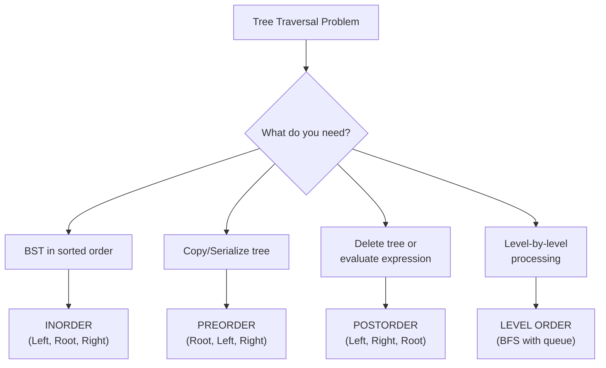

import { LanguageSelector, TimeEstimate, ConfidenceBuilder, DifficultyBadge } from '@site/src/components/interview-guide';
import { CodeTabs } from '@site/src/components/design-patterns/CodeTabs';
import TabItem from '@theme/TabItem';

# Tree Traversals: The Foundation

Every tree problem starts with traversal. The approach you choose—and whether you implement it recursively or iteratively—often determines whether you solve the problem cleanly.

<LanguageSelector />

<TimeEstimate
  learnTime="25-35 minutes"
  practiceTime="2-3 hours"
  masteryTime="8-10 problems"
  interviewFrequency="40%"
  difficultyRange="Easy to Medium"
  prerequisites="Trees Data Structure, Recursion"
/>

---

## The Three DFS Traversals

```
        1
       / \
      2   3
     / \
    4   5

Inorder   (Left, Root, Right):   4, 2, 5, 1, 3
Preorder  (Root, Left, Right):   1, 2, 4, 5, 3
Postorder (Left, Right, Root):   4, 5, 2, 3, 1
```

**Memory trick:** The name tells you when to visit the root:
- **In**order: Root in the middle
- **Pre**order: Root first (pre = before)
- **Post**order: Root last (post = after)

---

## Decision Guide



---

## Inorder Traversal

**Use case:** BST → sorted order, validate BST.

<CodeTabs>
<TabItem value="python" label="Python">

```python
class TreeNode:
    def __init__(self, val=0, left=None, right=None):
        self.val = val
        self.left = left
        self.right = right


def inorder_recursive(root: TreeNode | None) -> list[int]:
    """Inorder: Left, Root, Right."""
    result: list[int] = []
    
    def traverse(node: TreeNode | None) -> None:
        if not node:
            return
        traverse(node.left)
        result.append(node.val)
        traverse(node.right)
    
    traverse(root)
    return result


def inorder_iterative(root: TreeNode | None) -> list[int]:
    """
    Iterative inorder using a stack.
    Useful when recursion depth might cause stack overflow.
    """
    result: list[int] = []
    stack: list[TreeNode] = []
    current = root
    
    while stack or current:
        # Go as far left as possible
        while current:
            stack.append(current)
            current = current.left
        
        # Process node
        current = stack.pop()
        result.append(current.val)
        
        # Move to right subtree
        current = current.right
    
    return result
```

</TabItem>
<TabItem value="typescript" label="TypeScript">

```typescript
class TreeNode {
  val: number;
  left: TreeNode | null;
  right: TreeNode | null;

  constructor(val = 0, left: TreeNode | null = null, right: TreeNode | null = null) {
    this.val = val;
    this.left = left;
    this.right = right;
  }
}

function inorderRecursive(root: TreeNode | null): number[] {
  const result: number[] = [];

  function traverse(node: TreeNode | null): void {
    if (!node) return;
    traverse(node.left);
    result.push(node.val);
    traverse(node.right);
  }

  traverse(root);
  return result;
}

function inorderIterative(root: TreeNode | null): number[] {
  const result: number[] = [];
  const stack: TreeNode[] = [];
  let current = root;

  while (stack.length > 0 || current) {
    while (current) {
      stack.push(current);
      current = current.left;
    }

    current = stack.pop()!;
    result.push(current.val);
    current = current.right;
  }

  return result;
}
```

</TabItem>
<TabItem value="go" label="Go">

```go
type TreeNode struct {
    Val   int
    Left  *TreeNode
    Right *TreeNode
}

func inorderRecursive(root *TreeNode) []int {
    result := []int{}
    
    var traverse func(node *TreeNode)
    traverse = func(node *TreeNode) {
        if node == nil {
            return
        }
        traverse(node.Left)
        result = append(result, node.Val)
        traverse(node.Right)
    }
    
    traverse(root)
    return result
}

func inorderIterative(root *TreeNode) []int {
    result := []int{}
    stack := []*TreeNode{}
    current := root
    
    for len(stack) > 0 || current != nil {
        for current != nil {
            stack = append(stack, current)
            current = current.Left
        }
        
        current = stack[len(stack)-1]
        stack = stack[:len(stack)-1]
        result = append(result, current.Val)
        current = current.Right
    }
    
    return result
}
```

</TabItem>
<TabItem value="java" label="Java">

```java
public class TreeNode {
    int val;
    TreeNode left;
    TreeNode right;
    TreeNode(int val) { this.val = val; }
}

public List<Integer> inorderRecursive(TreeNode root) {
    List<Integer> result = new ArrayList<>();
    traverse(root, result);
    return result;
}

private void traverse(TreeNode node, List<Integer> result) {
    if (node == null) return;
    traverse(node.left, result);
    result.add(node.val);
    traverse(node.right, result);
}

public List<Integer> inorderIterative(TreeNode root) {
    List<Integer> result = new ArrayList<>();
    Deque<TreeNode> stack = new ArrayDeque<>();
    TreeNode current = root;
    
    while (!stack.isEmpty() || current != null) {
        while (current != null) {
            stack.push(current);
            current = current.left;
        }
        
        current = stack.pop();
        result.add(current.val);
        current = current.right;
    }
    
    return result;
}
```

</TabItem>
<TabItem value="cpp" label="C++">

```cpp
struct TreeNode {
    int val;
    TreeNode* left;
    TreeNode* right;
    TreeNode(int x) : val(x), left(nullptr), right(nullptr) {}
};

vector<int> inorderRecursive(TreeNode* root) {
    vector<int> result;
    
    function<void(TreeNode*)> traverse = [&](TreeNode* node) {
        if (!node) return;
        traverse(node->left);
        result.push_back(node->val);
        traverse(node->right);
    };
    
    traverse(root);
    return result;
}

vector<int> inorderIterative(TreeNode* root) {
    vector<int> result;
    stack<TreeNode*> st;
    TreeNode* current = root;
    
    while (!st.empty() || current) {
        while (current) {
            st.push(current);
            current = current->left;
        }
        
        current = st.top();
        st.pop();
        result.push_back(current->val);
        current = current->right;
    }
    
    return result;
}
```

</TabItem>
<TabItem value="c" label="C">

```c
struct TreeNode {
    int val;
    struct TreeNode* left;
    struct TreeNode* right;
};

void inorderHelper(struct TreeNode* node, int* result, int* index) {
    if (!node) return;
    inorderHelper(node->left, result, index);
    result[(*index)++] = node->val;
    inorderHelper(node->right, result, index);
}

int* inorderRecursive(struct TreeNode* root, int* returnSize) {
    int* result = (int*)malloc(1000 * sizeof(int));
    *returnSize = 0;
    inorderHelper(root, result, returnSize);
    return result;
}

int* inorderIterative(struct TreeNode* root, int* returnSize) {
    int* result = (int*)malloc(1000 * sizeof(int));
    struct TreeNode** stack = (struct TreeNode**)malloc(1000 * sizeof(struct TreeNode*));
    int top = -1;
    *returnSize = 0;
    
    struct TreeNode* current = root;
    
    while (top >= 0 || current) {
        while (current) {
            stack[++top] = current;
            current = current->left;
        }
        
        current = stack[top--];
        result[(*returnSize)++] = current->val;
        current = current->right;
    }
    
    free(stack);
    return result;
}
```

</TabItem>
<TabItem value="csharp" label="C#">

```csharp
public class TreeNode {
    public int val;
    public TreeNode left;
    public TreeNode right;
    public TreeNode(int val = 0, TreeNode left = null, TreeNode right = null) {
        this.val = val;
        this.left = left;
        this.right = right;
    }
}

public IList<int> InorderRecursive(TreeNode root) {
    List<int> result = new();
    
    void Traverse(TreeNode node) {
        if (node == null) return;
        Traverse(node.left);
        result.Add(node.val);
        Traverse(node.right);
    }
    
    Traverse(root);
    return result;
}

public IList<int> InorderIterative(TreeNode root) {
    List<int> result = new();
    Stack<TreeNode> stack = new();
    TreeNode current = root;
    
    while (stack.Count > 0 || current != null) {
        while (current != null) {
            stack.Push(current);
            current = current.left;
        }
        
        current = stack.Pop();
        result.Add(current.val);
        current = current.right;
    }
    
    return result;
}
```

</TabItem>
</CodeTabs>

---

## Preorder Traversal

**Use case:** Copy/clone tree, serialize tree, create prefix expression.

<CodeTabs>
<TabItem value="python" label="Python">

```python
def preorder_recursive(root: TreeNode | None) -> list[int]:
    """Preorder: Root, Left, Right."""
    result: list[int] = []
    
    def traverse(node: TreeNode | None) -> None:
        if not node:
            return
        result.append(node.val)  # Process root first
        traverse(node.left)
        traverse(node.right)
    
    traverse(root)
    return result


def preorder_iterative(root: TreeNode | None) -> list[int]:
    """
    Iterative preorder using a stack.
    Push right first, then left (so left pops first).
    """
    if not root:
        return []
    
    result: list[int] = []
    stack: list[TreeNode] = [root]
    
    while stack:
        node = stack.pop()
        result.append(node.val)
        
        # Push right first so left is processed first
        if node.right:
            stack.append(node.right)
        if node.left:
            stack.append(node.left)
    
    return result
```

</TabItem>
<TabItem value="typescript" label="TypeScript">

```typescript
function preorderRecursive(root: TreeNode | null): number[] {
  const result: number[] = [];

  function traverse(node: TreeNode | null): void {
    if (!node) return;
    result.push(node.val);
    traverse(node.left);
    traverse(node.right);
  }

  traverse(root);
  return result;
}

function preorderIterative(root: TreeNode | null): number[] {
  if (!root) return [];

  const result: number[] = [];
  const stack: TreeNode[] = [root];

  while (stack.length > 0) {
    const node = stack.pop()!;
    result.push(node.val);

    if (node.right) stack.push(node.right);
    if (node.left) stack.push(node.left);
  }

  return result;
}
```

</TabItem>
<TabItem value="java" label="Java">

```java
public List<Integer> preorderIterative(TreeNode root) {
    List<Integer> result = new ArrayList<>();
    if (root == null) return result;
    
    Deque<TreeNode> stack = new ArrayDeque<>();
    stack.push(root);
    
    while (!stack.isEmpty()) {
        TreeNode node = stack.pop();
        result.add(node.val);
        
        if (node.right != null) stack.push(node.right);
        if (node.left != null) stack.push(node.left);
    }
    
    return result;
}
```

</TabItem>
<TabItem value="go" label="Go">

```go
func preorderIterative(root *TreeNode) []int {
    if root == nil {
        return []int{}
    }
    
    result := []int{}
    stack := []*TreeNode{root}
    
    for len(stack) > 0 {
        node := stack[len(stack)-1]
        stack = stack[:len(stack)-1]
        result = append(result, node.Val)
        
        if node.Right != nil {
            stack = append(stack, node.Right)
        }
        if node.Left != nil {
            stack = append(stack, node.Left)
        }
    }
    
    return result
}
```

</TabItem>
<TabItem value="cpp" label="C++">

```cpp
vector<int> preorderIterative(TreeNode* root) {
    if (!root) return {};
    
    vector<int> result;
    stack<TreeNode*> st;
    st.push(root);
    
    while (!st.empty()) {
        TreeNode* node = st.top();
        st.pop();
        result.push_back(node->val);
        
        if (node->right) st.push(node->right);
        if (node->left) st.push(node->left);
    }
    
    return result;
}
```

</TabItem>
<TabItem value="csharp" label="C#">

```csharp
public IList<int> PreorderIterative(TreeNode root) {
    List<int> result = new();
    if (root == null) return result;
    
    Stack<TreeNode> stack = new();
    stack.Push(root);
    
    while (stack.Count > 0) {
        TreeNode node = stack.Pop();
        result.Add(node.val);
        
        if (node.right != null) stack.Push(node.right);
        if (node.left != null) stack.Push(node.left);
    }
    
    return result;
}
```

</TabItem>
</CodeTabs>

---

## Postorder Traversal

**Use case:** Delete tree (children before parent), evaluate expression tree.

<CodeTabs>
<TabItem value="python" label="Python">

```python
def postorder_recursive(root: TreeNode | None) -> list[int]:
    """Postorder: Left, Right, Root."""
    result: list[int] = []
    
    def traverse(node: TreeNode | None) -> None:
        if not node:
            return
        traverse(node.left)
        traverse(node.right)
        result.append(node.val)  # Process root last
    
    traverse(root)
    return result


def postorder_iterative(root: TreeNode | None) -> list[int]:
    """
    Iterative postorder: Modified preorder (Root, Right, Left) then reverse.
    Easier than tracking visited status.
    """
    if not root:
        return []
    
    result: list[int] = []
    stack: list[TreeNode] = [root]
    
    while stack:
        node = stack.pop()
        result.append(node.val)
        
        # Push left first so right is processed first
        if node.left:
            stack.append(node.left)
        if node.right:
            stack.append(node.right)
    
    return result[::-1]  # Reverse to get Left, Right, Root
```

</TabItem>
<TabItem value="typescript" label="TypeScript">

```typescript
function postorderIterative(root: TreeNode | null): number[] {
  if (!root) return [];

  const result: number[] = [];
  const stack: TreeNode[] = [root];

  while (stack.length > 0) {
    const node = stack.pop()!;
    result.push(node.val);

    if (node.left) stack.push(node.left);
    if (node.right) stack.push(node.right);
  }

  return result.reverse();
}
```

</TabItem>
<TabItem value="java" label="Java">

```java
public List<Integer> postorderIterative(TreeNode root) {
    LinkedList<Integer> result = new LinkedList<>();
    if (root == null) return result;
    
    Deque<TreeNode> stack = new ArrayDeque<>();
    stack.push(root);
    
    while (!stack.isEmpty()) {
        TreeNode node = stack.pop();
        result.addFirst(node.val); // Add to front instead of reversing
        
        if (node.left != null) stack.push(node.left);
        if (node.right != null) stack.push(node.right);
    }
    
    return result;
}
```

</TabItem>
<TabItem value="go" label="Go">

```go
func postorderIterative(root *TreeNode) []int {
    if root == nil {
        return []int{}
    }
    
    result := []int{}
    stack := []*TreeNode{root}
    
    for len(stack) > 0 {
        node := stack[len(stack)-1]
        stack = stack[:len(stack)-1]
        result = append(result, node.Val)
        
        if node.Left != nil {
            stack = append(stack, node.Left)
        }
        if node.Right != nil {
            stack = append(stack, node.Right)
        }
    }
    
    // Reverse result
    for i, j := 0, len(result)-1; i < j; i, j = i+1, j-1 {
        result[i], result[j] = result[j], result[i]
    }
    
    return result
}
```

</TabItem>
<TabItem value="cpp" label="C++">

```cpp
vector<int> postorderIterative(TreeNode* root) {
    if (!root) return {};
    
    vector<int> result;
    stack<TreeNode*> st;
    st.push(root);
    
    while (!st.empty()) {
        TreeNode* node = st.top();
        st.pop();
        result.push_back(node->val);
        
        if (node->left) st.push(node->left);
        if (node->right) st.push(node->right);
    }
    
    reverse(result.begin(), result.end());
    return result;
}
```

</TabItem>
<TabItem value="csharp" label="C#">

```csharp
public IList<int> PostorderIterative(TreeNode root) {
    LinkedList<int> result = new();
    if (root == null) return result.ToList();
    
    Stack<TreeNode> stack = new();
    stack.Push(root);
    
    while (stack.Count > 0) {
        TreeNode node = stack.Pop();
        result.AddFirst(node.val);
        
        if (node.left != null) stack.Push(node.left);
        if (node.right != null) stack.Push(node.right);
    }
    
    return result.ToList();
}
```

</TabItem>
</CodeTabs>

---

## Level Order Traversal (BFS)

**Use case:** Level-by-level processing, shortest path in tree, zigzag traversal.

<CodeTabs>
<TabItem value="python" label="Python">

```python
from collections import deque

def level_order(root: TreeNode | None) -> list[list[int]]:
    """
    Level order traversal using BFS.
    Returns nodes grouped by level.
    """
    if not root:
        return []
    
    result: list[list[int]] = []
    queue: deque[TreeNode] = deque([root])
    
    while queue:
        level_size = len(queue)  # Snapshot size at start of level
        level: list[int] = []
        
        for _ in range(level_size):
            node = queue.popleft()
            level.append(node.val)
            
            if node.left:
                queue.append(node.left)
            if node.right:
                queue.append(node.right)
        
        result.append(level)
    
    return result

# [[1], [2, 3], [4, 5]] for tree above
```

</TabItem>
<TabItem value="typescript" label="TypeScript">

```typescript
function levelOrder(root: TreeNode | null): number[][] {
  if (!root) return [];

  const result: number[][] = [];
  const queue: TreeNode[] = [root];

  while (queue.length > 0) {
    const levelSize = queue.length;
    const level: number[] = [];

    for (let i = 0; i < levelSize; i++) {
      const node = queue.shift()!;
      level.push(node.val);

      if (node.left) queue.push(node.left);
      if (node.right) queue.push(node.right);
    }

    result.push(level);
  }

  return result;
}
```

</TabItem>
<TabItem value="go" label="Go">

```go
func levelOrder(root *TreeNode) [][]int {
    if root == nil {
        return [][]int{}
    }
    
    result := [][]int{}
    queue := []*TreeNode{root}
    
    for len(queue) > 0 {
        levelSize := len(queue)
        level := []int{}
        
        for i := 0; i < levelSize; i++ {
            node := queue[0]
            queue = queue[1:]
            level = append(level, node.Val)
            
            if node.Left != nil {
                queue = append(queue, node.Left)
            }
            if node.Right != nil {
                queue = append(queue, node.Right)
            }
        }
        
        result = append(result, level)
    }
    
    return result
}
```

</TabItem>
<TabItem value="java" label="Java">

```java
public List<List<Integer>> levelOrder(TreeNode root) {
    List<List<Integer>> result = new ArrayList<>();
    if (root == null) return result;
    
    Queue<TreeNode> queue = new LinkedList<>();
    queue.offer(root);
    
    while (!queue.isEmpty()) {
        int levelSize = queue.size();
        List<Integer> level = new ArrayList<>();
        
        for (int i = 0; i < levelSize; i++) {
            TreeNode node = queue.poll();
            level.add(node.val);
            
            if (node.left != null) queue.offer(node.left);
            if (node.right != null) queue.offer(node.right);
        }
        
        result.add(level);
    }
    
    return result;
}
```

</TabItem>
<TabItem value="cpp" label="C++">

```cpp
vector<vector<int>> levelOrder(TreeNode* root) {
    if (!root) return {};
    
    vector<vector<int>> result;
    queue<TreeNode*> q;
    q.push(root);
    
    while (!q.empty()) {
        int levelSize = q.size();
        vector<int> level;
        
        for (int i = 0; i < levelSize; i++) {
            TreeNode* node = q.front();
            q.pop();
            level.push_back(node->val);
            
            if (node->left) q.push(node->left);
            if (node->right) q.push(node->right);
        }
        
        result.push_back(level);
    }
    
    return result;
}
```

</TabItem>
<TabItem value="csharp" label="C#">

```csharp
public IList<IList<int>> LevelOrder(TreeNode root) {
    IList<IList<int>> result = new List<IList<int>>();
    if (root == null) return result;
    
    Queue<TreeNode> queue = new();
    queue.Enqueue(root);
    
    while (queue.Count > 0) {
        int levelSize = queue.Count;
        List<int> level = new();
        
        for (int i = 0; i < levelSize; i++) {
            TreeNode node = queue.Dequeue();
            level.Add(node.val);
            
            if (node.left != null) queue.Enqueue(node.left);
            if (node.right != null) queue.Enqueue(node.right);
        }
        
        result.Add(level);
    }
    
    return result;
}
```

</TabItem>
</CodeTabs>

<ConfidenceBuilder type="remember" title="Level Size Snapshot">

**Critical:** Capture `level_size = len(queue)` at the START of each level. The queue grows as you add children, so you need the snapshot to know when the level ends.

</ConfidenceBuilder>

---

## 🎯 When to Use Which

| Traversal | Use Case | Example Problems |
|-----------|----------|------------------|
| **Inorder** | BST → sorted order | Validate BST, Kth Smallest in BST |
| **Preorder** | Copy/serialize tree | Clone Tree, Serialize Binary Tree |
| **Postorder** | Process children first | Delete Tree, Tree Height |
| **Level Order** | Level-by-level | Right Side View, Zigzag Level Order |

---

## 💬 How to Communicate This in Interviews

**Choosing traversal:**
> "I need the BST values in sorted order, so I'll use inorder traversal..."

**Recursive vs Iterative:**
> "I'll use the iterative version to avoid potential stack overflow on deep trees..."

**BFS for level order:**
> "For level-by-level processing, I'll use BFS with a queue. I'll capture the level size at the start to know when each level ends..."

---

## 🏋️ Practice Problems

| Problem | Difficulty | Traversal |
|---------|------------|-----------|
| [Inorder Traversal](https://leetcode.com/problems/binary-tree-inorder-traversal/) | <DifficultyBadge level="easy" /> | Inorder |
| [Preorder Traversal](https://leetcode.com/problems/binary-tree-preorder-traversal/) | <DifficultyBadge level="easy" /> | Preorder |
| [Postorder Traversal](https://leetcode.com/problems/binary-tree-postorder-traversal/) | <DifficultyBadge level="easy" /> | Postorder |
| [Level Order Traversal](https://leetcode.com/problems/binary-tree-level-order-traversal/) | <DifficultyBadge level="medium" /> | BFS |
| [Zigzag Level Order](https://leetcode.com/problems/binary-tree-zigzag-level-order-traversal/) | <DifficultyBadge level="medium" /> | BFS |
| [Right Side View](https://leetcode.com/problems/binary-tree-right-side-view/) | <DifficultyBadge level="medium" /> | BFS |
| [Validate BST](https://leetcode.com/problems/validate-binary-search-tree/) | <DifficultyBadge level="medium" /> | Inorder |

---

## Key Takeaways

1. **Inorder on BST** gives sorted order—use for BST validation, Kth element.

2. **Level order (BFS)** for level-by-level processing—snapshot level size!

3. **Iterative versions** avoid stack overflow on deep trees.

4. **The name tells you when to visit root:** Pre (before), In (middle), Post (after).

<ConfidenceBuilder type="youve-got-this">

**Traversal is the foundation—not the whole building.**

Once you know how to traverse, tree problems become about what you DO during traversal. Most tree problems are variations on these basic patterns.

</ConfidenceBuilder>

---

## What's Next?

BST-specific operations and patterns:

**Next up:** [BST Operations](/docs/interview-guide/coding/patterns/tree-patterns/bst-operations) — Insert, Delete, Search
