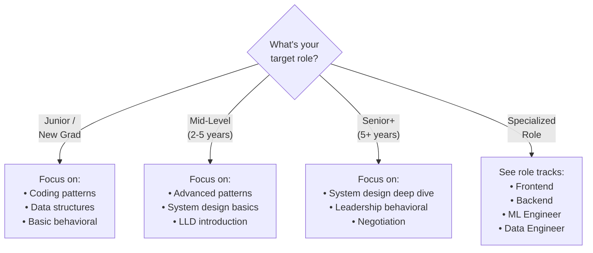

# The Complete Software Developer Interview Guide

I still remember sitting in a Google lobby in 2019, palms sweating, trying to recall the difference between BFS and DFS. I'd spent three months grinding LeetCode—over 200 problems—but in that moment, my mind went blank.

I didn't get the offer.

What hurt most wasn't the rejection. It was realizing I'd prepared *wrong*. I'd memorized solutions instead of understanding patterns. I'd ignored system design because "I'm not senior enough." I'd never once practiced explaining my thought process out loud.

**That interview changed everything about how I approach preparation.**

Over the next two years, I interviewed at 12 companies. I received 8 offers, including Google (the second time), Meta, and several unicorn startups. The difference wasn't that I got smarter—I got strategic.

This guide contains everything I wish I'd known before that first Google interview.

---

## What Makes This Guide Different

### Why I Created This

When I was preparing for interviews, I spent countless hours jumping between dozens of resources—a course here for patterns, a newsletter there for system design, random YouTube videos for behavioral prep, and paid platforms for company-specific questions.

**The pain of finding everything scattered across the internet was exhausting.**

I'd pay for one platform, realize it only covered coding patterns. Pay for another, get system design but no behavioral prep. Buy a book, find it outdated. The total cost? Easily $500-800+ per year. And I still felt unprepared because nothing covered *everything*.

I created this guide because **no one should have to go through that**.

### What You Get (Free)

| What | Coverage |
|------|----------|
| **Coding Patterns** | 28+ patterns organized by data structure |
| **System Design** | 14 case studies (URL shortener to Netflix) |
| **Low-Level Design** | 10 OOD problems (parking lot, chess, ATM) |
| **Behavioral Prep** | STAR method, story bank, leadership questions |
| **Company Guides** | Google, Amazon, Meta, Microsoft, Apple, startups |
| **Career Content** | Resume tips, salary negotiation, interview day |

**Average cost on other platforms: $500-800/year.**

**This guide: Free. Forever.**

This is my way of giving back. I've been through the grind, felt the stress, experienced the rejections. If this guide helps even one person land their dream job, it's worth every hour I put into creating it.

---

## How to Use This Guide

### Step 1: Know Where You Stand

Be honest about your current level:

| If you... | You're probably... | Start with... |
|-----------|-------------------|---------------|
| Can't explain Big-O | Beginner | [Coding Fundamentals](./coding/fundamentals/big-o-notation) |
| Know basics but struggle with medium LeetCode | Intermediate | [Coding Patterns](./patterns-overview) |
| Solve mediums but fail system design | Ready for SD | [System Design Fundamentals](./system-design/fundamentals/introduction) |
| Pass technicals but fail behavioral | Need soft skills | [Behavioral Interviews](./behavioral/introduction) |

### Step 2: Choose Your Timeline

How much time do you have?

**1 Week (Emergency Mode)**
- Day 1-2: Top 5 patterns + 15 problems
- Day 3-4: System design framework + 3 case studies
- Day 5: Behavioral STAR + 5 stories
- Day 6-7: Mock interviews

**1 Month (Solid Prep)**
- Week 1: Data structures + Big-O
- Week 2: 15 essential patterns
- Week 3: System design fundamentals + 5 cases
- Week 4: Behavioral + mock interviews

**3 Months (Comprehensive)**
- Month 1: All coding content + 150 problems
- Month 2: Complete system design + LLD
- Month 3: Behavioral, company-specific prep, negotiation

### Step 3: Choose Your Path

What role are you targeting?

---

## What You'll Learn

### Section 1: Coding Interviews

The foundation everything else builds on.

**Fundamentals** — Big-O notation, choosing data structures, problem-solving frameworks. If you can't analyze time complexity, start here.

**Data Structures** — Deep dives into arrays, linked lists, trees, graphs, heaps, tries, and more. Not just "what" but "when and why."

**Patterns** — 32 patterns organized by type: two pointers, sliding window, BFS/DFS, dynamic programming, backtracking. Each pattern includes:
- When to recognize it
- The template/approach
- 5+ practice problems
- Common variations

**Problem Lists** — Blind 75, NeetCode 150, and company-tagged problems so you know what each company actually asks.

### Section 2: System Design

Where senior roles are won or lost.

**Fundamentals** — The framework for approaching any system design question. Requirements gathering, capacity estimation, trade-off discussions.

**Building Blocks** — Load balancers, caches, message queues, CDNs. The components you'll combine in every design.

**Databases** — 14 database types: when to use PostgreSQL vs MongoDB vs Cassandra vs Redis. This depth is what separates good answers from great ones.

**Case Studies** — 32 real systems: Twitter, Netflix, Uber, WhatsApp, and more. Each includes requirements, high-level design, deep dives, and trade-offs.

### Section 3: Low-Level Design (OOD)

Often overlooked, frequently asked.

**SOLID Principles** — The foundation of good object-oriented design.

**Design Patterns** — Factory, Observer, Strategy, and more—with practical examples.

**Case Studies** — 15 classic problems: parking lot, elevator, chess, movie booking. The questions that trip up candidates who only practice LeetCode.

### Section 4: Behavioral Interviews

Where offers are lost at the last minute.

**STAR Method** — How to structure answers that actually answer the question.

**Story Bank** — Template for building 8-10 stories that cover any behavioral question.

**Company-Specific** — Amazon Leadership Principles, Google's Googleyness, Meta's values.

### Section 5: Career & Negotiation

Beyond the interview.

**Resume** — ATS optimization, quantifying impact, what actually gets callbacks.

**Negotiation** — Scripts for asking for more, handling exploding offers, evaluating equity.

**First 90 Days** — How to succeed once you land the job.

---

## The Approach That Actually Works

After conducting 50+ mock interviews and coaching dozens of engineers, I've noticed what separates successful candidates:

### 1. Pattern Recognition Over Memorization

**Don't memorize solutions. Learn to recognize problems.**

When you see "find the shortest path in a graph," your brain should immediately think: "BFS for unweighted, Dijkstra for weighted." That recognition comes from understanding patterns, not grinding random problems.

### 2. Think Out Loud

**The interview isn't about the answer. It's about your process.**

Interviewers want to see how you think. A candidate who talks through their approach, considers edge cases, and catches their own bugs is more hireable than someone who silently writes a perfect solution.

### 3. Start with the Why

**"I'm using a hash map because..." is better than just using a hash map.**

Explain your reasoning. When you say "I chose this approach because it gives us O(1) lookup, which matters here because we're iterating through the array once," you demonstrate understanding, not just pattern matching.

### 4. System Design Is a Conversation

**There's no single right answer in system design.**

Interviewers want to see you navigate trade-offs. "We could use SQL for strong consistency, but NoSQL would scale better—which matters more for this use case?" That discussion is the interview.

---

## Get Started

Ready to begin?

**If you're new to interview prep:**
Start with [Big-O Notation](./coding/fundamentals/big-o-notation). Understanding complexity is foundational to everything else.

**If you know the basics:**
Jump to [Coding Patterns](./patterns-overview). This is where most interview success comes from.

**If you're preparing for senior roles:**
Begin with [System Design Fundamentals](./system-design/fundamentals/introduction). This is your differentiator.

**If you have interviews soon:**
See [Preparation Timelines](./learning-paths) for compressed study plans.

---

## Pay It Forward

This guide is free because I remember what it felt like—stressing about interviews while also worrying about whether I could afford the "right" resources. Everyone deserves access to quality preparation, regardless of their financial situation.

If this guide helps you:
- **Share it** with friends who are preparing for interviews
- **Connect with me** on [LinkedIn](https://www.linkedin.com/in/shivammishra1/) — I love hearing success stories
- **Pay it forward** by helping someone else when you're on the other side of the table

**Now let's get you that offer.**

👉 [Start with Coding Fundamentals →](./coding/fundamentals/big-o-notation)
