# The Complete Software Developer Interview Guide

I still remember sitting in a Google lobby in 2019, palms sweating, trying to recall the difference between BFS and DFS. I'd spent three months grinding LeetCode—over 200 problems—but in that moment, my mind went blank.

I didn't get the offer.

What hurt most wasn't the rejection. It was realizing I'd prepared *wrong*. I'd memorized solutions instead of understanding patterns. I'd ignored system design because "I'm not senior enough." I'd never once practiced explaining my thought process out loud.

**That interview changed everything about how I approach preparation.**

Over the next two years, I interviewed at 12 companies. I received 8 offers, including Google (the second time), Meta, and several unicorn startups. The difference wasn't that I got smarter—I got strategic.

This guide contains everything I wish I'd known before that first Google interview.

---

## What Makes This Guide Different

You could spend $800+ per year on interview prep:

| Resource | What It Covers | Cost |
|----------|----------------|------|
| Grokking Coding Interview | 28 patterns | $79 |
| Grokking System Design | Case studies | $79 |
| ByteByteGo | System design + ML | $79/yr |
| LeetCode Premium | Company questions | $159/yr |
| GreatFrontend | Frontend prep | $228/yr |
| Negotiation coaching | Salary | $200+ |
| Mock interviews | Practice | $150/session |

Or you could use this guide. **It's free, and it covers everything.**

Here's what you get:

- **32 coding patterns** — More than Grokking, organized by data structure
- **32 system design case studies** — From URL shorteners to Netflix
- **15 low-level design problems** — Parking lots, elevators, chess games
- **Complete behavioral prep** — STAR method, story bank templates, Amazon LPs
- **25+ company guides** — Google, Meta, Amazon, and startups
- **Career section** — Resumes, negotiation scripts, offer evaluation
- **~1,200 hours of content** — More than any paid resource

**This is the interview guide I wish existed when I was preparing.**

---

## How to Use This Guide

### Step 1: Know Where You Stand

Be honest about your current level:

| If you... | You're probably... | Start with... |
|-----------|-------------------|---------------|
| Can't explain Big-O | Beginner | [Coding Fundamentals](./coding/fundamentals/big-o-notation) |
| Know basics but struggle with medium LeetCode | Intermediate | [Coding Patterns](./coding/patterns) |
| Solve mediums but fail system design | Ready for SD | [System Design Fundamentals](./system-design/fundamentals/introduction) |
| Pass technicals but fail behavioral | Need soft skills | [Behavioral Interviews](./behavioral/introduction) |

### Step 2: Choose Your Timeline

How much time do you have?

**1 Week (Emergency Mode)**
- Day 1-2: Top 5 patterns + 15 problems
- Day 3-4: System design framework + 3 case studies
- Day 5: Behavioral STAR + 5 stories
- Day 6-7: Mock interviews

**1 Month (Solid Prep)**
- Week 1: Data structures + Big-O
- Week 2: 15 essential patterns
- Week 3: System design fundamentals + 5 cases
- Week 4: Behavioral + mock interviews

**3 Months (Comprehensive)**
- Month 1: All coding content + 150 problems
- Month 2: Complete system design + LLD
- Month 3: Behavioral, company-specific prep, negotiation

### Step 3: Choose Your Path

What role are you targeting?

```mermaid
flowchart TD
    start{"What's your<br/>target role?"}
    
    start -->|"Junior /<br/>New Grad"| junior["Focus on:<br/>• Coding patterns<br/>• Data structures<br/>• Basic behavioral"]
    
    start -->|"Mid-Level<br/>(2-5 years)"| mid["Focus on:<br/>• Advanced patterns<br/>• System design basics<br/>• LLD introduction"]
    
    start -->|"Senior+<br/>(5+ years)"| senior["Focus on:<br/>• System design deep dive<br/>• Leadership behavioral<br/>• Negotiation"]
    
    start -->|"Specialized<br/>Role"| special["See role tracks:<br/>• Frontend<br/>• Backend<br/>• ML Engineer<br/>• Data Engineer"]
```

---

## What You'll Learn

### Section 1: Coding Interviews

The foundation everything else builds on.

**Fundamentals** — Big-O notation, choosing data structures, problem-solving frameworks. If you can't analyze time complexity, start here.

**Data Structures** — Deep dives into arrays, linked lists, trees, graphs, heaps, tries, and more. Not just "what" but "when and why."

**Patterns** — 32 patterns organized by type: two pointers, sliding window, BFS/DFS, dynamic programming, backtracking. Each pattern includes:
- When to recognize it
- The template/approach
- 5+ practice problems
- Common variations

**Problem Lists** — Blind 75, NeetCode 150, and company-tagged problems so you know what each company actually asks.

### Section 2: System Design

Where senior roles are won or lost.

**Fundamentals** — The framework for approaching any system design question. Requirements gathering, capacity estimation, trade-off discussions.

**Building Blocks** — Load balancers, caches, message queues, CDNs. The components you'll combine in every design.

**Databases** — 14 database types: when to use PostgreSQL vs MongoDB vs Cassandra vs Redis. This depth is what separates good answers from great ones.

**Case Studies** — 32 real systems: Twitter, Netflix, Uber, WhatsApp, and more. Each includes requirements, high-level design, deep dives, and trade-offs.

### Section 3: Low-Level Design (OOD)

Often overlooked, frequently asked.

**SOLID Principles** — The foundation of good object-oriented design.

**Design Patterns** — Factory, Observer, Strategy, and more—with practical examples.

**Case Studies** — 15 classic problems: parking lot, elevator, chess, movie booking. The questions that trip up candidates who only practice LeetCode.

### Section 4: Behavioral Interviews

Where offers are lost at the last minute.

**STAR Method** — How to structure answers that actually answer the question.

**Story Bank** — Template for building 8-10 stories that cover any behavioral question.

**Company-Specific** — Amazon Leadership Principles, Google's Googleyness, Meta's values.

### Section 5: Career & Negotiation

Beyond the interview.

**Resume** — ATS optimization, quantifying impact, what actually gets callbacks.

**Negotiation** — Scripts for asking for more, handling exploding offers, evaluating equity.

**First 90 Days** — How to succeed once you land the job.

---

## The Approach That Actually Works

After conducting 50+ mock interviews and coaching dozens of engineers, I've noticed what separates successful candidates:

### 1. Pattern Recognition Over Memorization

**Don't memorize solutions. Learn to recognize problems.**

When you see "find the shortest path in a graph," your brain should immediately think: "BFS for unweighted, Dijkstra for weighted." That recognition comes from understanding patterns, not grinding random problems.

### 2. Think Out Loud

**The interview isn't about the answer. It's about your process.**

Interviewers want to see how you think. A candidate who talks through their approach, considers edge cases, and catches their own bugs is more hireable than someone who silently writes a perfect solution.

### 3. Start with the Why

**"I'm using a hash map because..." is better than just using a hash map.**

Explain your reasoning. When you say "I chose this approach because it gives us O(1) lookup, which matters here because we're iterating through the array once," you demonstrate understanding, not just pattern matching.

### 4. System Design Is a Conversation

**There's no single right answer in system design.**

Interviewers want to see you navigate trade-offs. "We could use SQL for strong consistency, but NoSQL would scale better—which matters more for this use case?" That discussion is the interview.

---

## Get Started

Ready to begin?

**If you're new to interview prep:**
Start with [Big-O Notation](./coding/fundamentals/big-o-notation). Understanding complexity is foundational to everything else.

**If you know the basics:**
Jump to [Coding Patterns](./coding/patterns). This is where most interview success comes from.

**If you're preparing for senior roles:**
Begin with [System Design Fundamentals](./system-design/fundamentals/introduction). This is your differentiator.

**If you have interviews soon:**
See [Preparation Timelines](./learning-paths) for compressed study plans.

---

## A Note on Free Resources

This guide is free because I believe everyone deserves access to quality interview preparation, regardless of ability to pay.

If this helps you land an offer:
- Share it with friends who are interviewing
- Connect with me on [LinkedIn](#)
- Pay it forward by helping someone else prepare

**Now let's get you that offer.**

👉 [Start with Coding Fundamentals →](./coding/fundamentals/big-o-notation)
