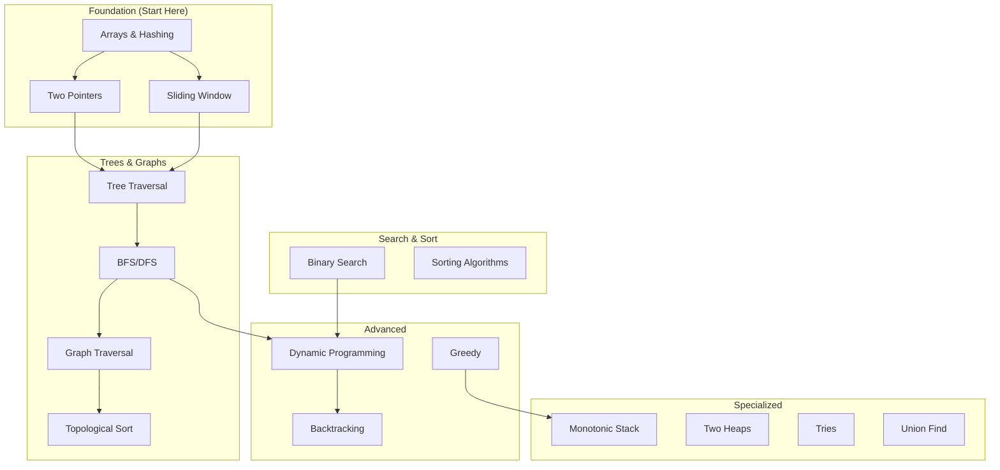

import { ConfidenceBuilder, DifficultyBadge } from '@site/src/components/interview-guide';

# Patterns Overview: The Complete Map

**There are ~25 patterns. You don't need to know all of them.**

This page shows you how patterns relate, which are most important, and where to start based on your timeline.

---

## The Pattern Landscape



---

## Pattern Priority Matrix

### Tier 1: Must Know (Covers 70% of problems)

| Pattern | Frequency | Difficulty | Learn First |
|---------|-----------|------------|-------------|
| [Two Pointers](/docs/interview-guide/coding/patterns/array-patterns/two-pointers) | Very High | Easy | Yes |
| [Sliding Window](/docs/interview-guide/coding/patterns/array-patterns/sliding-window) | Very High | Medium | Yes |
| [Tree Traversal](/docs/interview-guide/coding/patterns/tree-patterns/traversals) | Very High | Easy | Yes |
| [BFS/DFS](/docs/interview-guide/coding/patterns/graph-patterns/traversal) | Very High | Medium | Yes |
| [Binary Search](/docs/interview-guide/coding/patterns/search-patterns/binary-search) | High | Medium | Yes |
| [Hash Map](/docs/interview-guide/coding/data-structures/hash-tables) | Very High | Easy | Yes |

### Tier 2: Essential (Adds 20% coverage)

| Pattern | Frequency | Difficulty | Learn After |
|---------|-----------|------------|-------------|
| [Dynamic Programming](/docs/interview-guide/coding/patterns/dp-patterns/introduction) | High | Hard | Tier 1 |
| [Backtracking](/docs/interview-guide/coding/patterns/backtracking-patterns/introduction) | Medium | Medium | Tree Traversal |
| [Topological Sort](/docs/interview-guide/coding/patterns/graph-patterns/topological-sort) | Medium | Medium | BFS/DFS |
| [Heap / Priority Queue](/docs/interview-guide/coding/data-structures/heaps-priority-queues) | Medium | Medium | Tier 1 |
| [Intervals](/docs/interview-guide/coding/patterns/intervals/merge-overlapping) | Medium | Medium | Sorting |

### Tier 3: Good to Know (Adds 10% coverage)

| Pattern | Frequency | Difficulty | Learn After |
|---------|-----------|------------|-------------|
| [Monotonic Stack](/docs/interview-guide/coding/patterns/stack-patterns/monotonic-stack) | Low-Med | Medium | Stacks |
| [Union Find](/docs/interview-guide/coding/data-structures/union-find) | Low-Med | Medium | Graphs |
| [Tries](/docs/interview-guide/coding/data-structures/tries) | Low | Medium | Trees |
| [Two Heaps](/docs/interview-guide/coding/patterns/heap-patterns/two-heaps) | Low | Hard | Heaps |
| [Bit Manipulation](/docs/interview-guide/coding/patterns/bit-manipulation/basics) | Low | Medium | Anytime |

---

## Pattern Quick Reference

### Array Patterns

| Pattern | When to Use | Key Template |
|---------|-------------|--------------|
| **Two Pointers** | Sorted array, find pairs | `left, right = 0, n-1` |
| **Sliding Window** | Subarray/substring with constraint | `for right in range(n): while invalid: left += 1` |
| **Prefix Sum** | Range sum queries | `prefix[i] = prefix[i-1] + arr[i]` |
| **Kadane's** | Maximum subarray | `curr = max(num, curr + num)` |

### Tree Patterns

| Pattern | When to Use | Key Approach |
|---------|-------------|--------------|
| **DFS (Recursive)** | Most tree problems | Return value from subtrees |
| **DFS (Iterative)** | Interview preference | Stack-based |
| **BFS / Level Order** | Level-based questions | Queue-based |
| **BST Property** | Sorted order, range | Inorder gives sorted |

### Graph Patterns

| Pattern | When to Use | Key Approach |
|---------|-------------|--------------|
| **BFS** | Shortest path (unweighted) | Queue + visited set |
| **DFS** | All paths, connectivity | Recursion + visited |
| **Topological Sort** | Dependencies, ordering | Kahn's or DFS |
| **Union Find** | Connectivity, components | Path compression |

### DP Patterns

| Pattern | When to Use | State Definition |
|---------|-------------|------------------|
| **1D DP** | Linear sequence | `dp[i]` = answer at i |
| **2D DP** | Grid or two sequences | `dp[i][j]` = answer at (i,j) |
| **Knapsack** | Selection with capacity | `dp[i][w]` = with items, capacity |
| **Interval** | Range queries | `dp[i][j]` = answer for [i,j] |

---

## Pattern Recognition Cheat Sheet

| If you see... | Think... | Pattern |
|---------------|----------|---------|
| Sorted array, find target | Binary Search | [Binary Search](/docs/interview-guide/coding/patterns/search-patterns/binary-search) |
| Sorted array, find pair | Two Pointers | [Two Pointers](/docs/interview-guide/coding/patterns/array-patterns/two-pointers) |
| Subarray/substring sum | Sliding Window | [Sliding Window](/docs/interview-guide/coding/patterns/array-patterns/sliding-window) |
| "Find all permutations/subsets" | Backtracking | [Backtracking](/docs/interview-guide/coding/patterns/backtracking-patterns/introduction) |
| "Minimum/maximum" + "ways to" | Dynamic Programming | [DP Introduction](/docs/interview-guide/coding/patterns/dp-patterns/introduction) |
| Shortest path (unweighted) | BFS | [Graph Traversal](/docs/interview-guide/coding/patterns/graph-patterns/traversal) |
| Connected components | DFS or Union Find | [Union Find](/docs/interview-guide/coding/data-structures/union-find) |
| Dependencies, ordering | Topological Sort | [Topological Sort](/docs/interview-guide/coding/patterns/graph-patterns/topological-sort) |
| K largest/smallest | Heap | [Heaps](/docs/interview-guide/coding/data-structures/heaps-priority-queues) |
| Next greater/smaller | Monotonic Stack | [Monotonic Stack](/docs/interview-guide/coding/patterns/stack-patterns/monotonic-stack) |
| String prefix matching | Trie | [Tries](/docs/interview-guide/coding/data-structures/tries) |
| Overlapping intervals | Intervals | [Intervals](/docs/interview-guide/coding/patterns/intervals/merge-overlapping) |
| Median, running median | Two Heaps | [Two Heaps](/docs/interview-guide/coding/patterns/heap-patterns/two-heaps) |

---

## Learning Paths by Timeline

### 7 Days: Focus on Tier 1 Only
```
Day 1-2: Two Pointers + Sliding Window
Day 3-4: Tree Traversal + BFS/DFS
Day 5: Binary Search
Day 6-7: Practice + Review
```

### 30 Days: Tier 1 + Tier 2
```
Week 1: Tier 1 patterns
Week 2: Trees + Graphs + Binary Search
Week 3: DP + Backtracking + Intervals
Week 4: Practice + Mocks
```

### 90 Days: All Tiers
```
Month 1: Tier 1 (deep mastery)
Month 2: Tier 2 + Tier 3
Month 3: Hard problems + System Design
```

---

## Pattern Dependencies

**Learn these in order:**

```
Arrays & Hashing
    ↓
Two Pointers ──────────────────┐
    ↓                          ↓
Sliding Window            Sorting
    ↓                          ↓
Trees (DFS/BFS) ←──────── Binary Search
    ↓                          ↓
Graphs (DFS/BFS) ──────→ Dynamic Programming
    ↓                          ↓
Topological Sort          Backtracking
    ↓                          ↓
Union Find                Greedy + Intervals
```

---

## All Patterns Index

### Data Structures
- [Arrays & Strings](/docs/interview-guide/coding/data-structures/arrays-strings)
- [Hash Tables](/docs/interview-guide/coding/data-structures/hash-tables)
- [Linked Lists](/docs/interview-guide/coding/data-structures/linked-lists)
- [Stacks & Queues](/docs/interview-guide/coding/data-structures/stacks-queues)
- [Trees](/docs/interview-guide/coding/data-structures/trees)
- [Heaps](/docs/interview-guide/coding/data-structures/heaps-priority-queues)
- [Graphs](/docs/interview-guide/coding/data-structures/graphs)
- [Tries](/docs/interview-guide/coding/data-structures/tries)
- [Union Find](/docs/interview-guide/coding/data-structures/union-find)

### Array Patterns
- [Two Pointers](/docs/interview-guide/coding/patterns/array-patterns/two-pointers)
- [Sliding Window](/docs/interview-guide/coding/patterns/array-patterns/sliding-window)
- [Prefix Sum](/docs/interview-guide/coding/patterns/array-patterns/prefix-sum)
- [Kadane's Algorithm](/docs/interview-guide/coding/patterns/array-patterns/kadane)

### Tree Patterns
- [Traversals](/docs/interview-guide/coding/patterns/tree-patterns/traversals)
- [BST Operations](/docs/interview-guide/coding/patterns/tree-patterns/bst-operations)
- [LCA](/docs/interview-guide/coding/patterns/tree-patterns/lca)

### Graph Patterns
- [Traversal (BFS/DFS)](/docs/interview-guide/coding/patterns/graph-patterns/traversal)
- [Topological Sort](/docs/interview-guide/coding/patterns/graph-patterns/topological-sort)
- [Shortest Path](/docs/interview-guide/coding/patterns/graph-patterns/shortest-path)

### Search Patterns
- [Binary Search](/docs/interview-guide/coding/patterns/search-patterns/binary-search)

### DP Patterns
- [Introduction](/docs/interview-guide/coding/patterns/dp-patterns/introduction)
- [Knapsack](/docs/interview-guide/coding/patterns/dp-patterns/knapsack)
- [Grid DP](/docs/interview-guide/coding/patterns/dp-patterns/grid-dp)
- [String DP](/docs/interview-guide/coding/patterns/dp-patterns/string-dp)

### Other Patterns
- [Backtracking](/docs/interview-guide/coding/patterns/backtracking-patterns/introduction)
- [Greedy Intervals](/docs/interview-guide/coding/patterns/greedy-patterns/intervals)
- [Monotonic Stack](/docs/interview-guide/coding/patterns/stack-patterns/monotonic-stack)
- [Intervals](/docs/interview-guide/coding/patterns/intervals/merge-overlapping)
- [Two Heaps](/docs/interview-guide/coding/patterns/heap-patterns/two-heaps)
- [Bit Manipulation](/docs/interview-guide/coding/patterns/bit-manipulation/basics)

---

<ConfidenceBuilder type="youve-got-this">

**You don't need to know everything.**

Focus on Tier 1 patterns first. They appear in 70% of interviews. Master those, then expand. Depth beats breadth.

</ConfidenceBuilder>
